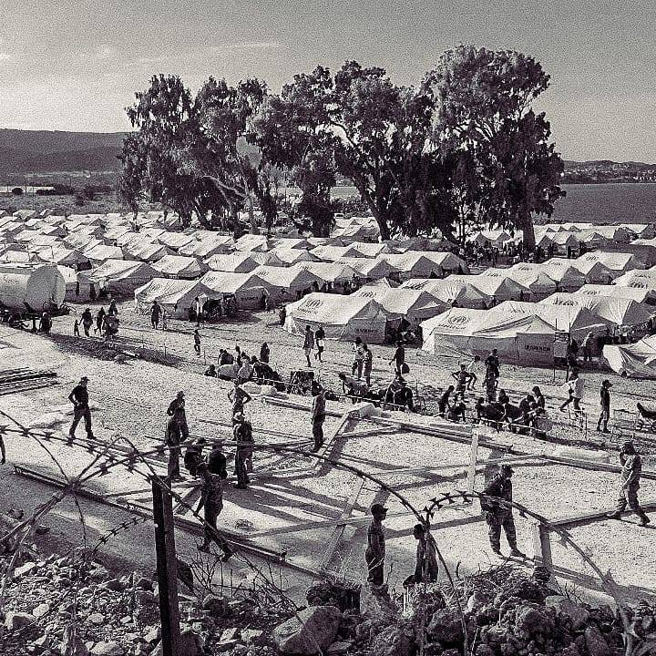

### AYS Daily Digest 21/09/20: A young writer’s memories of Moria
#### Updates from the new camp in Kara Tepe // A baby born on a boat off the coast of Lampedusa // 125 people on ALAN KURDI in need of a safe port // More police violence at BiH border, people drowning every week // New Protests in Postojna camp in Slovenia // Updates from UK

The new Kara Tepe camp\. Copyright: Refocus Media Lab
### FEATURE: My pen won’t break, but borders will

In today’s feature we want to give space to the voice of a young girl from Afghanistan who speaks about her experiences\. Parwana Amiri lived in Moria after reaching Lesbos in September 2019 together with her family\. In the camp she had been writing about her experiences, often at night, when the other eight people she was sharing a tent with were asleep\. Alarmphone has now published her first book\. Moria might have burned down, but a new camp has been erected\. So far there has been no change in European policy\. As long as this is the case, the voices of brave people like Parwana need to be heard\.

> “ **Put yourself in our shoes\!** We are not safe in Moria\. We didn’t escape from our homelands to stay hidden and trapped\. We didn’t pass the borders and risk our lives to live in fear and danger\. 

> **Put yourself in our shoes\!** Can you live in a place, that you cannot walk alone even when you just want to go to the toilet\. Can you live in a place, where there are hundreds of unaccompanied minors that no one can stop from attempting suicide\. That no one can stop from drinking\. \[…\] 

> In this situation the first thing that comes to my mind to tell you is, we didn’t come here to Europe for money, and we did not come to be European citizens\. It was just to breathe a day in peace\. 

> Instead, hundreds of minors here became drug addicts, **but no one cares\.** 

> Five human beings burned, **but no one cares\.** 

> Thousands of children don’t have their vaccinations, **but no one cares** \. 

> I am writing to you to share and I am hoping for change…” 

In her letters, Parwana puts herself in the shoes of different people living in the camp: a young teenage girl like herself, living in a crowded space together with strange men; an old woman who is fighting for her sick husband; a transgender person; a young unaccompanied minor; a mother and wife of a paralyzed man\.
With endless empathy, Parwana speaks about the everyday suffering, the dreams and beliefs of the people around her\. This is a strong testimony from the heart of Europe’s failure, writen by a talented young writer who is not only aware of the emotions of the people around her, but also of the world we live in, which constantly reproduces exclusion and degradation:

> “Stop lying and pretending that people are safe here\. Stop saying Europe is a better place, when it is only better for some and not even accessible for others\. 

> My pen won’t break until we end this story of inequality and discrimination among human kind\. My words will always break the borders you built\.” 

For the full book, click on the link in the tweet:

■■■■■■■■■■■■■■ 
> **[Alarm Phone](https://twitter.com/alarm_phone) @ Twitter Says:** 

> > The horrible camp in Moria has burned down, but the suffering on #Lesvos continues. Read the wonderful texts by @[ParwanaAmiri](https://twitter.com/ParwanaAmiri): “My pen won’t break, but borders will”. The publication is supported by Alarm Phone and @[w2eu](https://twitter.com/w2eu). [lesvos.w2eu.net/files/2020/04/…](http://lesvos.w2eu.net/files/2020/04/broshure-Letters-from-Moria-202002-screen.pdf) https://t.co/nfnkkK46jA 

> **Tweeted at [2020-09-21 15:10:23](https://twitter.com/alarm_phone/status/1308061017470099457).** 

■■■■■■■■■■■■■■ 

### CYPRUS

The number of people boarding boats bound for Cyprus form Lebanon has been increasing sharply in the past months\. While the situation in Lebanon has been deteriorating for years, the explosion in the port of Beirut at the beginning of August seems to have been the last element in a chain of events that made many people decide to leave\. 
Between the start of July and mid\-September, 21 boats left for Cyprus, while a total of 17 boats left in the whole of 2019\.
For more information, see:

### GREECE

Six Afghan nationals, two of them minors, are in custody by order of a prosecutor\. They are charged with arson and participation in a criminal group, as the prosecutor holds them accountable for the fire that destroyed Moria camp\. The six men denied the charges against them and say they have been falsely accused\. This is going to be a political case, especially since various ministers have already announced that the perpetrators have been found, without waiting for the court’s decision\. We will watch it closely\.

The original Kara Tepe camp on Lesvos for vulnerable people which has much better conditions then Moria ever had, is to be closed by December 31st\. This has been announced by the Minister of Migration and Asylum\. It is unclear what will happen to the families and vulnerable people who are living there\. 
Meanwhile, the shortcomings of the new camp at Kara Tepe for the people from Moria right next to the old camp are becoming more and more obvious\. Around 10,000 people are living there so far\. Apparently there are still only portable toilets and no showers with running water\. Mattresses are scarce; many people have to sleep on the bare ground\. Food is only distributed once a day\. Many people have to walk to the nearby LIDL supermarket in order to buy extra supplies\. It is the same supermarket that decided not to support them with food and water, but instead to close its doors when they were stranded on its parking lot last week\. On some days people are allowed to leave between 8am and 8pm, on others day have to register first\. 
So far 243 people have been tested positive with Covid\-19 in the new camp\. Most of them seem to be asymptomatic\.

This blogpost closely examines the various methods the Greek government is using in order to lower the number of people seeking asylum\. While the Greek government is boasting of the decrease in the numbers of asylum applications, all the tactics applied are illegal\. They include pushbacks at sea and at land, abandonment at sea and deportations\.

Between 7 and 13 September, a total of 99 people arrived on the Aegean islands, according to UNHCR’s Weekly Snapshot\.
### SEA

Fishermen stepped in to save lives when the responsible authorities stayed inactive\. On Saturday, a Libyan fisherman alerted Alarmphone about a shipwreck\. He himself managed to rescue 21 people, but had to leave 32 people behind\. Both the fisherman and Alarmphone tried to inform the authorities, but they remained inactive\. While the Italian authorities refused responsibility, the so called Libyan coast guards told Alarmphone to call again the next day\. The fisherman then alerted his colleagues who seem to have managed to save most of the people\. However, three people are missing and feared dead\.

Once again, a mother gave birth to a child on board a small boat on its way to Lampedusa\. A medical team of CISOM, an Italian NGO, provided first support for the mother and baby\. The child is called Mahadi\. No mother should have to go through something like this\.

Over the weekend, the ALAN KURDI ship rescued a total of 133 people in three different operations\. Among them were 62 children, the youngest of them being only five months old\. 
Until the time of writing, none of the responsible authorities assigned a port of safety for the rescued people\. The Italian authorities refused to act and instead referred the crew to the German authorities, as the ship is sailing under a German flag\. 
Eight people, four of them children and one a baby, have been evacuated by the Italian coast guard\.

For more information, see:

After Sea Watch’s airplane Moonbird was grounded by the Italian authorities, test flights are being made with a new airplane called Seabird\. With air surveillance, Sea Watch is making an important contribution to not let any shipwrecks and pushbacks happen without being noticed\.

■■■■■■■■■■■■■■ 
> **[Sea-Watch International](https://twitter.com/seawatch_intl) @ Twitter Says:** 

> > Our #Seabird is flying!
Because we will continue until no one has to drown in the Mediterranean while fleeing and the responsible European actors are finally brought to justice! https://t.co/uGIS81NXMl 

> **Tweeted at [2020-09-21 16:50:38](https://twitter.com/seawatch_intl/status/1308086246724513792).** 

■■■■■■■■■■■■■■ 

### BOSNIA — HERZEGOVINA

Ahead of the coming elections in BH, the already grave situation is getting worse and people are reporting that many have been left homeless due to a lack of accommodation across the country, notably for families who were trying to get into the Usivak camp and another family camp in the Una\-Sana canton\. The situation is unbearable for those arriving, and provides cheap political points for the many politicians trying to gain populists’ support\. There is no support for new lodging to be opened anywhere at the moment and, even though they would need the approval and agreement of the official state, the international organisations present in the country are nowhere near doing what they could, nor being vocal enough to stress the urgency of the situation\. Nothing much has changed except that the consequences are getting much more serious in the meantime\.

Klikaktiv NGO has reported about massive police violence against people who cross the Drina river from Serbia into BH\. An abandoned train station in Banja Koviljača is the point of gathering for people who try to cross or have just been pushed back\. People try to cross the river from Serbia with small boats\. If caught by BH police, they are often forced back into the river without boats instead of just being sent over the bridge\. 
On the morning of 16 September, a group of people had just been pushed back into the Drina river\. Two young men did not survive this\. According to one of the survivors, the policeman was laughing at them while they fought for their lives\.

> “Every week the river eats at least five people” he was repetitively saying to us… 

### SERBIA

NoNameKitchen has published a report by a medic who has been on the ground in Šid\. He reported that many of the people he treated have vitamin deficiencies and are dehydrated, due to lack of access to food and water\. With a weakened immune system, it is much harder for wounds — caused by mosquito bites or inflicted during pushbacks — to heal\. Also, the long hours of walking cause injuries such as sprains or fall fractures\. Especially people with long\-term health problems face difficulties, as they have no access to the Serbian health system\. The volunteers themselves are not allowed to provide medication\. 
No Name Kitchen’s Health on The Move project collects cases of people who need medical treatment and seeks other people willing to cover these expenses, partially or fully\. If you want to know more and you have an interest in helping to cover the medical costs of people in need, you can write to [Info@nonamekitchen\.org](mailto:Info@nonamekitchen.org) \.
### SLOVENIA

At the beginning of August, a group of people detained in the Postojna detention centre started protesting against the conditions in the centre, their lack of access to legal procedures and their fear of illegal deportation\. 
On Sunday, the group started a hunger strike\. With the support of Info Kolpa they published a statement in which they call out the degrading and humiliating conditions in the camp\. The detainees are only allowed one hour of sun and fresh air each day\. They are not allowed to leave the complex\. The police in the centre often bring dogs along to threaten the detainees\. There is no proper medical treatment, people will get the same pain killer regardless of what their illness is\. Access to information about the legal process is hard to get, as is contact with the world outside, including lawyers\. Many people live under a constant fear of being deported to Croatia\. From the statement:

> “We are electricians, taxi drivers, clothes designers, workers, sellers, marathon runners — we are people\. We are open\-minded and peaceful but we demand fair treatment for everybody who is detained in Postojna\. The regime of detention and the situation of uncertainty is killing our spirit and the people responsible for this situation want to take away our dignity\. We will not allow this\. We demand our rights to be respected\! We demand freedom of movement\!“ 

While many of the people detained in the centre haven’t had a chance to apply for asylum yet, some people who are currently undergoing the asylum process are also being held in the closed facility\. A new directive was given to the police in June to detain people for the time of the asylum procedure\. This is clearly an arbitrary detention\. Many people appealed against their detention at the administrative court and the court described their detention as unlawful\. Read more about the centre and the situation at the beginning of August in our Special\.

For the full statement, see:

### SPAIN

A total of 41 people have been rescued from three boats in the Alboran Sea on Monday\. They all landed in Almeria\. Among them were two children and a pregnant woman\. 
Another 68 people were rescued when heading towards Gran Canaria in five different boats\.
### FRANCE

In East Paris, an apartment for young LGBT refugees has been opened\. Three young Africans moved in together, all of them victims of homophobic violence\. Many LGBT people face discrimination and violence, not only in their country of origin and along their flight route\. In facilities in Europe they are often not properly protected from attacks, either\.

For more information, see:

The French NGO Human Rights Observers reported that on 21 September the 747th expulsion since the beginning of the year took place, once again in Calais\. Informal migrants who try to find a way to reach the UK are constantly subject to violent expulsions, destruction of their possessions and ill\-treatment by officials\.
### UNITED KINGDOM

On Monday, a first group of people arrived at new temporary accommodation for up to 400 people who arrived in the UK by boat via the Channel\. The temporary accommodation is situated in former army barracks in Folkestone, right next to Dover\. 
It has to be feared that local far\-rights might form a protest against the new centre\. In a video posted on Youtube a far right activist said that forming a militia would be an adequate response to the development\. Other places where housing systems for newly arrived asylum seekers are planned saw protests, for example a site in Tenby, Wales, where 200 people demonstrated against the new facility last week\.

Meanwhile, thousands of asylum seekers who received a negative decision in the UK are at risk of becoming homeless\. The Home Office announced that it would lift a ban on asylum evictions\. Starting at the end of March, the Home Office stopped evicting people after their claim has been decided, as a protective measure in response to the pandemic\. Now this ban is being lifted, although the UK is seeing a second wave of coronavirus and even a new lockdown is being discussed\. Many charities and MPs denounced this decision and called it “utterly appalling”\.

For more information, see:

A scheme of relocation for former Afghan interpreters for the British army will be expanded, the home office announced on Saturday\. People who served a minimum of 18 months on the frontline and were then forced to resign due to threats by the Taliban are now eligible to apply for asylum in the UK\.

For more information, see:

### EU

The European Commissioner for Home Affairs Ylva Johansson stated in an interview with Euronews that

> “I think it is clear that migrants are paying a high price every day for us not having a common European policy\.” 

Ahead of the presentation of the new EU pact on migration and asylum which is to be published tomorrow, 23 September, she stated that Moria was the result of a lack of a common European asylum policy\. She also reiterated that too much space has been given to extreme right voices in the past\.

> “We should focus on how we manage migration in a decent way\. This is what the citizens want from us\. Migrants are like you and me\. Men and women, boys and girls\. They have different opinions and experiences\. They are human beings and must be treated accordingly\.” 

It seems very unlikely that the new pact will bring profound change and end the situation of total neglect of human rights at the European border\. We will continue to cover this topic\. 
Meanwhile the European Council on Refugees and Exiles \(ECRE\), an alliance of 106 NGOs across 40 European countries, has published a joint statement in order to appeal to the EU institutions and member states to revive and increase resettlement efforts\. Some 10,000 refugees are waiting for their resettlement, which has been cancelled due to pandemic\-related travel restrictions\. 
In countries like Lebanon, Uganda and Libya the need for resettlement of particularly vulnerable people has increased dramatically over the past months\. In 2019, the EU set a target of resettling 30,000 people in 2020\.

For the full statement, see [here](https://www.ecre.org/wp-content/uploads/2020/09/Joint-Statement.-Resettlement-can%E2%80%98t-wait.pdf) \.
### WORTH READING

As so often, the most vulnerable people are most affected in times of crisis\. The Norwegian Refugee Council reported in a survey that three quarters of displaced and conflict\-affected people have lost income since the start of the corona pandemic\.

**Find daily updates and special reports on our [Medium page](https://medium.com/are-you-syrious) \.**

**If you wish to contribute, either by writing a report or a story, or by joining the info gathering team, please let us know\.**

**We strive to echo correct news from the ground through collaboration and fairness\. Every effort has been made to credit organisations and individuals with regard to the supply of information, video, and photo material \(in cases where the source wanted to be accredited\) \. Please notify us regarding corrections\.**

**If there’s anything you want to share or comment, contact us through Facebook, Twitter or write to: areyousyrious@gmail\.com**

_Converted [Medium Post](https://medium.com/are-you-syrious/ays-daily-digest-21-09-20-a-young-writers-memories-from-moria-d0b00f76ba24) by [ZMediumToMarkdown](https://github.com/ZhgChgLi/ZMediumToMarkdown)._
