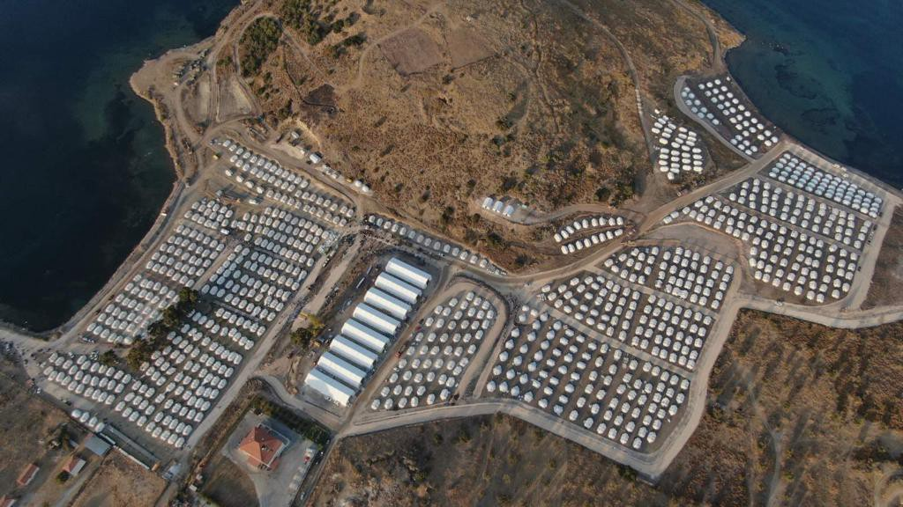
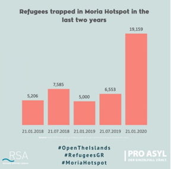
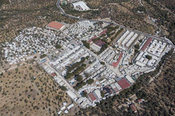
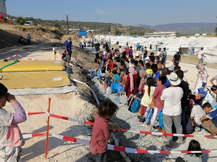
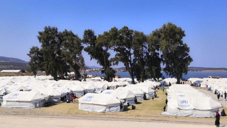

### AYS Special: Moria Was Not Built in A Day
#### _This was inescapable\. Yet perfectly avoidable\._

On the night of Tuesday 8th September, a massive fire broke out in the camp of Moria, Lesvos\. Moria is — or used to be — the biggest “hotspot” of Europe, a vast area where around 13’000 displaced people lived in containers, tents, and makeshift structures, under the worst conditions in the EU\.

The existence of Moria is not an exceptional accident, but rather a [direct consequence](https://www.thenewhumanitarian.org/opinion/2020/09/17/Moria-camp-fires-migrants-asylum-seekers-EU?utm_source=The+New+Humanitarian&utm_campaign=17e5eb3d88-EMAIL_CAMPAIGN_09_17_2020_DAILY&utm_medium=email&utm_term=0_d842d98289-17e5eb3d88-75570833) of EU migration policy\. In 2015, the European Commision introduced a [resolution](https://www.europarl.europa.eu/RegData/etudes/BRIE/2018/623563/EPRS_BRI(2018)623563_EN.pdf) that would determine the EU’s approach to migration policy for years to come\. This “hotspot approach”, which turned what was initially meant as an _emergency response_ into a _permanent structural feature_ of EU and member states’ migration reception management, gave birth to a [number of overpopulated camps,](https://respondmigration.com/blog-1/respond-press-release) just like Moria, formally known as Registration and Identification Centres \(RICs\) \.

These RICs became a bottleneck in the EU’s migration flow\. In Greece, restriction of liberty for “third\-country nationals” as a standard procedure for the functioning of the centre was originally introduced in Law [L\. 4375/2016 \(Art\. 14–16\)](https://www.refworld.org/docid/573ad4cb4.html) in 2016\. Furthermore, a [Decision](https://www.asylumineurope.org/reports/country/greece/asylum-procedure/access-procedure-and-registration/reception-and) issued in 2018 by the National Asylum Service currently allows for a “geographical restriction” for asylum seekers located on the designated island camps\. In a word, displaced people are prohibited from travel to the Greek mainland until they receive the results of their asylum procedures\. This process is notorious \(certainly among asylum seekers but less so across the EU\) for its length, in many cases lasting months, if not years\.

The whole endeavour around the settlement and maintenance of the “hotspots” would not have been feasible if not for the famous [EU\-Turkey statement of 2016](https://ec.europa.eu/commission/presscorner/detail/it/MEMO_16_1494) , which makes the unwarranted claim that Turkey is a “safe third country” a basis for migrants’ detention on the Greek islands, meaning that people whose claims are rejected can in theory be deported there directly\.

At the time of the fire, the RIC of Moria had an [official capacity](https://www.amnesty.org/en/get-involved/take-action/greece-moria-refugees-fire-danger/#:~:text=At%20the%20time%20of%20the,official%20capacity%20of%20under%203%2C000.) of under 3’000 people\. In spite of this limit, the Greek government has forced thousands of asylum applicants to remain on the island despite inadequate reception facilities\. Conditions in Moria have been denounced by multiple actors over the last five years, the overcrowding, the dismal [hygiene standards](https://www.asylumineurope.org/reports/country/greece/reception-conditions/housing/conditions-reception-facilities) in the military base and in the Olive Grove that surrounds it, as well as a lack of access to sufficient [healthcare provision](https://www.msf.org/greece-overcrowded-dangerous-and-insufficient-access-healthcare-moria) have all been [well documented](https://www.theguardian.com/global-development/2020/jan/17/moria-is-a-hell-new-arrivals-describe-life-in-a-greek-refugee-camp) by Moria residents and [NGOs supporting them](https://rsaegean.org/en/moria-nightmare/) \. Instances of violence, including [sexual assault](https://www.unhcr.org/news/stories/2019/12/5defbaeb4/asylum-seeker-greece-speaks-violence-upended-life.html) , have been a lived reality for many people residing there\. Something that even the UNHCR has [not failed to acknowledge](https://www.unhcr.org/news/latest/2019/11/5ddfa7654/unhcr-chief-urges-action-conditions-asylum-seekers-greek-island.html) , calling for Greek and EU authorities to intervene\.

Not surprisingly, asylum seekers in Moria have often [protested](https://www.reuters.com/article/us-europe-migrants-greece-lesbos-protest-idUSKBN1WG3W7) their situation, especially in response to deaths in camps as a direct result of living conditions, but these have never been met with concrete change\. Having had their voices ignored for so long, one of the many tragedies they feared could happen, has come to pass\.

During the months of general lockdown, continuous transfers to the mainland, coupled with a swift reduction in the arrivals to all the Aegean islands largely due to [illegal pushbacks in the Aegean sea](https://www.theguardian.com/commentisfree/2020/aug/27/greece-migration-europe-athens-refugees) , had relatively [decreased](https://aegeanboatreport.com/monthly-reports/) the total numbers of Moria population\. Nonetheless, after a first case of coronavirus infection was [detected in the camp](https://www.infomigrants.net/en/post/27000/greece-first-covid-19-case-at-moria-migrant-camp) , on September the 2nd, [strict restrictions](https://www.ecre.org/greece-10000-people-prevented-access-lockdown-extended-recognition-rate-increases/) were imposed on the whole population of Moria\. Ultimately, boosting tensions amongst residents because the lockdown in Moria implied not solely a limitation of movement in and out of the camp, but much [wider limitations](https://reliefweb.int/report/greece/periods-don-t-stop-during-pandemic-supply-hygiene-products-locked-down-refugee-camp) in access to health provision, legal assistance, hygiene items, food and drinking water or participation in many activities such as language classes\.

It must be stressed that, for all the families and individuals forced by necessity to reside in the military base, the barracks or tents in the Olive Grove, nothing about their stay there was ever “safe” nor “sustainable”\.

Moria was never a “shelter”\. It was nothing more than a prison camp\.

_](assets/9d64d83d4462/1*UIsXytODUieL8IBLotafvA.png)

_Moria in September 2019 and January 2020, by: [Ihab Abassi](https://www.facebook.com/ysalaam)_
### **_The Fire_**

On the night between the 8th and the 9th of September, a few minutes before midnight, organizations on the ground started to raise the alarm through social media\. At 00:05 the group Stand By Me Lesvos reported that the fire brigade had been stopped at the entrance of Moria because of “angry protests”\. Before long, the fire had reached the new [camp hospital](https://www.facebook.com/www.standbymelesvos.gr/posts/711316812794677) , and about half an hour after this several of the [asylum office’s facilities](https://www.facebook.com/www.standbymelesvos.gr/posts/711330916126600) were burning\.

The fire eventually reached the [military base](https://www.facebook.com/www.standbymelesvos.gr/posts/711336649459360) and, without the intervention of any authority, people began trying to [escape](https://twitter.com/dunyacollective/status/1303954666108137472?s=21) while some reportedly tried to steal items from the remnants of the camp\. [Almost two hours](https://www.facebook.com/www.standbymelesvos.gr/posts/711345796125112) after the first alarm, police are said to have arrived at Moria, ordering the immediate evacuation of the camp — and in some cases enforcing orders through violent [use of teargas](https://twitter.com/dunyacollective/status/1303800403470045184?s=21) , including against families with children\. At this point the dispersed crowd was reportedly [attacked by locals](https://www.facebook.com/www.standbymelesvos.gr/posts/711359092790449) trying to prevent them from reaching the nearby village\.

The [images of the early morning](https://twitter.com/kallergisk/status/1303554698083995650?s=21) of the 9th show complete devastation\. Moria is covered in ashes and most of the Olive Grove has been devoured by the fire\. Among the general havoc that surrounds the burned down camp, locals are stated to have [taken action](https://www.news247.gr/koinonia/akrodexies-peripolies-xana-gyro-apo-ti-moria.7851920.html) against the intervention of humanitarian actors, including the MSF team who could not access their [clinic](https://twitter.com/MSF_Sea/status/1303984049900392449) to provide medical assistance as they were obstructed by an angry mob\. The now ex\-residents were dwelling on the sides of roads, in the woods, on the beaches or even [in a nearby cemetery](https://edition.cnn.com/2020/09/11/europe/gallery/moria-camp-displaced-lesbos-homeless/index.html) \. It took the whole day for the firefighters to put out the last flames\. However, in the night between the 9th and the 10th, a [second fire broke out](https://www.euronews.com/2020/09/10/new-fire-at-overcrowded-migrant-camp-on-greek-island-of-lesbos) , albeit less severe than the previous one\.

In the following days, NGO Refugee Support Aegean was able to give [voices](https://rsaegean.org/en/voices-of-refugees-three-days-after-the-destruction-of-moria-camp/) to some people who had been most affected by the fire, while Action for Education/Europe Must Act continue to publish [daily updates](https://fr.europemustact.org/moria-fire-daily-update) on the aftermath\.
### _Security Concerns Instead of Human Rights_

On Friday 11th, when no reliable source had yet suggested a plausible cause for the source of the fire, Hellenic Migration Ministry officer Konstantinos Kostakos came up with the following [statement](https://edition.cnn.com/2020/09/11/europe/lesbos-fire-migants-moria-camp-intl/index.html) : “ _The Greek government will not be blackmailed\. What happened — this ‘burn and go’ tactic — will not be tolerated_ ”\.

For his part, Greek Prime Minister [Kiriakos Mitsotakis said](https://www.cnn.gr/politiki/story/233813/mitsotakis-gia-moria-h-katastasi-den-mporei-na-synexistei) : “ _Nothing can become an alibi for violent reactions to health checks\. And, much more, for riots of this magnitude_ ”\. Both the [Greek government](https://www.independent.co.uk/news/world/europe/lesbos-greece-fire-refugee-camp-destroyed-b420915.html) and the [national media](https://rmx.news/article/article/greece-migrants-deliberately-set-fire-to-moria-camp-once-again-this-time-destroying-it-entirely) promptly pointed the finger at displaced people\. Statements of this sort, in absence of any clear explanation for the cause of the fire, are both _groundless_ and, what is worse, dangerously close to a logic of _victim blaming\._ Any discussion regarding the reasons behind the fire should take place only after an effective investigation based on clear evidence\.

Of course, the Prime Minister added that things would have been much worse if the Greek state had not [blocked new migration flows](https://www.cnn.gr/politiki/story/233813/mitsotakis-gia-moria-h-katastasi-den-mporei-na-synexistei) in the meantime, seemingly in reference to the illegal push backs they have so far denied\. This statement shows clearly that the fire is feeding populist discourses and playing a role in legitimizing the increased militarization at the borders of the European Union\.

Eventually, the Greek state put the entire island under a [state of emergency](https://greece.greekreporter.com/2020/09/09/greek-island-of-lesvos-in-state-of-emergency-after-catastrophic-fire/) \.

Among the first measures taken as a response to the fire was the relocation of 406 unaccompanied children to the mainland and 50 women to a school in Mytilene\. Yet for the vast majority of Moria’s 13’000 ex\-residents, the authorities opted for the opening of a new “temporary accommodation centre”, with capacity for only [around 5’000 people](https://www.ruptly.tv/en/videos/20200916-002-Greece--Construction-of-new-Lesbos-camp-continues--5-000-beds-ready) , in a [shooting range area](https://twitter.com/DunyaCollective/status/1306303797136941056) close to the pre\-existing centre of Kara Tepe\.

These would be far more “admirable gestures” if they were not reactionary responses to an avoidable catastrophe\. Although it is certainly positive that the government apparently appreciates the urgency of the matter, the state of emergency has _de facto_ implied a toughening of checks and roadblocks by the police and thus, for many NGOs, the [impossibility](https://www.theguardian.com/global-development/2020/sep/09/catastrophe-warning-as-thousands-left-homeless-by-lesbos-refugee-camp-fire) of reaching their warehouses or the people they work with\.

One humanitarian worker, who reached out to us from Lesvos, describes the situation as follows: _“Basically the area where most of the refugees currently are, between the new camp and Kara Tepe, no one is allowed there except for NGOs distributing food\. The access is still really, really limited\. NGOs still don’t know what’s happening, there is a lack of communications about the new camp, and about the services that are gonna be there… So no one knows what to prepare for\. There was a big call, in the first day or two days after \[the\] fire, for people to say what they can provide in terms of non\-food items but… it’s a week now, and no responses”\._

The overall response of the Greek government to the fire, including the shipping in of more riot police from Athens, was not at all surprising\. Once more, just as happened [last March](https://www.bbc.com/news/world-europe-51721356) , when there was clashes at the Evros border resulting in the death of at least two refugees, the “protection of borders” and “national security” concerns found their place at the centre of the discussions\. That is, stealing the space for an acknowledgement of something like “human rights”\.
### “New Moria” Opening: Women and Children First

On Thursday 10th of September the European Commissioner for Home Affairs [Ylva Johansson told](https://www.ecre.org/greece-moria-fire-thousands-sleeping-rough-chaos-prevails-calls-for-structural-solutions/#:~:text=At%20a%20meeting%20with%20the,will%20not%20fund%20closed%20camps.) the EU Committee on Civil Liberties, Justice and Home Affairs that the EU _“will not fund closed camps”_ \.

Five days later, and a week after the fire, flyers were handed out to the ex\-residents of Moria, reporting the “Official announcements of the Greek Government” concerning the transfer of refugees to the newly settled camp, [on the shore North of Kara Tepe](https://migration.gov.gr/location-of-the-camp/) \. It reads as follows:

> Your temporary accommodation center is ready\. Kindly proceed immediately to your arrival to the field\. Your residence in that field is mandatory for securing decent conditions of living, for reasons of public and personal health, and for the restart of the asylum procedure, as well\. In the field you will be totally safe\. Accommodation, alimentation, water, electricity and items of personal hygiene are provided\. Priority is to be given to families and vulnerable groups\. 

> Asylum procedures have normally been commenced anew in the field\. We have prepared this field in order for you to await under safety and to depart from Lesvos as soon as possible, complying with the legal procedures\. Only in case you arrive at the field, the procedures for departing from Lesvos will be completed 

It is remarkable, that even in the aftermath of a tragedy triggered by the forcible restriction of an overcrowded population, the Greek government has decided once again to massively concentrate asylum seekers in an enclosed space\. Regardless of the unacceptability of such a large scale gathering of people for reasons of Covid\-19 transmission risks\.

Furthermore, it is utterly **unacceptable that displaced people should see their right to asylum procedures being bound to their physical presence in a camp\.** This is, to all intents and purposes, _blackmailing_ \.

We were also able to get in contact with an ex\-resident of Moria, who is now about to enter the newly established camp\. This is the description we were given: “ _We don’t know yet if it’s a closed camp, but it’s sure that we are in quarantine for now\. They are doing covid tests to everyone who arrives at the camp and they give you a number\. If you are positive you are put in a separate place, if you are negative you enter the camp\. They gave us blankets and soap but they are still lacking\. Especially drinkable water\. There is no drinkable water\. Also, for the food, you can wait even 3 hours to have the food\. And they are giving food 1 time a day\. And we are around 1000–1500 people in the camp for now\. Imagine when there will be 13\.000 people… For the toilets, there are only temporary toilets for now\. The EU helped us with this camp and that was our only solution to take a rest\. There are still places for now\. But not enough for 13\.000 people_ ”

In case the wording “closed camp” sounded too euphemistic, let’s call it what it really is — which is an “asylum prison”: a place where men, women and children are forced to stay until their asylum applications are processed\. Let’s remember, inter alia, that no piece of legislation allows the detention of individuals on the sole basis of the demand for international protection\.

It is absolutely time for the EU to step up, do what it should already have done, and take the 12,589 people whose tents or containers were destroyed in the fire, to places of secure housing in other EU countries\.

Once again, the only true solution must be a structural solution\. Refugee camps are not the answer, only a deep and comprehensive reframing of the entire migration and asylum policy will bring about lasting change\. Otherwise, we might as well get prepared for the next disaster\.
### _Talking About Solutions…_

In a [statement](http://nchr.gr/images/English_Site/NEWS/GNCHR%20Statement%20on%20Moria.pdf) issued by the Greek National Commission for Human Rights in response to these events, immediate termination of the “geographical restriction” imposed on applicants for international protection in the Eastern Aegean islands was suggested as a part of this solution\. People should be transferred to the mainland, into appropriate long\-term accommodation facilities with a minimum decent standard of living\.

However, [according to the declaration](https://www.gcr.gr/en/news/press-releases-announcements/item/1499-joint-statement-of-31-ngos-regarding-moria-refugee-camp-fire) published by 31 civil society organizations, including Amnesty International and Human Rights Watch, moving people from Lesvos to the mainland requires urgently addressing the fact that many current housing facilities for refugees and asylum seekers are already at full capacity\. This is partly as a result of recognised refugees previously transferred being placed in mainland camps after being left [homeless on the streets of Athens](https://medium.com/@the.crisis.isnt.over/what-use-is-being-recognised-as-a-refugee-if-you-still-cannot-survive-91dd2579c4be) \.

On September 16th, in her [address on the State of the Union](https://ec.europa.eu/commission/presscorner/detail/en/SPEECH_20_1655) , President Von Der Leyen announced the intention of her Commission to see the Dublin Regulation reformed, or [even abolished](https://www.lemonde.fr/international/article/2020/09/16/sante-environnement-minorites-ursula-von-der-leyen-devoile-son-plan-de-bataille-pour-l-union-europeenne_6052412_3210.html) , through the New Pact on Migration, to be [revealed on September 23rd](https://www.europarl.europa.eu/legislative-train/theme-promoting-our-european-way-of-life/file-a-new-pact-on-migration-and-asylum) \. We still have to wait and assess the actual content of this New Pact\. Yet, regardless of the President’s [supposed sensibility](https://twitter.com/vonderleyen/status/1303651435716935680) to the predicaments of displaced people on European soil, all good intentions and sweet talk will be worthless if the EU as a whole, and all its member states, don’t cease their reactionary and chauvinist attitudes when discussing asylum management and migration\.

A coherent plan that maximizes all available resources including those from the EU must be put in place\. And European leaders need to accept their share of the responsibility for the reception and support of asylum seekers\. Now more than ever\.

The first step towards a sustainable solution should be a review of the whole EU Migration Policy under “European common values”\. This would imply, above all, the complete dismantlement of the “hotspot approach” and the revision of the 2016 EU\-Deal Statement\.

And there is no way around it\.

Let’s remember that European institutions and individual Member States are bound by the obligation to abide by “European common values” and the [Charter of Fundamental Rights](https://eur-lex.europa.eu/legal-content/EN/TXT/HTML/?uri=CELEX:12012P/TXT&from=EN) \. In case anyone has forgotten what these common values look like, they are listed in Article 2 of the [Treaty on European Union](https://eur-lex.europa.eu/resource.html?uri=cellar:2bf140bf-a3f8-4ab2-b506-fd71826e6da6.0023.02/DOC_1&format=PDF) : “ _human dignity, freedom, democracy, equality, the rule of law and respect for human rights, including the rights of persons belonging to minorities_ ”

Just to be clear, respect for “human dignity” does not look like hundreds of [neglected children](https://www.msf.org/deliberate-neglect-greek-and-eu-authorities-towards-those-trapped-islands?component=image-272646) , pushed to self\-harm and attempted suicide\. And “freedom”, “equality”, and “rule of law” do not imply displaced people being treated as if they were livestock\.

Also, the values of the European Union, one of the richest and most prosperous societies in human history, do not include the principle “imprison everyone who wants to be part of this\.”

While all this human tragedy takes place within the borders of the European Union, other European States continue to express their “concern” and “sorrow”\. NGOs are excluded by police intervention and their access to people on the move is restricted\. While the lives of the volunteers are being put in danger, there is no one left to speak up for refugees who are being silenced\.

During the final drafting of this article, we received these words from an asylum seeker, currently in Lesvos: “ _We are tired\. We did and gave a lot; we walked, we stayed on streets, we had police intervention and tear gas, we carried children, babies and women… That’s why we decided to enter the new camp\. Not because of the sufficient conditions but just to take a rest after this week in fire”_ \.

We don’t need a new Moria camp\. We don’t need new “hotspots” whose sole effect is to produce a far\-fetched sense of “communitarian security” at the cost of creating persistent humanitarian disaster\.

We need to remember that we only have one planet to live on and we have huge crises to deal with, together\. To face it, we therefore need strong international collaboration, guided by a feeling of shared responsibility and solidarity\.

We must hope that one day, the ones responsible for these mass human rights violations and wars will be indicted\. That one day, people will be free to choose where to live\. That people fleeing from war, violence and persecution won’t face similar horrors in the place where they seek refuge\.

_Please take the time to sign a [petition](https://www.change.org/p/european-commission-fire-moria-camp-call-for-urgent-evacuation-and-radical-change-2?utm_source=share_petition&utm_medium=custom_url&recruited_by_id=ad898530-5d4c-11ea-9bd3-c5003960dc13) issued by a comprehensive grouping of NGOs to raise your voice about the emergency in Moria\. You can also contribute to the humanitarian effort by donating to NGOs such as [Movement on the Ground](https://www.facebook.com/movementontheground/posts/1820290358147268) , [Refocus Media Lab](https://www.facebook.com/refocusmedialabs/posts/3022530081310534) , [WHF](https://www.gofundme.com/f/FIRE-EMERGENCY-IN-MORIA-REFUGEE-CAMP---WHF-SCHOOL?utm_medium=chat&amp;utm_source=whatsapp-visit&amp;utm_campaign=p_lico+share-sheet) , or [others](https://www.facebook.com/104103804535656/posts/172314817714554/?extid=H8S3g65glPPhd2c2&d=n) \._

**_Written by: Damla Ilbas & Simone Innico,_** _8th of September 2020_

**Find daily updates and special reports on our [Medium page](https://medium.com/are-you-syrious) \.**

**If you wish to contribute, either by writing a report or a story, or by joining the info team, please let us know\.**

**We strive to echo correct news from the ground through collaboration and fairness, though volunteer work\. Every effort has been made to credit organisations and individuals with regard to the supply of information, video, and photo material \(in cases where the source wanted to be accredited\) \. Please notify us regarding corrections\.**

**If there’s anything you want to share or comment, contact us through Facebook, Twitter or write to: areyousyrious@gmail\.com**

_Converted [Medium Post](https://medium.com/are-you-syrious/ays-special-moria-was-not-built-in-a-day-9d64d83d4462) by [ZMediumToMarkdown](https://github.com/ZhgChgLi/ZMediumToMarkdown)._
