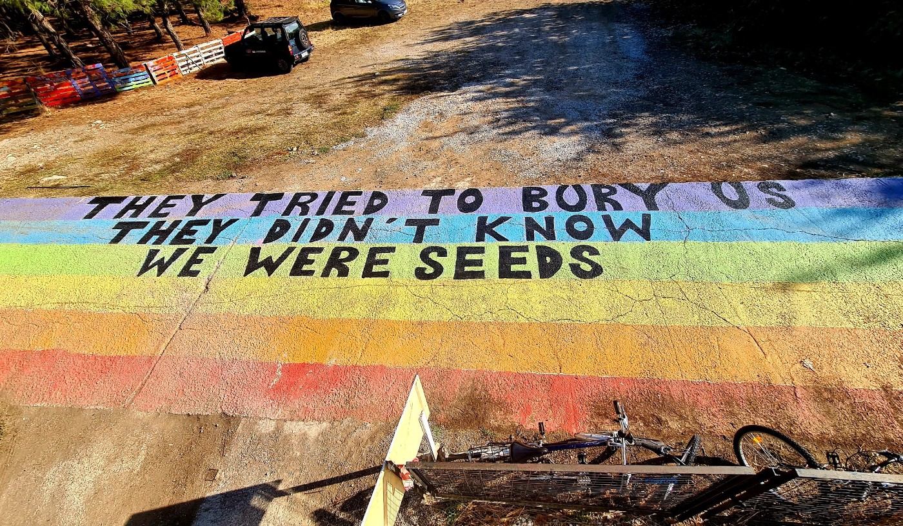
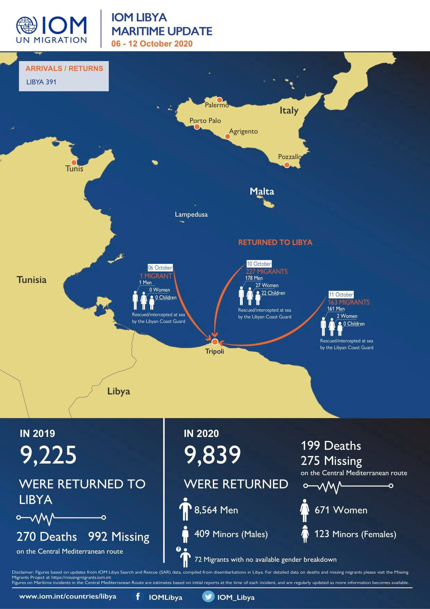
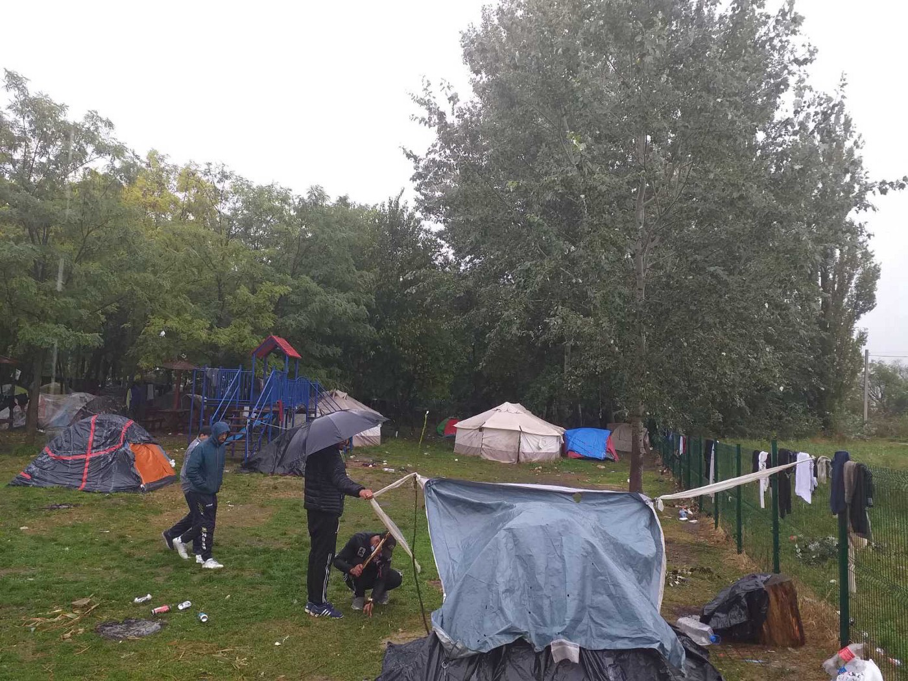

### AYS Daily Digest 12/10/2020 — Updates on Pikpa
### Militia in Libya Holding 60 People on the Move Hostage///13 Bodies Found Off Tunisian Coast///Greek Migration Minister Talks About Seven Policy Changes, Neglects to Mention the Cruelty///& More

[Are You Syrious?](@AreYouSyrious?source=post_page-----949e2baeddfd--------------------------------)

[Oct 13](ays-daily-digest-12-10-2020-updates-on-pikpa-949e2baeddfd?source=post_page-----949e2baeddfd--------------------------------) · 10 min read

### FEATURE
### Updates on Pikpa

Police announced that [they would not clear](https://twitter.com/DunyaCollective/status/1315553231183978496) Pikpa camp today or tomorrow, offering a temporary reprieve\. However, the uncertainty about their long\-term future is taking a toll on residents\. The authorities are not showing many signs of changing their mind in the long run — Monday morning, the municipality of Mytilene [rejected offers](https://twitter.com/DunyaCollective/status/1315663647079895042) to even discuss the future of Pikpa with Lesvos Solidarity, even though they have been partners for years\.

The eviction is so haphazard and disorganized that police were not even aware that Pikpa is [home to 21 unaccompanied minors](https://twitter.com/DunyaCollective/status/1315697398669344770?fbclid=IwAR34lK8pXBdsGfODb-NYPgP7irLEomRB35A3JyMOOc_hFtYSG0Z3sN5d9aU) — Lesvos Solidarity’s lawyers had informed the public prosecutor, but police initially refused their letter\. If the authorities are not even aware of who calls Pikpa home, how can they claim to be acting in their best interests?

Opposition to the closure of Pikpa has been vocal in Greece and abroad\. French journal Mediapart wrote about the importance of Pikpa, [saying](https://blogs.mediapart.fr/moineau-persan/blog/121020/pikpa-la-mort-annoncee-dune-utopie?fbclid=IwAR3GkwsOlfnxzEbZUaIWWw3sq5tkx4MJM_NOmyV7PKDL1UzvaxQHmslSsh4) , “every person welcomed in Pikpa is one less in the hell of Moria\.” In its write\-up of the history of Pikpa and solidarity on the island, local paper Stonisi [wrote](https://stonisi.gr/post/12041/kleiste-ta-rhmadia-mas-ekthetoyn?fbclid=IwAR3rchpTKB2MBdHmQoN-hlRdubNm2E9vJC7z83ebgy2UX58rVVEYaJLhnxs) , “An innocent person will wonder, why take people from houses and humane conditions and lead them to tents in the mud — the opposite must be done\! The answer is, Pikpa and Kara\-Tepe expose us\.” For years, the Greek government \(and the rest of Europe\) have in a fashion repurposed the old Thatcherite slogan “There Is No Alternative” to talk about people on the move\. “We don’t have the resources for an alternative,” they say to justify keeping thousands in squalid tent cities, while Pikpa and Kara Tepe are proof that dignified housing is possible\. “It is too unsafe to consider an alternative,” they say, implying all people on the move are arsonists and criminals, when so many have passed through Pikpa without a serious incident\.

For so long, Pikpa proved that an alternative was possible, that if ordinary citizens could organize a beautiful place then the world governments with all their resources could be expected to do the same\. And for that, it had to be punished\.

All we have to say is: \#SaveDignity\! \#SavePikpa\!
### LIBYA
### Militia Allegedly Holding 60 People on the Move Hostage

According to MSF, a militia [kidnapped 350 people](https://egyptindependent.com/aid-group-says-libyan-militia-is-holding-hostage-60-migrants/?fbclid=IwAR3lQekRXPWdJUGom-2R61WO0BLi72qRMlp-oI0aVDOixj5OdC4FsDMDF6k) on September 28th, including children, from the the town of al\-Ajaylat\. Most people managed to escape, but about 60 are still being held\.

MSF notified the Libyan government after the abduction, but nothing concrete was done\.

And the pushbacks to Libya continue, despite even more evidence that the country is unsafe…

### SEA
### 13 People Dead After Storm Off the Coast of Tunisia

Following Sunday’s storm, [13 bodies were found](https://www.mediapart.fr/journal/fil-dactualites/121020/naufrage-de-migrants-en-tunisie-le-bilan-grimpe-13-morts-et-9-disparus?fbclid=IwAR3Uilos39DzyE0BT2oBfReFj263ZQrdbtLQQ82tPw5LYI4LtT9AgJckMvc) , including those of three children, off the coast of Tunisia\. Nine other people were reported missing\.

All these deaths would be avoidable if there were legal paths to migration or, at the very least, if the EU allowed Search and Rescue operations to happen\. In the same storm, which caused two\-meter\-high waves, a boat carrying 43 people contacted AlarmPhone\. Although the NGO contacted Maltese and Italian authorities, neither conducted a rescue even though the people drifted into Maltese SAR\. As the [headline in Morning Star](https://morningstaronline.co.uk/article/b/would-eu-coastguards-leave-white-people-battle-storm-alone-activists-ask?fbclid=IwAR1Uhi3iK44pAqRD20FYxM3K5pkL62Y9e3_bMF3VHlInh4LuwvJlSRdVMUg) asks, “Would EU coastguards leave white people to battle a storm alone?”

They probably wouldn’t, nor would they criminalize organizations trying to help them, which is proven to [cause a higher death rate](https://www.migrationpolicy.org/article/criminalization-rescue-operations-mediterranean-rising-deaths?fbclid=IwAR3AAaf2btF6K6EIPPgyesnjnChzwX2w1cCtJ6SmSsojTNzbdLpFcrXBDeE) \.
### GREECE
### Greek Migration Minister Brags About Seven Changes to Migration Policy, Neglects to Mention the Cruelty

During a [press conference](https://thepressproject.gr/oi-epta-prosfygikes-pliges-tou-mitaraki/?fbclid=IwAR1tkhmf59vovjVlQJDKqCjHP5us5PBT5zbUMHjIZ8sehI6NBNYOPiplS7E) , Notis Mitarachis, with his trademark honesty and transparency, presented [seven changes](https://www.thenationalherald.com/greece_politics/arthro/greek_migration_min_presents_seven_changes_in_refugee_migrant_policy-1002146/) that he said have improved migration policy in Greece during his tenure\. Let’s analyze what those policy changes actually are\.
1. _Arrivals Reduced by 73%\._

It’s true that arrivals [have dropped drastically](https://www.rnd.de/politik/asylverfahren-griechenland-fluchtlingsankunfte-sinken-um-fast-75-prozent-U4C4MIZNCSUGDUTYWHXPVN2L3E.html?fbclid=IwAR3O6KM-5aCqPm75INIqUAp_qiingse218BCSoHBJi1rnDY3hJYp8hSITRY) , but he neglected to mention that the illegal pushbacks his government is conducting from the Aegean to the Evros play a large factor in this “decline\.” \(of course, that would require Mitarachis to acknowledge that pushbacks are actually happening\) \.

_2\. Asylum Decisions Increased by 82%\._

This may be true, but what was sacrificed for this efficiency? In the past, asylum services have even [denied people translators](https://www.newsweek.com/asylum-seekers-rejected-due-lack-translation-services-greece-1473899) in favor of speedy deportations\.

_3\. Positive Balance of Departures\-Arrivals_

This may be true, but there are still thousands of people stuck in limbo in Greek camps\.

_4\. Control of NGOs through a new management framework\._

By “control,” Mitarachis means the intimidation and persecution of NGOs so they cannot do their work providing services his government will not and report on the abuses of his government\.

_5\. Limiting assistance to those with recognized status, so people don’t have an “incentive” to “come illegally\.”_

Mitarachis fails to mention that numerous studies have proven that financial assistance and SAR operations are not meaningful “pull factors”\. Besides, the reputation of Greek welfare systems is hardly enough to inspire someone to make the dangerous crossing\.

_6\. The decongestion of the Aegean islands…_

… by expelling recognized refugees from the camps and forcing babies to sleep in the streets of Athens\.

_7\. The creation of closed\-type centres on the islands\._

Centres that are prison\-like in their conditions and opposed by people on the move and island residents alike\. For a glimpse of just how chilling these planned prison camps are, check out [this video](https://www.facebook.com/RefugeesFoundationSfRotR/posts/1735866229905966) of the newly built camp on Samos\.

When it comes to government press conferences, it always pays to read between the lines\!
### Updates from Lesvos

A month after the Moria fire, conditions in Moria 2\.0 are still unlivable as people do not have many of their [basic need](https://www.dw.com/en/lesbos-is-another-moria-in-the-making/a-55249863?fbclid=IwAR1o0PMAstrHCZA32B5P4fOOHFThFHU0aW8UuP6IlREIt65vLBxCw8razWM) s, including food and medical care\. There are [not even showers](https://twitter.com/f_grillmeier/status/1315539951996620801?fbclid=IwAR3Uilos39DzyE0BT2oBfReFj263ZQrdbtLQQ82tPw5LYI4LtT9AgJckMvc) \.

People who test positive for Covid\-19 are placed behind a barbed wire, which is [dehumanizing](https://twitter.com/f_grillmeier/status/1315561866597486592?fbclid=IwAR3ClUJ88cSoM820MwBKSldD5LDaSp0A3mvX_6AtOxt-VYZ1E3AP7oeL43w) \.
### Updates from other Greek camps

People in Amygdaleza started a [hunger strike today\.](https://twitter.com/Refugees_Gr/status/1315745582133248003?fbclid=IwAR2Xu6nrmk5RvL5kR_RW5H2bUOE9_9H1FWdoHNxl7maLh52k_r6lRmO7hE8) They are protesting many things, including the slow pace of asylum decisions, poor food and medical care, and endless detention\.

Last week we shared the situation in Katsikas, which was placed under complete lockdown even though there wasn’t a single positive case in the whole camp\. Later, people found out that the authorities moved several people from Lesvos into the camp, including at least one person who tested positive for Covid\-19\. How does it make sense to introduce people to a confined space before their results come in \(or while knowing that one is positive\), and then forcing countless others into a lockdown instead of providing decent quarantine conditions for the ill person? Authorities did not distribute food or sanitary items the first three days of lockdown\. Thank you to [Soup & Socks](https://soupandsocks.eu/2020/10/08/update-press-release-on-the-lock-down-in-camp-katsikas/?fbclid=IwAR0DFIg3HaR9i9Z8fs04pdGPdBb6NU25t_COOd6OPIfVVZR_rJ5zd389OpQ) for the update\.

The Asylum Service in Attica and Pirius will be closed until this Friday\. More information [here](https://www.facebook.com/mobileinfoteam/posts/2890598801168830) \.

Finally, [here is a great story](https://wearesolomon.com/mag/community/bringing-a-refugee-story-to-its-true-protagonists/?fbclid=IwAR1tkhmf59vovjVlQJDKqCjHP5us5PBT5zbUMHjIZ8sehI6NBNYOPiplS7E) about a journalist, Stavros Malichudis, who shared his story on the experiences of unaccompanied minors with other young asylum seekers\.
### SERBIA
### Tough Conditions for People Sleeping Outdoors

About 60 people are forced to [sleep outdoors](https://twitter.com/APC_CZA/status/1315654861392941056?fbclid=IwAR0T8rV4b8CQL1gRVYczi-n9o69u2nbZ6kO2w0dVCyFR7OUoVxW_2vgOW1E) in front of the camp, even in heavy rains\. The tents provide no protection from the rain and cold, and some do not even have access to food because KIRS is not giving out new cards\.

People, including unaccompanied minors, are [tunneling through](https://twitter.com/APC_CZA/status/1315690421608218626?fbclid=IwAR213dz3SYnJJyZSVWRdnhnouDPqQCYTWOU7o1a4-2Jp0ZXV9w0Oec59ZRc) the muddy ground at the Serbian\-Hungarian border\. When they emerge from the tunnel, they are violently pushed back by the Hungarian police\.

All along the border, most people on the move are living outside established camps so they have no access to information, humanitarian aid and supplies to prevent the spread of COVID\-19\. [Mobile teams](https://www.instagram.com/p/CGQD6Wbjgmp/?igshid=1td84sf5l78h9&fbclid=IwAR2X6HkDy25gHUrhPbKDMClDcyIVZNaF06fa4_O0liLmKMcyM343FVIQyIo) from Asylum Protection Center are traveling to places across the border region to distribute supplies and share information, including legal help\.

To help people in Serbia and all along the Balkan route, donate to [this fundraiser](https://www.gofundme.com/f/corona-is-not-my-queen?fbclid=IwAR1fOGOmQlclC_exj-8mJD7DArSQBCuqdCDvVMArmGfJ4WxCi0--Y-0mTTs) for No Name Kitchen’s Health on the Move project, providing hygiene products and first aid to those who need it\.
### BOSNIA & HERZEGOVINA
### Salam Aldeen Visits Bosnia & Herzegovina, Shares Stories From the Route

From his [Facebook page](https://www.facebook.com/sk.aldeen.3/posts/1824209977737490) , where you can read the full post \(including donation links\):

> _Some of the families I meet have been walking for months, just to get to Bosnia, and every time they tried to cross the Croatian border, they got caught and stripped of their belongings and then pushed back to Bosnia, we heard that the Croatian border police is very violent, also against women and children \[…\]_ 

> _The European leaders have failed big time on the migration problem, the deal they made in 2016 failed big time, and it’s obvious that they can’t find a solution and for me it seems humanity is slowly disappearing in Europe, and the European leaders are the reason for all this mess\._ 

### CROATIA
### Ministry of the Interior Buying Cameras for the Border

The ministry is planning to install [thermal and night\-vision cameras](https://m.vecernji.hr/vijesti/na-granici-kamere-koje-vozilo-detektiraju-na-20-a-osobu-na-15-km-1435966?fbclid=IwAR0Nzqs32Z9yNlSmlKUrxwdO7Rp8einCFIY1ncCPFCkumNCnD6L_9GXiE58) in eight places along the border with Serbia and Bosnia & Herzegovina\. Their range is about 15 kilometers\. The total cost is projected to be 45\.6 million kuna, or about 6 million euros, money that would probably be more usefully spent elsewhere\.
### MALTA
### BVMN and and Sea\-Watch Submit Report to United Nations Human Rights Committee

Border Violence Monitoring Network and Sea\-Watch [prepared a report](https://www.borderviolence.eu/15860-2/?fbclid=IwAR2E594VlkzIjbxuDQFxlwcgzgqZLRpn4jd4J1E3QQjT_ETtt30Q7uJuQkk) detailing Malta’s continued violation of human rights by conducting illegal pushbacks and cooperation with the Libyan Coast Guard\. They are asking the United Nations to investigate the actions of the Maltese government, including conduct during specific pushbacks\.
### ITALY
### Revolt in CPR in Via Corelli

On Monday afternoon, people staged the [first revolt](https://milano.repubblica.it/cronaca/2020/10/12/news/cpr_via_corelli_rivolta_migranti_incendio_fuga-270352596/?fbclid=IwAR1fOGOmQlclC_exj-8mJD7DArSQBCuqdCDvVMArmGfJ4WxCi0--Y-0mTTs) in the CPR since its reopening two weeks ago\. The spontaneous revolt was against the terrible living conditions in the centre\. People climbed on top of the roofs and set mattresses on fire\. Two men [tried to escape](https://www.facebook.com/NoaiCPR/posts/807498703154971) but were recaptured by the police, and four people were mildly injured\.

For an overview of how Italy helped create the Libyan SAR zone, check out [this article](https://contropiano.org/news/politica-news/2020/10/10/cosi-italia-progettato-pagato-nascita-sar-libica-0132384?fbclid=IwAR2X6HkDy25gHUrhPbKDMClDcyIVZNaF06fa4_O0liLmKMcyM343FVIQyIo) \(in Italian\) from Contropiano\.

Twenty\-three people on the move received the [2020 Civic Recognition Award](https://www.infomigrants.net/en/post/27860/migrant-gardeners-at-caserta-royal-gardens-awarded?fbclid=IwAR1o0PMAstrHCZA32B5P4fOOHFThFHU0aW8UuP6IlREIt65vLBxCw8razWM) for their work maintaining the Royal Gardens in Caserta\. They were working as part of the “Active Welcome” campaign that helps people learn the trade of gardening\.
### SPAIN
### Busy Weekend for SAR in Spain

[Over 1,000 people](https://www.infomigrants.net/fr/post/27857/espagne-plus-d-un-millier-de-personnes-arrivees-aux-canaries-en-48-heures?preview=1602496539510&fbclid=IwAR1k3DzXNO7yvD_ms0Ve0ro21mKsjLmAYw5_BB7M99-x28wRo6nIU919Z50) arrived in 48 hours in the Canary Islands\. The people traveled there in 37 different boats and most were in good health\. Arrivals on the islands haven’t been this high since 2006, but have increased due to increased militarization of the Mediterranean\.

In the Strait of Gibraltar, [25 people](https://www.europapress.es/andalucia/cadiz-00351/noticia-rescatan-25-varones-patera-estrecho-gibraltar-20201012201020.html?fbclid=IwAR3nUh_XTh1iqq8X0koVeiG0GkcG9-7m9tI2Ha1pzNLBV5ZNOba5y69j99g) were rescued from a patera by Salvamento Maritimo, while [16 others](https://www.europapress.es/andalucia/noticia-rescatan-16-varones-patera-mar-alboran-20201012200408.html?fbclid=IwAR1S0dKFmtRun4ef-EsjQ6cz2vrM_eVfpqLtHsOAf1khvUjqpMYDWUn2RLQ) were rescued in the Alboran Sea\.
### FRANCE
### Politicians in Nantes Fighting Over Squats

A member of the [Municipal Council in Nantes](https://www.ouest-france.fr/pays-de-la-loire/nantes-44000/migrants-a-nantes-la-droite-ne-supporte-pas-des-squats-partout-7011094?fbclid=IwAR00zxwkXg2gUvyQ2oiTO4LuP-kLIQSMAoSpVN-8fFT83lN89qBLc_BApSI) wants the city to stop accepting people on the move because of the number of existing squats\. She complained that the squats were bad for residents and squatters alike, that the city should focus on helping people who were present already, and suggested that “an asylum seeker who becomes a delinquent must be expelled\.”

In response, members of the municipal majority pointed out that it is unfair to link people on the move and squatters because the groups are not one and the same, and to say all the people are delinquents\. The mayor said firmly that Nantes will not leave the network of Welcoming Cities\. We hope justice and solidarity will continue to win in Nantes\.

The Maternity Aid Cascade Project paid a visit to the Refugee Women’s Centre to talk about supporting women through pregnancy while on the move and to donate maternity supply packs\.

Learn more about the Project, and how to donate to them, [here\.](https://www.facebook.com/refugeewomenscentre/posts/988557304903233)

This Saturday, October 17th, the “Marche Nationale de Sans\-Papiers,” or national march of people without papers, will converge in Paris\. The demonstration is in honor of all victims of colonialism, police brutality and xenophobic policies, and for the regularization of the status of people without papers\. More information about this Saturday can be found [here](https://www.facebook.com/events/258009805603184/) \.
### SWITZERLAND
### Swiss Cities in Deadlock with Federal Authorities

In June, [several Swiss cities](https://www.swissinfo.ch/eng/why-swiss-cities-can-t-welcome-moria-refugees-just-yet/46090958?fbclid=IwAR3O6KM-5aCqPm75INIqUAp_qiingse218BCSoHBJi1rnDY3hJYp8hSITRY) announced that they would be willing to take in people from Moria\. The number of cities willing to do so increased after the fire, but they cannot yet due to inaction by the federal government, who is still saying that humanitarian aid is enough\. A spokesperson said that the country has already brought in…52 unaccompanied minors \(shameful for one of the wealthiest countries in the world to brag about that\! \)

Meanwhile, the city authorities are becoming more impatient, especially as winter weather sets in\.
### BELGIUM
### Journalist Facing Up to Ten Years in Prison for Helping People on the Move

Anouk van Gestel distributed sleeping bags in a park and let people use her home to shower and sleep\. In return for this good deed, the government is [charging her with human trafficking](https://www.facebook.com/watch/?v=1322218371456480) and she could face up to ten years in prison\. This is yet another case of European governments trying to intimidate people and organizations for providing necessary aid\.
### DENMARK
### “Evacuate Moria” Group Donates Over 200,000 Kroner to People in Need

During a recent visit to Lesvos, the group’s founder and documentary filmmaker Michael Graversen distributed the donations to groups doing direct aid\. You can learn more about the donation effort [here](https://www.facebook.com/evakuermoria/posts/168128561636977) \. Hats off to Graversen and the members of “Evacuate Moria” for their generosity\.
### WORTH READING

[This article](https://revistaidees.cat/en/has-the-tide-turned-refuge-and-sanctuary-in-the-euro-mediterranean-space/?fbclid=IwAR00zxwkXg2gUvyQ2oiTO4LuP-kLIQSMAoSpVN-8fFT83lN89qBLc_BApSI) traces the history of the Mediterranean from zone of trade and communication to border of exclusion, and explores the possibility that the tide is turning away from Fortress Europe\.

Refugee Hosts is beginning an exciting new series called “ [Reflections from ‘the Field](https://refugeehosts.org/blog/reflections-from-the-field-introduction-to-the-series/?fbclid=IwAR25n8xvD8HH_M7t4Zwjt2mPFmm27-4aRrl83T-j40cCBNCwOGazmKaAjH8) ,’” featuring notes and stories from team members\. The series is available [here](https://refugeehosts.org/tag/reflections-series/?fbclid=IwAR213dz3SYnJJyZSVWRdnhnouDPqQCYTWOU7o1a4-2Jp0ZXV9w0Oec59ZRc) \.

Border Criminologies is starting a [blog series](https://www.law.ox.ac.uk/research-subject-groups/centre-criminology/centreborder-criminologies/blog/2020/10/new-insights?fbclid=IwAR3nUh_XTh1iqq8X0koVeiG0GkcG9-7m9tI2Ha1pzNLBV5ZNOba5y69j99g) exploring questions raised by the unfortunate tragedy of border deaths, from their causes to links to slavery\.

**Worth Attending** : This Saturday, October 17th, is the [Stand Up to Racism International Conference](https://www.facebook.com/events/1731776013648137/) \. It will be conducted via Zoom\.

**Find daily updates and special reports on our [Medium page](https://medium.com/are-you-syrious) \.**

**If you wish to contribute, either by writing a report or a story, or by joining the info gathering team, please let us know\.**

**We strive to echo correct news from the ground through collaboration and fairness\. Every effort has been made to credit organisations and individuals with regard to the supply of information, video, and photo material \(in cases where the source wanted to be accredited\) \. Please notify us regarding corrections\.**

**If there’s anything you want to share or comment, contact us through Facebook, Twitter or write to: areyousyrious@gmail\.com**

_Converted [Medium Post](https://medium.com/are-you-syrious/ays-daily-digest-12-10-2020-updates-on-pikpa-9f020b6723) by [ZMediumToMarkdown](https://github.com/ZhgChgLi/ZMediumToMarkdown)._
