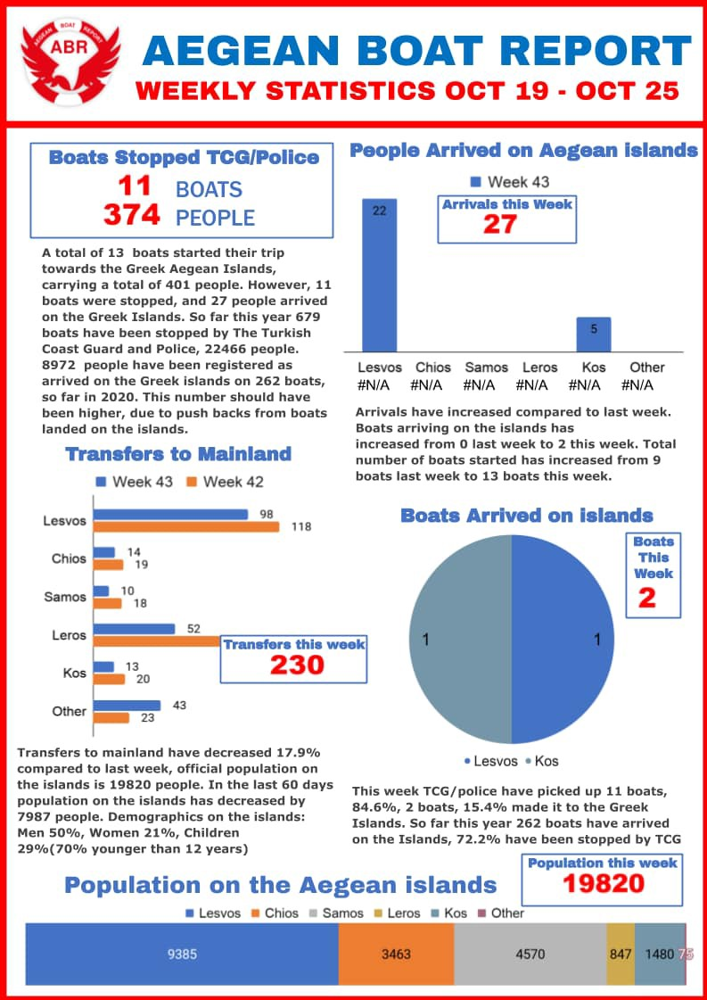
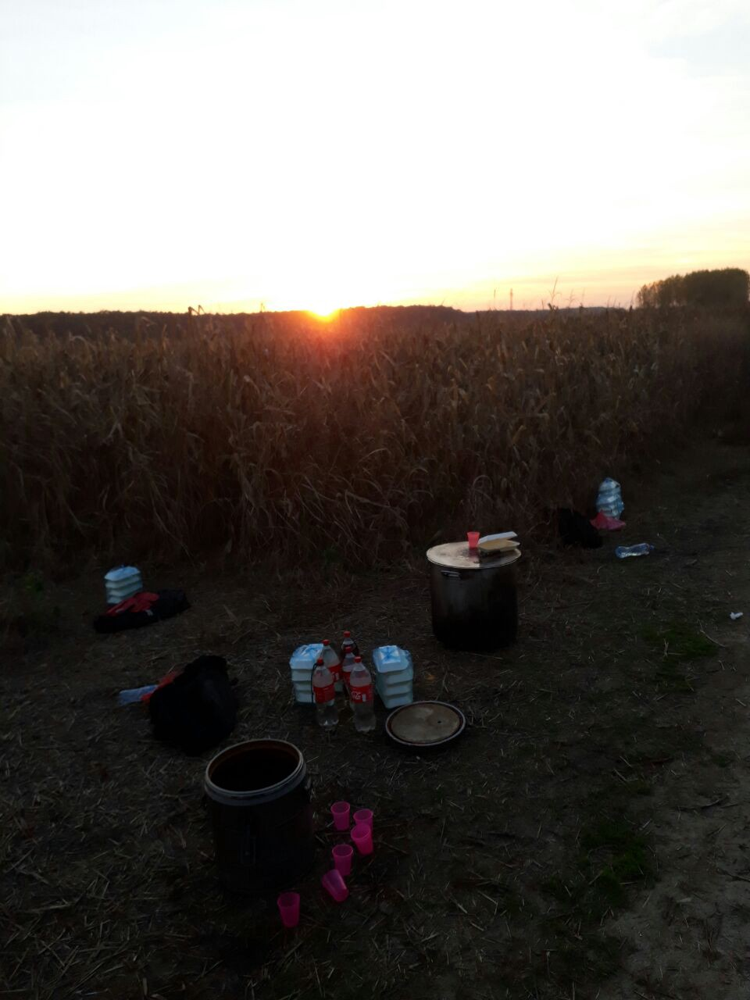
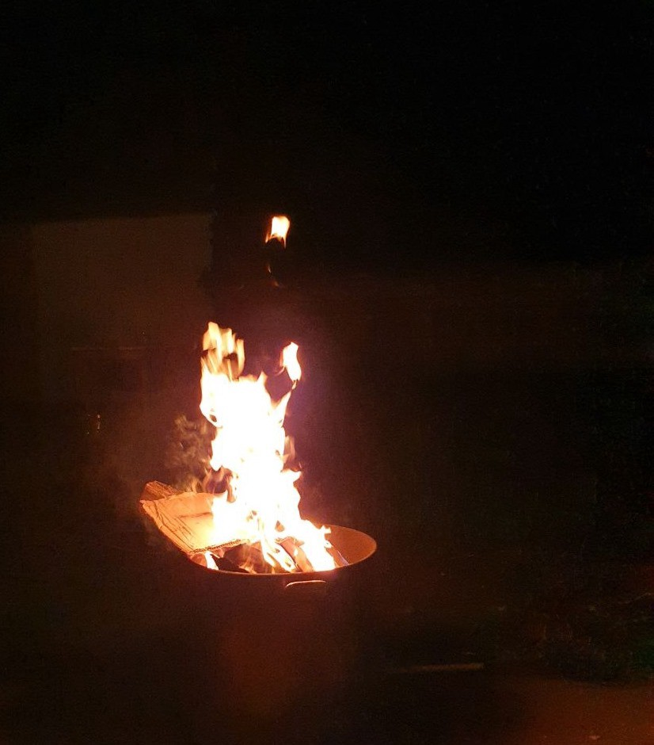

### AYS DAILY DIGEST: 29/10/2020 **–360 people released from detention in Libya**

PIKPA Camp evicted//230 people believed to have died at sea this week//Pushbacks from Greece continue//Updates from Italy, Serbia, Germany, the UK and more…

 \. Since 2015, PIKPA has provided housing to the most vulnerable, today it was evicted\. Find out more [HERE](ays-special-day-of-shame-on-lesvos-pikpa-under-eviction-348958025fd4) \)](assets/55fe0a160425/1*z1ngUJ95xiWkg0SR9LPFgw.jpeg)

\(Photo Credit: [Lesvos Solidarity](https://www.facebook.com/pikpalesvos) \. Since 2015, PIKPA has provided housing to the most vulnerable, today it was evicted\. Find out more [HERE](ays-special-day-of-shame-on-lesvos-pikpa-under-eviction-348958025fd4) \)
#### **FEATURE: 360 people released from detention in Libya**

Giulia Tranchina [report](https://www.facebook.com/rastajuly/posts/10158129797408621) s that 360 people were released from a Libyan detention centre in Zintan by UNHCR on Sunday, having survived 3 years of unjust detention, violence and starvation, witnessed the death of 25 fellow detainees, and endured extremely unsanitary conditions\. Many of them had also previously been detained in other official detention centres, such as Gharyan and Tariq al Matar, abandoned by international agencies despite being among the first refugees to register between 2017 and February 2018\.

 \)](assets/55fe0a160425/1*IN_XfRKI50AW9QdINPXfVw.jpeg)

Protest in Zintan detention centre — May 2019 \(Photo via [Giulia Tranchina](https://www.facebook.com/photo?fbid=10158129779788621&set=pcb.10158129797408621) \)

As we reported a few days ago regarding a similar story from the Suq Alkhamees detention centre, the question remains: [_where are they now?_](https://twitter.com/JFCrisp/status/1321128861514534914)

> Instead of evacuation, they will receive 450dinars and be left homeless in Tripoli\. They don’t know where to go and are mentally and physically destroyed by years of detention and deprivations\. The group of refugees released from Khums 2 weeks ago in Tripoli are still struggling to find shelter, food or medication in the poor Gergarish area where migrants have to stay\. They are struggling to find run\-down poor houses to rent, so it will be impossible for further 360 refugees to find shelter all of a sudden\. 

‘Surbana’ is the only shelter for the Eritrean ‘community’ in Tripoli\. It is at capacity and regularly targeted by armed gangs who steal money and phones\. Only last week two people were injured and are now in hospital after a man entered the shelter and started shooting\. There are also reports of police driving through the Gergarish area, kidnapping refugees and using them as slaves for a day or a week and then dropping them back off\.

> People on the move in Libya need urgent shelter and evacuation out of Libya without further criminal delay\! 

SEA
#### **Yet more deaths at sea**

After the deaths of 140 people off the coast of Senegal were [confirmed by IOM](https://www.spiegel.de/politik/ausland/senegal-mindestens-140-migranten-bei-schiffsunglueck-ertrunken-a-162c7fe3-bd09-4df1-901c-96f26b12a49e?fbclid=IwAR2iK-ARCYyxThG872qqVycbFVIAH3HrwNDAO8WwdueOA2xIRojeQrnmOk8) , yet more distressing news follows\.

■■■■■■■■■■■■■■ 
> **[Alarm Phone](https://twitter.com/alarm_phone) @ Twitter Says:** 

> > 🔴Yet another shipwreck feared along the western Mediterranean route to the Canary Islands. According to local sources in #Mauritania, more than 50 people have died. 

This means more than 230 people have died over just the past 7 days. STOP THIS DYING! OPEN THE BORDERS! 

> **Tweeted at [2020-10-29 19:23:30](https://twitter.com/alarm_phone/status/1321895454469197824).** 

■■■■■■■■■■■■■■ 

#### **A boat has disappeared in the Med**

The maritime rescue ship that [departed on Wednesday afternoon](https://www.canarias7.es/canarias/noticias-patera-perdida-20201029094620-nt.html?fbclid=IwAR0d_cyApAffe6Ue9Ozl7MyaCQnbjNMYgbZISspo15GXS5q27c4K7thotW8#) from Gran Canaria to help a patera supposedly adrift south of the islands has returned to its base after an aircraft that tracked the area has found no indication of the vessel\. There were believed to be 14 people on board\. We hope they found safety, but we know this may not be the case\.

With all figures involving deaths at sea, we must remember the countless boats we never hear about and the ones that simply disappear\.
#### **Safe Arrivals**

[27 people arrived safely](https://www.lavanguardia.com/vida/20201029/4967615791/llega-a-una-playa-de-almeria-una-patera-con-27-inmigrantes.html?fbclid=IwAR0rT6BLbJYrwFPgyTbBMijMRTnbTmIaMXjFY9kPmSDecu-hKniTbCU5nG8) on the beach of El Zapillo, in the capital of Almeria, aboard a patera on Thursday\.
#### **One Boat Intercepted**

[Local media report](https://elfarodeceuta.es/salvamento-maritimo-rescata-inmigrantes-calamocarro/?fbclid=IwAR1ls2OjSxpTW2E-xn0SxxQmGz_Ck2MYD-cYFjHNyUmrOX5xuooBEeBUZzs) that the [**Salvamar Atria**](http://elfarodeceuta.es/tag/salvamento-maritimo) rescued nine people from a boat in the early hours of Thursday as they sailed through the Strait of Gibraltar, north of Ceuta\. There were 8 men and one woman from Morocco who had departed [**from calamocarro**](http://elfarodeceuta.es/tag/calamocarro) beach with the intention of reaching the Peninsula\.
#### [**Proactiva Open Arms**](https://www.facebook.com/proactivaservice/?__cft__[0]=AZURVjbt-M4NmtV5jz-HCY6nh7X7_B_wdQgwCoVza7RVcoOBgm4WzkeZCJIa_kzp6hGESBOSsKq4O5k4djQsttiNqBimAt4vOkQnidd1ixhVSx_9-5tOjzmP2QmtFksx9c_nE1QNzLNNG4QcEQiV2QJXSGXIPWO9HHbp_7ZxRpWBZJ4HNlrc_guYCGqh-YfyzYKGHW5vm8fzuE9_7QeTkHxS&__tn__=-UC%2CP-R) **back at Sea**

We are very relieved to report, given the terrible news of the last week, that Proactiva will again be present in the Mediterranean SAR zone\.

> After a few days tied up in Barcelona’s port, in restocking and crew changing tasks, finally, mission 78 is ready to sail\. Back to the sea\. 

Release all rescue ships\!

GREECE
#### **Aegean Boat Report Weekly Statistics**

#### **32 Pushbacks despite continued denial by Government**

■■■■■■■■■■■■■■ 
> **[Aegean Boat Report](https://twitter.com/ABoatReport) @ Twitter Says:** 

> > So far this month, we have registered 32 illegal pushbacks in the Aegean Sea, performed by the #Greek coast guard. 

881 people – children, women and me –, have been denied their right to seek #asylum. Their #humanrights have been violated by the Greek government. #Greece https://t.co/GT7VQOKRyD 

> **Tweeted at [2020-10-29 11:37:02](https://twitter.com/aboatreport/status/1321778062812418049).** 

■■■■■■■■■■■■■■ 

#### **PIKPA eviction and First COVID\-19 cases in old Kara Tepe**

A [25 year old education worker has tested positive](https://stonisi.gr/post/12529/o-koronoios-mphke-ston-palio-kara-tepe?fbclid=IwAR2SfYq3cgYUQ98GK7bFVXAX3OwpavC7tJKdm4D4u778rx6WCMmLUaMp0mM) for COVID\-19 in the old Kara Tepe camp\. Despite this fact, **residents of PIKPA were forcibly taken to the municipality\-run structure today** \.

> Since 2015, PIKPA has provided housing to the most vulnerable: people who are disabled, sick or pregnant, unaccompanied children and the families of victims of shipwrecks, as well as local people in times of crisis\. They have supported over 30,000 people\. Yet, this morning, at the time of writing, it is under eviction\. 

Read our Special on PIKPA eviction [HERE](ays-special-day-of-shame-on-lesvos-pikpa-under-eviction-348958025fd4) \.
#### **Letter from Moria**

Three groups — Moria Corona Awareness Team, Moria White Helmets and Moria Academia — have come together to write a [letter about the appalling conditions](https://www.facebook.com/MoriaCoronaAwarenessTeam/posts/188599889435856) in Moria 2\.0 and their fears for winter\.

> The proposal of using bucket showers in the winter will again endanger our health and sanity\. We need proper shelter, proper health facilities and proper food\. We are people who have survived a fire, wars and torture, we endured floods and what else worse\. We came here in search of a safe place and of a quiet life, but we now fear a winter filled with more hardship\. So we ask for the professionals to take responsibility and be accountable so that our suffering can be lessened\. Because, really, we are very worried about our health and we do not accept that this can be the only hygiene option which is offered to us\. We realize that there are many problems that many people are working very hard to provide for us, but we also have to say that solutions like this makes us feel like we cannot maintain our dignity as human beings\. 

They ask where all the money donated after the fire has gone and why this money could not be spent on shower units\. A simple and important question\.

■■■■■■■■■■■■■■ 
> **[Ludek Stavinoha](https://twitter.com/LudekStavinoha) @ Twitter Says:** 

> > A bucket shower system. 8 weeks after the Moria fire. Yet, at Tuesday's @[EP_Justice](https://twitter.com/EP_Justice) hearing, head of the newly formed EU Taskforce "to improve the situation on the island in a durable way" assured MEPs that, despite minor glitches, everything is essentially under control. 

> **Tweeted at [2020-10-29 17:49:31](https://twitter.com/ludekstavinoha/status/1321871801916510209).** 

■■■■■■■■■■■■■■ 

EU taskforce = liars\.
#### **Despite everything, a 12 year old child is organising English classes**

■■■■■■■■■■■■■■ 
> **[Starfish Foundation](https://twitter.com/starfishlesvos) @ Twitter Says:** 

> > Manizia, a 12 year old girl living in the camp in #Lesvos, asked one of our volunteers recently for pencils, pens, &amp; paper.

She organises daily English lessons for the children in the camp, &amp; we’re delighted we could help bring her classroom to life. 💛 

#helpingpeopleinneed https://t.co/936AkYlr6t 

> **Tweeted at [2020-10-29 20:12:22](https://twitter.com/starfishlesvos/status/1321907752457916424).** 

■■■■■■■■■■■■■■ 

At least someone knows what they are doing in Moria 2\.0…
#### **A story from inside Moria 2\.0**

 \)](assets/55fe0a160425/1*eBUihXO9eLb_oNmS4s8EFQ.jpeg)

\(Basile, resident of Moria 2\.0\. Photo Credit: [Yousif Alshewaili](https://www.facebook.com/yousif.a.shalal?__cft__[0]=AZWTGF5uRoO3cBxKuv4clhLK9tASG7uOQnqzsmEuV4qwU9-v62Jkwf6mv_mEF6VRMTJd9AbQQn6WMnKIgmV5SF1Gu8MMIvr35QX7gq3jcJR0WuveJbXpqEJaEulASpVY6ZGlj-5EZ_BTUlG1qTbNE_QaqO0o-9WZtt85MLzQ0I5BYaEPTYr5FIMOQ4txQAYs-v8&__tn__=-]K-R) \)

On this difficult day on Lesvos, [Choose Love have shared the story](https://www.facebook.com/chooselove/posts/1277619479265389) of one of the many people who survived the fire only to end up in even worse conditions in Moria 2\.0\.

> I have abilities, just like everyone here\. We are thousands of designers, dreaming of making our contribution\. In the old Moria camp I had opened a Syrian restaurant, I was happy to be able to bring something to the world again\. I lost everything in the fire\. 

> Today I live in the new camp and go around in circles all day\. I would like to recreate, craft, use my hands\. I have lots of projects to make life easier for everyone in this new camp\. I am not here to get anything for myself, I want to give to others\. I have the ideas, now I need the means\. 

ITALY
#### Baobab experience denounces hypocrisy of lockdown for homeless people

Homeless people on the move sleeping rough in the Tiburtina area and supported by Baobab are forced to violate the night\-time curfew “against their will,” according to Baobab Experience\. As reported by InfoMigrant, the activist group called on local authorities to find permanent housing\.

In a statement issued on October 26, Baobab called on local authorities to provide housing for homeless migrants so that their “rights are respected and \[the coronavirus\] is contained\.” Baobab’s legal team has presented over 100 applications for housing to the municipality of Rome, to the immigration office and to central services since the start of the coronavirus pandemic\. “Less than a third of the people involved obtained a place to sleep,” the organisation said\. “The others are still waiting\.”
#### Mission Lifeline wins legal battle against Salvini

The German sea rescue organization Mission LIFELINE has won in court against former Italian interior minister Matteo Salvini\.

Salvini had made fun of the activists in a tweet in the summer of 2019, referring to the mission\-lifeline ship as ′′ pirate ship ′′ and published the photo of a crew member, which he had no right to do\.

As reported by [German media outlet](https://www.spiegel.de/politik/ausland/matteo-salvini-niederlage-vor-gericht-im-bilderstreit-mit-fluechtlingshelfern-a-00000000-0002-0001-0000-000173743543?fbclid=IwAR1e0jd_WkILjCiBIfqtGVOPdOvBHL0SRg5vnTV80gUfsuhyoClka49V0B4) , the Regional Court of Frankfurt has now confirmed a restraining order, which Mission Lifeline had successfully applied for last year: Salvini had objected to it, but failed\. For the time being, Salvini is no longer allowed to use the picture of the crew member in Germany and must bear the costs of the proceedings\.

SERBIA
#### **Winter approaches**

 \)](assets/55fe0a160425/1*rg6fRudm3r7q89edY4f9sw.jpeg)

\(Photo Credit: [No Name Kitchen](https://www.facebook.com/NoNameKitchenBelgrade/photos/pcb.1108563396208610/1108562352875381) \)

[No Name Kitchen report](https://www.facebook.com/NoNameKitchenBelgrade/posts/1108563396208610) on worsening conditions in Serbia as the temperature drops, as well as the positive actions they are still managing to take along with people on the move\.

> We brought food to cook for the people\-on\-the\-move, so they have the opportunity to make it by themselves\. They are very organized when it comes to cooking, and with making food for us as well they can take more active role of also giving and participating in the whole process of it\. 

GERMANY
#### **Relocations from Greece**

A further [48 people and an additional 18 unaccompanied children](https://www.facebook.com/IOMGreece/posts/3289424991336332) have been relocated from Greece to Germany\. They will still have to go [through the German asylum procedure](https://www.tag24.de/thema/fluechtlinge/weitere-fluechtlinge-aus-griechenland-in-deutschland-gelandet-1703747) and will be taken to several different federal states\.

UK
#### **Nearly 300 people have died in the channel trying to reach UK since 1999**

This horrifying number stems from a report soon to be published by [The Institute of Race Relations](https://irr.org.uk/) \. Local [media](https://www.theguardian.com/uk-news/2020/oct/29/almost-300-asylum-seekers-have-died-trying-to-cross-the-channel-since-1999?fbclid=IwAR3DgyhxJEyh9Kpit2Wt4XYeI_pWGk9mPaG7dancV1jvTYbJcWH-dXxiSwY) state that the number of fatalities has increased in relation to the level of securitisation at the border, forcing people to attempt more dangerous methods of crossing\. This is a trend that can be seen worldwide\.
#### **Potential legal action against Home Office**

[Media report](https://www.independent.co.uk/news/uk/home-news/asylum-seekers-home-office-evictions-tier-3-b1374768.html?fbclid=IwAR3uA_iHtfYzmZ3rIqe7EtqUmYEO48hK6nGF2KINUZkb9kdgtHI8RX-dUmU) that a judge has ruled it illegal for people who have not been granted asylum to be evicted in tier 3 areas, which are places with a high prevalence of COVID\-19\. Local councils and charities are concerned that these evictions will lead to street homelessness and an increased risk of infection as many services are not operating due to the pandemic\.
#### **Attempt to expedite family reunification before government shuts down one more safe route**

British peer Alf Dubs has launched a last attempt to expedite family reunifications before the Brexit transition period ends\. The government has recently rejected an amendment which would have guaranteed the continuation of this safe route after Brexit, despite being defeated in the House of Lords with a large majority at the beginning of October\.

■■■■■■■■■■■■■■ 
> **[Alf Dubs](https://twitter.com/AlfDubs) @ Twitter Says:** 

> > Today I asked the government, as a matter of urgency, to seek the co-operation of the French authorities to identify people, especially children, who are eligible for family reunion in the UK and to expedite their safe passage to this country to avoid another tragedy 

> **Tweeted at [2020-10-29 14:07:05](https://twitter.com/alfdubs/status/1321815824416624641).** 

■■■■■■■■■■■■■■ 

EU
#### More voices ask for impartial investigation on Frontex

After Frontex’s dismissal of the documentation proving its involvement in illegal pushbacks in the Aegean sea, a number of German MPs and EMPs are [asking for an impartial and thorough investigation](https://www.rnd.de/politik/menschenrechtsverletzungen-durch-frontex-parlamentarier-fordern-konsequenzen-3YUHYBJ6VBCYVFVPKYQMYGHPII.html) of the European border agency\. They are asking for the EU commission head to act and “to recognise the latest media reports on pushbacks as credible\. Otherwise she will become an accomplice in the systematic violations of human rights at the EU’s external borders”\.

The EU commission, headed by president Von der Leyen, has nonetheless proved to be blind to human rights violations and border violence when done in the name of ‘European stability’, having stood by Greek authorities repeatedly despite accusations of pushbacks, abuses and murder\.

■■■■■■■■■■■■■■ 
> **[José Cortez](https://twitter.com/zouzoucortez) @ Twitter Says:** 

> > Was rereading the @[EU_Commission](https://twitter.com/EU_Commission)'s New Pact on Migration and Asylum and it begins with a quote from @[vonderleyen](https://twitter.com/vonderleyen): 'We will take a human and humane approach".

Then throughout the document the word 'return(s)' is mentioned 88 times. 

Humane, sure. 

> **Tweeted at [2020-10-29 09:38:43](https://twitter.com/hevaloyoussef/status/1321748288194883587).** 

■■■■■■■■■■■■■■ 

WORTH READING

[**The field where racism was won**](https://cadenaser.com/emisora/2020/10/29/ser_las_palmas/1603967158_102713.html) — A positive story from the Canary Islands\. _For weeks, a neighbour from San Bartolomé de Tirajana has been bringing clothes and water to migrants who play soccer on a sports field in Maspalomas, south of Gran Canaria\. The same young people, who arrived on the island a few months ago and are staying in a hotel in the area, were recorded a few days ago by other residents with racist comments such as “where are the whites? I’m leaving here”_ \(in Spanish\)

[**GREECE: Between Deterrence and Integration**](http://issues.newsdeeply.com/greece-between-deterrence-and-integration?fbclid=IwAR2qJ374q0EVXTzPCZS1fG7-o_3Vxa3_iqAD0izhF3hHAijL72Mf7G82WLM) by Daniel Howden

_Two competing priorities informed the response to the more than 50,000 refugees and migrants suddenly stranded within Greece’s borders — deterrence and integration\. At one end of an unbalanced scale, policies were adopted that segregated the refugees from the host population, effectively turning them into a deterrent to future migrants\. At the other end lesser efforts were made at integration\._

[**Malakasa camp: Inaction and uncertainty trap migrants despite end to lockdown**](https://www.infomigrants.net/en/post/28152/malakasa-camp-inaction-and-uncertainty-trap-migrants-despite-end-to-lockdown?fbclid=IwAR3apATqWwGpbAfUw139_hqx4FldlWOxdkEjUp5zXjKA9r192NzmXLMKAZ4) by InfoMigrants

_Migrants and refugees at the Malakasa camp in Greece are again free to come and go after weeks of COVID\-19 lockdown\. But the slow asylum procedures and difficult conditions in the camp are still causing frustration, with some people even returning to the island of Lesbos\._

[**XENOPHOBIA AND REBELLION IN HUNGARY**](http://huelladigital.univisionnoticias.com/crisis-refugiados-javier-bauluz/capitulo-5/index.html?fbclid=IwAR3q6wt3mJqTIl4yUYy7FVuvgev8jLf02I4rpxOxd3loM-BY3sCgFiIGouc) by [Javier Bauluz](http://huelladigital.univisionnoticias.com/crisis-refugiados-javier-bauluz/javier-bauluz/index.html)

_Entry to Hungary gave them hope, but they soon understood that difficulties would continue\. Authorities and civilians were pointlessly assaulting the group, wondering if it would be the same in Germany\. Arrival in Budapest turned the train station into a refugee camp, who, upon learning that the government was suspending train transfers to Austria, began an unprecedented protest\._

[**‘I Might Have Been Stuck In Calais’: Lord Dubs On Being A Child Refugee In 2020**](https://eachother.org.uk/lord-dubs-on-being-a-child-refugee-in-2020/?fbclid=IwAR0ANzwuk8LqkA5xLwHslTe9zaJBtTKIauczFkuAYoQfZFyML24EzGLmbao) by [Nadine Batchelor\-Hunt](https://eachother.org.uk/nadine-batchelor-hunt/)

_Born in Prague in 1932, Dubs came to the UK as part of the the 1939 Kindertransport rescue effort which brought around 10,000 children to safety amid the atrocities of the Holocaust\._

[**How should we study Europe’s harmful migration policies?**](https://www.opendemocracy.net/en/can-europe-make-it/how-should-we-study-europes-harmful-migration-policies/?fbclid=IwAR0Y3m7_xPmsao73KN_TMlM43lmSFvQlNvBhiVu7Tfce6nTTieM5fFCjQC4) by 
Maurice Stierl

_Within the ‘migration discipline’, I suggest that the desire to become of relevance to policymakers has considerably impacted the ways in which research is conducted today\._

[**VIRTUAL WORKSHOP: MIGRATIONS AND BORDERS IN THE AGE OF THE PANDEMIC**](https://www.facebook.com/events/643904209636248/) on NOV 20 AT 7 PM UTC\+02 — NOV 21 AT 10 PM UTC\+02

_The Summer School “Cultures, Migrations, Borders” of the Department of Social Anthropology and History of the University of the Aegean, in collaboration with the “Observatory of Refugee and Migration Crisis in the Aegean” and the co\-sponsorship of the “Global Studies Center”, University of Pittsburgh and the “Center for European and Russian Studies”, UCLA, will host a virtual two\-day workshop on Migrations and Borders in the Age of the Pandemic\._

**Find daily updates and special reports on our [Medium page](https://medium.com/are-you-syrious) \.**

**If you wish to contribute, either by writing a report or a story, or by joining the info gathering team, please let us know\.**

**We strive to echo correct news from the ground through collaboration and fairness\. Every effort has been made to credit organisations and individuals with regard to the supply of information, video, and photo material \(in cases where the source wanted to be accredited\) \. Please notify us regarding corrections\.**

**If there’s anything you want to share or comment, contact us through Facebook, Twitter or write to: areyousyrious@gmail\.com**

_Converted [Medium Post](https://medium.com/are-you-syrious/ays-daily-digest-29-10-2020-360-people-released-from-detention-in-libya-55fe0a160425) by [ZMediumToMarkdown](https://github.com/ZhgChgLi/ZMediumToMarkdown)._
