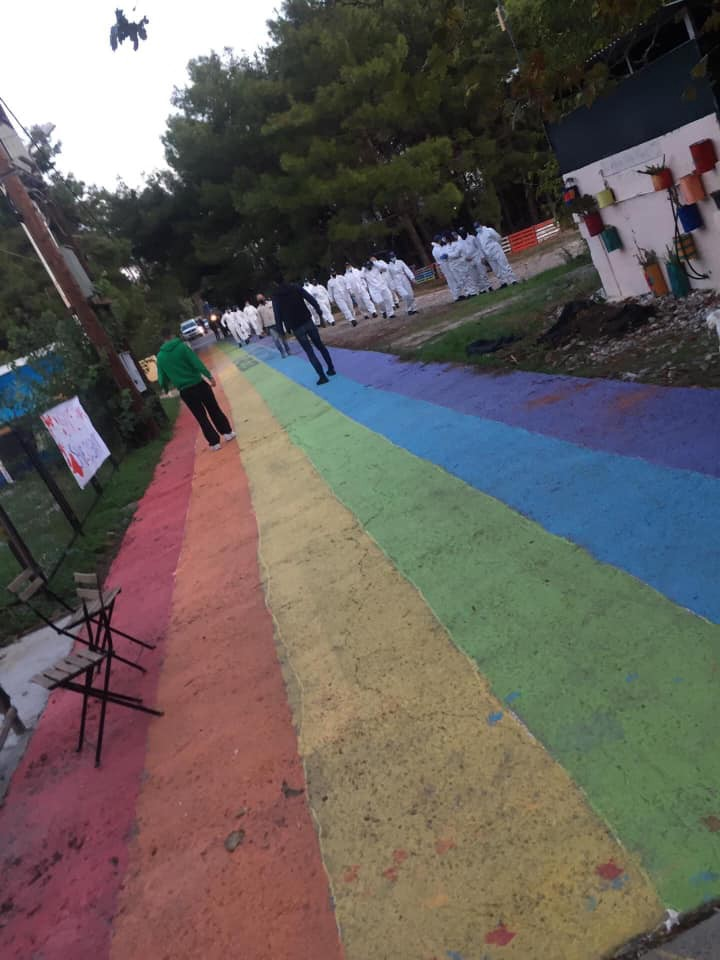
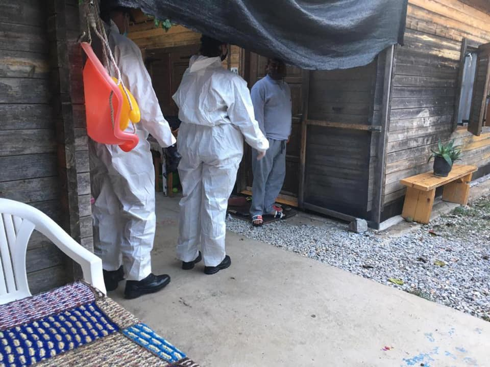
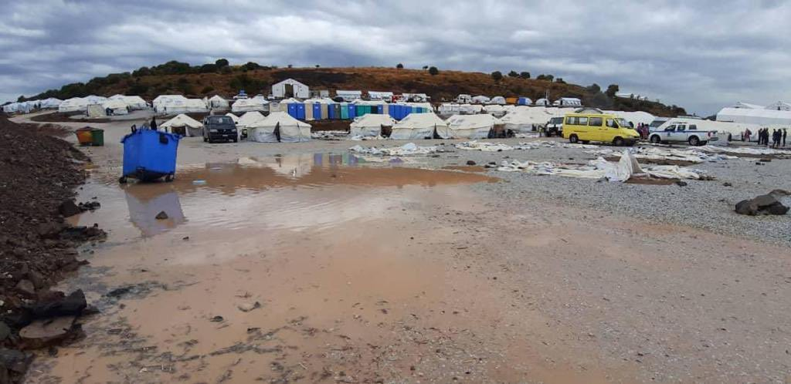
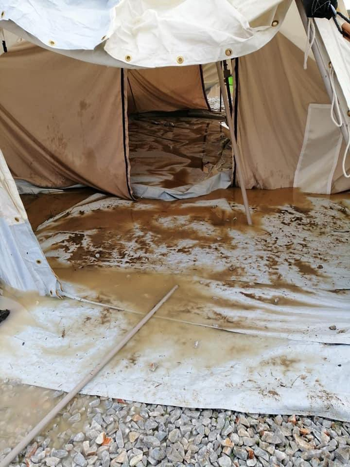

### AYS SPECIAL: Day of shame on Lesvos — PIKPA under eviction

 \)](assets/348958025fd4/1*KkIaH-DdH7VsM5sMki_mkA.jpeg)

\(Photo Credit: [Lesvos Solidarity\-Pikpa](https://www.facebook.com/pikpalesvos) \)

Since 2015, PIKPA has provided housing to the most vulnerable: people who are disabled, sick or pregnant, unaccompanied children and the families of victims of shipwrecks, as well as local people in times of crisis\. They have supported over 30,000 people\. Yet, this morning, at the time of writing, it is under eviction\.

■■■■■■■■■■■■■■ 
> **[DunyaCollective](https://twitter.com/DunyaCollective) @ Twitter Says:** 

> > A statement by Mina, a resident of #savePIKPA. By the  sudden appearance of the police this morning, she feels reminded to Afghanistan when Taliban showed up to make them leave their homes.

#LeaveNoOneBehind https://t.co/XIucw2Nx2a 

> **Tweeted at [2020-10-29 11:15:00](https://twitter.com/DunyaCollective/status/1321772518328455168).** 

■■■■■■■■■■■■■■ 

Yesterday, at 8\.30 am Lesvos Solidarity was informed that first reception would evict the residents of PIKPA immediately and take them to the old Kara Tepe camp\. They brought two buses and one army truck to carry away the residents and their possessions, asking people who have lived in this space for months, or even years, to pack up their lives immediately\. The eviction was halted, giving residents one more night of safety\.

This morning, the police returned, despite [last minute appeals](https://www.proasyl.de/pressemitteilung/lesvos-griechenland-pikpa-das-leuchtturmprojekt-der-menschenwuerde-akut-von-raeumung-bedroht-drei-busse-stehen-bereit/?fbclid=IwAR1Q13VVZw038GsUQTsH-Vm1bz1-iCggmoJM7FxzQ2eP2kM30j5reJbtfbs) and pressure from international and local groups\.

> [Karl Kopp, CEO of the PRO ASYL Foundation](https://www.proasyl.de/pressemitteilung/lesvos-griechenland-pikpa-das-leuchtturmprojekt-der-menschenwuerde-akut-von-raeumung-bedroht-drei-busse-stehen-bereit/?fbclid=IwAR1Q13VVZw038GsUQTsH-Vm1bz1-iCggmoJM7FxzQ2eP2kM30j5reJbtfbs) , calls the threatened [evacuation of the self\-organized camp PIKPA](https://twitter.com/ProAsyl/status/1321754759125225476) “outrageous and nothing to justify\. The Greek Government is committed one human rights violation after the next and is blatantly violating human dignity”\. 

 \)](assets/348958025fd4/1*tNV8jCirueNU6BYMM7kTIw.jpeg)

\(Photo Credit: [No Borders Network](https://www.facebook.com/nobordersnetwork/photos/pcb.3468153723252495/3468153176585883) \)

So far the eviction has [resulted in one hospitalisation](https://twitter.com/Lesvosolidarity/status/1322075042944065536) \. The stress of losing your home is immense and psychosocial, medical team, lawyers, interpreters still not allowed inside\.

The Government stated in September that they would be evicted by October 31st and have [issued a statement](https://migration.gov.gr/klisimo-domis-pikpa-lesvos/?fbclid=IwAR1UDVfv9yzdHP7on58rsmLxmBzHXSc9hp7kLHPi--A_nACwTC0vI1O7w6c) about today’s eviction\. But many believed that this could not happen, that such callousness would not be acted out\.

■■■■■■■■■■■■■■ 
> **[MSF Sea](https://twitter.com/MSF_Sea) @ Twitter Says:** 

> > For now, the eviction of #Pikpa has been postponed and buses have left. But how long before they return? They ought to make their way to Moria 2.0 instead, &amp; take the vulnerable people out of the miserable conditions there. They need a safe place to stay not another #Moria. 

> **Tweeted at [2020-10-29 15:38:02](https://twitter.com/msf_sea/status/1321838714922958849).** 

■■■■■■■■■■■■■■ 

The eviction is carried out despite the fact that PIKPA is not an illegal structure and has been operating since the year 2015, with the full co\-operation of the [competent Ministry of Labour and Social Solidarity, with the No\. D22/45812/164/30–10–2015 a document to the Municipality of Lesvos approved the use of THE PIKPA facilities as a temporary accommodation for vulnerable groups of refugees and asylum seekers](https://thepressproject.gr/to-pikpa-antexe-kai-simera-alla-kyvernisi-kai-akrodexies-omades-tha-xanaprospathisoun/?fbclid=IwAR2-DRwONo5Rs3lj5UrOhbqsyJCL7PoJzHLcN6fy2rTurlpJkJFB4NlpxQI) \.

> We have been living in a dark landscape for a long time\. I see a blind decision by the government to close the PIKPA and I think they will try again tomorrow\. We are trying to use all the remedies and raise the issue, because we believe that the closure of the PIKPA is also imposed by far\-right groups\. We see it on social media from various far\-right trumps, who also send it to the mayor every day\. They are trying to create a climate both against PIKPA and against NGOs and solidarity, who use these concepts as swears\. \- [_Efi Latsoudis, one of the founding members of PIKPA in Lesvos_](https://thepressproject.gr/to-pikpa-antexe-kai-simera-alla-kyvernisi-kai-akrodexies-omades-tha-xanaprospathisoun/?fbclid=IwAR2-DRwONo5Rs3lj5UrOhbqsyJCL7PoJzHLcN6fy2rTurlpJkJFB4NlpxQI) 

PIKPA came out of a [solidarity group set up by local residents in 2012](https://www.huffingtonpost.co.uk/entry/campaign-to-savepikpa-as-vulnerable-people-are-threatened_uk_5b445fafe4b0c3d90ede0309?guccounter=2) to support people affected by the [Greek financial crisis](https://www.theguardian.com/world/series/greece-in-crisis) \. It is one of the last solidarity structures remaining in Greece after the [mass evictions](ays-daily-digest-19-04-2019-athens-evictions-people-demand-their-right-to-a-home-483fed5563d3) , led by the Greek Government under Nea Dimokratia, of self organised housing projects\. It stands in direct opposition to the models of “housing” promoted by the government largely in increasingly closed camps\. The presence of [such alternatives](https://twitter.com/daniel_howden/status/1321908494946193410) , which actively work with residents to create healthy and inclusive living environments, is in itself an embarrassment to the Greek Government and indeed all EU governments, who have failed to provide humane and safe housing options even during the COVID\-19 pandemic\.

> We believe that no human is illegal and that borders should be open\. Pikpa is the only open camp in Lesvos and it is our dream that all refugee reception centres are run in this way\. Our main objective is to stand in active solidarity with the refugees and fight against the barbaric European immigration policies\. We raise awareness and do advocacy work around human rights violations and any acts of humiliation, violence and attacks against refugees\. We work with local people to involve them in our work in order to promote community and sustainable action\. — [_Lesvos Solidarity_](https://www.facebook.com/pikpalesvos/about/?ref=page_internal) 

This eviction is an even more questionable act in light of the [recent fire in Moria](ays-daily-digest-09-09-20-chaos-despair-ash-moria-in-ruins-people-in-fear-of-fascist-groups-b48b4eab1f2d) and the consequent removal of the ex\-residents to the [diabolical conditions of the ‘temporary’ Moria 2\.0](http://55249863) \. The original municipality\-run Kara Tepe camp, to which residents would be transferred, now has [confirmed cases of COVID\-19](https://www.facebook.com/nobordersnetwork/posts/3468153723252495) and is due to be closed in December, after this point, there is a real risk they could also end up in the new ‘temporary’ camp\.

■■■■■■■■■■■■■■ 
> **[MSF Sea](https://twitter.com/MSF_Sea) @ Twitter Says:** 

> > A horrible irony that while 74 vulnerable people are ordered to leave #Pikpa, a safe &amp; dignified place, 74 vulnerable MSF patients, including children with chronic conditions, remain in awful #Moria 2.0. @[MigrationGREECE](https://twitter.com/MigrationGREECE) these decisions are illogical and damaging. #savepikpa https://t.co/Ri0BNM1MWF 

> **Tweeted at [2020-10-29 12:45:00](https://twitter.com/msf_sea/status/1321795167599398913).** 

■■■■■■■■■■■■■■ 

The last attempt to evict the camp, which was also postponed, was supposed to happen by October 15th, but this is just one in a series of [attempted evictions](http://refugeeobservatory.aegean.gr/en/observatory-news-bulletin-court-s-decision-favour-operation-pikpa-lesvos-updated-august-12th) over the last few years\. [Amnesty International](https://www.amnesty.org/en/documents/eur25/3160/2020/en/?fbclid=IwAR0BK9YJ4r8CI-szYqwH0_Ac_bt8UuKuhX3XWIJNoI5RPMYNpnFGIyYur8w) , [Human Rights Watch](https://www.hrw.org/news/2020/09/30/save-dignity-save-pikpa-and-kara-tepe) and many other organisations, as well as individuals, have all called on the Greek government to reverse its decision\. There is also an ongoing case which has been submitted to the European Court of Human Rights, supported by [Greek Council for Refugees](https://www.gcr.gr/en/news/press-releases-announcements/item/1545-the-european-court-of-human-rights-requested-from-the-greek-government-to-provide-information-regarding-the-evacuation-of-pikpa-in-lesvos?fbclid=IwAR2F-B4iLmpe4T8qSgjhr4DfqtDhiGuaxmqbaaC3A50) , regarding a single mother and her new born child, stating that their eviction from PIKPA would be in violation of Article 3 of the Human Rights Act, which states that no one shall be subjected to torture or to inhuman or degrading treatment or punishment\.

\(Moria 2\.0 Photo Credit: @DvDorresteijn\)

PIKPA offer food, clothes, hygiene kits, medical assistance\. They also organize activities for children, language classes and social support\. In Moria 2\.0, to which Mitarakis originally said he would send the residents, most of these things remain unavailable\. But it is not just the residents of PIKPA that will suffer from the eviction as the camp also acts as a base for other important activities, including the delivery of food to other camps and the welcoming of boat arrivals to ensure safe disembarkation as well as the distribution of blankets and clothes to them _\._

Now, more than ever, is the time to act\.

> As long as Europe and the Greek government refuse to provide dignified accommodation and reception to refugees, we will keep defending Pikpa, now more than ever\. This is not a struggle to defend a place\. This is a struggle to defend solidarity, dignity, equality and inclusion\. This is a struggle to resist the toxic agenda of segregation, containment, degradation, repression, xenophobia and hate\. We know that we can count on support from all across Europe — across organisations, institutions, politicians and individuals — and we will mobilise this support with all our power\. — _[Lesvos Solidarity](https://lesvossolidarity.org/en/blog/press-release/statement-on-announced-closure-of-pikpa-camp)_ 

**Article by Emma Musty, AYS**

**Find daily updates and special reports on our [Medium page](https://medium.com/are-you-syrious) \.**

**If you wish to contribute, either by writing a report or a story, or by joining the info team, please let us know\.**

**We strive to echo correct news from the ground through collaboration and fairness, though volunteer work\. Every effort has been made to credit organisations and individuals with regard to the supply of information, video, and photo material \(in cases where the source wanted to be accredited\) \. Please notify us regarding corrections\.**

**If there’s anything you want to share or comment, contact us through Facebook, Twitter or write to: areyousyrious@gmail\.com**

_Converted [Medium Post](https://medium.com/are-you-syrious/ays-special-day-of-shame-on-lesvos-pikpa-under-eviction-348958025fd4) by [ZMediumToMarkdown](https://github.com/ZhgChgLi/ZMediumToMarkdown)._
