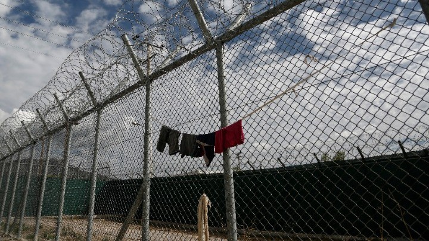
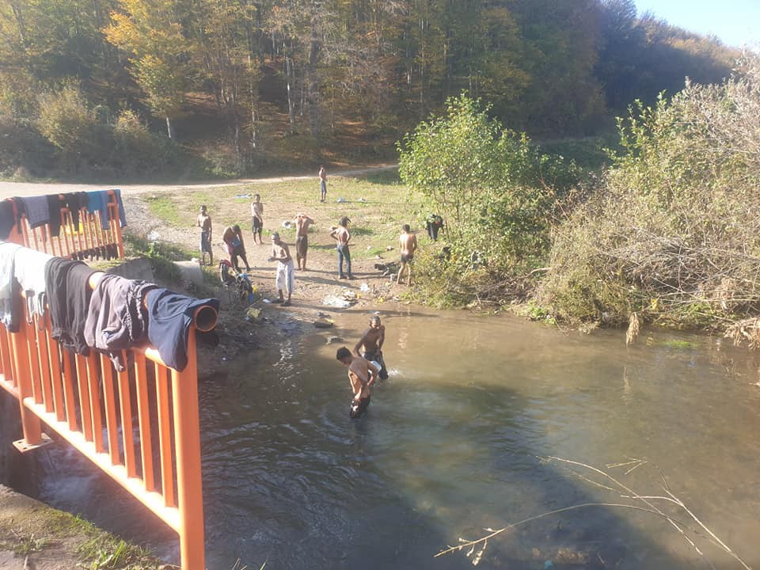
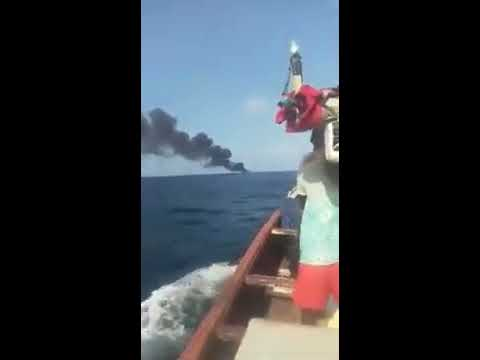

### AYS Daily Digest 30/10/20: Women attempt suicide in Amygdaleza detention centre
#### A hunger strike started after the two suicide attempts in detention, where an unconscious woman waited for help for almost two hours / Residents and activists sharing accounts of eviction from the Pikpa camp / At least 140 people drown off Senegalese coast / Girls, underage, arriving alone in Melilla / UNHCR Calling for the re\-opening of UK’s global resettlement scheme

Nine women, seven of them being detained for over five months, have started a hunger strike in support of fellow inmates who didn’t receive much needed urgent medical help
#### FEATURED
### Eviction of Pikpa highlights rising problems in Greece, where many camps are not suitable for living and/or not ready for winter

Activists, residents, and multiple grassroots organisations have denounced the deplorable eviction of the Pikpa camp on Lesvos\. Riot police in huge numbers stormed into the camp and commenced the eviction procedure, without producing any information as to who authorized the operation, or who was in charge of it\. People have been put on buses and moved to the Kara Tepe camp and other locations, without being duly informed or being given time to prepare\.

> [Activists](https://www.facebook.com/franzi.grillmeier/posts/3430884530364858) “were then told to stay put, sit down, under the supervision of the police, while they were encircling and closing off the whole camp\. They started to wake up people by knocking on their doors\. Other people started to make their way to the bathrooms like every morning, to find a huge police force dispersed in the camp\.” 

Pikpa has existed since 2012 as a welcoming reality for people on the move, hosting around [30 thousand](https://www.facebook.com/dirtygirlslesvos/posts/1823772427781249) vulnerable people\. Activists tried to [oppose the eviction](https://twitter.com/DunyaCollective/status/1322145561924018178?s=19&fbclid=IwAR3GvxC7ohM4RH3rj0o0Pc5XXYOqowPQPKOy2mcTMlAsNnefCY9XpSkz88w) but were pushed back by riot police\.

With the winter and bad weather season already in full swing, families and residents of multiple camps in Greece are [documenting](https://www.facebook.com/ruhi.akhtar.7/posts/3994988447184700) the dire and inhumane conditions they find themselves in — with leaky tents, inadequate facilities and shortages of warm clothes, blankets and other basic facilities\.

Similar conditions are documented in the “Jungle” camp near Dunkirk, where police has reportedly [evicted and destroyed](https://www.facebook.com/lagkadikia.camp.12) tents of refugees living there\.

[](https://l.facebook.com/l.php?u=http%3A%2F%2Flegalcentrelesvos.org%2F2020%2F10%2F30%2Fan-attack-on-solidarity-and-safe-accommodation-the-forced-closure-of-pikpa-camp-%25ce%25b5%25cf%2580%25ce%25b9%25ce%25b8%25ce%25b5%25cf%2583%25ce%25b7-%25cf%2583%25cf%2584%25ce%25b7%25ce%25bd-%25ce%25b1%25ce%25bb%25ce%25bb%25ce%25b7%25ce%25bb%25ce%25b5%25ce%25b3%25ce%25b3%2F%3Fpreview%3Dtrue%26fbclid%3DIwAR3EwkiqTGIdQRQKL3Tmzrvh2VVM0y6ulogLV-JM3LXpOMYR9c3T_e2AntQ&h=AT2So1A036Z5dRIRqyeUezR0_nh1s6OVy_nLxoM1mERXwxG_vArVpdljVePuwv9t6EEmUkt8ogQqMlxLk_3zuh_uwp9ypHCN-swU5OyD7cHPiF0t_vQsk_jdsae-mdxDbeFU7dweRE3NEg&__tn__=R]-R&c[0]=AT0WqobElTuNNffDaabL-fZUc4sIg0M8Il_JedzMtg5Vqr3M9Z7VmxnQm_9DM6PS0x-muBRrPxHbIcbIrx3g1e_2RNK8B_FZXNinkE--0Ptmvm1mnw4Yg1GAOl-chlRc_q4txoMGVkLX0i2PTqX9YEUb_10vUPKzn-6jWeV3-uzGEP3DkiR0hovJWFNHGTJzTrBmqwjHzuRq4gzDaA)

> A contingent of imposing police swarmed Pikpa’s welcoming rainbow road and the safety of Pikpa’s very vulnerable refugee residents was shattered this morning\. Fearful children, physically disabled, psychologically shattered, cancer patients; all forced to board buses and leave the safety created for them by caring, respectful people\. 

> Over the past 6 years, 30,000 very vulnerable people have known the safety of Pikpa, but the callous disregard of authorities means it can no longer give what every refugee actually deserves\. — Dirty Girls of Lesvos 

■■■■■■■■■■■■■■ 
> **[DunyaCollective](https://twitter.com/DunyaCollective) @ Twitter Says:** 

> > 2 buses with refugees from the evicted #savePikpa arrived at the old Karatepe camp. @[Lesvosolidarity](https://twitter.com/Lesvosolidarity)  Police tried to stop us from filming. We were chased by the police and OPKE eventhough we showed our Press ID &amp; told them that we are working.

#LeaveNoOneBehind https://t.co/dKqMlMXmlb 

> **Tweeted at [2020-10-30 10:45:21](https://twitter.com/dunyacollective/status/1322127443218571266).** 

■■■■■■■■■■■■■■ 

As some noticed, what is obvious in the whole process is “the show of strength — army trucks, police, riot police seems incongruous with the purpose… moving families\.” By the sudden appearance of the police this morning, one of the detainees felt reminded to Afghanistan when Taliban showed up to make them leave their homes:

■■■■■■■■■■■■■■ 
> **[DunyaCollective](https://twitter.com/DunyaCollective) @ Twitter Says:** 

> > A statement by Mina, a resident of #savePIKPA. By the  sudden appearance of the police this morning, she feels reminded to Afghanistan when Taliban showed up to make them leave their homes.

#LeaveNoOneBehind https://t.co/XIucw2Nx2a 

> **Tweeted at [2020-10-29 11:15:00](https://twitter.com/dunyacollective/status/1321772518328455168).** 

■■■■■■■■■■■■■■ 

We have published an AYS Special dedicated to this topic:

#### THE BALKAN ROUTE
#### GREECE
### Suicide attempts and hunger strike in the Women’s section of the Amygdaleza detention centre

Two suicide attempts and the start of a hunger strike immediately after the second attempt are the latest news from the detainees in the Amygdaleza detention centre, as reported by the House of Women, for Empowerment & Emancipation\. The group also published videos from the centre, where a woman took pills trying to end her life, while denouncing the apathetic attitude of the police\. According to the report, “they waited for at least two hours for the ambulance, with the girl hanging in a chair, unconscious, outside the doctor’s office, which is closed on weekends, with two of her inmates, instead of nurses, watching her not to fall and trying to they are interested in it”\. A detailed account of the incident can be found here:

[](https://l.facebook.com/l.php?u=https%3A%2F%2Fthepressproject.gr%2Fapopeires-aftoktonias-kai-apergia-peinas-sto-tmima-gynaikon-tou-kentrou-kratisis-tis-amygdalezas%3Ffbclid%3DIwAR1XbvVO7JK0uSaQPCjaUkQikJgYLtOjlwiribpacriOHG-u9bi_ngNXp8w&h=AT2ovJsglnT7Of0KR1cF-kKKsr5jl-ef-4haQ283uj5FvhizFxsacMcb_vxmx_ibJDgNpCaagAGpjwhrPSY3WZAzLoEyBppw9E0d2ItV3TvynMo5SgdM4qTeTXSR2B4O6Q&__tn__=%2CmH-R&c[0]=AT2XNoiPO99nhiAVG3mKYfmua9GY-g5EmAPmTStJNTBxPaAYd_rYr6HveEOsNsjsSzEGQSk72kmk-7jFtw_BcCxa-Hxr4cLC8-LndQEQURMeezAqIAvmxy34705IiSZkQs3uANvS9BJo7UUA3ie5GRIdX5seOHz9YsA0AXo5d5WQf4sdS3xOtHp7Pq2srGiE9uIvECzYw0NJQ7hNMA)

The striking women from Ethiopia, Belarus, Morocco, Moldova, Russia, Syria, Turkey and Georgia rallied for a dignified life in Amygdaleza\. They went on a hunger strike on Tuesday 27/10, and they do not yet have any information from the management\. “Nobody cares about us,” they say\.
#### Refugees on Greek islands affected by earthquakes and flooding

While the Ministry of Citizen Protection ordered islanders to stay away from the coast on Lesvos, 7,700 [p](https://web.facebook.com/hashtag/refugeesgr?__eep__=6&__cft__[0]=AZVDziQbgENy--oc4_veMp5FEjWhZCL_E8QP4DhRUOLUkIYUi7N7P7erB8LLCjCI-VPMBS3wYoF5sSvpcvrCOqaf185uibDPMdqSR9e1b_oeTwhlszk-wAwpTnooy02Xz3GQeDNhbEdBE6ymcaQ3Q8zipWRhJaEt7Lvi7Xa2o9bbq3Sy1-S2HYRzFC3DKn0hBgc&__tn__=R]-R) eople remained stuck on the site of “Moria 2” right next to the sea, [reports](https://l.facebook.com/l.php?u=https%3A%2F%2Ftwitter.com%2Ff_grillmeier%2Fstatus%2F1322215991456243715%3Ffbclid%3DIwAR3W0hqzN9rZTgquACnQ3RkGzzWQXLgAz9np-_0sw2JZ4labC3AsYyhp4Pk&h=AT0pme7upRqzokArNLbR37c7srNxqnUaBWTXgItT7TUNnriV-m8zr54jzYsJMuIACYODYmK84-Y6OZcO3ViL_gfqfCNg4zLM9C2mJRpR16m2-M2b9IUgkv4wtGO1LdRwjA4_PnIUnfJ90A&__tn__=R]-R&c[0]=AT2XNoiPO99nhiAVG3mKYfmua9GY-g5EmAPmTStJNTBxPaAYd_rYr6HveEOsNsjsSzEGQSk72kmk-7jFtw_BcCxa-Hxr4cLC8-LndQEQURMeezAqIAvmxy34705IiSZkQs3uANvS9BJo7UUA3ie5GRIdX5seOHz9YsA0AXo5d5WQf4sdS3xOtHp7Pq2srGiE9uIvECzYw0NJQ7hNMA) say\.

Today we tried distributing food at the recycling point and it worked well and then the earth shook, Moria Corona Awareness team reported\. “Lucklily all of us are fine and no big damage happened but the camp is on the seashore and we heard that near Samos and Izmir there was like a tsunami\. What happens if floods come here? We are zero protected\.”

They received this warning:

> “Warning\! A few hours ago there was a strong earthquake that affected the east Aegean area, and especially the island of Samos, causing a lot of damage and problems\. Please use extreme caution in your surroundings, avoid areas close to the sea, and remain inside your accommodation structures\. For more information please address the staff of your accommodation structure and follow their instructions at all times\.” 

[](https://l.facebook.com/l.php?u=https%3A%2F%2Fwww.amnesty.org%2Fen%2Fget-involved%2Ftake-action%2Fw4r-2020-malta-el-hiblu-3%2F%3Ffbclid%3DIwAR3W0hqzN9rZTgquACnQ3RkGzzWQXLgAz9np-_0sw2JZ4labC3AsYyhp4Pk&h=AT0cBMvdlhuXmoigJ1SwhNi_YsTHL0PGotzEqwBa1jaOovUSnkm0qqxqzAkvlAIAT_T-GFI1iIM_kibB6b-6adpqYcMybE3rW1_RfTFEHtce7h2LMqKzDsvncf7mTr5z7Q&__tn__=%2CmH-R&c[0]=AT1MIAYMts7PkLWRstuFoe7ieaC49L4cijIiU9S1uTN1uug_gFIJd0MLeOsHK6wgMhsiY8fUwQzAlZY2wtTHDw6V0AOMY80PL0goZ42FApdascvgyx34uhl8m8e8dFJs3wpII7PXxE4wDUQQ9ObiABIPzdsNVtdIVu_HLYhwIZg1SHXCXMmU-VfQlKMWfsAcpbq9w764es3QSWaGMw)

#### SERBIA
### Smugglers arrested after discovery of seven migrant bodies

Two suspected people smugglers were arrested in Serbia after authorities in Paraguay discovered the bodies of seven men in a shipping container\. Serbian officials believe the suspects tried to get the men into the EU\. [Here](https://www.infomigrants.net/en/post/28219/serbia-arrests-two-people-over-dead-migrants-found-in-paraguay-shipping-container?fbclid=IwAR3yHiA7LypRZ2TbLr9XAPGQZtEL2Drv4VG0TZwglp4LZwFjaSmaT4OFsu4) is more info\.

■■■■■■■■■■■■■■ 
> **[Azil u Srbiji Asylum Protection in Serbia](https://twitter.com/APC_CZA) @ Twitter Says:** 

> > Izbeglica iz Sirije sa povređenom nogom se obratio za pomoć oko registracije, azila i smeštaja.U policiji Savski Venac mu rekli da ide u Miksalište.Tamo mu Komesarijat za izbeglice kaže da sam ide 300 km južno u kamp Divljana. Ništa od svega. Sistem nedostižan za izbeglicu. https://t.co/beNt1iSNAo 

> **Tweeted at [2020-10-30 05:50:17](https://twitter.com/apc_cza/status/1322053190024679424).** 

■■■■■■■■■■■■■■ 

As we [previously reported in our earlier News Digest](ays-daily-digest-28-10-20-a-traumatic-wake-up-for-hundreds-forcibly-moved-to-a-camp-in-the-south-87ddfc5aad08) , relocation of people from the north to the southern camps is under way in Serbia\. The most recent information we have been receiving from the people on the move is that the groups from Sombor were also taken to Preševo\. We will keep on reporting about this\.
### Bosnia and Herzegovina
#### **Migrants using the last rays of sunshine, dreading the winter**

This is how 99% people in transit who are stuck in Velika Kladuša “live” at the moment\. For most of the year, this is how the men, wormen and children across the country are forced to survive\. The sunny weather in the past days is most likely the only reason why these people have not frozen by now, [Bosnian volunteer](https://web.facebook.com/dzeneta.armin?__cft__[0]=AZUS32yj9UYLAn-iohJmh9Hr4O9a7QPLnwyyq9eggydy0_xxCU6TERaSImh4F-Gc_HfJ7iE1oakIyM-tfd4ghx0t_t5sBuS-YKAjtnCCiRm4Ie_Eje06e1-hFW44qof1QKTi-RWxQI_LLKs0RmhVmpJiiLNJhVd69gz5uxS5X-3k9kavI2VgHNZKUDy0kYwUOUNv1F8wSbhcYqRw4caKqiBq&__tn__=-UC%2CP-y-R) writes\.

](assets/18551804583/0*5cwtu7woalSNqSJD)

Photos: [Dženeta Delić Sadiković](https://web.facebook.com/dzeneta.armin?__tn__=-UC*F)
#### THE MEDITERRANEAN ROUTE
### At least 140 people drown off Senegalese coast

This video — filmed by local fishermen — shows thick black smoke in the distance and two survivors swimming up to the side of a boat\.

The continuing push for the externalisation of borders and the asylum system has been made evident in the recent EU decisions, and especially the Migration Pact\. In a report to the EU Council, Frontex announced that the Hera mission [reportedl](https://l.facebook.com/l.php?u=https%3A%2F%2Ftwitter.com%2Fsaracreta%2Fstatus%2F1322236071514689536%3Ffbclid%3DIwAR0gca2hT6-KyBu8mIkDgo6BF6eNjgQxgcVeQaydYPg1Lc1i5J_W4_q_jbo&h=AT0QQEhuoJuHblveY_plmlH-RR98uKS3i3R4N8ofXVZXwrlxAonVbRwjKOTfs0lKA_5fd6CNVQTPuBIr1mWd8yig7bfwfOnmepr4LNPgQXaJ0X8_IJJxNTzXMd-1RLkfdYl4JD2UqhUkuA&__tn__=R]-R&c[0]=AT2IcbLAr7b6ZKPOhrfsu3pg5tGkKCEFBknAMVQ8hL71Ku2R7MRfvelEWi6CrzqGhqvaig2zYfF2sv_f1rvNOoWjFFS6GtjAbNRQkh0p8rHf5leIWOa_40i8U-ctRhhUoDcPahTmypovpG0nTXuf093ZUDgVXbWik_r26f4h8yxvTC_SygFtiq06CJFJRHcu6Hvk9TYpjq9ufYkaDQ) y includes the possibility of disembarking in [S](https://web.facebook.com/hashtag/senegal?__eep__=6&__cft__[0]=AZVy32ThIzidHM915fFRnwhFd2UofK8Fl0uQpLp1DsSkaGg_8X74lplUHrbOw5qM67zQ7gD86IhqmfYvhivVuSN5MW2olZdQ4uEM7DThsDOLQ9hKxkj5vbR0l1KBnoMYJ1C8T0D0e6JLYKm9VjowNtaD0oPjhA9C04WC8r5O0MU1E144HzC9v0qvxHIKvxFYDLk&__tn__=R]-R) enegal foreign citizens intercepted at sea during naval and air patrol operations\.
### Morocco: 12,000 people on the move in the country

As the African migration route spiked with the number of people fleeing hardships, Morocco has become both a transit and host country for people on the move, and some Moroccan people have also joined thousands leaving the continent\.

“The number of refugees in Morocco stands at 7,561 while asylum seekers reached 4,399”, the UNHCR reported, stating that the country hosted a total of 11,960 refugees and asylum seekers from over 40 countries as of September 1\. The Agency has entered into a big collaboration with the local government in two projects, so that would explain the sudden rise in reporting about the number of people, at least\. It remains to be seen what the outcomes will be\.
### New arrivals on the Spanish islands

A total of seven boats arrived in Mallorca this Friday\. At first, there was information about the arrival of three boats on Cabrera, and the fourth on the south of Portocolom\. Subsequently, the Government Delegation [reported](https://l.facebook.com/l.php?u=https%3A%2F%2Fwww.menorca.info%2Fbalears%2Fnoticias%2F2020%2F10%2F30%2F699657%2Fpateras-mallorca-noche.html%3Ffbclid%3DIwAR01i2Dz_1XNL0SC60i6-txkuqOmJHax5OlWNcbQd68N1wvVBD4MV9E_Umc&h=AT3XNNT2XHvuFY9goEVitgR-LF0XfR9l1EJZ354wzxz9rB9ilFpkjKnTBOTWM8oLWcoG-ptpjMpbMJZQdLtR1zRxbO4B7Ue_oW8LrYRpR1v-0zfnebdXBA6h7fL6OGYxV7eWlPt57PzMGQ&__tn__=R]-R&c[0]=AT1nI8Pvn8OcqcSC4yPHfOXJeUwpQwzRPtB3BaE7e9RzAwc01s39N4M0LSzgUE53NhgWIxpufO_tVxXhvay7kNdG8ogjHHgShOx28jcL5OnajidQTlT_pJ8eDKeD8VODVPIb5beghW2Fqz3TRW_8ZdMlNfsBDVb4y00ufvhN8GOwqTCIc9VauYRSQOPTCj86Vjod4ZPaHQQuQwtTAw) that in addition to these four boats, which had a total of 51 persons on board, another three arrived on Cabrera with 41 people \(12 \+ 14 \+ 15\) on board\.

“Anyone who arrives in the Balearic Islands via irregular routes will receive a deportation notice and will not be allowed to enter Spain in the future\. As soon as the pandemic allows, they will be sent back home\.”

> José María Jiménez heads the unit for combating irregular immigration at the National Police in the Balearic Islands\. “These people are not criminals,” he says\. 

At the moment, many people arriving \(mostly from Algeria\) head towards France, and they know that at the moment they cannot be sent back to their country, as is usually the case\. “These people are not criminals\. They come to work and to make ends meet, just as we Spaniards did in Switzerland”, Jiménez said to [the media](https://www.mallorcazeitung.es/lokales/2020/10/30/mallorca-migration-fluechtlinge-interview-polizei/78568.html?fbclid=IwAR0ek-hfjE7YtXZiSn3zlgB1BSKreA6HCOOHZvtADquYYkEwiPkJpGR-zwc) \.
### Girls, underage, arriving alone in Melilla

“When they arrive in Melilla they are transferred to Gota de Leche, the reception centre specialized in girls and the youngest or most vulnerable children\. In the centre, they share space with 80 other minors, which added to the few resources that are allocated to the centre, means that the professionals cannot attend to the needs of these girls with the attention that they require,” [NNK reports](https://web.facebook.com/NoNameKitchenBelgrade/posts/1109419386123011?__cft__[0]=AZUhHJ2QYPYCKMVSwYmZe21O_NphWYono9fUkJRMguEG93XQW8Ao499Fnt09_PpaL-DO1BWAP2-GH6I9K4ihQgLwCWyF8Ndmfj33DbiYoTec3ED-hpoIQ7W_gsZKxZL23SFys-fxvpA47RyLP2bTmNDxZuBJ623kDdDJcTe7l2NdTPK6JuG1wdT_FSWtp3U2UeA&__tn__=R]-R) \.
#### SWEDEN
### Letting off staff, closing the centres

With about 13,000 asylum seekers in reception centres across the country, and r [eportedly](https://www.svt.se/nyheter/lokalt/ost/asylboenden-ska-stangas-over-hela-landet?cmpid=del%3Afb%3A20201030%3Aasylboenden-ska-stangas-over-hela-landet%3Anyh%3Alp&fbclid=IwAR0h5GzckpvwRDPukRj3COuJmTDZeTxbExtIgZHaJK_8Z_csza5HPssd2fQ) the lowest number of asylum cases in more than 20 years, Sweden is set to close down asylum centres in Boden, Uppsala, Stockholm, Gothenburg and Malmö\.

> In Östergötland, there are now 450 refugees who have to move from their apartments in Valdemarsvik, Finspång and Norrköping\. 

#### DENMARK
### Personal initiatives

Danish documentarist Michael Graversen is the man behind the project “ [Evacuate Moria](https://web.facebook.com/evakuermoria/?__cft__[0]=AZUByj9CA4mxJ8BVxz3MDLcAGHRlJ_-ou6OLPquDpQoar4dZ8AK5ZrG8eIdyLQVOs8cPPhhOpDxm0xVHSsvCTYIhELfBwWzLZ7DBq2DCgavEJxPg9KW-VuqPKPEXDaa5TnOU5VdJJjG56l7NKP5U40h6GZcB7yxOSTRt0MOPUw0hpk2aoGSrXYq68XrHjUfpaeqq1Y3n4_tCJZEQT9hFcHuY&__tn__=R]-R) ” aiming at making Danish families and municipalities accept and provide for 50 or more children from the Moria camp on Lesvos\.

On Thursday Graversen is travelling to Lesvos, and brings with him a bag of personal letters from the 7th grade class at Hummeltofteskolen in Virum near Copenhagen\. The letters were written by the students to the children living in refugee camps on the island under miserable conditions and without access to schooling\.
#### UK
### Calling for the reopening of UK’s global resettlement scheme

The UK’s UNHCR representative has called on the UK government to “ [abandon its hardline approach](https://www.theguardian.com/world/2020/oct/30/un-urges-uk-to-restart-resettlement-of-refugees-after-family-drowns-in-channel?fbclid=IwAR3Y84i0XEKR-k1oS3Zw8268BwnSr3QbVeYQV5BlkziPzYNrhugjQuo5fIo) to asylum seekers and expand or create safe and legal routes for migrants fleeing torture and death to travel to the UK and claim for protection\.” This call comes after a Kurdish\-Iranian family of four drowned in the English channel whilst trying to reach Britain by boat, as we reported earlier\. The UNHCR has called for the re\-opening of UK’s global resettlement scheme, which “facilitates the transfer of recognised refugees from an asylum country to the UK with the aim of permanent settlement”, and which has been suspended because of the Covid\-19 pandemic\.
#### GENERAL

ECRE and PICUM have released a [Policy Paper](https://www.ecre.org/wp-content/uploads/2020/10/The-Future-EU-Action-Plan-on-Integration-and-Inclusion-Ensuring-an-Approach-Inclusive-for-All.pdf) in reaction to the announcement by the European Commission of a new Action Plan on Integration and Inclusion for 2021–2024, to be published in the last quarter of this year\.

The plan announced within the New Pact on on Migration and Asylum, follows the previous [Action Plan on the Integration of Third Country Nationals](https://ec.europa.eu/home-affairs/sites/homeaffairs/files/what-we-do/policies/european-agenda-migration/proposal-implementation-package/docs/20160607/communication_action_plan_integration_third-country_nationals_en.pdf) \(2016\) is meant to provide strategic guidance and set concrete actions to foster inclusion of refugees, migrants and their families\. It will draw on all relevant policies and tools in key areas such as social inclusion, employment, education, health, equality, culture and sport, setting out how migrant integration should be part of efforts to achieve the EU’s goals on each one of these areas\.

Find out more [here](https://mailchi.mp/ecre/ecre-weekly-bulletin-30102020?fbclid=IwAR0JGp9XkhItSS23cwQEzSyekBmkP-ECmfkeo6CTpchRv4dLsJ9TsiAesJc) \.
#### FOR FURTHER READING

Kosovo:

[](https://l.facebook.com/l.php?u=https%3A%2F%2Fprishtinainsight.com%2Fmillions-lost-on-integration-efforts-mag%2F%3Ffbclid%3DIwAR26yezJKhMx6M_wejXMrumpdIN961Kv2wq3634TKuVh-5MzCM_JIS_8XW4&h=AT2k53fjO58QkjX4dPZHQux1mccknHDczMw2yYrX0JJ2aTZRKbghdj5SdERmUJx1uhk5HY6UD0HmGZtzFcw7_VY2LBGUjiUMk8oGy_6Msrt0WKGjeqEMTWzw57EOcGz3U55Qvh0_q-ZOjw&__tn__=R]-R&c[0]=AT0ssoxHW3i5GKCqO6aaEC4tsEVdGUm2Z3Kj3XMSPDmXrUfi26-4DUcnMvbM5JtbTq1EIR4mtBUjQCJHqrY8FgESCYaX19cMYVb6SZ2Puv1Fo6-U7ivD6U9BeXCwvdZrZEQ6L0yf6Jhtm--Lgv8ffI9jqJDaOyAeGEwz4VznQ5OvmxB5iF43XpIo6YFPaTw9k0apPiqd6rw_leol0g)

Frontex, Civil Society Organsations, and Human Rights at EU Borders: A Complex Relationship:

[](https://l.facebook.com/l.php?u=https%3A%2F%2Fwww.law.ox.ac.uk%2Fresearch-subject-groups%2Fcentre-criminology%2Fcentreborder-criminologies%2Fblog%2F2020%2F10%2Ffrontex-civil%3Ffbclid%3DIwAR0OKJF7BgCq8aMXylgr-HpwuU7ghlOm0Cm5GG5H3DeQWXMJ5iIhqmX8LiA&h=AT2hfbO74urhhJ5R0dlXfmIT-o0nbkTdVA1mzZm8TQorIj2zKTEGPUtsHWDz5TpypcWRknkjaYu_qsXiWYGtcFXdxkqrh7DOP67f0o5tPjccIF3_Neor9_q0_faeXEeytE1uu_78_zQOBA&__tn__=R]-R&c[0]=AT0pHB2RGZrsnI4__67hk2qRCMvG7gr75iop7EXWn_DELKLD7laIBg6pwvJdQ6spLL7ztVg1RIn8VLrvVJxZSwexg_6SCOhfdqN_-85ECC03oknzBRSnjrsX_xCL9GS9oDLUm8cMVj9mJnBeh-1LkoTbxpjxAXMvWeVpJc15sXRjKr4QGU9l6c0tTSX6ZrLC5FLui9_Em6Pt1Wd96g)

Europe Must Act invites for a vigil for the victims of Europe’s border regime:

**Find daily updates and special reports on our [Medium page](https://medium.com/are-you-syrious) \.**

**If you wish to contribute, either by writing a report or a story, or by joining the info gathering team, please let us know\.**

**We strive to echo correct news from the ground through collaboration and fairness\. Every effort has been made to credit organisations and individuals with regard to the supply of information, video, and photo material \(in cases where the source wanted to be accredited\) \. Please notify us regarding corrections\.**

**If there’s anything you want to share or comment, contact us through Facebook, Twitter or write to: areyousyrious@gmail\.com**

_Converted [Medium Post](https://medium.com/are-you-syrious/ays-daily-digest-30-10-20-women-attempt-suicide-in-amygdaleza-detention-center-18551804583) by [ZMediumToMarkdown](https://github.com/ZhgChgLi/ZMediumToMarkdown)._
