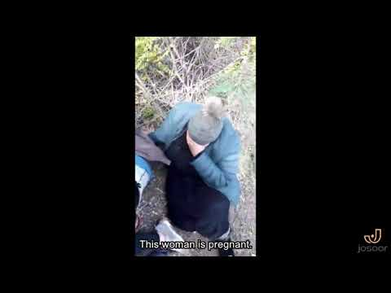
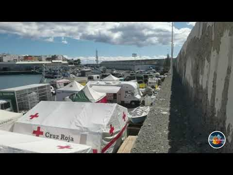
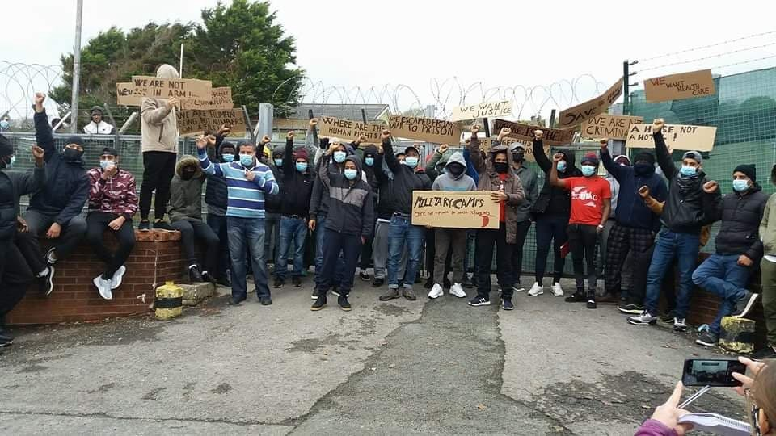

### AYS Daily Digest 11/11/20: 13 people drowned, 70 left hungry and freezing on an island\!
#### Shipwrecks and lost lives in the sea push for direct and immediate demands to the governments / Serbia: Right wing protests, activists and humanitarian workers under constant pressure / Spain: Pressure piles up on people stuck in Arguineguín / West Wales in full solidarity with the Penally asylum seekers / Recommended reads & more info

](assets/48dd14c1f86f/0*cSLIZ3wJocxVJXE_)

Photo: [Proactiva Open Arms](https://www.facebook.com/proactivaservice/?__cft__[0]=AZUq4NVfVNwe70Vj6Esrh-deU_KTfSuVTIjN0TFV6P8bZPpEXEFSaVkuzoEzLrQfFQ0c4z3V9zTVaushqzwtAIFa2_h4BjwL-3_KrHrVtmLdMODT9aZwKV5S8kPqlvT4gOr43I3tZ8YlWeIPHLvCqQxS7MWYAkjT1ua1_8pCWOXlRkZbkeieZqNuRNoOPWe_y_52QQcPcM6BVw44YZicIlTP&__tn__=-UC*F)
#### FEATURED

The Turkish authorities fired warning shots at the people who tried to return to Turkish territory, while everything allegedly started with a Greek repatriation to an island when the Greek authorities illegally deported these people to the island \(on the border between the two countries\) \. Before pushback, the Greek authorities held them in custody without food and water for an entire day\.

■■■■■■■■■■■■■■ 
> **[Are You Syrious?](https://twitter.com/areyousyrious) @ Twitter Says:** 

> > [BREAKING] Evros: 70 people stuck in 'no man' s island' starving and freezing, with no access to help on either Greek or the Turkish side, @[JosoorNet](https://twitter.com/JosoorNet) reports 

> **Tweeted at [2020-11-11 19:39:24](https://twitter.com/areyousyrious/status/1326610498410975233).** 

■■■■■■■■■■■■■■ 

Josoor first reported about the situation:

> Three days ago, 60 people were pushed back from Greece to an island on the Evros River and have been stuck there ever since with nothing\. The day before their pushback, they had been detained and denied food and water\. Ten more were pushed back yesterday\. Now 70 lives are at risk\! 

> The water level of the Evros would permit them to cross on foot, but the border forces on both sides are preventing them, including, as they tell us, by using live ammunition\. 

> This is not the first time Greece has pushed people back to this island\. In May, an unaccompanied minor disappeared and is presumed dead after he contacted his mother one last time from this same island\. In July, another group reported to Josoor that they had been stranded on the island\. 

> This incident is happening in Turkish territory because these people were pushed back by the authorities of an EU member state\. Furthermore Frontex, the EUs Border and Coast Guard Agency, has a liaison office in Turkey and the Evros River is a Frontex operational area\. We therefore alerted members of the European Parliament, the European Commission and Frontex about the situation, urging them to intervene immediately to the best of their ability\. 

 is map from recent testimony published in our database \(collected in the field by volunteers of an anonymous member organization\) \. In this case, a person\-on\-the\-move described being apprehended by Greek authorities in Thessaloniki, near the city’s White Tower landmark\. The man then described being moved around to various locations over the course of three days before finally being transported to the Evros River border near Feres and pushed back to Turkey in a group of almost of 90 persons\. The full statement can be accessed on our public database [here](https://www.borderviolence.eu/.../september-15-2020-2200.../) ” \(Map and info: [Border Violence Monitoring Network](https://www.facebook.com/borderviolencemonitoring/?__cft__[0]=AZWn-QmC7aXEBPrEI-zx0YPlhpKIZetqrWfao-yZqYvnJd1QyepuGMyanvM5Vx_Gb2FJsbSaBej5t1I2MyGwVRIBCWOY-1Ls6WB7R0RX8yrpwAd_MnEhHLuOm-ORTGqtCJ5NS8PizVbUCATQoxrbJDGLbXPgtiHEOX-dfGfPn3TNrbk8GQ5yM0eqZsxSb9xxjrSewShIuvI-iDKRmcyZnexA&__tn__=-UC*F) \)](assets/48dd14c1f86f/0*SMmKlOfHgCDPeXBj)

[“This](https://www.facebook.com/borderviolencemonitoring/?__cft__[0]=AZWn-QmC7aXEBPrEI-zx0YPlhpKIZetqrWfao-yZqYvnJd1QyepuGMyanvM5Vx_Gb2FJsbSaBej5t1I2MyGwVRIBCWOY-1Ls6WB7R0RX8yrpwAd_MnEhHLuOm-ORTGqtCJ5NS8PizVbUCATQoxrbJDGLbXPgtiHEOX-dfGfPn3TNrbk8GQ5yM0eqZsxSb9xxjrSewShIuvI-iDKRmcyZnexA&__tn__=-UC*F) is map from recent testimony published in our database \(collected in the field by volunteers of an anonymous member organization\) \. In this case, a person\-on\-the\-move described being apprehended by Greek authorities in Thessaloniki, near the city’s White Tower landmark\. The man then described being moved around to various locations over the course of three days before finally being transported to the Evros River border near Feres and pushed back to Turkey in a group of almost of 90 persons\. The full statement can be accessed on our public database [here](https://www.borderviolence.eu/.../september-15-2020-2200.../) ” \(Map and info: [Border Violence Monitoring Network](https://www.facebook.com/borderviolencemonitoring/?__cft__[0]=AZWn-QmC7aXEBPrEI-zx0YPlhpKIZetqrWfao-yZqYvnJd1QyepuGMyanvM5Vx_Gb2FJsbSaBej5t1I2MyGwVRIBCWOY-1Ls6WB7R0RX8yrpwAd_MnEhHLuOm-ORTGqtCJ5NS8PizVbUCATQoxrbJDGLbXPgtiHEOX-dfGfPn3TNrbk8GQ5yM0eqZsxSb9xxjrSewShIuvI-iDKRmcyZnexA&__tn__=-UC*F) \)
#### SEA
### Unacceptable to continue punishing instead of strengthening relief

“In learning of the shipwreck of a hundred people in the Mediterranean Sea, a few miles from the Italian coast, [ASGI](https://medium.com/u/5dfedca46f1e) can only associate itself with the appeal launched by the Open Arms for the Italian and European authorities to take immediate action to prepare state search and rescue missions and intervene instantly in support of the shipwrecked currently in danger”, they published, stating:

> Seven years after the tragedies off the coast of Lampedusa, we are witnessing the reversal of public policies in this direction and the constant criminalisation of the activities carried out by European civil society organisations\. 

“Search and rescue activities at sea, which \(as in this historical phase\) are assumed to be dangerous situations for people, constitute a legal obligation imposed by national and conventional legislation and it is clear that the activities of humanitarian organizations alone cannot meet the needs that arise daily and to avoid tragedies that we can never get used to\.

Adopting strongly stigmatizable choices in the course of the last years, the various Italian governments have completely abandoned search and rescue efforts and, at the same time, introduced draconian regulations also aimed at punishing humanitarian activities put in place by individuals and NGOs\.”

To date, the Open Arms is the only private vessel that is dealing with the patrol of the central Mediterranean and the rescue of shipwrecks in this vast area\. The behaviour of the Italian authorities on these points is unacceptable, making them legally and ethically responsible for tragic events, states ASGI, demanding from the Italian Parliament to retroactively abolish the sanctions imposed last year against European civil society organisations, and from the Italian Government to work to ensure that the EU Member States cooperate in this work and that a European Maritime Search and Rescue Plan is adopted as soon as possible; to put an immediate **end to the administrative detention of ships and aircraft of European civil society organisations,** and to put **human life in the centre, without distinction** of nationality, ethnicity, census, religion and political opinion and to raise their voice so that institutions pursue the common good and strive in the unconditional rescue of people\.
#### INTERNATIONAL
### Making deals with anyone in order to send people back

In an effort to deport people who have arrived in their countries outside of officially arranged deals with Turkey and other countries and yet are seeking international protection—but are suspected by the authorities to be a threat—a number of heads of state have been in contact and have visited the countries of origin of a large number of people who have arrived in Europe\. A number of the European countries have been continuing with deportations even despite the coronavirus halts, while the EU has signed agreements with countries they report about as Human Rights violators\. And while the Germans are shocked at the fact that the Bosnian Security Minister and the Pakistani Interior Minister signed a readmission agreement, making it possible for Bosnian authorities to deport Pakistanis from Bosnia and Herzegovina by plane, the French Minister of Interior has [reportedly](https://www.middleeastmonitor.com/20201111-france-minister-in-north-africa-tour-to-arrange-deportation-of-migrants/?fbclid=IwAR1zxLsJg2ekm9r5Mlqx6zndT5TlklWC1AeKPpIIyezQMEb3m8wyDvpEmaY) been on a tour since last Friday, visiting a number of countries including those in North Africa to discuss “combating terrorism and illegal immigration”, in other words, to arrange for deportations\. [Here](https://www.bloomberg.com/news/articles/2020-11-11/eu-funds-biometric-tech-used-for-returning-african-migrants?fbclid=IwAR3PFbfQi-ua-sMyPF98Zm4QHamzNda_msWb1X2yt7GFVAu0YvsUS20h-U4) is more on what is being used in the efforts to return people to their countries of origin\.
#### GREECE
### Health problems on Lesvos

Health Care Update from Moria 2 \(Kara Tepe\) testifies to the conditions that more than 7,500 people are living in\. As reported by [Franziska Grillmeier](https://twitter.com/f_grillmeier) , the [World Health Organization](https://medium.com/u/ecd0bec420d8) at the camp identified a number of health problems people there are facing, including scabies and other skin diseases, communicable diseases such as watery and bloody diarrhea, respiratory infections and tuberculosis\.

> “The risk of potential outbreaks of infectious diseases remains high due to overcrowding at parts of the campsite, limited WASH and a lack of a clear vaccination strategy\.” 

### Samos

“The food line at the camp is completely destroyed\. 500–700 people have lost their shelter, with 5–10 people with minor injuries or smoke inhalation\. Time and time again, these camps are shown to be dangerous and unfit for purpose\.” — One of the most recent reports from the island [cites](https://l.facebook.com/l.php?u=https%3A%2F%2Ftwitter.com%2Fchooselove%2Fstatus%2F1326485569824755712%3Ffbclid%3DIwAR3aY8DI8ECXIIpMCB_8D17TDIWul0SVNeDDSonC7a_njDQvlYftHEGcG7s&h=AT3TShTIkZ8glRK-QZWV_N2WNjncULnMOd-R_QajqgdEH-Alo9q03_uaekCFdk_sT_JhhcWVQYXSPsZ60UWlQlbaP5PT1GP5Of7LFMjBF_0El-JCYYRyYaDSyERHDvdGtoL_PlpGHag1oQ&__tn__=R]-R&c[0]=AT2aV4Ym1Q2BIaVVJqFDR_zZIZebn0cRv5JN2m17Z8RtMaK5UV3gkANupGZHH8zmqkJUDwkxAD_BdmxE5vtDRr6Q8e3aywdfOENE4VKJ8qrLj_suUGfh4R-3gDqg2KAHbu_CXrHQgR5BWxJFWAxf_6s650ZTS6ULihNdGxT2diXrWSVx8UrMs2X_jTxt4JFxMWVYSQjdFpqJFHHPnQ) :

■■■■■■■■■■■■■■ 
> **[Samos Volunteers](https://twitter.com/samosvolunteers) @ Twitter Says:** 

> > Fire update:

The fire seems to be under control. Smoke is still rising from the burned areas.

The foodline has been destroyed.

Some 600 people have been affected by the blaze. 

> **Tweeted at [2020-11-11 08:22:08](https://twitter.com/samosvolunteers/status/1326440059567034369).** 

■■■■■■■■■■■■■■ 

We will soon publish a Special Report from the island contextualising the most recent issues people are faced with\.
#### SERBIA
### Another hate protest allowed to take place

The police has apprehended suspects for spreading false information that in Trstenik, a town about 200km from Belgrade, thousands of people on the move will be received as asylum seekers, and that the decision was made by the head of the security agency\. The local authorities denied the rumours and criticised the spread of false news and panic\. This is just one of many such reports that are being spread by a growing number of right\-wing groups and supporters who have organised another massive gathering protesting people on the move across the country\. The hate spread and harsh discrimination of the people is a growing issue in Serbia, where the hate gatherings have not been stopped or prevented by the authorities and there is no official policy or public communication that would provide the public with real facts, insight into the issue and disarm those who spread lies and hatred, often resulting in individuals pursuing their own “crusades”\.
### Activists and humanitarian workers under constant pressure

In the border area with Croatia, volunteers of our allied organisation No Name Kitchen have been present for the past couple of years, providing the basic means for people to survive and striving to foster a different kind of perception and reactions by the locals in the area\. However, the president of the municipality of Šid has supported the antimigrant protests held by a hate group organised under the name “Young of Šid”, and has demanded that the authorities “reduce the number of migrants and refugees in the town”, Slobodna Evropa [reports](https://www.slobodnaevropa.org/a/lazne-vesti-o-migrantima-i-izbeglicama-srbija/30940207.html?fbclid=IwAR31rQUB8okiIC6l0Lj9o1hZrrl9NjL52Shpyo36SPWDCgvN6R3jsn39Qrk) \. He said the volunteers were an organisation behind “foreign elements wanting to destabilise the law and order of the Republic of Serbia\.” — We will just leave this here to resonate\.

Here is what our friends from NNK have to say:

](assets/48dd14c1f86f/0*CQ58uBHZrXqeGXy9)

Photo: [No Name Kitchen](https://www.facebook.com/NoNameKitchenBelgrade/?__cft__[0]=AZUgCqA92rh9Aj1M6PeYxEfSfNxwZfqGqp8r4He09s0PTMcyOf2JOlABuNsGsKf_uLS34YqAtIGgKOZVgWRxw-u8_fJeobVUmbzVmf-vfyajAS8CogtBt2Ml_TL-xUyPq5axrNBfrntsi5yWq4M9l75Sl3npEmy9v32UEZnaL65wCj7ZRjL5PvlPr63LK4DnWo-ArTpZFtIVDd-2QQdDryHb&__tn__=-UC*F)

> Multiple times we are asked about this question, how is it possible to come to the criminalization of the mere existence of refugees, to the complete dehumanization, or the attack of those who help them\. 

> Sometimes, we talk about situations that blow your minds\. Even for us, there are times when we can not believe most of what happens could be real life in Europe in the 21st century\. 

> Today, we are going to tell you a story that will help you to understand it better\. 

> Let’s begin talking about Sid\. Sid is a very quiet small town in the north of Serbia that, due to the border closure in 2016, received thousands of people from different countries\. In general, Serbian people are kind and they like a peaceful life\. No Name Kitchen has been here for three years\( …\) 

Read the entire post [**here** \.](https://www.facebook.com/NoNameKitchenBelgrade/posts/1119330538465229?__cft__[0]=AZUgCqA92rh9Aj1M6PeYxEfSfNxwZfqGqp8r4He09s0PTMcyOf2JOlABuNsGsKf_uLS34YqAtIGgKOZVgWRxw-u8_fJeobVUmbzVmf-vfyajAS8CogtBt2Ml_TL-xUyPq5axrNBfrntsi5yWq4M9l75Sl3npEmy9v32UEZnaL65wCj7ZRjL5PvlPr63LK4DnWo-ArTpZFtIVDd-2QQdDryHb&__tn__=-UK-R)
#### SLOVENIA

The Slovenian Ombudswoman discussed the changed method of placing detainees in the Center for Aliens in Containers\. After two visits \(31 July and 3 September 2020\) carried out in Postojna by the Ombudswoman’s experts, she informed the competent Ministry of the Interior of her findings and, after receiving their response, prepared a final report, which was published on 10 November\.

> Based on on\-site visits, it was found that the containers were housed in a covered concrete building, with little daylight, and the detainees there did not have access to daily exits and outdoor movement\. According to the Ministry of the Interior and the center’s management, the described method of placing newly detained persons in containers was introduced to prevent the spread of coronavirus disease, and persons were to be housed in containers for a maximum of 10 to 14 days\. As the Ombudswoman’s experts were persuaded during the visit, some of them had been held in containers for more than a month, but it also became apparent that no records had been kept on the duration of such accommodation and that no checking was done of how long an individual was held in the container\. 

See the entire document [here](https://l.facebook.com/l.php?u=https%3A%2F%2Fwww.varuh-rs.si%2Ffileadmin%2Fuser_upload%2Fpdf%2FStalisca_in_ugotovitve%2F2020_11_10_-_POROCILO_Center_za_tujce_Postojna_ugotovitve_VCP.pdf%3Ffbclid%3DIwAR3_Kauxj-mvHk_6brVSwnENTrw51b9bltug0Y-yPOEL4nBlYrJqbP3NqPU&h=AT2cZQvi5jDt9ns2aauRVErx7_7OncCFE4EvX-vH4NKXMCpftbfweXyhRgWFgkyIitiGGk_0WMBGKtZz3xXpxwAUlXRxtMkloWUt6sjE2kkPRX3I5g8py4dOYtY5n6Trsg&__tn__=H-R&c[0]=AT0J1WV0bbOMu35clB0UL76FBb36zr0sAZLNZot2_Y2cxBWD07WKbeSOhTFE-6LNpzl0L37JWJE07gli00KSHb2hFYN8kyOetIYntLeB4X-G7CpYZVhPs9BQ3hLIqP_G1rz4yMB6Y-apEcbqw29KtgkFh2fmc1x8JiDyzk1ggaT3XgkmvOuFzZ7wGWSHOL_cGsmL39mhVA4N4TqIvA) \.
#### FRANCE
### Waiting in danger to get protection, where is the sense?

The dire situation for many across the north of France, but also in the capital, continues\. Countless homeless people wait for the system to give them the chance to tell their story in an attempt to prove they should be granted international protection\. In one of the stories by people on the move stuck in the north of Paris, 20\-year\-old Haroon from Afghanistan is hopeless after having been on Lesvos, then in Italy and **for two years has been waiting in France, sleeping in a tent** \.

> It’s cold in Paris and more than 2000 asylum seekers are sleeping in the street\. France is in lockdown and the procedure is very long\. 

■■■■■■■■■■■■■■ 
> **[Mortaza](https://twitter.com/mortazabehboudi) @ Twitter Says:** 

> > It’s cold in #Paris and more than 2000 asylum seekers are sleeping in the street. France is in lockdown and the procedure is very long. Haroon, 20years from Afghanistan, is hopeless after being in #Lesvos, Italy and since two years waiting in France, sleeping in a tent. #COVID19 https://t.co/nYmznAJlV3 

> **Tweeted at [2020-11-11 20:16:59](https://twitter.com/mortazabehboudi/status/1326619956415508485).** 

■■■■■■■■■■■■■■ 

All those people have been left with no protection or assistance while they wait for answers or at least a call for an interview\. There is no government support for them\. Reportedly, there are also families with minors staying in the Saint Denis camp\.

If someone you know is infected with COVID\-19, here is what they should do:

#### SPAIN

> In Spain we have horror almost worse than that on Lesvos\. At the Arguineguín dock there are 2,000 people sleeping on the ground in inhumane conditions\. The authorities are now denying them access to lawyers\. — _says_ [_Joaquín Urias_](https://twitter.com/jpurias) _, professor of Constitutional Law\._ 

Designed to temporarily accommodate a maximum of 400 people, in recent days the camp set up at the Arguineguín pier for the emergency reception of people rescued from the waters near Gran Canaria has now [reportedly](https://tiempodecanarias.com/noticia/sucesos/video-y-fotos-or-asi-son-las-condiciones-infrahumanas-en-el-muelle-de-arguineguin) exceeded 2,000 people, with peaks close to 2,500 living together under inhumane conditions\.

UK

Statement from a protest held by Penally asylum seekers on 11 November 2020 demanding that Penally Military Training Camp be closed as accommodation for refugees, and that they are moved to the appropriate housing\.

> We are camp residents, we live under difficult conditions in cold weather\. The camp is old and dilapidated and not intended for asylum seekers and refugees\. The large number of asylum seekers inside the camp prevents us from social distancing and avoiding the coronavirus\. There are six to eight people to a small room with no privacy\. Facilities like showers and toilets are far away and we need to walk long distances in the rain and stormy weather to reach them\. We wait for a long time in line to get meals in the rain and there is a lack of access to health care\. The problem was exacerbated by the recent lockdown\. We demand that we be moved to housing\. Refugees should not be placed in old military camps\. 

> Thanks to everyone who attended the protest today, and to all those who support it\. It was a beautiful day that expresses the freedom of the visionary and the rejection of racism\. We hope that our voice will reach the decision\-makers and humanity\. This is the first day, not the last\. 

](assets/48dd14c1f86f/0*UYTLvixlrDAbfxZe)

Photos: [Stand Up To Racism West Wales](https://www.facebook.com/SUTRWestWales/?__cft__[0]=AZXANkkKvjA8VoMeBnkrk3lmbtoU3gzp-l5RDxOAJrTVx5xaebXlxSckxmMkv7PMTbWHTbwbK_AL7wIKlgO8EP89gcChtBsDZ3cJbIheISK7ZMUMEu3gU5F6Ma37YxZB-x0WlzjQHvXmdQGZLsk2sjbf&__tn__=-UC%2CP-R)

The group Stand Up To Racism, West Wales published that they stand in full support and solidarity with the Penally asylum seekers’ demands\.

“The ex\-military camp at Penally Pembrokeshire, now housing up to 240 male asylum seekers, is a completely unsuitable home for vulnerable people fleeing war and oppression\. Although the men can leave the camp in small numbers between 10am and 10pm, the camp is effectively being used as a detention centre or, as the men call it, a prison\. We believe this to be completely unacceptable and we call on the Home Office to close the camp and transfer the men to comfortable and suitable homes\. The conditions in the camp are appalling and are an immediate threat to both physical and mental health\.”

> It is not acceptable for the far\-right to attempt to exploit the suffering of refugees for their own racist agenda, and we condemn their presence at Penally Camp\. Nor is it acceptable for Wales, as a nation of Sanctuary, to be used by the UK Home Office as a site for inhumane and unacceptable accommodation for asylum seekers\. We will work to ensure that Wales remains a Nation of Sanctuary, and that refugees are welcome in Wales\. 

**Please attend our Welcome Event at Penally in support of the Refugees on Saturday 14 November at 12pm**

#### ETHIOPIA — SUDAN

It is [reported](https://reliefweb.int/report/sudan/clashes-ethiopia-s-tigray-region-force-thousands-flee-sudan) that the clashes in Ethiopia’s Tigray region are now forcing thousands to flee to Sudan\.
Across the country roads are blocked and electricity, phone and Internet are down, making communication nearly impossible\. Thousands of foreigners, including medical and humanitarian staff, are stuck in the area with scarce options for communicating or providing assistance\. Reportedly, there is a shortage of fuel, and banking services have halted, resulting in a shortage of cash\. Due to the proximity of the refugee camps to the fighting and the deteriorating situation, there is a growing concern for the people on the move, now counting in the thousands, who will most likely head towards the borders\. However, due to lack of access to border areas, the access to the people in need of assistance and others affected by the conflict remains a concern as well\.
We suggest reading [this story](https://www.latimes.com/world-nation/story/2020-11-11/sudan-braces-200000-refugees-fleeing-ethiopia-fighting?fbclid=IwAR2trFmaWXCATbztC6n8dGis21BJGF5rq4Fk33g6XWnNzYfZEIzJ_kqUlFI) for a general overview of the current situation\.
#### FOR FURTHER READING

In trying to understand the circumstances people are fleeing, listening to people’s stories and getting informed is one of the most effective ways\. Here is a story of young people striving to change their lives, only to end up in unimaginable circumstances in today’s Europe:

A project featuring the individual life stories is also that of our friends from Graz who are giving portraits of people who have arrived:

[](https://l.facebook.com/l.php?u=http%3A%2F%2Fspendenkonvoi.com%2F2020%2F11%2F11%2Fangekommen-portrait-8%2F%3Ffbclid%3DIwAR1jIaVb45G20pgWW9xl8wMNwHAolQ0dlTACO7LOJnjNDlb56dXgNaBGLGM&h=AT04kjBAAaxLMlkm90x-_HJrRnFImyT2viAbBlSsrXQWS0BaaVup1nHfgb_fFjxUro2W2q5bHh63GmLzJXqNwqn2ylpkp8iPIugQXY4vgK0VvfApUtIXuadJvWKLnZ_VIw&__tn__=%2CmH-R&c[0]=AT2AcKA3CczDquogrjCXOsbSG2oKQUC8Jy7JKCA0LD7UDPRKW-iEQi53O_d2Gnew8GHEQNPRjx1PBtQv-13uEX3-py3EaAv1IsUN7-TIlQ8DwFMVcODX4U2RC0E8eW4N_x8z7QY7Hl7YQiI1i-M0qhW_OYCfSSNmFM2qFzAdWFw2r4_Hmhobz8GvHKrEZh62o8jZV021kdl3VSR3hg)

Online event:

**Find daily updates and special reports on our [Medium page](https://medium.com/are-you-syrious) \.**

**If you wish to contribute, either by writing a report or a story, or by joining the info gathering team, please let us know\.**

**We strive to echo correct news from the ground through collaboration and fairness\. Every effort has been made to credit organisations and individuals with regard to the supply of information, video, and photo material \(in cases where the source wanted to be accredited\) \. Please notify us regarding corrections\.**

**If there’s anything you want to share or comment, contact us through Facebook, Twitter or write to: areyousyrious@gmail\.com**

_Converted [Medium Post](https://medium.com/are-you-syrious/ays-daily-digest-11-11-20-13-people-drowned-70-left-hungry-and-freezing-on-an-island-48dd14c1f86f) by [ZMediumToMarkdown](https://github.com/ZhgChgLi/ZMediumToMarkdown)._
