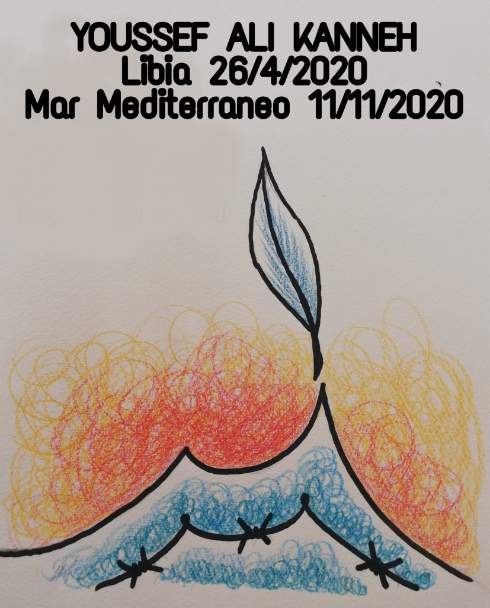
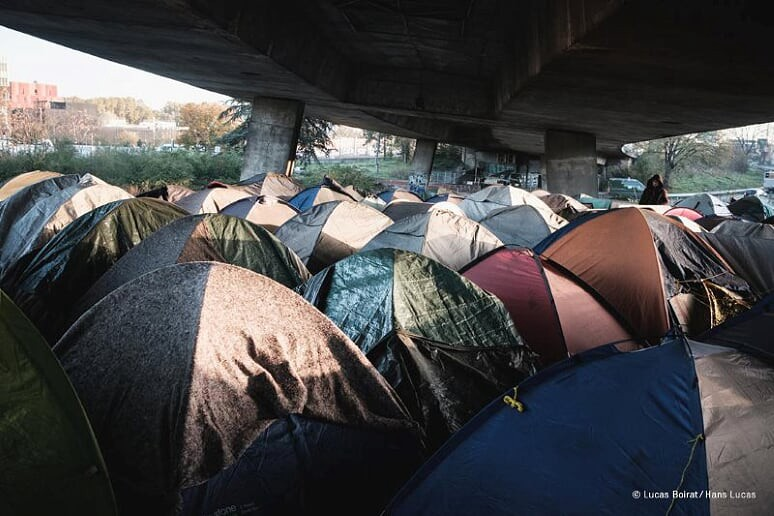
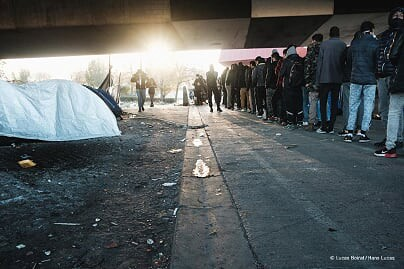
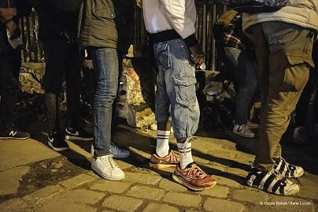

### AYS Weekend Digest 14–15/11/2020: 3 years in Libya, a testimony

Arrivals in Italy and Spain // 3 years in Libya, a testimony // TUI airlines are carrying out deportations from the UK // UK: Anti\-trafficking, court rules against government

 \)](assets/5981d69b818a/1*fvSvoswDEERADt0htlJUFA.jpeg)

Athens, Greece 14 November 2020
Homeless person in empty streets of Athens, during the night curfew that is part of the new lockdown restrictions\. \(via [Art Against](https://web.facebook.com/artagainstproject/photos/a.704384742944296/3454958864553523/) \)
#### Featured: 3 years in Libya, a testimony

At least 267 people were returned over the weekend to Libya\. IOM spokesperson Safa Msehli [report](https://twitter.com/msehlisafa/status/1327393675673022467) s that 190 people were intercepted by the Libyan coast guard on Saturday\. Alarm Phone [report](https://twitter.com/alarm_phone/status/1327913394586914816) that one boat, carrying 77 people, was returned on Sunday\. This week more than a hundred people have died in the stretch of sea that divides Italy and Malta from Libya and Tunisia, the central Mediterranean\.

Once more, European coast guards have failed in their duties towards those in distress at sea\.

Once more, European governments are content with witnessing a hundred lives lost at sea, rather than a hundred of people reaching European shores to flee war, persecution and poverty\.

Once more people are returned to a country where they are systematically targets of abuse, indiscriminate detention, violence, exploitation\. Italian media have gathered information on the situation in centres across Libya and for people on the move in Tripoli\. Read more [HERE](https://www.avvenire.it/attualita/pagine/altri-40-eritrei-catturati-dalla-polizia-libica-tra-loro-anche-due-bimbi-piccoli-con-le-loro-mamme?fbclid=IwAR1h9L6ernTgAhT_wf-2MvtYQ8sCY4jWPAHyu0vdvrzQ6dtxbi1NNhhogL4) \.

> I was in Libya for 3 years\. I spent the last 2 years in Zuwara\. I worked for the Libyan police, but it wasn’t really a job\. They used me, I could not refuse\. When I tried, they beat me and threatened to kill me\. My task was to retrieve bodies from the sea, the bodies of my brothers who had died in the shipwrecks\. I retrieved them and then I had to bury them\. In 2 years, I counted around 3,000 corpses\. You end up getting used to it\. I didn’t get upset anymore, I wasn’t shocked anymore\. Only for pregnant women or children\. I’ve never been able to get used to them\.” \(L\., 17 years old, The Gambia, testimony gathered by [MEDU onlus](https://web.facebook.com/MEDUonlus/posts/10158814194059817) , at the hotspot in Pozzallo \(Sicily\), September 2017\. \) 

ETHIOPIA/SUDAN BORDER
#### **Over 20,000 people have now crossed over into Sudan**

■■■■■■■■■■■■■■ 
> **[UNHCR Sudan](https://twitter.com/UNHCRinSudan) @ Twitter Says:** 

> > 📢 On Saturday, the numbers of refugees crossing into Sudan from #Ethiopia 𝘀𝘂𝗿𝗽𝗮𝘀𝘀𝗲𝗱 𝟮𝟬,𝟬𝟬𝟬.

Medical staff from clinics in Tigray assist other refugees 🩺 Sudanese communities provide food and tents 🍲 while UNHCR &amp; partners are ramping up support  🏃 https://t.co/82BV1uEgHk 

> **Tweeted at [2020-11-15 09:51:06](https://twitter.com/unhcrinsudan/status/1327912000186363904).** 

■■■■■■■■■■■■■■ 

#### SEA
#### Remebering Yusuf Alì Kanneh

114 people died last week in the central Med, bringing the death toll for 2020 to 900 at this one crossing point alone\. Read the Civil Fleet’s points on last week’s events [HERE](https://thecivilfleet.wordpress.com/2020/11/13/mediterranean-death-toll-tops-900-after-four-shipwrecks-in-three-days-iom-warns/?fbclid=IwAR2pnonV6xHLO3yd9Q_Jk-M5zbBasrlzG9LQvnAzwBqXp2esIe_3kwuyLiU) \.

In Memory of Youssef, Forum Lampedusa Solidale

> Youssef was born in the war in Libya and has died in a more hypocritical and petty war, a silent one, in that sea where the EU and Libya don’t want rescuers\. \( [M\. Seminara, Mediterraneo Cronaca](http://www.mediterraneocronaca.it/2020/11/14/un-angolo-di-terra-per-yusuf-ali-kanneh-morto-in-mare/?fbclid=IwAR1IBPMjinw_TJotTUJ9L2bd7WbDboW7QkI_86GqVg6kK86GkcB8neKOP9A) \) 

■■■■■■■■■■■■■■ 
> **[Open Arms ENG](https://twitter.com/openarms_found) @ Twitter Says:** 

> > Forgive us, #Joseph
We did our best to get you to a safe place on time.  Despite fighting for your life long hours, we did not succeed.
Our immense pain will be the force that will prevent more innocent deaths like yours.
May the #Lampedusa ground be light to you.  💔 https://t.co/fdZfbFDp0a 

> **Tweeted at [2020-11-15 19:33:28](https://twitter.com/openarms_found/status/1328058554482307075).** 

■■■■■■■■■■■■■■ 

Six month old Yusuf was buried in Lampedusa on Saturday\.
#### Sea Eye announce new rescue vessel

Thanks to funding from the Hannover\-based group [United 4 Rescue](https://twitter.com/United4Rescue) , Sea Eye announced that they are working on their new rescue vessel: [Sea Eye 4](https://sea-eye.org/sea-eye-4/) , which is currently stationed in northern Germany\.

■■■■■■■■■■■■■■ 
> **[Gorden Isler](https://twitter.com/gorden_isler) @ Twitter Says:** 

> > Über 200 ehrenamtliche Helfer*innen sind in das Projekt #SEAEYE4 eingebunden. Es wird viel geredet, doch das allein bewegt noch keinen Stahl. #Danke an unsere Werftheld*innen, die uns an diesen Punkt bringen, an dem wir selbstbewusst erklären dürfen: #WirSchickenNochEinSchiff 🧡 https://t.co/OQo1NZFhlM 

> **Tweeted at [2020-11-15 20:37:56](https://twitter.com/gorden_isler/status/1328074777689546753).** 

■■■■■■■■■■■■■■ 

GREECE
#### 2020 so far…

Migration minister Mitarakis, while blaming Turkey for not accepting returns as agreed in the shameful EU\-Turkey deal, told the media that the whereabouts of 32,574 rejected asylum seekers is unknown\.

■■■■■■■■■■■■■■ 
> **[Giorgos Christides](https://twitter.com/g_christides) @ Twitter Says:** 

> > And some not unknown, but rarely mentioned numbers. Between Jan-Oct 2020 there have been:
-52 dead or missing asylum seekers at sea border btw Greece &amp; Turkey
-30 at land border (including road accidents en route to Thessaloniki)
- 32 at sea btw GR &amp; Italy [ekathimerini.com/259110/article…](http://www.ekathimerini.com/259110/article/ekathimerini/news/whereabouts-of-32000-migrants-remains-unknown) 

> **Tweeted at [2020-11-14 11:07:07](https://twitter.com/g_christides/status/1327568741329227776).** 

■■■■■■■■■■■■■■ 

#### New biometric residence permit

The migration ministry has started [issuing](https://web.facebook.com/migrationgovgr.info/posts/1791763657644398) new electronic cards to “third\-country nationals legally residing in Greece”\. This new electronic card, replaces the existing residence permit, and it includes new safety features which are going to hinder their counterfeiting\. It contains an RFID Chip with the biometric data of the holder, i\.e\. electronic photo of the holder \(passport type\), fingerprints and the signature of the holder\. Despite rumours, these documents will not be valid for travel abroad\.

All residence permits will from now on have the new format\. The old documents however will remain valid until their renewal date is due\. At that time they will be replaced with the new electronic cards\.
#### Lesvos: Updates from Moria 2\.0

Since last week, Greece is once again in lockdown\. At the main gate of Moria 2\.0 \(Kara Tepe\) there are three separate checkpoints and some people cannot even leave their tents without showing papers\. Tents that are without heating, in a camp without proper hygiene and washing facilities\. No Border Kitchen [published](https://web.facebook.com/NBKLesvos/posts/1902012103271903) a short description by a inhabitant of the camp about what lockdown means for them:

> The camp is once again in lockdown, this time way more strict, only people with with specific reasons can go out, everyone has to wear a mask even inside of the camp, otherwise they will be fined €150\. However some cops who are coming from outside and can transfer the virus are still not wearing a mask, they give food only two times per day and that food has a very bad quality\. And with the lockdown people can’t buy food or anything to make the food at least taste better\. There is no hygiene and people are running out of hygiene stuff and they can’t buy it because of the lockdown\. Also winter is coming its getting cold and people have no money to buy clothes and even if they had they couldn’t buy it because of Lockdown\. People feel imprisoned\. 

Also, No Border Kitchen Lesvos published their second reflection piece on the events in September\. [Category 2: the night of the fire](https://developers.facebook.com/docs/plugins/embedded-posts/?prefill_href=https%3A%2F%2Fweb.facebook.com%2FNBKLesvos%2Fposts%2F1904168956389551&__cft__[0]=AZVQPot_Ux2nG8Lqj1nbGXHCrP7yy-JUqeN9uVDvHU1RjhQ9t4a6Xa7dVsK9vfGc2w_3Lhqiznbih5Ahh3C7-Z7Tu34Ij-ZAwCrvGmzZ8jI5eVuJlrpdHgU0eDL1JduhwoOOyculwkHAlGG2HKFtqXSxc432r-SEMSOAp5ZaZ8dwXBq0gniKIVzQFVd7ZG4Jpko&__tn__=p%2CP-R#code-generator) , in which they frame the fire that destroyed Moria on the 8th of September within a series of fires which occurred in the camp over the last years\. Some started by the residents of the camp as a part of their struggle for freedom\. Read it all [HERE](https://web.facebook.com/NBKLesvos/posts/1904168956389551) \.

MALTA

As we [reported on Friday](ays-daily-digest-13-11-2020-8d9c8a65bdcf) Malta is coming under increasing pressure over it’s refusal to rescue people at sea even when notified of boats in distress\. [Local media report](https://timesofmalta.com/articles/view/malta-is-implicated-in-migrant-deaths-says-alarm-phone.831682?fbclid=IwAR1nWBT4K0NpbWLGo3Eud6BFKgPMd1clKanFaSkMEKBsJjyFQ86odg1HrIM) that Alarm Phone has described these actions as “systematic acts of non\-assistance\.” There is [an ongoing constitutional case](https://timesofmalta.com/articles/view/malta-is-implicated-in-migrant-deaths-says-alarm-phone.831682?fbclid=IwAR1nWBT4K0NpbWLGo3Eud6BFKgPMd1clKanFaSkMEKBsJjyFQ86odg1HrIM) against the country filed by 52 asylum seekers who were pushed back to Libya last April leading to 2 people losing their lives\.

ITALY
#### Arrivals

At least 230 people [arrived](https://twitter.com/AngiKappa/status/1327902318294159360) over the weekend in Lampedusa\. 187 on Saturday night on a large boat who left from Libya\. 31 were rescued from the water by the Italian coast guard after their boat capsized 3 miles from the coast\.

On Saturday, Open Arms ended the disembarking operation off Trapani for those on board\. They have been transferred to a quarantine ship\. Jacobin magazine published an interesting article on this now established detention practice\. Read it [HERE](https://jacobinmag.com/2020/11/italy-migrants-cruise-lines-ships-prisons-coronavirus?fbclid=IwAR1npiVqLPDuAUqawDSJTuFsiNuvEcIQY3Jh_9jm4yGDA-omndihphjKkTU) \.

SPAIN
#### Arrivals

According to media [sources](https://www.europapress.es/islas-canarias/noticia-rescatan-12-pateras-318-personas-aguas-proximas-canarias-20201114112045.html?fbclid=IwAR0vB8Zxi6WA9FKCFt8Xrk0G_GvBvz5zUB5yJVfSk54xarOk2Xao54qVsPs) \( [2](https://www.europapress.es/islas-canarias/noticia-salvamento-maritimo-rescata-12-pateras-435-migrantes-aguas-proximas-canarias-20201115111807.html?fbclid=IwAR0vU_yxBChS04bX5bVqlBPOLbRDzU8aLwK3plXQjd_Azft1S87qEQBogsk) , [3](https://www.europapress.es/islas-canarias/noticia-llega-hierro-cayuco-51-migrantes-subsaharianos-20201115152121.html) , [4](https://www.europapress.es/islas-canarias/noticia-interceptan-otras-dos-pateras-73-migrantes-aguas-canarias-20201115141608.html) \), during the weekend at least 36 boats, carrying 1107 people arrived in the Canary Islands\. Most of them were rescued in the islands waters and brought to safety by Salvamento Maritimo, while a small number of them managed to dock autonomously\.

New arrivals have been taken to the emergency camp made on the pier of Arguineguín, where already 2000 are living in appalling conditions, well beyond the capacity of 500 people\. “ [People demonstrably infected with Covid\-19 would have had to live with the other refugees while waiting for the transfer — without a chance to isolate themselves\.](https://www.spiegel.de/politik/ausland/fluechtlingskrise-auf-den-kanarischen-inseln-kai-der-schande-a-12a0cd66-6d4b-4dac-946f-49b375284304?fbclid=IwAR3w52iqgmzqpkVOGSaKgDC2Mv38bc7RBdoriNd_bJ-_NsxTQmpSxYuTztc) ”

As we reported earlier in the week, the Spanish army is building a camp with 23 tents, which will be able to accommodate up to 200 people, in the Barranco Seco area in the island of Las Palmas\. Will this be a new Moria?

■■■■■■■■■■■■■■ 
> **[🪶 merche negro](https://twitter.com/pintiparada) @ Twitter Says:** 

> > Estamos construyendo un Moria en Canarias: así de simple.

¿Alguien con competencias/responsabilidad/voz va a decir algo? 

> **Tweeted at [2020-11-12 10:03:51](https://twitter.com/pintiparada/status/1326828041495044096).** 

■■■■■■■■■■■■■■ 

#### Increased controls at the Spanish / French border

Media [report](https://www.rtl.be/info/monde/france/a-la-frontiere-franco-espagnole-controles-renforces-et-systematiques-1258772.aspx?fbclid=IwAR3jYqqG0Nj5UrYwEEPu3Mt7cyz8oQwkZOCv6apTSa_Brpm8EjfalsiPg_s) that, as announced last week by French president Macron, controls on board trains crossing the border at Perpignan station and at all border stations will double and become systematic\. In 2020 there has already been a 25% increase in arrests in the first three months of the year and a 50% increase between July and September compared to 2019\. Those stopped at the border will be sent back to Spain in accordance with the [Malaga agreement signed in 2002](https://www.interieur.gouv.fr/content/download/8762/84089/file/INTD0400104C.pdf) , which allows people checked without papers to be returned within four hours\.

BOSNIA & HERZEGOVINA

SERBIA
#### **Police clear camp**

 \)](assets/5981d69b818a/1*jjlO4aDfxk0qBhMAGYedCA.jpeg)

\(Phot credit: [NNK](https://web.facebook.com/NoNameKitchenBelgrade/posts/1122043651527251) \)

On Friday morning police [forcefully removed around 40 people](https://web.facebook.com/NoNameKitchenBelgrade/posts/1122043651527251) from their encampment outside Sid to a camp in the south of the country where they report there is no room for them\. Meanwhile the Serbian Minister of the Interior, Aleksandar Vulin, has [publicly stated](http://rs.n1info.com/Vesti/a671567/Vulin-najavio-angazovanje-Zandarmerije-u-Sidu-zbog-pojacanog-priliva-migranata.html?fbclid=IwAR1cWZV-Ca0tRKK1wVjLXKup92wCLSCKvuFh3p6s_WmGC3nlW0qMgbXqLYU) that:

> …no migrant who is not in our system and does not have a proper permit, is allowed to move on our streets, especially not to make camps or stay in an area where it is not regulated and allowed\. 

He also declared that there were very few ‘incidents’ involving people on the move, but we suppose he does not include those ‘incidents’ created and carried out by his own police force\. Earlier this year the Border Violence Monitoring Network published a report entitled [SERBIAN AUTHORITIES PLACE US 500M ABOVE THE BORDER, THEY BEAT YOU AND BRING TO THE BORDER](https://www.borderviolence.eu/violence-reports/april-17-2020-2030-lojane-area-north-macedonia/) \. We believe the title speaks for itself\.

FRANCE
#### **I’ve seen people mostly\. Not ‘deportable’, undocumented, ‘strangers’\.**

 \)](assets/5981d69b818a/1*Mn3XzZAEYcGpUCgD9bTMhw.jpeg)

\(Photo Credit: Lucas Boirat/Hans Lucas via 
[Solidarité migrants Wilson](https://web.facebook.com/permalink.php?story_fbid=1589422867925146&id=598228360377940) \)

A volunteer shares their experience in Paris:

> It rained a lot\. We walk in a slippery mud and whose smells leave no doubt; these paths taken by all also serve as a toilet\. Tents are around other tents\. 2000 people “live” here\. Fires are lit, close to the tents, at the risk of their occupants life, but how else to warm up? 

Read the full report [HERE](https://web.facebook.com/permalink.php?story_fbid=1589422867925146&id=598228360377940) \.

**More Evictions in Calais over weekend**

■■■■■■■■■■■■■■ 
> **[L'Auberge des Migrants](https://twitter.com/AubergeMigrants) @ Twitter Says:** 

> > #Calais comme #GrandeSynthe 
Aucun répit laissé aux personnes #exilées malgré le #confinement.

Ce matin encore, expulsions quotidiennes #Calais
#inhumanité #droitsbafoués https://t.co/cEAJdLAXYT 

> **Tweeted at [2020-11-14 08:27:36](https://twitter.com/aubergemigrants/status/1327528596588666881).** 

■■■■■■■■■■■■■■ 

UK
#### **3 Survivors of Trafficking win Court Case**

In a recent court case brought by three people against the Home Office [the Judge sated that](https://www.theguardian.com/uk-news/2020/nov/13/priti-patel-departing-from-her-own-anti-trafficking-policy?CMP=share_btn_tw&fbclid=IwAR2A3kKh2GATPmXZaIQj8HdcRscdm6JMXkz6p01uHEHBbl9_9cZk6adkd0Y) : “It is strongly arguable that the home secretary is acting unlawfully in curtailing asylum screening interviews by asking a narrower set of questions than those that are identified in the published policy guidance\.” The questions that are left out make it harder to identify victims of trafficking meaning that they are at risk of deportation\. As a result, all screening interviews must now include questions about the journey someone took to the UK\.

■■■■■■■■■■■■■■ 
> **[ILPA](https://twitter.com/ILPAimmigration) @ Twitter Says:** 

> > We circulated a note about this case to the Refugee Working Group email list this week. Interim relief has now been granted in the case brought by @[DLPublicLaw](https://twitter.com/DLPublicLaw).

Practitioners should be aware of the order that was made today, to take effect from Monday: [amp.theguardian.com/uk-news/2020/n…](https://amp.theguardian.com/uk-news/2020/nov/13/priti-patel-departing-from-her-own-anti-trafficking-policy) https://t.co/2fyhYob6PJ 

> **Tweeted at [2020-11-13 17:56:13](https://twitter.com/ilpaimmigration/status/1327309308124651522).** 

■■■■■■■■■■■■■■ 

Luckily it seems that this ruling is already having a positive impact on individuals lives\.

■■■■■■■■■■■■■■ 
> **[Here to Stay UK](https://twitter.com/HeretoStayUK) @ Twitter Says:** 

> > @[maria_thomas80](https://twitter.com/maria_thomas80) @[HelenBamber](https://twitter.com/HelenBamber) @[Medical_Justice](https://twitter.com/Medical_Justice) @[GatDetainees](https://twitter.com/GatDetainees) @[DetentionAction](https://twitter.com/DetentionAction) @[FreefromTorture](https://twitter.com/FreefromTorture) @[ZoeZoemccallum](https://twitter.com/ZoeZoemccallum) Great result! possibly with immediate impact as one of those Sub Saharan African victims of trafficking (who had cursory 10min screening in #yarlswood a month ago) last wk taken to Brook House for flight on 26th - 2day Home Office interview him &amp; ask about experience in Libya 👏🏾 

> **Tweeted at [2020-11-13 21:10:15](https://twitter.com/followmfj/status/1327358136169209857).** 

■■■■■■■■■■■■■■ 

#### **Deportation Flights from UK**

The airline TUI is due to take part in a forcible deportation next Tuesday of 30 people to Ghana and Nigeria\. Virgin Airlines stopped taking part in deportations in 2018, TUI can too\.

■■■■■■■■■■■■■■ 
> **[TheUnityCentre](https://twitter.com/UnityCentreGlas) @ Twitter Says:** 

> > 🚨 TODAY: TWITTER STORM AGAINST TUES DEPORTATION FLIGHT TO NIGERIA AND GHANA 🚨

Organised by  @[sdetsup](https://twitter.com/sdetsup), more info below ⬇️ 

> **Tweeted at [2020-11-15 13:39:24](https://twitter.com/unitycentreglas/status/1327969452101668869).** 

■■■■■■■■■■■■■■ 

C **ampaign against TUI Airways :**

**Campaign against Brussels Airlines:**

There are calls for all those deported to be [met by volunteers on arrival](https://www.gettingthevoiceout.org/deportation-of-dublin-exiles-to-belgium/?fbclid=IwAR1OyNx2jiyGkneyNjPSK4FhRS5mHhJj9hECYoFq8xkbvJsThlBvCvhf1Q4) after 5 people deported to Belgium were welcomed and housed by locals\.
#### **Safeguarding officer resigns over Home Office treatment of children**

Internal documents and emails have been revealed which confirm there is concern within the Home Office itself about the treatment of children and vulnerable people\. [Local media state](https://www.theguardian.com/world/2020/nov/15/migrant-childrens-welfare-is-being-sidelined-in-uks-brutal-push-to-deport?CMP=Share_iOSApp_Other&fbclid=IwAR3P3CvP5iCq1bsCiOwS3LF2IlIAePhpEvp4cqqoopbr1Pc8lWT0MeZEUPg) that the safeguarding officer who stepped down has questioned the use of physical restraint on these individuals and the level of accommodation provided\. One 15 year old was held for over 66 hours in a holding facility in Kent\.
#### **Supporting people learning to drive**

[Minutes for Miles](https://www.thewestmorlandgazette.co.uk/news/18872970.cumbrians-reach-online-support-syrian-refugees/?fbclid=IwAR2FEtiqtuzdw9R6RyKX39ISkkOckkn2Bg1jmCh7fWQC_lW-GmmX-aMDYA0) is supporting people with online courses and content to pass their driving theory tests in Cumbria\.
#### **Donations needed**

[Bikes for Refugees](https://www.scotsman.com/news/people/more-two-wheels-how-bikes-refugees-has-helped-settle-1000-new-scots-3032164?fbclid=IwAR2A3kKh2GATPmXZaIQj8HdcRscdm6JMXkz6p01uHEHBbl9_9cZk6adkd0Y) , a Scottish charity, is looking for donations of bikes which it will repair and distribute to people newly arrived in Scotland allowing people to access essential services and take part in a new community\.

EU
#### No More Morias protests in Germany and The Netherlands

[Europe Must Act](https://web.facebook.com/europemustact/posts/188700702742632) , [MiGreat](https://web.facebook.com/migreatorg/photos/a.1845099678932346/3471936836248614/) and other groups have organised protests in 7 cities across the Netherlands and Germany\. Protesters took to the streets over the weekend to make people aware of what asylum seekers are experiencing daily at Europe’s external borders\.

WORTH READING/LISTENING/WATCHING
- _Bread, Education, Freedom\!_ Tuesday 17th of November will be the anniversary of Athens’ polytechinic uprising of 1973, a student protest against a dictatorship that tortured, exiled and killed\. Dozens of people were killed by the junta and its allies during the uprising\. This year, the government banned the uprising’s commemoration and threatened to arrest MPs who participate in commemorations\. There are ways to commemorate the uprising which fully respect public health guidelines\. These are now illegal\. The world will be watching on Tuesday if the government cracks down on peaceful, socially distanced protests\. If elected representatives are dragged away by police\. If police brutality, once again, is unleashed as a tool of governance\. [Manos Moschopoulos](https://twitter.com/maledictus/status/1327970118287110145) , wrote an interesting piece about [**Remembering the Polytechnic: On the politics of public health and memory**](https://medium.com/@maledictus/remembering-the-polytechnic-on-the-politics-of-public-health-and-memory-3cffd03b3190) **\.**
- On Sunday, [**Rethinking Refugees — Knowledge and action**](https://web.facebook.com/rethinkrefugees2018) held a webinar on the situation for people on the move in Greece and the impact of the EU Asylum and Migration Pact\. Watch the recording [HERE](https://web.facebook.com/470400633415924/videos/371270930607412) \.
- [**The search for people missing on the Balkan route**](https://kosovotwopointzero.com/en/far-off-europe/?fbclid=IwAR0z2Tt2hSr0GZ73oIt6nMHscH5to5590NDLWrdUPOQoxPAxgSp3iTK9b5k) : “ _In the Bihać city cemetery is a row of freshly dug graves\. Under the green wooden grave markers lie the bodies of unidentified people who died in this part of Bosnia and Herzegovina near the Croatian border\. The grave markers bear only the most minimal identifiers — N\.N\.1, N\.N\.2, N\.N\.3…_ ”
- [**Coronavirus and the impact of school closures on refugees and asylum seekers in the United Kingdom**](https://www.imiscoe.org/news-and-blog/phd-blog/1151-coronavirus-and-the-impact-of-school-closures-on-refugees-and-asylum-seekers-in-the-united-kingdom-2?fbclid=IwAR3lR8ci0zv6_bcT5h2Xg3siLsqdpNYeIbWqU2Dpb2cUWBoFsP8POgqY0_4) : “ _Many refugee\-background students struggle with barriers to access and thrive in education due to various issues \[…\] \. In the current circumstances, they are experiencing further isolation and educational challenges due to limited access to technology and educational support at home\. Invisibility and silence around the needs of this population are not new\. However, these young people are put in an even more vulnerable situation during the pandemic\._ ”

**Find daily updates and special reports on our [Medium page](https://medium.com/are-you-syrious) \.**

**If you wish to contribute, either by writing a report or a story, or by joining the info gathering team, please let us know\.**

**We strive to echo correct news from the ground through collaboration and fairness\. Every effort has been made to credit organisations and individuals with regard to the supply of information, video, and photo material \(in cases where the source wanted to be accredited\) \. Please notify us regarding corrections\.**

**If there’s anything you want to share or comment, contact us through Facebook, Twitter or write to: areyousyrious@gmail\.com**

_Converted [Medium Post](https://medium.com/are-you-syrious/ays-weekend-digest-14-15-11-2020-3-years-in-libya-a-testimony-5981d69b818a) by [ZMediumToMarkdown](https://github.com/ZhgChgLi/ZMediumToMarkdown)._
