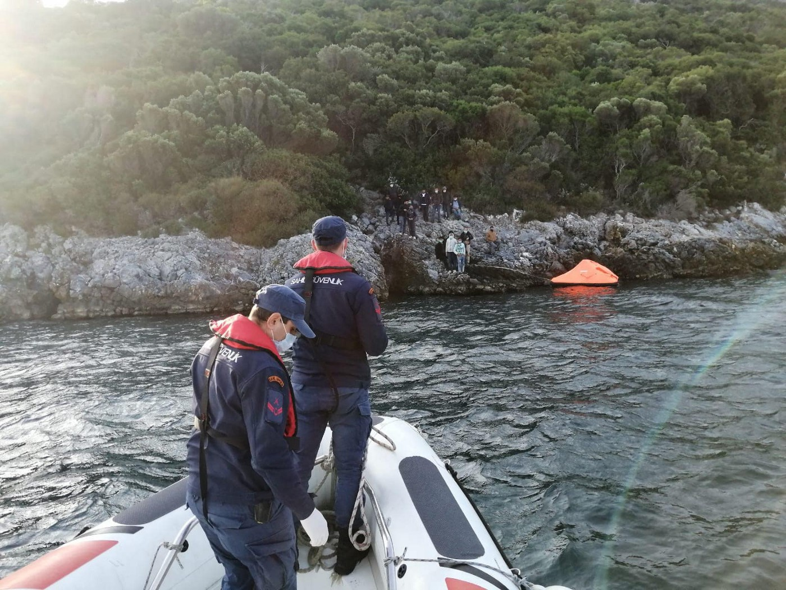

### AYS Daily Digest 16/11/20 Canary Islands “will not become” the new Lesvos

_New report from Border Violence Monitoring Network // more evidence for Mytilene Port Authority violence // doubled law enforcement along Spanish/French border // COVID conditions in Serbia // and more…_

](assets/3a299f34d3b/1*3x4OhEovU-iOXezUO4YHnw.jpeg)

Wooden boat found Friday 16 October 2020 off the coast of the Canary Islands\. Photo by [AP/JAVIER BAULUZ](https://atalayar.com/en/content/migration-overflows-provisional-refugee-camps-canary-islands)
### FEATURE: Spain’s Minister of the Interior, Fernando Grande\-Marlaska, stated that the Canary Islands “will not become” the new Lesvos

This announcement comes as concerns rise over the significant increase in new arrivals recently on the islands\. A total of [1,347 people](https://www.niusdiario.es/sociedad/inmigracion/defensor-inspecciona-sorpresa-campamento-arguineguin_18_3044220374.html?fbclid=IwAR1m2gvp_1a1ikUgO57VKFtbwb7uDBORv3cnFOyiHPxwDbFEemqYR2-EmSo) arrived just this weekend and 86 people arrived on Monday\. Human Rights Watch and the CIE control judge of Gran Canaria have criticized the Arguineguín dock camp for its overcrowded conditions\. [Grande\-Marlaska said](https://www.europapress.es/islas-canarias/noticia-marlaska-asegura-migrantes-no-permanecen-arguineguin-mas-72-horas-garantiza-canarias-no-sera-lesbos-20201116104516.html?fbclid=IwAR1nnTekIwBRYtXJENLIcxU8enIXP7XZ60fTv_UZYGcHi9eoRr28AgN7exk) :

> “This is an extraordinary situation, of urgency where something that has happened in Europe that has been the pandemic has had its transfer to the countries of origin and transit where they are experiencing an absolutely serious health and economic situation\.” 

His main point of “guarantee” is that people do not stay on the Arguineguín dock \(Gran Canaria\) for more than 72 hours\. However, according to judge Díaz Tejera, some people have spent up to 24 days sleeping on the ground with no change of clothes\. The Spainish news site Nius Diario reported that “The high number of arrivals in the last week has meant that this camp has reached five times the number of people for which it was designed without enough tents to offer a roof to all its occupants\.”

The Ministry of the Interior did announce the intention to replace this “temporary” camp with a new one in Barranco Seco \(one that the army is already building\) \. But what is to stop that camp becoming a more permanent Moria? The situation on the Canary islands is certainly worsening due to COVID and AYS will continue to bring you important updates\.
#### LIBYA

■■■■■■■■■■■■■■ 
> **[IOM Libya](https://twitter.com/IOM_Libya) @ Twitter Says:** 

> > In the period of 10-16 November, 409 migrants were rescued/intercepted at sea and returned to Libya.

👇IOM Libya's Maritime Update👇 https://t.co/L3xQHZhSNA 

> **Tweeted at [2020-11-16 18:07:13](https://twitter.com/iom_libya/status/1328399239739830282).** 

■■■■■■■■■■■■■■ 

#### GREECE
### Greek media released new evidence of violence and pushbacks of arrivals at the Mytilene Port Authority

A report and video from the [“Journal of the Editors”](https://www.stonisi.gr/post/12981/vinteo-deixnei-epanaprowthhsh-video?fbclid=IwAR343ShnZlFQrpY7JxSf0UH_RMF2HxR1VjHrUeBuZYxCS2Y62MiO8Bfdmgo) shows one of 30 refugees being “repatriated through an unknown process\.” The report concerns the events that were said to have taken place on November 3rd:

> “According to a refugee testimony in the “Efimerida Syntakton” \(his data is available to the newspaper\), after /several/ hours a group of about 10 men riding in an SUV arrived at the scene\. They confiscated their mobile phones, papers and wallets, put them in a van, drove them miles away and, beating them violently, boarded /onto/ an inflatable life raft, rescue raft which they towed in the middle of the sea and abandoned\.” 

](assets/3a299f34d3b/1*kRHHVAE7Ilx8eRnefGArNA.jpeg)

Photos by [Aegean Boat Report](https://www.facebook.com/AegeanBoatReport/posts/971670753356029)
### ABR: The Greek Coast Guard performed 16 illegal pushbacks this month

They involved 374 people being denied their basic human rights:

> “Six of these pushback cases was performed by using rescue equipment/life rafts, where 161 people, children, women and men were placed in a total of 10 life rafts, and left helplessly drifting at sea\. Many of these people were picked up on the Greek Aegean islands, after they had already arrived, transported by vessels from the Hellenic coast guard back to sea and forced onto these tent\-shaped rafts\. In a normal world people are rescued from life rafts, and not forced onto one and left drifting\. No measures have so far been taken by the EU to try to stop this illegal practice by the Greek government, even though they have received overwhelming amounts of evidence\.” 

We will continue to cover the developing story of the father who has been charged for the death of his 6\-year\-old while crossing to Samos\. The story was covered in [the Guardian](https://www.theguardian.com/global-development/2020/nov/16/father-faces-criminal-charge-over-sons-death-in-migrant-boat-tragedy?fbclid=IwAR1-4Rf3iqo8Jf7YwUkt5aPBQpws_FGtammrZi_-eJJyrUeNosOKnSymUYA) on Monday and Vassilis Kerasiotis, lawyer and director of HIAS Greece, gave a great explanation as to why this decision is unprecedented:

> “In other cases of shipwrecks that have happened since 2015, including those resulting in deaths, we never witnessed criminal charges being pressed on asylum seekers during their entrance in the country\. This time we have charges for exposing an underage \[person\] to danger that resulted in death … We have witnessed such charges pressed for the same reasons at refugee camps in the country before, but never before at an entry point\. So this clearly signifies a shift of approach\.” 

■■■■■■■■■■■■■■ 
> **[Exiled Arizona 🎃](https://twitter.com/exiledarizona) @ Twitter Says:** 

> > Greek police are continuing to call and attempt to contact anyone advocating for action tomorrow on November 17th.

The police already said they will stop any gathering by force under the new Authoritarian law.

Watch Greece tomorrow! 

> **Tweeted at [2020-11-16 16:47:50](https://twitter.com/exiledarizona/status/1328379261372289026).** 

■■■■■■■■■■■■■■ 

Researcher [Tihomir Sabchev](https://twitter.com/TihomirSabchev/status/1328321162670186496) gave an important reminder:

> “ **One year ago the Greek Prime Minister presented the ambitious ‘No Child Alone’ plan for unaccompanied refugee minors in Greece\.** Today no one still knows what staff the Flag of Greece Special Secretary for UAM has, what budget it has or what exactly is its plan\. 

> Only about 1600 UAM are in some type of long\-term accommodation across Greece, more than 1000 are in insecure conditions with little known about their whereabouts, more than 100 in ‘protective custody’ which has been considered a human right violation by the ECtHR in the past…Finally, only 460 UAM have been relocated to other EU countries since March 2020, despite the initial announcement of 1,600 places\.” 

#### ITALY
### A total of 58 people landed on Lampedusa on Monday

According to Italian media “ _A boat carrying 58 people was intercepted by the men of the Coast Guard and the Port Authority\. The migrants, including 25 women and 5 minors , were all taken to the hotspot in the Imbriacola district, where there were already 627 guests\. Meanwhile, the Suprema quarantine ship on board of which there are 847 people, of which 80 positive, remains at anchor in Lampedusa\. The Allegra is expected tomorrow on the largest of the Pelagie\._ ” Learn more [here](https://www.adnkronos.com/fatti/cronaca/2020/11/16/lampedusa-migranti-sbarcano-oggi-sull-isola_jhOEqzsoupPVxn1caPzjJM.html?refresh_ce&fbclid=IwAR3imGqx71pXC9qTWxZawgjjF4KXEmGus6y-lz7QQKMMTbZzTrHpYRVeQqI) \.
#### SPAIN
### French Law Enforcement is redoubling their staff along the Franco\-Spanish border

They are using their increased staff to check on trains and provide more “surveillance of steep paths\.” This is in direct response to Spain being under more pressure due to the increase of new arrivals on the Canary islands and the Nice attack on October 29th\. More [here](https://www.infomigrants.net/fr/post/28548/frontiere-franco-espagnole-les-passages-de-migrants-soumis-a-des-controles-accrus-et-systematiques?fbclid=IwAR35CDUIh7NWJN0SzvCzeF32L_sGC5IzsjP-zzegS4Qyj0xBkzH3JKhPm6Q) \.

El Pais is reporting that “ _The Constitutional Court will support in the plenary session that begins tomorrow the hot returns or rejections at the border regulated in the Citizen Security Law approved by the PP Government in 2015\. The Ministry of the Interior will apply this measure despite the fact that the two parties that form the Government rejected it\. The PSOE appealed the law before the Constitutional Court for understanding that “it violated the right of immigrants to effective judicial protection\.” United We Can promised to promote the repeal of the Citizen Security Law, known as the gag law, to prohibit hot returns\._ ” More [here](https://elpais.com/espana/2020-11-15/interior-aplicara-las-devoluciones-en-caliente-por-el-aval-del-constitucional.html?fbclid=IwAR2Y9Zrx4j12cRZg50_Rj2AK2TjGo753dEirBe3f15SG5zyuGOmWgPqaI5U) \.
#### THE BALKANS

](assets/3a299f34d3b/1*DqEAzhyv2FHR6LQOzhUjSQ.jpeg)

“Every day, the Hungarian police continue to push about 150 people into Serbia, most often near Horgos, Kelebija and a smaller number near Bajmok\. People from Syria, Iraq, Morocco, Algeria, Afghanistan try to cross into Hungary every day by jumping over fences, tunnels, and truck trailers\.” Info and photo by [Asylum Protection in Serbia](https://twitter.com/APC_CZA/status/1328245603541905411)

Update from Info Park about the general situation in Serbia:

> “Despite significantly colder weather, the number of refugees and migrants in the Savamala area remains high with more than 600 persons in the parks and nearby streets in the evenings\. Due to obligatory two\-week quarantine for all newly arrived people on the move, a number of refugees, among them a few families with small children, refuse to be accommodated in the government\-run centers and opt to keep sleeping outside or search for alternative accommodation \(abandoned houses or smuggler’s places\) \. 

> OSP Miksaliste had to close its doors for new arrivals last week over a positive coronavirus case\. Admitting newly arrived persons was suspended as the premises were thoroughly cleaned and disinfected\. The Serbian Commissariat for Refugees and Migration \(SCRM\) and other organizations gathered at OSP Miksaliste have now resumed their regular activities albeit in reduced capacity\. 

> A volunteer\-run organization assisting refugees and other displaced people across Europe, Collective Aid, opened their office at Zeleni Venac providing hot showers and laundry services for all refugees and migrants\. To avoid potential crowds, the beneficiaries should first set the appointment via Viber or WhatsApp and receive further instructions\. A special time slot has been secured for women and children\. 

> **As a record\-breaking wave of coronavirus cases continues in Serbia, medical services for refugees and migrants sleeping rough are still lacking\.** The only available medical services are in reception and asylum centers, which are often remote\. As a result, the refugees can only contact emergency services, which have seriously reduced their capacities during the pandemic, thus making their access to medical services seriously reduced or hardly available\. There are cases when the ambulance refuses to provide help to migrants with evident symptoms of COVID\-19, while institutions responsible for migration management have no available mechanisms to force them to react\.” 

](assets/3a299f34d3b/1*LYr5RWZB--TCzusBhqu2Jg.jpeg)

Photo by [Border Violence Monitoring Network](https://www.borderviolence.eu/balkan-region-report-october-2020/?fbclid=IwAR2OCE5mz76BOOVLjPAq4KwdNXIYbvb-m0MqQmat7mr42NOj6Cy_TL_cIIY)
### BALKAN REGION REPORT — OCTOBER 2020

[Find the report here\!](https://www.borderviolence.eu/balkan-region-report-october-2020/?fbclid=IwAR2OCE5mz76BOOVLjPAq4KwdNXIYbvb-m0MqQmat7mr42NOj6Cy_TL_cIIY) “In October, the Border Violence Monitoring Network published 40 reports of pushbacks and police violence at European Union borders\. These cases, which relate the experiences of 1,003 people on the move, are a testament to the brutal border systems in place at internal and external EU borders\. Respondents experienced a range of physical, psychological and structural violence, which is examined in detail in this report\. This report analyses among other things:
- Police violence and incidents of rape at the Croatian border
- Organised pushbacks from inland Greece
- Abuse at Italy’s maritime and land borders
- Ban on outreach in Bosnia\-Herzegovina
- Anti\-migrant protests in Serbia and Italy
- Pushbacks from Hungary”

This report was brought to you by the joint efforts of Are You Syrious, Mobile Info Team, No Name Kitchen, Rigardu, Josoor, InfoKolpa, Centre for Peace Studies, Re:ports Sarajevo, Mare Liberum, Collective Aid and Fresh Response\.
### Amnesty International on the EU’s response to reports of violence against migrants at Croatia’s borders

> “Amnesty International with the attached complaint enabled the opening of the European Ombudsman’s investigation against the European Commission \(EC\), due to documented violence against migrants at Croatian borders\. 

> Jelena Sesar, AI researcher for the Balkans and the European Union \(EU\), claims that the EC was too tolerant of reports of abuse of migrants by the Croatian police, and as she calls them, uniformed persons from Croatia\. ‘The EC has tolerated reports and allegations of violations of rights and abuse at Croatian borders to the extent that there is a significant risk that the Commission will be accused of encouraging and enabling further violence by such behavior,’ Cesar told Radio Free Europe \(RFE\) \.” 

More [here](https://www.slobodnaevropa.org/a/amnesty-international-o-odgovornosti-evropske-komisije-za-nasilje-na-granicama-hrvatske/30951359.html?fbclid=IwAR2OCE5mz76BOOVLjPAq4KwdNXIYbvb-m0MqQmat7mr42NOj6Cy_TL_cIIY) \.
#### GERMANY

Make sure you are following [**DEPORTATION ALARM**](https://noborderassembly.blackblogs.org/deportation-alarm/?fbclid=IwAR2kJokLGLIz1VpKBxQ_S6vSAHIYGp4sma8NnDvWCTidqVlYA0B9cOXqPq8) for upcoming charter deportations from Germany…one is scheduled for Tuesday 17/11/20\.

_“Please help us make the Deportation Alarm successful:_ 
_– Have you heard of a scheduled charter deportation? Please send us the information\!_ 
_– Do you know people who might be threatened by a deportation? Please share the Deportation Alarm channel with them\!_ 
_– Do you speak a language that we do not cover yet or have you found a mistake in our translation? We are happy about your help to make the channel accessible for all\! \(e\.g\. Tigrinya, Romanian, Romanes, Pashto, Albanian, Georgian\)”_
#### FRANCE

 B\.](assets/3a299f34d3b/1*B4F56VYjs2S_0fGj62sp4w.jpeg)

“‘It’s cold and we have no showers and no duvets’ More than 2000 \#migrants survive in camping tents in front of the Stade de France in Saint\-Denis\. \#DisasterPact” Photo by [Mortaza](https://twitter.com/MortazaBehboudi/status/1328277575966330880) B\.
### New report on poverty in France

Info Migrants summarizes “ _The Catholic Secours, which helped nearly 1\.4 million people in France in 2019, points, in a report published on Thursday, to the strong increase of ‘extreme precariousness’ in France\. More and more families helped by the association are ‘regular migrants\.’ Choose to heat your home or to eat? Families ask themselves this question daily in France, according to the annual report on the State of Poverty published on Thursday, November 12, by Secours Catholique \. **More than half of the households surveyed by the association in 2019 live on less than 9 euros per day** and per person to ‘eat, dress, furnish or have fun,’ once the expenses are fixed \(rent, insurance, water and energy bills\) paid_ \.” More [here](https://www.infomigrants.net/fr/post/28533/grande-pauvrete-en-france-2020-annee-de-tous-les-dangers?preview=1605524417679&fbclid=IwAR1vM7uMejycKsv9HvU0ciO22hbuMo9jGVgBR7av1CsWkh2HXIIdiRLiRA4) \.

![“Prohibition on distributing meals in the city center: 4rd version of the prefectural order
Released tonight, this version lists a long list of streets and docks prohibited for distribution, but no change from version 3\.
However, it seems that the latest expulsions, Coquelles sector, have scattered the exiled people, towards downtown, and towards the city of Europe\.
Continuing our meal distributions near downtown, and bags of food and wood elsewhere\. It’s been 12 years since the Auberge des Migrants has been on the pitch, it won’t stop, despite the rain of PV that is falling on our Human Rights Observers team right now\.” Info and Photo by [L’Auberge des Migrants](https://www.facebook.com/AubergeMigrants/posts/10158445891200339)](assets/3a299f34d3b/1*hSIiT5812MPX_44V0fM0Bg.jpeg)

“Prohibition on distributing meals in the city center: 4rd version of the prefectural order
Released tonight, this version lists a long list of streets and docks prohibited for distribution, but no change from version 3\.
However, it seems that the latest expulsions, Coquelles sector, have scattered the exiled people, towards downtown, and towards the city of Europe\.
Continuing our meal distributions near downtown, and bags of food and wood elsewhere\. It’s been 12 years since the Auberge des Migrants has been on the pitch, it won’t stop, despite the rain of PV that is falling on our Human Rights Observers team right now\.” Info and Photo by [L’Auberge des Migrants](https://www.facebook.com/AubergeMigrants/posts/10158445891200339)

To help unaccompanied minors who have been refused by the Social Assistance for Children, Utopia 56 is opening a new “air lock” house\. French media reports that “ _In this house, minors \( \) will be cared for socially, medically and administratively, in addition to having a roof to spend the winter evenings and taking free lessons\. by retired teachers\. Young people should stay there between one and three months, before joining solidarity hosts_ \.” Learn more [here](https://www.ouest-france.fr/centre-val-de-loire/tours-37000/tours-utopia-56-ouvre-une-maison-sas-pour-aider-les-mineurs-non-accompagnes-7053379?fbclid=IwAR0M6cvVd3qMXJYk2PwD77GvwP_sPA5-Lc24a5HPeu3ALsVArGyAB5khLJ8) \.
#### EU

](assets/3a299f34d3b/1*KgY6SmJwtVS4waK83npzEw.jpeg)

Please check out Refugee Rights Europe’s new report\! \! “Our new report published alongside the End Pushbacks Partnership shows that pushbacks are not just isolated incidents, but a systematic Europe\-wide approach to asylum and migration\.” Photo by [Refugee Rights Europe](https://www.facebook.com/RefugeeRightsEurope/photos/a.1502441746729332/2443906339249530/)
### \#DisasterPact was the \#1 trending hashtag in Germany on Monday\!

Europe Must Act said “ _Today at 10:00 CET, a Tweet Storm organized by a broad alliance of movements and organizations across Europe was initiated\. Shortly after midday, the hashtag \#DisasterPact was already the number one trending hashtag in Germany\! You showed the world what we are capable of if we act together\! Here are some of our favourite tweets so far\. Keep on tweeting, and remember: ‘The power of the people is much stronger than the people in power’ \(Wael Ghonim\)_ ” See more [here](https://www.facebook.com/europemustact/posts/189066882706014) \.

If you haven’t read Border Violence Monitoring Network’s “ **NEW PACT ON MIGRATION — POLICY ANALYSIS** ” yet, find it [here](https://www.borderviolence.eu/new-pact-on-migration-policy-analysis/) \.
#### UK
### Asylum seekers forced to travel in person to Home Office during COVID lockdown

[The Independent](https://www.independent.co.uk/news/uk/home-news/asylum-seekers-home-office-travel-lockdown-uk-b1723721.html?fbclid=IwAR1vkCK6xRg9yKpFTRiQImwhpDDOlOokg8nWyTjAzW6qjgVJ4o-ciFD0bDs) is reporting on how organizations say this is “‘ _neither legitimate nor proportionate’ and that it indicated the Home Office was prioritising its ‘hostile environment’ agenda over the health and safety of communities\. Lawyers from Duncan Lewis Solicitors are in the process of challenging the policy, arguing that in\-person reporting should not be resumed in anyone’s case without an individualised review as to whether it is necessary in the circumstances of the pandemic\._ ” Many asylum seekers told the Independent that they are worried that they will contract COVID during the travel to the Home Office\.

**Find daily updates and special reports on our [Medium page](https://medium.com/are-you-syrious) \.**

**If you wish to contribute, either by writing a report or a story, or by joining the info gathering team, please let us know\.**

**We strive to echo correct news from the ground through collaboration and fairness\. Every effort has been made to credit organisations and individuals with regard to the supply of information, video, and photo material \(in cases where the source wanted to be accredited\) \. Please notify us regarding corrections\.**

**If there’s anything you want to share or comment, contact us through Facebook, Twitter or write to: areyousyrious@gmail\.com**

_Converted [Medium Post](https://medium.com/are-you-syrious/ays-daily-digest-16-11-20-canary-islands-will-not-become-the-new-lesvos-3a299f34d3b) by [ZMediumToMarkdown](https://github.com/ZhgChgLi/ZMediumToMarkdown)._
