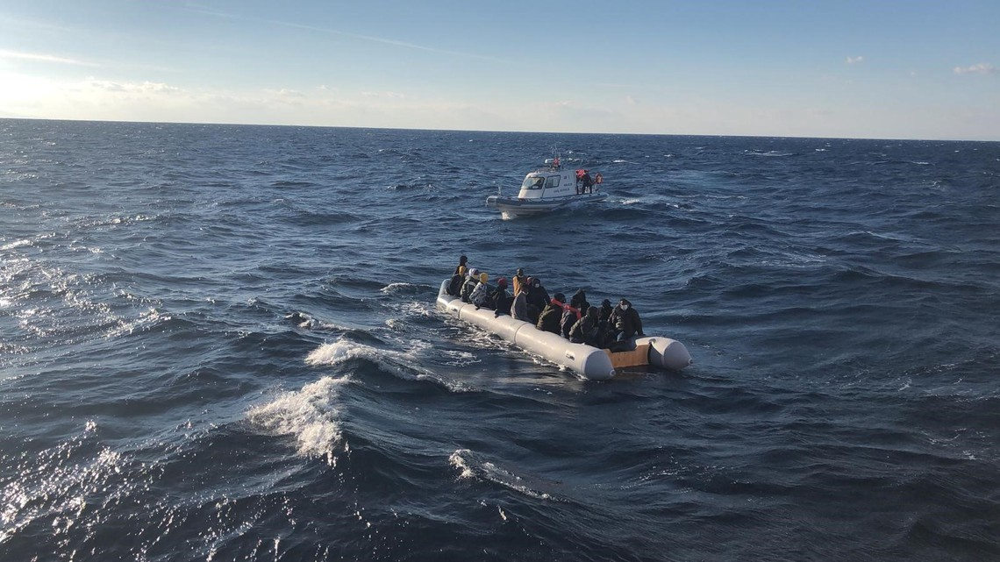

### AYS Daily Digest 18/11/2020 — Frontex dismissed investigation into its involvement in illegal pushbacks

Forensic video investigation of illegal pushbacks on Croatian border \(BVMN\) // New developments on Canary Islands // Greece to build new camps on its islands by end of 2021

Refugees on the sea between Greece and Turkey — Turkish Coast Guard
### EU and FRONTEX
#### Evidence emerges of EU border agency FRONTEX dismissing investigation into human rights violations

On 2 March 2020, the EU border agency Frontex was allegedly involved in an illegal pushback of a boat with 33 refugees in Greek waters, near the island of Kos\. When confronted by a group of investigative reporters on the matter, Frontex director Fabrice Leggeri described the incident as a “misunderstanding”, and publicly assured that the matter would

> “be treated with great concern and carefully investigated\.” 

However, as it appears from a [chain of emails obtained through a freedom of information act](https://euobserver.com/migration/150099?fbclid=IwAR3OzaSktXGnuGYe4DrYE0VWeTbPeOH3KTmNBIX4BdFOWZ3uOwaxAHBkUsQ) , the Hellenic Coast Guard was ordered to push back the boat into Turkish water, an action that is illegal under international law\.

Moreover, it appears that there was no serious commitment on the side of the agency to investigate the matter, neither at the time, nor afterwards\.

> According to Frontex, there is no further information on the incident in the files\. The Frontex staff did not check the command structures and did not check why there was no internal report on the illegal order\. They also made no other attempts to ensure that pushbacks from the Frontex command would no longer occur\. 

The emails confirm what, unfortunately, is familiar to those who follow the issue of illegal pushbacks: 1\) the Hellenic Coast Guard was definitely involved in ordering the illegal pushback; 2\) Frontex fails to report or investigate human rights violations; 3\) this incident was [much more serious](https://twitter.com/lk2015r/status/1329037372349149185?fbclid=IwAR3Kku3zwwbgdrJR1nQVqXVOq-4Wka_ZcY-20rv9I70wc6QyxS3iAIP17Bk) than a mere “misunderstanding”, as Frontex officials claimed\.

You can find the whole Frontex internal email thread [here](https://fragdenstaat.de/blog/2020/11/18/frontex-pushbacks-denmark/?fbclid=IwAR3n-YDP6nzMvEmTq1JAMmMZd-3uSgovsvYkTeb6mhSU5omSCklNureiuOw) \.

A [25\-page document of the Greek government](https://euobserver.com/migration/150117?fbclid=IwAR2wfbkzOXmZw6COQKuI8kI3CrYoO9j9zTaHDfll_YFktyc22sjvS1sR_Fk) describes at length how its operations on the Greek\-Turkish border are designed to deter people from entering the European borders and claim asylum\.

> “The patrolling police and military officers are immediately informed, who make their presence felt with the use of light and acoustic signals, so that illegal immigrants \(sic\) not even enter the boats, but in fear of the Turkish army’s arrival and their capture, retreat and flee to the interior of the Turkish territory” 

These are further proof of state\-led illegal pushbacks, this time within the framework of the European border patrol agency, Frontex\.

As of last week, Frontex Management Board has established a “sub\-group” tasked with investigating allegations of abuse and other matters\. However, as [Statewatch reports](https://www.statewatch.org/news/2020/november/frontex-will-a-management-board-sub-group-find-the-truth-about-pushbacks/?fbclid=IwAR1z6Pf8llYG2qEmBFIXyq0lYgLyAE4VnVlSXbxUp8vsEXhqBQjVX8C4XLA) , the agency

> already believes it has no case to answer with regard to illegal pushbacks \[as an internal report\] already casts doubt on the clarity and verifiability of the allegations and reports mentioned above\. 

Numerous human rights organisations, including Amnesty International and Human Rights Watch, have demanded that an independent inquiry, carried out by the European Commission or the Ombudsman, into the allegation of Frontex’s involvement in illegal pushbacks\.

On **14 December** , [Statewatch will host a webinar](https://www.statewatch.org/publications/events/deportation-union-the-role-of-frontex/?fbclid=IwAR3VdLtwszvwbEug9lK5s56T2U7AcBsEqdCdn_MhroN2s7CLJUbFjLJYZjU) on “Deportation Union: Rights, accountability and the EU’s push to increase forced removals”\.
#### Europol “Innovation Lab” — new technologies for law enforcement

The European Union Agency for Law Enforcement Cooperation has set up an [“Innovation Lab”](https://www.statewatch.org/news/2020/november/eu-police-seeking-new-technologies-as-europol-s-innovation-lab-takes-shape/?fbclid=IwAR0rk4adX096NoWckWx7RdE38mQluN1Zy1fPHE9ktCY0Pgeh2X1c_fLFLTY) aimed at monitoring emerging technologies and their usefulness for law enforcement, including AI, machine learning, big data and augmented reality; and at developing new ways of using those technologies for the police\. This comes as just the latest trend in law enforcement agencies around the globe for using new technologies to render police work more effective\. Many ethical issues arise from these developments, such as the storage and use of personal data, new mechanisms of surveillance, and potential breach of human rights\. It is also unclear what transparency and mechanisms of accountability will be put in place in response to any potential mishandling of these new technologies\. For what ends should law enforcement be made more effective? For whose security?
### WESTERN BALKANS
#### New evidence of unlawful pushbacks at Croatian border

Forensic [video investigation of the Border Violence Monitoring Network](https://www.youtube.com/watch?v=rtEDbuDbqzU&feature=youtu.be&fbclid=IwAR33SdAn2SaCZpifxlNxZu_aizTRxf5zkt2KhEM6XXPfllNk_4topaUigyQ&ab_channel=BorderViolenceMonitoringNetwork) \(BVMN\) reveals in detail how unlawful pushbacks at the Croatian borders are taking place with complete impunity\! **AYS is a proud member of the BVMN** , a grassroots coalition that has made this sort of investigation possible\. The Croatian government still claims there’s “no substantial evidence” of violations\.

Additional reporting from Der Spiegel on the investigation can be found [here](https://www.spiegel.de/international/europe/croatia-video-documents-illegal-refugee-pushbacks-a-294b128d-4840-4d6b-9e96-3f879b0e69af-amp?__twitter_impression=true&fbclid=IwAR3ye3lGG2AnrVnZnhS8_TVVny0ctrzJ9f1Lmbdw4LWgCiYNQvX0QF5TTIk) \.
#### Tragic end of migrants found in Paraguay

[The Guardian has reconstructed the tragic fate](https://amp.theguardian.com/global-development/2020/nov/18/paraguay-shipping-container-deaths-north-african-men?fbclid=IwAR2tw2XCAaLS07QkPCOXdtGH3BxEpzvdaLW3s0pVKOJLRRL7xw_jFppTo6I) of six North\-African migrants who boarded a shipping container in Serbia, in the hope of reaching Milan, and who were found dead four months later in Paraguay\.

The men had boarded the container in order to reach Italy and avoid the Balkan route, which has become increasingly dangerous also due to violent and brutal illegal pushbacks carried out by the Croatian border police\.

> “Unfortunately, it’s not new for people to lose their lives on this route,” said Jack Sapoch of the NGO No Name Kitchen which works in Šid as a member of the Border Violence Monitoring Network\. 

> “There is pervasive violence along the borders that pushes people to take more dangerous ways to try and avoid that violence, such as in this case,” he said\. 

How much more evidence will need to be gathered before the border police is held accountable for this situation?
#### New BVMN October report is out

Border Violence Monitoring Network has reported 40 pushbacks and police violence in the Western Balkans region\. The cases collect the experience of 1003 people\-on\-the\-move, and testify to the brutality of border systems in place at internal and external EU borders\. Respondents experienced a range of physical, psychological and structural violence, which is examined in detail in [this report](https://www.borderviolence.eu/balkan-region-report-october-2020/?fbclid=IwAR27sMJngdgtTLN6HtPmxUcBuiuq4L8nVKcGnnDzfhwn34BlN9O8Z7Uvyrc) \.

Finally, [A report](https://www.researchgate.net/publication/344073180_Albanian_returned_asylum_seekers_Reintegration_or_re-emigration/link/5f50ffc0a6fdcc9879c5359e/download) entitled “Albanian returned asylum seekers: Reintegration or re\-emigration” conducted by Ilir Gedeshi from the Centre for Economic and Social Studies and Russell King Professor of Geography at the University of Sussex in the UK, takes a look at why people leave and what the prospects are when they return\. Find out more [here](https://exit.al/en/2020/11/17/new-study-what-drives-albanian-asylum-seekers/?fbclid=IwAR3n-YDP6nzMvEmTq1JAMmMZd-3uSgovsvYkTeb6mhSU5omSCklNureiuOw) \.

[Al Jazeera has a long interview](http://balkans.aljazeera.net/vijesti/krajina-i-migranti-tri-godine-izmedu-sarajeva-i-brisela?fbclid=IwAR2fC6yaWuBp2g14OcxsWZo8nn4FD6L7MncEWjOHDLjMSDRSZ7i0znShcjA) with the Premier of the Una\-Sana Kanton in Bosnia and Herzegovina, discussing the situation of the overcrowded refugee camps there and the alleged lack of support he is receiving from local, national, and international organisations\.
### SPAIN
#### 227 migrants removed from Arguineguìn Pier

During the night of 17–18 November 2020, [police has evicted 227 migrants](https://www.eldiario.es/canariasahora/migraciones/200-migrantes-esperaron-durante-seis-horas-calle-recursos-informacion-alojados_1_6440262.html?fbclid=IwAR3VdLtwszvwbEug9lK5s56T2U7AcBsEqdCdn_MhroN2s7CLJUbFjLJYZjU) from the overcrowded Arguineguìn Pier on the island of Gran Canaria, and left them stranded on the streets for six hours before providing them with transportation that would bring them to new facilities in the island’s capital\. For hours, it was unclear where the migrants would be moved\. This transfer was set up to \(partly\) obviate the inhumane conditions on Arguineguìn pier, where hundreds of migrants have been sleeping rough, in overcrowded spaces with no basic facilities\.

In the meantime, [60–80 people have protested](https://www.facebook.com/NewsfromtheMed/posts/1090958751357720) against the presence of migrants in Arguineguìn\.

The Spanish commission for Aid for Refugees \(CEAR\) has [proposed the following measures](https://www.cear.es/seis-medidas-para-hacer-frente-al-drama-humanitario-de-la-migracion-en-canarias/?fbclid=IwAR3xYG0BU6em2LjLJdNT1e_lBLAPM-vfFroBOerRrf-VcQpMrzDTF4pmwks) to face the humanitarian crisis on the Canary Islands:

**1\.** Put into operation a **Temporary Attention Center for Foreigners \(CATE\) as an identification and registration area at arrivals**

**2\.** Guarantee **access to the asylum procedure** for anyone who seeks it upon arrival

**3\.** Start\-up of an **Emergency and Referral Reception Center \(CAED\)** that allows management of transfers in an orderly manner

**4\.** Seek a stable reception structure, with public facilities that **reinforce the current network of** humanitarian and emergency **reception sites** \.

**5\.** Reactivate **a procedure of periodic** and systematized **transfers** to avoid reactive and improvised operation\.

**6\.** Design an equitable and solidary redistribution of people among all the Autonomous Communities to avoid overcrowding situations in the Islands\.
### GREECE
#### New reception centers to be built on Greek islands

Greece has promised to build new reception centres for asylum seekers and obviate its endemic issue of over\-crowded and unfit camps on its islands\. Greece hosts 90,000 thousand migrants on its territory, of whom 19,000 live in filthy temporary camps or sleep rough\. [Dunya collective, for example, shows](https://twitter.com/DunyaCollective/status/1328973117490941959?fbclid=IwAR0OLlSkiQGUVprgicDjWesWFumq-SFuACzHCG8OmWQ_xnLj2760NpEiXj8) the harsh conditions on the quarantine camp “Megala Therma” on Lesvos\.

[Authorities promised](https://www.ekathimerini.com/259298/article/ekathimerini/news/greece-to-build-new-camps-cut-migrant-reception-stays-on-islands?fbclid=IwAR22nbfW1S3WWE_hvaAHvmjo8x660l29qYS7v6gKjIbOhSpv3MMPdECqGoA) to complete the construction of better\-equipped camps on Lesvos, Samos, Chios, Leros and Kos by the autumn of 2021\. Migration Minister Notis Mitarachi told a press conference that

> “In 12 months from today we should not have any of the legacy reception system we are seeing today” 

Mitarachi also said that Greece will [end the practice of detaining unaccompanied minor](https://apnews.com/article/europe-immigration-greece-8314c413ab22f1abce672071ab50b101?fbclid=IwAR3-wTmCSDmJUAPLngXO9c45FPMI6DVyu_UwEHbb2u4dap1-qdecNWI0shU) asylum seekers in police custody upon arrival\. Numerous human rights organisations have condemned this practice, that has often ended up in detention of minors in police custody for long periods of time, even months — also due to lack of available space at shelters that hosted minors\.

> In early 2019, the European Court of Human Rights ruled in favor of nine minors from Syria, Iraq and Morocco who had arrived in Greece in 2016 and ended up spending weeks in police custody before being placed in shelters\. They were between the ages of 14 and 17 at the time\. 

For a comprehensive set of reports on the human rights situation in Greece, see the [Greek Helsinki Monitor’s](https://greekhelsinki.wordpress.com/2020/11/18/1-461/?fbclid=IwAR0rxeIaGcbSgxRxM_EWSwqWsDunD4_-FMfq-tTuBfwFvuZ7XES7zC2n6as) list of main activities and reports in 2020\.
### FRANCE
#### More reports on refugee camps’ evictions

In our digest of 17 November we covered the [evictions of makeshift refugee camps](https://twitter.com/Utopia_56/status/1329039528124948482?fbclid=IwAR2v5Ua6UKZn5HlHoNgaXeNXW7UdVdYnY1nrUrzuWyDZMLFdAEi69j_E-mU) in Paris and Calais\. The camp evicted on Tuesday has hosted more than 2000 people in very dire conditions, mostly from Afghanistan, Somalia and Sudan\. It [remains unclear where they will be hosted](https://www.infomigrants.net/en/post/28578/french-police-clear-makeshift-migrant-camp-in-paris?fbclid=IwAR1GF3kqNDQIrZ2qZTt_dCHJqswkcNm48d6JCUnwGIwo6F6ImF-iDOCzfZ4) , and volunteers on the ground predict that many will be left on the streets\. New makeshift camps are appearing in [Calais](https://twitter.com/HumanRightsObs/status/1329116163658436609?fbclid=IwAR0q5s-UP8qw7Nk6JKTbFA4OGFdKqNhGpOyuMjdSMr4qNNDpFxkT8zG9m9o) , as new clearings occur [across the country\.](https://twitter.com/HumanRightsObs/status/1328834116981313541?fbclid=IwAR3QcuqlQewPT_2VSo19wpFlRmrPFCaDphOLIKpYUSW9oZON9EiD22YiLtQ)
### ITALY
#### 32,000 Migrants have arrived in Italy since the beginning of 2020

[More than 32\.000 migrants](https://www.stol.it/artikel/politik/32000-migranten-in-italien-seit-jahresbeginn-eingetroffen?fbclid=IwAR3df9WMWkb4ZFcJoWXUhskXvcmzWNHLlvxkk3WDAhjp11CBApr7T0PEkzE) have undertaken different sea routes to cross the Mediterranean and reached Italy in 2020\. In the same period of 2019, the number was around less than a third \(9,944\) \. 38\.7% of the new arrivals are from Tunisia\. Since the beginning of the year, Italy has deported 2,988 migrants, 1564 of whom were flown back to the North\-African country\.
### U\.K\.
#### Government rushing deportations before Brexit deadline

Under the Dublin regulations, EU member states are allowed to return asylum seekers to the EU country where they first arrived \. The UK government has been making use of this rule in an increased way in view of its immanent exit from the Union\.

> Between 2019 and 2020, requests for so\-called “Dublin transfers” have increased by over 154% to Germany, 92% to Ireland, 58% to Denmark, 50% to Switzerland and 10% to Spain — and this is based on data from only the first ten months or fewer of this year\. 

Find out more [here\.](https://novaramedia.com/2020/11/17/the-uk-is-rushing-to-deport-asylum-seekers-before-brexit-new-data-shows/?fbclid=IwAR1s7hdiGBP3C6L6_Sm6Bxat8cLGWUWfvybEfjWtYecuJaCddkIh2XT6MHw)

**Find daily updates and special reports on our [Medium page](https://medium.com/are-you-syrious) \.**

**If you wish to contribute, either by writing a report or a story, or by joining the info gathering team, please let us know\.**

**We strive to echo correct news from the ground through collaboration and fairness\. Every effort has been made to credit organisations and individuals with regard to the supply of information, video, and photo material \(in cases where the source wanted to be accredited\) \. Please notify us regarding corrections\.**

**If there’s anything you want to share or comment, contact us through Facebook, Twitter or write to: areyousyrious@gmail\.com**

_Converted [Medium Post](https://medium.com/are-you-syrious/ays-daily-digest-18-11-2020-frontex-dismissed-investigation-into-its-involvement-in-illegal-29596cb49c20) by [ZMediumToMarkdown](https://github.com/ZhgChgLi/ZMediumToMarkdown)._
