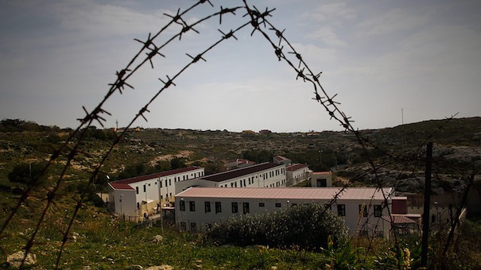

### AYS Daily Digest 26/11/20: Alarming news arriving from Lampedusa
### Serious consequences of mismanagement in Italy / Holding Frontex responsible / Spanish ombudsman asks for the immediate closure of Arguineguín / Sweden lists countries whose nationals have “obviously unfounded” asylum applications / recommended reads & more news

[Are You Syrious?](?source=post_page-----ce4e46f32deb--------------------------------)

[Nov 28](ays-daily-digest-27-11-20-alarming-news-arriving-from-lampedusa-ce4e46f32deb?source=post_page-----ce4e46f32deb--------------------------------) · 6 min read

### FEATURED

> _\(…\)broken bathrooms, devastated systems, the impossibility of even taking a simple shower\. The condition of non\-access to the right to asylum remains\. Migrants are made to sign papers which they do not understand\. There is much talk of virus prevention but each of the people in Lampedusa wears the same mask for over 20 days\._ 

These are just some of the alarming issues Lasciateci entrare has reported about from Lampedusa, stating that arrests are validated without appeal during video hearing sessions\.

> _“Without even listening to people\. A few days ago one of the children in the centre was injured by a dog bite\.”_ 

There are those who have been in the hotspot for over 30 days, in a daily situation of inhuman and degrading treatment, they say\.

At the same time, at the Villa Sant ‘ Andrea Centre in Valderice Trapani last week a young man, a Tunisian citizen, threw himself out of the window, escaping police violence that occurred on\-site as a measure ahead of forced repatriation\. His friends were asking if he was breathing\. Another traumatic experience for many of the people in detention and reception centres across the country\.

> _′′ What number is it?… 110\. \. his name is Ahmed ′′_ 
 

> _Ahmed was in a blood lake\. Real estate\. But alive\._ 
 

> _Ahmed is still in the hospital\. He didn’t die thankfully\._ 

### GENERAL
### [Why it is so Hard to Hold Frontex Accountable: On Blame\-Shifting and an Outdated Remedies System](https://l.facebook.com/l.php?u=https%3A%2F%2Fwww.ejiltalk.org%2Fwhy-it-is-so-hard-to-hold-frontex-accountable-on-blame-shifting-and-an-outdated-remedies-system%2F%3Ffbclid%3DIwAR3Ud34ZDYjyYbKrLv6p84zp5ulKfTw9WBRjRIGY1gdT4WndYmYc60Ca_FA&h=AT0KqJfudAz_1zOcjP0zz8IuCexk0yR197X4QOV6GPuFuEuLDLmE5EQje2ZSwNBN0pPWsnI2KO8hLde2sdtR8DzFCX10o4dRFQOTrxQVMsxtkNXt5_dQDvNU8m4kPfopAg&__tn__=H-R&c[0]=AT27grVGLTVVU_tsYpJefgWdA4iHZJdAY58XBaI0O24www9bcQK1JNeDf-tMYqhJFn1Z4Pr2BSy3KH_hrBUL5SM6pKhW2ZCUq7mu-ZEM2QfY6hNb4oTlLeirwAP5wV1zKub6AWphQAxOoURR9uZViWZc5m5_U4m7N1UTHmjEAW571Hfc00I7jO11cnAPT0pmbPCJXv1lYWFQ9_1cNg)
### [On Friday 23 October, a joint investigation conducted by Bellingcat, Lighthouse Reports, Der Spiegel, ARD, and TV Asahi…](https://l.facebook.com/l.php?u=https%3A%2F%2Fwww.ejiltalk.org%2Fwhy-it-is-so-hard-to-hold-frontex-accountable-on-blame-shifting-and-an-outdated-remedies-system%2F%3Ffbclid%3DIwAR3Ud34ZDYjyYbKrLv6p84zp5ulKfTw9WBRjRIGY1gdT4WndYmYc60Ca_FA&h=AT0KqJfudAz_1zOcjP0zz8IuCexk0yR197X4QOV6GPuFuEuLDLmE5EQje2ZSwNBN0pPWsnI2KO8hLde2sdtR8DzFCX10o4dRFQOTrxQVMsxtkNXt5_dQDvNU8m4kPfopAg&__tn__=H-R&c[0]=AT27grVGLTVVU_tsYpJefgWdA4iHZJdAY58XBaI0O24www9bcQK1JNeDf-tMYqhJFn1Z4Pr2BSy3KH_hrBUL5SM6pKhW2ZCUq7mu-ZEM2QfY6hNb4oTlLeirwAP5wV1zKub6AWphQAxOoURR9uZViWZc5m5_U4m7N1UTHmjEAW571Hfc00I7jO11cnAPT0pmbPCJXv1lYWFQ9_1cNg)
#### [l\.facebook\.com](https://l.facebook.com/l.php?u=https%3A%2F%2Fwww.ejiltalk.org%2Fwhy-it-is-so-hard-to-hold-frontex-accountable-on-blame-shifting-and-an-outdated-remedies-system%2F%3Ffbclid%3DIwAR3Ud34ZDYjyYbKrLv6p84zp5ulKfTw9WBRjRIGY1gdT4WndYmYc60Ca_FA&h=AT0KqJfudAz_1zOcjP0zz8IuCexk0yR197X4QOV6GPuFuEuLDLmE5EQje2ZSwNBN0pPWsnI2KO8hLde2sdtR8DzFCX10o4dRFQOTrxQVMsxtkNXt5_dQDvNU8m4kPfopAg&__tn__=H-R&c[0]=AT27grVGLTVVU_tsYpJefgWdA4iHZJdAY58XBaI0O24www9bcQK1JNeDf-tMYqhJFn1Z4Pr2BSy3KH_hrBUL5SM6pKhW2ZCUq7mu-ZEM2QfY6hNb4oTlLeirwAP5wV1zKub6AWphQAxOoURR9uZViWZc5m5_U4m7N1UTHmjEAW571Hfc00I7jO11cnAPT0pmbPCJXv1lYWFQ9_1cNg)

Expect more on the current affairs of Frontex in our upcoming Special\.

On Wednesday, after [a surprise move b](http://v) y the Chair of the Development Committee, Tomas Tobé, the European Parliament voted in favour of making EU aid to developing countries conditional on their compliance with EU migration control objectives\.

The Development Committee of the European Parliament has been working on the report on “Improving development effectiveness and efficiency of aid” since January 2020\. However, shortly before the plenary vote on Wednesday, Tomas Tobé of the EPP group suddenly added an amendment to allow the EU to **refuse to give aid to partner countries that don’t comply with EU migration requirements\.**
### GREECE

**Update from MSF on the Greek government’s eviction policy:**
### [Left on the streets](https://l.facebook.com/l.php?u=https%3A%2F%2Fstorymaps.arcgis.com%2Fstories%2F583f8b48a857442cb8d27411c93a9664%3Ffbclid%3DIwAR0koaa_28bTXb4YZqSiozxl2-fgOaRSARQ4FLjcmmDqCD1-6iRTjz-6lnU&h=AT3mIwiFPA3xahzjItoNJUz4vSgA_JurK_MWHDheNBmzNvDr-vwV177-YasH7LnMkY9IlSZNhfAzAZzALcZGOyeDm3B16mP7kilQtwbCyxSYRA0nORLovgD-4bhWJG_luA&__tn__=H-R&c[0]=AT0sRzj0jUt_8Voo-Uxomx8hota3lI4CKLOdEpJXBLSi5yWqFqZ9JK496WZ7cZEotrlAvTtpJknrTasqTcH_kXIWXaKpG0gsl1pKSuY2p7TZhp8itI5PpuUhEh59xuuuVQn27KZk_nSzOXDPVU5-xpJ2zx1es7PWOB0BDlUblWvuWvh3QtRYCn-8-0sTqPkBMEoIxSr4xB8yHCsT5Q)
### [11,000 refugees face eviction in Greece](https://l.facebook.com/l.php?u=https%3A%2F%2Fstorymaps.arcgis.com%2Fstories%2F583f8b48a857442cb8d27411c93a9664%3Ffbclid%3DIwAR0koaa_28bTXb4YZqSiozxl2-fgOaRSARQ4FLjcmmDqCD1-6iRTjz-6lnU&h=AT3mIwiFPA3xahzjItoNJUz4vSgA_JurK_MWHDheNBmzNvDr-vwV177-YasH7LnMkY9IlSZNhfAzAZzALcZGOyeDm3B16mP7kilQtwbCyxSYRA0nORLovgD-4bhWJG_luA&__tn__=H-R&c[0]=AT0sRzj0jUt_8Voo-Uxomx8hota3lI4CKLOdEpJXBLSi5yWqFqZ9JK496WZ7cZEotrlAvTtpJknrTasqTcH_kXIWXaKpG0gsl1pKSuY2p7TZhp8itI5PpuUhEh59xuuuVQn27KZk_nSzOXDPVU5-xpJ2zx1es7PWOB0BDlUblWvuWvh3QtRYCn-8-0sTqPkBMEoIxSr4xB8yHCsT5Q)
#### [l\.facebook\.com](https://l.facebook.com/l.php?u=https%3A%2F%2Fstorymaps.arcgis.com%2Fstories%2F583f8b48a857442cb8d27411c93a9664%3Ffbclid%3DIwAR0koaa_28bTXb4YZqSiozxl2-fgOaRSARQ4FLjcmmDqCD1-6iRTjz-6lnU&h=AT3mIwiFPA3xahzjItoNJUz4vSgA_JurK_MWHDheNBmzNvDr-vwV177-YasH7LnMkY9IlSZNhfAzAZzALcZGOyeDm3B16mP7kilQtwbCyxSYRA0nORLovgD-4bhWJG_luA&__tn__=H-R&c[0]=AT0sRzj0jUt_8Voo-Uxomx8hota3lI4CKLOdEpJXBLSi5yWqFqZ9JK496WZ7cZEotrlAvTtpJknrTasqTcH_kXIWXaKpG0gsl1pKSuY2p7TZhp8itI5PpuUhEh59xuuuVQn27KZk_nSzOXDPVU5-xpJ2zx1es7PWOB0BDlUblWvuWvh3QtRYCn-8-0sTqPkBMEoIxSr4xB8yHCsT5Q)

It is interesting to read this given that a few weeks ago Notis Mitarakis told [Infomigrants](https://l.facebook.com/l.php?u=https%3A%2F%2Fwww.infomigrants.net%2Fen%2Fpost%2F28372%2Fmitarakis-we-are-protecting-our-borders-in-line-with-international-law%3Ffbclid%3DIwAR0Fqy6z6a8GqAVi2ETlwNelDRTmvmpRNB1fuEX_GJpnYzHh8_9zKEdHMjQ&h=AT0w_qX05ar8C8VkQjUxY5uY4wpm0esGHCVs_UkcaQHKD96hNLZHnZjqaVI1fenARRCTl14KZI2C9cmbeLmtug0eUzudILMXS9zCayA_UjVndqvM388yRfKUYxTv065FFOdhzTkcBc9kOQ&__tn__=R]-R&c[0]=AT0sRzj0jUt_8Voo-Uxomx8hota3lI4CKLOdEpJXBLSi5yWqFqZ9JK496WZ7cZEotrlAvTtpJknrTasqTcH_kXIWXaKpG0gsl1pKSuY2p7TZhp8itI5PpuUhEh59xuuuVQn27KZk_nSzOXDPVU5-xpJ2zx1es7PWOB0BDlUblWvuWvh3QtRYCn-8-0sTqPkBMEoIxSr4xB8yHCsT5Q) there is no eviction crisis\.
More discrepancies arise in practice\.

> _“Usually I don’t fall asleep until the first sun sets,” says the father of four from Baghran, Afghanistan, who lives in the camp of [M](https://www.facebook.com/hashtag/moria2?__eep__=6&__cft__[0]=AZWp7t5KFMEuRfCQF1GWOBqEc-KC_kL2Zf6zcGFAS3dG2Ngl_iUfaHKDlpXjcFwefS725EklZ13ldy5Nw1YoKfVeQ1TUyvIzH9G8JJPubfzZBPRgAcFiaSDTe772leKT2DTvEhmaXR1YBEzHnioEjwCFnd_5ry7CmWAvWu3IzJ1qaY-BIIY5zjAlmsLIZgFI_jk&__tn__=R]-R) oria2 in a tent, “at night the wind hits the tarpaulin in the tent so hard that I can still carry the echo in my ears until noon\.”_ 

### SERBIA

NNK team reports from Šid: “A few days ago, the police again broke into one of the places where many kids were resting\. A place very close to Sid\. Unlike last week, this week there was violence\. Most were able to flee, except one of the boys, he was the one who got beaten up, according to what he told us\. On the head and the face to be exact\. He said that they put him in a van and took him to a field near Sid\. He is back with his family, but his face is swollen and his nose is probably broken\.”
### SPAIN
### “The physical integrity of the people crowded in the port is being put at risk”

The controversial facilities at the Arguineguín dock, where more than 2,300 people were crowded at its peak, have been singled out for violating human rights\. The Ombudsman has asked the Ministry of the Interior for the immediate closure of the Arguineguín camp, Spanish media have reported\. If there is no response to a reminder of legal duties like this one, the Ombudsman could go to the prosecutor’s office to make known these violations, something that in this case seems unlikely since sources from the department headed by Grande Marlaska insist on working on decommissioning\.
### Gran Canaria

The two communities of Mogán and San Bartolomé de Tirajana in the south of Gran Canaria are threatening the operators of 16 hotels with heavy fines\. Should they not let their contracts with the Spanish government to house boat refugees in their homes expire by the end of December, fines of up to 300,000 euros per hotel would be due\. “The tourist resorts can no longer solve the problems of the Spanish state\. The situation is out of control, ”said Onalia Bueno, Mayor of Mogán, at a press conference on Thursday\. She wants to apply a municipal ordinance that prohibits hotels from accepting other residents as tourists\.
### [Tensions rise over housing of African migrants on Spain’s Canary Islands](https://l.facebook.com/l.php?u=https%3A%2F%2Fenglish.alarabiya.net%2Fen%2FNews%2Fworld%2F2020%2F11%2F27%2FTensions-rise-over-housing-of-African-migrants-on-Spain-s-Canary-Islands%3Ffbclid%3DIwAR3I659NEnjyx0N4JTcLITp3DhLKSzgdy8riYlN4wrSWoVREGA69Tu42498&h=AT3wC3fHFO_7zEm5AWwBDEEpgeXxd7N7Xv3qygmc3BR32k5DsP4CSjgopbm5BRAtG6QOeGCFRShJv0LTbwLv7MA6_QhIkA4EqfoVzaoA2VpKlnQ-jBqASokQCRjAZITyatOga7WJVWdBoA&__tn__=R]-R&c[0]=AT0qmsR3brS0-wRybB1DBpW81Ocq_KMiHiVrHjhxHxMximkv96ZuTLRIZRU7V1IArimrj7L3gNN6WVkgOsgNSzpFJnm41wzc3XILBRVXgl0_dkneWtI6pnhR2JQueFxaqAg4KCWMH7M-QgX07RHALcTa-58FaKlc7wSNdONiPjWbrPKg-10xZaKmiQOGzQjPHgy6fLkLex5w6OCu_Q)
### [A row over where to house African migrants increasingly arriving by boat on Spain’s Canary Islands deepened Thursday…](https://l.facebook.com/l.php?u=https%3A%2F%2Fenglish.alarabiya.net%2Fen%2FNews%2Fworld%2F2020%2F11%2F27%2FTensions-rise-over-housing-of-African-migrants-on-Spain-s-Canary-Islands%3Ffbclid%3DIwAR3I659NEnjyx0N4JTcLITp3DhLKSzgdy8riYlN4wrSWoVREGA69Tu42498&h=AT3wC3fHFO_7zEm5AWwBDEEpgeXxd7N7Xv3qygmc3BR32k5DsP4CSjgopbm5BRAtG6QOeGCFRShJv0LTbwLv7MA6_QhIkA4EqfoVzaoA2VpKlnQ-jBqASokQCRjAZITyatOga7WJVWdBoA&__tn__=R]-R&c[0]=AT0qmsR3brS0-wRybB1DBpW81Ocq_KMiHiVrHjhxHxMximkv96ZuTLRIZRU7V1IArimrj7L3gNN6WVkgOsgNSzpFJnm41wzc3XILBRVXgl0_dkneWtI6pnhR2JQueFxaqAg4KCWMH7M-QgX07RHALcTa-58FaKlc7wSNdONiPjWbrPKg-10xZaKmiQOGzQjPHgy6fLkLex5w6OCu_Q)
#### [l\.facebook\.com](https://l.facebook.com/l.php?u=https%3A%2F%2Fenglish.alarabiya.net%2Fen%2FNews%2Fworld%2F2020%2F11%2F27%2FTensions-rise-over-housing-of-African-migrants-on-Spain-s-Canary-Islands%3Ffbclid%3DIwAR3I659NEnjyx0N4JTcLITp3DhLKSzgdy8riYlN4wrSWoVREGA69Tu42498&h=AT3wC3fHFO_7zEm5AWwBDEEpgeXxd7N7Xv3qygmc3BR32k5DsP4CSjgopbm5BRAtG6QOeGCFRShJv0LTbwLv7MA6_QhIkA4EqfoVzaoA2VpKlnQ-jBqASokQCRjAZITyatOga7WJVWdBoA&__tn__=R]-R&c[0]=AT0qmsR3brS0-wRybB1DBpW81Ocq_KMiHiVrHjhxHxMximkv96ZuTLRIZRU7V1IArimrj7L3gNN6WVkgOsgNSzpFJnm41wzc3XILBRVXgl0_dkneWtI6pnhR2JQueFxaqAg4KCWMH7M-QgX07RHALcTa-58FaKlc7wSNdONiPjWbrPKg-10xZaKmiQOGzQjPHgy6fLkLex5w6OCu_Q)
### PORTUGAL

23people have arrived in Portugal from Turkey and Egypt in the latest of the arrivals welcomed by the country that has opened up to receiving more people than initially thought\. According to the media, 530 people have arrived in the country under the Voluntary Resettlement Programme of UNHCR and the European Commission\. Of these, 245 arrived from Egypt and 285 from Turkey\.
### SWEDEN
### Introducing “obviously unfounded” applicants for asylum

The government has proposed introducing a list of safe countries and speeding up deportations to the countries listed as “safe”\. It would then be possible to deport individuals who “obviously lack the right to asylum”, as the officials put it, faster\. Amnesty strongly condemns this as it would jeopardize the rule of law\. Applications from nationals coming from the countries listed would immediately be considered as “obviously unfounded”\.

The new rules would, if the government has it their way, apply from May 2021\. People from countries such as Uzbekistan, Ukraine, Albania, Mongolia or Georgia would be affected by this as the recognition rate is very low, according to the migration minister Morgan Johansson \(Social Democrats\) \. Amnesty said that regardless of this, individual claims have to be investigated as someone could be eligible for asylum regardless of the statistics\. Sweden previously used a similar fast\-tracking system for people coming from the Western Balkans, but a ruling from the EU court put an end to this system in 2018\.

1569“unauthorized entries” were documented from Scandinavia, all people arriving in Germany in the period from January to October of this year\. Germany had a total of 13,146 takeover requests sent to other EU member states\. Sweden accounted for 943 or 7\.2 percent\. The main addressees are Greece, Italy and France\. See more [here](https://www.hasepost.de/ueber-1-500-migranten-unerlaubt-aus-skandinavien-eingereist-224062/?fbclid=IwAR1Api3YYp9uyn6yaw4rxHeN_DX0HyrLewQY7MsZsO8XyUxQmzWVkH41eLY) \.
### FOR FURTHER READING
### [Call me illegal: The semantic struggle over seeking asylum in Australia](https://l.facebook.com/l.php?u=https%3A%2F%2Freutersinstitute.politics.ox.ac.uk%2Four-research%2Fcall-me-illegal-semantic-struggle-over-seeking-asylum-australia%3Ffbclid%3DIwAR1SF_srrnd8QAr47D3pm1E-u1t9Hj3wQyxIGDzv2oG7GGywutEh8PcWGcU&h=AT3nF7PmGd5qd9h2Mgmv4vRMUnrbYCpzMw5iYZt0aJXN4kiQG3L9MKzMvz3m5Q1vZTuuwQkTIwL3TEyyr4DfYwliw16KEQMAeY9xkpBE_htIywRO7oq6wjz1KLx3ngwQIX3KOVa8mCiEAw&__tn__=R]-R&c[0]=AT2EE0WRww7-itLD4I-qLd7FEMRN1k6Gh6HakFNuMiE-0seJhIA6Wfg4PkzsfhdG0Fe-6F03RVAOt86DyCU6hs_qz8QHIjbqFgJpW3S6lBECmhwq3fWO8xSXECfzzVi2r-5Xt9b3Z6mXQS32YrUyZhmis3_u1O2w_V7kNNSTcphQgMwUlMTJv71jhvB_48t70aTvSqnlkXtp4MBKPQ)
### [Ben Doherty, a journalist with the Guardian in Australia and a Thomson Reuters fellow in Trinity term 2015, has written…](https://l.facebook.com/l.php?u=https%3A%2F%2Freutersinstitute.politics.ox.ac.uk%2Four-research%2Fcall-me-illegal-semantic-struggle-over-seeking-asylum-australia%3Ffbclid%3DIwAR1SF_srrnd8QAr47D3pm1E-u1t9Hj3wQyxIGDzv2oG7GGywutEh8PcWGcU&h=AT3nF7PmGd5qd9h2Mgmv4vRMUnrbYCpzMw5iYZt0aJXN4kiQG3L9MKzMvz3m5Q1vZTuuwQkTIwL3TEyyr4DfYwliw16KEQMAeY9xkpBE_htIywRO7oq6wjz1KLx3ngwQIX3KOVa8mCiEAw&__tn__=R]-R&c[0]=AT2EE0WRww7-itLD4I-qLd7FEMRN1k6Gh6HakFNuMiE-0seJhIA6Wfg4PkzsfhdG0Fe-6F03RVAOt86DyCU6hs_qz8QHIjbqFgJpW3S6lBECmhwq3fWO8xSXECfzzVi2r-5Xt9b3Z6mXQS32YrUyZhmis3_u1O2w_V7kNNSTcphQgMwUlMTJv71jhvB_48t70aTvSqnlkXtp4MBKPQ)
#### [l\.facebook\.com](https://l.facebook.com/l.php?u=https%3A%2F%2Freutersinstitute.politics.ox.ac.uk%2Four-research%2Fcall-me-illegal-semantic-struggle-over-seeking-asylum-australia%3Ffbclid%3DIwAR1SF_srrnd8QAr47D3pm1E-u1t9Hj3wQyxIGDzv2oG7GGywutEh8PcWGcU&h=AT3nF7PmGd5qd9h2Mgmv4vRMUnrbYCpzMw5iYZt0aJXN4kiQG3L9MKzMvz3m5Q1vZTuuwQkTIwL3TEyyr4DfYwliw16KEQMAeY9xkpBE_htIywRO7oq6wjz1KLx3ngwQIX3KOVa8mCiEAw&__tn__=R]-R&c[0]=AT2EE0WRww7-itLD4I-qLd7FEMRN1k6Gh6HakFNuMiE-0seJhIA6Wfg4PkzsfhdG0Fe-6F03RVAOt86DyCU6hs_qz8QHIjbqFgJpW3S6lBECmhwq3fWO8xSXECfzzVi2r-5Xt9b3Z6mXQS32YrUyZhmis3_u1O2w_V7kNNSTcphQgMwUlMTJv71jhvB_48t70aTvSqnlkXtp4MBKPQ)

Moria’s unaccompanied minors:
### [MORIA’S UNACCOMPANNIED MINORS WEILD THE POWER OF A PENCIL](https://l.facebook.com/l.php?u=https%3A%2F%2Ftheazadiproject.com%2F2020%2F11%2F24%2Fmorias-unaccompannied-minors-weild-the-power-of-a-pencil%3Ffbclid%3DIwAR1oY37KiLyxa02EvytRYHRFdZJgl-zEbK5SU3heBKR3dVTNYX9R8c2CxIA&h=AT33_OrnonaNxcUnpeaT1m9WssG_9DwLxoysGDEXb9qf6DtlwgFZjclWMMPnm86A7K_iUPoecPu5ktlMfub8Pb8bR_6uJQPvuBAqGRQ_xF_n5yLbdSPL1hAqwSow1k7MgkpvwWLhnt7iDg&__tn__=R]-R&c[0]=AT0sRzj0jUt_8Voo-Uxomx8hota3lI4CKLOdEpJXBLSi5yWqFqZ9JK496WZ7cZEotrlAvTtpJknrTasqTcH_kXIWXaKpG0gsl1pKSuY2p7TZhp8itI5PpuUhEh59xuuuVQn27KZk_nSzOXDPVU5-xpJ2zx1es7PWOB0BDlUblWvuWvh3QtRYCn-8-0sTqPkBMEoIxSr4xB8yHCsT5Q)
### [By Alison Waldman November 2020 “I think I’ll need to change my name if I ever get to the US\. It may frighten people,”…](https://l.facebook.com/l.php?u=https%3A%2F%2Ftheazadiproject.com%2F2020%2F11%2F24%2Fmorias-unaccompannied-minors-weild-the-power-of-a-pencil%3Ffbclid%3DIwAR1oY37KiLyxa02EvytRYHRFdZJgl-zEbK5SU3heBKR3dVTNYX9R8c2CxIA&h=AT33_OrnonaNxcUnpeaT1m9WssG_9DwLxoysGDEXb9qf6DtlwgFZjclWMMPnm86A7K_iUPoecPu5ktlMfub8Pb8bR_6uJQPvuBAqGRQ_xF_n5yLbdSPL1hAqwSow1k7MgkpvwWLhnt7iDg&__tn__=R]-R&c[0]=AT0sRzj0jUt_8Voo-Uxomx8hota3lI4CKLOdEpJXBLSi5yWqFqZ9JK496WZ7cZEotrlAvTtpJknrTasqTcH_kXIWXaKpG0gsl1pKSuY2p7TZhp8itI5PpuUhEh59xuuuVQn27KZk_nSzOXDPVU5-xpJ2zx1es7PWOB0BDlUblWvuWvh3QtRYCn-8-0sTqPkBMEoIxSr4xB8yHCsT5Q)
#### [l\.facebook\.com](https://l.facebook.com/l.php?u=https%3A%2F%2Ftheazadiproject.com%2F2020%2F11%2F24%2Fmorias-unaccompannied-minors-weild-the-power-of-a-pencil%3Ffbclid%3DIwAR1oY37KiLyxa02EvytRYHRFdZJgl-zEbK5SU3heBKR3dVTNYX9R8c2CxIA&h=AT33_OrnonaNxcUnpeaT1m9WssG_9DwLxoysGDEXb9qf6DtlwgFZjclWMMPnm86A7K_iUPoecPu5ktlMfub8Pb8bR_6uJQPvuBAqGRQ_xF_n5yLbdSPL1hAqwSow1k7MgkpvwWLhnt7iDg&__tn__=R]-R&c[0]=AT0sRzj0jUt_8Voo-Uxomx8hota3lI4CKLOdEpJXBLSi5yWqFqZ9JK496WZ7cZEotrlAvTtpJknrTasqTcH_kXIWXaKpG0gsl1pKSuY2p7TZhp8itI5PpuUhEh59xuuuVQn27KZk_nSzOXDPVU5-xpJ2zx1es7PWOB0BDlUblWvuWvh3QtRYCn-8-0sTqPkBMEoIxSr4xB8yHCsT5Q)

A comment by our friend Emina: “Two parallel scenarios are being written in Croatia — a graveyard and a collection/screening centre\. The pact will directly lead to the growth of nameless graves and missing bodies along borders as the number of deaths will progressively increase”
### [Emina Bužinkić: Hrvatska će postati probirnica](https://l.facebook.com/l.php?u=https%3A%2F%2Fwww.portalnovosti.com%2Femina-buzinkic-hrvatska-ce-postati-probirnica%3Ffbclid%3DIwAR0vLgJrLZONRfiFzFjmadKvp_J9ZqluTpoJ6SOWy5Q5UVy-5fB1U_DhmKs&h=AT3Y5oi1uG5psHbenb_oTPdMvNXg7v0wD4jp-y1vH36dojwokCUqfg-TwJWVE-xZ5cuM6ps6lbembeCAYRhMJxoli2mawZwM2wePXPu7f2FxF5Z6lBjdZzTvTiu3slArCw&__tn__=%2CmH-R&c[0]=AT1rzjy2-QYzwNn5Ub82W9S-dLRzuWzXEwjHntwZHL-BTD1F6WJd912Z7jIkKhstjq_HgDNAgKQxGcS4u1-rpsL6q68AwZFrszz4JXsAtFKLw-GsBMXGFJEDmB8W0s29tEmBmN7HLlL6QOd39S6Kpyem6-ihojbQ3nhbM3n21IAT0WD4XxzAzZmLVIy3F7-IeFacaNlrxbMNpS8xvA)
### [piše Mirna Jasić Gašić Hrvatskoj se pišu dva paralelna scenarija — grobarnica i sabirnica/probirnica\. Pakt će…](https://l.facebook.com/l.php?u=https%3A%2F%2Fwww.portalnovosti.com%2Femina-buzinkic-hrvatska-ce-postati-probirnica%3Ffbclid%3DIwAR0vLgJrLZONRfiFzFjmadKvp_J9ZqluTpoJ6SOWy5Q5UVy-5fB1U_DhmKs&h=AT3Y5oi1uG5psHbenb_oTPdMvNXg7v0wD4jp-y1vH36dojwokCUqfg-TwJWVE-xZ5cuM6ps6lbembeCAYRhMJxoli2mawZwM2wePXPu7f2FxF5Z6lBjdZzTvTiu3slArCw&__tn__=%2CmH-R&c[0]=AT1rzjy2-QYzwNn5Ub82W9S-dLRzuWzXEwjHntwZHL-BTD1F6WJd912Z7jIkKhstjq_HgDNAgKQxGcS4u1-rpsL6q68AwZFrszz4JXsAtFKLw-GsBMXGFJEDmB8W0s29tEmBmN7HLlL6QOd39S6Kpyem6-ihojbQ3nhbM3n21IAT0WD4XxzAzZmLVIy3F7-IeFacaNlrxbMNpS8xvA)
#### [l\.facebook\.com](https://l.facebook.com/l.php?u=https%3A%2F%2Fwww.portalnovosti.com%2Femina-buzinkic-hrvatska-ce-postati-probirnica%3Ffbclid%3DIwAR0vLgJrLZONRfiFzFjmadKvp_J9ZqluTpoJ6SOWy5Q5UVy-5fB1U_DhmKs&h=AT3Y5oi1uG5psHbenb_oTPdMvNXg7v0wD4jp-y1vH36dojwokCUqfg-TwJWVE-xZ5cuM6ps6lbembeCAYRhMJxoli2mawZwM2wePXPu7f2FxF5Z6lBjdZzTvTiu3slArCw&__tn__=%2CmH-R&c[0]=AT1rzjy2-QYzwNn5Ub82W9S-dLRzuWzXEwjHntwZHL-BTD1F6WJd912Z7jIkKhstjq_HgDNAgKQxGcS4u1-rpsL6q68AwZFrszz4JXsAtFKLw-GsBMXGFJEDmB8W0s29tEmBmN7HLlL6QOd39S6Kpyem6-ihojbQ3nhbM3n21IAT0WD4XxzAzZmLVIy3F7-IeFacaNlrxbMNpS8xvA)

Some positive stories:
### [Award\-winning idea for recycling plastic in refugee camps](https://l.facebook.com/l.php?u=https%3A%2F%2Fwww.miragenews.com%2Faward-winning-idea-for-recycling-plastic-in-refugee-camps%2F%3Ffbclid%3DIwAR2djsKTLrqtjBGhYAF027lafXfmThZfeYS-Fz0c_NlGpSIoIm6i2zrowFQ&h=AT0IJbDbk0ys0hCtOC5_p8UB59zSpq8lU-0FHpwVj_-PWauY7KZezl7BbtxHFkc9xy_bcPokLdzH5Z7Di3n6HORlv5CELBlBPDZIxD7gSBKkkqbIfxQykYlXz250UBtL3g&__tn__=%2CmH-R&c[0]=AT2EE0WRww7-itLD4I-qLd7FEMRN1k6Gh6HakFNuMiE-0seJhIA6Wfg4PkzsfhdG0Fe-6F03RVAOt86DyCU6hs_qz8QHIjbqFgJpW3S6lBECmhwq3fWO8xSXECfzzVi2r-5Xt9b3Z6mXQS32YrUyZhmis3_u1O2w_V7kNNSTcphQgMwUlMTJv71jhvB_48t70aTvSqnlkXtp4MBKPQ)
### [Three students have just received a Project Plastic award for their sustainable and economically interesting concept…](https://l.facebook.com/l.php?u=https%3A%2F%2Fwww.miragenews.com%2Faward-winning-idea-for-recycling-plastic-in-refugee-camps%2F%3Ffbclid%3DIwAR2djsKTLrqtjBGhYAF027lafXfmThZfeYS-Fz0c_NlGpSIoIm6i2zrowFQ&h=AT0IJbDbk0ys0hCtOC5_p8UB59zSpq8lU-0FHpwVj_-PWauY7KZezl7BbtxHFkc9xy_bcPokLdzH5Z7Di3n6HORlv5CELBlBPDZIxD7gSBKkkqbIfxQykYlXz250UBtL3g&__tn__=%2CmH-R&c[0]=AT2EE0WRww7-itLD4I-qLd7FEMRN1k6Gh6HakFNuMiE-0seJhIA6Wfg4PkzsfhdG0Fe-6F03RVAOt86DyCU6hs_qz8QHIjbqFgJpW3S6lBECmhwq3fWO8xSXECfzzVi2r-5Xt9b3Z6mXQS32YrUyZhmis3_u1O2w_V7kNNSTcphQgMwUlMTJv71jhvB_48t70aTvSqnlkXtp4MBKPQ)
#### [l\.facebook\.com](https://l.facebook.com/l.php?u=https%3A%2F%2Fwww.miragenews.com%2Faward-winning-idea-for-recycling-plastic-in-refugee-camps%2F%3Ffbclid%3DIwAR2djsKTLrqtjBGhYAF027lafXfmThZfeYS-Fz0c_NlGpSIoIm6i2zrowFQ&h=AT0IJbDbk0ys0hCtOC5_p8UB59zSpq8lU-0FHpwVj_-PWauY7KZezl7BbtxHFkc9xy_bcPokLdzH5Z7Di3n6HORlv5CELBlBPDZIxD7gSBKkkqbIfxQykYlXz250UBtL3g&__tn__=%2CmH-R&c[0]=AT2EE0WRww7-itLD4I-qLd7FEMRN1k6Gh6HakFNuMiE-0seJhIA6Wfg4PkzsfhdG0Fe-6F03RVAOt86DyCU6hs_qz8QHIjbqFgJpW3S6lBECmhwq3fWO8xSXECfzzVi2r-5Xt9b3Z6mXQS32YrUyZhmis3_u1O2w_V7kNNSTcphQgMwUlMTJv71jhvB_48t70aTvSqnlkXtp4MBKPQ)

**Find daily updates and special reports on our [Medium page](https://medium.com/are-you-syrious) \.**

**If you wish to contribute, either by writing a report or a story, or by joining the info gathering team, please let us know\.**

**We strive to echo correct news from the ground through collaboration and fairness\. Every effort has been made to credit organisations and individuals with regard to the supply of information, video, and photo material \(in cases where the source wanted to be accredited\) \. Please notify us regarding corrections\.**

**If there’s anything you want to share or comment, contact us through Facebook, Twitter or write to: areyousyrious@gmail\.com**

_Converted [Medium Post](https://medium.com/are-you-syrious/ays-daily-digest-26-11-20-alarming-news-arriving-from-lampedusa-e7424917c8a8) by [ZMediumToMarkdown](https://github.com/ZhgChgLi/ZMediumToMarkdown)._
