### AYS Daily Digest 30/11/20 What was old is new again with new map for Moria 2\.0

[Are You Syrious?](?source=post_page-----52f4cc9ce14e--------------------------------)

[Dec 1](ays-daily-digest-30-11-20-what-was-old-is-new-again-with-new-map-for-moria-2-0-52f4cc9ce14e?source=post_page-----52f4cc9ce14e--------------------------------) · 9 min read

_The Arguineguín camp is emptied // Germany’s debate on whether to deport to Syria // Home Office still saying migrants are traffickers, even after Judge says no // and more…_

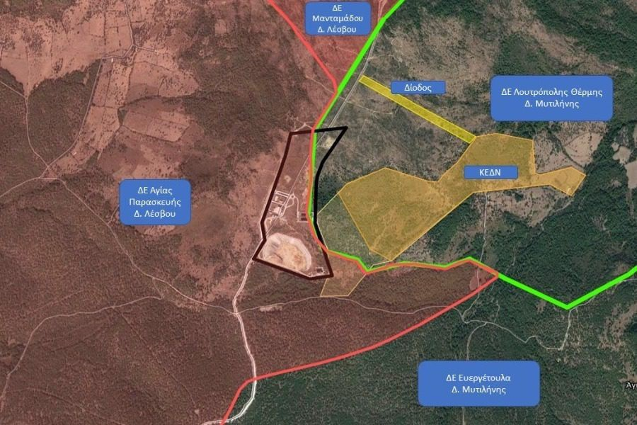

### FEATURE: New map of camp/RIC for Lesvos

The Ministry of Immigration and Asylum confirmed on Sunday a map of the new Closed Controlled Structure of Islands in Vastria, north\-eastern Lesvos within the boundaries of the Municipality of Mytilene\. The building is supposed to start around Easter and end in the fall of 2021\. The camp will be accessible from a road that apparently goes to a landfill…but the camp will have “no contact” with the landfill\. As Stonsi Gr reports:

> _“It should be noted here that the position was proposed by the Mayor of Mytilene, Strati Kyteli, and the Lesvos MP of New Democracy and 2nd Deputy Speaker of Parliament, Charalambos Athanassiou\. The position proposed to create the new structure is noted to belong to the administrative boundaries of the Municipality of Mytilene and specifically of the Community of Nea Kydonia\. During their visit to the island, the Minister of Immigration and Asylum Notis Mitarakis and the head of the European Action Group for Lesvos, Deputy Director General of the European Union for Immigration DG HOME Beate Gmter, **came to the position** \. A group of special advisers was with them\.”_ 

Only two and a half months after Moria burned down, this is what is coming\. AYS will continue to report on these developments\.
### LIBYA
### SEA

### GREECE
### Updates from Lesvos

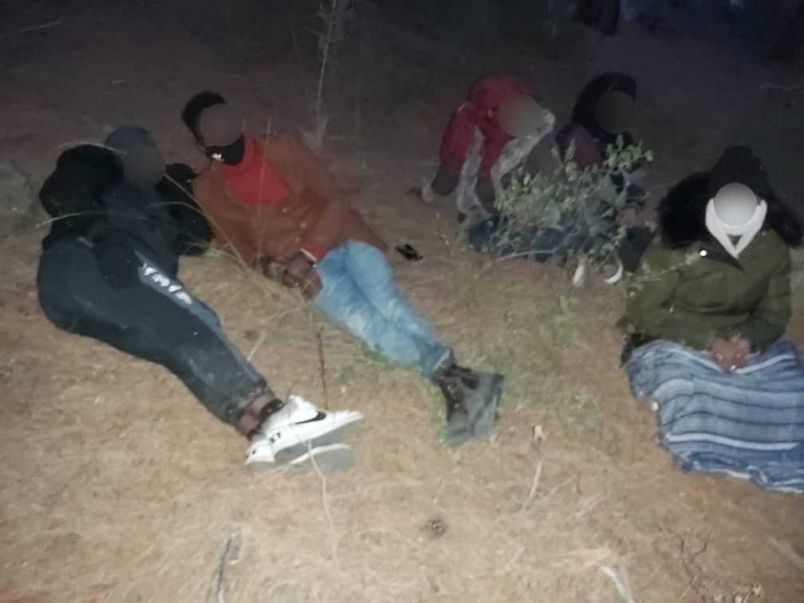

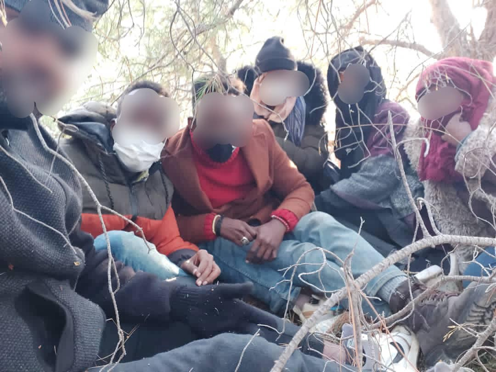

ABR on landings: “ _A boat carrying approximately 27 people landed south of Agrielia Kratigou, Lesvos south 22\.00 \(Sunday\) night\. They are scattered in small groups in the area, hiding in the woods because they are afraid that the Greek coast guard will illegally return them to Turkey\. Aegean Boat Report have obtained pictures, videos and location data, so that we can positively confirm that they are in fact on Lesvos\. Port police has been informed of their whereabouts, and that we have documented their arrival on Lesvos, to try to discourage them from violating their right to seek asylum and trying to return them to Turkey_ \.” [Alarm Phone](https://twitter.com/alarm_phone/status/1333441172174491650]) said they received a call from nine people this night as well\.

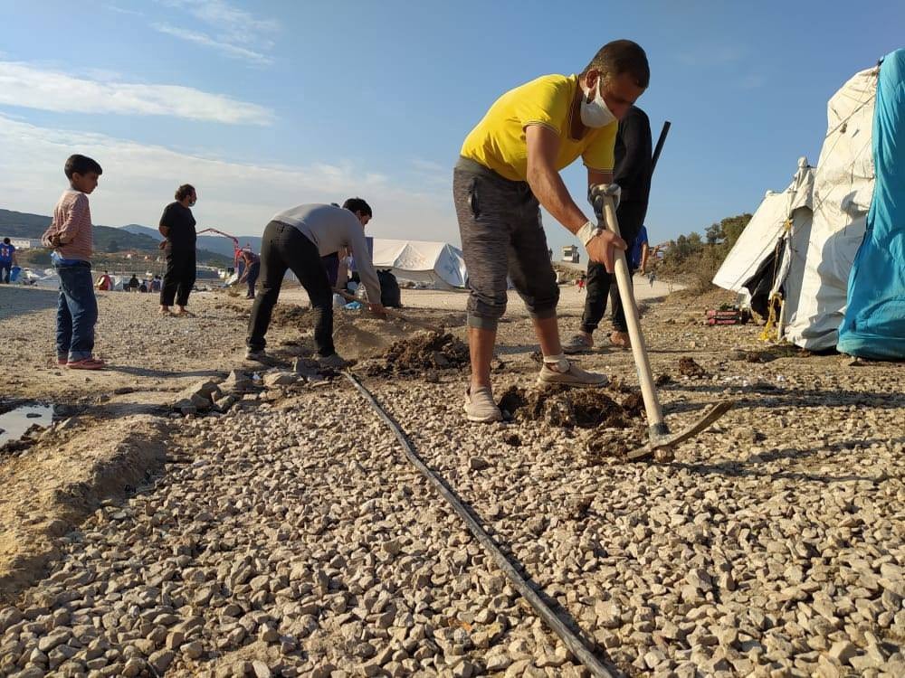

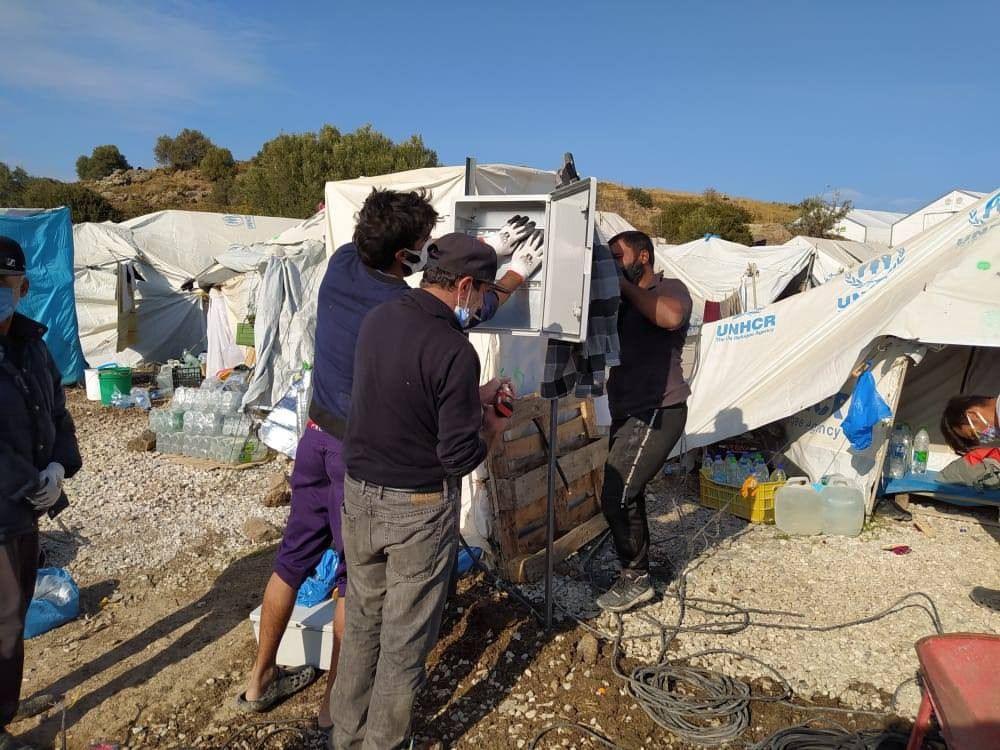

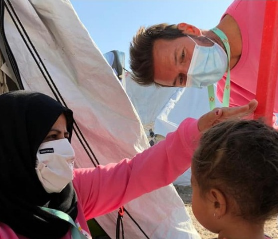

### Updates from Samos
### Update from Leros

From [the Yellow Days](https://www.facebook.com/theyellowdays/posts/2778452512430466) : “ _We are deeply sad to receive the news from Leros… PIKPA LEROS is now shut down for good\. The Yellow Days was born in and thanks to Pikpa\. We made memories, stories and family\. I am currently out of words to describe the incredible work Matina and Spyros had done for years and the big positive impact this place had for thousands of people\. Pikpa was home, community, family…_ ” Learn more [here](https://www.facebook.com/echo100plus/posts/3444860065631838) \.
### Updates from Mainland

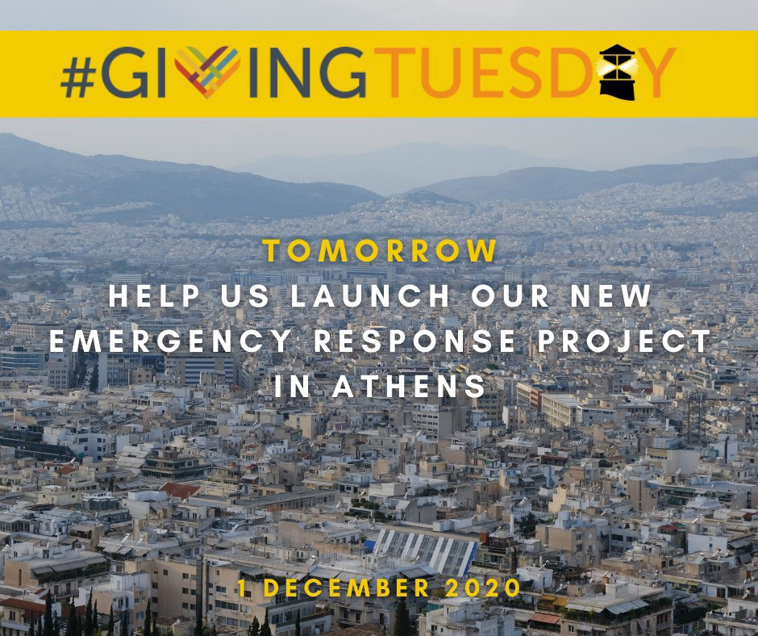

### SPAIN
### The Arguineguín camp has been emptied

Publico is reporting that after three months and nine days, the “untenable” situation was dismantled as of 22:15 on Sunday\. “ _However, some tents will remain on the dock that will be used as a place of first assistance and health screening for those who disembark from the rescue ships from now on_ \.” The president of the Canary Islands, Ángel Víctor Torres, who asked several times for the camp to be closed said:

> _“I am celebrating it, but there is still much to do\. \(The camp\) was set up urgently in August to attend to the migrants who arrived and were rescued\.” He said that reaching 2,600 people has been “unsustainable\.” He reminded Canarian citizens that “nobody likes to leave their family behind…those Canaries, our ancestors, who were forced to leave everything and look for other shores, we carry it in our DNA\. There is no room for xenophobia in the Canary Islands\.”_ 

Read more [here](https://www.publico.es/sociedad/migracion-canarias-campamento-arguineguin-queda-vacio-tres-meses-nueve-dias-despues.html?utm_source=facebook&utm_medium=social&utm_campaign=publico&fbclid=IwAR32T8BV1vh5It9xGUfZnRnwZ8HHVJ1cDd00srDb5DiYxoxGU1DcnZyuy40) \.

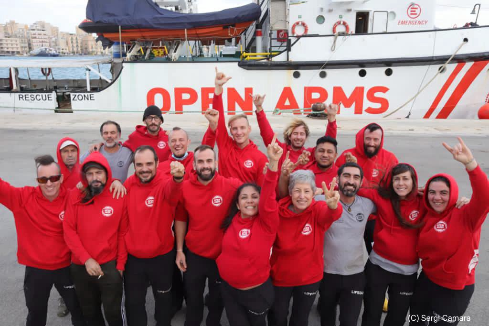

### BALKANS

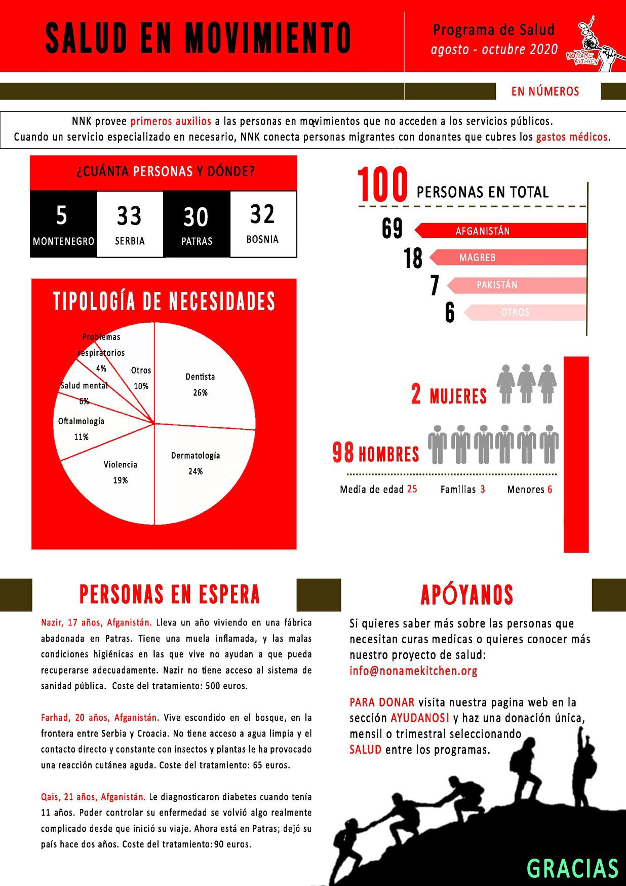

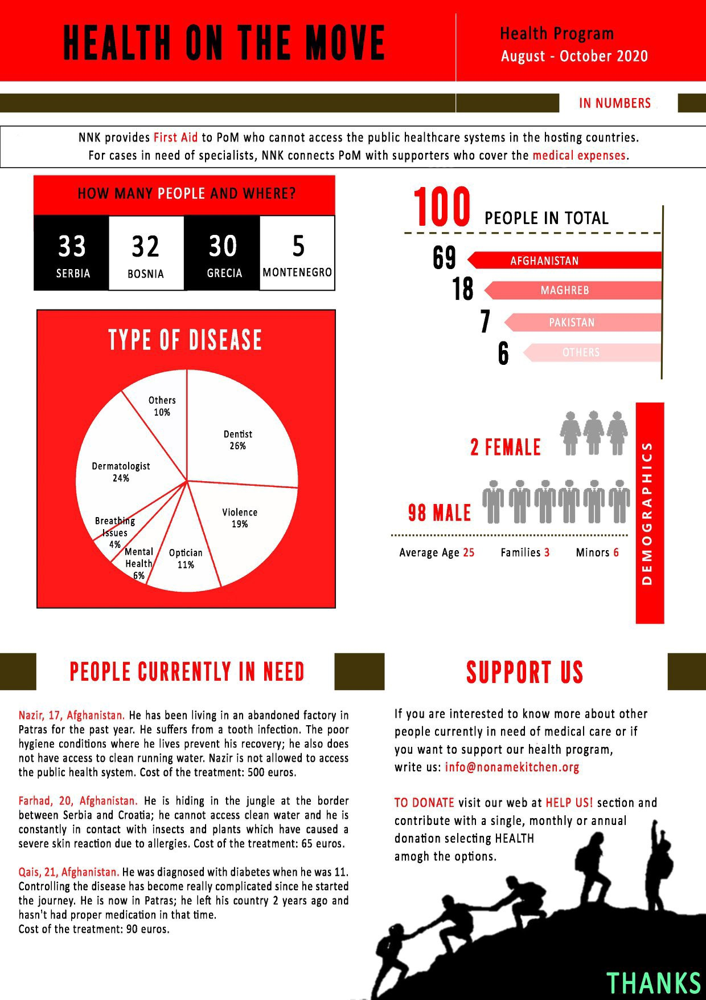

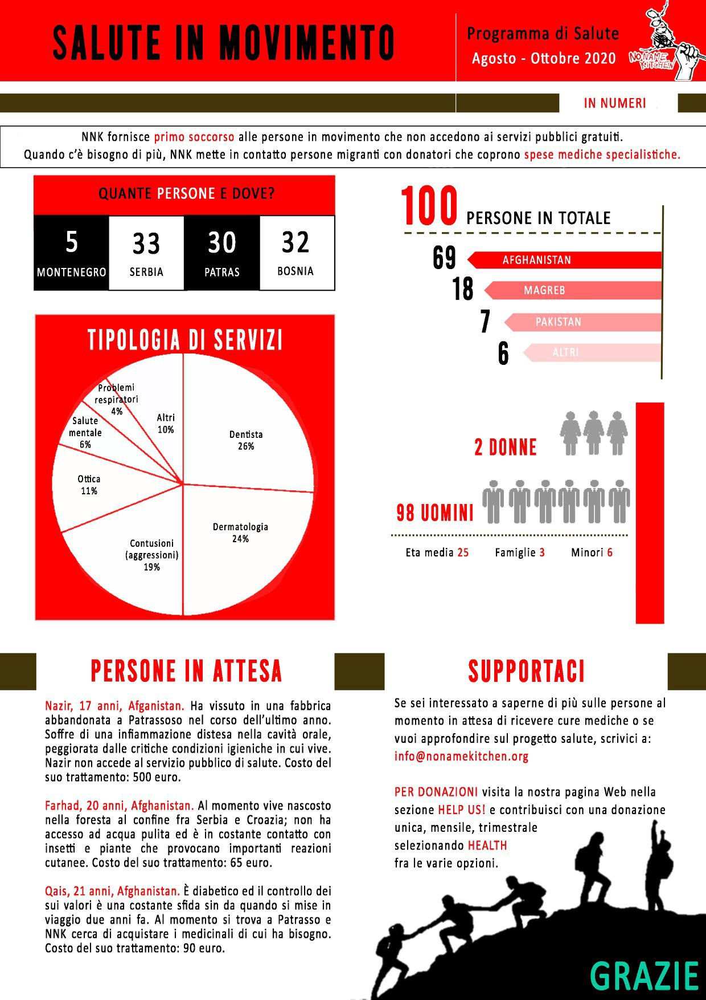

### GERMANY

### Germany still debating on whether it is “safe” to deport to Northern Syria

The country has banned deportations to Syria since 2012, but the extension is set to run out at the end of 2020\. According to [InfoMigrants](https://www.infomigrants.net/en/post/28831/to-deport-or-not-to-deport-germany-mulls-over-security-situation-in-northern-syria?fbclid=IwAR3P-b9z-KwshYw-u5aYKG99zG_DNgT7MPYKVcG1WgqoYrZO2ZklEj-geR0) :

> _“The parliamentary faction of German Chancellor Angela Merkel’s CDU/CSU party wants to use the results of an inquest into the security situation in northern Syria to examine whether the region could be deemed a safe zone for deportation\. But many have criticized the plans\. Regardless of the outcome of the inquest, only those who commit crimes and those deemed to be a risk to society would be deported to northern Syria, if the region were to be classified a safe area\. The vice chair of the parliamentary CDU/CSU faction, Thorsten Frei, appealed to German Interior Minister Heiko Maas to deliver “comprehensive and detailed” results in an upcoming security report to reassess the situation\.”_ 

### FRANCE
### A total of 64 people rescued by French Coast Guard over weekend

According to InfoMigrants: “ _The French Customs and Border control localized the boat in distress at 5:20 am local time on Sunday, November 29\. The boat was about 18 kilometres south\-west of Boulogne\. Two children were reportedly on board this boat, and all 19 migrants aboard “appeared to be suffering from hypothermia” said the statement from the prefecture\. They were taken back to the harbor at Boulogne where they were handed over to fire and rescue personnel and the border police\._ ” More [here](https://www.infomigrants.net/en/post/28819/dozens-of-migrants-rescued-in-channel-at-weekend?fbclid=IwAR0RDDxQ2J5jhNE1zF4SPzm1ole-kEgzeQiRrYofiZFbC4C1YtbxfNpOpac) \.
### EU/FRONTEX
### On Dec 1st, MEPs will “grill Frontex director on agency’s role in pushbacks of asylum\-seekers”

According to a European Parliament press release: “ _MEPs are set to demand answers from the European Border and Coast Guard Agency’s Executive Director Fabrice Leggeri regarding the incidents revealed by media in which Greek coastguards — with the alleged knowledge and even involvement of Frontex operatives — stopped migrants trying to reach EU shores and sent them back to Turkish waters\. They are likely to ask about the outcome of the internal inquiry carried out by the EU’s border agency and the board meeting called at the request of the European Commission_ \.” You can read it in full [here](https://www.europarl.europa.eu/news/en/press-room/20201126IPR92509/meps-to-grill-frontex-director-on-agency-s-role-in-pushbacks-of-asylum-seekers?fbclid=IwAR0pDXzw5tOagCmBPhFYlTil5fYY5BWiRcvbTq_sqjgzhMyHEW3NxCWWF4M) \.

As journalist [Giorgos Christides](https://twitter.com/g_christides/status/1333503968903909376) reported, both the German and Romanian interior ministries have denied involvement with incidents involving Frontex\. Romania denies that their Frontex vessel helped block and push back a dinghy on June 8th\. Germany denies that the German federal police were involved with Frontex pushbacks off Samos on August 10th\. But [Frank Schwabe](https://www.infomigrants.net/en/post/28806/call-to-withdraw-german-police-from-greek-migrant-pushbacks?fbclid=IwAR3BPs51iVelQ5gr4BZlGBF0M0M-oHiIp8WJQxr08TdRYL6DjEqE87McNHE) , the human rights spokesman for Germany’s centre\-left Social Democrats \(SPD\), is calling for the withdrawal of federal police from Frontex:

> _“Germans must on no account be involved in pushbacks, not even indirectly”_ 

**If you need a refresher please refer to Der Spiegel’s reporting back in October “ [Frontex involved in illegal pushbacks by refugees](https://www.spiegel.de/politik/ausland/fluechtlinge-frontex-in-griechenland-in-illegale-pushbacks-verwickelt-a-00000000-0002-0001-0000-000173654787) \.”**
### Council of Europe’s Anti\-Torture Committee announces 2021 visits

They will carry out periodic visits to examine the treatment of people deprived of their liberty in these 10 countries: Austria, Bulgaria, Latvia, Lithuania, Russian Federation, Serbia, Sweden, Switzerland, Turkey, and the United Kingdom\. Serbia and Sweden were visits postponed from 2020\. “ _Persons and organisations in possession of relevant information concerning the situation of persons deprived of their liberty in any of these countries are invited to bring it to the attention of the committee_ \.” More [here](https://www.coe.int/en/web/cpt/-/council-of-europe-anti-torture-committee-announces-periodic-visits-to-ten-countries-in-2021?fbclid=IwAR2eGN9Mm_ZfPPjNW_sIMU8TP9O6NIr0OunekfEvPb0Xi_OSU6gd54u-CoU) \.
### UK
### Judge: Migrants who steer boats across channel are not a part of a trafficking gang

Yet [the Home Office](https://www.independent.co.uk/news/uk/home-news/english-channel-crossings-migrants-jailed-smugglers-patel-b1762927.html) is twisting these remarks so they can continue branding migrants as traffickers\. [Lizzie Dearden](https://twitter.com/lizziedearden/status/1333429734043250688) from the Independent further reports:

> _“Eight migrants have been jailed this year for piloting dinghies from France and more cases are going through the courts\. The Home Office’s immigration enforcement criminal investigations unit using drone footage to identify migrants steering, then referring them to be prosecuted\._ 

> _In October, the CPS issued new guidance to lawyers after some questioned if such charges were in the public interest\. A document said the offence of assisting unlawful immigration could be applied to asylum seekers who steer boats because they have “facilitated” a journey\._ 

> _In a case later that month, Judge Rupert Lowe found that those who pilot boats do not organise crossings, may be coerced and threatened, and are ultimately “one of the trafficked\.” He said steering boats was not “remotely equivalent” to smuggling migrants in a lorry for payment\._ 

> _The Home Office left out that excerpt in a press release branding the Iraqi man being sentenced a “people smuggler\.” In response to a later request for comment, it used a small excerpt of Judge Lowe’s remarks to support the claim that its approach had been “upheld by the courts\.”_ 

> _Detention Action director Bella Sankey called it a “truth\-twisting smear against someone unable to defend themselves\.” The Home Office denied the accusation, saying several judges had passed “significant sentences””_ 

### Auberge des Migrants on France and the UK’s agreement on tougher patrols:

> _“Franco\-British agreements, agreements of shame\. Great Britain will donate € 31\.5m to the French government “to prevent migrants’ crossings of the Channel\.” That’s a lot of money\. It could have been used to welcome exiles to France: it is recalled that the vast majority of exiles stranded at the border are persons rejected by the French or European asylum system\. Great Britain is not a dream, but a last chance for them\. The worst part is that this money won’t prevent crossings: no more drones, barbed wire, radars, police, it will just lead the exiles to take more risks, and pay even more for smugglers\. No boundaries are impassable\. “Authorities” know this, but they want to give pledges to those who fear a “migratory invasion\.” And here is France in the same situation as Turkey: being paid to block people on its territory\. And paid cheap: Erdogan had managed to get € 5 billion\! We are asking for legal ways of access to Britain, and the exit of the Touquet agreements, which Macron promised in case of Brexit\!”_ 

### WORTH READING
- [Open Democracy](https://www.opendemocracy.net/en/can-europe-make-it/informal-housing-and-rise-vigilantism-west-coast-thessaloniki/?fbclid=IwAR3uG09zFPxZ3VhAy3Y5L4xyynGwCD5tCGvbKn9zuwKfA4oIzPeWHiowHcM) just published an article entitled **Informal housing and the rise of vigilantism in West Coast Thessaloniki\.** “ _How EU migration policy works in Thessaloniki\. It doesn’t\. Even the vulture funds have got themselves into trouble\._ ”
- [Solidarity with Migrants](https://www.facebook.com/solidaritymigrants/posts/204974814458389) published an example of how the Greek healthcare systems are not working for refugees and locals alike\. “It is important to divide the obstacles we face into categories and to organise against them\.”
- [De Groene Amsterdammer](https://www.groene.nl/artikel/nederland-handelt-niet-in-het-belang-van-de-minderjarige-vluchtelingen-maar-uit-eigen-belang?fbclid=IwAR0_0W4dY7JSz7o_GtTBUCzbpuakNgCFmU_xuG8zLpYvVb7LKvCw1UjfMzE) published an article entitled **‘The Netherlands does not act in the interest of the minor refugees, but in its own interest\.’** It would seem that the Broekers\-Knol’s plan is doing some more harm than good\.

**Find daily updates and special reports on our [Medium page](https://medium.com/are-you-syrious) \.**

**If you wish to contribute, either by writing a report or a story, or by joining the info gathering team, please let us know\.**

**We strive to echo correct news from the ground through collaboration and fairness\. Every effort has been made to credit organisations and individuals with regard to the supply of information, video, and photo material \(in cases where the source wanted to be accredited\) \. Please notify us regarding corrections\.**

**If there’s anything you want to share or comment, contact us through Facebook, Twitter or write to: areyousyrious@gmail\.com**

_Converted [Medium Post](https://medium.com/are-you-syrious/ays-daily-digest-30-11-20-what-was-old-is-new-again-with-new-map-for-moria-2-0-97c49f379634) by [ZMediumToMarkdown](https://github.com/ZhgChgLi/ZMediumToMarkdown)._
