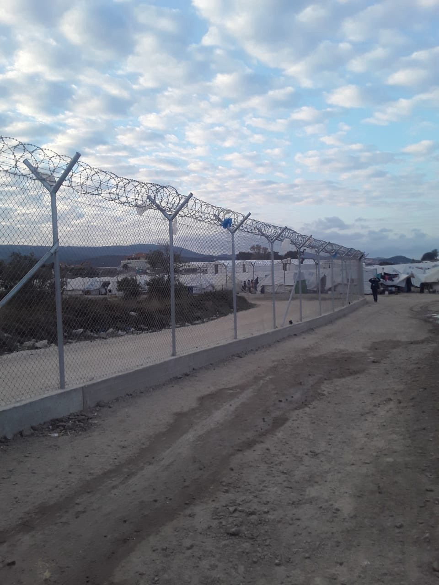

### AYS Daily Digest 03/12/2020 — New Reception Center on Lesvos by September 2021
### Bangladesh Moves Rohingya People to Low\-lying Island//Frontex Chief Caught in a Lie//&More

[Are You Syrious?](?source=post_page-----48c606171dee--------------------------------)

[Dec 4](ays-daily-digest-03-12-2020-new-reception-center-on-lesvos-by-september-2021-48c606171dee?source=post_page-----48c606171dee--------------------------------) · 7 min read

### FEATURE
### Greece and European Commission sign letter of intent on new Lesvos reception center

By September 2021, the European Commission and Greek government plan to build a [new reception center](https://ec.europa.eu/commission/presscorner/detail/en/ip_20_2287?fbclid=IwAR1Nj9xaniEiMDFxZ708pkNXwB2FgzkEDi5oKwY--Dak-1XN467AcyrM08U) on the island of Lesvos\. Previously, Greek Minister of Migration Notis Mitarakis had promised to build a closed center by Easter 2021\.

In a press release, the Commission described the new center as a place designed to “operate with swift, fair and effective procedures\.” It will have living areas made out of containers, playgrounds, common kitchens — and a [detention area](https://www.spiegel.de/politik/ausland/lesbos-eu-und-griechenland-wollen-neues-fluechtlingszentrum-errichten-a-6f84d460-f3ec-4194-9cc4-29972a70cd4d?fbclid=IwAR22BzCuYUtRWbYn5QVm0D8fuh_psLgxC1CbRMM4zMsFypRftLHwPqX9j3I) for people awaiting deportation\.

It’s somewhat unclear if these plans align completely with Notis Mitarakis’ plan to build a closed warehouse or if the EU’s proposed camp will be more open \(but still heavily fortified\) \. One thing is clear: despite Ursula von der Leyen’s claim that “Europe and Greece are working [hand in hand](https://twitter.com/vonderleyen/status/1334494450337390592?fbclid=IwAR2tqeICz4q1v_DYIft97JueD9VI0kF9cAE7qhvkN6PvcZJt_gqwtBT3bxI) for the people on the Greek islands,” neither people on the move nor Greek islanders are likely to be happy with this plan\. Lesvos locals have already protested against the construction of any new camp, and [expressed frustration](https://lowerclassmag.com/2020/12/03/drohnenueberwachung-kein-fliessendes-wasser-und-medizinische-unterversorgung-das-fluechtlingslager-moria-2/?fbclid=IwAR1oARxwVVIKqpavDlcgRd-C6IaNW6oaLqIfyTeSD8HTBBkggpx6adrL0BM) that there was no consultation with them during the decision\-making process\.

There are also questions about the planned security regime for the new camp\. Although the EU statement does not call it a closed camp, it will probably be a heavily fortified camp in an isolated area\. Conditions in Moria 2\.0 are already prison\-like, with drone surveillance, barbed wire, and metal detectors at the entrance\. Will this dehumanizing surveillance regime change?

Lastly but most importantly, September 2021 is a very long time to wait for a new housing situation\. Moria’s current residents are trapped in tents so flimsy the wind sometimes [blows them into the sea](https://rsaegean.org/en/moria-2-0-trapped-refugees-at-the-mercy-of-winter/) , exposed to the elements, and have very little access to water or electricity\. Will anything be done to improve their living conditions while they wait for the promised camp, which has already been delayed by several months before construction has even started?

If the EU and Greece cared about “operating with swift, fair and effective procedures” and protecting human rights, they would immediately close the camps and give people dignified housing\. Spending millions of euros on a camp that will not even be operational until next year is not the answer\.
### BANGLADESH
### Bangladeshi government transfers Rohingya to island in move opposed by rights groups

Almost a million Rohingya people are living in camps in Bangladesh, and many will soon be moved to the [island of Bhashan Char](https://www.frontiermyanmar.net/en/bangladesh-begins-transfer-of-rohingya-to-controversial-island/?fbclid=IwAR2k5q2DlLc7YDnDpqx7R0pwTrpgFzVSuccVAI_7ZWWO4rEbGXZe6O1e7ac) \. Bhashan Char is a low\-lying silt island vulnerable to cyclones in a country that has seen increasingly violent floods over the past few years\. While the government says that all the people transferred volunteered to go, others say they were pressured into leaving the camps\. The UN has not been allowed to independently assess the island\.
### GREECE
### Two dead after yesterday’s shipwreck off the coast of Lesvos

Greek authorities have [located the body](https://www.ekathimerini.com/259862/article/ekathimerini/news/body-of-second-missing-woman-from-capsized-dinghy-found-on-lesvos-coast?fbclid=IwAR0s2ERaH0HbygvyZN6SPnWf6PvQMF6EgBX01L1F0KPxsZr40L10lEHyQlQ) of a missing woman following yesterday’s shipwreck off the coast of Lesvos\. She is the [second confirmed death](https://stonisi.gr/post/13384/vrethhke-nekrh-kai-h-allh-agnooymenh-realtime?fbclid=IwAR37V-6AEY-hPs5gjgLUOOWOX-ptOjQU4GsvwIXWHN37f0U_HTGQoQoYnlI) from the shipwreck\. Both of the deceased were young Somali women barely in their twenties\.

On Chios, [seven or eight new arrivals](https://astraparis.gr/afixi-prosfygon-kai-metanaston-sta-gridia-neniton/?fbclid=IwAR3EANK8uPx4htfg2EA3MH4SOmuuOG2AGTg-_6m2Vx2QBS1mifCkSz17o8U) landed yesterday\.

Disinfaux Collective have published [part two](https://thepressproject.gr/lilipoupoli-chora-magiki-skiagrafontas-tin-akrodexia-sti-lesvo-meros-1o/?fbclid=IwAR2H4JZkAEixCPmqTB6-omcpyG2c2T3bNp29K4Z3eZZPx98ryCf1pw3xW70) of their research into the growth of the far right on Lesvos\. The article is in Greek but [contains a video](https://www.facebook.com/pikpalesvos/posts/2827349787540434) about the pogrom in Sapfous Square with English subtitles\.

European Lawyers in Lesvos needs your help\! They need financial support to continue their work helping people get asylum\. Learn more [here](https://www.facebook.com/EuropeanLawyersInLesvos/posts/2797173577270049) \.
### BALKANS
### Snow on the Balkan route

For the many people living in squats and tents in the area around Velika Kladuša, the first snow on Wednesday was not a welcome sight\. People are in danger of freezing to death because they [have no shelter](https://balkaninsight.com/2020/12/03/snow-worsens-plight-of-migrants-in-bosnia/?fbclid=IwAR3vwKF7ejRHAgNE-XrRil-7Fa3O9P7PGIBVKg8B86bKa0r1ixqENxorc7U) and cannot find a place in the overcrowded camps\. Snow also makes it harder to cross into Croatia because the Croatian police uses the footprints to track people and push them back into Bosnia & Herzegovina, often violently\.

The Croatian police is not showing any mercy despite the cold weather\. On Wednesday, they [blocked hundreds of people](https://www.youtube.com/watch?v=8tVEb6AuZOs&feature=youtu.be&fbclid=IwAR3vwKF7ejRHAgNE-XrRil-7Fa3O9P7PGIBVKg8B86bKa0r1ixqENxorc7U) from crossing into Croatia, even though they have the legal right to request asylum\. The people, including families with children, were forced to stand in the cold and snow\.

Meanwhile in Serbia, the police are starting to crack down further on people on the move by [conducting raids](https://www.slobodnaevropa.org/a/policija-migranti-u-srbiji/30982408.html?fbclid=IwAR06sTPRZZw89mG1tczxkLd-S7tG8ip5Bd8qceM3S7mrOXMwZ7K1gH41sKg) to force people into camps\. The Ministry of the Interior said that any person caught outside of the camps without permission will have to answer to the ministry; however, the overcrowded camps are often the ones kicking the people out\. These actions are done with the excuse of preventing the spread of COVID\-19, but really they are about exercising control over people on the move\.

Serbia has also seen an increase in xenophobic far\-right protests, including “national patrols” that cruise Belgrade and “tell” people on the move that they do not have the right to move around\.
### NETHERLANDS
### Dutch Parliament calls on government to relocate people from Greek camps
### SPAIN
### Horrific conditions in Canary Islands warehouse exposed

Starting in May, people on the move were housed in an industrial warehouse in Puerto de La Luz immediately after they arrived in the Canary Islands, an emergency measure requested by local police unions\. However, the conditions they were held in [violated their human rights\.](https://elpais.com/espana/2020-12-03/sin-calzado-jabon-ni-papel-higienico-asi-se-recibio-en-una-nave-a-los-migrantes-llegados-a-gran-canaria.html?fbclid=IwAR2CB-rkuF7FSNFTc-cJEzjyCqksbC4fFBx7n6phLG-E_-1shV0prH02yAQ) The Ombudsman’s visit on November 17th found that people were not given enough bathrooms, towels, toilet paper, soap, or even adequate clothing\. The Ombudsman said that people should have adequate bathrooms and nutrition, proper ventilation to protect them from the pandemic, and should not be detained longer than necessary\. The government delegation has been aware that conditions in the warehouse are bad and that people are often held for longer than the legal 72 hours since late May\.

“Throughout the day some 350 people were treated after they were rescued or arrived on the Canary Islands, the majority on Gran Canaria, but also one on El Hierro\. Last night 169 people were rescued\. December is continuing the pace on the route in these first few days\.”

Sahrawi people in Spain are finally [recognized as stateless people](https://www.publico.es/sociedad/refugiados-espana-cientos-saharauis-residir-espana-obtener-estatuto-apatrida-concede-gobierno.html?utm_source=facebook&utm_medium=social&utm_campaign=publico&fbclid=IwAR29Y18Whs_2O358nnJ2ysseo6FqM44TjimUzuwzohiZIKxfAoH5OYzSoPw) and can obtain Spanish residency after a long legal battle\. However, obtaining stateless status is still difficult, as a person can only apply while on Spanish territory and within the first month of their arrival\.
### FRANCE
### Beware of scams\!

Someone is running [a fake OFII Facebook page](https://www.infomigrants.net/en/post/28879/france-misleading-migrants-with-fake-facebook-pages?preview=1607009374241) where they ask for money in exchange for information and advice\. The real OFII contacted Facebook asking them to take the page down, but until Facebook complies, be aware of who you are contacting for information\.

A total of [120 people](https://www.infomigrants.net/en/post/28884/120-refugees-resettled-from-africa-to-france-by-iom?preview=1606990816259&fbclid=IwAR3xcKN_gtYkMQab_ypivMXXs5_zTrKdD_qtY1k8kZaB85VAlTEPrO967Xc) were resettled from Chad to France last week\. The people are mostly from Sudan or the Central African Republic; some have been waiting for resettlement for over a decade\.
### UK
### Deportation to Jamaica went ahead, overall deportations increasing

Yesterday morning, the planned deportation flight from the UK to Jamaica went ahead, although with [only 13 people](https://www.infomigrants.net/en/post/28890/uk-deportation-flight-to-jamaica-takes-off-13-on-board?fbclid=IwAR0ENN2DVzELTqSKufuSX6ZgLKECHQZnL3F5KK-bK9-ZN5x1m2Q2wL54pOY) as opposed to the planned 50\. Advocates pointed out that several of the people deported had not had proper legal help, showed signs of being victims of trafficking, or had relatives who were members of the [Windrush generation](https://www.bbc.com/news/uk-43782241) , all of which would entitle them to stay in the UK\. Thirty\-seven others were taken off the flight on appeal, showing how irregular the original deportation proceedings were\.

Many families were separated by this deportation, and many children will have to grow up without their fathers\. Sadly, they will not be alone\. Advocates from Care 4 Calais have said [deportations have never been worse](https://care4calais.org/news/detentions-and-deportations-worse-than-ever-before/?fbclid=IwAR22BzCuYUtRWbYn5QVm0D8fuh_psLgxC1CbRMM4zMsFypRftLHwPqX9j3I) as the UK is looking to deport as many people as possible before Brexit takes effect at the end of this year\.

The whole asylum system is plagued by systemic racism, [including the housing system](https://www.politics.co.uk/comment-analysis/2020/12/02/systemic-racism-in-the-asylum-housing-system?fbclid=IwAR2CB-rkuF7FSNFTc-cJEzjyCqksbC4fFBx7n6phLG-E_-1shV0prH02yAQ) \. People are forced to live in dilapidated houses that literally fall apart on top of them or are rounded up in barracks, in conditions where they are unable to protect themselves from the pandemic\.
### EU
### Frontex caught lying…again

Forty\-eight hours after Frontex chief Fabrice Leggeri testified before the EU Parliament, journalists found that [he lied](https://twitter.com/g_christides/status/1334468319295000579?fbclid=IwAR2k5q2DlLc7YDnDpqx7R0pwTrpgFzVSuccVAI_7ZWWO4rEbGXZe6O1e7ac) about the circumstances of a pushback in April\. Leggeri claimed that Frontex was unaware of the pushback because the surveillance aircraft G\-WKTH did not fly at all that night\. The newspaper SPIEGEL found evidence in an i [nternal Frontex report](https://www.spiegel.de/politik/ausland/frontex-skandal-fabrice-leggeri-hat-eu-parlament-die-unwahrheit-gesagt-a-046eafef-be16-4967-a758-65eba8146716?fbclid=IwAR0GFJ4BoquZ26a_Vz8BDxR6U3ZLTj75g73g3w9XnQbeAqsqahYpT74rkAk) that the plane did in fact fly that night over the border area\.

Leggeri has also come under fire for refusing to take responsibility for staffing delays at the Fundamental Rights Office, and for covering up other pushbacks\. Some MEPs are [demanding his resignation](https://www.faz.net/aktuell/politik/ausland/frontex-chef-leggeri-weist-pushback-vorwuerfe-zurueck-17082116.html?fbclid=IwAR1VaoFCuhmQoDbQ9mc5o1VEKGsO0GL7PvO8tP7XxHXPb5s0-K51MY6va3E) and questioning the ability of Frontex to regulate itself\.

The EU is looking to [create an agreement with Morocco](https://www.infomigrants.net/en/post/28897/eu-set-to-improve-cooperation-with-morocco-regarding-migration?preview=1607008744274&fbclid=IwAR3IsvnkUhhLOrYm6527uYbs6KWOWX9kB-BCvZWrpj8gOh0y881IiibMJ_s) that would allow it to deport people to Morocco more easily in exchange for an easier visa process and increased funding\.
### GENERAL
### Today is the International Day of Persons with Disabilities

Many people on the move have disabilities as well, and the intersection of those struggles is important to keep in mind\. Solidary Wheels [shared the testimony](https://twitter.com/SolidaryW/status/1334515596168482820?s=20&fbclid=IwAR1G5FGlIwjQ5UEhitJd2V-SRbuuF6-pb5-otT2lrnb5MZfWYvkRb_ko6J4) of Saad, who is deaf, and his frustrations with navigating the asylum system\.

Euro\-Med Monitor and York University have published [a study](https://euromedmonitor.org/en/article/4044/Euro-Med-Monitor-and-York-University-study-recommends-providing-inclusive-environment-for-refugees-with-disabilities-in-Turkey?fbclid=IwAR1q4blSJ8yrd8yR8swn8qFQ_vL0WRjX21JnSR7Wtbz8Lxd-rY7MAEz656o) on the conditions for people on the move with disabilities in Turkey\. ReliefWeb examined how people with disabilities are [often left behind](https://reliefweb.int/report/world/during-disaster-displacement-people-disabilities-are-too-often-forgotten?fbclid=IwAR3xcKN_gtYkMQab_ypivMXXs5_zTrKdD_qtY1k8kZaB85VAlTEPrO967Xc) or don’t have their needs met when there is a disaster that causes displacement\.

People on the move are more likely to have a disability than the general population, yet many services are not inclusive of their needs\. The international community must do better going forward\.

Many people on the move also have mental health conditions due to the traumatic conditions they have experienced, but receive very little assistance\. WHO has developed a program, [Self\-Help Plus](https://www.infomigrants.net/en/post/28886/migrants-tailor-made-program-against-psychological-distress?preview=1606991878020&fbclid=IwAR3ChMDCsOyzmMeuiNyqEUSt59dLn5an-VYyVof6MywZAYETwl9gFpQCLAI) , that can help people cope with mental health struggles without professionals\.

**If you wish to contribute, either by writing a report or a story, or by joining the info gathering team, please let us know\.**

**We strive to echo correct news from the ground through collaboration and fairness\. Every effort has been made to credit organisations and individuals with regard to the supply of information, video, and photo material \(in cases where the source wanted to be accredited\) \. Please notify us regarding corrections\.**

**If there’s anything you want to share or comment, contact us through Facebook, Twitter or write to: areyousyrious@gmail\.com**

_Converted [Medium Post](https://medium.com/are-you-syrious/ays-daily-digest-03-12-2020-new-reception-center-on-lesvos-by-september-2021-e658bba68854) by [ZMediumToMarkdown](https://github.com/ZhgChgLi/ZMediumToMarkdown)._
