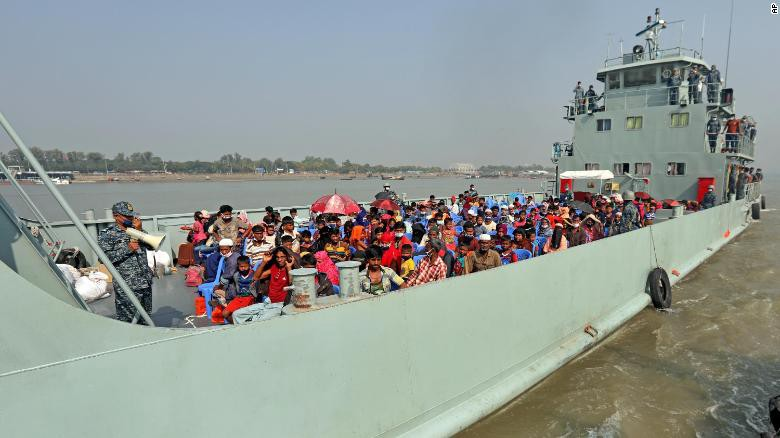
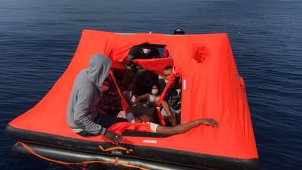

### AYS Daily Digest 04/12/2020 — Twice displaced? Forced relocation of Rohingya refugees in Bangladesh
#### MEPs calling on Frontex head to resign// Mental health crisis in UK detention centres as NGOs forced to sign a non\-disclosure agreement // Harsh conditions in Spain, Greece and Bosnia

Hundreds of Rohingya refugees relocated to the island of Bhasan Char — credits:CNN
### BANGLADESH
#### Forced relocation of Rohingya refugees on remote island sparks concerns

Around 1,600 Rohingya refugees have been relocated to a new island facility about 40 km off the coast of the country, in a move that has raised serious concern amongst human rights activists and experts\. Despite the claim of official authorities that refugees are moving to the island voluntarily, [Human Rights Watch had collected evidence](https://www.washingtonpost.com/world/2020/12/04/rohingya-bangladesh-refugees-island-bhasan-char/) that many might have been forced to move there\. This creates a serious precedent, as the new facilities on Bhasan Char could potentially host 100,000 of the over 1 million Rohingya refugees currently in Bangladesh\. Some on the island have reported conducting hunger strikes to protest being kept there against their will and allege beatings by authorities, [according to rights groups\.](https://edition.cnn.com/2020/12/03/asia/rohingya-relocations-bhasan-char-intl-hnk/index.html) Not only is the island remote, but it is also e [xposed to inundations](https://elpais.com/internacional/2020-12-04/banglades-traslada-a-mas-de-1600-rohingyas-a-una-isla-remota-expuesta-a-inundaciones.html?utm_source=Facebook&ssm=FB_CM&fbclid=IwAR1XF4ctNVzKEWglfOxD0_Kgax5924E1wrPJJO6Aj1SlNEntKRhIh9aWPVE#Echobox=1607077165) and thus potentially dangerous for those hosted there\.

Many of them have fled Myanmar to escape ethnic\-based violence and persecution against their group, which started in 2017 with the national government of Rangoon maintaining that the military was carrying out a “clearance operation” as a result of counter\-terrorism measures\. The International Court of Justice in The Hague ordered Myanmar to protect the Rohingya population from acts of genocide, accusations that the government of Aung San Suu Kyi still denies\.

Daniel Sullivan, [Refugees International’s senior human rights advocate](https://edition.cnn.com/2020/12/03/asia/rohingya-relocations-bhasan-char-intl-hnk/index.html) , has deemed the relocation

> short\-sighted and inhumane\. \[…\] Without appropriate assessments and adequate information for refugees about conditions on the island, the move is nothing short of a dangerous mass detention of the Rohingya people in violation of international human rights obligations 

Representatives of the United Nations have not been given access to the island to carry out safety and technical assessments, and have been given only limited and patchy information on the relocations\. The UN said in a [statement](https://bangladesh.un.org/en/103285-press-statement) that it was not involved in preparations and has been given “limited information” on the relocations\.
### FRONTEX AND SEA
#### MEPs calling on head of Frontex to resign

MEPs from the European Parliament Committee on Civil Liberties, Justice and Home Affairs \(LIBE\) are calling on the head of Frontex, Fabrice Leggeri, to resign\.

> [Documentation](https://www.spiegel.de/international/europe/eu-border-agency-frontex-complicit-in-greek-refugee-pushback-campaign-a-4b6cba29-35a3-4d8c-a49f-a12daad450d7) of direct and indirect Frontex involvement in pushbacks from Greece [caused the European Commission](https://www.ecre.org/greece-frontex-denies-involvement-in-pushbacks-expert-council-critique-of-ngo-registration-rules/) to call for an urgent extraordinary meeting of the agency’s board on 10 November\. The meeting resulted in increased scrutiny of the agency as member states and European Commission [agreed to establish a special committee](https://www.ekathimerini.com/259671/article/ekathimerini/news/pushback-claims-to-come-under-further-scrutiny) to [investigate incidents](https://www.kathimerini.gr/society/561176605/to-diplomatiko-poker-gia-tis-epanaproothiseis/) and interpret [Article 6 of European Regulation 656](https://eur-lex.europa.eu/legal-content/en/ALL/?uri=celex:32014R0656) on “Interception in the territorial sea”, with a report expected in January\. Following a meeting on 1 December where MEPs of the LIBE Committee received [a briefing and questioned head](https://multimedia.europarl.europa.eu/en/recent-allegations-on-pushbacks-during-frontex-operations_I199510-V_v) of Frontex, Fabrice Leggeri, on the allegations, members are [calling for his resignation](https://www.neweurope.eu/article/meps-call-for-frontex-chief-to-resign-over-migrant-pushbacks/) : “In his handling of these allegations, Executive Director Fabrice Leggeri has completely lost our trust and it is time for him to resign…”, said Kati Piri, Vice\-President for the Progressive Alliance of Socialists & Democrats \(S&D\) \. 

Find out more [here,](https://www.ecre.org/frontex-critique-and-scrutiny-continues/?fbclid=IwAR3XtOFgeCNN-eQDYOJZI5b6RcVwKZJK_LGP1m_Dl_j7_Bib91J35mNmZTQ) and sign the petition for the resignation [here\.](https://act.wemove.eu/campaigns/leggeri-resign-now?fbclid=IwAR1XkpT_PMRuZRfZxEJSqKVZsPRYLHjUH5PGf_SlUaoXv7WCowopGnbZ5b0)

Left\-wing MEPs have hosted a webinar to launch a set of proposals that will put dignity and human rights at the heart of EU’s migration policy — unlike the Commission’s new [deportation\-obsessed ‘Migration Pact’](https://www.guengl.eu/migration-pact-puts-deportation-front-and-centre-in-authoritarian-drift/) \.

> Our counterproposals “The Migration and Asylum Pact: Challenging the European Commission’s narrative from a Left perspective” will set out in forthright terms that the EU is shirking its international obligations to uphold human rights, and disregarding international law on migration\. 

Check out the whole recording [here](https://www.guengl.eu/events/the-migration-and-asylum-pact-challenging-the-european-commissions-narrative/?fbclid=IwAR1ArwIKhm129cuf3pxKz2MhfMJVrT3pdDg4thGHe6QL4XsdztFmQE1fKsM) , with participation from AYS’ very own Milena Zajovic\!
#### MOAS returns with search and rescue

MOAS, the very first Search And Rescue NGO to operate in the Mediterranean starting in 2014, has [announced its return to the Central Mediterranean](https://www.moas.eu/moas-returns-to-sea-to-save-lives-in-partnership-with-the-ngo-sea-eye/?fbclid=IwAR2fxF3vfILwGRR2JkNB9icK8JNFfAIUKaRJYsL6NfKzI2Ciyg08UevdY5s) , alongside its new partner Sea\-Eye, to conduct Search and Rescue \(SAR\) operations that will save lives at sea and raise awareness of the ongoing tragedy unfolding on Europe’s doorstep\. MOAS will be operating on board the new rescue ship Sea\-Eye 4, and will be providing personnel, resources, strategic input and expertise\.

](assets/898a4addd217/1*kFJhP9RHmI1wRgfZ0exeRA.jpeg)

Napier Barracks — courtesy of [HelpRefugees](https://helprefugees.org/news/a-message-from-a-refugee-stuck-in-the-napier-barracks/)
### UK
#### NGOs providing support to migrants in the UK detention centre of Napier \(Kent\) have been asked to sign a non\-disclosure agreement

Around 400 asylum seekers crammed in the Napier military barracks in Kent \(UK\) are facing a mental health crisis, after NGOs operating in the facility halted their work in response to a [“draconian” non\-disclosure agreement forced on them by the UK Home Office](https://www.vice.com/en/article/93w3be/napier-barracks-asylum-seekers-face-mental-health-crisis-as-ngos-refuse-to-sign-gagging-clause?fbclid=IwAR2b6H-S9gD6PB04b0bvhSLxAVpolwv3OP9xfyERHuKWvCbeoUDMOIfF70I) \.

Volunteers were told they must sign non\-disclosure agreements bound by the Official Secrets Act if they wanted to continue working inside\. Breach of the contract, subject to legislation designed to protect national security, could see volunteers that share information about asylum seekers or the facility imprisoned\. Important organisations like Care4Calais, Samphire, and Refugee Action have thus had to resort to stopping their work in the facilities, in protest against this measure\.

According to Stephen Hale, chief executive of Refugee Action, the organisation has

> serious concerns about the mental and physical health of often\-traumatised people forced to live behind barbed wire and high fences so close to each other in the middle of a pandemic\. Home Office ministers are failing in their duty of care to people in the asylum system\. 

The withdrawal of these organisation has meant that people in the detention centre have now lost even their last remaining contacts with the outside world, and do not have psychological support\. The conditions in the facility are so dire that they may very well be re\-traumatising for many of those people stuck there\.

According to Clare Moseley, founder of Care4Calais

> These guys have crossed the Sahara, they have survived Libya, they’ve crossed the Mediterranean, they slept rough in Calais for months being bullied by police, and now, after all that they’ve endured, they’re in the UK and it’s here they try to commit suicide\. They’re under immense amounts of stress, especially as the government is trying really hard to deport people in any way possible at the moment\. 

### FRANCE
#### New advocacy report of Project\-Play on eviction operations in Northern France

[Project\-Play has released](https://www.facebook.com/projectplayfrance/posts/775572163057481) its

> second advocacy report focusing on the harmful effects that the cycle of eviction operations in Northern France has on the children we work with\. So far there have been 822 evictions in Calais and 71 in Grande\-Synthe this year\. Evictions result in real obstructions with regards to accessing food, sanitation, shelter and the bare minimum standards of child protection; all of which constitutes a blatant disregard for children’s rights in any context and is exacerbated by the current global health pandemic\. 

> Further, these operations violate numerous Articles of the Convention on the Rights of the Child, the European Convention on Human Rights and the French code of social action and families, which govern the protection of children\. 

> We demand an immediate end of the eviction operations in Northern France, the implementation of sustainable accommodation solutions and a dignified welcome, and the creation of safe and legal routes to the UK\. 

Find the full report [here](https://www.project-play.org/advocacy-reports?fbclid=IwAR3WFC8bczmVSpyEd0UUmVUGWwL3zXP3JeC6sN2jNB8_oxP6T4ixwoTN7Pc) \.

The Solidarity Collective Wilson has [further denounced](http://The collective Solidarité migrants Wilson nevertheless denounces a strategy of invisibilization of exiled people.) the strategy of invisibilisation of refugee people, as a result of eviction of camps and removal of asylum seekers from the public eye\.
### SPAIN
#### A total of 190 migrants reach the Canary Islands on Friday

The [Canary Islands have registered](https://www.canarias7.es/canarias/seis-pateras-llegan-20201204092132-nt.html?fbclid=IwAR0sn1oYzAGsp-2yZvgDfBks-KOe5tcPAcDuMlg8nMznJno5H3hNnxC5nFU) the arrival of 190 migrants during the night and early morning of this Friday\. Almost all of them arrived in Gran Canaria, which has received 187, as reported by 112\.

Lanzarote was the destination of the three remaining irregular migrants, who landed by their own means in the dark on the coast of Teguise\. Details on their Twitter account 112, the Regional Emergency and Security Coordinating Center\.

This week [we have to mourn two more people again](https://twitter.com/SolidaryW/status/1334868498951114764) \. Last Tuesday two bodies were found on the beach of Melilla, as reported by the Government Delegation\. They are two young Moroccans who, surely in their desire, and right, to reach European soil, found no other option than to do so by swimming\.

The ombudsman Francisco Fernández Marugán points out the Arguineguín dock in Gran Canaria as the “most obvious mistake” of this crisis\.

> It is urgent that the administrations sit down and identify in the places of arrival, a catalog of nearby infrastructures that can be used immediately according to the needs\. And a system for identifying especially vulnerable people must be well prepared\. The administrations have to have a degree of collaboration that right now they do not have\. We have to anticipate events, improvisation is a very bad advisor\. 

Read the full interview [here\.](https://elpais.com/espana/2020-12-03/el-defensor-del-pueblo-confinar-inmigrantes-en-canarias-no-es-la-solucion.html?fbclid=IwAR3XtOFgeCNN-eQDYOJZI5b6RcVwKZJK_LGP1m_Dl_j7_Bib91J35mNmZTQ)

A damming report of the Ombudsman on the conditions of asylum seekers and refugees in shelter facilities on the Canary Islands has been [published](https://elpais.com/espana/2020-12-03/sin-calzado-jabon-ni-papel-higienico-asi-se-recibio-en-una-nave-a-los-migrantes-llegados-a-gran-canaria.html?utm_source=Facebook&ssm=FB_CM&fbclid=IwAR3jGsdgtFFdun65oxT64lLw9KNPkJRFGEGVZRH3mTjuK1UdYjGfPiQFfhM#Echobox=1607009609) recently\. Basic hygiene facilities, food provision, and sleeping arrangements are lacking, making the conditions of people on the move particularly harsh\. The report

> calls for an “urgent” plan of action against COVID and other “necessary logistical, hygienic and sanitary measures” to prevent the spread of the virus in spaces of custody of detainees\. In this sense, the need for sufficient separation between people and the provision of hydroalcoholic gel is specified\. 

### GREECE

Greek Migration Minister Notis Mitarakis [sent a letter](https://www.ekathimerini.com/259911/article/ekathimerini/news/greek-migration-minister-sends-letter-to-eu-unhcr-on-deadly-wreck?fbclid=IwAR1ArwIKhm129cuf3pxKz2MhfMJVrT3pdDg4thGHe6QL4XsdztFmQE1fKsM) on Friday to European Home Affairs Commissioner Ylva Johansson and UNHCR Representative in Greece Philippe Leclerc about a migrant boat wreck that claimed the lives of two women on Thursday\.

> [We are concerned](https://twitter.com/lk2015r/status/1334862811919474689) that the crossings are encouraged by smuggling networks and sometimes by NGOs active in the region\. 

These are attempts to change the narrative following the latest disclosures of pushbacks and HR violations\. In light of the mountains of evidence of Greek pushbacks, including the complicity of Frontex, the Greek government seems to be shifting the blame once again\. Mitarakis [added](https://twitter.com/se_tareh/status/1334858332591501313) that the two women could have been saved if the Turkish coast guard had responded to the initial call
#### Life rafts in the Aegean Sea

Life rafts — courtesy of Aegean Boat Report

Aegean Boat Report [notifies](https://www.facebook.com/AegeanBoatReport/posts/984204052102699) of a strange phenomenon of more and more life rafts in the Aegean Sea:

> Life rafts is something that we \(luckily\) don’t see very often, they are usually only used in emergencies at sea, where you have to leave a vessel due to a life threatening incident, unless you have been in the Aegean Sea this year, then you strangely enough would have seen them quite often\. You might think that there have been many major shipping accidents in the Aegean, but there haven’t, actually none of these life rafts have been due to vessels in distress\. 

> The orange tent\-like life rafts that have been floating around in the Aegean Sea are marked with the name Lalizas, from a Greek manufacturer in Piraeus, which happens to be a brand that the Greek Ministry of Maritime Affairs purchases, but for some reason the Greek government claims to have no knowledge on how over 150 of these life rafts have ended up floating in the Aegean Sea this year, filled with refugees\. 

#### Harsh conditions for people on Chios and Lesvos

How do you think it would affect your mental health, your physical self, your soul and your heart if you had to live in these conditions during a storm, in the middle of winter and during lock down? [This is the reality](https://www.facebook.com/ruhi.akhtar.7/posts/4099391110077766) for thousands of people living in Vial Refugee Camp, Chios Island in Greece\.

Three months after fires destroyed Moria camp on Lesvos, three months after EU Commissioner Ylva Johansson promised “No More Morias”, a total of 17,500 people are still f [orced to spend the winter in overcrowded](https://www.facebook.com/europemustact/posts/201271858152183) , unsafe and undignified camps on the Greek islands\.

Since the second lockdown in Greece began on 7 November, [Equal Rights has received dozens of referrals](https://www.facebook.com/story.php?story_fbid=3548766181905814&id=1040305472751910) for people who were fined for violating the lockdown measures\. In most cases, the fines were baseless and amounted to more than three times the person’s monthly income\.

Refugee Support Aegean has this interesting timeline on the forced eviction of Pikpa, in contempt of Strasbourg proceedings\. Check “The timeline of a flagrant violation of legality” [here](https://rsaegean.org/en/forcible-evacuation-of-pikpa-in-contempt-of-strasbourg-proceedings-the-timeline/?fbclid=IwAR3ozDELGWj-VSqJ5Uwk8wO6iiOUARa0JacnjAu5Xga6yv0RvHxIaMKAWq4) \.
### WESTERN BALKANS
#### Over 2,000 migrants face a harsh winter with no shelter

Amnesty International researcher [Jelena Sesar provides an excellent critical assessment](https://kosovotwopointzero.com/en/hopelessness-and-a-sense-of-imminent-crisis/?fbclid=IwAR1XF4ctNVzKEWglfOxD0_Kgax5924E1wrPJJO6Aj1SlNEntKRhIh9aWPVE) and summary of the current situation of unsheltered migrants in Bosnia and Herzegovina, and across the Balkan route more generally\. Over 2,000 people are currently not being hosted in temporary accommodation, and have built makeshift camps in forests, while attempting to cross into Croatia\.

> There has been no concerted effort from the Bosnian authorities to manage the crisis, provide adequate accommodation for the migrants and asylum\-seekers and address their basic needs\. What we have witnessed instead is a situation of almost systemic neglect\. 

Violent pushbacks from the Croatian border authorities have caused unjustifiable and unimaginable suffering among people on the move\. Just yesterday, we [received news](https://www.facebook.com/brigitte.holzinger.7/posts/3689021354489642) of another person unfortunately dying as a result of the harsh conditions along this perilous route\.
### NORDIC COUNTRIES

**Finland** ’s Ministry of the Interior is currently drawing up an [action plan for preventing illegal entry and residence](https://www.foreigner.fi/articulo/moving-to-finland/action-plan-for-preventing-illegal-entry-and-residence-to-be-updated/20200911181612007880.html) for 2021–2024\. The plan aims to promote and enforce measures to prevent people from staying in Finland without a residency permit\. In a [ministerial meeting](https://www.foreigner.fi/articulo/moving-to-finland/minister-of-the-interior-ohisalo-to-nordic-migration-ministers-meeting/20201203180751009375.html?fbclid=IwAR1XkpT_PMRuZRfZxEJSqKVZsPRYLHjUH5PGf_SlUaoXv7WCowopGnbZ5b0) of the Nordic cooperation group on migration and asylum \(NSHF\),

> “Ministers will discuss measures taken by the Nordic countries to prevent the emergence of undocumented migration and a shadow society” 

In **Denmark** , [according to refugee rights activist Lene Kjær](https://www.facebook.com/lenekjj/posts/3453257981456132) , a large number of Iraqi citizens who have had their application for asylum in Denmark rejected, have been arrested be the police during the day, and will most likely be transferred to Exit Centre Ellebæk with the purpose of deportation\.

The police action has initiated a wave of anxiety among other refugees and asylum seekers in Denmark, and in the post below, Lene Kjær describes the consequences most likely faced by asylum seekers of different nationalities, the core distinction being whether or not there is a bilateral agreement of returns between Denmark and the foreign government in question\.

The clear advice is that asylum seekers at risk of arrest or return should immediately contact a lawyer in the area of immigration law to ensure that legal procedures are followed and respected\.
### GENERAL
#### ECRE and ELENA weekly bulletins out

CRC adopts views on Spanish age assessment with X\-rays

UK — Tribunal confirms non\-binary identity can form basis of asylum claim

The Netherlands — COVID: Deportation of Iranian national stopped because of health issues

EU — EDPS: Opinion on the Pact

Read more on [ELENA weekly legal update](https://mailchi.mp/ecre/elena-weekly-legal-update-04-december-2020?fbclid=IwAR12162P7xFe-csmk6ZEbO7H9vespPaKu1PvrEfkgcYUQGrHjxCoxGExHXU) , and [ECRE weekly bulletin](https://mailchi.mp/ecre/ecre-weekly-bulletin-04122020?fbclid=IwAR2eo_7tumFBXl-lZGey6tj8dNrOGwIwaCwNJUlNvzI7pi0JuDf_IPzNJBs) \.

**If you wish to contribute, either by writing a report or a story, or by joining the info gathering team, please let us know\.**

**We strive to echo correct news from the ground through collaboration and fairness\. Every effort has been made to credit organisations and individuals with regard to the supply of information, video, and photo material \(in cases where the source wanted to be accredited\) \. Please notify us regarding corrections\.**

**If there’s anything you want to share or comment, contact us through Facebook, Twitter or write to: areyousyrious@gmail\.com**

_Converted [Medium Post](https://medium.com/are-you-syrious/ays-daily-digest-04-12-2020-twice-displaced-forced-relocation-of-rohingya-refugees-in-bangladesh-898a4addd217) by [ZMediumToMarkdown](https://github.com/ZhgChgLi/ZMediumToMarkdown)._
