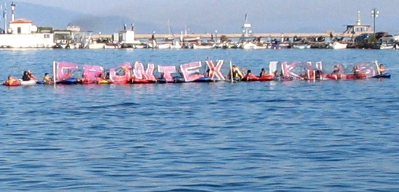
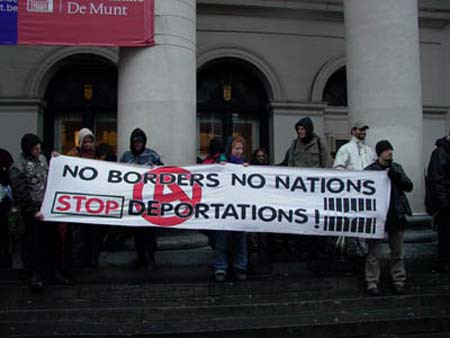

### AYS Special: Frontex and human rights — How did we arrive here? PART 1 \(2004–2016\)

_Working on an article about Frontex is not an easy task\. Information and allegations about the agency are piling up on a daily basis\. The purpose of this article is to give an overview of Frontex’s increasing role in EU border management — with no accountability or respect of fundamental rights in its operation\._

_This is the first part of the Frontex timeline, from the establishment of the agency to the end of 2016, and starts with the most recent entry\. Watch this space for PART 2\!_
### 2016

**Personnel:** 355 — **Budget:** €251m

July 2016, Protest in front of the European Parliament \(Photo by S\. Lösing\)

**General:** In 2016 ECCHR \(European Center for Constitutional and Human Rights, ECCHR\) filed an application to Frontex to request information regarding Joint Operation HERA 2012–2015\. The response of the agency was to provide mostly censored documents\. Particularly, as [reported](https://www.statewatch.org/media/documents/analyses/no-307-frontex-operation-hera.pdf) by Wriedt and Reinhardt of ECCHR:

> Frontex’s approach to transparency and accountability is evinced again in section 12\.10 of the Handbook to the Operational Plan entitled “List of potential fundamental rights violations within Frontex activities”\. The whole section \(including the headline\) is completely redacted and could only be uncovered because the index lists the section\. The argument that the publication of this section would affect public security seems particularly inappropriate in the context of human rights violations\. 

**December 13:** Frontex is conducting [training](https://frontex.europa.eu/media-centre/news-release/frontex-helps-train-libyan-coast-guard-zxRCnE) for 62 Libyan Coast Guard and Navy officers aboard _San Giorgio_ , vessel participating in EUNAVFOR MED\.

**December 7:** Starting today, the Rapid Intervention Pools are [operational](https://frontex.europa.eu/media-centre/news-release/european-border-and-coast-guard-agency-launches-rapid-intervention-pool-P93Lhp) \. Frontex/EBCG will be able to deploy as many as 1,500 border guards at short notice to assist member states at their EU’s external borders\.

**\[ \+ \] October 14:** The Fundamental Rights Office \(FRO\) of Frontex write their [observations on the situation at the Hungarian external border](https://www.helsinki.hu/wp-content/uploads/10.-FRO-observations-HU-SR-border-October-2016-Redacted.pdf) \(published later on by the Hungarian Helsinki Committee, in a redacted version\) \. It is stated that, due to the legalisation of pushbacks by the Hungarian authorities he following fundamental rights at risk at the Hungarian\-Serbian border:

> the prohibition of collective expulsions; 
 

> the right to asylum; 
 

> the right to an effective remedy; 
 

> the prohibition of cruel, inhuman or degrading treatment; 
 

> the right to life; 
 

> the prohibition of refoulement
 

> the right to integrity of the person\. 

The FRO concludes suggesting the revision of the Agency’s support “in operational areas where there are several and repeated allegations of disrespect to the obligations and values enshrined in the EU Treaty and legislation\.”

**October 6:** At the Kapitan Adreevo checkpoint at the Bulgarian/Turkish border, Frontex officially [becomes](https://frontex.europa.eu/media-centre/news-release/european-border-and-coast-guard-agency-launches-today-CHIYAp) the European Border and Coast Guard\.

**September 14:** Major extension of mandate of Frontex\. The 2004 Regulation is repealed and substituted by the [2016/1624](https://eur-lex.europa.eu/legal-content/EN/TXT/?uri=CELEX%3A32016R1624) \. Frontex is now renamed the European Border and Coast Guard Agency, which is responsible of the Integrated Border Management of the Union\. The agency “keeps and enhances its operative — i\.e\., coordinating operations — and regulatory roles — i\.e\., supporting the Commission in the application of legislation relating to the borders\.” The new regulation introduces a new monitoring role for Frontex, providing the Agency with the ability to monitor EU member states’ management of external borders and with the right to intervene, in case a member state fails to comply with Frontex recommendations\. Coordination between Frontex, Europol, Eurosur, and national authorities are strengthened\. The new regulation integrates the Sea Border 2014 regulation, giving Frontex the right to patrol external sea borders\. It also integrates the 2006 Schengen Borders Code Regulation \(then revised in November 2016\) \. Frontex is now allowed to expand its activities to “pre\-frontier areas” \(third countries\) \. Frontex is able to require EU member states to collectively provide up to 1,500 border guards for its Joint Operations\. Frontex Consultative Forum was asked to [provide inputs](https://frontex.europa.eu/assets/Partners/Consultative_Forum_files/Frontex_Consultative_Forum_annual_report_2015.pdf) \(p\.41\) regarding to the safeguarding of fundamental rights, but such [inputs were ignored](https://frontex.europa.eu/assets/Partners/Consultative_Forum_files/Frontex_Consultative_Forum_annual_report_2016.pdf) \(p\.19\) by Frontex Management Board when it submitted recommendations related to the amendment of the 2004 Frontex Regulation\.

](assets/17cffb340c07/1*apAV7z2eeOuGvsTW4Wxo8Q.png)

Breakdown of EBCG tasks, by [Frontex](https://frontex.europa.eu/assets/Images_News/2016/European_Border_and_Coast_Guard_Agency_Main_Tasks.pdf)

**April 26:** [Third Annual Report \(2015\)](https://frontex.europa.eu/assets/Partners/Consultative_Forum_files/Frontex_Consultative_Forum_annual_report_2015.pdf) of Frontex Consultative Forum on Fundamental Rights published\.

> \- As repeatedly recommended during the year, urgent recruitment of additional technical staff to support the Fundamental Rights Officer remains key to the Agency’s ability to deliver on its fundamental rights obligations, including the rolling out of an individual complaints mechanism as foreseen in the European Border and Coast Guard Regulation\. 

> \- \[…\] Fundamental rights are a crucial element to take into consideration when cooperating with Turkey\. The Consultative Forum recommended Frontex reached out to NGOs, international organisations as well as civil society in Turkey to feed into risk analysis and planning activities by Frontex in Turkey\. 

> \- The Consultative Forum also recommended Frontex to assess its role in preventing migration from Turkish coasts and its consequences for fundamental rights\. 

> \- Following an **agreement between the EU and Afghanistan** on 2 October 2016, members of the Consultative Forum raised concerns to the Deputy Executive Director about Frontex’s involvement in the implementation of this agreement _\[which entails\]_ carrying out return flights to Afghanistan\. 

**April 4:** Frontex [assisted](https://frontex.europa.eu/media-centre/news-release/frontex-assists-greece-in-transporting-202-migrants-to-turkey-ysX0nX) Greece in transporting 202 people on three ferries from the islands of Lesvos and Chios to Turkey\. The operation included 180 escort officers deployed by Frontex, as well as Greek officers\. This is the first return operation within the framework of the EU\-Turkey deal\.

**March 18:** A [Statement of Cooperation](https://www.consilium.europa.eu/en/press/press-releases/2016/03/18/eu-turkey-statement/) between the EU and Turkey, commonly known as **EU\-Turkey deal** , is signed\.

**March 9:** The new [Schengen Borders Code regulation](https://eur-lex.europa.eu/legal-content/en/TXT/?uri=CELEX%3A32016R0399) is adopted by the EU, replacing the 2006 one\. Crystallising the situation within Europe, with many Schengen countries already reinstating border checks, [changes focus](https://eur-lex.europa.eu/legal-content/EN/TXT/?uri=LEGISSUM%3A230101_1) on the reintroduction of temporary border controls, now allowed for up to 2 years:

> Internal border controls may be **exceptionally** restored inside the Schengen area for a limited period of time where: 

> \- there is a serious threat to public policy or internal security: border controls may be reintroduced by the affected Schengen countries **for a maximum duration of 6 months** in case of foreseeable events \(e\.g\. important sport events, conferences, etc\. \) and for a maximum of 2 months in case of events requiring immediate action; 

> \- the Schengen evaluation mechanism reveals that there are serious and persistent flaws in external border controls putting the overall functioning of the Schengen area at risk\. In such cases, the Council may recommend that one or more EU countries reintroduce border controls at all or at specific parts of their internal borders **for a maximum of 2 years** \. 

**March 6:** Frontex and NATO [reached](https://frontex.europa.eu/media-centre/news-release/frontex-and-nato-to-cooperate-in-the-aegean-sea-nZMSYr) a “common understanding on the form of their cooperation in the Aegean Sea\.” Frontex will continue its Operation Poseidon Rapid Intervention and the two organisations will exchange information in real time\.

**February 2:** Frontex [launches](https://frontex.europa.eu/assets/Key_Documents/Annual_report/2016/Annual_Activity_Report_2016.pdf) Operation PeDRA \(Processing Personal Data for Risk Analysis\) in Italy\. Through PeDRA, the Agency starts collecting personal data of persons suspected of people smuggling, terrorism and other cross\-border crimes\. During the year the operation will be expanded to Spain and [Greece](https://frontex.europa.eu/media-centre/news-release/frontex-to-begin-collecting-personal-data-in-greece-on-suspected-criminals-gJzx8D)

[**Major Joint Operations:**](https://frontex.europa.eu/assets/Key_Documents/Annual_report/2016/Annual_Activity_Report_2016.pdf) FOCAL POINTS \(Operation active since 2013, but massively strengthened this year — South\-eastern Europe and West Balkans land, sea and air borders\) \. Continuation of Operations: POSEIDON RAPID INTERVENTION, POSEIDON, ALEXIS, TRITON, HERA, INDALO, MINERVA and FLEXIBLE OPERATIONAL \(Converted in ‘green border’ security operation\) \.

**Returns:** In 2016 Frontex coordinated [232 Return Operation, returning in total 10,698 people](https://frontex.europa.eu/assets/Key_Documents/Annual_report/2016/Annual_Activity_Report_2016.pdf) \. The budget committed for returns was EUR 30,5m\. Prior to the new mandate, Frontex had already started to support Member States in the implementation of national return operations, the role was reinforced with the new Regulation\. In 2016 Frontex provided dedicated assistance to specific Member States such as Greece: return operations organised by other member states were organised with specific stop\-over in Athens, 35 ‘readmission’ operations \( [908 people](https://frontex.europa.eu/media-centre/news-release/frontex-creates-a-new-pool-of-return-experts-yWWYG1) \) from Greece were organised within the EU\-Turkey deal\. The ‘Collecting Joint Return Operations’ coordinated by Frontex increased to 15, more than the total of the three previous years\.
### 2015

**Personnel:** 309 — **Budget:** €143\.3m

 \)](assets/17cffb340c07/1*RjiqreqhB-bIi_A8aPktxQ.jpeg)

December 13, 2015 \(Artwork by [Vagelis Papvasiliou](https://twitter.com/vagpapavasiliou/status/676082800286679041) \)

**December 28:** Frontex [initiates](https://frontex.europa.eu/media-centre/news-release/frontex-and-greece-agree-on-operational-plan-for-poseidon-rapid-intervention-yiSxga) the deployment of 293 officers and 15 vessels to the Eastern Aegean Greek islands as part of a new operation called Poseidon Rapid Intervention after Greece requested additional assistance at its external borders in the Aegean\. The deployment will gradually rise to some 376 officers and interpreters on the ground\. This numbers are on top of the 195 officers already deployed on the Eastern Aegean islands, of which 83 are deployed in the Moria RIC on Lesvos\.

**December 17:** The EU Commission [agrees](https://frontex.europa.eu/media-centre/news-release/frontex-to-implement-border-surveillance-services-as-part-of-copernicus-Z1r4A0) to provide funding to the agency to implement satellite services dedicated to border surveillance as part of the Copernicus programme, in order to support the following services: coastal monitoring, monitoring of international waters, reference mapping, maritime surveillance of an area, vessel detection, vessel tracking and reporting, anomaly detection and environmental assessment\.

**December 3:** Frontex and Greece [agree](https://frontex.europa.eu/media-centre/news-release/frontex-to-assist-greece-with-registration-of-migrants-at-its-land-border-9Qg48q) to an expansion of Frontex activities in the country\. The agency will deploy agents on the border with FYROM \(Now North Macedonia\) for screening and registration operations\. Frontex had called on Member States to provide 775 border guards for its activities, with 600 to be deployed in Greece\. Member States have so far offered 447 officers\.

**November 26:** Frontex [announces](https://frontex.europa.eu/media-centre/news-release/frontex-to-restructure-its-office-in-greece-ShsH5z) that its Pireaus office will be integrated into the newly formed European Regional Task Force for Greece \(EU RTF\) \. A first EU RTF was set up in June in Catania, Italy\. These task forces provide a platform of further collaboration between Frontex, Europol \(European Union Agency for Law Enforcement Cooperation **\)** , EASO \(European Asylum Support Office\) and Eurojust \(European Union Agency for Criminal Justice Cooperation\), plus — in the case of the Italian EU RTF — with EU NAVFOR Med \(European Union Naval Force Mediterranean, EU military operation in the central Mediterranean, also known as Operation Sophia\) \.

**September 9:** The EU Commission presents the [Action Plan on Returns](https://eur-lex.europa.eu/legal-content/EN/TXT/?uri=CELEX%3A52015DC0453) to the European Parliament and the Council\. The plan defines immediate and mid\-term measures to be taken by Member States to enhance ‘voluntary’ return, to streamline the implementation of the Return Directive \( [2008/115/ EC](https://www.google.com/url?q=https://eur-lex.europa.eu/LexUriServ/LexUriServ.do?uri%3DOJ:L:2008:348:0098:0107:EN:PDF&sa=D&ust=1606899466016000&usg=AOvVaw1rghRKIIgLrskrQMl0IQZh) \), to create an integrated system of return management and to strengthen the role and mandate of Frontex in return operations\.

**July 9:** Frontex Consultive Forum publishes its [second annual report](https://frontex.europa.eu/assets/Partners/Consultative_Forum_files/Frontex_Consultative_Forum_annual_report_2014.pdf) , regarding the protection of fundamental rights in the framework of all the agencies’ activities\. It reads:

> … Contrary to the Consultative Forum’s proposal, Frontex had rejected the _\[European\]_ Ombudsman’s recommendation to set up a mechanism that would allow for the reception and follow\-up of individual complaints about human rights violations in the context of Frontex\-coordinated joint operations … Frontex should meet its responsibilities to provide access to justice and an effective remedy by setting up a mechanism to follow up on individual complaints\. 

**May 27:** Following the adoption of the Agenda on Migration, the Commission presents [The EU Action Plan against migrant smuggling \(2015–2020\)](https://eur-lex.europa.eu/legal-content/EN/TXT/?uri=CELEX%3A52015DC0285&qid=1605906187933) , which focuses on the law and order aspect of human smuggling and foresee a more central role for Frontex\.

**May 13:** The EU Commission adopts [A European Agenda on Migration](https://eur-lex.europa.eu/legal-content/EN/TXT/?uri=CELEX%3A52015DC0240&qid=1605906263648) , which sets out the different steps the European Union should take immediately, and in the following years, “to build up a coherent and comprehensive approach to reap the benefits and address the challenges deriving from migration\.” This sets the guidelines for the EU approach to asylum migration for the 2015–2020 period\. It states:

> \(II\) Search and rescue efforts will be stepped up to restore the level of intervention provided under the former Italian ‘Mare Nostrum’ operation _\[, tripling\]_ the budget for the Frontex joint\-operations Triton and Poseidon … This will expand both the capability and the geographical scope of these operations, so that Frontex can fulfil its dual role of coordinating operational border support to Member States under pressure, and helping to save the lives of migrants at sea 

> \(III\.1\) A good example of where there is much to be gained from stepping up cooperation is Turkey\. Since the beginning of 2014, Turkey has received EUR 79 million to contribute to its efforts to deal with the pressure on its refugee management system and to help prevent hazardous journeys in the Eastern Mediterranean\. Deploying a dedicated Frontex liaison officer in Turkey will take cooperation one step further\. 

> \(III\.1\) Currently, Frontex can only coordinate return missions but not initiate its own\. On the basis of the ongoing evaluation to be concluded this year, the Commission will propose to amend the Frontex legal basis to strengthen its role on return\. 

[**Major Joint Operations**](https://frontex.europa.eu/assets/Key_Documents/Annual_report/2015/General_Report_2015.pdf) **:** POSEIDON RAPID INTERVENTION\. Continuation of Operations ALEXIS, POSEIDON, TRITON, HERA, INDALO, MINERVA\.

**Returns:** Operation FLEXIBLE OPERATIONAL [replaces](https://frontex.europa.eu/assets/Key_Documents/Annual_report/2015/General_Report_2015.pdf) Operation ATTICA in Greece and Bulgaria\. 66 Joint return operation were [coordinated](https://frontex.europa.eu/assets/Key_Documents/Annual_report/2015/General_Report_2015.pdf) by Frontex and a total of 3,565 people were returned\.
### 2014

**Personnel:** 311 — **Budget:** €93\.4m

 \)](assets/17cffb340c07/1*T7K2EgfaN03u5gz4h12btQ.jpeg)

June 1, 2014 — The March For Freedom arrives in Schengen, Luxembourg \(Photo by [Carole Reckinger](https://carolereckinger.com/2014/06/01/make-music-not-borders-schengen-open-mic-concert-to-welcome-the-march-for-freedom/) \)

**General:** Frontex starts a Social Media Monitoring project:

> Amid the growing importance of Internet services such as Facebook and Twitter, Frontex Media Monitoring Team has initiated social media monitoring activities\. The upgrade and expansion of the media monitoring products has been introduced by adding the content retrieved in the social media platforms to a daily newsletter, internal alerts and responses to various media information requests\. The main focus is to increase awareness of what is being said in the social media about Frontex institutional activities and operations, as well as web discussions on irregular migration and border management issues\. \( _Frontex, [General Report 2014](https://frontex.europa.eu/assets/Key_Documents/Annual_report/2014/General_Report_2014.pdf)_ \) \. 

The project is the first in a series carried out by EU and intergovernmental agencies\. UNHCR will produce [one single report \(2017\)](https://www.unhcr.org/5909af4d4.pdf) , forwarded by an editorial note in which it announces that outcomes of such projects are relevant to different stakeholders, including national and EU law enforcement agencies, and as such they go beyond UNHCR’s mandate\. This project will be [taken over](https://www.easo.europa.eu/sites/default/files/newsletters/EASO%20Newsletter%20January%202017%20v4.pdf) by EASO in 2017\. Both EASO and Frontex projects will be discontinued in 2019, following [criticism](https://www.privacyinternational.org/advocacy/3289/privacywins-eu-border-guards-cancel-plans-spy-social-media-now) \.

**November 1:** Joint Operation TRITON is [launched](https://frontex.europa.eu/media-centre/news-release/frontex-launches-joint-operation-triton-JSYpL7) \. “With a monthly budget of EUR 2,9 million the agency will coordinate the deployment of three open sea patrol vessels, two coastal patrol vessels, two coastal patrol boats, two aircraft, and one helicopter in the Central Mediterranean\.” It basically replaces Italian Navy’s Operation Mare Nostrum, ended on October 31st, by merging ongoing Operations HERMES and AENEAS\. Where Mare Nostrum focused primarily on SAR activities and operated off the Libyan coast, Triton’s resources and operational area are more limited\. Frontex Executive director presented TRITON saying:

> I would like to underline that operation Triton focuses on border control and surveillance\. Having said that saving lives will remain an absolute priority for Frontex\. 

As the Frontex Consultative Forum \(CF\) highlighted in their [report](https://frontex.europa.eu/assets/Partners/Consultative_Forum_files/Frontex_Consultative_Forum_annual_report_2014.pdf) :

> the CF remained concerned about the obvious lack of a responsible and effective EU response in the Mediterranean, and highlighted its concerns regarding **the limitations of joint operation ‘Triton’ in the field of search and rescue** … 

**July 28:** The Frontex Consultative Forum on Fundamental Rights publishes its first [Annual Report](https://frontex.europa.eu/assets/Partners/Consultative_Forum_files/Frontex_Consultative_Forum_AR2014_WEB.pdf) , which “provides an overview of the activities undertaken by the Consultative Forum in 2013 in a number of areas jointly agreed with Frontex and its Management Board \(strategic planning, joint operations, risk analysis and training\) \.

**May 15:** the Council and the European Parliament adopts Council Regulation [\(EU\) 656/2014](https://eur-lex.europa.eu/legal-content/EN/TXT/?uri=uriserv:OJ.L_.2014.189.01.0093.01.ENG) , which establishes new rules for the surveillance of the external sea borders in the context of operational cooperation coordinated by Frontex\. It lays down rules for surveillance of the external sea borders during joint operations coordinated by Frontex, including the detection, interception and the disembarkation of persons\. It also includes specific rules on search and rescue of distressed vessels and people on board\. [On paper](https://frontex.europa.eu/assets/Key_Documents/Annual_report/2014/General_Report_2014.pdf) , this “regulation reinforces the fundamental rights approach to Frontex operational activities”, and it stresses the principle of non\-refoulement underpinning all sea operations \( [Art\.4, par\. 1](https://eur-lex.europa.eu/legal-content/EN/TXT/?uri=uriserv:OJ.L_.2014.189.01.0093.01.ENG#d1e622-93-1) \), and the potential risks related to disembarkation in a third country:

> When considering the possibility of disembarkation in a third country, in the context of planning a sea operation, the host Member State, in coordination with participating Member States and the Agency, shall take into account the general situation in that third country\. _\( [Art\.4, par\.2](https://eur-lex.europa.eu/legal-content/EN/TXT/?uri=uriserv:OJ.L_.2014.189.01.0093.01.ENG#d1e622-93-1) \)_ 

[**Major operations**](https://frontex.europa.eu/assets/Key_Documents/Annual_report/2014/General_Report_2014.pdf) **:** ALEXIS \(Air borders, 33 EU Airports\), TRITON, REX \(Croatia\) \. Continuation of Operations POSEIDON, HERA, HERMES, INDALO, AENEAS and MINERVA\.

[**Returns**](https://frontex.europa.eu/assets/Key_Documents/Annual_report/2014/General_Report_2014.pdf) **:** Continuation of Operation ATTICA and of ‘collecting joint return operations’\. 4 of such operations are carried out: 2 to Georgia, 2 to Albania\. In total 45 Joint Return Operations are carried out, and 2271 people are returned\.
### 2013

**Personnel:** 302 — **Budget:** €94m

 Campaign](assets/17cffb340c07/1*mR2lIViicxRJuzINYQll6A.jpeg)

[Frontexit](https://www.frontexit.org/) Campaign

**General:** As stated in the already mentioned FIDH/Migreurop report, during Operation POSEIDON 15 reports of incidents of violations of human rights were [filed](https://www.fidh.org/IMG/pdf/rapport_en_web.pdf) , regarding both the sea and land border\.

> 3 were reported by various guest officers \(interpreters, screeners, debriefers, etc\. \) who directly witnessed violations, including violations of the right to asylum and inhuman and degrading treatment\. In the same year, one case concerned the liability of a Frontex Support Officer \(FSO\) from an EU Member State who is alleged to have struck a migrant\. After investigation by the officer’s state of origin, the officer’s deployment was terminated\. 

Also Amnesty published a [report on the situation at the Greek borders](https://www.amnesty.org/en/documents/eur25/008/2013/en/) , providing further testimonies of human rights violations and especially of individual and collective push\-backs within the framework of Frontex operations\. Of the 79 people interviewed:

> 28 described at least 39 separate instances of collective expulsions from Greece to Turkey, which they claimed to have experienced themselves between August 2012 and May 2013\. 7 claimed they were pushed back more than once\. 26 instances concerned push\-backs across the land border with Turkey and 13 concerned push\-backs on the Aegean … In response to a query by Amnesty International, Frontex also wrote on 6 June 2013 that since 2012, Frontex Headquarters had received 18 reports of alleged violations of fundamental rights which included “unofficial returns \(“push\-backs”\) involving groups of migrants \(up to ten people\) or single individuals that had allegedly been returned to Turkey by the Hellenic Police\.” Frontex informed Amnesty International that it had raised such allegations with the Greek authorities in writing on three separate occasions and received a response denying that such push\-backs had taken place\. 

Further proof was [provided](https://www.proasyl.de/en/material/pushed-back-systematic-human-rights-violations-against-refugees-in-the-aegean-sea-and-the-greek-turkish-land-border/) by Pro\.Asyl, which estimates that 2,000 people have been illegally pushed back in 2013\. Aside from a few exceptions, all the push\-backs documented in Pro\.Asyl report have taken place within the operational area of Frontex\.

**December 9:** Frontex publishes a [Code of Conduct for Joint Return Operations](https://frontex.europa.eu/media-centre/news-release/frontex-code-of-conduct-for-return-operations-published-x1a0c0) \. The document sets out common principles and procedures for joint return operations coordinated by Frontex and is aimed to ensure that the process of returning people on joint return flights “is governed by strict procedures to ensure full respect for fundamental rights and the safety of returnees and other participants”\.

**December 2:** EUROSUR is officially operative in 18 EU member states plus Norway\. “It establishes a common framework for the exchange of information and the cooperation between the EU Member States and Frontex: it consists of national hubs connected through a secure communication network and merged by Frontex’s Fusion Services in a ‘system of systems’\. Its all\-in\-one mandate is to support the Member States in reaching full _situational awareness_ at their external borders and to increase their _reaction capability_ in contrasting irregular immigration\.” EUROSUR is regulated by the EC Regulation [1052/2013](https://eur-lex.europa.eu/legal-content/EN/TXT/?uri=CELEX:32013R1052) \.

**November 12:** The EU Ombudsman [closes their inquiry](https://www.ombudsman.europa.eu/en/decision/en/52477) , but only partially accepts Frontex’s reply\. The Ombudsman is satisfied with Frontex’s response regarding the request for clarification over its “Fundamental Rights Strategy, Action Plan, Codes of Conduct, termination/suspension of operations, and the Consultative Forum”\. Nonetheless, Frontex refused “to take on board the Ombudsman’s recommendation that the Fundamental Rights Officer should consider dealing with complaints on infringements of fundamental rights in all Frontex’s activities\.” Frontex’s reasoning is — still — the fact that the agency is only coordinating said activities and all responsibilities in terms of respect of laws and human rights should fall on member states\. The Ombudsman has published a [special report](https://www.ombudsman.europa.eu/en/special-report/en/52465) to the European Parliament regarding Frontex refusals:

> A key element in the position being adopted by Frontex is that individual incidents, which become the subject of complaint, are ultimately the responsibility of the particular Member State on whose territory the incident occurred\. The Ombudsman does not accept that Frontex does not carry responsibility for the actions of staff operating under the Frontex banner\. That responsibility may sometimes be shared with the individual Member State, but it is not tenable that Frontex has no responsibility and that, thus, it should not deal with complaints arising from actions in which it is involved\. 

**November 6:** Council Regulations [1051/2013](https://eur-lex.europa.eu/legal-content/EN/TXT/?uri=CELEX%3A32013R1051&qid=1606905168066) and [1053/2013](https://eur-lex.europa.eu/legal-content/EN/TXT/?uri=CELEX%3A32013R1053&qid=1606905178022) come into force\. Together they are known as the Schengen governance package\. It is the firs major amendment to the 2006 Schengen Borders Code\. It shifts further the balance of power between member states and the EU Commission towards the latter, increasing the Commission’s monitoring and evaluating power on the efficiency of external border activities carried out by member states\. This Schengen Evaluation Mechanism is based on Frontex’s risk analysis reports \(1053/2013\) \. More common rules on the temporary reimposition of Schengen’s internal border control are provided in 1051/2013, which “demands more justification for internal borders to be re\-imposed \[and\] explicitly says that a re\-imposition is only a last resort solution in a critical situation”, while also defining a new reason for the EU Commission to recommend a re\-introduction of internal borders checks:

> In exceptional circumstances where the overall functioning of the area without internal border control is put at risk as a result of persistent serious deficiencies relating to external border control as referred to in Article 19a, and insofar as those circumstances constitute a serious threat to public policy or internal security within the area without internal border control or within parts thereof, border control at internal borders may be reintroduced \( [Art\.26, par\.1 of the consolidated Border Code](https://eur-lex.europa.eu/legal-content/EN/TXT/?uri=CELEX%3A02013R1051-20131106&qid=1606905168066#tocId3) \) 

**October:** According to testimonies [collected](https://www.fidh.org/IMG/pdf/rapport_en_web.pdf) by FIDH/Migreurop delegation, concerning two separate incidents of push\-backs, “some coastguards on board were speaking German and Italian, which seems to indicate that Frontex was present\. However, the witnesses could not see what was happening, as the operation took place at night and they were forced by the coastguards to keep their heads down and look down at the deck\. This evidence tends to suggest that push\-backs may have taken place during deployment of a Frontex patrol\.” According to the agency and the Greek Ministry of the Merchant Navy, Frontex agents and guest officers from Member States do not board the ships of Greek coastguards\. However, within the scope of the Poseidon joint operation, the agency can patrol at sea on board a craft loaned by a Member State, in the presence of one or more Greek coastguards\.

**June 27:** Frontex [responds](https://www.ombudsman.europa.eu/en/correspondence/en/51139) to the European Ombudsman

**April 25:** PACE’s session on ‘ [Frontex: human rights responsibilities](https://pace.coe.int/en/files/19547) ’ adopts the [Resolution 1932 \(2013\)](https://pace.coe.int/pdf/6447caa46a5efb33a1e56fb2184835415ede24693326667a8259ffe25682ae848428feba12/resolution%201932.pdf) , which calls on Frontex:
- to make use of the power of suspending operation in case of human rights violations by developing “clear risk indicators and objective early warning criteria”;
- to guarantee the rights of all people returned in operations coordinated by the agency
- to recognise “its responsibility as owner or co\-owner of the projects it co\-ordinates and implements”

**April 9:** [Recommendations](https://www.ombudsman.europa.eu/en/recommendation/en/49794) to Frontex by the EU Ombudsman in its inquiry opened on March 6, 2012\. They include a request for clarification on “whether \[Frontex\] considers itself responsible for fundamental rights breaches within its activities and, if so, under which terms” and on “legal framework applicable to the conduct of all participants in Frontex operations”\. The Ombudsman also found that:

> Frontex had no mechanism in place by which it could deal with individual incidents of breaches of fundamental rights alleged to have occurred in the course of its work\. The Ombudsman saw the lack of an internal complaints mechanism as a significant gap in Frontex’s arrangements\. On the one hand, the lack of such a mechanism meant that Frontex would be less aware of concerns or complaints about the manner in which it operated; and, on the other hand, people with complaints did not have the opportunity to have their complaints dealt with directly by Frontex\. 

**April 8** : A [report](https://pace.coe.int/en/files/19547#trace-2) prepared by the Committee on Migration, Refugees and Displaced Persons for the session on ‘ [Frontex: human rights responsibilities](https://pace.coe.int/en/files/19547) ’ of PACE \(Parliamentary Assembly of the Council of Europe\) observed that:
- Frontex expressed reservations and resistance to the implementation of an effective complaints mechanism;
- Frontex claims to _only_ co\-ordinate and facilitates member states operations are “ _a shortcut and would not stand up under a Court’s assessment_ ”;
- it is necessary for Frontex to establish a complaints mechanism for persons affected by Frontex’s activities\.

**March** : The [Frontexit campaign](https://www.frontexit.org/en/about/the-campaign) is launched by 19 associations and individuals from the north and the south of the Mediterranean\. The campaign aims to “inform a broad public about the drift in [Frontex](https://www.frontexit.org/index.php/en/about/frontex) ’s operations in terms of Human Rights, and to expose these abuses to the political representatives directly involved”\. More concretely, it asks for:

> \- Transparency on the mandates, responsibilities and actions of Frontex; 

> \- The suspension of agency activities identified as contrary to Human Rights; 

> \- The annulment of the regulation creating Frontex, if it is shown that the mandate of the agency is incompatible with respect for fundamental rights\. 

[**Major Joint Operations**](https://frontex.europa.eu/assets/Key_Documents/Annual_report/2013/General_Report_EN.pdf) **:** Operation REX 2013 \(Serbia external land border — Hungary\-Serbia and Romania\) \. Continuation of Operations POSEIDON, JUPITER, NEPTUNE, HERMES, HERA, INDALO, MINERVA, AENEAS\.

[**Returns**](https://frontex.europa.eu/assets/Key_Documents/Annual_report/2013/General_Report_EN.pdf) **:** 39 Joint Return Operations were carried out in 2013\. 2,152 people were returned\.

> The so\-called ‘new way of return,’ _\[later called Collecting Return Operations\]_ whereby a charter flight is organised by a third country to collect their own nationals in EU territory \(previously only tested with Georgia\), is becoming accepted as it shows good results and cost\-efficiency\. For the purpose of organising such return flights, the professional standards of third\-country escorts and procedures are harmonised to EU standards\. 

### 2012

**Personnel:** 303 — **Budget:** €89\.6m

 \)](assets/17cffb340c07/1*-JTiXiU5COjFy_E-MR8Mtw.jpeg)

December 18, Action against Frontex and CIE in Madrid \(Photo by [Ricardo Cana](https://twitter.com/rcana/status/281128131174211585) \)

**General:** During Joint Operation POSEIDON, 12 ‘Serious Incidents’ were reported through the Agency mechanism\. These refer to allegations of collective expulsions \(Frontex calls them “unprocessed returns”\), problems of access to asylum procedures, violence and inhuman and degrading treatment at the land border between Greece and Turkey\. As a 2013 [Report](https://www.fidh.org/IMG/pdf/rapport_en_web.pdf) by FIDH, Migreurop and EMHRN states: “Despite these clear violations of international law, the agency, through its Member States, continues to provide logistical support to Greek operations \(experts, boats, planes, thermal cameras, etc\) \.”

**October 16:** The Consultative Forum \(CF\), envisioned in the 2011 amendment, [hold its first meeting](https://frontex.europa.eu/media-centre/news-release/consultative-forum-on-fundamental-rights-elects-chairpersons-at-inaugural-meeting-LEmmP6) \. Its composition is defined by the 2011 Frontex regulation and includes EU institutions, intergovernmental agencies and INGOs\. Some roles are permanent, other temporary and selected by Frontex\. In its first incarnation, the CF is [composed by](https://frontex.europa.eu/assets/Images_News/MB_Decision_12_2012.pdf) : the European Asylum Support Office \(EASO\), the Fundamental Rights Agency \(FRA\) and the United Nations High Commissioner for Refugees \(UNHCR\), which have a permanent seat, as stated in the 2011 Regulation \( [Art\. 26a, par\.2](https://eur-lex.europa.eu/legal-content/EN/TXT/?uri=celex:32011R1168#d1e2029-1-1) \); the Council of Europe \(CoE\), the International Organization for Migration \(IOM\) and the Organization for Security and Co\-operation in Europe — Office for Democratic Institutions and Human Rights \(OSCE ODIHR\), which are [selected](https://frontex.europa.eu/assets/Images_News/MB_Decision_12_2012.pdf) by Frontex Management Board “due to to their mandate and expertise in the promotion and respect of Fundamental Rights in the field of border and migration management”\. Nine civil society organisations selected via a public and open call for expression of interest to become members\. [These are](https://frontex.europa.eu/assets/Key_Documents/MB_Decision/2012/MB_Decision_18_2012_on_the_working_methods_of_the_FCF_and_the_modalities_of_the_transmission_of_information_to_FCF.pdf) : Amnesty International European Institutions Office \(AI EIO\), Caritas Europa, Churches’ Commission for Migrants In Europe \(CCME\), European Council for Refugees and Exiles \(ECRE\), International Catholic Migration Commission \(ICMC\), International Commission of Jurists \(ICJ\), Jesuit Refugee Service \(JRC\), Platform for International Cooperation on Undocumented Migrants \(PICUM\) and Red Cross EU Office\. The mandate of temporary members of the CF lasts three years\.

As Leila Giannetto states in her research on the independence of of the CF from Frontex: “However, neither the specific criteria for selection, nor the full list of \[paricipants\] to the open call for expression are publicly disclosed by Frontex Management Board and Executive Director\.”

> “The CF has the [task](https://frontex.europa.eu/media-centre/news-release/consultative-forum-on-fundamental-rights-taking-shape-954HL0) of assisting the \[Agency\] in fundamental rights matters and is to be consulted on the further development and implementation of the Frontex Fundamental Rights Strategy, Code of Conduct and Common Core Curriculum\.” 

On the one hand, the 2011 Regulation states that it “shall have access to all information concerning respect for fundamental rights, in relation to all the activities of the Agency” \( [Art\. 26a, par\. 4](https://eur-lex.europa.eu/legal-content/EN/TXT/?uri=celex:32011R1168#d1e2029-1-1) \), on the other hand [the CF’s Working Methods](https://frontex.europa.eu/assets/Key_Documents/MB_Decision/2012/MB_Decision_18_2012_on_the_working_methods_of_the_FCF_and_the_modalities_of_the_transmission_of_information_to_FCF.pdf) are decided by Frontex Management Board and each member is bound to the [Declaration of Adherence to Professional Secrecy](https://frontex.europa.eu/assets/Key_Documents/MB_Decision/2012/MB_Decision_18_2012_on_the_working_methods_of_the_FCF_and_the_modalities_of_the_transmission_of_information_to_FCF.pdf) signed by all participants and their organisations’ heads\.

**September 30:** Frontex is criticised for its plans to be granted greater access to personal data of travellers entering the EU\. As Statewatch [reported](https://www.statewatch.org/publications/journal/vol-22-2-3-uk-secret-justice-when-dissent-becomes-subversion-sean-rigg-s-death-frontex-and-travel-surveillance/) , “The EU’s border agency Frontex has for the last 18 months been coordinating meetings of a Working Group on Advance Information Challenges for the purpose of fully exploiting the benefits of using Advance Information \(Advance Passenger Information and/or Passenger Name Record\) data for improved border management … No hard evidence has been presented by EU institutions to support Frontex’s claim that this will lead to more effective border management and critics have warned that the mandatory collection of passenger information is entirely unnecessary and a disproportionate infringement of individual privacy\.”

**September 27:** Frontex [designates](https://frontex.europa.eu/media-centre/news-release/management-board-designates-fundamental-rights-officer-8IK8lm) its first Fundamental Rights Officer, Spanish lawyer Inmaculada Arnaez Fernandez\.

**June:** The Heinrich Boll Foundation publishes the report “ [EUROSUR: The new EU’s Surveillance Initiatives](https://www.statewatch.org/media/documents/news/2012/jun/borderline.pdf) ”\. In it, several concerns of the implication of EUROSUR are highlighted:

> In its legislative proposal, the European Commission argues that EUROSUR will only process personal data on an “exceptional” basis, with the result that minimal attention is being paid to privacy and data protection issues\. The report argues that the use of drones and high\-resolution cameras means that much more personal data is likely to be collected and processed than is being claimed … EUROSUR also envisages the exchange of information with “neighbouring third countries” on the basis of bilateral or multilateral agreements with member states, but the draft legislation expressly precludes such exchanges where third countries could use this information to identify persons or groups who are at risk of being subjected to torture, inhuman and degrading treatment, or other fundamental rights violations\. 

**March 6** : EU Ombudsman [opens](https://www.ombudsman.europa.eu/en/opening-summary/en/11309) an own\-initiative inquiry on the Frontex implementation of its fundamental rights obligations\.

[**Major Joint Operations**](https://frontex.europa.eu/assets/Key_Documents/Annual_report/2012/EN_General_Report_2012.pdf) **:** Operation EUROCUP 2012 \(Poland and Ukraine\) \. Continuation of Operations POSEIDON, HERMES, AENEAS, HERA, INDALO, MINERVA, JUPITER, NEPTUNE\.

[**Returns**](https://frontex.europa.eu/assets/Key_Documents/Annual_report/2012/EN_General_Report_2012.pdf) **:** Continuation of Operation ATTICA in Greece\. 39 Joint Return Operations\. A total of 2110 people were returned\.
### 2011

**Personnel:** 304 — **Budget:** €118\.2m

 \)](assets/17cffb340c07/1*cI17DCPzvkhDw18uuEnUKQ.jpeg)

March 1, 2011 — Hamburg\-Stop Frontex in the Mediterranean and Solidarity to the 300 hunger\-strikers in Greece \(Photo by [busy shadows](https://busyshadows.blogspot.com/2011/03/stop-frontex-in-mediteranean-and.html) \)

**December:** The backbone network of EUROSUR is operative\. It is formed by National Coordination Centres \(NCC\), which were set up by each Member State, for 24/7 coordination of the activities of all national authorities carrying out external border surveillance tasks and exchanging information with other NCCs and Frontex\. 6 member states participate in the network: Spain, France, Italy, Slovakia, Poland and Finland\.

**October 25:** [Second Amendment](https://eur-lex.europa.eu/legal-content/EN/TXT/?uri=celex:32011R1168) to the 2004 Regulation of Frontex\. Mandate is expanded further, especially regarding the operations of RABIT \(now called European Border Guard Team\), the Agency’s equipment, its role in leading Joint Operations and Pilot Projects, in supporting Member States with technical assistance, in providing Risk Analysis assessments, in exchanging information with both EUROPOL and national authorities and in coordinating joint return operation\. Furthermore, training of national border guards is uniformed, and research projects to support Frontex activities are launched\. Two bodies are in charge of Frontex Fundamental Rights Strategy: the Fundamental Rights Officer \(FRO\) and the Consultative Forum \(CF\) \. The amended regulation gives the Executive Director the power to “suspend or terminate, in whole or in part, joint operations and pilot projects”, in case of “violations of fundamental rights or international protection obligations”, especially if the Executive Director “considers that such violations are of a serious nature or are likely to persist\.”

**September:** To implement its Fundamental Rights Strategy, Frontex adopts the F [undamental Rights Action Plan](https://frontex.europa.eu/assets/PAD/Registry/FR_Action_Plan.pdf) \. Among the 21 actions included, it states:

> Frontex shall also assess the potential impact on fundamental rights when proposing or preparing operational responses, which may differ according to the nature of the operation at the sea, air or land borders or by way of a return operation\. 

The Action Plan also includes:

> \[The \] gradual development of Fundamental Rights \(FR\) expertise in European Border Guard Teams, including a specific FR profile\. 

> \[The\] Inclusion of a standard FR clause in the third country WA 

**September 21:** Human Rights Watch publish a report titled “ [Greece: The EU’s Dirty Hands\. Frontex involvement in Ill\-treatment of migrant detainees in Greece\.](https://reliefweb.int/sites/reliefweb.int/files/resources/Full_Report_2384.pdf) ” Which focuses on the human rights violations at the Greek/Turkish land borders during Operation POSEIDON and the 2010/211 RABITs deployment\. HRW highlights the ambiguity of Frontex coordination role:

> Frontex describes its mission as one of coordination, research, and surveillance\. But Frontex sent equipment such as vans, buses, patrol cars, and a helicopter, provided by participating states, and covered the expenses incurred by the RABIT operation\. Frontex also operated in close proximity to the four detention centers where human rights violations have consistently been recorded\. During the RABIT operation, guest officers from participating states who went out on patrols with at least one Greek officer were authorized to apprehend migrants and then transfer them to Greek counterparts who ran the detention facilities\. 

In its [response](https://frontex.europa.eu/media-centre/news-release/frontex-s-reaction-to-hrw-report-uw7Qqq) to the report, Frontex shields itself behind the fact that the agency is not responsible for member states human rights violations\. The agency confirms that it was aware of the situation at Greek detention centres, but states that “abandoning emergency support operations such as RABIT 2011 is neither responsible, nor does it do anything to help the situation of irregular migrants on the ground\.”

**April 29:** Frontex publish a study on “ [Ethics of Border Security](https://web.archive.org/web/20171215025449/http://frontex.europa.eu/assets/Attachments_News/ethics_of_border_security_report.pdf) ”, commissioned by the agency and carried out by the Centre for Global Ethics of the University of Birmingham \(UK\) \. The study highlights ethical issues raising from the disparities between national codes of conduct regulating the activities of border guards deployed by Frontex\. It also raises concerns related to the use of technology in border control activities:

> … the fact that use is permitted or even required does not entail that the use of the technology is risk\-free\. On the contrary, many of these technologies may be intrusive, or risk casting false suspicion on innocent individuals\. 

**March 31:** Frontex [adopts](https://frontex.europa.eu/media-centre/news-release/management-board-endorses-frontex-fundamental-rights-strategy-KxtacI) a [Fundamental Rights Strategy](https://frontex.europa.eu/assets/Key_Documents/Fundamental_Rights_Strategy/Frontex_Fundamental_Rights_Strategy.pdf) and a [Code of Conduct](https://frontex.europa.eu/about-frontex/key-documents/?category=code-of-conduct) \. The Strategy states that “The EU Fundamental Rights Policy is therefore fully applicable to Frontex as an EU Agency” \(paragraph 4\) and that \(para\. 13\):

_Member States remain primarily responsible for the implementation of the relevant international, EU or national legislation and law enforcement actions undertaken in the context of Frontex coordinated joint operations \(JOs\)11 and therefore also for the respect of fundamental rights during these activities\. **This does not relieve Frontex of its responsibilities as the coordinator and it remains fully accountable for all actions and decisions under its mandate\.** Frontex must particularly focus on creating the conditions for ensuring compliance with fundamental rights obligations in all its activities\._

**February 20:** Frontex [launch](https://frontex.europa.eu/media-centre/news-release/hermes-2011-starts-tomorrow-in-lampedusa-X4XZcr) Operation HERMES 2011 in the central Mediterranean\. It was originally planned for the summer, but it was anticipated after Italy requested support from the Agency\. Europol is joining the operation as well\.

**January 21:** In [M\.S\.S\. v\. Belgium and Greece](https://www.asylumlawdatabase.eu/en/content/ecthr-mss-v-belgium-and-greece-gc-application-no-3069609) , the European Court of Human Rights found that Greek detention practices violated Article 3 of the European Convention on Human Rights, which prohibits torture and inhuman and degrading treatment, and that Greece’s asylum system was dysfunctional, providing further proof of the systematic violations at the Evros border, where RABITs are currently deployed\.

[**Major Joint Operations**](https://frontex.europa.eu/assets/Key_Documents/Annual_report/2011/General_Report_2011.pdf) **:** AENEAS \(Ionian Sea — Italy\) \. Continuation of Operations POSEIDON, HERA, INDALO, MINERVA, JUPITER and NEPTUNE\.

[**Returns**](https://frontex.europa.eu/assets/Key_Documents/Annual_report/2011/General_Report_2011.pdf) **:** Continuation of operations ATTICA and MELITA\. Frontex assisted 42 Joint Return Operations\. In total, 2 059 people were returned
### 2010

**Personnel:** 294 — **Budget:** €92\.8m

 \)](assets/17cffb340c07/1*isaqGpWZ-fVszc2SZEURoA.jpeg)

August 28, 2010, Samos, Greece \(Photo by [FrontExplode](http://frontexplode.eu/2010/08/28/bye-bye-frontex/) \)

**November 2:** RABIT Teams are [deployed](https://frontex.europa.eu/media-centre/news-release/frontex-deploys-rapid-border-intervention-teams-to-greece-PWDQKZ) at the Greek/Turkish land border, after the European Commission “encouraged” Greece to ask for Frontex’s help due to an increase in border crossings\. Over four months, Frontex coordinated the deployment of a total of 567 officers from 26 Member States and Schengen\-Associated Countries, plus material and technological support\. Deployment ends in March 2011\. The deployment is decided despite the situation at the Greek/Turkish border bing described as a ‘ [humanitarian crisis](https://www.unhcr.org/4c98a0ac9.html) ’ with particular reference to the treatment of migrants by Greek border guards, detention conditions, and asylum provisions\.

**October 1:** Frontex established an [Operational Office](https://frontex.europa.eu/media-centre/news-release/frontex-operational-office-opens-in-piraeus-hk4q3Z) in the Greek coastguard headquarters in Piraeus seaport as the headquarters for all operations in the Eastern Mediterranean area\.

This is the first year in which Frontex emphatically addresses its commitment to respect Fundamental Rights in all its operations\.

[**Major Joint Operations**](https://frontex.europa.eu/assets/Key_Documents/Annual_report/2010/frontex_general_report_2010.pdf) **:** MARS 2010 \(Border with Russian Federation and Belarus — \(Poland, Lithuania, Latvia, Estonia, Finland and Norway\) \. Continuation of Operations POSEIDON, HERA, INDALO, MINERVA, HERMES, JUPITER, NEPTUNE, SATURN, HYDRA, and HAMMER\.

[**Returns**](https://frontex.europa.eu/assets/Key_Documents/Annual_report/2010/frontex_general_report_2010.pdf) **:** Increased role of the agency in returns\. Two Joint Operations, ATTICA \(Greece\) and MELITA \(Malta\) concern returns\. In 2010, 39 Joint Return Operations were coordinated by Frontex\. In total, 2038 people were returned\.
### 2009

**Personnel:** 226 — **Budget:** €88\.3m

August 29, 2009 — Mytilene, Lesvos — Frontex Kills

**June 18** : Further accusations of push\-backs in the central Mediterranean, carried out by Italian vessels under the framework of Frontex Joint Operations\. “A German Puma helicopter operating as part of Operation Nautilus IV coordinated Italian coast guard interception of a boat carrying about 75 migrants 29 miles south of Lampedusa\. The Italian Coast Guard reportedly handed the migrants over to a Libyan patrol boat, which took them to Tripoli where they were reported to have been ‘handed over to a Libyan military unit’\.” HRW [publishes a report](https://www.hrw.org/report/2009/09/21/pushed-back-pushed-around/italys-forced-return-boat-migrants-and-asylum-seekers#_ftnref87) on the systematic use of direct and indirect pushbacks by Italian authorities and on the active relationship between the EU and Libya in the central Mediterranean\.

**May 27:** Frontex [begins](https://frontex.europa.eu/media-centre/news-release/frontex-signs-working-arrangement-with-interpol-JUWRpk) an official cooperation with INTERPOL on “provision of mutual assistance for intelligence\-driven joint operations, production of joint intelligence products … organisation of joint training activities and conferences, and provision of mutual assistance in fostering research and development\.

**May 6:** Three vessels with 200 people onboard are intercepted by three ships of the Italian _Guardia di Finanza_ and coastguard within the Maltese SAR zone\. The occupants of the intercepted vessels were transferred onto Italian military ships and returned to Tripoli\. The operation is carried out within a Frontex Joint Operation and on the basis of an Italy\-Libya bilateral agreement signed on the 4th of February\. These are the events that will start the [HIRSI JAMAA AND OTHERS v\. ITALY](http://hudoc.echr.coe.int/eng?i=001-109231) case at the European court of Human rights, which ended in 2012, finding Italy in violation of art\. 1 of the European Convention of Human rights\.

[**Major Joint Operation**](https://frontex.europa.eu/assets/Key_Documents/Annual_report/2009/gen_rep_2009_en.pdf) **:** [MERCURY](https://frontex.europa.eu/media-centre/news-release/mercury-joint-operation-concluded--tKZRWB) \(Lithuania, Poland\), JUPITER 2009 \(Poland, Slovakia, Hungary, Romania\), NEPTUNE 2009, SATURN 2009 \(Part of Poseidon Programme\), URANUS 2009 \(Finland, Estonia, Latvia, Lithuania, Poland, Slovakia, Hungary, Romania, Bulgaria, Slovakia, Slovenia, Greece\), GOOD WILL 2009 \(Romania, Hungary, Slovakia, Poland\), EPN\-ALPHA REINFORCEMENT \(Atlantic Ocean — Spain, Portugal\) \. Continuation of Operations POSEIDON, HERA, INDALO, MINERVA, HERMES, NAUTILUS, HAMMER and ZEUS\.

[**Returns**](https://frontex.europa.eu/assets/Key_Documents/Annual_report/2009/gen_rep_2009_en.pdf) **:** The number of co\-financed and Joint Return Flights carried out has doubled: from 801 to 1622 returnees and from 15 to 32 joint return operations\.
### 2008

**Personnel:** 181 — **Budget:** €80\.4m

 \)](assets/17cffb340c07/1*pMsR-C02-pbEIEpqm4B53w.jpeg)

June 8, 2008 — Warsaw, action against Frontex \(Photo by [FrontExplode](http://frontexplode.eu/action/) \)

**General:** The [Frontex Situation Centre \(FSC\)](https://frontex.europa.eu/intelligence/information-management/) is created, increasing the surveillance capacity of the agency by maintaining and constantly providing a short term picture of the situation at the external borders of the EU\. The FSC “has more than an information\-gathering function\. It acts as a central point of contact and information access for all Frontex stakeholders\. It is also a vital part of Frontex’s rapid\-response mechanism in the event of an emergency situation occurring anywhere at the external border\. To ensure this, FSC has multiple functions to fulfil within the Frontex apparatus:” situation monitoring, central point of contact between Frontex and member states, joint operational support, media monitoring, mission awareness and back\-up and crisis management support\.

**December 15:** Frontex begins official cooperation with EMSA \(European Maritime Safety Agency\) \.

**September 21:** Frontex Executive Director [states](https://timesofmalta.com/articles/view/frontex-chief-admits-failure.225630) that Joint Operations NAUTILUS and POSEIDON in the Mediterranean are failing “to prevent an increase in clandestine migrants reaching Italy, Malta and Greece by sea”\. He adds that the increased “level of operational activities … might be serving as a pull factor for traffickers\.”

**March 25:** Frontex [tightens](https://www.europol.europa.eu/sites/default/files/documents/Agreement_on_Operational_Cooperation_between_the_European_Police_Office_Europol_and_the_European_Agency_for_the_Management_of_Operational_Cooperation_at_the_External_Borders_of_the_Member_States_of_the_European_Union_Frontex.pdf) official cooperation with EUROPOL, which had started in 2007\.

**March 5:** The European Union Committee of the British House of Lords published a [report on Frontex](https://publications.parliament.uk/pa/ld200708/ldselect/ldeucom/60/60.pdf) \. It already includes concerns over allegations of human rights violations, pushbacks at sea, and a lack of accountability\.

**February:** The European Commission presents for the first time the EUROSUR initiative, and the [roadmap](https://www.tandfonline.com/doi/full/10.1080/09662839.2015.1028190) for its implementation\. It is short for European Border Surveillance System\. It envisions a common framework for the exchange of information and the cooperation between the EU Member States and Frontex\.

[**Major Joint Operation**](https://frontex.europa.eu/assets/Key_Documents/Annual_report/2008/frontex_general_report_2008.pdf) **:** EPN\-EUROPEAN PATROLS NETWORK \(Mediterranean\), EPN — EUXINE 2008 \(Black Sea — Romania\), ARIADNE 2008 \(Poland\), FIVE BORDERS: ATLAS I\-III \(Poland, Slovakia, Hungary, Romania\), HAMMER 2008 \(Air Borders\) \. Continuation of Operations POSEIDON, NAUTILUS, HERA, HERMES, MINERVA, INDALO, HERAKLES, DRIVE IN, KRAS\.

[**Returns**](https://frontex.europa.eu/assets/Key_Documents/Annual_report/2008/frontex_general_report_2008.pdf) **:** 15 Joint Return Operations, 5 of which are funded by FRONTEX\.
### 2007

**Personnel:** 128 — **Budget:** €42\.1m

 \)](assets/17cffb340c07/1*pEQgyLmvpJCL-s5XtjJZng.png)

September 20–22, No Border Camp, Gatwick, UK\(Photo by [Indymedia UK](https://www.indymedia.org.uk/en/2007/08/379163.html) \)

**November 5:** RABIT teams [in action](https://frontex.europa.eu/media-centre/news-release/rapid-border-intervention-teams-first-time-in-action-btjSw0) for the first time, deployed in Portugal\.

**June/July:** First allegation of pushback\. In the course of joint operation NAUTILUS, search and rescue missions also extended to Libyan territorial waters\. According to several accounts, migrants intercepted in Libyan waters have been [sent back](https://publications.parliament.uk/pa/ld200708/ldselect/ldeucom/60/60.pdf) to Libya without a prior screening procedures or determination as to the identity of migrants\.

**July 11:** [First Amendment](https://eur-lex.europa.eu/legal-content/EN/ALL/?uri=CELEX%3A32007R0863) to the 2004 Regulation of Frontex\. Its mandate is expanded to the deployment of Rapid Border Intervention Teams \(RABIT\) \. Such teams of border guards of EU member states can be deployed on request of member states’ government to face increased pressure at borders\. The Agency is responsible for the composition and the deployment of the teams\. Officers deployed by Frontex have now the right to carry “service weapons, ammunition and equipment as authorised according to the home Member State’s national law” \( [Art\.6 par\.5](https://eur-lex.europa.eu/legal-content/EN/TXT/HTML/?uri=CELEX:32007R0863&from=EN#d1e483-30-1) \) \.

**Major [Joint Operations](https://eur-lex.europa.eu/legal-content/EN/TXT/HTML/?uri=CELEX:52008SC0150&from=EN) :** HERMES \(Italy and Spain\), INDALO \(Spain\), ZEUS \(Germany\), ARIADNE \(Germany, Poland\), GORDIUS \(Romania, Hungary, Slovakia\), HERAKLES \(Hungary\) \(Greece, Bulgaria, Italia\), KRAS \(Slovenia\), DRIVE IN \(Slovenia\), MINERVA \(western Mediterranean — Spain\) \. Continuation of Operations HERA, MINERVA, NAUTILUS, NIRIS and POSEIDON\.

[**Returns**](https://frontex.europa.eu/assets/Key_Documents/Annual_report/2007/frontex_general_report_2007_final.pdf) **:** 5–6 Joint Return operations, for a total of 387 people returned to non\-EU countries\.
### 2006

**Personnel:** 70 — **Budget:** €19\.2m

 , October 2006\)](assets/17cffb340c07/1*1U2sJzfJiMGcp5t04z-jag.png)

Papers and right for all \(From [Crossing Borders Newsletter](http://noborder.org/crossing_borders/) , October 2006\)

**December 12** : Operation HERA II ends\. A [report published by CEPS](https://www.ceps.eu/ceps-publications/eu-border-management-strategy-frontex-and-challenges-irregular-immigration-canary/) highlights early issues of the Frontex modus operandi\. HERA II is mostly carried out off the coasts of Senegal and Mauritania and it is based on bilateral agreements between Spain and the two countries \(which are secret\) \.

> This operation sought to dissuade the cayucos \(small, open wooden boats\) transporting irregular immigrants to set off from the African coasts\.However, if the boats were already found at sea, the goal pursued was to intercept them in the territorial waters of the third country and then the authorities of the sending country would deal with the actual handling of the immigrants and their subsequent return to their territory\. 

As stated in the [report](https://www.ceps.eu/ceps-publications/eu-border-management-strategy-frontex-and-challenges-irregular-immigration-canary/) , These activities have two major implications:
1. It may lead to human rights violations in relation to the respect of the principle of non\-refoulement and the Geneva Convention on the status of refugees of 1951\. The process of prevention which underlines the expansion of border security into the maritime waters of a third country “presupposes a practice of labelling an individual as an ‘irregular immigrant’ even before s/he/they leave the country and enter EU territory\. This preventive action ignores the fact that the targeted individual may not be in fact an ‘illegal’ but a potential asylum seeker or refugee\.”
2. Pre\-border surveillance prevents the applicability of Community governance and of the regime of protection provided by the border of the European Community\. HERA II “intend\[s\] to prevent the entrance in\[to the\] EU’s maritime territory and therefore the border checks do not fall within the realm of Community governance nor under the scope of European Community law\. The protection and guarantees thereby provided do not apply\. ‘The moving of \[the\] border to the outside’ implies that the principles and mechanisms characterising the group of liberal democracies comprising the EU are left behind\.”

**December 1:** LIMES \(Land and Sea Monitoring for Environment and Security\), an Integrated Project co\-funded by the European Commission within the 6° Framework Programme –Aeronautics&Space/GMES Security is launched on December 1st, 2006 aiming to develop security applications and services based on Earth Observation systems, satellite communications and positioning technologies\. Frontex will [start making use](https://frontex.europa.eu/media-centre/news-release/lessons-to-be-learned-after-the-limes-demos-C6itip) of satellite imaging for maritime border control with the Joint Operation POSEIDON 2008 in the Aegean Sea\.

**October:** NAUTILUS is [launched](https://frontex.europa.eu/assets/Key_Documents/Annual_report/2006/annual_report_20061.pdf) , it is the first Joint Operation in the Central Med, as requested by Maltese authorities\. It will be renewed throughout the following years\.

**July 19:** [HERA](https://frontex.europa.eu/media-centre/news-release/longest-frontex-coordinated-operation-hera-the-canary-islands-WpQlsc) , the longest Joint Operation of Frontex is launched in the Western Mediterranean and in the Atlantic\. It aims to curb migration flows to the Canary islands\. Hera I included the deployment of ‘experts’ to support Spanish authorities in the screening and identification of new arrivals\. Since Hera II, Operations are carried out in Senegalese and Mauritanian territorial waters also, operating interceptions and returns\.

**June:** Joint Operation POSEIDON [starts](https://frontex.europa.eu/assets/Key_Documents/Annual_report/2006/annual_report_20061.pdf) in Greece to curb land and sea migration flows from Albania, FYROM and Turkey\. Starting with POSEIDON, Frontex Operations will be divided in modules \(I, II, III\), which indicate different typologies of intervention\. Operation POSEIDON will be renewed and protracted throughout the following years\.

**March 15:** The [Schengen Borders Code](https://eur-lex.europa.eu/legal-content/EN/ALL/?uri=CELEX%3A32006R0562) is adopted by the EU\. It “ [communitarizes](https://link.springer.com/book/10.1007%2F978-3-030-10647-8) the conditions that nationals of third countries have to fulfil in order to enter the Schengen territory” and better defines the coordination role of Frontex \( [Art\. 16](https://eur-lex.europa.eu/legal-content/EN/TXT/?uri=CELEX%3A32006R0562&qid=1606902932905#d1e1409-1-1) \) \. In its preamble, it states:

> Border control is in the interest not only of the Member State at whose external borders it is carried out but of all Member States which have abolished internal border control\. **Border control should help to combat illegal immigration** and trafficking in human beings and to prevent any threat to the Member States’ internal security, public policy, public health and international relations\. 

**It is worth noting that there is no such thing as illegal immigration\.**

[Articles 23 to 27](https://eur-lex.europa.eu/legal-content/EN/TXT/?uri=CELEX%3A32006R0562&qid=1606902932905#d1e1626-1-1) of the Code regulate the temporary reimposition of internal border checks, for foreseeable and unforeseeable causes\.

[**Major Joint Operations**](https://eur-lex.europa.eu/legal-content/EN/TXT/HTML/?uri=CELEX:52008SC0150&from=EN) **:** AGIOS \(Spain\), NIRIS \(Denmark, Estonia, Latvia, Lithuania\) 2005, ILLEGAL LABOURS \(Poland, Slovenia, Hungary, Slovakia, Czech Republic, Germany, Austria, Italy, FIFA 2006 \(Germany\), NIRIS \(Sweden, Poland, Norway, Germany, Finalnd\), TORINO 2006, [AMAZON I](https://frontex.europa.eu/media-centre/news-release/south-american-illegal-migration-tackled-by-frontex-LuHHnQ) , AGELAUS\.

**Returns:** Frontex [facilitated](https://frontex.europa.eu/assets/Key_Documents/Annual_report/2006/annual_report_20061.pdf) 4 Joint Return Operations \(no numbers available\) \. During Operation HERA I, ‘experts’ deployed by Frontex [supported](https://frontex.europa.eu/assets/Key_Documents/Annual_report/2006/annual_report_20061.pdf) Spanish authorities in returning 6076 people\.
### 2005

[**Personnel:** 45 — **Budget:** €5\.5m](https://frontex.europa.eu/assets/Key_Documents/Annual_report/2005/general_report_2005_en1.pdf)

Shilpa Gupta, There is no border here, 2005/06

**December 16:** [Operation ILLEGAL LABOURERS](http://www.germ.sn/wp-content/uploads/2017/09/Beyond_the_Frontiers.pdf) , first Joint Operation coordinated by Frontex starts at the eastern land border of the Schengen Area \(Italy, Slovenia, Austria, Germany, Hungary, Czech Republic, Slovakia and Poland\) \. “The Frontex\-led operation aimed to identify travellers from non\-EU countries who had stayed longer than authorised\. It also had a secondary aim of detecting forged travel documents and other illegal activities\.” The first phase of the operation lasted from the 16th to the 23rd of December\. In 2016, during the second phase of the operation, “illegal workers who had left during the first phase and then tried to return to the European Union in the new year found their entry denied\.”

**October 3:** [Frontex starts its operations](https://frontex.europa.eu/assets/Key_Documents/Annual_report/2005/general_report_2005_en1.pdf)
### 2004

 \)](assets/17cffb340c07/1*R0u4SYGs_oo_A2TpbZmbIA.jpeg)

January 31, 2004 — European day of migrant struggles — Brussels \(left\) and Doncaster, UK \(right\) \(Photos by [noborder\.org](http://www.noborder.org/actionday2004/display.php%3Fid=288.html) \)

**October 26:** Frontex is established\. The name derives from the contraction of _Frontières extérieures_ \(external border in French\) \. Frontex is created as the European Agency for the Management of Operational Cooperation at the External Borders of the Member States of the European Union\.
Its establishment is inextricably linked with the removal of internal barriers to the movement of people among the signatories of the Schengen agreements, and the abolition of internal frontiers was immediately mirrored in the reinforcement of the external ones\. The first decade of the new millennium provided the precise conditions necessary for the set up of the agency: the post 9/11 war on terror, the 2004 enlargement of the membership of the EU and the increase in sea crossings in the western Mediterranean from 2000\. Frontex is set\-up in Warsaw, Poland, the first EU Agency whose headquarters are located in new Member State\. Frontex is regulated by the [Council Regulation 2007/2004](https://eur-lex.europa.eu/legal-content/EN/TXT/?uri=celex%3A32004R2007) \.

**Article by Giulio D’Errico, AYS**

**Find daily updates and special reports on our [Medium page](https://medium.com/are-you-syrious) \.**

**If you wish to contribute, either by writing a report or a story, or by joining the info gathering team, please let us know\.**

**We strive to echo correct news from the ground through collaboration and fairness\. Every effort has been made to credit organisations and individuals with regard to the supply of information, video, and photo material \(in cases where the source wanted to be accredited\) \. Please notify us regarding corrections\.**

**If there’s anything you want to share or comment, contact us through Facebook, Twitter or write to: areyousyrious@gmail\.com**

_Converted [Medium Post](https://medium.com/are-you-syrious/ays-special-frontex-and-human-rights-how-did-we-arrive-here-part-1-2004-2016-17cffb340c07) by [ZMediumToMarkdown](https://github.com/ZhgChgLi/ZMediumToMarkdown)._
