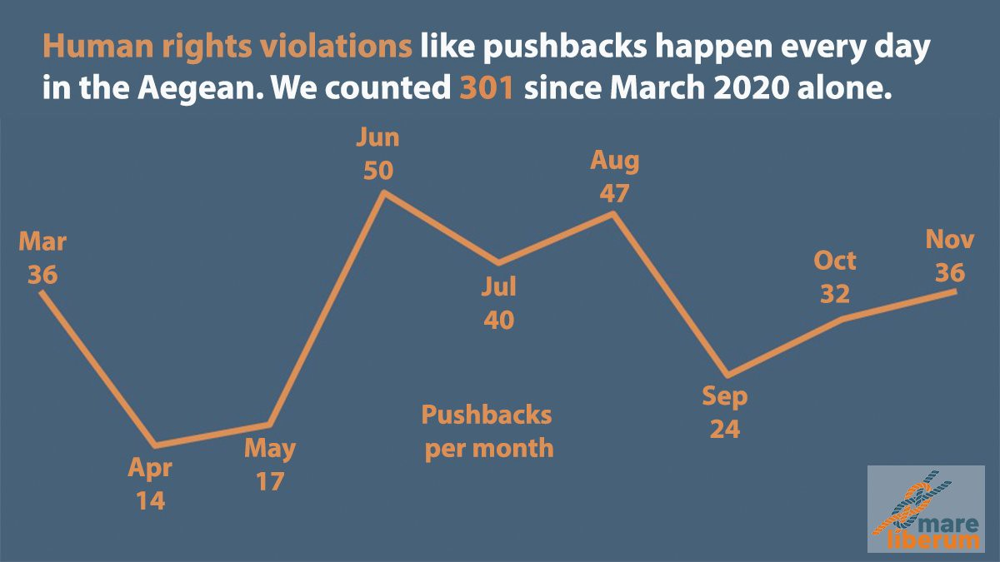
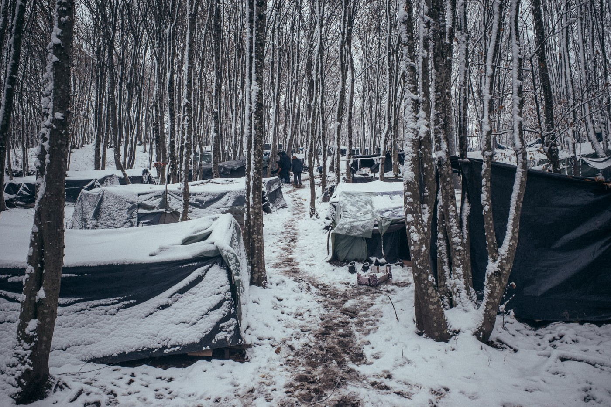
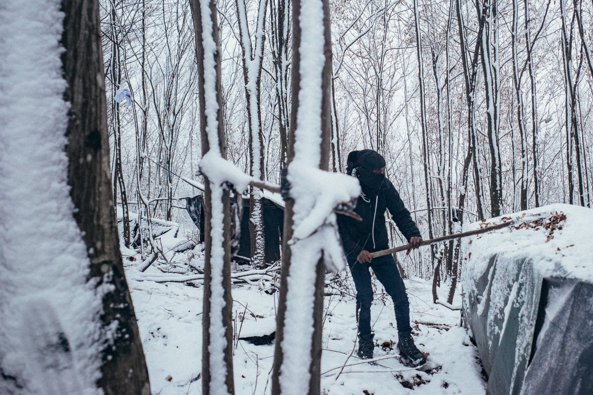

### AYS Weekend Digest 5–6/12/2020 Greek \(new\) Democracy?

_Shipwreck feared off the Moroccan coast // UK: One deportee to Jamaica tested positive for COVID\-19 // New arrivals in Kalymnos \(Greece\), Southern Italy and the Canary islands // Updates from Patras, Ventimiglia and the Balkans_

 \)](assets/eeeea849fc9e/1*BCvn1-5ot8ebbv27LJl0yg.jpeg)

06\.12\.2008 — Don’t Forget \( [Illustration by John Antono](https://johnantono.blogspot.com/2020/12/den-ksexnoun.html) \)
#### FEATURED: Greek \(New\) Democracy?

**The Pandemic as an excuse: rewriting history, banning dissent**

This Sunday was the 12th anniversary of the murder of 15\-year\-old Alexis Grigoropoulos, shot by a policeman in the Exarchia neighbourhood of Athens\. This particular anniversary has come at the same time as a rise of illiberal policies handed down by the Greek government\. It acts as an example of the heightened level of police repression currently at play in Greece — see our recent [Special on Racism and Police Harassment during COVID\-19](ays-special-from-athens-racism-and-police-harassment-during-covid-19-aa5116904c80) — and provides context to the experiences of people on the move and those who work in solidarity with them at this time as well as worrying developments for press freedom\.

In Athens alone, more than 160 people were arrested, officially for breaking lockdown measures\. On the day, all gatherings of more than four people were banned\. Yet, from Monday, the government is allowing Christmas street markets to open…

■■■■■■■■■■■■■■ 
> **[Manos Moschopoulos](https://twitter.com/maledictus) @ Twitter Says:** 

> > Hypocrisy is, after all, a Greek word. 

> **Tweeted at [2020-12-06 20:19:11](https://twitter.com/maledictus/status/1335680204308697090).** 

■■■■■■■■■■■■■■ 

Police have been recorded arresting people who were trying to bring flowers to Alexis’ plaque, destroying these flowers and throwing stun grenades into residential buildings\. This comes a few weeks after the mass deployment of police all over the country for the commemoration of the 1973 revolt at the Polytechnic University of Athens, which put an end to the military dictatorship that ruled the country from 1967\. On the 17th of November, groups of peaceful and self\-distancing demonstrators were kettled, charged and beaten by riot police in all major Greek cities\.

■■■■■■■■■■■■■■ 
> **[Enough 14](https://twitter.com/enough14) @ Twitter Says:** 

> > #Athens: Cops at Zoodochou Pigis took the flowers (and destroyed them,video) that a woman had left for Alexis. - #AlexandrosGrigoropoulos #6dGR  #Alexis #antireport -
Video by @[radiofragmata](https://twitter.com/radiofragmata) 
https://t.co/BPTT1DCqdG 

> **Tweeted at [2020-12-06 10:40:56](https://twitter.com/enough14/status/1335534685758304257).** 

■■■■■■■■■■■■■■ 

It is well documented that fascist and Nazi ideology is widespread among the Greek police\. High ranking members of the police were actively involved in the neo\-Nazi party Golden Dawn, and on Sunday a policeman in Athens was spotted [wearing](https://thepressproject.gr/nazistiko-symvolo-se-kranos-astynomikou-sta-exarcheia/) a helmet with a symbol of XXXI Army Corps of the Wermacht\. Among the arrestees were [two lawyers](https://twitter.com/YiannisBab/status/1335621609080676352) who were working in the civil court case against Golden Dawn, arrested while trying to reach their client; [Petros Konstantinou](https://twitter.com/YiannisBab/status/1335563523838119937) , head of anti\-racist organisation KEERFA and member of Athens city council; [members of the Rosa Luxemburg foundation](https://twitter.com/maledictus/status/1335622321931956224) ; plus scores of anti\-fascists\.

According to observers, the very deployment of thousands of police in these last few weeks has already caused a spike in positive COVID\-19 cases among the security forces and their families, and risks becoming a super\-spreader in a country with a health system already under extreme pressure\.

**Press Freedom**

Furthermore, videos show [riot police charging journalists](https://twitter.com/savvaskarma/status/1335599577941110784) in the Exarchia neighbourhood in Athens\. This is a highly symbolic ‘picture’ of the freedom of Greek press under this new government\. The public press agency and public television have been brought under [direct control](https://twitter.com/BrunoTersago/status/1335220205509877760) of the Prime Minister office\. Coverage of the pandemic is kept under close control, with health workers prevented from speaking to the media without official authorisation\. During the pandemic, many [media](https://www.project-syndicate.org/commentary/democracy-imperiled-in-greece-by-yanis-varoufakis-2020-11) outlets “have become fully dependent on large grants that the Ministry of Information \(Orwell lives\! \) dispenses at the minister’s whim\.” As we have reported previously, this has lead to repercussions for those journalists covering the situation of refugees in the country\. As Franziska Grillmeier [stated on twitter](https://twitter.com/f_grillmeier/status/1335605542685995010) :

> After the fire in [\#Moria](https://twitter.com/hashtag/Moria?src=hashtag_click) , we have been intermittently restricted from reporting \(for over 5 days starting on 9 September 2020\), especially inside the area where over 10\.000 people had been stranded on the roadside without accommodation or sanitation\. 

■■■■■■■■■■■■■■ 
> **[Franziska Grillmeier](https://twitter.com/f_grillmeier) @ Twitter Says:** 

> > 7) On #Lesvos this has been going as far as to violently apprehend @[welt](https://twitter.com/welt) correspondent Iason Athanasiadis on 11/09. According to @[RSF_inter](https://twitter.com/RSF_inter) 3 policemen threw him to ground, pressed on his body with knees. He was released only after an hour-long detention. 

> **Tweeted at [2020-12-06 15:26:41](https://twitter.com/f_grillmeier/status/1335606594097307649).** 

■■■■■■■■■■■■■■ 

In October, a German crew was [detained](https://twitter.com/f_grillmeier/status/1335603992894844929) and strip\-searched without charges on the island of Samos\. They were making a documentary on climate\-induced migration\. On the 17th of November, journalists were arrested [in Athens](https://twitter.com/f_grillmeier/status/1335603991019970560) while covering the demonstrations, and [on Lesvos](https://twitter.com/f_grillmeier/status/1335603988742475781) , “while trying to report on the landing asylum seekers & possible illegal “pushbacks” by Greek authorities\.”

> [Right now](https://twitter.com/f_grillmeier/status/1335605544976080898) , press is not allowed to report inside the Aegean camps without a special permission, that is very hard to obtain \(including the new site of [\#Moria2](https://twitter.com/hashtag/Moria2?src=hashtag_click) \) \. In order to avoid their contacts with [\#refugeesgr](https://twitter.com/hashtag/refugeesgr?src=hashtag_click) , police has limited the movement of journalists on Lesbos\. 

Over the weekend, one of the few twitter accounts held by a resident of Moria 2\.0, on which they had been posting photos and videos regarding the situation inside the facility, was [suspended](https://twitter.com/BrunoTersago/status/1335267279118987265) \.

**Government Propaganda**

The government carries on with its policies, unperturbed by the accusations of violence within the country and at its borders\. Documentation on pushbacks piles up on a daily basis, involving — in a number of cases — the EU agency Frontex\. On Saturday, 29 people were [reportedly](https://www.aa.com.tr/en/turkey/turkey-rescues-29-asylum-seekers-pushed-back-by-greece/2066852) rescued by the Turkish coast guard on a life raft off the coast of Izmir, after being pushed back by Greek authorities\.

In less than two years, the right\-wing government have pursued the criminalisation of solidarity organisations and NGOs, have tightened the laws on asylum, have further militarised the borders, have provided de facto impunity for crimes committed in the Aegean and in the Evros region, have restricted access to camps and hotspots, and are now turning reception centres in unofficial detention sites\. Officials have so far denied all such accusations, labelling them Turkish propaganda, and trying to shift the blame on to the NGOs and grassroots groups documenting these crimes\. Greek authorities have pressured Frontex and the EU to include “ [_hybrid threats_](https://www.statewatch.org/news/2020/november/frontex-will-a-management-board-sub-group-find-the-truth-about-pushbacks/) _”_ within the realm of the latest internal investigating sub\-group on Frontex complicity in pushbacks\.

While Greece descends into authoritarianism, EU institutions watch and applaud the country’s role in defending the Union’s external borders\. Liberal values come in handy only when needed\. Criticisms against Hungary and Poland, who now are [vetoing](https://www.project-syndicate.org/commentary/democracy-imperiled-in-greece-by-yanis-varoufakis-2020-11) the new EU budget, are rarely heard about Greece, a modern Cerberus at the EU’s gates\.
- Read our latest Special: [**Frontex and Human Rights\. How did we arrive here? Part 1\(2004–2016\)**](ays-special-frontex-and-human-rights-how-did-we-arrive-here-part-1-2004-2016-17cffb340c07) \. A year\-by\-year timeline of all major Frontex\-related events, operations, policies and accusations\.
- Read more: [**How to Lose a European Country, by Yanis Varoufakis**](https://www.project-syndicate.org/commentary/democracy-imperiled-in-greece-by-yanis-varoufakis-2020-11) **\.**
- Read more: [**An account of Sunday events in Athens**](https://www.facebook.com/yyoulountas/posts/2643856512591626) \.

SEA
#### Shipwreck feared in the western Mediterranean

■■■■■■■■■■■■■■ 
> **[Alarm Phone](https://twitter.com/alarm_phone) @ Twitter Says:** 

> > ⚫️ Shipwreck - 11 deaths feared 

Last night, we were alerted to a boat in distress off Tan Tan, #Marocco. We alerted authorities but in vain. This morning, the remains of a rubber boat were found on the Moroccan shore with 2 survivors &amp; 2 bodies on board. 9 people are missing. https://t.co/Y84lVq2cdF 

> **Tweeted at [2020-12-06 19:48:39](https://twitter.com/alarm_phone/status/1335672523455942656).** 

■■■■■■■■■■■■■■ 

GREECE
#### Arrivals

According to Aegean Boat Report [information](https://www.facebook.com/AegeanBoatReport/posts/984940322029072) , one boat carrying 40 people landed on the north coast of Kalymnos, an island between Kos and Leros\. They had been drifting for at least 5 hours before managing to reach the shore\.
#### Update from Health on the Move project in Patras

> No Name Kitchen team on the field have long sought a private dental clinic\. Each one seemed to have a good excuse for not welcoming the guys with dental problems\. The most common answer had been that they do not accept foreigners because they might have COVID\-19\. Some weeks ago, the team in Patras found an amazing dentist and, bringing the first two guys with more serious problems, she gave us some options for a reasonable price\. 

If you want to help to cover the cost of these treatments \(€270 each\), read more [HERE](https://www.facebook.com/NoNameKitchenBelgrade/posts/1137934706604812) \.

MALTA
#### Court order immediate release of four men held in arbitrary detention

Maltese media [reported](https://newsbook.com.mt/en/court-condemns-arbitrary-detention-of-asylum-seekers-as-abusive-and-farcical/) on November 28th that a court condemned the arbitrary detention of four men who arrived to the island on June 7th 2020 and have been held in detention since at Ħal Safi and Ħal Far detention camps \(166 days\) \. The judge also ordered their immediate release\.

The court case started thanks to Aditus Foundation, who filed an application of _habeas corpus_ on behalf of the four men\.

> In their application, the four asylum seekers said that they were not given any reasons for their continued detention which is in breach of their fundamental human rights\. Furthermore, they had applied for asylum and their presence in Malta thus was regulated through such an application\. 

The court described the authorities’ behaviour as “farcical … for depriving them of their liberty in an arbitrary manner without any legal justification”\.

> In court it emerged that their detention is the result of a policy adopted by the administration to the effect that when there is no place at the Open Centres, asylum seekers are taking to the detention centres against their will\. This arises from the fact that there is no alternative accommodation made available\. 

The director of Aditus commented on the hypocrisy of Maltese authorities:

> “Malta refuses much\-needed support from the European Union to create more space for refugees, and then locks up people because of this very lack of space\. Abusive and farcical indeed\.” 

“It is a great comfort for us and for our clients to confirm that justice is indeed possible through our Courts of Law\. We will bring case after case until the Government decides to engage in dialogue with us to seek a humane solution to the current crisis\.”

ITALY
#### Arrivals

At least four arrivals were recorded over the weekend\. On Saturday 70 people landed near Crotone\. According to journalist [Angela Caponneto](https://twitter.com/AngiKappa/status/1335181426296299522) , they are from Afghanistan and Iraq and the boat reached Italy from Turkey\.

[On Sunday](http://www.rainews.it/dl/rainews/articoli/Migranti-58-sbarcati-nel-Salento-altri-70-in-mare-aperto-9ccb3f0c-4ca9-4baf-ab29-98bde66b7493.html) , one boat landed in near Lecce \(south\-east\) \. It carried 58 people \(including 20 children\) from Egypt, who are now at the CARA in Otranto\. A second boat was rescued off the coast in the same area, with 70 people on board\. They have been taken to the port of Gallipoli, and will go to the CARA in Otranto\. 60 people landed Calabria, from Iran, Iraq and Afghanistan\. The have now been taken to the CARA in Isola Capo Rizzuto\.

Despite the almost total silence of Italian media on this route, it is far from being a ‘new’ phenomenon and it has been used constantly over recent years, often involving sailboats leaving from Turkey\. In related news, on Saturday, media agencies [reported](https://apnews.com/article/europe-afghanistan-police-pakistan-greece-7d4acd10d59acc0f4ebdf62d6d4ca071?fbclid=IwAR01J2fuwz-gzqBoF_U74BPO7FZRw8XjQFIC_lXJIm-e7VJWLQySXzap6ck) that 19 people were arrested in various Italian cities for people smuggling\. They charged €6,000 to bring people to Greece and Italy from Turkey, and from there to northern EU countries\.
#### COVID\-19 cluster in reception centre near Salerno: structure in isolation, with 24/7 police presence and drones

Local media [report](http://www.stiletv.it/news/71662/capaccio-cluster-covid-in-un-centro-migranti-presidio-h24-della-municipale?fbclid=IwAR01J2fuwz-gzqBoF_U74BPO7FZRw8XjQFIC_lXJIm-e7VJWLQySXzap6ck) that 30 people tested positive in the reception centre in Santa Venere, Capaccio\-Paestum, near Salerno\. The centre hosts 121 people, who are now in complete lockdown\. More testing has been announced, but no isolation of those who tested positive has taken place\. Instead, the centre is now guarded day and night by police with the additional use of drone surveillance\.
#### Open letter denounces conditions at the hotspot in Lampedusa

The [Forum Lampedusa Solidale](https://www.facebook.com/ForumLampedusaSolidale/posts/4136788216334744) published an open letter addressed to various local and national authorities, in which it highlights the protracting of degrading living conditions within the hotspot in Lampedusa\. In particular, the letter raises concerns and asks for actions referring to:
- the lack of basic items to guarantee the well\-being of the residents
- the fact that people are often forced to sleep outdoors, due to overcrowding and their length of stay in the centre\.
- the lack of service for personal care and hygiene
- reports of aggression by dogs within the centre

Read the full letter \(in Italian\) [HERE](https://www.facebook.com/ForumLampedusaSolidale/posts/4136788216334744) \.
#### Updates from the Italian/French border

Kesha Niya published their update on one week this November\. It includes accounts of people being illegally detained and pushed back from France to Italy, without being able to use their legal right to claim asylum in France as soon as they have entered the country\.

The group offers snacks and drinks on the Italian side of the border to who are pushed back by French authorities as they pass by on their way back to Ventimiglia\.

> In the _\[French\]_ police stations, people are held for several hours \[…\] without anything else than them being in a closed area we call “container”\. By this, their right to not being held longer than 4 hours is ignored\. By this, their right to have food, water, medical aid, legal support by a lawyer, support in communication by a translator if they don’t speak french and some more is ignored\. Moreover, they are humiliated, not listened to and physically violated when being controlled by french forces in the mountains between France in Italy, in the trains to France and in the streets in the cities after the border \(Menton, Monaco, Nice\) \. 

Kesha Niya have collected “reports about illegal pushbacks of minors, whose dates of birth on the paper denying entry to France \( _refus d’entree_ \)” were systematically altered, turning them into adults, and taking away their status as minors\. “Like this, we can not use these documents to prove that the minor’s right for protection is being ignored\.”

> In these last 7 days, we met: 

> \- 620 people at the “breakfast” spot; 

> \- 510 of those were people being pushed back by the french border police, who had to go through the French and Italian police stations; 

> \- 110 of those were people not being pushed back, coming from Ventimiglia or the area, partially trying to cross the border through the mountains the same day or planning to cross the border in the future\. 

> Of them: 20 women, 19 accompanied children, \[…\] 2 persons with their asylum process running in France\. 

> As most people have to try more than 2, usually even more than 3–5 times to cross, the actual number of those who try to cross is lower\. We see people several days in a row\. 

The update also include a day\-by\-day report on the situation at the border, read it all [HERE](https://www.facebook.com/KeshaNiyaProject/posts/1401628006848729) \.

Kesha Niya is also [calling for volunteer support](https://www.facebook.com/KeshaNiyaProject/posts/1402293233448873) over Christmas and New Year\.

SPAIN

**79 new arrivals to the Canary Islands**

■■■■■■■■■■■■■■ 
> **[Gabriela Sánchez](https://twitter.com/Gabriela_Schz) @ Twitter Says:** 

> > Desembarco en el muelle de Arguineguín de 79 personas, rescatadas por @[salvamentogob](https://twitter.com/salvamentogob) en tres pateras distintas. El "campamento de la vergüenza" está cerrado, pero las llegadas a Canarias continúan. https://t.co/LkavWT4rvh 

> **Tweeted at [2020-12-05 16:27:12](https://twitter.com/gabriela_schz/status/1335259436512841735).** 

■■■■■■■■■■■■■■ 

BOSNIA AND HERZEGOVINA
#### [**SOS Balkan Route**](https://www.facebook.com/SOSBalkanroute/photos/pcb.396177591821820/396172815155631) **report on winter conditions for people on the move**

 via [SOS Balkan Route](https://www.facebook.com/SOSBalkanroute/photos/pcb.396177591821820/396172815155631) \)](assets/eeeea849fc9e/1*AI10VHsStGK640tdbSrCTA.jpeg)

\(Photo credit: [Ben Owen\-Browne](https://www.facebook.com/benowenbrowne) via [SOS Balkan Route](https://www.facebook.com/SOSBalkanroute/photos/pcb.396177591821820/396172815155631) \)

Snow has arrived in Bosnia and SOS Balkan Route are trying to support people forced to live in the woods since they are not allowed into the IOM run camp, Miral, only 2 km away\. The next closest camp is Lipa, but it is 75 km away and people on the move are often refused transport on public buses or taxis\.

> “We’re still fine today”, young Farouz \(24\) from Bangladesh reassures our photographer first\. “But I don’t know how we’ll be doing next week,” adds the young man from the city of Sylhet, who could only find a place in the forest\. The fact that people from regions like Bangladesh did not even know such cold temperatures until now is interested in European asylum policy, the real manufacturer of these pictures, just as the refugee can’t find a place in the official camps anymore\. 

 via [SOS Balkan Route](https://www.facebook.com/SOSBalkanroute/photos/pcb.396177591821820/396172815155631) \)](assets/eeeea849fc9e/1*uPM_CFS7VrvprvFoVuttkw.jpeg)

\(Photo credit: [Ben Owen\-Browne](https://www.facebook.com/benowenbrowne) via [SOS Balkan Route](https://www.facebook.com/SOSBalkanroute/photos/pcb.396177591821820/396172815155631) \)

However, the situation in Lipa is almost as bad as staying in the woods as it has inadequate water and electricity, and unheated tents\. There have been [repeated calls to close it](https://www.balcanicaucaso.org/bloc-notes/Bosnia-Erzegovina-chiudere-il-campo-di-Lipa-ora?fbclid=IwAR0q0Nrvv39Up3C5Dz7mUBJAB730yF0YIC44buNt1vGOqsc15a8IKOlh6z0) and a [current petition to do so is ongoing\.](https://www.change.org/p/council-of-the-european-union-help-refugees-close-the-lipa-camp-in-bosnia-now?recruiter=1147488249&recruited_by_id=c4af7470-f1e1-11ea-be02-8f9e7ee4152a&utm_source=share_petition&utm_medium=copylink&utm_campaign=petition_dashboard)

> Europe does not comply with its own ideas and values of human rights, otherwise these young people would not have to fight for survival and at least have a warm and decent place\. 

To support SOS Balkan Route to provide small kitchens, food and clothes, look [HERE](https://www.facebook.com/SOSBalkanroute/posts/396177591821820) \.

UK
#### One of the people deported to Jamaica on Wednesday tested positive to COVID\-19

Media [report](https://www.theguardian.com/world/2020/dec/05/prisoner-deported-uk-jamaica-test-covid-19-windrush-coronavirus) that one man, who was on the \#Jamaica50 deportation flight from the UK to Jamaica on Wednesday the 3rd, tested positive to COVID\-19 and was in isolation in a medical facility in Kingston\.

> The positive patient told media that he is unaware of how he got coronavirus, but he added that the deportation flight from the UK to Jamaica was crowded and some people took their masks off on board\. 

This despite the fact that only 13 of the initial 50 people the government had planned to deport were on the plane, following appeals and revisions\.

WORTH READING
- [**The prince’s trip to the Canary Islands: 15 days up at the helm of a boat**](https://elpais.com/espana/2020-12-05/el-viaje-del-nino-prince-a-canarias-15-dias-subido-en-el-timon-de-un-barco.html?fbclid=IwAR3CBxJb_gukso1aGVQHnY68M4w6B5RWyYsFd0wsXhi5LPvQUwGWsAcYaDM) — El Pais has published \(in Spanish\) the story of a 14\-year\-old Nigerian boy’s journey to the Canary Islands\.

**If you wish to contribute, either by writing a report or a story, or by joining the info gathering team, please let us know\.**

**We strive to echo correct news from the ground through collaboration and fairness\. Every effort has been made to credit organisations and individuals with regard to the supply of information, video, and photo material \(in cases where the source wanted to be accredited\) \. Please notify us regarding corrections\.**

**If there’s anything you want to share or comment, contact us through Facebook, Twitter or write to: areyousyrious@gmail\.com**

_Converted [Medium Post](https://medium.com/are-you-syrious/ays-weekend-digest-5-6-12-2020-greek-new-democracy-eeeea849fc9e) by [ZMediumToMarkdown](https://github.com/ZhgChgLi/ZMediumToMarkdown)._
