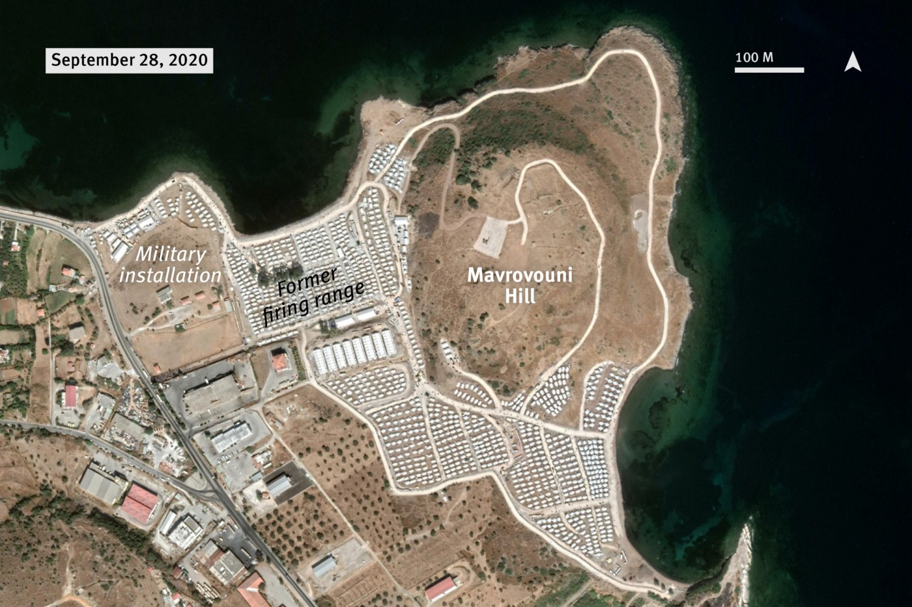
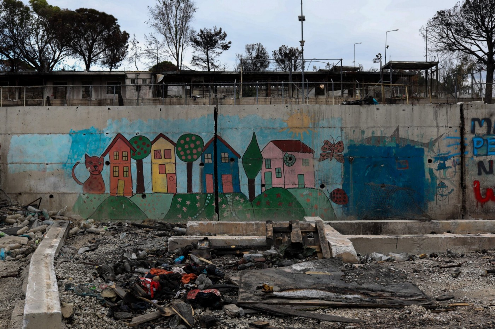

### AYS Daily Digest 08/12/20 Scary potential for lead poisoning in Moria 2\.0

_Pushbacks in Greece// Frontex admits to knowing about pushbacks // important updates on the Balkan route // France and Morocco make a deal // and more…_

](assets/c8fb9cf60832/1*wtwnPm_P5GJOKk29c29k6A.jpeg)

Photos by HRW, provided by [Eva Cossé](https://twitter.com/Eva_Cosse/status/1336332517566152708)
### FEATURE: Lead poisoning concerns in Moria 2\.0

In a new report by Human Rights Watch, they raise concerns about lead poisoning in Moria 2\.0, due to the fact that the Greek government is building the camp on ground that used to be a military firing range\. The government has not overseen comprehensive lead testing or soil remediation even though they are now starting to move people in\. People now living in the camp have collected evidence that “unexploded mortar projectiles and live small arms ammunition” are still in the area\. These could of course lead to serious injuries or deaths if not cleared away\.

> “In response to letters from Human Rights Watch, Migration and Asylum Minister Notis Mitarachi stated in a November 19 letter that the camp had “no lead contamination,” but provided no evidence for the basis of that assertion\. He said the government has agreed to conduct soil testing with the European Commission within one month, but has not revealed the nature of the testing, the areas to be tested, or the methodology\. A Hellenic army representative called Human Rights Watch on December 1, stating his intention to respond to a letter received on November 4 from Human Rights Watch, raising urgent concerns\. But no response has been received\. On December 6, General Secretary for Asylum Seekers’ Reception Manos Logothetis, called Human Rights Watch to dispute the risk of lead contamination at the camp\. He confirmed that no soil testing for lead had taken place prior to moving people to the camp, but said that authorities are awaiting the results of soil testing conducted recently in collaboration with the Institute of Geology and Mineral Exploration \(IGME\) \. 

> ‘No one just shows up without a plan,’ Dr\. Gordon Binkhorst, vice president of global programs at Pure Earth, told Human Rights Watch\. ‘Sharing of a well\-founded work plan beforehand is key to transparency and ensuring confidence in the findings\.’ Greek authorities should allow independent experts to comment on investigative work plans, audit the soil testing process and collect split samples for independent testing\.” 

Western Europe Researcher at Human Rights Watch [Eva Cossé](https://twitter.com/Eva_Cosse/status/1336332517566152708) provided the following information, namely that the World Organization says that “there is no known safe lead exposure” and that lead is extremely toxic “when ingested/inhaled, particularly by kids and during pregnancy\.”

> “\(The\) firing range was in use from 1926 until days before camp was built…Even worse, the Greek govt failed to clear unexploded mortar projectiles and live small arms ammunition before moving people there, \(and\) did wildly negligent clearance operations only after families with kids arrived\. To top it off, in last days the gov launched major construction works at the camp, which would normally be a good thing if improving camp conditions, but it could also disturb any potentially lead\-contaminated soil, which could further expose residents and workers\. 

> If there is lead\-contaminated soil at camp, that could threaten the health of everyone working there too, incl\. staff of Frontex, EASO, EU Commission, UNHCR, WHO, Europol, IOM, UNICEF, HRC SAMARITES, Hellenic Police, Hellenic Greece, Eody Greece, and all others\.” 

> “Govt needs to immediately pause construction works, conduct soil testing, make results public\. If it finds lead present in soil, it should take steps to immediately end people’s exposure and treat any lead poisoning, particularly young kids and pregnant women\.” 

Read the full report [here](https://www.hrw.org/news/2020/12/08/greece-lead-poisoning-concerns-new-migrant-camp?fbclid=IwAR12VXj76HCkZEHA2-5QhNaYJQYguRVeYwksn_CrOFNpMZwD8lJ_3uTJP-k#) \.
#### SEA

](assets/c8fb9cf60832/1*65Q6YZv-Rpbm1Zzk_Qt7TQ.jpeg)

**Update from SOS Mediterranee France** : “After having to stay at anchor in Augusta due to bad weather conditions, the OceanViking returned to the shipyard yesterday\. Additional emergency equipment is being installed on board\. We are on track to complete the work which we hope will help end the detention of the OceanViking, which has been prevented from fulfilling its vital mission in the Central Mediterranean for more than 4 months\.” Photo by [SOS Mediterranee France](https://twitter.com/SOSMedFrance/status/1336243303809998850)

](assets/c8fb9cf60832/1*H4rnDSsE31ARCHFvHYDbnw.jpeg)

**Update from Salvamento Marítimo Humanitario:** “AITAMARI: after days of storms a slight improvement in the state of the sea allows the AitaMari to drop moorings\. Next stop Oporto \(port of Leixoes\) \.” Photo by [Salvamento Marítimo Humanitario](https://www.facebook.com/smhumanitario/posts/3572771602814664)
#### GREECE
### PUSHBACK REPORT

 on Tuesday: “A boat reported being carrying 23 people in distress in the border area outside Eftalou, Lesvos north\. The petrol tank has been removed from the boat by the Greek coast guard, they are now drifting\. They report that the Hellenic Coast guard vessel ΛΣ 148 took the petrol from the boat, from the video this number is not recognizable\. To call port police in Mytilíni seems futile, they are already on location, problem is they are pushing them back, not rescuing them\.”](assets/c8fb9cf60832/1*O9TGUc97nw8acPtOD1EH9g.jpeg)

From [ABR](https://www.facebook.com/AegeanBoatReport) on Tuesday: “A boat reported being carrying 23 people in distress in the border area outside Eftalou, Lesvos north\. The petrol tank has been removed from the boat by the Greek coast guard, they are now drifting\. They report that the Hellenic Coast guard vessel ΛΣ 148 took the petrol from the boat, from the video this number is not recognizable\. To call port police in Mytilíni seems futile, they are already on location, problem is they are pushing them back, not rescuing them\.”
### Der Spiegel report: Greece exposes refugees to the sea after arriving on Lesvos

Journalist [Giorgos Christides](https://twitter.com/g_christides/status/1336405239050752002) explains the report of the Greek authorities removing 18 asylum seekers who reached Lesvos, on November 29th\. They “put them on a life raft and then left them adrift in the Aegean, despite increased EU scrutiny over pushbacks\.”

■■■■■■■■■■■■■■ 
> **[Giorgos Christides](https://twitter.com/g_christides) @ Twitter Says:** 

> > 2/ One of them is Angela, 28, from Burundi. On the 29th, she met and was photographed (left pic) by a Greek university professor walking with his wife in Lesbos. She is now in Izmir (middle and right pics with a newspaper showing the date) where we interviewed her https://t.co/BoNZrCn09w 

> **Tweeted at [2020-12-08 20:20:14](https://twitter.com/g_christides/status/1336405244104871938).** 

■■■■■■■■■■■■■■ 

> “Based on interviews with some of the asylum seekers, audiovisual material captured by hidden phones by migrants, shared with us by Norwegian NGO Aegean Boat Report and verified by our researchers, and eye\-witness accounts, we reconstructed how the operation took place\. The group spent the night hiding, was picked up by GR authorities the next day, who, instead of placing them in quarantine at the refugee camp, took them north to the port of Petra, where they were summarily deported\. The Turkish Coast Guard picked them up at 5AM\. 

> In response to detailed questions by Der Spiegel, Greek authorities refrained from commenting on the specifics, repeating the mantra that they always act in accordance with the law\. The illegal, collective expulsion happened a day before Frontex chief Leggeri appeared before the European Parliament to defend his agency’s track record and pushing responsibility to Athens to investigate the mounting reports of pushbacks in the Aegean\. 

> On Wednesday, Frontex’s management board is expected to appoint an inquiry team to investigate all cases of pushbacks suspected of involving agency assets\.” 

Find ABR’s further reporting [here](https://www.facebook.com/AegeanBoatReport/posts/987333581789746) \. Read the full report [here](https://www.spiegel.de/politik/ausland/griechenland-grenzer-setzen-gefluechtete-nach-ankunft-auf-lesbos-auf-dem-meer-aus-a-9dbffbff-259c-4fa0-acb3-533c5becf972?fbclid=IwAR04X19whbjKpCUxWUOMhO3AGfPUJdhlRWVp0hVNDigLybvxGQtmqCOZ_EY) \.

](assets/c8fb9cf60832/1*bvcWBMSDoYNT3KOS2cjwFw.jpeg)

Lines and interviews\. Photo by [Legal Centre Lesvos](https://www.facebook.com/LesvosLegal/photos/a.1152003994838312/3784845018220850/)
### Report of Legal Organizations on the quality of remote asylum interviews at RAO Lesvos

RSA just released a report signed by many other organizations on “the quality of remote asylum interviews at RAO Lesvos and the conditions they are conducted under, which pose a health risk to asylum seekers and employees\.”

“On October 8, 2020, the Regional Asylum Office \(RAO\) of Lesvos started the implementation of the pilot program for remote asylum interviews\. Two months later, amid contradictory announcements from the RAO and while access to legal aid or other basic services\[1\] is not yet ensured for all asylum seekers, we as lawyers of legal organizations in Lesvos wish to highlight a number of important issues\. Specifically:
- The timing of serving the interview invitations
- Significant technical difficulties
- The facilities and rooms in which the interviews are conducted being insufficient”

Read their full report [here](https://rsaegean.org/en/report-of-legal-organizations-on-the-quality-of-remote-asylum-interviews-at-rao-lesvos/?fbclid=IwAR0vaxa_z1KLMA7RzvFz1NOqCCnU4CLVSCoswx7sJEyk0QSNwY8lvZtLe7o) \.

 by Elias Marcou, entitled “Human traces on the landscape in Moria, three months after the fire\.”](assets/c8fb9cf60832/1*VtAPQNxA0G-w08CpB4PdVg.jpeg)

From [a photo essay](https://wearesolomon.com/mag/photo-stories/human-traces-on-the-landscape-in-moria-three-months-after-the-fire/?fbclid=IwAR39HN4VxxooQArgAG0k9_K6LCObSArIZ4W-ZwWNKtO3R86ND_-3MaQym3Y) by Elias Marcou, entitled “Human traces on the landscape in Moria, three months after the fire\.”
### With no real evidence, Greece’s migration minister accuses NGOs of helping migrants cross Turkish border

On Tuesday, [the Greek minister](https://migration.gov.gr/dilosi-yma-gia-toyrkiki-proklitikotita-k-afixeis-somalon/?fbclid=IwAR2lmtAi0h8cBkC2x0bTVvhIUMQ8hzn7ltyEv5rb2rEr-ZwF4O46MA5oMwU) said “ _In recent weeks, arrivals of migrants from Somalia, a country that does not border Greece, have been observed in Lesvos\. Of the 214 arrivals since November 1 in Lesvos, 142 are from Somalia\. According to testimonies and cross\-referenced information, NGOs pay the costs of transporting & issuing a visa to Turkey, with flights to Istanbul\. They are then transported to the Turkish coast, where smugglers, again with the support of NGOs, help them to enter the European Union illegally\. These crossings must and will be blocked in every legal way\. We do not want our country to be the gateway to Europe\._ ” Without concrete evidence given, we can not rule out that this is a deflection of blame for rising arrival numbers and continued effort to target NGOs\. AYS will continue to follow this story\.

■■■■■■■■■■■■■■ 
> **[Franziska Grillmeier](https://twitter.com/f_grillmeier) @ Twitter Says:** 

> > In ast week of Nov, 30 people arrived on #Lesvos. Last year during the same period it was 818 people who crossed. 

According to UNHCR there are currently 9,385 #refugeesgr residing on island. 

Mostly fleeing from Afghanistan (73%), DRC Congo (9%) &amp; Syria (7%). 

> **Tweeted at [2020-12-08 07:53:20](https://twitter.com/f_grillmeier/status/1336217283509751809).** 

■■■■■■■■■■■■■■ 

[**Mobile Info Team for refugees in Greece**](https://www.facebook.com/mobileinfoteam/posts/2942434472651929) is reminding us that: “the quarantine was extended until 07/01/21\. This means that until \(then\):
\- Travel restrictions still exist and everyone is allowed to leave their residence for a special reason\.
\- Travel restrictions also stand between 9 pm and 5 am, that means you should leave your residence because of medical issues or for a job or work\.
\- You are not allowed to travel or leave from the city or structure of your residence, other than sickness or job\.
\- Wearing mask in all closed and open spaces is essential\.
If you violate one of these rules, the police will fine you 300\. For Christmas and New Year’s holidays, the government may have made exceptions to night travel restrictions, but this is not yet confirmed\.”

**Help Velos Youth** in supporting their new campaign “Support and follow a displaced young person’s journey in Athens\.” They are a dedicated organization helping unaccompanied minors working on this awareness and support campaign\. Find them [here](https://www.facebook.com/velosyouthathens/posts/2531699220461032) \.
#### MALTA

DFR Labs is reporting that “ _Maltese Facebook pages with thousands of followers routinely attack non\-government organizations focused on immigration issues in the Mediterranean and accuse them of human smuggling\. These pages have organized counter\-protests, created petitions, promoted anti\-immigrant websites, and perpetuated hate speech against immigrants in Malta\. These harmful narratives serve to disenfranchise life\-saving NGOs operating on the coast of Malta and discourage resettlement of asylum seekers_ \.” Learn more [here](https://medium.com/dfrlab/anti-immigrant-maltese-facebook-pages-rail-against-ngos-c2b4df8d0931) \.
#### ITALY

■■■■■■■■■■■■■■ 
> **[Mary Lawlor UN Special Rapporteur HRDs](https://twitter.com/MaryLawlorhrds) @ Twitter Says:** 

> > Communication sent to the Gov of #Italy w/ @[UNSR_Migration](https://twitter.com/UNSR_Migration) &amp; others on the criminalisation of Carola Rackete and the Iuventa crew now public: [tinyurl.com/y2s98bbj](https://tinyurl.com/y2s98bbj). 

The response from the Gov is available here: [tinyurl.com/y4aft3sv](https://tinyurl.com/y4aft3sv). 

@iuventa10 @[seawatch_intl](https://twitter.com/seawatch_intl) @[ECCHRBerlin](https://twitter.com/ECCHRBerlin) https://t.co/frrLKyFNlk 

> **Tweeted at [2020-12-08 12:04:41](https://twitter.com/marylawlorhrds/status/1336280535547736066).** 

■■■■■■■■■■■■■■ 

In some quick updates, according to [InfoMigrants](https://www.infomigrants.net/en/post/28972/eu-proposal-good-starting-point-but-insufficient-italian-pm?fbclid=IwAR0MVHKbC4CXjofaFwepsEqcFdeHaI4Iv5x5FF1XkidReJuAsh2z7qECE9Q) “Italian Premier Giuseppe Conte and Foreign Minister Luigi Di Maio have urged Europe to display more courage and commitment regarding the new pact on migration\. The politicians consider the reform plan ‘insufficient,’ albeit a ‘good starting point\.’”

[The organization](https://www.infomigrants.net/en/post/28970/migrants-inadequate-conditions-in-lampedusa-hotspot-says-local-association?fbclid=IwAR3WkvOMwKebmEXqAZNosrLafNq92yzlE6dRV2S4679daZlDEwehsZeDaBE) is also reporting that “an association working on the Sicilian island of Lampedusa, promoting solidarity between migrants and the local community, has denounced conditions in the migrant hotspot there\. The association says that the hotspot has ‘inadequate hygiene and sanitary conditions,’ and lacks ‘the necessities to guarantee the basic well\-being of people\.’”
#### SERBIA

Update from **InfoPark:**
- “Last week, around 150 persons \(families only\) were transferred from Sid and Kikinda RCs to Belgrade AC in Krnjaca\. The reason behind this was the alleged crowdedness of the borderlands centers as well as better educational opportunities for children in Belgrade\.”
- “The first refugee family that submitted an intention to seek asylum in Hungary received a travel permit and entered Hungary last week\. This is the first family that had entered Hungary since the start of application of the new asylum law and since the cancelation of the so\-called Hungarian list\. In the past three years, the family was accommodated in a Serbian refugee center patiently waiting to cross the border via the Hungarian list\. However, this controversial list was put on hold in March 2020 over the coronavirus pandemic and it has yet to be seen whether it will be reinstated\.”

#### BOSNIA AND HEREZEGOVINA

Update from [**Transbalkanska solidarnost**](https://www.facebook.com/transbalkanskasolidarnost/posts/204787007804955) on a man who was brutally beaten at the hands of the state police:

> “M\. Farid contacted us from Sarajevo\. He tried to cross the border into Slovenia in May this year and ask for international protection\. While trying to cross, he had a traffic accident with a truck, as a result of which he was taken to emergency treatment in Ljubljana\. Due to severe injuries, his leg was amputated during three operations\. According to him, he spent 17 days in a Ljubljana hospital, and then, despite the fact that he lost his leg above his knee and was still recovering, the Slovenian police deported him to Croatia, from where he was then deported to Bosnia and Herzegovina\. After the deportation, he went to a refugee camp, but there was no suitable care for him, so a friend offered him help, took him out of the camp and they rented a room together\.
 

> Mr Farid’s circumstances testify to the brutal violence of mass expulsions happening on the Balkan Route due to the systemic violations done by state police\. According to official data, more than 23,000 deportations were carried out from Slovenia to Croatia in the last two years, more than 9,000 this year alone\. The vast majority of people who have been deported to Croatia were then forcibly expelled to Bosnia and Herzegovina, from where they are again trying to cross European borders\. State violence done by the Slovenian police in the form of expulsions is coordinated from the top of the Police and the Ministry of the Interior\. Such actions force people into life\-threatening situations when seeking options of survival and safety\. If you wish to help him, please write in the inbox of the Infokolpa page\.” 

#### CROATIA

](assets/c8fb9cf60832/1*siugXuAQAjvQBz4eiMCcmw.jpeg)

AYS is looking for volunteers on the ground\! Find out more [here\.](https://www.instagram.com/p/CIiOOvMpYw9/?igshid=i80qy3ohp6sl&fbclid=IwAR0ob6ArLrfcTq7GHjjIJ3wyjJg7hPiFi96FbDExL4QF4pO-vwflfPqaVvc)
#### SLOVENIA
### Update from Ambasada Rog

Read their full report submitted to the UN [here](https://www.facebook.com/ambasadarog/posts/1361867794147853) \.

> “With the Task Force on Asylum and the Workers’ Advisory, **this week we submitted a report on the illegal treatment of Slovenian authorities to the United Nations Committee\.** We urged the committee to initiate an executive procedure regarding the systematic torture of migrants, which the EU countries, among them Slovenia, illegally return to BiH and Serbia\. The documentation gathered in the report clearly shows that such procedures are returning for coordinated operation of Slovenian authorities with Croatians\. Slovenian authorities have not only allowed the systematic torture of migrants by the Croatian police, but actively participated in establishing an illegal corridor of chain return, and blocked all attempts to investigate and remove such actions\. 

> For the third year in a row, the majority of Slovenian police have been handed out to Croatian authorities, systematically tortured and illegally pushed in BiH, which triggered one of the worst humanitarian crises on European soil\. As many as 90 % of refugees are exposed to inhumane treatment in Croatia — beating, robbery, torture, there are more and more examples of use of firearms and sexual abuse\. Reports credibly document the cases where people are forced into ice rivers when they draw chess on their heads, they are forced to sing cheerleaders, beat them unconsciously, they intrude mayonnaise into their heads\. These people are then completely physically and mentally destroyed, without papers and money, returned to camps in BiH, where conditions have been unbearable for a long time\. 

> **For us, the key findings that show that Slovenia is an important part of this torture mechanism because it has established a system of illegal migrant return to BiH in close cooperation with Croatian authorities** \. Despite good information about mass violation of human rights, Slovenian police returned to Croatia after rapid procedures, which systematically ignored asylum applications, with abuse of international agreement returning has prevented any legal care\. Slovenia has not only neglected its obligations to prevent internationally illegal acts and violated the fundamental principle of non\-refoulement \(“non\-refoulement”\) but also Convention against torture and other cruel, inhuman or humiliating penalties or treatment\.” 

#### SWITZERLAND
### Accepting unaccompanied minors from Greece

According to Swiss media, “ _Switzerland has agreed to receive another three dozen or so unaccompanied young refugees from Greece by the end of the year\. Of these, 14 have family ties to Switzerland\. The rest have been living in the burnt\-down Moria camp on Lesvos_ \.” Find out more [here](https://www.swissinfo.ch/eng/switzerland-to-take-more-young-refugees-from-greece/46210612?fbclid=IwAR20Z3fjqDQEj84lsfnjwFuJHQwxXz0mT6vFoVvbGlsryyQwQGw3v2rr9xc) \.
#### FRANCE
### Returning unaccompanied minors to Morocco

According to InfoMigrants, “ _Mediterranean states France and Morocco have inked a deal on child migrant returns\. The text of the agreement on the care of unaccompanied underage migrant children notably calls for “concrete tools” to facilitate the return of minors from France to Morocco_ \.” Find out more [here](https://www.infomigrants.net/en/post/28979/france-and-morocco-sign-agreement-to-facilitate-the-return-of-unaccompanied-minors?fbclid=IwAR145HYOxBxyBG6s8PJ1rb3S7VLbvDav9dLpxmfHDXJv1-98ogve8iPD90g) \.
#### EU

 “Good to see this photo resurfacing\. It begs some questions — what Frontex did next and what happened to the people in the photo, even if answers are unlikely\.” Photo by [Disinfaux Collective](https://twitter.com/disinfaux/status/1336306267544031232)](assets/c8fb9cf60832/1*QHWYyvj37ex_TtK1ZtFrGg.jpeg)

In response to journalist Lena K’s analysis of the photo \(center\) that’s attached to the article described below, Disinfaux Collective reported that “we have a positive match on the geolocation which is in the border town of Kastanies in the Greek\-Turkish border\. Exact location in the description of the file we upload in the tweet\.“ [Lena K\. orginally tweeted](https://twitter.com/lk2015r/status/1336285413154164737) “Good to see this photo resurfacing\. It begs some questions — what Frontex did next and what happened to the people in the photo, even if answers are unlikely\.” Photo by [Disinfaux Collective](https://twitter.com/disinfaux/status/1336306267544031232)
### “Frontex Acknowledges Dozens Of Returns From Greece To Turkey Suspected Of Being Unlawful”

In new TV6 reporting, _“The European border company \(Frontex\) acknowledges having witnessed or had information of greater than thirty suspected circumstances of sizzling return of immigrants from Greece to Turkey, all of them throughout the framework of the joint surveillance operation of the company with the guard Greek coastal\. The dramatic recount, to which EL PAÍS has had entry, is pressured by the European Fee, which has requested the company for explanations about its alleged negligence or complicity with the unlawful returns revealed in October by a number of German media\.”_

> “The company assures that it doesn’t have proof of the circumstances reported in these experiences\. However it gives particulars of dozens of incidents that, removed from clearing the doubts of Brussels, appear to extend the priority and go away the director of the company, the French Fabrice Leggeri, in a compromised scenario\. Within the European Parliament, requests for Leggeri’s resignation are intensifying whereas the European Fee refers back to the inner investigation launched by Frontex, whose conclusions are anticipated on January 21\.” 

Read the full report [here](https://tv6.news/frontex-acknowledges-dozens-of-returns-from-greece-to-turkey-suspected-of-being-unlawful/?fbclid=IwAR0ob6ArLrfcTq7GHjjIJ3wyjJg7hPiFi96FbDExL4QF4pO-vwflfPqaVvc) \.
### FRA’s report: Migration: Fundamental rights issues at land borders

“This report looks at fundamental rights compliance at the European Union \(EU\)’s external land borders, including rivers and lakes\. On 30 January 2020, the European Parliament requested the EU Agency for Fundamental Rights \(FRA\) to prepare a report on these borders\. It noted that the report should focus on the correct application of the safeguards in the European asylum acquis and the provisions of the Schengen Borders Code \(Regulation \(EU\) 2016/399\) \.” Find it [here\.](https://fra.europa.eu/en/publication/2020/migration-fundamental-rights-issues-land-borders?fbclid=IwAR2SNTfwFLvNGY33qFy4cJpXe0FrjbsABeHlVMmDlUj6tIEM8bye6tyx0Vc)
### The Conversation: Refugees are at risk from dystopian ‘smart border’ technology

“New technologies deployed on borders for migration management and border security under the umbrella of smart border solutions are ignoring the fundamental human rights of migrants\. Unmanned aerial vehicles \(drones, for example\) are often deployed in the surveillance of refugees in the US and the EU; big data analytics are being used to monitor migrants approaching the border\. Though methods of border security and management vary, a great deal are increasingly used to prevent migratory movements\.” More [here](https://theconversation.com/refugees-are-at-risk-from-dystopian-smart-border-technology-145500?utm_source=twitter&utm_medium=bylinetwitterbutton&fbclid=IwAR18zV_tZz9hTDiEojc2sMaBGIwVH134cny0pX9ZBwNIjcHP3eH9S2RYJWM) \.
#### WORTH READING
- [The Press Project’s](https://thepressproject.gr/lilipoupoli-chora-magiki-skiagrafontas-tin-akrodexia-sti-lesvo-meros-3o/?fbclid=IwAR0TQowWVmtiar1riomgAlTCpsCPXd7vFWilYxHcPPag48IFiEAp1vIA_RQ) new report entitled **Lilliput, Magic Land \(;\): Sketching the far right in Lesvos \(part 3\) \.** “ _If the Golden Dawn chapter hypothetically came to an end, in the book of the far right there is still room to spill a lot of ink for groups and networks that appear at specific times and in different parts of the map with similar characteristics, throughout Greece\._ ”
- [The Migreurop network](https://www.lacimade.org/presse/frontex-15-ans-dimpunite-lagence-hors-la-loi-doit-disparaitre/?fbclid=IwAR2SNTfwFLvNGY33qFy4cJpXe0FrjbsABeHlVMmDlUj6tIEM8bye6tyx0Vc) published a press release on **Frontex’s impunity\. _“_** _The European border and coast guard agency Frontex is accused by various media\[1\] to have been aware of or to have been complicit in the refoulement of at least six exile boats in the Aegean Sea, between March and September 2020 as part of Operation Poseidon\. For the first time, the agency was summoned to explain itself to the European Commission and Parliament\. It was time\!”_

**If you wish to contribute, either by writing a report or a story, or by joining the info gathering team, please let us know\.**

**We strive to echo correct news from the ground through collaboration and fairness\. Every effort has been made to credit organisations and individuals with regard to the supply of information, video, and photo material \(in cases where the source wanted to be accredited\) \. Please notify us regarding corrections\.**

**If there’s anything you want to share or comment, contact us through Facebook, Twitter or write to: areyousyrious@gmail\.com**

_Converted [Medium Post](https://medium.com/are-you-syrious/ays-daily-digest-08-12-20-scary-potential-for-lead-poisoning-in-moria-2-0-c8fb9cf60832) by [ZMediumToMarkdown](https://github.com/ZhgChgLi/ZMediumToMarkdown)._
