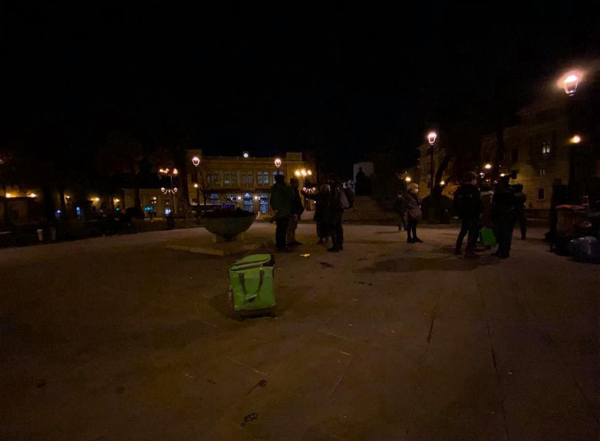

### AYS Daily Digest 14/12/2020 — UK: High Court rules that Home Office failed to protect destitute people
### IOM will cut supplies to Lipa camp in BH if government doesn’t take action//Upcoming launch of “Black Book of Push\-backs”//& more

[Are You Syrious?](?source=post_page-----dceac430b526--------------------------------)

[Dec 15](ays-daily-digest-14-12-2020-high-court-rules-that-home-office-failed-to-protect-destitute-people-dceac430b526?source=post_page-----dceac430b526--------------------------------) · 9 min read

### FEATURE
### UK Home Office failed to protect destitute people, court rules

The British High Court of Justice handed down a 71\-page judgement today where it ruled that The Home Office [failed to protect destitute people](https://www.landmarkchambers.co.uk/home-office-found-to-have-failed-to-protect-destitute-people-against-inhuman-and-degrading-treatment-caused-by-homelessness/?fbclid=IwAR0u7lpbZfqBn34lA7MmPe_xlghjBk40QzYwNfpCneMJeNxZX1o--TU0BkA) from homelessness\. The Home Office did not monitor the private contracts it handed out to manage accommodation, which led to lengthy delays in providing accommodation and terrible living conditions\.

Because of the delays in processing housing and aid, the claimants in the case \(along with countless other people on the move\) were left homeless for extended periods of time\. This violates the Home Office’s obligations according to The Immigration and Asylum Act of 1999\. Instead of actually monitoring the private companies they handed out contracts to, the Home Office claimed that it was the people’s own fault that they became homeless due to “unwillingness to travel,” not because of the Office’s negligence\.

> _I was left hanging on, waiting to be picked up by the contractors to be taken to accommodation, and each time there was a different reason as to why the pickup did not happen\. Eventually I had to wait and not move from the pickup point, and yet I was still not picked up\. The Home Office failed to listen to what I was saying, choosing to blame me for contractors failings\. The judge has made clear that this is wrong\. The Home Office should have listened to me\.”_ 

The ruling that found that The Home Office’s failures are responsible for the destitution of many people on the move comes just two weeks after the UK passed rules that made it possible for the government to [deport someone for sleeping rough](https://www.infomigrants.net/en/post/29087/homeless-migrants-targeted-by-uk-government-s-new-immigration-rules?fbclid=IwAR2t1HYuucUbQMx3N7S6kYmLzUazdZZtjVMSqEuy6n3XbYaJH4MEmgEAeOw) \.

Advocates are criticizing these rules for a variety of reasons\. They mentioned that criminalizing homelessness could push people into unsafe working conditions and even modern slavery\. The cruelty of passing this rule during a pandemic and economic downturn when many people, especially those with jobs in service industries, have lost their jobs, is also astounding\.

The rules are also arbitrary\. The government said that they would not apply to “refugees and asylum seekers” but what about people waiting for decisions on their status, or people that have been wrongfully denied asylum? They also said that the rule would be used “sparingly,” but who gets to determine what “sparingly” means? How do they define “rough sleeping?” Advocates from PILC have pointed out that the rules are so vague that technically, someone sleeping overnight in an airport to catch an early flight could get deported\.

The rule should not be applied “sparingly,” it should not be applied at all\. Many local councils agree — some, such as the Greater London Authority, have already said they would not cooperate with this rule\. In Sheffield, one local group, [Sheffield Against Asylum Evictions](https://gal-dem.com/amid-the-pandemic-sheffields-activists-are-mounting-defence-to-protect-asylum-seekers/?fbclid=IwAR1xOceCQr4pMAB0DW7_MNHpTeGBi7lKovDuwOpdUGroUDFj3pt5QhpGdxg) , has gone a step further and organizes eviction defense to prevent people from having to sleep rough in the first place \(and they’re exposing shady landlords\) \.

The Home Office cannot push people into destitution and then punish them for the Office’s mistakes\.
### GREECE
### Child endangered on Lesvos

During the night, [Moria White Helmets](https://www.facebook.com/MoriaWhiteHelmets/photos/a.129654032010998/225514062424994/) posted the chilling story of a child who was found with her head in the WC, almost drowned\. She was taken to the hospital\. Later, [Greek news reported](https://stonisi.gr/post/13639/sth-zoygkla-toy-kara-tepe-realtime?fbclid=IwAR1jN-hJ3dLfLfur1fv34nT_sPwk4G-cNas9NTBwm6HfyZN94Cm51rHcCSw) that she had been raped\.

She was only three years old\.

No child should ever have to go through this\. No child should ever face so much danger just to use the bathroom\. The children of Moria 2\.0 have been failed by the politicians who refuse to close the camps\.
### Other updates from Moria

Moria Corona Awareness Team [distributed over 1,000 sleeping bags](https://www.facebook.com/watch/?v=1751764628325916) and mattresses to help people, especially those whose tents were damaged by rain\. MCAT is doing an amazing job, but it should not be their task to provide for people that the government and international community has failed\.

[Reporters Without Borders \(Austria\)](https://www.rog.at/pm/scharfer-protest-gegen-informationssperre-auf-lesbos-reporter-ohne-grenzen-rsf-oesterreich-kritisiert-zugangsverbot-fuer-wiener-journalistengruppe/?fbclid=IwAR2_9VwJ9iNDSavDMXddEaT7cTbA6FtXoCpyb73TOREZY-kHgtbmyVFQeDg) is criticizing the media blackout around the Moria 2\.0 camp, as reporting teams are blocked from accessing their camp and teams of Austrian researchers are not even supported by the Austrian representation in Greece\.

An update on Friday’s police brutality case on Lesvos: a [disturbing video](https://www.facebook.com/watch/?v=1677245702436728) was published showing four policemen beating up two men trying to return to the Moria 2\.0 camp after doing their shopping\. The four officers have been arrested and charged with “ [inflicting bodily harm, torture, and breaking anti\-racist laws](https://www.infomigrants.net/en/post/29080/four-greek-officials-charged-with-assaulting-migrants?fbclid=IwAR0et9Cf1Mbu7bn4YTTOc3fMkO4bpOI2HAnfYr2110CFbjSJg6ok3EynFlg) \.” They were released from police custody until their trial\.

Finally, our friend Eric from Latitude Adjustment Podcast is hosting a free podcasting class\! Learn more about his work [here](https://www.facebook.com/latitudeadjustmentpodcast/posts/778423049423368) \.
### More lies, slander against NGOs

The pro\-government paper Ekathimerini [published another article](https://www.ekathimerini.com/260227/article/ekathimerini/news/report-sees-turkish-link-in-somali-migrant-transfers?fbclid=IwAR3G4Af_pbNOinPeYMtXHvT7eBuJA85J0MbPjRi20MrT0f7oLxxxKdeDjQY) alleging that NGOs are responsible for bringing people on the move to Greece by working with the Turkish government\. The article is based on an alleged secret government report that the newspaper claims to have seen\. However, it’s very common for pro\-government newspapers to allude to secret reports when talking about links between NGOs and organized smuggling, but never actually manifest any evidence\.
### Arrivals in Feres

Eight people [arrived in Feres](https://twitter.com/alarm_phone/status/1338569287322251264?fbclid=IwAR0Kf9C6thNSX6zHIjcfjnXe7x77-5TFs_soJ2ljoO40PdEGcu095muX2fk) , a town in Evros\. The people called AlarmPhone for help after they were in distress at the border and to make sure that they would receive international protection\. They were taken to the centre in Orestiada\.
### Remembering the people at the centre of it all

We’d like to share the stories of two people among the many who have been caught up in this shameful system\. This blog post shares [the testimony of Mahir](https://ulimuc.wordpress.com/2020/12/13/mahirs-story-push-back-in-the-aegean/?fbclid=IwAR3G4Af_pbNOinPeYMtXHvT7eBuJA85J0MbPjRi20MrT0f7oLxxxKdeDjQY) , a Syrian man who was pushed back from Greece\. This article \(in Spanish\) [follows Abdullah](https://m.publico.es/internacional/5005170/media-vida-refugiado-el-exilio-de-un-pintor-afgano-que-perdio-una-pierna-en-su-huida/amp?fbclid=IwAR3kjqJB_ykbjTJtURy26NtMeZo2-9J5Ixpk1ql6Y97mP7NXNreLX3NBUr4) , a man who had to flee Afghanistan because of a painting and is now stuck in Athens\.
### SERBIA

The Crisis Response and Policy Centre and the Humanitarian Centre for Integration and Tolerance published a paper on the situation for people on the move in Serbia that you can read [here](https://reliefweb.int/report/serbia/between-closed-borders-2019-joint-agency-paper-refugees-and-migrants-serbia-2019?fbclid=IwAR2Yt46i2OCsTByKnMeRBfHE_cLq3L4h3TaA4NTNh5qP339gdXMSLnOh0iM) \.
### BOSNIA & HERZEGOVINA
### IOM will cut supplies to Lipa camp if national government does not meet commitments

The IOM said that they will [no longer continue services](https://balkaninsight.com/2020/12/14/iom-threatens-to-cut-supplies-to-bosnia-migrant-camp/?fbclid=IwAR3ZyH1Vg4GRBTw9qacfNsafa5gxPpUx4RNs2XSJoRKxHyhUYTdQlvM2Ywc) at Lipa camp, home to 1,500 people, if the government of Bosnia & Herzegovina does not meet their obligations by Wednesday\. The IOM said that the local authorities promised to extend water, electricity and road access to the camp back when it was built in March, but have not done so\.

However, it is the people on the move who will suffer the most in this fight between the IOM and the local authorities\. Already thousands of people are sleeping rough because they cannot cross into Croatia, and other camps, such as Miral, are not accepting new places\. It is also worth pointing out that Bosnia & Herzegovina is one of the poorer countries in Europe, and cannot provide services to the many people on the move that get stuck there without international help\.

Meanwhile, the IOM somehow found money to fund [historical reenactments](https://www.instagram.com/p/CIxmsspBNrk/?fbclid=IwAR3dt5xgbXMwZ8zY-f9lJAhd10z8ZljGJWXajOjSpwiQzi3keKANbIYWF2w) \.

Volunteer groups such as No Name Kitchen are doing the most vital work on the ground, providing people with food and other necessary items\. Here is an excerpt from their latest testimony, which can be found in full [here](https://www.facebook.com/NoNameKitchenBelgrade/posts/1143405242724425) :

> _We extend a huge thank you to all of those whose donations have made this possible\. Once again, in the face of all of the insane policies around Europe, we have the power of the people\._ 

### ITALY
### Governor of Friuli calls for EU to help member states patrol borders

The governor of the Italian region Friuli\-Venezia\-Giulia \(the region that borders Slovenia\) said in front of the European Committee of the Regions that the European Union needs to [help member states patrol borders](https://www.infomigrants.net/en/post/29077/eu-must-help-members-control-borders-says-govenor-of-italian-border-region-friuli-venezia-giulia?fbclid=IwAR0et9Cf1Mbu7bn4YTTOc3fMkO4bpOI2HAnfYr2110CFbjSJg6ok3EynFlg) with other EU states\. He went on to say that the European Union should sanction states that do not accept their citizens who get deported there and that the EU has “favoured illegal migration\.” The governor justified his statements as being in favour of the most marginalized because we have forgotten that people have a right to not migrate\.

Over 150 Italian and international organizations signed a letter calling on Italy to [end the practice](https://www.facebook.com/borderlineeurope/posts/3732853460070652) of quarantining people on the move on ships\. They said that the practice violates non\-discrimination policies, since only people on the move are kept on board ships and have their movement restricted so severely\. The quarantine ships also have no transparency around their use and are not safe accommodations\.
### SPAIN
### Twenty\-one people found in sweatshop

Twenty\-one people on the move were [found in a sweatshop](https://www.infomigrants.net/en/post/29082/spain-21-migrants-found-in-sweat-shop?fbclid=IwAR1lV7LrVAIlgp0MKtiBcLtJEnpS0PJhqWxg_5YSF3zGgtyyvNp2DQOtCbM) in the southern Spanish city of Murcia during a police raid\. They had been working in unsafe conditions for two euros an hour, far less than the minimum wage in Spain\.
### FRANCE

From [L’Auberge des Migrants](https://www.facebook.com/AubergeMigrants/posts/10158508802320339) :

### DENMARK
### Denmark to separate people from majority\-Muslim countries in official statistics

Immigration minister Mattias Tesfaye announced that he would support tracking statistics for [employment and crime separately](https://www.thelocal.dk/20201214/denmark-to-classify-muslim-countries-separately-in-official-statistics?fbclid=IwAR2F5gZgCsFFX7T_MSlLmOFGQ99QT3sRTu9LQOU0LR3pvmSUdqiHQVG1_Tk) for people from countries in the Middle East, North Africa, and Pakistan in order to identify problems with “integration\.”

> _We need more honest numbers and I think it will benefit and qualify the integration debate if we get these figures out in the open, because fundamentally, they show that we in Denmark don’t really have problems with people from Latin America and the Far East\. We have problems with people from the Middle East and North Africa_ 

It is worrying that a minister for immigration can refer to people he is supposed to be helping as “problems,” just because of the region they are from\.

Denmark already differentiates between people of “Western” and “non\-Western” descent in official statistics\. Advocates are worried that this statistical change will make it easier to target certain groups for deportations or denial of citizenship\.
### EU
### End hotspots, associations say

Eighteen groups that work with people on the move appealed the decision by several European countries to [house people in large hotspots](https://www.infomigrants.net/en/post/29073/migrants-18-associations-ask-eu-to-abandon-hotspot-centers?fbclid=IwAR2Yt46i2OCsTByKnMeRBfHE_cLq3L4h3TaA4NTNh5qP339gdXMSLnOh0iM) \. They pointed out that hotspots like Lesvos and the Canary Islands harm people’s mental health, make it more difficult to integrate, and make it more difficult for people to access the assistance they need\.

As the end of Germany’s EU Presidency draws to a close, the member states are [no closer to agreeing on asylum reform](https://www.tagesschau.de/ausland/keine-einigung-bei-asylreform-101.html?fbclid=IwAR1MzEbhm5SGSajnRTOJh8nSohWdabqoLYH3Al_Ux5Xk4zqLTJFZx-I-IGY) \. There is still no change in the redistribution mechanism, something that the New Pact on Migration and Asylum failed to rectify\.
### GENERAL
### First complaint against pushbacks in front of UNHRC

The European Center for Constitutional and Human Rights [filed a complaint](https://www.ecchr.eu/en/case/push-backs-croatia-complaint-un-human-rights-council/?fbclid=IwAR3dt5xgbXMwZ8zY-f9lJAhd10z8ZljGJWXajOjSpwiQzi3keKANbIYWF2w) on behalf of a Syrian man pushed back six times at the Croatia\-Bosnia & Herzegovina border\. This is the first time that the UN Human Rights Committee will receive a complaint about pushbacks\.

The Croatian government’s continued pushback policy violates the Geneva Convention on the Status of Refugees and the International Covenant on Civil and Political Rights\. This case is [far from an isolated incident](https://twitter.com/ECCHRBerlin/status/1338539442387161091) and hopefully the UN will rule in favour of human rights\.
### WORTH READING

This article asks: after the ceasefire in Libya, can the [detention centers be reformed](https://globalinitiative.net/analysis/libya-dcs-reform/?fbclid=IwAR2dkdJl6Ve7w43deH1p4xF8MwMoZupSaV0p-DsRScldp9O9qHKCKHlKe5U) ? \(The short answer is: probably not\. \)

This article talks about the Syrian people [working informally](https://syriadirect.org/news/the-%E2%80%9Cinvisible-recyclers%E2%80%9D-syrian-refugees-seek-a-living-in-jordan%E2%80%99s-informal-waste-sector/?fbclid=IwAR2Yt46i2OCsTByKnMeRBfHE_cLq3L4h3TaA4NTNh5qP339gdXMSLnOh0iM) in Jordan’s landfills and recycling centres\.

**Worth Attending** : on December 18th, the Left Group in the European Parliament will launch the “Black Book of Push\-backs” compiled by the Border Violence Monitoring Network\. Our President Milena Zajović contributed and will be presenting at the event\. Register for the Zoom [here](https://www.guengl.eu/events/launch-of-black-book-on-border-pushbacks/?fbclid=IwAR2YabpcdVzvBrPHgyFwN7XKfF_Cz6hh70rLdszZqlhGY6-KMUFPCDDJsIc) \.

**Find daily updates and special reports on our [Medium page](https://medium.com/are-you-syrious) \.**

**If you wish to contribute, either by writing a report or a story, or by joining the info gathering team, please let us know\.**

**We strive to echo correct news from the ground through collaboration and fairness\. Every effort has been made to credit organisations and individuals with regard to the supply of information, video, and photo material \(in cases where the source wanted to be accredited\) \. Please notify us regarding corrections\.**

**If there’s anything you want to share or comment, contact us through Facebook, Twitter or write to: areyousyrious@gmail\.com**

_Converted [Medium Post](https://medium.com/are-you-syrious/ays-daily-digest-14-12-2020-uk-high-court-rules-that-home-office-failed-to-protect-destitute-fb34d8323a6f) by [ZMediumToMarkdown](https://github.com/ZhgChgLi/ZMediumToMarkdown)._
