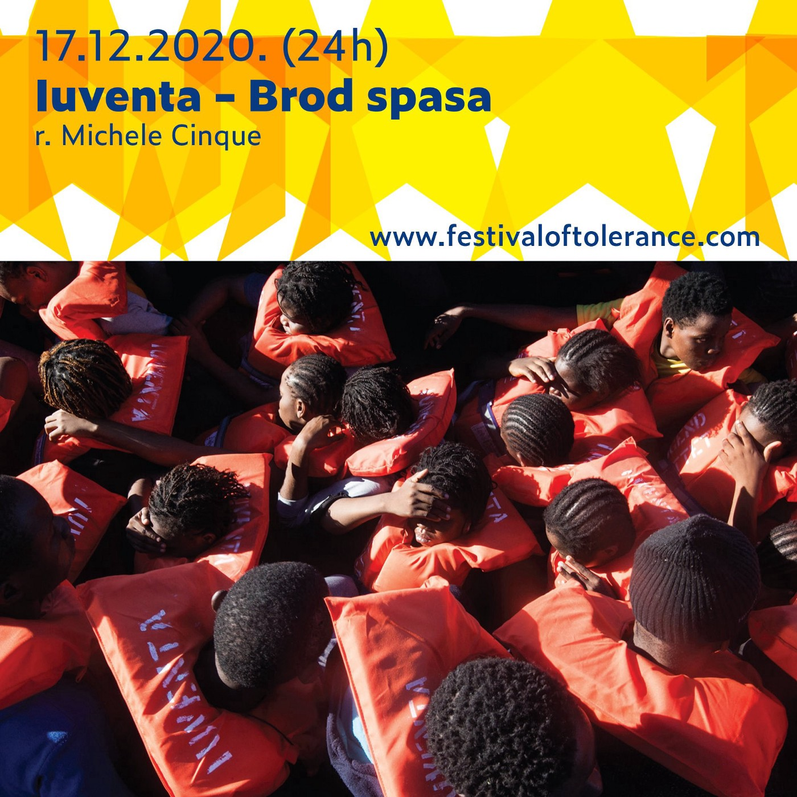
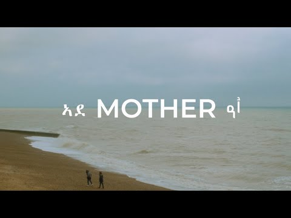

### AYS Daily Digest 17/12/20: “Hungary has failed to fulfill its obligations under EU law”
#### Big report on the effect EU’s approach has had on the mental health of thousands / CJEU: “Hungary has failed to fulfill its obligations under EU law” / Uncertainty over deportations from Sweden to Afghanistan / A fight to \#CloseTheBarracks / Recommended reads, videos and more

](assets/eb014bc284f0/0*LDR_HqN7vyXRz5K3)

Lesvos, camp perspective, photo via: [Art Against](https://www.facebook.com/artagainstproject/?__tn__=-UC*F)
#### FEATURED
### CJEU: “Hungary has failed to fulfill its obligations under EU law”

The Court of Justice of the European Union has issued a [press release](https://curia.europa.eu/jcms/upload/docs/application/pdf/2020-12/cp200161en.pdf?fbclid=IwAR3xTxXWbFCe5fwpuUGH8aMk3pD5Vho9x_IziyU4Bj9D3pW6_OczULco3ys) on its Judgment in the Case Commission v Hungary \(C\-808/18\), confirming what many have been warning about:

> Hungary has failed to fulfil its obligations under EU law in the area of procedures for granting international protection and returning illegally staying third\-country nationals\. 

> In particular, restricting access to the international protection procedure, unlawfully detaining applicants for that protection in transit zones and moving illegally staying third\-country nationals to a border area, without observing the guarantees surrounding a return procedure, constitute infringements of EU law\. 

**_Hungary should now withdraw this anti\-NGO law and conform with the CJEU’s decision,_** OMCT Secretary General said, adding: **_we hope that today’s decision will help put an end to this alarming trend\._**

[Here](http://curia.europa.eu/juris/fiche.jsf;jsessionid=154B6E5CC99BA061CFC135B63C9A1D15?id=C%3B808%3B18%3BRD%3B1%3BP%3B1%3BC2018%2F0808%2FP&oqp&for&mat=or&lgrec=en&jge&td=%3BALL&jur=C%2CT%2CF&num=c-808%252F18&dates&pcs=Oor&lg&pro&nat=or&cit=none%252CC%252CCJ%252CR%252C2008E%252C%252C%252C%252C%252C%252C%252C%252C%252C%252Ctrue%252Cfalse%252Cfalse&language=en&avg&cid=19202108&fbclid=IwAR33oB-8usOijv2vtFpf_JKlP2nNHRJeNl4VjUyyQHfAzILphJA8n-Z0Q24) is the full information on the decision\.

■■■■■■■■■■■■■■ 
> **[EU Court of Justice](https://twitter.com/EUCourtPress) @ Twitter Says:** 

> > #ECJ : #Hungary has failed to fulfil its obligations under #EUlaw in the area of procedures for granting #InternationalProtection and returning illegally staying third-country nationals
[curia.europa.eu/jcms/jcms/Jo2_…](https://curia.europa.eu/jcms/jcms/Jo2_7052/) https://t.co/CcaJL3uvmS 

> **Tweeted at [2020-12-17 08:39:14](https://twitter.com/EUCourtPress/status/1339490322661990402?s=19&fbclid=IwAR2cXqJgpAGH-pHW6a4bjZyM6XmQCL5GNtf0mtHNUc6befPbwPB2q_U7750).** 

■■■■■■■■■■■■■■ 

#### GREECE
### ‘The Cruelty of Containment: The Mental Health Toll of the EU’s ‘Hotspot’ Approach on the Greek Islands’

As we have previously written regarding the many shortcomings of the EU’s asylum and migration policies, mental health has long been one of the most pressing issues, with far\-reaching consequences for asylum seekers\. The newly published report affirms once again that the current system has had a hugely detrimental impact on the mental health of asylum seekers living in the hotspots of Lesvos, Chios and Samos\.

> Based on data spanning two and a half years to October 2020, collected from 904 people supported by the IRC’s mental health programmes and backed up by testimonies and interviews, the report sets out proposals for immediate action to improve the dire conditions people endure\. IRC’s data reveals consistent accounts of severe mental health symptoms, including depression, post\-traumatic stress disorder \(PTSD\) and self\-harm among people of all ages and backgrounds\. It also demonstrates how the onset of the COVID\-19 pandemic further exacerbated the suffering of already vulnerable asylum\-seekers and exposed the many flaws in Europe’s asylum and reception system\. 

> Urgent action is required\. After several years of deadlock, the forthcoming negotiations following the publication of the EU’s Pact on Asylum and Migration are Europe’s last window of opportunity to put in place a fair and sustainable system that works in the interests of both new arrivals and local communities\. The Pact includes some positive steps forward, but there are also elements that risk taking us in the opposite direction\. This year, the relocation of hundreds of unaccompanied children and the transfers of people from the islands to the mainland are proof that political will and coordinated action can transform the lives of people held in the island camps\. As negotiations on the Pact begin, the stories in this report that testify to the ongoing cruelty of containment should give pause for renewed reflection on the need for true solidarity and responsibility\-sharing in Europe\. 

The Cruelty of Containment — The Mental Health Toll of the EU’s ‘Hotspot’ Approach on the Greek Islands:

Also, for those who have missed it:

■■■■■■■■■■■■■■ 
> **[bordermonitoring.eu](https://twitter.com/bm0eu) @ Twitter Says:** 

> > Our new report outlines the system of punishment and incarceration of migrants who are accused of human smuggling at the EU-external border in the Aegean. It bears witness to the fates of people who have been sentenced to life long imprisonment in Greece. [bordermonitoring.eu/wp-content/upl…](https://bordermonitoring.eu/wp-content/uploads/2020/12/report-2020-smuggling-en_web.pdf) https://t.co/5mhBk1PmwL 

> **Tweeted at [2020-12-17 14:45:00](https://twitter.com/bm0eu/status/1339582370748329984?fbclid=IwAR0ZD3BhSW5D4DHP7LK-nDKnW4AxVlGn-9mit8jmCw0ynfyHrOIoIn6XmO0).** 

■■■■■■■■■■■■■■ 

#### SERBIA
### More state pressure on those who chose to be humane, against all odds

The Serbian Interior Ministry has since October turned in 8 decisions stating that activists working to help the people on the move in the Šid area must urgently leave the country, media have [reported](https://www.slobodnaevropa.org/a/proterivanje-aktivista-koji-pomazu-migrantima-u-srbiji/31005493.html?fbclid=IwAR0FGDBClXDKndkXfPAy2stn_diPjyNOR9oWR9Tck4-iUnzRcEsGpSwloKc) \. The documents discovered by the reporters state that the activists in question don’t have the necessary permits and are not complying with the legal obligations of the state\. 
All activists belong to the organisation No Name Kitchen, which helps people on the move across the Balkan route\. No Name was registered in Serbia in 2017 as an NGO for providing elementary help to the most vulnerable people, with food, clothes, medical protection and more\.
These are the people responsible for feeding, clothing and supporting thousands along one of the most dangerous routes people undertake to reach a better and safer life\. In the eyes of those representing the country — that deserves a kick in the behind\.
#### CROATIA
### Be the ‘wheel of change’ action

AYS team is organising a [humanitarian action](https://l.facebook.com/l.php?u=https%3A%2F%2Fwww.instagram.com%2Fp%2FCI6UDcZJBRC%2F%3Figshid%3Dnoz5kcdiaj56%26fbclid%3DIwAR2cXqJgpAGH-pHW6a4bjZyM6XmQCL5GNtf0mtHNUc6befPbwPB2q_U7750&h=AT1rdH-aPs1fR6i4R96wL-MxEu1L17_DckK7mSzdLvxXLtkWed5z8U9dYVI09lCMNsZuURPPTj3LHjzPwRj9N2Ujv5XBxz4Rd6RVbwQjx8Dqz5P7f6Ame_2Ika2E6_5IM0Y) for the people in need whom our volunteers support daily\. You too can take part\! Let us know if you want to pitch in\!
### Hiding behind a weak system

Here are just a few updates on the current situation asylees experience in Croatia\. 
For those who have had the “luck” to be able to exercise their right to seek asylum in Croatia, and who have arrived to the end of this complicated and still too long process, receiving asylum was not the end of the road\. One of the problems that asylees face is health protection\. Doctors and medical staff in the health system aren’t informed of the rights of the people under international protection, so even the most basic tasks become incredibly complicated in order for people to exercise their right to health protection\. Most people still struggle with opening bank accounts\. Together with other organisations involved in assisting people under international protection, as Coordination for Integration, we have written to the Ombudswoman on the issue and we still await her response, reaction, and action\. 
People have great difficulty finding jobs, especially since the closure of cafes and restaurants due to the anti\-Covid19 measures brought by the Government, which are now prolonged at least until January 10\. AYS has a team helping people prepare for finding work, contacting employers and negotiating terms and conditions\. We are open to advice and welcome more people to join our volunteer teams in all areas of work\.
### Tune in\!

AYS representatives will take part in the discussion around the issue of the “protection of European values” following a screening of a film about the Iuventa SAR team\. The discussion will be available online today, **Friday December 18, at 6pm CET** on [https://festivaloftolerance\.com/film\-i\-diskusija](https://festivaloftolerance.com/film-i-diskusija?fbclid=IwAR3lsY7OFW7Qu_IjTlQgnG3tu795UX2KJuhyF7Wvb7hJ_-VrPUFlJ2_Hu30)

#### THE NETHERLANDS
### Reacting to deportations

The Immigration Detention Hotline released [a statement](https://meldpuntvreemdelingendetentie.nl/wp-content/uploads/Dreende-groepsuitekenen-naar-Nigeria-aanzijn-vrijdag-18-december.pdf) today about imminent group deportation to Nigeria, AAGU reported\.

> What becomes clear to us from the information we get through them and other sources is that it is a charter flight, operated by the airline Privilege Style\. It is a group that includes two families with a total of three young children\. 

The group stated they and others would inquire about the planned deportations, and they invite everyone to demonstrate their awareness of the problem and their solidarity with people affected\. 
Defense For Children has also [raised the alarm](http://defenceforchildren.nl/actueel/nieuws/migratie/2020/zorgelijk-morgen-uitzett-van-kinderen-naar-nigeria-per-overheidsvlucht/) about this deportation charter flight\.
#### FRANCE
### Fight for interim suspension on family reunification and reunification visas

9 associations, members of the French Coordination for the Right of Asylum, trade unions, and foreign persons concerned, referred to the Court of Appeals of the Council of State for interim suspension in order to end the freeze on family reunification and reunification visas\.

Hundreds of families have been deprived of the right to be reunited with their relatives residing in France since March, even though they have been authorized to do so after a lengthy investigation of their case in the context of family reunification\. Living in countries classified by France as “active areas of circulation of the coronavirus”, the members of these families face the wall of embassies and consulates that refuse to register and process their visa applications, or even to issue them\. 
More details on this are available via [La Cimade](https://www.lacimade.org/presse/gel-des-visas-de-regroupement-familial-et-de-reunification-familiale-des-refugies-des-associations-et-des-personnes-concernees-saisissent-le-conseil-detat/?fbclid=IwAR2lq8TuMMHCAp7slM0P9hKFxyTJL2A0hQgNb2Cue7Z8bV2f3S-VJPBxsFQ) \.
#### SPAIN
### The largest Route in 2020

According to the latest statistics published by the Spanish state, so far this year 39,474 people have arrived in the country, which is 8,799 more than in the same period last year\. This is an increase of 28\.7 % due to the spike in arrivals to the Canary Islands experienced in the last months of the year, mid\-November in particular\.

702 boats with 21,452 people on board have arrived on the Spanish islands so far in 2020\.

In contrast to the Canary route, the arrivals by sea to the Peninsula and the Balearic Islands continue to decline, according to the Ministry of the Interior\.

In the meantime, the Spanish Ombudsman expressed he is firmly against the so called macrocamps to house people, such as the one of Barranco Seco de Gran Canaria, and more in favor of the “dynamic” solutions to the migratory phenomenon that affects the Canary Islands, it was reported\.
#### AUSTRIA
### “Wir haben Platz\!”

With a “sea of ​​lights” in front of the Foreign Ministry, a demonstration was held on Thursday in Vienna for the people in need of urgent housing, stuck in horrid camps in Greece\.

](assets/eb014bc284f0/0*4GF6DRktZTmUK6KM)

Photo: dr\. [Karin Tschare\-Fehr](https://www.facebook.com/karin.tscharefehr?__tn__=-UC*F)

Amnesty International has also joined the appeal of several aid organizations, researchers and opposition politicians to take in refugees from the Greek islands\.

> European politics must reflect on its foundation, human rights, and promote international solutions that are in conformity with human rights\. 

This includes the immediate evacuation of inhumane camps like Kara Tepe\.
#### GERMANY
### Concrete demands to help thousands we’ve stopped at the EU’s doorstep

243 members of parliament from various parliamentary groups [called on the federal government](https://www.tagesschau.de/inland/appell-aufnahme-fluechtlinge-101.html?fbclid=IwAR0JOXB4_1wvVEYqa-yJHjrJEusD7g_GlQf2T_ZCNBLnzPKK4axU7BrqdE4) to accept more refugees from the Greek islands\. Specifically, they formulate three requirements:
1. work harder on the EU level for a European solution that complies with human and European law standards
2. initiate and promote a constructive path for the future admission of refugees together with the federal states and municipalities that are willing to accept them — even beyond the quota already promised
3. accelerate the increased admission of refugees in Germany and work towards other EU member states to ensure that they voluntarily accept refugees

Out of the 1553 people Germany promised to take in after the fire of Moria, only 291 people have arrived thus far\.
#### UK

As has been widely reported lately, Napier barracks in Kent and Penally barracks in Pembrokeshire, which hold more than 600 people, were handed over to the Home Office in September to be used as accommodation for asylum seekers\.

Now, more than 60 organisations, led by the Association of Visitors to Immigration Detainees, highlight parallels between the barracks and the UK’s system of indefinite immigration detention, calling instead for community\-based alternatives\.

■■■■■■■■■■■■■■ 
> **[Refugee Action 🧡](https://twitter.com/RefugeeAction) @ Twitter Says:** 

> > We can't stay silent when people seeking asylum are left to languish in overcrowded, dirty accommodation that is nowhere near Covid-secure.  

It's an example of the structural racism that has led to people of colour disproportionately dying from Covid-19 
[politics.co.uk/comment-analys…](https://www.politics.co.uk/comment-analysis/2020/12/02/systemic-racism-in-the-asylum-housing-system) 

> **Tweeted at [2020-12-17 09:18:52](https://twitter.com/RefugeeAction/status/1339500297513824258?s=20).** 

■■■■■■■■■■■■■■ 

“People seeking safety in the UK are being dumped in disused army barracks\. **It is detention in all but name and is putting lives at risk\.** 
Left to live in overcrowded rooms with just a dirty bedsheet to separate bunks, this accommodation is nowhere near Covid\-secure\.
People fleeing unimaginable trauma are now housed in places that can lead them to relive memories of war and torture, without proper medical and psychological support\. Suicide attempts have been made\.
If this wasn’t enough, the barracks have become targets for the far\-right\. In response, residents are being punished with curbs on _their_ freedom\.”

> **This must change\. Help us fight to \#CloseTheBarracks\.** 
 

> **Email your MP today\!** 

#### FOR FURTHER READING
- MSF’s mental health teams in Lesbos and Samos have continued to observe concerning levels of mental health distress among their patients:

- \[GERMAN\] On the topic of deportation we wrote more extensively about in yesterday’s digest, here are the details on the resumed deportations\. Since December 2016 **Germany has deported 937 people to Afghanistan** :

- more on the situation in Bosnia and Herzegovina:

- \[FILM \] _This is the story of Mez and Bego, who both made the dangerous journey across the world as unaccompanied child refugees, in order to find safety in the UK\. After risking their lives crossing the Sahara, the Mediterranean Sea and the English Channel, they found themselves part of the same family in Kent\. Despite their different upbringings, languages, religions and nationalities, they became brothers\._

**Find daily updates and special reports on our [Medium page](https://medium.com/are-you-syrious) \.**

**If you wish to contribute, either by writing a report or a story, or by joining the info gathering team, please let us know\.**

**We strive to echo correct news from the ground through collaboration and fairness\. Every effort has been made to credit organisations and individuals with regard to the supply of information, video, and photo material \(in cases where the source wanted to be accredited\) \. Please notify us regarding corrections\.**

**If there’s anything you want to share or comment, contact us through Facebook, Twitter or write to: areyousyrious@gmail\.com**

_Converted [Medium Post](https://medium.com/are-you-syrious/ays-daily-digest-17-12-20-hungary-has-failed-to-fulfill-its-obligations-under-eu-law-eb014bc284f0) by [ZMediumToMarkdown](https://github.com/ZhgChgLi/ZMediumToMarkdown)._
