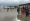
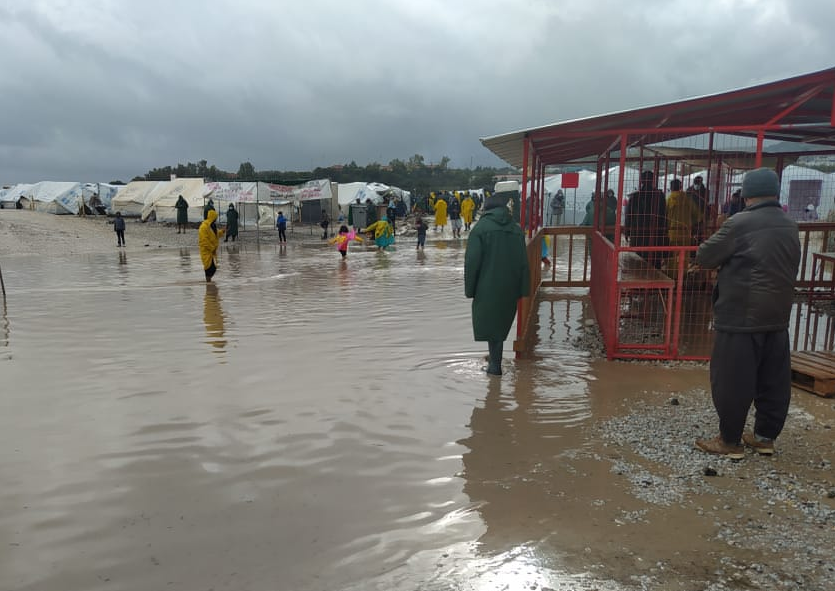
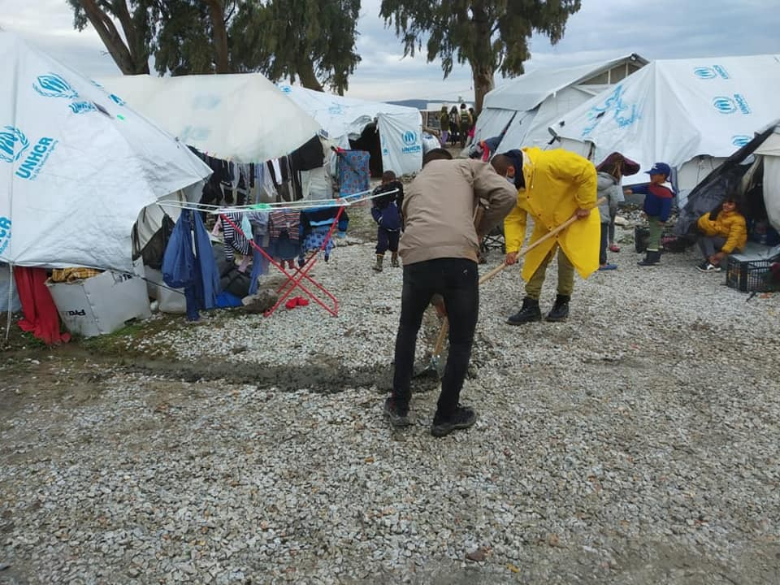
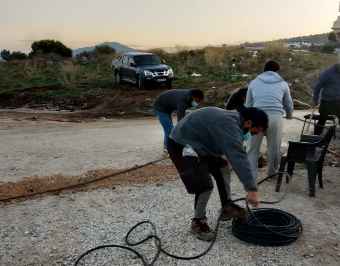
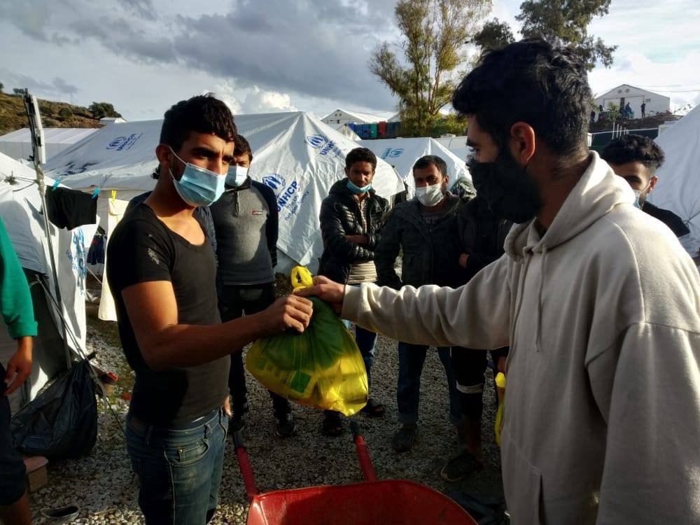
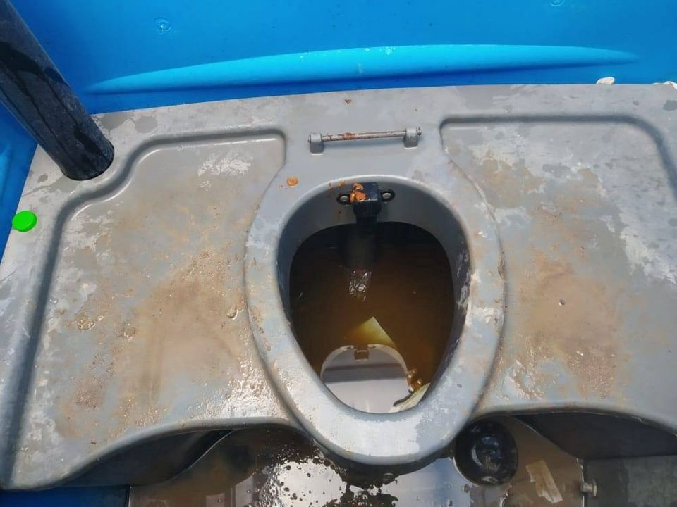
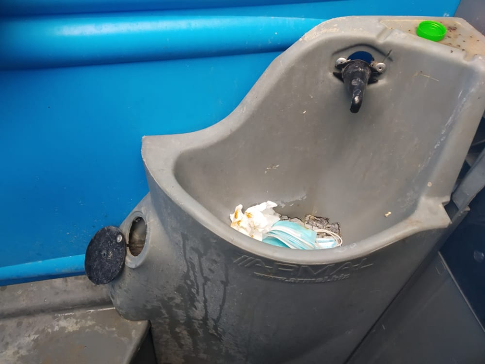

### Weekend Digest 19–20/12/20: The situation in Moria \#2 — Mitarakis and the reality paradox

Abandoned clinic squatted in Brussels // Protests throughout Europe // 4 children dead off Libya // Golden Dawn MEP to ask for political asylum…

\(Photo Credit: [Baobab Experience](https://twitter.com/BaobabExp/status/1340682227269689345?fbclid=IwAR1rVRAw3w79H-kpj4pfx8WsdX6iqrKbSn2rXtDIafELZ3NJg8rnxrJiKFA) \)
### FEATURE: The situation in Moria \#2 — Mitarakis and the reality paradox

Once again we see an astounding gap in reality as portrayed by asylum and migration minister Notis Mitarakis in the [Greek media](https://stonisi.gr/post/13746/aytopsia-toy-n-ston-proswrino-kataylismo-ston-kara-tepe-pics-video?fbclid=IwAR0G8JE3Ijmx8qb716ht0BwUP35iQK351x8fEsRHID-b13yJJZ9335L6cOQ) and reality as actually documented on the ground, commonly just known as REALITY\.

He states that the problems faced in the camp are usual in the first few weeks of opening — it has been open for 3 months\.

He states that the flooding is a result of overspill from nearby flooded fields and that flood defences have been put in place — yet this picture is from 8 days ago\.

\(Photo Credit: [Moria Corona Awareness Team](https://web.facebook.com/MoriaCoronaAwarenessTeam/) \)

And here is a picture of the Moria White Helmets digging the ditches\.

\(Photo Credit: [Moria White Helmets](https://web.facebook.com/MoriaWhiteHelmets/photos/pcb.225384702437930/225384552437945) \)

He says that through a new contract with DEI there will be electricity throughout the camp — yet when the police recently wanted electricity in their porta cabin they asked the Moria White Helmets to connect it\.

\(Photo Credit: [Moria White Helmets](https://web.facebook.com/MoriaWhiteHelmets/) \)

He wanted to be congratulated on having 36 hot showers installed — there are over 7000 people living there, roughly one shower for every 200 people\.

He states that there are 9 canteens, 15 more have been given permission and safe cooking areas have been created, all of which suggests people have enough food — yet here is a picture of food distribution carried out by the Moria White Helmets and Stand By Me Lesvos this month\.

\(Photo Credit: [Moria White Helmets](https://web.facebook.com/MoriaWhiteHelmets/photos/pcb.223323982644002/223323609310706/) , 11\.12\.20\)

He stated that heaters will be installed soon — it is less than a week from Christmas when most trade workers will be on holiday until the new year, and it is already winter…

He states that there is a very good security situation — on December 14 [a three year old was found in a very serious condition](https://stonisi.gr/post/13639/sth-zoygkla-toy-kara-tepe-realtime?fbclid=IwAR1GxvnjtRF2rqZaU11rBQ4LycZcR8TNoYqx70Ag9KLs9eU0tE1nXIqMo5M) having potentially survived a sexual assault\.

These lies are dangerous, they put people’s lives at risk, they must stop\.

GREECE
### Outrage over NGO article

The [Moria Corona Awareness Team](https://web.facebook.com/MoriaCoronaAwarenessTeam/?__cft__[0]=AZXJbKjqh4CkcJ68jZvbdHO7Ftpg99_bp4LmnqxF6WD_so5-ajHTFa0c0C67q3m0x7BhR9yiT3b2K96i3iZihL_WXjBRFVr6fgkCf2TpljSGbPavakUdO9nDv7dqPHnLMfCoCRcDxsUf_SpoY-4gCgse&__tn__=-UC%2CP-R) have drawn attention to the continued lack of understanding shown by some NGOs in the camp\. In a [recent article](https://www.parool.nl/ps/steffi-de-pous-vond-haar-roeping-op-lesbos-ik-wilde-altijd-helper-worden~ba54357b/?fbclid=IwAR08KQvBnIO-apmpT4Q4cXOfblchdlWzyMOkM8MX8q3ozHvSEJwZEzcX5pg&utm_source=link&utm_medium=app&utm_campaign=shared%20content&utm_content=free&referrer=https%3A%2F%2Fl.facebook.com%2F) by Because We Carry it was suggested that Afghan people don’t know how to use the toilets which have been installed in the camp\. These pictures explain why nobody would want to go anywhere near them\.

\(Photo Credit: [Moria Corona Awareness Team](https://web.facebook.com/MoriaCoronaAwarenessTeam/posts/215716153390896?_rdc=1&_rdr) \)
### Pushback from Chios

[Alarm phone report](https://twitter.com/alarm_phone/status/1340313828207308800) on a pushback from Chios on Friday December 18\.

> _Yesterday we were alerted by a group of 33 people who arrived on Chios, near the village of Nenita\. Also [@UNHCR](https://twitter.com/unhcr) was informed about the arrival\. However, yesterday night we learned that the people have been pushed back to Turkey\._ 

### Golden Dawn member seeking POLITICAL ASYLUM

[Ioannis Lagos](https://www.europarl.europa.eu/meps/en/197737/IOANNIS_LAGOS/home) MEP, a founding member of Golden Dawn, is still taking part in European Parliamentary sessions and living in Brussels\. In October he was [sentenced to 13 years](https://www.nytimes.com/2020/10/14/world/europe/greece-golden-dawn-sentencing.html) in prison when neo\-nazi Golden Dawn was ruled as an [criminal organisation](https://www.politico.eu/article/greece-neo-nazi-golden-dawn-leaders-guilty-of-running-criminal-gang/) \. Individual charges within the trial included murder, attempted murder and grievous bodily harm\.

While he appeals the courts decision he has stated that [an EU member state is thinking of giving him political asylum](https://www.nytimes.com/2020/12/19/world/europe/Greece-Golden-Dawn-Lagos.html?smid=tw-nytimes&smtyp=cur&fbclid=IwAR2sOSYcCal-CC6v_ph-WOCArBliiJIpDumQ_MGXUgAt0kvcgxas6dAmZpE) \. Greece is currently requesting his extradition, but he still has parliamentary immunity\.

ITALY
### 4 children lose their lives in shipwreck

[Italian media report](https://www.ansa.it/sito/notizie/cronaca/2020/12/18/migranti-naufragio-in-libia-recuperati-i-corpi-di-4-bambini_a7cf79ed-faba-4b6e-8f34-c28bde371914.html?fbclid=IwAR0Zix_M0-xFWBjcFXHXn6x_V7RSKR8HQO15Ht9IG66ljIW-RoE0xKE9lak) that the bodies of a five\-year\-old girl and three children between the age of seven and ten have been recovered on Wednesday last week by the Libyan Red Crescent\. The shipwrecked boat was carrying a total of 30 people and got into difficulty off the Libyan coast\. [According to the Libya Observer](https://www.libyaobserver.ly/news/bodies-4-children-recovered-after-boat-capsized-libyan-coast) the children were Egyptian and their bodies were found at Harsha and Matrad near the city of Al\-Zawiya\.

The families live in Sabratha, western Libya, and have been informed\. The children have been taken to the mortuary of Al Rahma Hospital in Zawiya for identification and burial\.

Our thoughts are with their families and we call once again for an end to the EU polices which lead to these deaths\.

GERMANY
### Activists display list of dead at Europe’s borders

\(In [\#Münster](https://twitter.com/hashtag/M%C3%BCnster?src=hashtag_click) the list of refugees killed is currently on the EU’s external border\. THERE ARE MANY TOO MANY\! \)

BELGIUM
### Citizens requisition public building in Brussels for housing

On Friday December 18, around 18 collectives and associations who work with the right to housing and undocumented people, occupied the old Antoine Depage clinic, [L’hospitalière](https://web.facebook.com/Lhospitali%C3%A8re-103793421624837/?__cft__[0]=AZW4zo6iwqPmKnz1UG36rvFOveAQocc2OTBD5GowzAEZjYw5JEh_HQb9q9UjpJL-7BD3B-c7gNAg02GXrd7lQyJpGGvZWBMo9QEFWMbVAclYS7OFbSOd3KbpDh4dZJHbRFPEPQn28fDr_bMaO7OCcFOm&__tn__=-UC%2CP-R) , on Avenue Henri Jaspar in Brussels\.

The activists are local inhabitants of Saint\-Gilles and Brussels\. They state that this habitable building has been left empty for over a year:

> _…has not been licensed for urban planning and has recently been put on public sale, while the housing crisis has never been so urgent\. This solidarity requisition action aims to offer a roof to homeless people, as well as to claim the right to housing and regularization for all\._ 

> _The tens of thousands of undocumented people living in Belgium, already precarious by the absence of rights and status, are also completely denied by public policy in the midst of global pandemic\. On December 18th, International Migrant Day , it’s about showing strong support for the fight for regularization of undocumented people \[…\] \. — [Myriem Amrani Catherine Morenville](https://web.facebook.com/Lhospitali%C3%A8re-103793421624837/?_rdc=1&_rdr)_ 

According to the activists, there are nearly 6\.5 million square metres of empty buildings in the Brussels region and thousands of unoccupied houses which are not being put to use, while at the same time new housing units being built will be mostly unaffordable\.

> _Faced with the inability of public authorities to respond to the social and health crisis, we have decided to act\. We would like to receive the support of these same public authorities \(communal and regional\) with a view to signing an Occupancy Agreement with the owner, the_ 

> _PAPERS and HOUSING for everyone\!_ 

**Actions across Europe**

Other actions that took place during the week of World Migration Day include protests against the Dublin Treaty and it’s proposed reforms by the European Court of Justice in Puerta del Sol Square in Madrid\. Migrant workers in Bologna protesting against Yoox \(a fashion company\) to report fixed working hours that prevent them from caring for their children and bosses taking advantage of the fact that they are immigrants\.

> _Yoox workers protested with logistical workers who were on strike across Italy demanding better contracts and security for the duration of the covid\-19 pandemic but also to break the link between residence permit and work\._ 

In France, people on the move took to the squares of many cities to ask for unconditional residence permits for all\.

> _To succeed in building a strong transnational immigrant movement we must coordinate our struggles everywhere\. That is why we are jointly demanding an unconditional European residence permit that can provoke and overthrow the current European system based on racism, exploitation, patriarchal violence\._ 

> _Our strength is the transnational struggles\!_ 

> [**_Transnational Migrants Coordination_**](https://athens.indymedia.org/post/1609281/) 

WORTH READING

[**Undocumented for years, whilst trying to claim asylum**](https://the-crisis-isnt-over.medium.com/undocumented-for-years-whilst-trying-to-claim-asylum-782d69755707) — “ _The fact that people seeking protection in Greece [struggle to claim asylum](https://the-crisis-isnt-over.medium.com/the-complicated-quest-to-claim-asylum-1fb830d4e411) due to systemic deficiencies in the asylum system is well\-documented and has been known for many years\. The situation is currently worse than ever\.”_

[**Tele\-education: Refugee children are disciples of a lower God**](https://www.news247.gr/paideia/tilekpaideysi-ta-prosfygopoyla-einai-mathites-enos-katoteroy-theoy.9085165.html?fbclid=IwAR11-15hjzEpFeSa1X6kFd4hP3-_yqHY7YW6VP0CWvQ38dj2eC2w5z2lhCw) _— “Nine months since tele\-education was first applied universally in Greek schools, refugee children remain out of the process\. The responsibilities of the Ministry of Education are enormous\.”_ \(In Greek\)

[**Unlocatable Violence: Reconstructing lost spatial and temporal relationships**](https://voelkerrechtsblog.org/articles/unlocatable-violence/?fbclid=IwAR2jkypzJMJO-Ff38hvRc2akRw2sVIP79LzXmZUcPfZkJ6Rap1bSEFmnTNM) **— “** _Enforced disappearance is not simply the act of violence of its constituent parts: of detention, torture, inhumane treatment, murder\. Enforced disappearance operates on a different political register: it not only neutralises the disappeared as political subjects because they are taken away, it also confuses the locus of action and obfuscates the political scene by injecting uncertainty\.”_

[**Media and migration: escaping the narratives that naturalize racism**](https://www.elsaltodiario.com/migracion/medios-migracion-escapar-narrativas-naturalizan-racismo-?fbclid=IwAR295bxnZO09ET9wKiBiJkq4GwKLL0GiVSIIrFufBP9SMlhhgodg8sUAStU) **— “** _Activists review how the media approaches migration\. They claim new glances away from a sensationalism that violates dignity and naturalizes death at the border, and they are committed to putting the processes, agency, and resilience of the people they migrate at the center\.”_ \(In Spanish\)

**Find daily updates and special reports on our [Medium page](https://medium.com/are-you-syrious) \.**

**If you wish to contribute, either by writing a report or a story, or by joining the info gathering team, please let us know\.**

**We strive to echo correct news from the ground through collaboration and fairness\. Every effort has been made to credit organisations and individuals with regard to the supply of information, video, and photo material \(in cases where the source wanted to be accredited\) \. Please notify us regarding corrections\.**

**If there’s anything you want to share or comment, contact us through Facebook, Twitter or write to: areyousyrious@gmail\.comD**

_Converted [Medium Post](https://medium.com/are-you-syrious/weekend-digest-19-20-12-20-the-situation-in-moria-2-mitarakis-and-the-reality-paradox-bbabb139e3cb) by [ZMediumToMarkdown](https://github.com/ZhgChgLi/ZMediumToMarkdown)._
