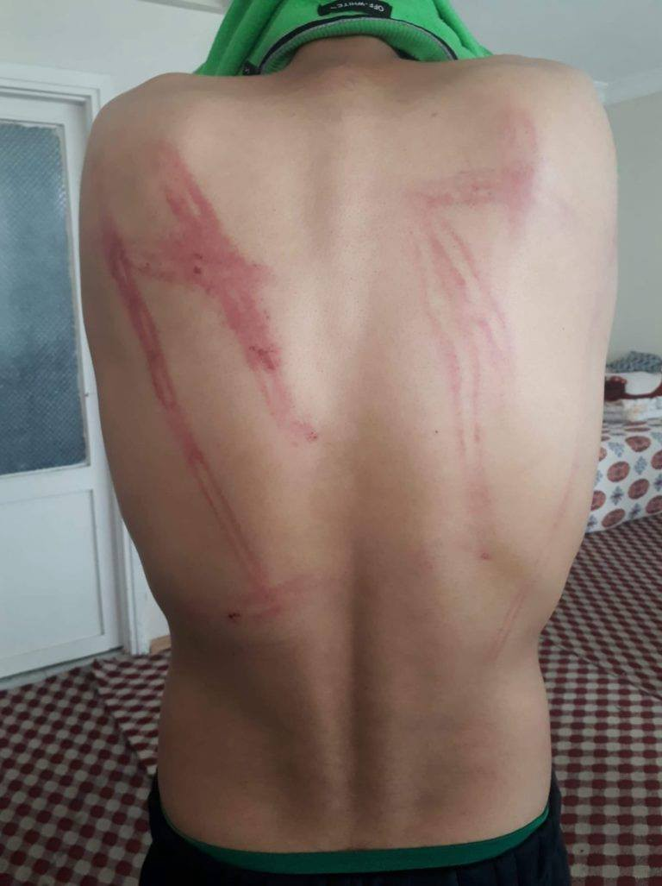
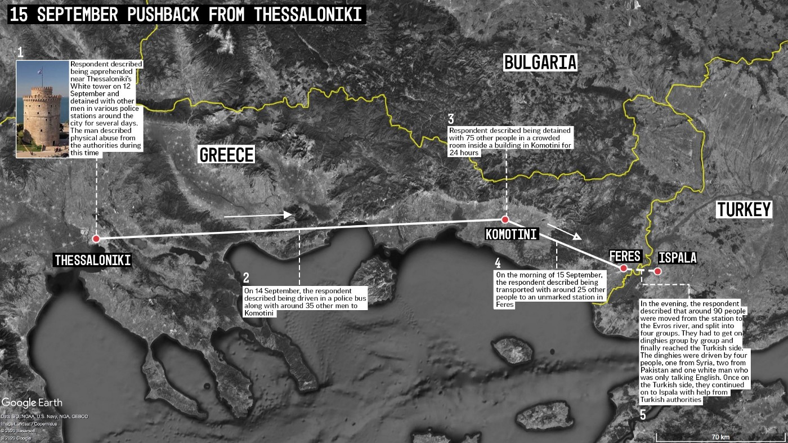

### **AYS Special from Greece: The Evros Border \- A shocking year of systematised violations**

_This year has seen a marked deterioration in the situation at the Evros land/river border between Greece and Turkey\. The area has become a blackzone for accessing human rights, and the commonalities in violations indicate an intentional systematic phenomenon, as opposed to the ‘emergency reaction’ the governments and media within the European Union \(EU\) would like to suggest\._

 , Evros, March 2020\)](assets/6c3fec975cf3/1*jC5-JvE3quOhV6Py8rM-2w.jpeg)

\(Photo Credit: [Belal Khaled](https://twitter.com/BelalKhaled/status/1238769760999026688/photo/4) , Evros, March 2020\)

Greece has for some time been a key point of entry into the EU and, following the amplification of movement flows in 2015, was labelled a site of [“humanitarian crisis”](https://www.europarl.europa.eu/RegData/docs_autres_institutions/commission_europeenne/com/2017/0131/COM_COM%282017%290131_EN.pdf) \. The language of ‘emergency’ and crisis’ has instilled fear and, with this rhetoric, people on the move \(POM\) have been constructed as threats to the safety of the general population\. The fight to fortify the external borders of the Union has been increasingly militarised in response, and it has ultimately had a human cost for those seeking safety\.

> In 2020 the [Border Violence Monitoring Network](https://www.borderviolence.eu/) \(BVMN\) alone documented the violent expulsions of over 3000 individuals from Greece, and this is only a glimpse into a much broader picture with far more damning statistics\. 

Actors on the ground have increasingly reported an acceleration of repression against POM, a phenomenon ramped up by the July 2019 election of the right wing New Democracy party and Prime Minister Mitsotakis\. In October of that year, Greece promulgated the International Protection Act \(IPA — L\. 4636/2019\) transposing key EU directives into national legislation alongside other provisions for more effective migration management\. The IPA came into effect in January of this year and saw a reduction on rights to minimum standards in the Common European Asylum System \(CEAS\) \. It also means that individuals caught crossing the border ‘illegally’ will also be subjected to accelerated procedures and possible detention\.

> The duration of detention was increased to 18 months, with the possibility for extension of an additional 18 months for the purpose of removal, and increased mandates were given to border guards and military personnel, **with no training in guaranteeing respect for fundamental rights** \. 

The bill resulted in an outcry from humanitarian and civil society organisations with statements from [Refugee Support Aegean](https://rsaegean.org/en/comments-on-the-reform-of-the-international-protection-act-2/) \(RSA\), the [Greek Council for Refugees](https://www.gcr.gr/en/news/press-releases-announcements/item/1434-gcr-s-comments-on-the-draft-law-amending-asylum-legislation) \(GCR\) and [Amnesty International](https://www.amnesty.org/en/latest/news/2020/05/greece-systematic-detention-of-asylum-seekers-and-migrants-would-be-gravely-irresponsible/#:~:text=Amnesty%20International%20published%20a%20detailed,18%20months%20for%20removal%20purposes.) \. The statements argue that the bill is in violation of European, international and Greek law and violates the fundamental principle of _non\-refoulement_ , representing a worrying unilateral move towards the increase of returns\.

> The possibility to ask for asylum, an enshrined human right, has been diminished and what has been left in its place is a brutal border regime that has manifested itself in the increasing frequency and brutality of pushbacks at the Evros border\. 

This shift in border management was most clearly articulated at the end of February 2020 when Erdogan [“opened the doors”](https://www.nytimes.com/2020/02/29/world/europe/turkey-migrants-eu.html) to Europe and sent buses with thousands of POM to the Evros border\. In dramatic scenes depicted on international media, transit groups were kept in no man’s land, held back with tear gas and rubber bullets\. An informal camp sprang up where POM stayed in squalid conditions, with limited food and water, and were subject to daily acts of brutality by the Greek police\.

 , Evros Border, 2020\)](assets/6c3fec975cf3/1*GqRAXgrbfFVEMml6rXF1Sw.jpeg)

\(Photo Credit: [Belal Khaled](https://twitter.com/BelalKhaled) , Evros Border, 2020\)

As violence escalated, reports emerged of the use of live bullets and at least two individuals, Muhammad Gulzar and Muhammad Al\-Arab, were killed\. Instead of investigating the allegations and further examining the available evidence, the Greek authorities dismissed numerous publications by local and international media as [“fake news”](https://gr.euronews.com/2020/05/08/petsas-kanena-neo-stoixeio-thanato-ellinika-pyra-ebro) \. On top of this violent repression, the Greek government dealt a swift blow to POM when they announced the temporary suspension of the lodging of asylum claims, coupled with immediate deportation, without registration, to the country of origin or transit\. This move violates the principle of _non\-refoulement_ and is not permitted under international or European law\. Yet in spite of this, [the Commission expressed solidarity](https://respondmigration.com/blog-1/what-is-frontex-doing-about-illegal-pushbacks-in-evros) with the Greek government and pledged financial and personnel support through increasing deployment of Frontex troops in the area\.

> Rather than confront the illegality of Greece’s actions and initiate infringement procedures for the suspension of fundamental rights, the EU valued the protection of its external borders over the consequences such suspensions might have for those seeking safety in Europe\. 

This was only the start of what was to become a shocking year of coordinated and systematised violations against POM in Greece\. As COVID\-19 restrictions began in mid\-March, Greek authorities embarked on further and more expansive pushbacks from sites deep within the mainland, going far beyond common border security practices which target people in transit close to border areas\. The closure of the Greek Asylum Service [was extended](https://asylo.gov.gr/en/wp-content/uploads/2020/04/English-Announcement-April-10_MK.pdf) leaving more and more people entirely undocumented in cities such as Thessaloniki and Athens\.

\(Photo Credit: BVMN, Diavata Camp, March 2020\)

After the lockdown to stop the spread of COVID\-19 formally began at the end of March, reporters on the ground received testimonies indicating that [194 individuals had been removed and pushed back](https://www.borderviolence.eu/wp-content/uploads/Press-Release_Greek-Pushbacks.pdf) from the state\-run facilities of Diavata refugee camp and Drama Paranesti Pre\-Removal Detention Centre \(PRDF\) in a six week period\. In a [video](https://www.facebook.com/watch/?v=852760591911174) first published by Are You Syrious \(AYS\), police can be seen removing people from the camp in a white van\. Use of this tactic intensified later on in June, when [Greek police officers targeted a well\-known food distribution site](https://www.borderviolence.eu/police-raid-humanitarian-distribution-site-and-pushback-people-in-need/) where homeless POM access essential supplies and medical care\. Despite assurance from the police that the arrest of around 40 undocumented individuals was for the purpose of issuing them with police notes to regularise their stay, at least one of the beneficiaries contacted a member of the team on the ground the following day to confirm that he had, in fact, been pushed back to Turkey\.

\(Image Credit: BVMN\)

Though the practice of pushbacks has become an increasingly formalised and prevalent facet of Greece’s asylum regimes, these events demonstrate how the state used COVID\-19 measures as an opportunity to extend and intensify existing patterns of repression\. The weaponisation of the lockdown period during the pandemic became the last in a long list of measures deployed in 2020 to crack down on POM in the country\.

 — _“This is what they did to us\. Do we have the right to asylum or not? Does the international law not say that every human being has the right to ask for asylum? What kind of right is this? Does the European Union have the right of beating and torture? How can the commandos beat us like this\! And then put you in the river while your hands are tied\! This is our situation as refugees\. They beat every part of your body with a stick\. They take you to a room and then beat everyone\. They have neither mercy nor compassion towards women nor men\. They are taking your money, phones and then put you in river while you hands are cuffed\.”\)_](assets/6c3fec975cf3/1*ThkO6JbNVeBPaFsGhPWZ0g.jpeg)

\(Photo Credit: [BVMN, June 2020](https://www.borderviolence.eu/violence-reports/june-21-2020-2100-ipsala-edirne-turkey/?fbclid=IwAR1D3hAtNPtHmVeuRfUSZK2dvmfusMLoKOD7iXGzNdrw6e37aoumAplW9Xw) — _“This is what they did to us\. Do we have the right to asylum or not? Does the international law not say that every human being has the right to ask for asylum? What kind of right is this? Does the European Union have the right of beating and torture? How can the commandos beat us like this\! And then put you in the river while your hands are tied\! This is our situation as refugees\. They beat every part of your body with a stick\. They take you to a room and then beat everyone\. They have neither mercy nor compassion towards women nor men\. They are taking your money, phones and then put you in river while you hands are cuffed\.”\)_

Towards the end of the year, a new trend was identified in pushbacks across the Evros river; one that might be read as a last\-ditch attempt to absolve the authorities of blame\.

> In multiple testimonies respondents have stated that [third country nationals of unknown status were working with Greek and other European officers as drivers of dinghy boats](https://www.borderviolence.eu/wp-content/uploads/Working-Doc-August-Report-BVMN-2.pdf) , which are used to forcefully transport POM across the river to Turkey\. 

Previously, Greek officers were operating the dinghies but now reports describe individuals of [Pakistani, Afghan](https://www.borderviolence.eu/violence-reports/may-7-2020-1300-evros-river-greece-near-uzunkopru-turkey/) , [Syrian](https://www.borderviolence.eu/violence-reports/july-22-2020-0000-thessaloniki-greece/) or Iraqi origin undertaking the task\. Besides the fact that these individuals are taking orders from Greek and other European officers during the pushbacks, the nature of their relationship with officials is unknown\. Perhaps these individuals are coerced into the collaboration, offered payment, or are working under unreliable promises such as the legalisation of residence\. The context of pushbacks and the use of vulnerable groups suggests a new trend of exploitation with the possible intent of outsourcing blame for the illegal procedure\.

In the final two months of 2020, BVMN members alone documented the pushbacks of 400 individuals from Greece to Turkey across seven separate incidents\. In one of these [70 individuals, including children and a pregnant woman, were stranded on an island in the Evros river](https://www.facebook.com/watch/?v=1085320938589410) for approximately four days without food, water, or any kind of assistance\. In another, respondents report sustaining blows to the head from rifles so hard:

> _“I [t was like they meant to kill us](https://www.borderviolence.eu/violence-reports/november-14-2020-0000-dilofos-kapikule/) \.”_ 

In a third, the transit group were forced to undress and were then beaten, leading the respondent to state:

> [_“I want them to treat us like we are human_](https://www.borderviolence.eu/violence-reports/november-28-2020-2000-pythion-kurttepe/) _\.”_ 

This is just a small glimpse into the everyday occurrences at the Evros border where groups are held in squalid, overcrowded, incommunicado detention sites in the highly militarised border area, violently beaten and tortured by masked officers, forced to undress and forcibly pushed back over the dangerous Evros border river\. In 2020 reporters in the region have continued to accumulate evidence, and continued to be met with point\-blank denial by Greek authorities, or entirely ignored by the European Commission\.

> It begs the question, is the “humanitarian crisis” at hand really the movement of vulnerable individuals in order to seek safety, or the brutal and systematic human rights deprivations perpetrated by the officials tasked with protecting them? 

**_Article by Hope Barker, Policy Analyst for the Border Violence Monitoring Network_**

**Find daily updates and special reports on our [Medium page](https://medium.com/are-you-syrious) \.**

**If you wish to contribute, either by writing a report or a story, or by joining the info gathering team, please let us know\.**

**We strive to echo correct news from the ground through collaboration and fairness\. Every effort has been made to credit organisations and individuals with regard to the supply of information, video, and photo material \(in cases where the source wanted to be accredited\) \. Please notify us regarding corrections\.**

**If there’s anything you want to share or comment, contact us through Facebook, Twitter or write to: areyousyrious@gmail\.com**

_Converted [Medium Post](https://medium.com/are-you-syrious/ays-special-from-greece-the-evros-border-a-shocking-year-of-systematised-violations-6c3fec975cf3) by [ZMediumToMarkdown](https://github.com/ZhgChgLi/ZMediumToMarkdown)._
