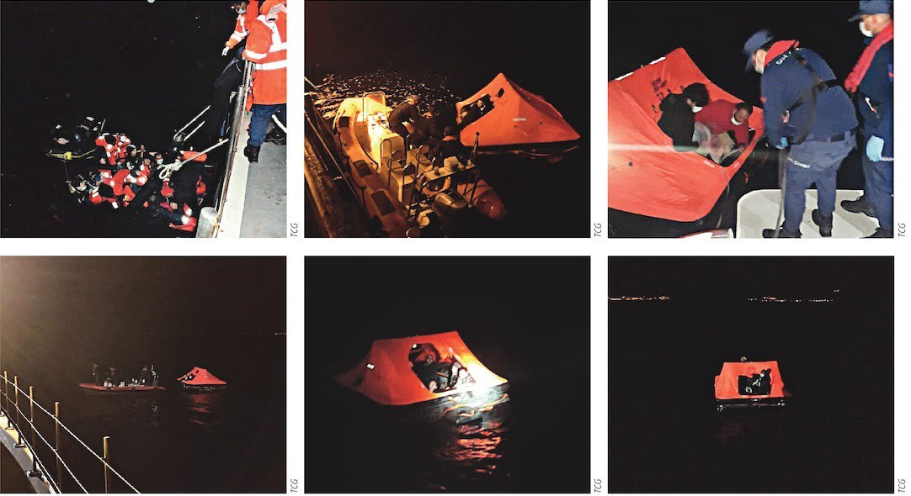

### **AYS Special: Worth Reading 2020**

_2020 is coming to an end, a year filled with dramatic events, moments, developments\. A year with the Corona pandemic as a meta\-headline, setting the tune — or the sombre background — for most of what happened throughout the year\._

 [\)](http://echo-greece.org/))](assets/1fb658a48ca7/0*LTwx4ClOnJYnuSM_)

\( [ECHO mobile Library](http://echo-greece.org/) [\)](http://echo-greece.org/))

At AYS, we have been attempting to keep up with it all in the area of people on the move, migration, policy and practice on the ground\. Through the Daily Digest, a number of theme\-based Specials and through posts on our Facebook\- and Twitter sites\.

On the occasion of the New Year, we decided to make a summary of our Worth Reading section, in which we highlight some of the good or important reads from 2020\. A selection like this will never be — and does not intend to be — complete, and great material may have been overlooked or left out\. The criteria used is that the entries are covering themes or issues of overall importance, that have been included in AYS during this year and that each of them contains some lasting knowledge or afterthoughts worth keeping in mind\.

We hope you enjoy exploring these Good Reads, and you’re very welcome to add additional suggestions in the comments section\.
#### **Solidarity and the criminalisation of solidarity**

 \)](assets/1fb658a48ca7/0*rDS9v08GIHYgHmMR)

\(Source: [Mare Liberum](https://mare-liberum.org/en/) \)

An EU\-wide report by Amnesty International, Europe: [**Punishing Compassion: Solidarity on Trial in Fortress Europe**](https://www.amnesty.org/en/documents/eur01/1828/2020/en/) , detailing legal and informal pressures against human rights defenders and civil society organizations who work with people on the move\.

> By rescuing refugees and migrants in danger at sea or in the mountains, offering them food and shelter, documenting police and border guard abuses, and opposing unlawful deportations, human rights defenders have exposed the cruelty caused by immigration policies and have become themselves the target of the authorities\. Authorities and political leaders have treated acts of humanity as a threat to national security and public order, further hindering their work and forcing them to divest their scarce resources and energy into defending themselves in court\. 

> The report shows how European governments, EU institutions and authorities have deployed an array of restrictive, sanctioning and punitive measures against individuals and groups who defend the rights of people on the move, including by using immigration and counter\-terrorism regulations to unduly restrict the right to defend human rights\. 

Tajana Tadić, AYS program manager, has experienced first hand the difficulties that can be faced by solidarity workers and their families\.

In an important long read from September, Daniel Trilling in the Guardian takes on another story dealing with the criminalisation of rescue\. The rescue ship Iuventa performed hundreds of missions to save people from drowning off the coast of Libya\. But the crew faced persecution after the European crackdown on migration\.

A similar story from Greece was told by Spiegel\. Several NGOs supporting people on the move in the Aegean Sea — Mare Liberum, Sea Watch, FFM eV, Josoor and Alarm Phone — were accused and investigated for espionage and people smuggling\.

#### **From rescue to non\-assistance**

■■■■■■■■■■■■■■ 
> **[Open Arms](https://twitter.com/openarms_fund) @ Twitter Says:** 

> > Escuchad el sonido del naufragio que vivimos ayer. 
El grito desesperado de una madre en busca de su bebé de 6 meses de vida, en medio del caos.
Le recuperamos del mar en parada respiratoria,remontó, pero horas más tarde su pequeño cuerpo no resistió.
Ella es la madre de Joseph💔 https://t.co/mYzXLq1jxi 

> **Tweeted at [2020-11-12 11:27:47](https://twitter.com/openarms_fund/status/1326849164173582336).** 

■■■■■■■■■■■■■■ 

Continued pressure on independent sea rescue NGOs — along with corona measures used by states to take greater risks with people’s lives at sea by refusing safe harbour — has increasingly lead to a climate of non\-assistance\. A good account of this practice can be found in this article from Alarm Phone \(April 2020\), a major force in sea rescue alarms and operations:

One of many examples of shipwrecks and the loss of life this year — 70 people lost their lives in just one shipwreck in November\.

#### **Pushbacks and FRONTEX — Words of the Year?**

\(Pushbacks in the Aegean Sea\. April 2020\. Source: efsyn\.gr\)

A recurrent issue and theme covered by AYS this year has been the pushbacks in the the Aegean Sea and at the land border area of Evros\.

For the situation on the Greek/Turkish border area in Evros, the investigative organisation Forensic Architecture has conducted several investigations and published several reports including this:

Refugee Support Aegean \(RSA\) recently published a timeline listing the main reports of pushbacks and other human rights violations at the Greek\-Turkish sea borders as well as the official responses\. This gives a good overview of the different kinds of violations and also of their frequency\.

Again in the case of violations in the Aegean Sea border area, another independent and investigative organisation, Bellingcat, participated in a technical analysis of several incidents, and proved that these kinds of organisations have a crucial role to play in the documentation of human right violations\. This analysis was a factor in raising the issue in the European Parliament, where more than 100 MEP’s called for further investigations\.

The incidents have highlighted the role of both the Greek Coast Guard and of FRONTEX\. In a three\-part Special from AYS, the role and development of FRONTEX has been analysed and the growth of the organisation, both in terms of personnel and of operations, is shown in a timeline\.

#### **The Bigger Picture**

)](assets/1fb658a48ca7/0*shKWoVW0CWJYchz7)

\(Source: [https://watson\.brown\.edu/\)](https://watson.brown.edu/))

The report “Creating Refugees: Displacement Caused by the U\.S\. Post\-9/11 Wars” from the Cost of War project with Brown University, which came out in September, attempts to outline the number of people displaced as a result of post\-9/11 wars\.

The report provides an analysis of the displacement and the movements of people created by United States military interventions in the eight countries that have been the most targeted in the post 9/11 wars: Afghanistan, Iraq, Pakistan, Yemen, Somalia, the Philippines, Libya, and Syria\.

The sheer numbers — more than 30 million humans on the run or displaced — provide a substantial background for understanding much of the migration and human suffering caused by wars and conflict\.

At the same time, fewer than 20,000 people were resettled through the UN system\. A record low, due to the Corona pandemic and other reasons including growing nationalism and xenophobia in large parts of the world\.

#### **European values in the mirror \(of the external borders\)**

 \)](assets/1fb658a48ca7/1*BsrnyY6AAYHvIyCRcWG7MQ.jpeg)

Greek border forces prevent refugees and migrants from entering Europe via the Pazarkule crossing\. \(Photo by: [Belal Khaled](https://twitter.com/BelalKhaled/status/1238769238137098240/photo/1) \)

Aegean chronicles: A reporter’s confrontation with Europe’s failures and moral imperative\. In this core read, Giorgos Christides, a Greek correspondent, draws lines from the situation in Greece and on Lesvos in 2015 to today\. Both on a personal and a political level\. The author has been a strong actor in the work of covering refugee and human rights issues and linking Greece and the EU is this area\.

The articles written by Giorgos Christides for SPIEGEL throughout the year can be found here:

In an interview that, better than most, made the case for linking the situation in Greece to the principles and values of Europe and the EU, professor Giorgos Tsiakalos outlined in Solomon an important overview of the migration policies and practices violating human rights, international conventions and laws\.

> …we’re at the most worrying turning point for Greece and for Europe, since the so\-called “refugee crisis” began\. Worrying, because for the first time, the governments of European countries are questioning the basic principles, values ​​and international treaties that have characterized societies since the post\-WWII era\. And, unfortunately, we see Greece at the forefront of these developments\. 

This discussion became even more relevant with the EU proposing the so\-called [New Pact on Migration and Asylum](https://ec.europa.eu/info/strategy/priorities-2019-2024/promoting-our-european-way-life/new-pact-migration-and-asylum_en) , opening up discussion and much analysis and criticism which became an important part of AYS Daily Digest content in the last part of the year\.

A controversial part of the proposed EU Migration Pact are the plans for increased externalisation and the outsourcing of asylum\-claim processing to countries outside the EU\. This is certain to be the subject of intense discussion and resistance in 2021\. This report by Refugee Rights Europe, another active voice in the debate, covers human rights and the EU border regime\.

#### **Borderlines and a Fire**

 \)](assets/1fb658a48ca7/0*lT2egQmvPH9hfYXt)

\(Moria, Lesvos\. September\. Moria burns\. Photo: [UNICEF photo of the Year/Angelos Tzortzinis](https://www.unicef.org/) \)

The activist and documentarist Eric Maddox made several features throughout the year about the refugee situation and the local communities at the borders of the EU, in the Aegean and on Lesvos in particular, in his series Latitude Adjustment Podcast \(LAP\) \. The episodes were made partly in collaboration with AYS\.

The first podcast report is an update with people on the ground in Greece and Turkey describing the fast\-changing situation in and between these countries\.

In another episode of the LAP podcast, the psychologist and founder of the PIKPA solidary camp for vulnerable refugees, Efi Latsoudi, speaks about her groundbreaking work, even more relevant after the government evacuation of PIKPA in October:

A defining event during 2020 was undoubtedly the situation on Lesvos and the fire that destroyed the Moria camp — a development that brought ‘European values’ into tragic focus\.

Following the catastrophe at Moria, AYS published a special written by Damla Ilbas & Simone Innico **_,_** analysing the history and background of the events on Lesvos and at Moria\.

The Greek photographer Angelos Tzortzinis followed and documented the fire and what followed was a poignant series of photos that later this year became the winner of UNICEF Photo of the Year Awards\.

#### **Technological frontlines**

 \)](assets/1fb658a48ca7/0*u40kK2ifDIKsTZwz)

\(Source: [https://digit\.site36\.net/](https://digit.site36.net/) \)

One often overlooked theme during the year has been the technological additions to the monitoring of the EU borders\. This article gives an insight into the increased use of air surveillance by FRONTEX:

Here is a more general view on the rapidly evolving use of new technologies in the area:

#### **Human Rights under increased pressure**

 \)](assets/1fb658a48ca7/0*RwQx9_6E-AieDa6X)

\(First edition of the 1500 page book on illegal cross\-border pushbacks \(GUE/NGL\), Source: [BVMN](https://www.borderviolence.eu/launch-event-the-black-book-of-pushbacks/) \)

The Border Violence Monitoring Network \(BVMN\) has been one of the most vocal proponents for human rights in 2020, and their voluminous and substantial work documenting violations was made into the collection **The Black Book of Pushbacks** , presented in the European Parliament and to the European Commissioner for Home Affairs Ylva Johansson in December\. The work brings together a wealth of evidence on these Human Rights violations, analysing in detail the way that these brutal acts have become institutionalised at the external borders of the EU\.

#### **Perspectives and a chronology to wrap up the Year**

 \)](assets/1fb658a48ca7/0*rZKqwWrCfAJX1Jw_)

\( Efi Latsoudi, [Lesvos Solidarity — Pikpa](https://web.facebook.com/pikpalesvos) \)

In making the Daily Digests and our other material, AYS always try to find a balance between voices and practices from the ground and from humans on the move — and additional sources that enable the larger picture to come forward — to link the perspectives\. This article is in itself a flashback to 2020, and here a number of refugees, activists, aid groups and photojournalists reflect on the year from different places and angles\.

It has been a choice to make up this list from some substantial or significant posts and contributions from throughout the year\. However, it might be useful to look back on the year in a more chronological way, and for this purpose, we have chosen to include the review of photos of the year from InfoMigrants, a collaboration between three major European media sources\.

**Find daily updates and special reports on our [Medium page](https://medium.com/are-you-syrious) \.**

**If you wish to contribute, either by writing a report or a story, or by joining the info gathering team, please let us know\.**

**We strive to echo correct news from the ground through collaboration and fairness\. Every effort has been made to credit organisations and individuals with regard to the supply of information, video, and photo material \(in cases where the source wanted to be accredited\) \. Please notify us regarding corrections\.**

**If there’s anything you want to share or comment, contact us through Facebook, Twitter or write to: areyousyrious@gmail\.com**

_Converted [Medium Post](https://medium.com/are-you-syrious/ays-special-worth-reading-2020-1fb658a48ca7) by [ZMediumToMarkdown](https://github.com/ZhgChgLi/ZMediumToMarkdown)._
