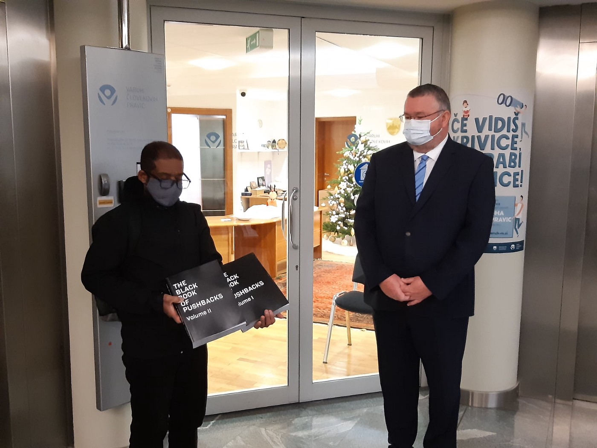
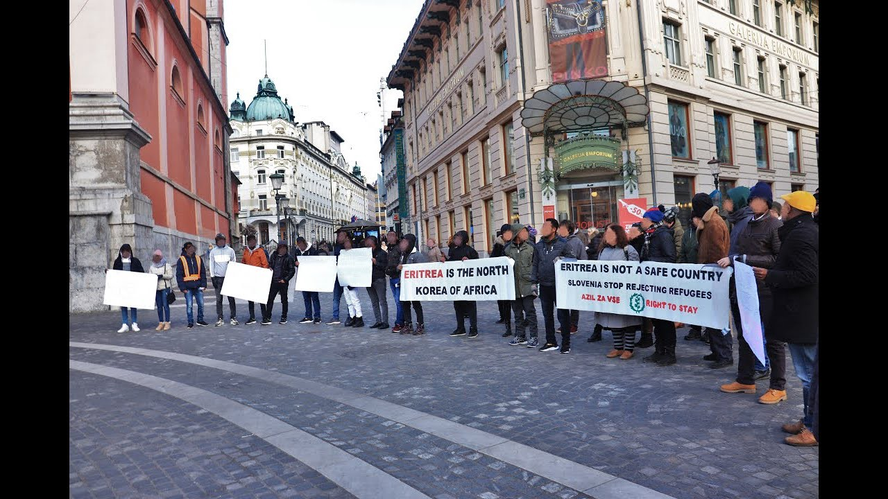
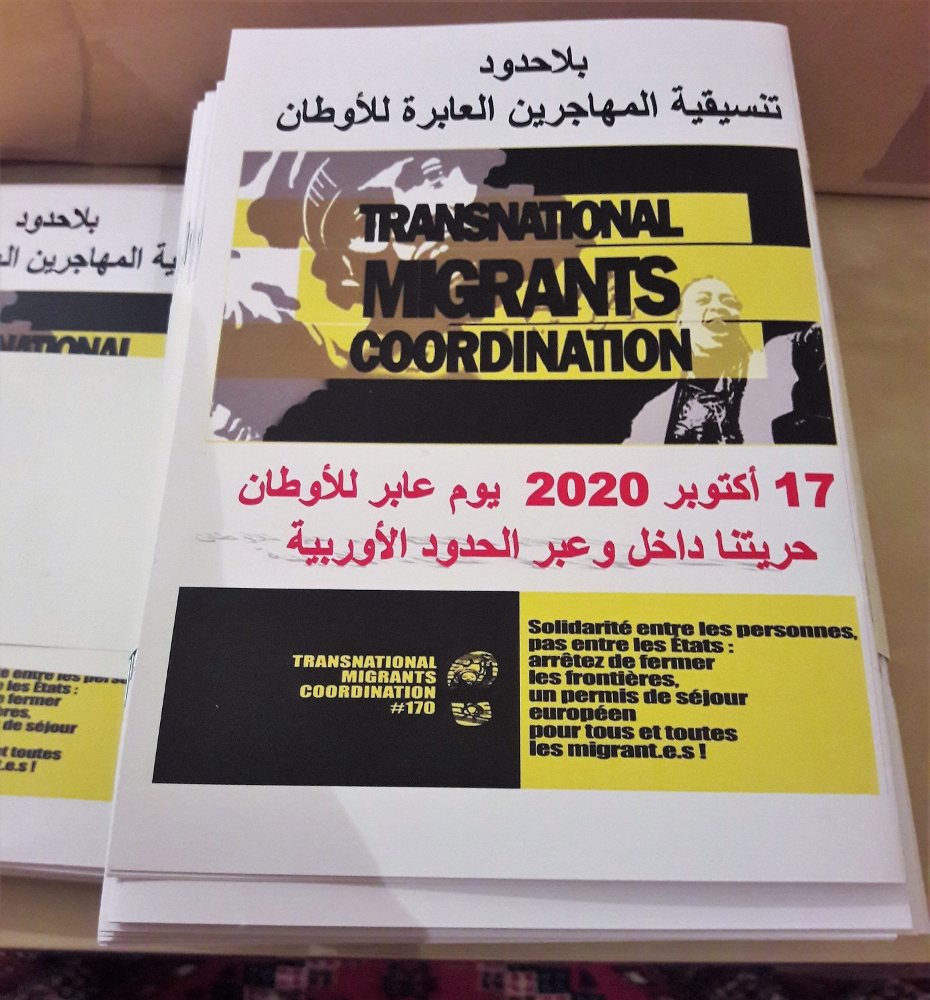

### AYS Special from Slovenia: A year in review

_The last weeks of 2020 saw two women giving birth in the forests of Slovenia\. One child did not survive\. The fact that refugee families are delivering babies in the forest while on a long trek towards the European Union barely made the news, and neither did the question as to why a family with small children would be avoiding the law enforcement of an EU & Schengen member state\. Those families were hiding\. A central European winter in a forest seemed more humane than European police\._

\(Photo Credit: _InfoKolpa_ \)

2020 was a year of extremes, and the normalisation of these extremes, in Slovenia and elsewhere\. We have seen a rise of chain pushbacks from Italy and even Austria, mass detainment of asylum seekers and migrants, and a gradual introduction of the “Višegrad asylum model”\. Nonetheless, there have been some notable bright spots, such as the publications of a [booklet](https://www.transnational-strike.info/wp-content/uploads/TMC-JOURNAL_2020.pdf) in Arabic regarding migrant struggles across the world and in Slovenia \(together with groups of TMC\), and the Black Book of Pushbacks \(together with our BVMN partners\), as well as a successful lawsuit challenging a pushback of a Cameroonian refugee who was twice denied asylum and pushed back to Croatia\. Below you can read a short recap of migration rights struggles during 2020 in Slovenia\.
#### **Pushbacks**

Officially, “pushbacks’’ are still considered “fake news” and “smear” allegations against the “professional” European police\. Be that as it may, pushbacks have become common knowledge and a topic of satire and offhand remarks\. The Slovenian interior minister has quite casually admitted in a newspaper interview that chain pushbacks _are happening_ , stating that “people who are returned to Croatia end up in camps in Bosnia or Serbia”\. Later on, the _Interior ministry_ distanced itself from the _minister of interior’s_ statement\.

> A revealing episode regarding the state of EU migration policy, it seems that the word of a minister of interior is worth the same as a migrant life — nothing\. 

The absurdity of the above merely adds to an abundance of evidence of inhumane treatment and gross violations of human rights being simply ignored, or dismissed\. Empathy \(and nothing more\) is offered only in extreme examples — women and young families\. As people are being pushed back in their thousands, we have become desensitized to their plight\. When we look at people freezing in Bosnia, we must remind ourselves that many of those people _have been in the European Union_ — in Croatia, Slovenia, Italy and Austria\. These people are freezing because European authorities are not respecting their own laws\.

Slovenia has made a sharp turn to the \(far\) right with its new government, which came into power together with \(and thanks to\) the epidemic\. Yet the previous governments, which **began perpetrating pushbacks,** were center\-liberal\. An Eritrean activist and member of InfoKolpa, who has been on the move for nine years, had his asylum application denied after almost two years\. To this, he said:

> _I like it better in Hungary, they tell you are not welcome on the first day\. In Slovenia I had to wait two years for the same answer\._ 

#### **Directives from the top**

It was two springs and three winters ago, in 2018, when Slovenia started with dubious and illegal migration practices by denying people the right to international protection at a systemic level\. Primarily, police officers working in Slovenian border areas and inside the country introduced daily collective expulsions to Croatia after receiving a series of [directives,](https://push-forward.org/porocilo/objava-internih-policijskih-navodil-za-ravnanje-z-migranti-release-internal-police) as part of _coordinated efforts_ aimed at effective border closure\. At least one of them was signed by none other than Marko Gašperin, currently serving as chairman of the management board of Frontex\.

After two and a half years of numerous testimonies and extensive research, it is safe to say that Slovenia is turning a blind eye to ethical interpretations of the law by using the readmission agreement with Croatia to carry out expulsions of large numbers of people and deny their right to asylum\.

> According to official police reports, since 2018 there have been more than 25\.000 readmissions from Slovenia to Croatia; these unprecedented numbers include up to 10\.000 readmissions in 2020\. 

#### **The insidious readmission process**

After days of dangerous trekking through forests and rivers, many people who manage to avoid Croatian police are often found by their Slovenian counterparts\. This, however, is not a lucky break:

> Their claims for asylum are, in the majority of cases, met with threats and violence\. Their appeals for protection are faced with only ignorance and repression\. 

Within the procedure, police officers consider these asylum seekers _illegal aliens_ who have no right to be in Slovenia\. After the identification procedure and a night in detention, the police employ the readmission process, taking people to the border and collectively deporting them to Croatia, despite clear evidence of the brutal violence by Croatian police, and despite the high probability of a further expulsion to Bosnia and Herzegovina, where conditions are in many ways dire\. 2020 in Slovenia has been a year in which the state, without any restraint, continued with the shameful practice of pushbacks\. More than two thirds of cases this year state that, after merely a day or two, people found in forests are taken directly from Slovenian police stations to Croatia — without the right to register an asylum procedure\. Such denials of the right to request asylum and accompanying pushbacks to Croatia have been recorded even in cases when people _knocked on the doors of the asylum camp_ in Ljubljana\.

> Too often, seeking protection in Slovenia ends up with police deportations to Croatia, and further to Bosnia and Herzegovina\. 

#### **Chain\-pushbacks**

\(Photo Credit: _InfoKolpa\)_

Unfortunately, in 2020, the illegal, dangerous and torturous practice of chain pushbacks along the Balkan route spread even further west and north\. This year saw Slovenian police become uncritical “carriers’’ for people on the move, who were being returned from Italy or Austria\.

> The process is strikingly foul: Slovenian police usually pick people up at the border after a request from Italian or Austrian authorities and transport them through Slovenian territory into the hands of the brutally violent Croatian police, who use torture, theft and humiliation to push groups of people over the land border with BiH or Serbia\. 

Each European Union member state washes its hands of these people, claiming that they believe other European countries maintain a minimal standard of human rights protection, even if evidence to the contrary has piled up into thousands of pages \(see [Black Book of Pushbacks](https://www.theguardian.com/global-development/2020/dec/23/black-book-of-thousands-of-migrant-pushbacks-presented-to-eu) \) \.
#### **Protests against detention of asylum seekers**

 \)_](assets/3f3aec0c3a2a/1*dTvsbQVD93jfV-YNKR6b6Q.png)

\(Photo Credit: _InfoKolpa\. Read their Special on the protests [HERE](ays-slovenia-special-protest-breaks-out-in-detention-centre-postojna-a-week-after-court-decision-e86065481fcb) \)_

These abuses are not confined to the border: in the past year, a new practice of detaining asylum seekers was observed in Slovenia\. Many of those who have entered the country and managed to start their asylum procedure were taken to a detention centre in Postojna instead of the asylum camp in Ljubljana\. Once again, the change is a result of directives from the top, namely, the now former general director of the Slovenian police, Anton Travner\. Dispatched to police stations under the Koper regional administration, this directive stated that any person caught in an irregular border crossing in the Koper region should be taken to Ilirska Bistrica police station and handed over to the custody of employees of the Interior ministry — who would further transfer them to the detention centre Postojna\.

> This meant a _systematic_ issuing of “official decisions on detention”, the justification behind which was that “a person’s freedom of movement should be restricted to the area of a detention center because he or she crossed the border illegally”\. 

These instructions clearly state that the purpose of detention is to issue asylum decisions by **fast\-track procedure** , making it easier to deport people who get their asylum claim denied\. The directive also states that such detention practices would make the Balkan Route “less attractive” to people crossing the borders\. Needless to say, the majority of detention decisions were **declared unlawful** after an appeal at the Administrative Court\. Despite this, many people were forced to stay in detention for three months\. With a negative decision during this time and their appeal rejected, a pushback to Croatia under the readmission agreement followed\.

Alongside this, and due to an increase in readmissions from Italy, the conditions in detention centre Postojna became unbearable: in the month of July there were almost 400 detained people\. For the purpose of housing, shipping containers were used in a part of a warehouse that had been transformed into a gated accommodation facility\.

> Food was distributed through a fence, police regularly used dogs to instill fear, and the medical assistance in the centre was, and in large part still is, reduced to the provision of sedatives\. 

In some cases people received no official documentation regarding their detention, or were arbitrarily chosen for deportation to Croatia\. While others were taken to an asylum camp in Ljubljana after the 14\-day quarantine, the dehumanizing conditions experienced by those who remained drove many to to commit self\-harm or to [protest](ays-slovenia-special-protest-breaks-out-in-detention-centre-postojna-a-week-after-court-decision-e86065481fcb) \. One demonstration occurred on July 28th, followed by several **strikes,** and then a protest of detainees and outside solidarians on the 25th of August\. A month later, a **hunger strike** of 11 detainees broke out inside the detention centre\. An [open letter](https://push-forward.org/novica/izjava-11-priprith-prosilcev-za-azil-v-centru-za-tujce-v-postojni-statement-11-detained) signed by the strikers was published:

> The detention centre in Postojna is a lawless place\. What happens to us is arbitrary\. In the time this statement is being written, one of us was already deported to Croatia and is now in Bosnia and Herzegovina, one has had his appeal approved and was transferred to Ljubljana, and one has hurt himself in protest of the unjust detention in Postojna\. 

> We are electricians, taxi drivers, clothes designers, workers, sellers, marathon runners — we are people\. We are open\-minded and peaceful but we demand fair treatment for everybody who is detained in Postojna\. The regime of detention and the situation of uncertainty is killing our spirit and the people responsible for this situation want to take away our dignity\. We will not allow this\. We demand our rights to be respected\! We demand freedom of movement\! 

During autumn there has been a decrease in the number of detainees and it seems that the above practice has come to a halt\. Despite this, it is frightening how easily the Interior ministry and the police chiefs were able to introduce such arbitrary and fast\-tracked asylum procedures overnight\.

Neither the Slovenian Ombudsman nor the court were willing to make a stand against the practice of unlawful and arbitrary detention\.
#### **Court finds Slovenia guilty of chain pushback**

2020 saw some developments in the legal field in Slovenia\. Two important pushback\-related cases stand out, brought in front of the courts by new alliances between activists, investigative journalists and lawyers\.

[The first case](https://www.dnevnik.si/1042936806/Slovenija/vrhovno-sodisce-stopilo-na-stran-policije-ki-vraca-migrante-na-hrvasko?fbclid=IwAR1UIf7sgtijWwfMnM8FyNy6GKxsr7gEiJiiYPXPJThUv-1iBYICGVLh5i0) was initiated by a person from Morocco who was pushed back into Croatia after an asylum claim rejection\. The Supreme Court ruled that the Slovenian police did not violate his rights when they returned him to the Croatian police without issuing a return decision\. According to the court interpretation, this is made possible by the readmission agreement\. However, the Supreme Court _did not rule_ on the prohibition of torture and the principle of non\-refoulement, due to procedural limitations to the arguments from the appeal in its decision\-making\. Hence, this judgment cannot be considered a precedent that would determine the interpretation of the Readmission agreement between the two countries, and which would decide on the general legality or illegality of SLO\-CRO\-BiH chain pushbacks\.

The [other case](https://balkaninsight.com/2020/07/28/slovenian-court-ruling-a-boost-in-battle-against-refugee-pushbacks/) is of a person on the move from Cameroon who had been pushed back from Slovenia to Croatia and back into BiH several times in 2019, despite each time expressing his wish to claim asylum\. In June 2020, the Slovenian Administrative Court ruled that **Slovenia has violated his right to access to asylum, prohibition of torture** in its procedural aspect, and **prohibition of collective expulsions** \. It also ruled that **Slovenia has to pay the Applicant 5000 euros in just satisfaction and let him enter its territory to claim asylum** \. After an appeal by the Interior ministry, the decision was overturned at the Supreme Court and returned to first instance, the judgement supposedly being too incomprehensible\. A second decision is pending in 2021\.
#### **Eritrea is not a safe country\!**

\(Photo Credit: _InfoKolpa\)_

The Interior ministry and its decisions regarding asylum requests in Slovenia rely on a policy of repression and restricted access\.

> Despite the fact that Eritrea remains one of the most dangerous dictatorships, with practices of extrajudicial killings and slave labour, in early 2020 the Slovenian Interior ministry decided to consider it a safe country\. 

Eritrean asylum seekers have thus ended up with negative decisions regarding their asylum procedure\. This was done through selective reading of official existing database reports and ignoring individual stories and claims\. This action by the ministry becomes even more disturbing when compared to the policy of the previous two years, when Eritrean asylum seekers with similar cases coming by relocation from Italy received _positive decisions_ \. These asylum rejections prompted a [protest action](https://www.infomigrants.net/en/post/22169/eritrean-asylum-seekers-hold-protest-in-slovenia-over-asylum-process-rejected-applications) of Eritrean asylum seekers, refugees and people in solidarity in the first days of 2020\. The protest in demand of a more just system of decision\-making took place in front of the asylum camp and Interior ministry\.

Practices of generic decisions and collective refusals of the right to asylum are nothing novel in Slovenia\. The first targets of such policy were Afghan asylum seekers in 2016, when no adult received a positive decision on their asylum claim\. As stated by the Eritrean Community in Slovenia in their [public letter](https://push-forward.org/novica/iz-zapora-v-zapor-jail-jail) :

> This kind of conduct from the Ministry is not new\. We can remember the year 2015, when they pursued a policy of rejection towards all Afghani asylum seekers\. Their thinking was the same as it is today: “It doesn’t matter if the decision is justified; the important thing is sending a signal to Afghanis that there is no point in waiting in Slovenia\.” \[…\] Now it is us, the Eritreans who are faced with the same fate — we are forced to live on the outskirts of society and forced to find ways into other countries, we have been stripped of our right of movement while we are waiting for the decision\. We have been waiting in vain for this decision for more than a year\. We will not allow this politics of rejection to be used for us and other groups\! Such unreasonable decisions, unprofessional and politically motivated decisions made by the Ministry of the interior will cost us years of our lives, while also degrading the professional nature of state institutions\. This is why we demand that the government of Slovenia and responsible institutions re\-examine the problematic decisions and form a politics towards Eritrea, which will comply with international human rights standards\. We want a faster and most of all fair decision according to the law\! 

Despite clear voices of protest, the Interior ministry did not change its mind on Eritrea’s status as a safe country\. Negative decisions were still coming in, and faced with the danger of deportation to Croatia after a possible negative decision on appeal, many of the Eritreans decided to flee Slovenia in order to seek a secure life elsewhere\. Arbitrary decision\-making was also communicated to UNHCR through official channels but prompted **no response** \.
#### **Our fight for 2021: The International Protection Act, the Aliens Act, exposing pushbacks, migration pact, and continued support to the people on the move\!**

Next year the Slovenian national assembly will vote on two amendments that would essentially legalize pushbacks and further restrict already very limited integration capacities\. The amendments are to the _International Protection Act_ and the _Aliens Act_ \. One of the main changes to the International Protection Act regards the rights of refugees with international and subsidiary protection concerning integration into society \(social rights mostly\) \. If adopted by the National Assembly, refugees will be obliged to sign a special personal integration plan \(contract\) \. The idea is to separate the rights of refugees, who are eligible as persons with international protection status, from the rights “awarded” if a refugee signs a contract and fulfils its orders\. Thus, the government **places conditions on the right to receive a subsidy for housing** , a right relevant to social inclusion, by _reducing it_ from 18 to 12 months\. After that period, the person’s case will be evaluated to determine whether or not they still deserve this right\.

> In general, housing conditions in Slovenia are brutal, discriminatory and extremely expensive\. The addition of further conditions suggests that the government is toying with the lives and basic rights of refugees, bringing **humiliation** and **discipline** into the equation\. Consequently, this creates a higher chance of refugees leaving the country and moving permanently to another one\. 

In a new proposal that makes detaining people easier and faster, it can be ordered by _The Government Office for the Support and Integration of Migrants_ \. Furthermore, only asylum seekers with an undoubtedly confirmed identity are eligible to access the labour market\. The grounds for detention are widening in range\. The deadline for appeals is shortened\. And if an asylum seeker does not provide additional proof for his case’s legitimacy within the given time frame, his claim will be considered withdrawn\.

> In the meantime, refugee lawyers, a special category of refugee law counsellors, still _do not possess the right to represent_ an asylum seeker in front of the National Constitutional and EU courts\. 

The Slovenian government is also trying to force an amendment to the **Aliens Act** that would vaguely introduce the so\-called **“complex crisis” legal regime,** aiming to restrict access to the asylum procedure for people on the move\. This means that, at the reasoned proposal of the Interior ministry regarding the management of a “complex crisis”, the Government of the Republic of Slovenia may propose to the National Assembly the adoption of a measure that will temporarily _stop_ or _limit_ the implementation of the International Protection Act\.

According to the Legal centre for the protection of human rights and the environment \(www\.pic\.si\), such an act **violates the Geneva Convention** , **the principle of non\-refoulement** and **the Convention on the Rights of the Child** \. The new Aliens Act also criminalizes humanitarian aid, extends detention to encompass the time of apprehension and the court hearing, confiscates documents with the aim of deporting migrants, **surprisingly passing by the Police Duties and Powers Act** , reduces the reasons for granting “permission to stay” \(retention permit\) for undocumented migrants, raises the minimum for the **imposition of ban on re\-entry** into the country from 6 to 12 months, and many more changes\.

The act also contains major negative ramifications for **migrant workers and their families,** including family reunification rights\. If adopted, the act will exclude work\-related reimbursements \(the cost of commuting, meals, other travel costs\) from the scope of financial resources by which migrants prove sufficient means of subsistence for themselves and reunified family members\. There are almost 150 thousand migrant workers \(including children and other family members\) living in Slovenia in 2020, and the exclusion of the mentioned resources will put them in great distress\. The renewal of their work and residence permits will become tremendously hard to achieve\. It will also prevent many workers from reuniting with their families, and many families already living in Slovenia will probably **lose their residence permits\.**

Both bills were sent to the National Assembly for further reading and procedures\.
#### **The new migration pact**

Following the publication of the new pact on migration and asylum, the Slovenian government reacted much like **The** **Visegrád Group** members \. Interior minister Aleš Hojs said that the most controversial part of the document is precisely the one that speaks about the responsibility and solidarity of countries\. In his opinion, Europe needs to strengthen controls at the external borders and prevent abuses of the asylum procedures\. In June 2020, Slovenia expressed its strong opposition to the compulsory relocation of refugees; three months later, the pact was presented without mandatory relocation, but required \(binding\) solidarity\. At this point, different countries understand and interpret solidarity in their own ways\.

The interconnection of several information systems, part of which is **an entry and exit system with enhanced surveillance** of third\-country nationals, will be launched by the end of May 2022\. Slovenia and Croatia tried to convince the EU to move the surveillance points to the external borders of the EU, while the new pact plans to place these control points within the borders of the Schengen Zone\. Since Croatia is still not a member of the Schengen zone, the longest chain pushbacks — during peak tourist season — are expected to come at its border with Slovenia\. However, not every border crossing has the necessary system for such surveillance, i\.e\. for the fingerprinting of each passenger with a third country national passport\.

The year of the pandemic, which has particularly affected vulnerable groups, including refugees and other migrants, is coming to an end\. We are entering the new year with the awareness that the situation of people on the move is not improving, the humanitarian and political crisis is escalating, and there are no effective systemic solutions in sight\. Given these intersecting crises, interpersonal solidarity, contact with people on the move, and direct action will be our guide in the coming year\.

\(Photo Credit: _InfoKolpa\)_

In 2020, we distributed dozens of smartphones, as well as other forms of humanitarian aid, to counteract the frequent seizure and destruction of property by Slovenian and Croatian security authorities\. We continued taking part in [Transbalkan Solidarity](https://transbalkanskasolidarnost.home.blog/) \. At protests, we drew attention to escalating police violence in the Balkans and elsewhere\. Other than the above actions, we also concluded the year with the publication of several [texts](https://www.theleftberlin.com/post/the-pandemic-crisis-in-slovenia-fighting-fragmentation-and-precarity) \. Along with Transnational Migrants Coordination, we published a [booklet](https://www.coordinamentomigranti.org/wp-content/uploads/2020/10/TMC-JOURNAL-PUBLISHER-EN-FINALE.pdf) and demanded an unconditional residence permits for all migrants\. Along with partners, we published [The Black Book of Pushbacks](https://www.guengl.eu/issues/publications/black-book-of-pushbacks-volumes-i-ii/) \(BVMN, GUE / NGL\), which involved12,654 people and contains 862 testimonies about border police violence — 138 of which concern Slovenia\.

10\.000 people have been pushed back from Slovenia in 2020\. These pushbacks are illegal\. Through scheduled changes to the law on international protection, such pushbacks will be legalized on a massive scale\. This will be our fight for 2021\.

**_Written by members of Civil initiative InfoKolpa, edited by Saša Hajzler\._**

**Find daily updates and special reports on our [Medium page](https://medium.com/are-you-syrious) \.**

**If you wish to contribute, either by writing a report or a story, or by joining the info gathering team, please let us know\.**

**We strive to echo correct news from the ground through collaboration and fairness\. Every effort has been made to credit organisations and individuals with regard to the supply of information, video, and photo material \(in cases where the source wanted to be accredited\) \. Please notify us regarding corrections\.**

**If there’s anything you want to share or comment, contact us through Facebook, Twitter or write to: areyousyrious@gmail\.com**

_Converted [Medium Post](https://medium.com/are-you-syrious/ays-special-from-slovenia-a-year-in-review-3f3aec0c3a2a) by [ZMediumToMarkdown](https://github.com/ZhgChgLi/ZMediumToMarkdown)._
