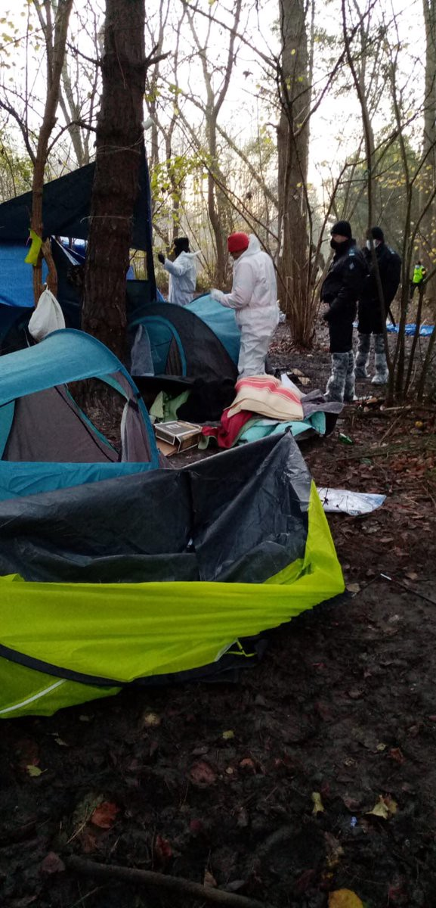
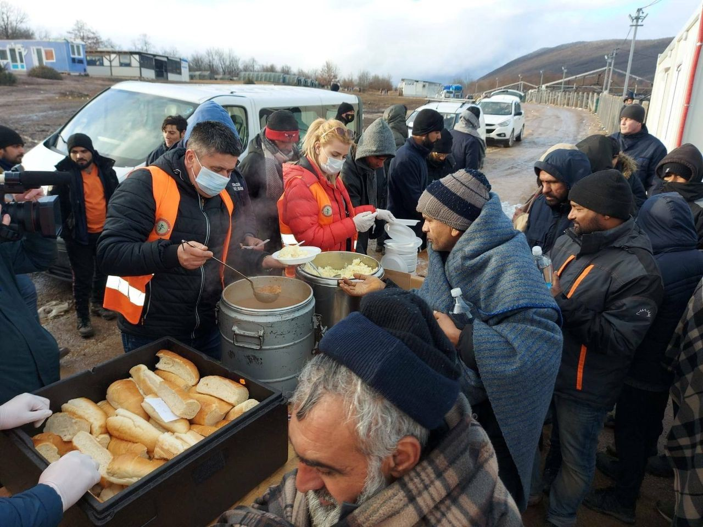
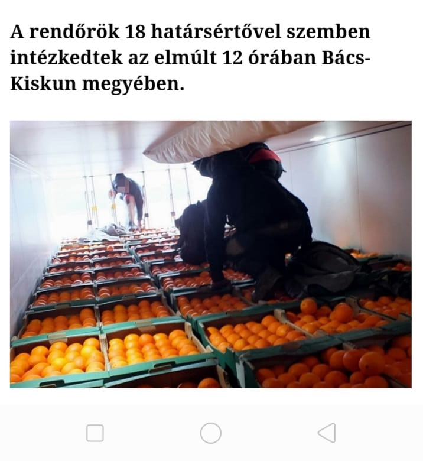

### AYS Daily Digest 06/01/2021 — Almost 1000 evictions in Calais alone reported in 2020
#### Spain as main destination for African people on the move // Unacceptable criminalization of solidarity in Bosnia // Updates on police violence in Greece // Portugal to start talks with other EU countries on the new EU Migration Pact

As we enter in the new year, we wish to report on some data about evictions and migration routes in 2020:
### FRANCE

Evictions in Calais — courtesy of HRObservers

[Human Rights Observers](https://twitter.com/HumanRightsObs/status/1346868521188392960?fbclid=IwAR39ZmxFmd4RRnEXJKWnWizwXB1UfcZuZcIkfBWpPDBiUxW6Mi2ZcaOLJhw) reports a staggering count of 973 evictions from Calais alone in 2020, with nine evictions from informal living spaces in December\. Fundamental rights violations are a constant in Grande\-Synthe Share, notes the monthly\. The trend doesn’t seem to have waned; on 1 January 2021 there were already the first five expulsions of the year from living quarters of people exiled in transit at the border\. Among those expelled were several unaccompanied minors, who did not benefit from any care or alternative accommodation solutions\. Nothing has changed in 2021: fundamental rights are still not respected at the Franco\-British border\.

[Reports of severe police violence](https://tekdeeps.com/two-french-border-officers-beat-and-maimed-a-tunisian-immigrant/?fbclid=IwAR36I_M3MVH-rNZgTsp6hf39z8xNRJ-G_hc1JQ1rIaEOeDkvGMQHveHGdes) in Nice have also emerged, with accounts of a 35\-year\-old Tunisian migrant undergoing emergency surgery on 13 December for severe injuries inflicted by police officers\.
### SPAIN

According to [News from the Med,](https://www.facebook.com/NewsfromtheMed/posts/1124953394624922)

> Spain has become the most important gateway to Europe for migrants from Africa\. In 2020, more migrants arrived there than in any other EU country\. 

> The asylum system was on the verge of collapse even before the pandemic began\. A year ago, around 120,000 unedited applications had piled up with the authorities\. Even the few places for accommodation are hopelessly crowded\. More than 8000 asylum seekers are waiting for a place on the mainland\. On the Canary Islands, the government is far from its promise to accommodate all new arrivals in its own facilities\. Up to 7000 people are still living in hotels and vacation apartments\. 

This seems to have upset the [tourist business](https://www.facebook.com/NewsfromtheMed/posts/1124956557957939) of Gran Canaria\.

Just on 5 January, 48 migrants, including seven women and two children, were [rescued by the Spanish Maritime Rescue Organization](https://www.facebook.com/NewsfromtheMed/posts/1124582724661989) near the island of Alborán\. According to the Red Cross the immigrants from sub\-Saharan Africa were taken care of when they arrived at the port and are in good health, although most of them are very wet and others arrived with mild hypothermia due to the cold\.
### BOSNIA AND HERZEGOVINA

Pomozi\.ba continues to support people on the move, despite the local officials and government employing a language of criminalisation for those non\-governmental organisations that support migrants with food and shelter\.

Volunteers of Pomozi\.ba in Lipa

> [We give out 1000 warm meals with 1500 liters of water](https://www.facebook.com/pomozi.ba/posts/2211981818934072) , and with the food, the shortage of water at Lipa is a big problem\. As we have so far, we strive to be part of the solution, not part of the problem\. We must emphasize here that all donations going to people on the move, or refugees and migrants, are donations that have been intended for those people\. We will take the opportunity to praise Pomozi\.ba USK teams because they really do an awesome job\. 

Volunteers find themselves obliged to point this out, after a situation of blatant criminalization of solidarity in Bosnia\.

The [director of the Foreign Affairs Service](https://ba.n1info.com/vijesti/u-sumi-okriven-manji-broj-ljudi-koji-su-dijelili-hranu-ilegalnim-migrantima/?fbclid=IwAR10toY5wOQujDRCuyoFDo0yshFByjpReUGiLuC9NLeRhBYPY2COC13Dk24) Slobodan Ujić claimed to have

> discovered, near Lipa, “a number of people who distributed food to illegal migrants\. This is about one citizen of Bosnia and Herzegovina and more foreign citizens who had no permit for this from the competent authorities in Bosnia and Herzegovina\. Ujic declared that they interviewed them and some of them will lose their residence permit, while others will be sanctioned in other ways, including decisions about access to Lipa camp for accredited journalists\. 

With solidarity movements everywhere, one of the first ways that officials crack down on aid is to claim that the distribution of food has not been regulated with health and safety permits\. With our colleague [Nidzara Ahmetasevic, Help for Refugees in BiH](https://www.facebook.com/groups/144469886266984/permalink/710565936324040/) , we would like to stress that the only thing illegal here

> is the language this official uses, which serves as criminalization and incitement to hatred for one group of people\. It is worrying and questionable how legal it is to obstruct media access\. Let’s hope someone reacts and that journalists continue to do their job unobstructed and continue to report\. There is no procedure requiring journalists to be accredited for working in Bosnia and Herzegovina\. All they need to do is to show their credentials\. And distributing food to hungry people is certainly not illegal\. 

We have [very important testimony \(thanks to NoNameKitchen](https://www.youtube.com/watch?app=desktop&v=u1S_QltJsMs&feature=youtu.be&fbclid=IwAR28WfNOiNuCL2qMJH39BKJw95WCS5De2BXSHOoE2-v3cHCu5lVUGCfVmaU&ab_channel=NoNameKitchen) \) of the fourth day of the hunger strike at Lipa camp \(Bosnia\) \. The video is one of the few video testimonies we have from recent days in the burned and demolished camp in Lipa\. These tragic and compelling images show the desperate situation of migrants in the area of Bihac, as well as highlighting the political responsibility and inaction of local governments\.
### GERMANY

The Berlin Refugee Council has sent a letter to the Berlin senate, calling for admitting the refugees stranded in Bosnia\. We report excerpts from the integral text, which can be found [here](https://www.facebook.com/fluechtlingsratberlin/posts/3554795291241927) :

> Since 23 December 2020, hundreds of refugees from the abandoned Lipa refugee camp have largely been delivered to winter without protection\. Thousands more seekers are camping in northern Bosnia in ruins and forests and emergency IOM accommodations\. 

> Many refugees have suffered significant injuries as a result of abuse from pushbacks by the Croatian police, but have no access to medical or other care\. Aid is made more difficult because the Bosnian authorities are prohibiting humanitarian aid from NGOs\. Add to that the winter temperatures and the lack of any infrastructure of illegal camps\. Other refugees are living under precarious conditions at IOM camps, but NGOs have no access to them\. Many of the refugees stranded in Bosnia were previously left by the authorities in Greece, while some had previously been in Moria\. Unaccompanied minor refugees and families with children are also affected\. 

> The Refugee Council calls on the Senate of Berlin to immediately admit the hungry and cold refugees now in Bosnia and to announce a state reception program to this end\. Unlike in the case of Greece, this cannot be rejected by the Federal Ministry of the Interior argument on the priority of EU asylum jurisdiction under the Dublin regulation\. 

### SERBIA

Over [240 refugees have been transferred](https://twitter.com/APC_CZA/status/1342518954422628352) on four buses from the north of the country to the camp at Presevo, where there is a lack of adequate food and clothing\. Refugees have nothing to wear even after taking a shower, and when they leave the camp, they use blankets as jackets, so they don’t freeze\.
### HUNGARY

A picture shows people hiding in the truck\.

Along the country’s southern border, [several arrests have been made of refugees attempting to cross from Serbia](https://www.facebook.com/permalink.php?story_fbid=172830531249757&id=105470971319047) \. Many deportations have ensued\.

Syrian and Afghan people were arrested hiding behind orange boxes in a truck from Serbia to Hungary on 4 January\. The refugees were deported and returned to Serbia\. Police have taken action against 18 border violators in the last 12 hours in Bucks Kiscon County\.

During the inspection, migrants announced that they were Syrian and Afghans, but could not provide reliable evidence of their identity or the legality of their residence in Hungary\. The patrols were returned to the temporary security border according to the current Hungarian legislation\.
### GREECE

[LeaveNoOneBehind has published an important update](https://www.facebook.com/leavenoone.../posts/231632238492777) on a police violence case against people seeking protection on 11 December 2020\.

> In early December, we reported on a case of police violence in Mytilene, Lesvos\. A video shows two men being violently detained and beaten by three border guards and one local police officer on their way back from shopping\. 

> Following the publication of the video in the Greek newspaper _Efsyn_ , the Greek police administration felt compelled to act on the same day\. The officers were suspended from duty and internal investigations were launched for allegations of torture, grievous bodily harm, insult and violation of the anti\-racism law\. 

> But internal investigations often do not lead to convictions of officers\. So far, nothing is known about any investigations against them\. 

> This incident is only one of many, largely undocumented, cases of physical attacks and abuse against people seeking protection\. In addition, there is the permanent psychological and structural violence that shapes everyday life in Moria\. We condemn these crimes harshly\. 

### ITALY/SEA

The Sicily maritime health department in Palermo has ordered a mandatory quarantine period for the Open Arms crew\. After the [Open Arms ship](https://www.infomigrants.net/en/post/29456/italy-open-arms-crew-in-quarantine-rescue-missions-stopped?fbclid=IwAR2IwF7mrZW44cTYM2A5oa4w1uETU5uwYYOLohq8HmBCyCaRsd_MmV-DdBU) brought 265 migrants to Italy, the crew was isolated and placed in mandatory quarantine\. The Spanish NGO vessel will remain in the harbor of Port Empedocle in the province of Agrigento, Sicily\.

The coast guard commander in Porto Empedocle, Frigate Captain Fabio Serafino, signed the order requiring the Open Arms to remain at anchor with precise coordinates\.
### PORTUGAL

[Portugal has started](https://www.infomigrants.net/en/post/29470/eu-asylum-policy-portugal-pushes-forward-to-find-common-ground?fbclid=IwAR3qZtGtq9VN29aV2A4TvkVX5lEij4lZzhs4y8TKgBS481oDimfou1QJyCU) talks with other EU member states about the bloc’s proposed asylum and migration pact\. The aim is to find common ground and overcome differences, a statement from the Portuguese interior ministry said\.

> The Portuguese government said on Tuesday \(5 January\) that it had launched a series of talks with ministers from various EU member states about migration policy and the future of the [EU migration pact](https://l.facebook.com/l.php?u=https%3A%2F%2Fwww.infomigrants.net%2Fen%2Fpost%2F27530%2Feu-migration-pact-what-s-in-the-plan%3Ffbclid%3DIwAR39ZmxFmd4RRnEXJKWnWizwXB1UfcZuZcIkfBWpPDBiUxW6Mi2ZcaOLJhw&h=AT05Xmddu91J3n3I7WxW4MeOmhYJySAh91waXz2pSLT7S7EosaNPAT8ONkiD9dTR64oCOql1jej8hmF-X3AoMlH7m7aQdRMhicLneHJeZ-wY61e82hU25F0nWF577GQKvXwKgOQfqR5HKtsLr6aLqeU4kQ&__tn__=-UK-R&c[0]=AT2f3s7jzVcrHo_njp3umu9Ls1dpX21hdTGBDAZd209p6zNbDXysj4ScuGbGy4fMBVMAcrMYu5Ntd-VZ7XUFRYup4dzl-2Zma9o4OEbaSjMwcwjowSxvNC425HcLZc3rL4oHLGk9hAm_Ri3y4tlR5c5ICQg7TEqc_6otJBfgBSF7ZtvcJSne-aU-GycnDFkhn-54r2gLAuLp8r3gJQ) that was proposed last September\. The talks will be part of Portugal’s six\-month rotating EU presidency, which the country took over from Germany in January\. 

### DENMARK

[Two lawyers appointed](https://l.facebook.com/l.php?u=https%3A%2F%2Fwww.startribune.com%2Flawyers-for-danish-parliament-say-ex-minister-can-be-tried%2F600007276%2F%3Ffbclid%3DIwAR2jQMVOeIOJXhS2HO1sG4d7u8Cfp_mGG_1zSSHBIwDt3uTbtLLCcMJcAWM&h=AT2-7lwDAmO1e3ChjB-7lt3ybiwS4oBiyDbuZwijfgf6Bb4WXXHI3Ppa3BcCA5b6FrJ-OhosTXfYNpqXEg2kFqruEC0VuwbSe9dTzsyHcLhv0Q6kXcOiCgjx5AsrfsS8UzOPXb6XlzoF65aIWOCPWmzL_A&__tn__=%2CmH-R&c[0]=AT23-lsyXi7pd97ysWrLNbUNlnqrBWSYrE51xm933_Y2xjLdbFCuHJA6CKzwwU-XVkKq7BmrFG6DxeUkxEaWrM8HgXh71FLnTYFaHRC3-Ovf22U5YoW95K0SsbX75LGXrUC6mYA-lYcnYO1hGxf11kBxDgZndDbS6aTOUWhq96U13-3oeTe9Nq4hJ2gAC6iSfxAoKs9wImSVYJbCnw) by Denmark’s Parliament said Wednesday that a former immigration minister in the previous government can be tried before a rarely used court for a 2016 order to separate asylum\-seeking couples when one of the pair was a minor\.

> Denmark’s Jyllands\-Posten newspaper quoted the lawyers as saying there was a legal basis to charge Inger Stoejberg, who served as integration minister from June 2015 to 2019\. It is now up to Denmark’s 179\-seat Folketing to decide whether to try Stoejberg before the Court of Impeachment, which adjudicates cases in which government ministers are accused of unlawful misconduct and misuse of office\. 

> Danish media noted that most of the women in the divided couples were between the ages of 15 and 17 and the men were between 15\- and 32\-years old\. Most came from Syria, and some had children or the women were pregnant\. In Denmark, the legal marriage age is 18\. The women who were minors said they had consented to their marriages\. 

**Find daily updates and special reports on our [Medium page](https://medium.com/are-you-syrious) \.**

**If you wish to contribute, either by writing a report or a story, or by joining the info gathering team, please let us know\.**

**We strive to echo correct news from the ground through collaboration and fairness\. Every effort has been made to credit organisations and individuals with regard to the supply of information, video, and photo material \(in cases where the source wanted to be accredited\) \. Please notify us regarding corrections\.**

**If there’s anything you want to share or comment, contact us through Facebook, Twitter or write to: areyousyrious@gmail\.com**

_Converted [Medium Post](https://medium.com/are-you-syrious/ays-daily-digest-06-01-2021-almost-1000-evictions-in-calais-alone-reported-in-2020-59d486f69a78) by [ZMediumToMarkdown](https://github.com/ZhgChgLi/ZMediumToMarkdown)._
