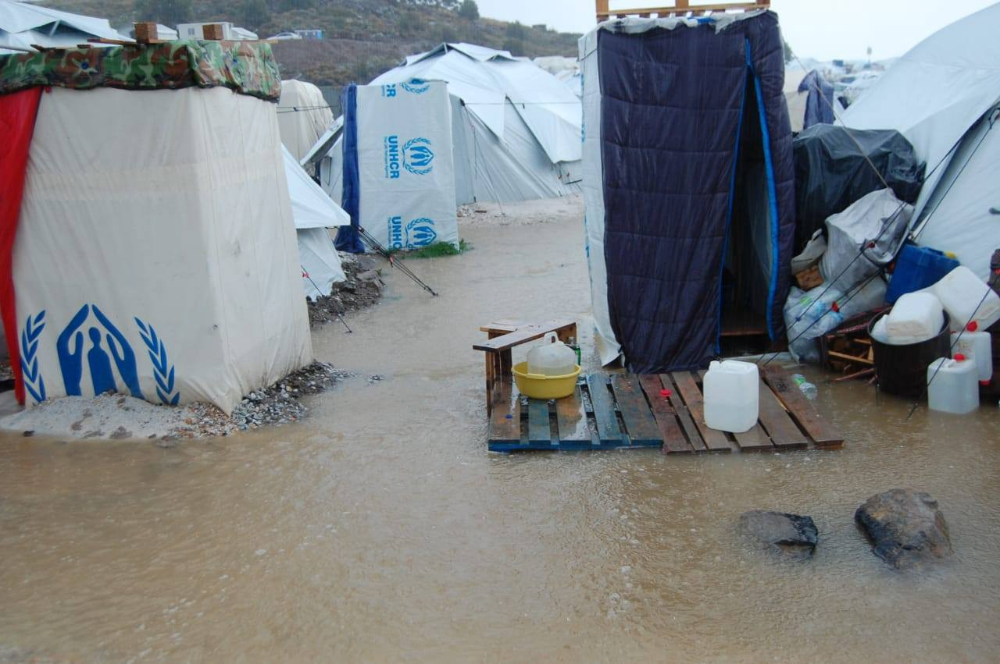
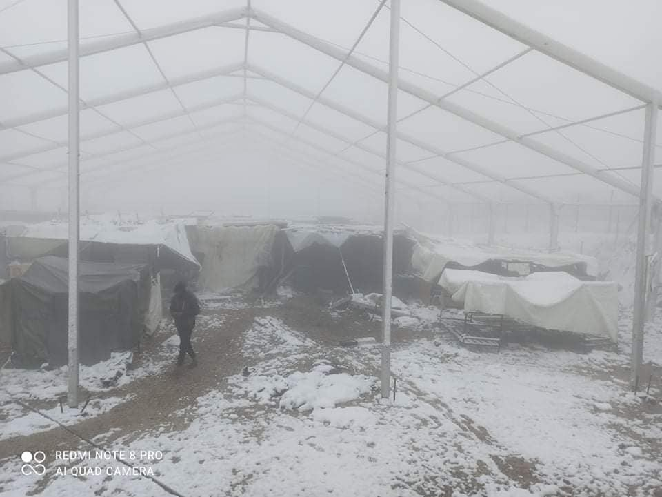
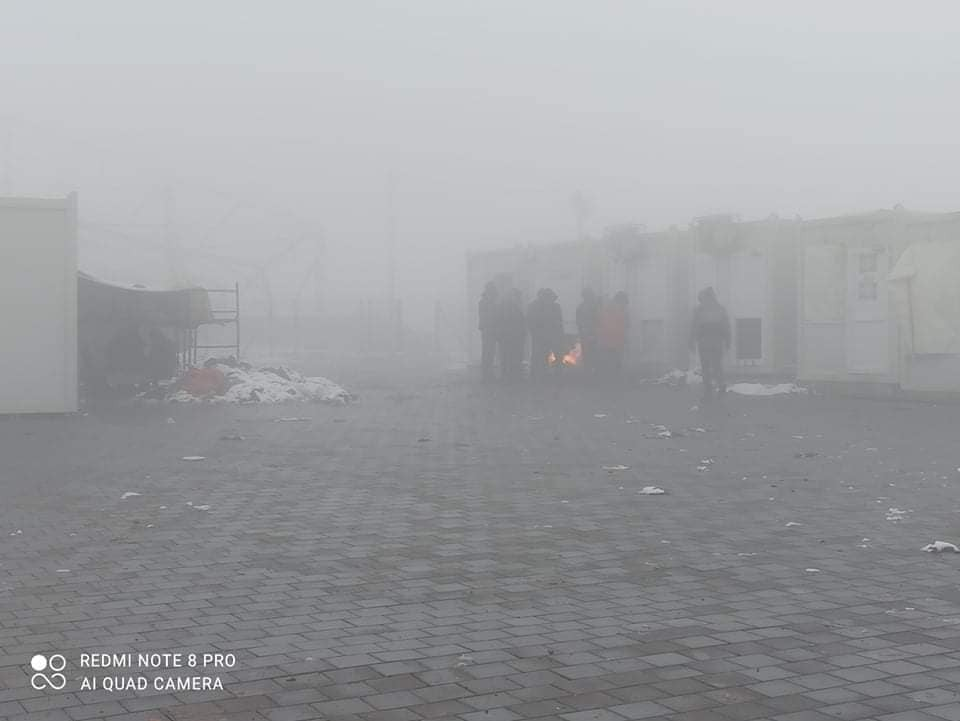
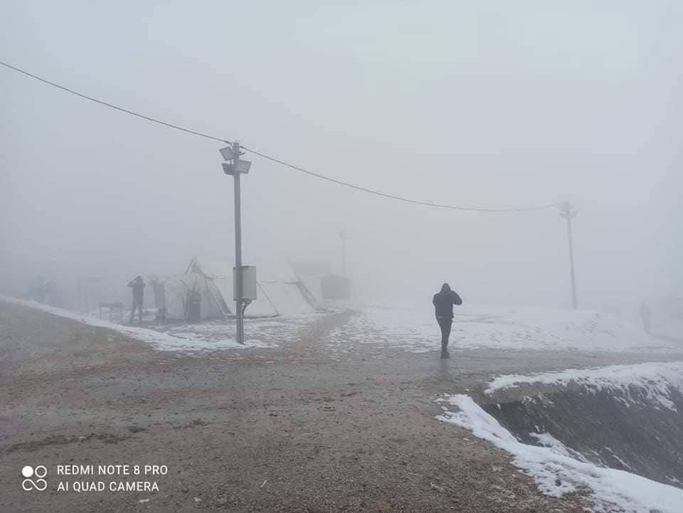
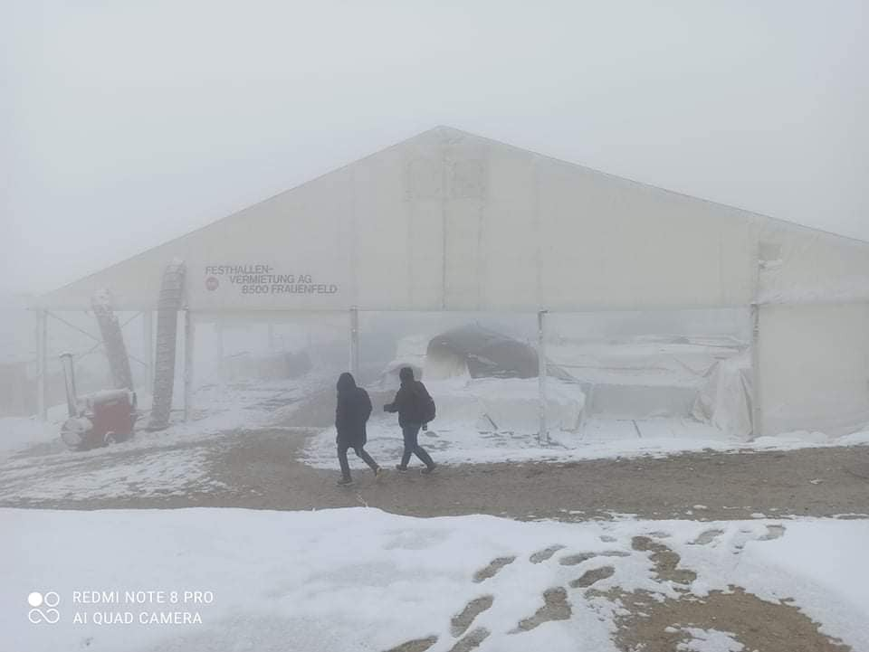
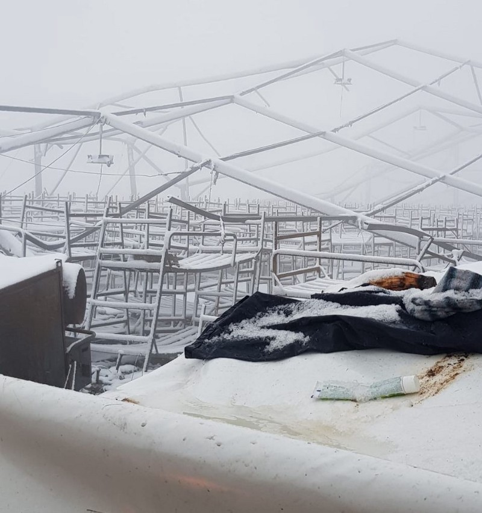
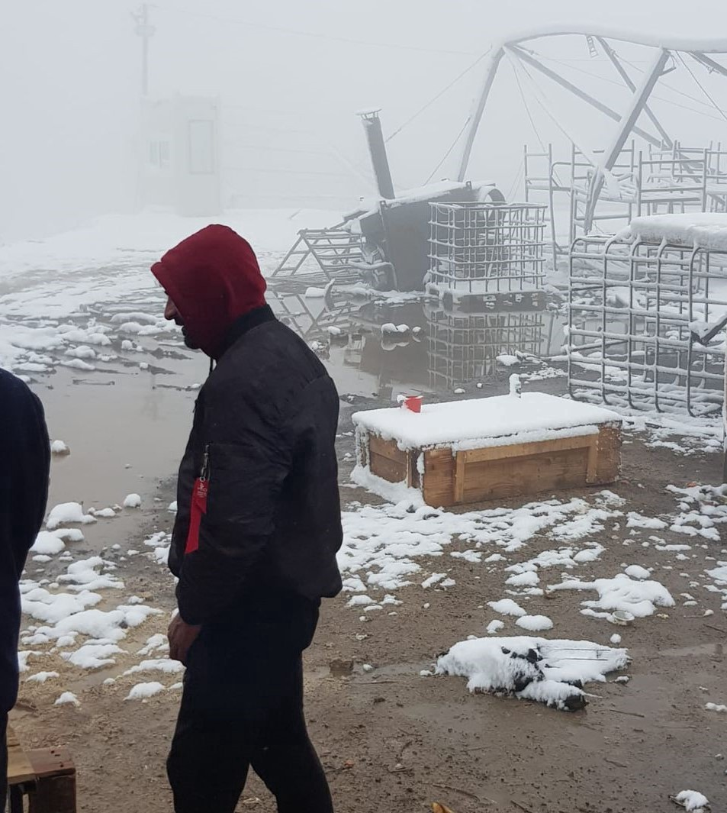

### AYS Weekend Digest 08/01/21–10/01/21: When criminalisation doesn’t pay — the case against Salvini
#### 5 year old dies in Malakasa camp // 3 bodies wash up in Morocco // 35 people in distress at sea // Floods in Moria 2\.0 // Winter in the Balkans // Updates from UK camps and much more…

 — Hundreds of Migrants Left Freezing in Heavy Snow After Their Camp is Torched in Bosnia
Art/text by Luc Descheemaeker
[\#refugees](https://www.facebook.com/hashtag/refugees?__eep__=6&__cft__[0]=AZXVHjme2Fxxlr4WJ6zA9rry_qs05DHvgZu3If2C9chq9Wfwn2lLVKPGXG8Yby8Zcw0ZzvCYduZrR9vPi8j_OkKBocoBM4O-Ce5zslP-1YDt85ESYl84Q8vc7wq23W_Ev3eKRW_w8PvXrwj6m6hBffej&__tn__=*NK*F) [\#noborders](https://www.facebook.com/hashtag/noborders?__eep__=6&__cft__[0]=AZXVHjme2Fxxlr4WJ6zA9rry_qs05DHvgZu3If2C9chq9Wfwn2lLVKPGXG8Yby8Zcw0ZzvCYduZrR9vPi8j_OkKBocoBM4O-Ce5zslP-1YDt85ESYl84Q8vc7wq23W_Ev3eKRW_w8PvXrwj6m6hBffej&__tn__=*NK*F) \)](assets/953c82fbb5fb/1*qYpcI_el8KP9Y8AyW3CvHw.jpeg)

\(Credit: Via [Art Against](https://www.facebook.com/artagainstproject/photos/a.704384742944296/3581426595240082/) — Hundreds of Migrants Left Freezing in Heavy Snow After Their Camp is Torched in Bosnia
Art/text by Luc Descheemaeker
[\#refugees](https://www.facebook.com/hashtag/refugees?__eep__=6&__cft__[0]=AZXVHjme2Fxxlr4WJ6zA9rry_qs05DHvgZu3If2C9chq9Wfwn2lLVKPGXG8Yby8Zcw0ZzvCYduZrR9vPi8j_OkKBocoBM4O-Ce5zslP-1YDt85ESYl84Q8vc7wq23W_Ev3eKRW_w8PvXrwj6m6hBffej&__tn__=*NK*F) [\#noborders](https://www.facebook.com/hashtag/noborders?__eep__=6&__cft__[0]=AZXVHjme2Fxxlr4WJ6zA9rry_qs05DHvgZu3If2C9chq9Wfwn2lLVKPGXG8Yby8Zcw0ZzvCYduZrR9vPi8j_OkKBocoBM4O-Ce5zslP-1YDt85ESYl84Q8vc7wq23W_Ev3eKRW_w8PvXrwj6m6hBffej&__tn__=*NK*F) \)
#### FEATURE: When criminalisation doesn’t pay — the case against Salvini

[Mediterranea](https://mediterranearescue.org/en/news-en/mediterranea-civil-party-in-the-case-against-salvini/) Saving Humans have been accepted as a civil party in the case against Matteo Salvini, the former interior minister of Italy\. He stands accused of **illegal confinement and misuse of authority** \.

> Today is an especially important moment for us: civil sea rescue, the defense of human rights and of the lives of women, men and children attempting to escape Libyan concentration camps and crying for help at sea are not for once the defendants\. They will be, instead, part of the prosecution against a politician who has defacto made his government position a means of violation of principles of humanity, international laws and of the Italian Constitution\. Our decision of joining the civil suit is our way to stand with the main injured parties in this trial, the people rescued by Open Arms who had to endure illegal confinement by those who were in power at the time\. 

[350 people, including 103 children](https://www.nytimes.com/2019/08/16/world/europe/salvini-italy-migrants-open-arms.html) , were refused disembarkation from Open Arms and Ocean Viking vessels during the summer of 2019, during which time calls for evacuation and medical support were repeatedly ignored\. This is the second case against him as he was also accused of holding people on the Gregoretti coast guard ship for five days in 2019

> **Today Mr Salvini is not the only defendant\. The Italian and European governments are also on trial for their continued violation of the Hamburg Convention regarding the obligation of rescue at sea and the Geneva Convention on the prohibition of refugee refoulement** \. 

> Standing in court today to accuse them are those who these \(former\) ministers have always criminalized but who are, instead, guilty of saving lives rather than letting them drown at sea\. 

> Today we point the finger at those ministers and governments, and, on behalf of all those who have suffered for too long, we say: **“We accuse you\.”** 

Salvini faces up to [15 years in prison](https://www.politico.eu/article/matteo-salvini-sicily-kidnap-trial/) and a ban from holding public office\.
#### TURKEY

[Consolidated Rescue Group](https://www.facebook.com/UnifiedRescue/?__cft__[0]=AZU7u5LJ4vczYVT5ZZYFguLEDS4ybyRwdaAAOrQlzgjAVh6XxbKzNqysv4M5ZTjsDnPor4PLxBVaZXtM_JqRW8no-0EDKT8iQ0ihBFBqoRfku7McSPccEUitY9jsECHTFyIKadJ7HSE7TAH1AyoX9uIs&__tn__=%2Cd-UC%2CP-R) report that 84 people were left in an olive grove and told that they had arrived in Italy\. They were actually in the Aydin province of western Turkey\. The people were from Egypt, Syria and Afghanistan and had paid €1000 each to be transported to Europe in a truck\. They were driven around for 30 hours before being abandoned 600km from Istanbul where they were found by locals who called the police\.
#### **SEA**
### Recent sea rescues:

→ On Friday, [AlarmPhone](https://twitter.com/alarm_phone/status/1347447186926284801) sent out a SOS that 11 people were missing between Algeria and Sardinia, but were later rescued by the Algerian Navy\.

→ As we reported on Thursday, [the Moroccan Navy](https://www.infobae.com/america/agencias/2021/01/08/la-marina-marroqui-rescata-21-migrantes-y-2-cadaveres-que-iban-en-una-patera/?fbclid=IwAR311rU19TojcNS885BgjLiK3h6b4DLc8dtYDIFaVBhnnDxpK-I1CtUW73Y) rescued 21 people on a boat\. There were also 2 bodies on the boat, one of a woman and one of a baby\. No explanation was given for their cause of death\. Some people were also reported missing from the boat and their bodies are now coming to shore\. On Friday [two women’s bodies washed up](https://www.facebook.com/AmdhNador/posts/2832564286955828) at Arekmane\. On Saturday [another woman’s body washed up at Arekmane\-Nador](https://www.facebook.com/AmdhNador/posts/2833343903544533) \. There are thought to be 5 people still missing\.
### In distress

[Helena Maleno Garzon reports](https://twitter.com/HelenaMaleno/status/1348271175332458496) that there is a boat currently in distress carrying 35 people, they were at sea all of yesterday during a storm in the Alboran Sea, north of Morocco and Algeria\.
#### GREECE
### Floods in Moria 2\.0

[Moria White Helmets report](https://www.facebook.com/MoriaWhiteHelmets/posts/242688264040907) on the ongoing dire conditions in the camp and their concerns that the work of NGOs, who have dug drainage ditches and brought sand bags, suggests that the problem has been fixed, when clearly it has not\.

> Now is a disaster here again and needs very fast very big action\. Soon there will be very cold weather with snow and then we are sentenced to be cold and freeze\. This is like a death sentence for us and in many winters peoples freezed to death here\. We have no heaters in tents\! \! \! 

 \)](assets/953c82fbb5fb/1*m_P842Hdkh46LzCVtgoZmA.png)

\(Photo Credit: [Moria White Helmets](https://www.facebook.com/MoriaWhiteHelmets/posts/242688264040907) \)

> Please we are wet and soon we will freeze and we need a professional system\. If you don’t care about us ok, but please care about our children now\! We cannot keep them warm and dry\! 

> And please don’t call some sand bags and small rivers a system\. Please look at these pictures: This is a system? And it’s holding? 

> We appreciate a lot all peoples who help here but now is time to say we are in big emergency and we need fast big professional companies and really all of us in camp we are ready to work hard and help\. 

### Solidarity action in Mytilini

The Municipality speakers were hacked over the weekend to share solidarity messages in the capitol of Lesvos\.

■■■■■■■■■■■■■■ 
> **[black raccoon](https://twitter.com/blackracoon16) @ Twitter Says:** 

> > Tonight in the center of #Mytilini the town's hacked speakers send a message: "Share, think, organize and fightback"
#antireport
#RefugeesWelcome #Lesbos #Solidarity #Moria https://t.co/Gra8lEf3df 

> **Tweeted at [2021-01-08 22:03:04](https://twitter.com/blackracoon16/status/1347665147050024962?fbclid=IwAR0gjdP78rToHDDPiQdvi7hLUqYz7P6cvThvS8U3C3K7cVVmZEl8VIZgV1A).** 

■■■■■■■■■■■■■■ 

### 5 year old dies in Malakasa camp, near Athens

■■■■■■■■■■■■■■ 
> **[NoBorders](https://twitter.com/Refugees_Gr) @ Twitter Says:** 

> > Malakasa ; The child was hit by a truck that was working in the construction site . Concentration camps in Europe count many victims, among them many children, victims of inhuman, cruel political decisions #Refugeesgr 

> **Tweeted at [2021-01-09 13:39:59](https://twitter.com/Refugees_Gr/status/1347900932894425088).** 

■■■■■■■■■■■■■■ 

Though there is currently very little information available, [Efsyn\.gr](https://www.efsyn.gr/ellada/koinonia/276020_nekro-prosfygopoylo-sti-malakasa) reported that:

> According to information from the police, the refugee child was dragged to the entrance of the structure by a public use machine, which was carrying out works and at that time was leaving the area\. The child, a member of a nine\-member family originating from Afghanistan, was transported by EKAB ambulance to the “Agia Sofia” Children’s Hospital, where he was pronounced dead\. The driver of the vehicle was arrested\. 

We will keep you updated as more news comes in\.
### \(Another\) accommodation programme ends

In the Greek government’s [ongoing campaign](https://www.infomigrants.net/en/post/25509/greece-reduces-funding-for-migrant-housing-program) to make the lives of people on the move impossible they have announced that the Filoxenia programme, which has been accommodating asylum seekers temporarily in hotels, has ended\. 79 hotels participated in offering 6,898 places\. As of Friday, only 130 people were continuing to stay in 3 hotels, but will be transferred to other living structures later in January\. [Media](https://www.ekathimerini.com/260987/article/ekathimerini/news/filoxenia-program-for-refugees-comes-to-an-end?fbclid=IwAR2KuuoPZ7QjfBlfy28n0bCcK6Vtd7yk0aRwKT_DUqDyE_txhfFGtd2tp1c) report:

> “A number of hotels will remain active for two months to accommodate recognized refugees, especially from facilities on the islands, until they join the Helios program, which promotes the integration of beneficiaries of international protection in Greece\.” 

This of course makes the Helios programme sound like something that actually works…

> To benefit from the HELIOS programme beneficiaries need to have a high level of independence and self\-sufficiency\. Beneficiaries need to provide a tax number, a bank account and procure a rental agreement to receive HELIOS support\. As the Greek bureaucratic system is difficult to navigate, doubly so for non\-Greek speakers, people face enormous challenges in finding accommodation, paying deposits, and enrolling in HELIOS\. Other than the HELIOS programme which is only available to recognised refugees, apart from a few fragmented municipal and NGO initiatives there is no alternative social support, especially at the reception stage, which in Greece can last up to three years\. — [_Human Rights 360_](https://www.humanrights360.org/joint-letter-about-the-exits-of-recognized-refugees-from-accommodation-and-cash-assistance/) 

### Update from Patras

![Update and Photo by No Name Kitchen: “ ‘Sleep, eat, jump, jail, repeat\.’ For the guys, life in Patras means sleeping in old, wet and cold factories, eating food that they buy themselves from the supermarket or from donated food that we distribute\. Almost every day people go for ‘the game’, which means to try to jump over the fences in front of the port, and hide inside or beneath the trucks which will embark the ferry to Italy\. It takes many times until one succeeds\. Often, port authorities catch them during the game, and sometimes, they are even sent to jail, or they are pushed by the Italian authorities back to Greece\. **This week in Patras we reported one pushback and that three guys were released from jail after several weeks\.** ” Read more [here](https://www.facebook.com/NoNameKitchenBelgrade/posts/1159232934474989) \.](assets/953c82fbb5fb/1*Dj6dgl2PS2Jp3VJqEKgXZg.jpeg)

Update and Photo by No Name Kitchen: “ ‘Sleep, eat, jump, jail, repeat\.’ For the guys, life in Patras means sleeping in old, wet and cold factories, eating food that they buy themselves from the supermarket or from donated food that we distribute\. Almost every day people go for ‘the game’, which means to try to jump over the fences in front of the port, and hide inside or beneath the trucks which will embark the ferry to Italy\. It takes many times until one succeeds\. Often, port authorities catch them during the game, and sometimes, they are even sent to jail, or they are pushed by the Italian authorities back to Greece\. **This week in Patras we reported one pushback and that three guys were released from jail after several weeks\.** ” Read more [here](https://www.facebook.com/NoNameKitchenBelgrade/posts/1159232934474989) \.
### International protection cards renewed

[Migration Info Greece](https://www.facebook.com/migrationgovgr.info/posts/1838201563000607) published this update:

> “The validity of the cards of applicants for international protection is renewed until March 31, 2021, regardless of the expiration time of each card\. During this period, the holders of the old cards can receive their new ones from the competent services\.” 

#### ITALY
### Demonstration against pushbacks

A [demonstration took place in Trieste](https://www.ansa.it/friuliveneziagiulia/notizie/2021/01/08/migranti-basta-respingimenti-manifestazione-a-trieste_21faeacb-cf66-42c8-b177-33b241c726a3.html?fbclid=IwAR2FgqIcbQy_1AS81N3t8zaqdm3o05bJYnzpnC5ydVq3jfxiQDtiZPFqlgY) \(northeastern Italy\) at the city’s Croatian consulate on Friday to protest against pushbacks to “publicly denounce the bloody European policies regarding the protection of borders\.”

Almost a hundred activists met in front of the Croatian Consulate in Piazza Goldoni from various groups\. Croatia is the first state in the Schengen area for those arriving via the Balkan route leading to a big concentration of people who have to survive a situation of systemic violence, in addition to the intolerable cold of recent days on the Bosnian border\.
#### **ALBANIA**
### Syrians rescued in Vjosa river delta

[Media](https://www.dailymail.co.uk/wires/ap/article-9129067/Albania-rescues-50-Syrian-migrants-heading-Italy-boat.html?fbclid=IwAR2Eyjh1CecZ8jn84aqTYl0YKpVsv80WRgtORkuZUozMx_2n63uDV8N659M) and [Consolidated Rescue](https://www.facebook.com/UnifiedRescue/posts/1098247987299346) report that 50 to 54 Syrian people en route to Italy by inflatable boat in the Vjosa river delta \(100km south of the capital, Tirana\) were rescued on Friday when they ran into difficulty due to bad weather\. 3 people are thought to have been hospitalised but there is no loss of life reported\.
#### BOSNIA AND HERZEGOVINA
#### Winter at destroyed Lipa camp

Approximately 900 people are still present in the ruins of the camp\.

Photo Credits: Nidzara Ahmetasevic and No Name Kitchen — “‘It is not a living here, but everyday is a survival under these conditions\.’ Eddie, photographer in his country, now stuck in Lipa\. January 2021\. Europe\.”

No Name Kitchen are still present, documenting the situation for those stuck there\.

■■■■■■■■■■■■■■ 
> **[NoNameKitchen](https://twitter.com/NoNameKitchen1) @ Twitter Says:** 

> > People now live in Military tents in #Lipa.

Wait under the cold for a plate of food. Share a space with dozens of people. 

No right to go to the city, to receive your own money, to go to a shop and buy your own food or clothes.

Freedom and dignity? 

📸Eddie and @[Enzorhino2](https://twitter.com/Enzorhino2) https://t.co/T2zGarR3je 

> **Tweeted at [2021-01-10 09:53:27](https://twitter.com/NoNameKitchen1/status/1348206308575612929?fbclid=IwAR0jJ_0r4U7JG4EPVEcHOrT5ejZ_pSKU0cXnk2z9lDtu7VDiSnnpfBwIlQA).** 

■■■■■■■■■■■■■■ 

[SOS Balkan Route have published an update](https://www.facebook.com/SOSBalkanroute/posts/419579009481678) about the situation:

> Lipa remains a sad place where these people experience a humanitarian disaster this winter: Located in the middle of the Bosnian mountains, people struggle mainly with minus degrees\. Many have not yet moved into the new tents — at least yesterday afternoon — and in some cases, many people with flip flops are still walking through the snow\. 

### Aftermath of Blazuj camp fire

On Friday, [a fire](https://balkans.aljazeera.net/news/balkan/2021/1/8/gori-migrantski-kamp-kod-blazuja?fbclid=IwAR2YkUCfKp_PYtZhD4oQJstD9nIrQAbtE92dmIfvs9a3mzmH-vZ3X46f-Uc) broke out unknown reasons in Blazuj’s refugee camp and was later distinguished that night\. [Videos](https://twitter.com/th1an1/status/1347643380864581637?fbclid=IwAR0N7MPrfyq9429h9UhNsuv4EC8AmPmv-7T1NQDg1yOYkP3W2JKjmyiJ-io) posted on social media showed at least one of the main containers completely engulfed in flames\. [Reports](https://www.klix.ba/vijesti/crna-hronika/gorio-mobilni-kontejner-u-migrantskom-kampu-u-blazuju/210108133?fbclid=IwAR3a4wBTREDbRcxmuiESH_HluUMYvSk2G-cRC-ZQHuGN9abdKiN_xKn89go) says that thankfully no one was hurt\.

■■■■■■■■■■■■■■ 
> **[Hannah Parry](https://twitter.com/Hannahtraveller) @ Twitter Says:** 

> > Bosnia - still trapped near the remains of the burnt down camp, watching while more unsuitable accommodation is erected. This is not a safe place for people. #lipacamp @[EU_Commission](https://twitter.com/EU_Commission) @[NoNameKitchen1](https://twitter.com/NoNameKitchen1) #bih #humanrights #refugees https://t.co/OqHeWZUyDP 

> **Tweeted at [2021-01-08 13:49:44](https://twitter.com/Hannahtraveller/status/1347540996503048194?s=20&fbclid=IwAR1VFVJgNiJ-Exh5htnE4b-VbKU8PNNC_PFd0aY8Im5YFQJfSkHiwEVsD5M).** 

■■■■■■■■■■■■■■ 

### Velika Kladuša

![UPDATE & photo by Wir packen’s an e\.V\. → “The \#HungerGames by Velika Kladuša: We are on the EU external border in Bosnia \. Thousands wait here for months for a chance to get into the rich zone, the only thing they have to do is to overcome the \#FestungEuropa, guarded by a highly armed police\. Many people who have made it this far vegetate in the forest under miserable conditions\. The residents of the muddy forest on the hillside have put together a kind of tent as a makeshift\. The slope is extremely slippery\. We distribute sleeping bags\. Some people don’t even have shoes when the temperature is around 0°\. You dream of making it to the rich EU, try 1x, 2x, 50x\. Most of them are picked up again and again, mistreated in violation of international law and sent back\. Human dignity is inviolable?\! You can read the full report of our first day in Velika Kladuša on our website\.”](assets/953c82fbb5fb/1*ZEldeT5Mm9o57iAWP_ukgg.jpeg)

UPDATE & photo by Wir packen’s an e\.V\. → “The \#HungerGames by Velika Kladuša: We are on the EU external border in Bosnia \. Thousands wait here for months for a chance to get into the rich zone, the only thing they have to do is to overcome the \#FestungEuropa, guarded by a highly armed police\. Many people who have made it this far vegetate in the forest under miserable conditions\. The residents of the muddy forest on the hillside have put together a kind of tent as a makeshift\. The slope is extremely slippery\. We distribute sleeping bags\. Some people don’t even have shoes when the temperature is around 0°\. You dream of making it to the rich EU, try 1x, 2x, 50x\. Most of them are picked up again and again, mistreated in violation of international law and sent back\. Human dignity is inviolable?\! You can read the full report of our first day in Velika Kladuša on our website\.”
#### **FRANCE**
### People on the move denied entry to supermarket

On Friday 8, at 5pm CRS police were deployed to a supermarket, Auchan Dunkerque, in order to prevent entry to people on the move\. They did not have their RIO numbers visible\. The [intervention of activists](https://www.facebook.com/SolidarityBorder/posts/417083379632107) stopped the checks but the police called for reinforcements and remained in position\.

A blatantly racist policy, which is illegal, and designed to prevent people from accessing food based on the colour of their skin\. Welcome to 2021…

■■■■■■■■■■■■■■ 
> **[Human Rights Observers](https://twitter.com/HumanRightsObs) @ Twitter Says:** 

> > ⚠️⚠️⚠️Hier soir à @Auchan #GrandeSynthe
Délit de faciès et interdiction d'entrée au magasin.
Des #CRS empêchaient l'entrée pour toutes personnes ressemblant à des personnes exilées.
Nous dénonçons ces discriminations qui résultent du racisme d'Etat flagrant à la frontière https://t.co/0uOEkHyXaM 

> **Tweeted at [2021-01-09 13:18:37](https://twitter.com/HumanRightsObs/status/1347895555322687490?fbclid=IwAR0VKPo6wvdikU9H3WmzCgyk0isLpIVJxqdL7XjECAgVtrHekMjAqRrvvoc).** 

■■■■■■■■■■■■■■ 

### Evictions continue in Calais

■■■■■■■■■■■■■■ 
> **[Human Rights Observers](https://twitter.com/HumanRightsObs) @ Twitter Says:** 

> > Ce matin, #Calais se retrouve glacé..
Néanmoins, les personnes exilées qui tentent de survivre dans ces conditions ont subit 5 #expulsions de lieux de vie
Au moins une quinzaine d'abris ont été saisis
1 arrestation arbitraire

Quand peut-on commencer à parler de nécropolitique? https://t.co/bxXu0MQm3e 

> **Tweeted at [2021-01-09 21:09:41](https://twitter.com/HumanRightsObs/status/1348014102124359681).** 

■■■■■■■■■■■■■■ 

#### NORWAY
### 40% less asylum seekers arrived in 2020

Compared to 2019, Norway saw 40% fewer asylum seekers last year; 2,305 people compared to 1,387 people\. The Directorate of Immigration \(UDI\), Frode Forfang, says this is because of the travel restrictions due to the COVID\-19 pandemic\. The numbers of unaccompanied minors decreased as well, from 135 people to 88 people\. [Nettavisen News](https://www.nettavisen.no/nyheter/innenriks/40-prosent-farre-asylsokere-i-2020/s/12-95-3424071109?fbclid=IwAR1aFVTtukakxw9VgqtBH3k8AwVQqVT_Mz-0rQvwBlOZ2ElhQ0i2Th7uiIs) also reported that:

> “In 2020, the number of residents in the UDI’s reception went below 2,000 for the first time since 1997\. On 1 January, 1,766 people lived in the reception centers, down from 2,532 at the beginning of 2020\.” 

#### UK
### Protests and attempted suicide in Napier Barracks, Folkestone

[Care for Calais report](https://care4calais.org/news/please-help-us-purchase-warm-winter-clothes-for-refugees-housed-in-folkestone-barracks/?fbclid=IwAR3H2OlBWyLpIJTxrD6c3jSM0tXaXM5YSGZdScURaxIj1ObF8Cj1pYrQZuM) that people are sleeping outside in order to protest the living conditions in the barracks and the [long delays in their asylum claims](https://twitter.com/hackneylad/status/1347992759962112004?fbclid=IwAR2FgqIcbQy_1AS81N3t8zaqdm3o05bJYnzpnC5ydVq3jfxiQDtiZPFqlgY) \.

> Last night the temperature in Folkestone was 0 degrees\. Tonight it will drop to \-2\. 

> Some of our friends at Napier Barracks, where the Home Office is housing over 400 asylum seekers, slept outside last night in protest of the conditions there\. They feel that they have no other way for their voices to be heard\. They are frustrated and exhausted, having spent months being told by the barracks managers that they will be moved to more suitable accommodation\. 

The conditions are unsurprisingly having a negative impact on the mental health of people housed there leading to another suicide attempt\.

> Asylum seekers are some of the most resilient people we know\. They have fled war, persecution and injustice, have crossed continents and survived more than we could ever imagine in the hopes that they would finally be safe and happy in the U\.K\. It should not be here that they lose hope\. 

### Sentencing on Monday for the 4 convicted in the 2019 manslaughter case of 39 migrants

> “The bodies of 29 men, 8 women and 2 boys were found by lorry driver Maurice Robinson inside a sealed container at the southeastern English port of Purfleet on October 23, 2019\. Before being discovered, the bodies had been sealed inside the container for at least 12 hours in high temperatures\. A forensic expert said it would have taken about nine hours for the air to turn toxic in the trailer, with death coming soon after, according to AFP\. The victims were aged between 15 and 44\. Prosecutors have said the trapped migrants were unable to get a phone signal inside the container\.” 

### Home Office ignoring claims of horrible food conditions in Penally camp

[The Independent newspaper](https://www.independent.co.uk/news/uk/home-news/home-office-penally-asylum-seekers-food-conditions-b1784011.html?fbclid=IwAR0HC6TieqKSVOMZvFKBi9BcxBVmph-N-alBewKddXcLAq0l0gtJGsiGdLs) just published a report on the conditions of the food provided in Penally camp, and how the Home Office seems to be ignoring people’s complaints\. First they told the Independent that “no complaints were made” but then retracted that statement when the newspaper sent in a video of a asylum seeker showing the food to an onsite worker\. They said there is an investigation into the matter\.
#### WORTH READING
- [Mare Liberum](https://mare-liberum.org/en/news/moria-2-censorship-fear-and-the-loss-of-freedom-of-press/?fbclid=IwAR2G4noWcxLHP2PRfO_F8-WMNOpmHVIHH9inNJ3V_OhrxPlgx1Lm66O5e3g) just published **Moria 2: Censorship, Fear and the Loss of Freedom of the Press\.** Very good recent analysis of the events since Christmas\.
- Reporter Tihomir [Sabchev](https://twitter.com/TihomirSabchev/status/1347598268969185280) tweeted a very informative thread on Poland giving the highest number of first residence permits to third country nationals in 2019\. “ _So Poland, which is extremely reluctant to accept any refugees, has actually become a major destination for immigrants in the last years\. The government however does not want to introduce integration measures, so who is stepping in? Cities of course\. But a major problem is that they do not have funds & expertise\. So how do they manage to develop integration strategies? With EU funding & collaboration with civil society, city\-networks, UN organizations_ \.” [Check out this article](https://content.sciendo.com/view/journals/ppsr/8/2/article-p22.xml) describing local city integration policies\.
- [Why is Republika Srpska a forbidden territory for migrants?](https://www.slobodnaevropa.org/a/za%C5%A1to-je-republika-srpska-zabranjena-teritorija-za-migrante-/31039871.html?fbclid=IwAR2zjyin08qxWx9id9wP1nbvQH_eVWlUlri0pGtuJ4yUZ-OqMIEAezxVtDE) — The latest Radio Free Europe Bridge discusses the tragedy of migrants and refugees who are waiting in vain in Bosnia and Herzegovina for the EU to open its borders with Nidzara Ahmetasevic from Sarajevo and Dragan Bursac from Banja Luka\.
- [Suppression, Spikes, and Stigma: How COVID\-19 Will Shape International Migration and Hostilities toward It](https://journals.sagepub.com/doi/full/10.1177/0197918320968754?fbclid=IwAR3mQSe7seaRC3z8iPvkVZAGMbSGaJAMSRyafzRg5Mv4FfTDHdKDR-pvwxQ) — By April 1, 2020, nine out of 10 people in the world suddenly lived under travel or immigration restrictions intended to curb the spread of COVID\-19\. Not surprisingly, in some countries, political leaders who were already opposed to immigration immediately used this crisis as an opportunity to halt asylum seeking, deport refugees, threaten the free movement of indigenous populations, and suspend temporary work visas for both high and low\-skilled migrants\. While these border closures are a response to an external shock unrelated to migration, we argue that the impact of these closures will have medium\- and longer term consequences for international migration\.

**Find daily updates and special reports on our [Medium page](https://medium.com/are-you-syrious) \.**

**If you wish to contribute, either by writing a report or a story, or by joining the info gathering team, please let us know\.**

**We strive to echo correct news from the ground through collaboration and fairness\. Every effort has been made to credit organisations and individuals with regard to the supply of information, video, and photo material \(in cases where the source wanted to be accredited\) \. Please notify us regarding corrections\.**

**If there’s anything you want to share or comment, contact us through Facebook, Twitter or write to: areyousyrious@gmail\.com**

_Converted [Medium Post](https://medium.com/are-you-syrious/ays-weekend-digest-08-01-21-10-01-21-when-criminalisation-doesnt-pay-the-case-against-salvini-953c82fbb5fb) by [ZMediumToMarkdown](https://github.com/ZhgChgLi/ZMediumToMarkdown)._
