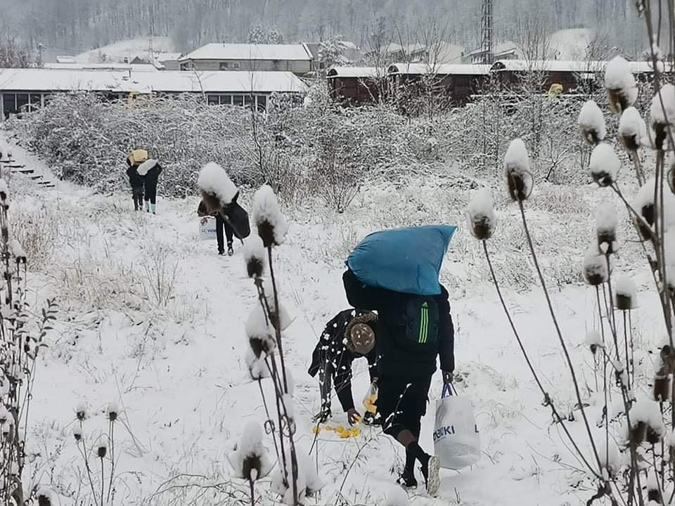

### AYS Daily Digest 11/1/2021 — OLAF Investigating Frontex
### Journalists denied entry into Lipa camp//Commissioner for Human Rights publishes reports on Croatia pushbacks//Hungary violated EU Court ruling//

[Are You Syrious?](?source=post_page-----619f7514d6f9--------------------------------)

[Jan 12](ays-daily-digest-11-1-2021-olaf-investigating-frontex-619f7514d6f9?source=post_page-----619f7514d6f9--------------------------------) · 8 min read

### FEATURE
### Frontex under investigation

Frontex may have [gotten new uniforms](https://twitter.com/stand_for_all/status/1348684568258359296?fbclid=IwAR2n1PjwNgxsXnPdeYi6l5da5p2UNP0pFJHX4InmJhhYYrabrJrdwAJiHGE) and announced a [new deal with Europol](https://twitter.com/lk2015r/status/1348684691143012356?fbclid=IwAR2qzIgmKaU8BjwpBDbS-hUaTK5g4LluRXU0JRjU90bzH9pqlovWNd0Swus) , but this is not enough to distract from their misconduct\. The EU anti\-fraud office OLAF, which also investigates breaches of duty, announced that they are [investigating the agency](https://twitter.com/matthimon/status/1348697817578147843) \.

[According to the EU Observer](https://euobserver.com/migration/150574) , this investigation has been going on since at least early December, when OLAF raided the offices of Fabrice Leggeri and his chief of cabinet in Warsaw\. Although a Frontex spokesman said that OLAF visits are normal for any EU agency and do not mean that there have been misdeeds, Frontex has been under fire for months for alleged misconduct, especially after Leggeri lied in front of the European Parliament\. The Frontex chief is set to appear in front of the Bundestag in a few days\.

OLAF did not confirm details to any reporters, as the investigation is still ongoing, but a [source told SPIEGEL that](https://www.spiegel.de/politik/ausland/frontex-skandal-anti-betrugsbehoerde-ermittelt-gegen-eu-grenzschutzagentur-a-36d882d3-3b14-46bc-aa4b-d1129bcdc065?fbclid=IwAR2_bsrchmxiFRgJIZ8KC_pV1m9KQ_Bt_Pf3ZivEQQxLHvHTWhjNWCs9M9g) “the matter goes all the way to the top\.” The same paper broke news of the EU border agency’s misconduct and cover\-ups of its involvement in illegal pushbacks, which implicated officials including Leggeri himself, back in October\.

Even as the agency is under investigation for misconduct, Greek Prime Minister Mitsotakis made sure to thank the [Portuguese participants in Frontex](https://www.ekathimerini.com/261087/article/ekathimerini/news/greek-pm-thanks-portugal-for-frontex-contribution?fbclid=IwAR1qlakrMtVtrod8gE47AI44eip9dTFUKJoI-ElJWaB63Se7rsJnpVNCCB8) for their “contribution” on a visit to Lisbon\.

In addition to the OLAF investigation, Frontex is [currently under investigation](https://twitter.com/lk2015r/status/1348749486617669640?fbclid=IwAR2M0wkckF-chsi_v7-XKB6HhOlqdK32YoK96SUxpBRLTRLMbdJ_zqwxMPo) by the Management Board, the European Ombudsperson and there is a proposal in the EU Parliament to open an investigation as well\.
### SEA
### Rescues and deaths at sea

The Ocean Viking is [patrolling in the Mediterranean again](https://thecivilfleet.wordpress.com/2021/01/11/ngo-refugee-rescue-ship-back-on-patrol-after-detention-in-italy/?fbclid=IwAR0XOvx04ET5T32UVtfsbKG5aWzEQpY_nUMe1ctpZqrp2T4kLPpgfoux2ww) after six months’ administrative detention in Italy and after spending some time docked in its home port of Marseille\.

Its return is important because the need for rescues at sea is just as great as ever\. Thirty\-seven [people](https://twitter.com/alarm_phone/status/1348605666789875713?fbclid=IwAR2n1PjwNgxsXnPdeYi6l5da5p2UNP0pFJHX4InmJhhYYrabrJrdwAJiHGE) have gone missing in the sea between Morocco and Spain and still have not been found\. A total of [55 people](https://www.infomigrants.net/en/post/29556/syrian-migrants-rescued-off-albanian-coast?fbclid=IwAR2qzIgmKaU8BjwpBDbS-hUaTK5g4LluRXU0JRjU90bzH9pqlovWNd0Swus) were rescued by Albanian police off the coast of the town of Vlorë\. And sadly, [one person died](https://www.eldiario.es/canariasahora/migraciones/muere-migrante-cayuco-llego-costa-tenerife-sexta-victima-ruta-canaria-2021_1_6740398.html?fbclid=IwAR1bjeQuISysjLVzI8Q1vIZsar9YfBLN7G-nCcJfIdulA3hbJmFd3KEq4RM) off the coast of Tenerife, already the sixth person to die on the Canary Islands route in 2021\.

Conditions are set to get worse in the next few days as [a big storm](https://twitter.com/alarm_phone/status/1348558101604159488?fbclid=IwAR2zZ5v6084l5FxlMs41fLAPQXIw2eGpLeZx6vth-5aKmhi8T2pPBerT7tE) is approaching the Central Mediterranean\.
### GREECE
### Winter weather leaves people out in the cold

People in Moria 2\.0 are living in horrible conditions in a camp that, despite government assurances, is most certainly not winter\-proof\. On Sunday, parts of the camp flooded even though much noise was made about drains that were supposed to weatherproof the camp\. The government is working to conceal conditions in the camp as much as possible by [preventing visitors and NGO](https://www.facebook.com/nobordersnetwork/posts/3661135537287645) workers from sharing evidence of conditions in the camp\.

The situation will probably deteriorate this week\. The Greek National Meteorological Service warned of [winter weather conditions](https://www.keeptalkinggreece.com/2021/01/11/greece-weather-warning-rainf-storms-wind-temperature-drop-snow/) until Wednesday\. Heavy rainfalls, strong winds and sometimes hail will hit certain regions, including the Aegean\. On Friday and Saturday, temperatures are expected to drop to freezing\.
### Greece in the news:

Politico [published an article](https://www.politico.eu/article/police-brutality-on-the-rise-in-locked-down-greece-activists-warn/?fbclid=IwAR2qzIgmKaU8BjwpBDbS-hUaTK5g4LluRXU0JRjU90bzH9pqlovWNd0Swus) on the growing police brutality and suppression of protest in Greece, with the excuse of stopping coronavirus\. We wrote about this issue, especially as it affects people on the move and solidarity workers, as part of our [end\-of\-year specials series](ays-special-from-greece-militarisation-a-tendency-in-2020-dd8c1e162852) \.

[The Guardian published an article](https://www.theguardian.com/world/2021/jan/11/its-incredible-why-do-two-convicted-greek-neo-nazis-golden-dawn-remain-at-large?fbclid=IwAR2q7IaXEBZmeYB0D0rdwJhbVpmr0ujNb9-vpcBQRZ0-t9QQV-xou3gkI4E) on two high\-ranking members of the neo\-fascist party Golden Dawn, Christos Pappas and Ioannis Lagos, who are still at large despite their convictions in October\. Some speculate that Pappas is hiding abroad in an Orthodox monastery, while Lagos is still an MEP and has remained in Brussels\.

InfoMigrants published an insightful [article on local opposition](https://www.infomigrants.net/en/post/29545/greece-facing-opposition-on-new-migrant-camps?fbclid=IwAR1k6Vn_PeG7SCrXN_iNkqv5XN04dHo5TyqJEG-urMMgqJ-J5EUSvIgxbRc) to new closed centers being built in Evros and Leros\. In both cases, local leadership complained that the national government ignored their input\.

Three young students, working with [Solomon magazine](https://www.facebook.com/wearesolomon/posts/1323770464637991) , created a short film, “Blurred Futures,” following two asylum seekers as they navigate cruel bureaucracies, trauma and other challenges\. You can view the film for free [here](https://www.youtube.com/watch?fbclid=IwAR2XfUa9fpdzNBtiHOAoIXAT8cLUKYdYF6_qt2u65PUL6RI309T6IWFdO6U&v=vrvYPhQms2A&feature=youtu.be) \.

Help people on the move in Vial camp get access to mandarins, onions and potatoes\! Learn more and donate [here](https://www.facebook.com/ruhi.akhtar.7/posts/4198893023460907) \.
### SERBIA
### Retaliation against children for seeking help

An unaccompanied minor who also suffers from epilepsy turned to the NGO [Asylum Protection in Serbia](https://twitter.com/APC_CZA/status/1348692759390130178) for help, as he was being kept in awful living conditions\. In retaliation, the camp administration confiscated his camp card\. Punishing children for reaching out for help is unacceptable\!

UNHCR published their monthly update on Serbia, available [here](https://reliefweb.int/report/serbia/unhcr-serbia-monthly-update-december-2020?fbclid=IwAR29oAGAr8JpEfhJeFKJX6J39OWwLUA1KBEwykbZSTLeBDld4EfPzRDJ-9k) \.
### BOSNIA & HERZEGOVINA
### Journalists barred entry into Lipa camp

The authorities are denying access to journalists who want to report on conditions in Lipa camp\. Over the weekend, a crew from ARD was first denied permission to film inside the camp, with a guard citing “s [trict instructions from above](https://twitter.com/ARDstudioWien/status/1348183845787602944?fbclid=IwAR29oAGAr8JpEfhJeFKJX6J39OWwLUA1KBEwykbZSTLeBDld4EfPzRDJ-9k) \.” Eventually, the crew were allowed to film the tents for only ten minutes\. Journalists from ARD were denied entry [again today](https://twitter.com/limpertainment/status/1348561176947515403?fbclid=IwAR3rR8pDb6wPTQ1LRqMFwVby7zlaFIdbIJkLuJi1WuiquOhROYlipp7qKPw) \.

This Spanish news crew was able to film conditions in Lipa, where people are exposed to the cold, receive inadequate food, and guards commit violence with impunity on camera\.
### CROATIA
### Commissioner for Human Rights publishes report on pushbacks case

Commissioner Dunja Milatović [published her observations](https://www.coe.int/en/web/commissioner/-/commissioner-publishes-observations-on-summary-returns-of-migrants-from-croatia-to-bosnia-and-herzegovina?fbclid=IwAR2XfUa9fpdzNBtiHOAoIXAT8cLUKYdYF6_qt2u65PUL6RI309T6IWFdO6U) on the case of three Syrians who were illegally pushed back from Croatia to Bosnia & Herzegovina\. Her report affirmed that pushbacks to Bosnia & Herzegovina [are an “established practice](https://twitter.com/ChrisMommers/status/1348628832350302215?fbclid=IwAR2fg_0JgxeORvF6OWRcbTD6RkWIIWHCSHJDcWP1oHEalJvVxp7VGM_tpuk) ” among Croatian police, that mistreatment is widespread, and that people should not be returned to BiH because of the difficult humanitarian situation for people on the move there, caused largely by Croatia’s border policy\.
### HUNGARY
### Hungary violated EU Court ruling against pushbacks

Last month, the European Court ruled that Hungary violated EU asylum laws by conducting illegal pushbacks to Serbia and otherwise violating people’s human rights\. In the month since the ruling alone, the Hungarian government has carried out [over 2,300 pushbacks](https://euobserver.com/migration/150555?fbclid=IwAR1Cu3Qch5vnLe2NysUamrfnVTn3Jy9_yU3ArAL5V1mjOosrNHOrStxtScM) \.

Frontex is also facing heavy criticism for its involvement in pushbacks in Hungary\. Although Leggeri has previously said Frontex would withdraw if Hungary commits serious violations of EU law, the agency continues to participate in border surveillance\. It has ignored information dating several years back about Hungary’s violation of human rights, including reports from its own humanitarian officers\.
### MALTA
### Three people sentenced for trying to leave Malta

Three people on the move were sentenced to [six months in jail](https://timesofmalta.com/articles/view/migrants-who-tried-to-slip-out-of-malta-in-container-end-behind-bars.843666?fbclid=IwAR3fpSxMgOtNGua97QompRmSBfreloClnjs9fpUAZRHOgFJJP30KQdPPXfU#.X_xpP3jj7Y4.twitter) for trying to leave Malta in a shipping container\. While we do not know why the people were trying to leave Malta, it is worth remembering that detention conditions for people on the move in Malta [have been criticized](https://asylumineurope.org/reports/country/malta/detention-asylum-seekers/detention-conditions/conditions-detention-facilities/) for overcrowding, poor sanitation, and more\.
### SPAIN
### Confusion Over Gibraltar Border

Following Brexit, [Frontex was supposed to manage the Gibraltar borders](https://netzpolitik.org/2021/brexit-folgen-spanien-will-grenzueberwachung-in-gibraltar-uebernehmen/?fbclid=IwAR2M0wkckF-chsi_v7-XKB6HhOlqdK32YoK96SUxpBRLTRLMbdJ_zqwxMPo) and share responsibilities with Spanish national authorities\. However, the Guardia Civil is taking on sovereign tasks in the exclave\. The last\-minute Brexit agreement did not fully smooth out details for the enclave, which will remain in the Schengen Agreement\.
### FRANCE
### People needed in Paris tomorrow

Solidarite Migrants Wilson is looking for people for their action tomorrow\. More information [here](https://www.facebook.com/permalink.php?story_fbid=1633826163484816&id=598228360377940) \.

GERMANY

Members of Parliament urge government to allow more people on the move into the country

As many as 250 members of parliament from various parties signed on to the “ [Christmas appeal](https://neoskosmos.com/en/183221/almost-250-of-germanys-709-members-of-parliament-are-urging-the-government-to-allow-in-more-refugees-stuck-in-greece/?fbclid=IwAR1iUFggg99egOyDll5c9MtIVmedEPLp3qR3wzShnQ6bpsZwgZTLIyt9VZY) ” urging the national government to follow the wishes of municipalities calling to take in more people on the move from Greek island camps\. Local authorities have been pleading with the federal government to increase transfers for months\.

Interior Minister Horst Seehofer said that “ [we are on the right path](https://www.dw.com/de/seehofer-zahl-der-asylantr%C3%A4ge-um-knapp-ein-drittel-gesunken/a-56188355?fbclid=IwAR1k6Vn_PeG7SCrXN_iNkqv5XN04dHo5TyqJEG-urMMgqJ-J5EUSvIgxbRc) ” because asylum applications in Germany have dropped about 30% compared to last year\. He cited the ongoing pandemic and border control measures as the causes for the drop in applications\. However, as [Pro Asyl pointed out](https://twitter.com/ProAsyl/status/1348551517268307969?fbclid=IwAR2q7IaXEBZmeYB0D0rdwJhbVpmr0ujNb9-vpcBQRZ0-t9QQV-xou3gkI4E) , these figures only show the extent of the EU’s cruel border policy, even as the number of displaced people worldwide has grown\.

UK

Home Office rules on inadmissibility creating crueler system

The Home Office’s new rules on deciding which [asylum claims are inadmissible](https://righttoremain.org.uk/the-new-asylum-inadmissibility-rules/?fbclid=IwAR1Cu3Qch5vnLe2NysUamrfnVTn3Jy9_yU3ArAL5V1mjOosrNHOrStxtScM) will not make processing people’s cases any easier, but will make the system even more difficult to navigate\. The new rules say that any person who came to the UK through a safe third country will automatically have their case dismissed\. However, after Brexit the UK has very few agreements on deportations with other countries\. The rules are also unclear as to how the Home Office will determine that a person passed through a third country, as the UK no longer has access to European information systems\. The rule changes will only create more delays and trap people in legal limbo where they cannot access asylum and cannot be deported\.

The rules are about politics and presentation, not governance\.

A more detailed explanation of the new rules can be found [here](https://www.freemovement.org.uk/briefing-new-uk-approach-to-refugees-and-safe-third-countries/?utm_source=rss&utm_medium=rss&utm_campaign=briefing-new-uk-approach-to-refugees-and-safe-third-countries&fbclid=IwAR2n1PjwNgxsXnPdeYi6l5da5p2UNP0pFJHX4InmJhhYYrabrJrdwAJiHGE) , by Colin Yeo\.

Other policies and operations by the Home Office showcase the agency’s cruelty\. Despite frequent claims that strict, militarized border regimes are in place to “fight smuggling and trafficking,” the UK government has done very little to help trafficking victims\. Instead, [it rejected a plan](https://twitter.com/freedomunitedHQ/status/1348669851963944960?fbclid=IwAR27OunagRNkPDq3VLGtWjwgzg7PS610sNOrewK_uyqFTjpxEb8_224UthA) proposed by advocacy groups and MPs that would give survivors an automatic twelve\-month leave to stay so they could recover from their ordeal\. The Home Office said that it cannot grant blanket stays of deportation to groups but that it protects [survivors who are “vulnerable](https://www.theguardian.com/politics/2021/jan/11/home-office-minister-rejects-plans-for-extra-support-for-trafficking-victims?utm_term=Autofeed&CMP=twt_gu&utm_medium&utm_source=Twitter#Echobox=1610367628) ” — however, the process to determine who is a trafficking survivor deserving of protection is long and grueling, often retraumatizing survivors for nothing\.

The UK also has no plan in place to resettle people on the move, as the Vulnerable Persons Resettlement Scheme is set to end in March\. Between April and November of 2020, [the government resettled no people](https://twitter.com/refugeecouncil/status/1348657595326857217) on the move, essentially killing this important, if limited, humanitarian scheme\.

Even during a pandemic, the Home Office prioritizes deportations and cruelty, at the direct expense of public health and individual safety\. After last month’s COVID\-19 outbreak in Brook House, a detention centre near Gatwick Airport, the government shuffled people [around to other centres](https://www.independent.co.uk/news/uk/home-news/immigration-detention-centre-closed-covid-outbreak-home-office-b1784499.html?fbclid=IwAR1Cu3Qch5vnLe2NysUamrfnVTn3Jy9_yU3ArAL5V1mjOosrNHOrStxtScM) instead of releasing them from detention\. Conditions in detention centres are overcrowded and provide fertile ground for COVID\-19 to spread\. Deportation flights are also prime vectors where COVID\-19 can spread — and people [have been infected](https://www.theguardian.com/world/2020/dec/05/prisoner-deported-uk-jamaica-test-covid-19-windrush-coronavirus) on deportation flights from the UK before — yet the Home Office has scheduled [two flights for next week](https://twitter.com/BIDdetention/status/1348588413650427908?fbclid=IwAR2n1PjwNgxsXnPdeYi6l5da5p2UNP0pFJHX4InmJhhYYrabrJrdwAJiHGE) \.

[Over 150 people](https://www.bbc.com/news/uk-england-55609286) crossed the Channel in small boats over the weekend\.

Are you based in London? Care 4 Calais is looking for volunteers\! Learn more [here](https://www.facebook.com/care4calais/posts/3972945156071745) \.

GENERAL

Call for contributions on pushbacks

WORTH READING

The Guardian published an [anonymous testimony](https://www.theguardian.com/global-development/2021/jan/11/bhasan-char-inside-bangladesh-controversial-refugee-camp-a-photo-essay?fbclid=IwAR3fOTTqN6FztawN7c9BEKOlE2gFItRh1KzzxdTJAnlXk-Y-JC3rd8pjBlM) from a Rohingya person who was resettled to the controversial Bhasan Char camp on a flood\-prone island in Bangladesh\.

_Worth Listening to:_ [Seebrucke Gottingen](https://twitter.com/SeebrueckeCH/status/1348578151769792517) launched [their podcast,](https://www.podcast.de/episode/515466112/Folge+1+-+Einleitung/) called “Leave No One Behind,” with important updates on sea rescues in the German language\.

_Worth Attending:_ Seebrucke Passau is [hosting a webinar](https://www.facebook.com/events/702775890431869/) on the Balkan route and the work of Border Violence Monitoring Network tomorrow \(in German\) \.

[This webinar](https://www.facebook.com/events/413935703210278/) on the book The New Internationalists, about grassroots volunteers working with people on the move, is also worth attending\.

**Find daily updates and special reports on our [Medium page](https://medium.com/are-you-syrious) \.**

**If you wish to contribute, either by writing a report or a story, or by joining the info gathering team, please let us know\.**

**We strive to echo correct news from the ground through collaboration and fairness\. Every effort has been made to credit organisations and individuals with regard to the supply of information, video, and photo material \(in cases where the source wanted to be accredited\) \. Please notify us regarding corrections\.**

**If there’s anything you want to share or comment, contact us through Facebook, Twitter or write to: areyousyrious@gmail\.com**

_Converted [Medium Post](https://medium.com/are-you-syrious/ays-daily-digest-11-1-2021-olaf-investigating-frontex-6c3d434a1623) by [ZMediumToMarkdown](https://github.com/ZhgChgLi/ZMediumToMarkdown)._
