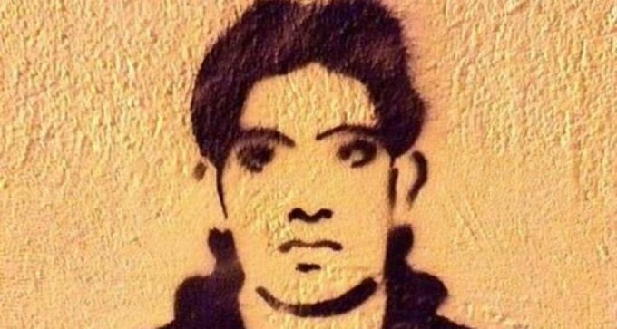
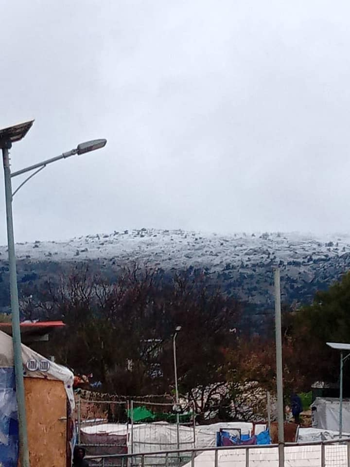

### AYS Weekend Digest 16\-17/01/2021 In Memory of Shehzad Luqman

Libya: Zintan detention centre is finally closed / Snow and freezing cold in Greece and France / Spain: will Plan Canarias turn the islands into a new Moria? / Updates from Bulgaria, Italy, Austria, UK

 ”, designed to pinpoint and highlight the unseen criminality related to racist attacks in the public space\.](assets/e2c6def9a2b2/1*LtNFjGp_640yUNCfuMLX1w.jpeg)

Artwork from the campaign “ [X them out\! A Black Map of Athens](https://valtousx.gr/en/) ”, designed to pinpoint and highlight the unseen criminality related to racist attacks in the public space\.
#### Featured — In Memory of Shehzad Luqman

**Petralona, Athens, 17 January 2013** 
8 years ago yesterday, at 3am, two Golden Dawn members, Dionysis Liakopoulos and Christos Stergiopoulos were riding a motorcycle\. Ahead of them, 27\-year\-old Shehzad Luqman is cycling to work at the farmers’ market\. Using butterfly knives, Liakopoulos and Stergiopoulos stab him seven times in the heart, back and arms\. They leave him bleeding profusely on the pavement, where he draws his last breath\.

In court, his killers would claim that they attacked him “over a silly fight” that Luqman started\. They would say he was blocking their way with his bicycle\. The perpetrators, Liakopoulos and Stergiopoulos, would be convicted of racially motivated murder\. In the trial against Golden Dawn, the two murderers were also found guilty of being members of a criminal organisation\.

In court, Sughran Bibi, mother of Shehzad, [testified](https://www.facebook.com/nobordersnetwork/photos/murdered-by-fascists-in-greece-1712013-dionysis-liakopoulos-26-and-christos-ster/1626613300739889/) that, after her son had found work in Greece, he claimed everything was fine\. “But later, he said things had gone wrong\. That they were being hit, beaten and killed\. He said he was very afraid\. I asked him to return but he told me that he wanted to repay the loan he had taken\. They killed him because he was different; because he was an immigrant\.”

> “ Fascists build their strength on the streets through campaigns of intimidation and violence against the workers movement, immigrants, refugees and all those they deem ‘different’\. ” \( [Khora Athens](https://www.facebook.com/KhoraAthens/posts/1670175049821763) \) 

Despite the blanket ban on protests in place in Greece, solidarity demonstrations took place in Athens on both [Saturday](https://www.facebook.com/solidaritymigrants/posts/234708861484984) and Sunday\. On Saturday, protestors were met with a massive police presence, who forced them to [move away](https://www.facebook.com/solidaritymigrants/posts/234684178154119) from their planned gathering point\.

■■■■■■■■■■■■■■ 
> **[Lydia Emmanouilidou](https://twitter.com/lydiaemman) @ Twitter Says:** 

> > Photos from today’s gathering/ vigil in #Athens marking 8 years since Jan 17, 2013 killing of Pakistani migrant Shehzad Luqman, who was chased down &amp; stabbed to death by supporters of Golden Dawn neo-nazi organisation while riding his bike. https://t.co/Kyw08zwa1X 

> **Tweeted at [2021-01-17 13:08:05](https://twitter.com/lydiaemman/status/1350792005920694272).** 

■■■■■■■■■■■■■■ 

While Golden Dawn doesn’t exist anymore, both researcher Lena K\. and No Borders Kitchen \(NBK\) Lesvos have pointed out over the weekend how rhetorics, language and contents of far\-right, xenophobic and fascist groups have now become the “new normal”, especially regarding the targeting of people on the move\.

[NBK Lesvos](https://www.facebook.com/NBKLesvos/posts/1955849174554862) looks at the recent government policies affecting people trapped on the islands: the conditions at Moria 2\.0, the unprecedented wave of rejections of asylum applications by Syrian nationals, the request to deport to Turkey 1,415 people and the well established practice of pushbacks supported by Frontex\.

[Lena K\.](https://twitter.com/lk2015r/status/1350887174279933958) , on Twitter, focuses instead on the opposition to the expansion of the Fylakio reception and detention centre on the Evros border, fuelled by explicit racist and xenophobic motives stated not only by fascist groups, but by representatives of local authorities and local society\.

> Both of these things are symptoms of both Fortress Europe’s increasing empire fetish and subsequent militarisation of the borders, and Greece increasing extreme\-right populism with it’s own range of cultural obsessions\. \(NBK Lesvos\) 

LIBYA
#### Zintan is finally closed

Human rights lawyer Giulia Tranchina [report](https://www.facebook.com/photo/?fbid=10158320809083621&set=a.10150438475713621) that finally on Sunday Zintan detention centre was empty and all the former detainees had been released\.

> After almost 3 years of abandonment in detention, thirst, starvation, sickness and unsafe conditions which killed 25 of them, lack of information and deprivation of any hope, hundreds of survivors are finally out\. 

However, as we reported previously, they are still in danger of being kidnapped, arrested, robbed, abused, exploited and killed in Tripoli and need urgent evacuation\.

BULGARIA
#### Pushbacks, dogs, pepper spray, beatings and robbery

Border Monitiring Bulgaria published an [update](https://bulgaria.bordermonitoring.eu/2021/01/16/push-backs-and-pull-backs-bulgaria-and-turkey-work-closely-together-as-gatekeepers-of-the-eu/?fbclid=IwAR144RvUBnlxbbt-yhO_B_I9eTtfyhlP6aA8YBwqLlk1a3wz8w0t1oFEuF0) on the situation at the border with Turkey on Saturday\. There is a ongoing use of pushbacks at the external borders\. The tactics of the Bulgarian Border Police include dogs, pepper spray, beatings and robbery and are mentioned frequently by numerous other organisations\. Also many children have been victims of pushbacks and violence, as also reported by [Save the Children](https://reliefweb.int/report/serbia/hundreds-children-report-police-violence-eu-borders) \.

GREECE
#### Rain, snow and freezing temperatures on the Greek Islands

Once again winter has come to the Greek islands and for the sixth year in a row people on the move are facing it in tents without heating, in flooded camps and with little or no support\.

Reports from [Samos](https://twitter.com/AVeizis/status/1350861988528844810) , [Chios](https://www.facebook.com/europemustact/posts/227873748825327) and [Lesvos](https://www.facebook.com/MoriaCoronaAwarenessTeam/posts/233223334973511) speak of rain, high winds and snow and of even more problems than usual with the electricity supply in the camps\.

 \) / Right: Samos \(photo by [Apostolos Veizis](https://twitter.com/AVeizis/status/1350867382236033024/photo/1) \)](assets/e2c6def9a2b2/1*seBu49zjyfe_x-F9jTSc9A.jpeg)

Left: Chios \(photo by [Europe Must Act](https://www.facebook.com/europemustact/photos/pcb.227873748825327/227873695491999/) \) / Right: Samos \(photo by [Apostolos Veizis](https://twitter.com/AVeizis/status/1350867382236033024/photo/1) \)

On Lesvos, authorities have opened emergency shelters for people sleeping rough, but [nothing is being done](https://twitter.com/nothilfe/status/1350874263755124738) for the more than 7,000 people in Moria 2\.0, which is still in lockdown and where half of the tents are ‘summer’ tents, now completely soaked\.

■■■■■■■■■■■■■■ 
> **[medico international](https://twitter.com/nothilfe) @ Twitter Says:** 

> > Auf #Lesbos hat es Schneeregen, für die Nacht sind Minusgrade vorhergesagt. Es ist saukalt, die Leute frieren und haben nichts zu heizen. 1/3 https://t.co/8SSdlh7rfJ 

> **Tweeted at [2021-01-17 18:34:55](https://twitter.com/nothilfe/status/1350874256029134854).** 

■■■■■■■■■■■■■■ 

It is also reported that once again the food distributed in the camp is far beyond being inedible\. This [video](https://twitter.com/ErikMarquardt/status/1350477093784743936) shows maggots crawling around packets of nuts given out on Saturday\.
#### Updates from Nea Malakasa

■■■■■■■■■■■■■■ 
> **[IOM Greece](https://twitter.com/IOMGREECE) @ Twitter Says:** 

> > 226 people were transferred from Nea Malakasa camp to temporary accommodation facilities, located outside of Athens. IOM facilitated the transfers in coordination with the 🇬🇷 authorities, as a response to snowfall and very low temperatures in the area. 

W/ @[EUHomeAffairs](https://twitter.com/EUHomeAffairs) support https://t.co/rNrSr7SiQA 

> **Tweeted at [2021-01-17 11:33:04](https://twitter.com/IOMGREECE/status/1350768096001318914).** 

■■■■■■■■■■■■■■ 

#### Athens: Solidarity initiative shut down by police in Platia Victoria

Victoria Solidarity [reports](https://www.facebook.com/ViktoriaSolidarity/posts/206594827785017) that they had to cancel their pop\-up free shop in Victoria Square:

> As we set up the clothes, cops came and threatened that if we don’t leave immediately they would fine us, while people in need had already come to get some clothes\. We explained to them what it was about but they answered all with irony and told us that “the municipality has already provided for these people\.” 
 

> … After the threats and the altercation we were forced to leave\. 

ITALY
#### Updates from the Italian / French border

[Kesha Niya](https://www.facebook.com/KeshaNiyaProject/posts/1433629566981906) published a long update on the situation at the border in these first weeks of 2021\.

> The new year started and winter continues\. Since we see more cold and rainy days and nights, our working spot at the border is changing like the weather, as people have to adapt\. Especially as it is the first year since 2016 without a camp to stay, people on the go are using the safe spaces they find to sleep whenever they can\. This includes our working space 1 km before the french border, directly next to the main street leading from the border to Ventimiglia\. 

> … Every night now we see few people sleeping at ,,breakfast,, , as they have no other place to go and wait for us to come in the morning again\. Others stay for the night to continue their way early in the morning\. This is all happening directly next to the main street leading from the french border to Ventimiglia\. Other people continue to choose the beach of Ventimiglia, space under the bridge, empty houses or places close to the train station\. 

> \[On Tuesday, January 12\], a fire [broke out](https://www.riviera24.it/2021/01/ventimiglia-accende-fuoco-per-scaldarsi-e-appicca-incendio-a-serra-667826/) in Ventimiglia due to a person making a fire to keep away the cold\. 

This resulted in more police controls on people on the move and on the activists\.

There seems to be endless capacity to check up on us and what we should not do, while we try to use our capacities in a situation where the Italian and French government \(as any other European government\) don’t seem to have any interest in fulfilling the most basic needs of human beings\.

The update carries on detailing the conditions of detention for people caught at the border, the abuse and beatings routinely carried out by the border police of the two countries\. Read it [HERE](https://www.facebook.com/KeshaNiyaProject/posts/1433629566981906) \.

> In the week from the 28th of December to 3rd of January, we met just 222 people at the border, of those 190 pushbacks and 32 coming from other places around to eat and chat\. It is a very low number, as it was for example difficult in this time to travel inside Italy \[due to Covid\-19 related measures\] \. Of these 222 people, we counted just one woman and two minors\. 

> In the week from the 4th to the 10th of January, everything was going back to normal with numbers that were significantly higher\. We counted 603 people, of those 518 being pushed back and 85 coming from different places\. Of all those, 41 were women, 17 children and at least 10 minors, but we couldn’t keep track of every underage person this week\. The highest number of people coming in one day was 158\. 

SPAIN
#### Death at sea

More people have arrived to the Canary Islands this weekend and at least one person, a 9\-year\-old child, died in the crossing, as reported by Spanish media\. He was onboard a boat with another 34 people who were rescued after 5 days at sea\.
#### Canarias 50

On Saturday, the government announced the [opening](https://www.laprovincia.es/canarias/2021/01/17/nuevas-instalaciones-canarias-50-abre-29252038.html) of the ‘Canarias 50’ reception structure on Gran Canaria, with the first group of people being moved inside\. Despite the assurances that the islands won’t become a new Moria, the national government plan envisages the transfer of all asylum seekers living in hotels and apartment into the new centre, which currently has a capacity of 442 people, but will increase up to 1320\.

This is part of the [Plan Canarias](https://www.canarias7.es/canarias/nuevo-campamento-colegio-20201219201113-nt.html) announced by the government in late 2020\. Canarias 50 is the third structure to open after ex\-military camp in Barranco Seco and the Colegio Leon, all of them on Gran Canaria\.
#### Hunger strike in Tenerife

Media [report](https://diariodeavisos.elespanol.com/2021/01/casi-200-migrantes-inician-una-huelga-de-hambre-para-que-les-dejen-viajar-de-tenerife-a-la-peninsula/) that 176 people from Senegal have started a hunger strike on Saturday in Tenerife, Canary Islands, to be allowed to travel to the mainland, since many of them have valid passports and family members who can support and accommodate them to try to get a job\. They arrived on the islands in the last few months and have been stuck there in a hotel for up to 3 months\.
#### Six years later, police impunity is confirmed

Activist Irene Ruano Blanco [report](https://www.elsaltodiario.com/migracion/cinco-dias-de-suspension-para-una-agente-por-emplear-violencia-en-un-vuelo-de-deportacion) of the end of a police internal inquiry started in 2015 regarding the assault by police officers against a citizen of the Dominican Republic during a deportation flight\. The case was started after No CIE platform and the group Stop Deportaciones released a video of the assault\. Six years later the General Direction of the Spanish Police sentenced one officer to 5 days of suspension and a €600 fine, despite the video showing more officers assaulting the man\.

As Stop Deportaciones [states](https://twitter.com/Stopdeportacion/status/1350489086545571845) : It’s been an arduous path to arrive to this minimal sentence, but the ruling recognises what we have been saying: **deportations violate human rights** \.

AUSTRIA
#### Solidarity in Salzburg

](assets/e2c6def9a2b2/1*-FfeF_S01KzOVjwSDV-CZA.jpeg)

Saturday January 16, 2021 — [Solidarisches Salzburg](https://solidarischessalzburg.at/veranstaltung/wochenende-fuer-moria-1/)

Austrian activists have [spent](https://solidarischessalzburg.at/veranstaltung/wochenende-fuer-moria-1/) one night in tents at Mozartplatz, in Salzburg, to draw attention to the inhumane situation at the EU’s external borders\.

FRANCE

Updates from Calais and Grande\-Synthe

 \)](assets/e2c6def9a2b2/1*myxrIG--2RP1dpYsx6uikQ.jpeg)

“In Calais on Saturday, the extreme cold plan was finally activated but it’s ineffective since hundreds of people are still outside in inhuman conditions\. The “plan” of the Prefect and the Local authorities is: more walls and more police pressure” \(By [Utopia 56](https://twitter.com/Utopia_56/status/1350788717519249408/photo/1) \)

Care for Calais is [calling for volunteers and donations](https://care4calais.org/news/urgent-appeal-snow-in-calais/) to support the more than 1,100 people on the move in the area facing the freezing cold\.

In Grande\-Synthe the situation is [similar](https://twitter.com/Utopia_56/status/1350750305877684226) , with local authorities preventing Utopia 56 from distributing tents and blankets to people on the street\.

EU
#### Frontex to use AI to assess risks at sea

Matthias Monroy report that Frontex has renewed a contract with the Israeli company Windward for a ‘maritime analytics’ platform\. The agency intends to use the new platform to automatically detect and assess “risks” on the seas of the European Union\. Suspected irregular activities are to be displayed in a constantly updated “threat map” with the help of self\-learning software\. Read more [HERE](https://digit.site36.net/2021/01/15/artificial-intelligence-frontex-improves-its-maritime-surveillance/) \.

UK
#### Outbreaks in removal centres

On Monday last week, we [reported](ays-daily-digest-11-1-2021-olaf-investigating-frontex-619f7514d6f9) that [Brook House](http://www.aviddetention.org.uk/immigration-detention/places-detention/brook-house-irc) , the largest Immigration Removal Centre \(IRC\) in the UK, had closed for 10 days due to a COVID\-19 outbreak\. Despite calls for the release of the inmates, the government had instead moved them to other structures\. On Wednesday, one person housed at Napier barracks in Kent tested positive\. People also tested positive at [Morton Hall IRC](http://www.aviddetention.org.uk/immigration-detention/places-detention/morton-hall-irc) near Lincoln\. On Sunday, the Guardian [reported](https://www.theguardian.com/uk-news/2021/jan/15/new-covid-outbreak-harmondsworth-uk-immigration-removal-centre) that a further outbreak started in [Harmondsworth IRC](http://www.aviddetention.org.uk/immigration-detention/places-detention/harmondsworth-irc) near Heathrow airport\. Both inmates and workers of the contractor company Mitie tested positive\. This last episode is further proof that the indiscriminate use of migrant detention is “not consistent with public health and undermines national efforts to bring coronavirus under control”, as stated by an [open letter](https://www.biduk.org/articles/763-bid-and-73-other-organisations-call-for-the-urgent-release-of-immigration-detainees) to Home Office secretary Priti Patel, written by 74 organisations, asking for the immediate release of all detainees\.

GENERAL
#### Scapegoating the poor and the migrant

The authorities’ practice of scapegoating poor people and people on the move runs deep in European policies\.

In the last few days, the Dutch government [resigned](https://www.theguardian.com/world/2021/jan/15/dutch-government-resigns-over-child-benefits-scandal) over the scandal over child benefits\. As many as 26,000 parents were wrongly accused by the Dutch tax authorities of fraudulently claiming child allowance over several years from 2012\. At least 11,000 were singled out for special scrutiny because of their ethnic origin or dual nationality, fuelling longstanding allegations of systemic racism in the Netherlands\.

In the UK, the government is carrying on with its [criminalising policies](https://www.theguardian.com/commentisfree/2021/jan/17/in-britain-and-abroad-it-is-easy-to-scapegoat-poor-migrants?fbclid=IwAR3mupIeIo0U_j239SLIPrR9rxkPT-O-88pH6aRmjZBQksmKQfOiGEHostg) towards both asylum seekers and the poorest sectors of society\. The misery of food boxes, the unwillingness to extend the provision of free meals into the holidays, the No\-Recourse\-to\-Public\-Funding \(NRPF\) policy for non\-UK nationals go hand in hand with the conditions in accommodation structures like the Napier and Penally barracks, the indefinite detention of rejected asylum seekers and the rushed — if not arbitrary — deportations\.

While each country has its particular ways of reproducing these practices, the belief that poverty and migration are indicators of [moral failing](https://www.politicshome.com/thehouse/article/myths-about-poverty-must-be-refuted-so-that-parents-on-benefits-will-be-trusted-with-20-and-not-half-a-pepper) and thus of being ‘undeserving’ runs deep all over the continent\.
#### Gender stereorypes and migration

Katy Fallon pointed out on Sunday the use of gender stereotypes regarding vulnerability among people on the move by UNHCR\. This has been a practice embedded in humanitarian and government policies, with the consequence of framing single men as less vulnerable and thus less likely to receive support\.

■■■■■■■■■■■■■■ 
> **[Katy Fallon](https://twitter.com/katymfallon) @ Twitter Says:** 

> > Men also feel the cold. This is not specific to UNHCR really as this happens across the board - but we need to change outdated narratives which suggest asylum seeking men (particularly single men) are tougher than women &amp; children. They are often as vulnerable. 

> **Tweeted at [2021-01-17 18:40:40](https://twitter.com/katymfallon/status/1350875704578236417).** 

■■■■■■■■■■■■■■ 

Over the last two years, Solomon magazine presented ‘Last in Line’, a publication on young male asylum seekers and refugees, to better understand the current challenges faced by this less visible group of people on the move\. Find it [HERE](https://wearesolomon.com/publications/last-in-line/) \.

**Find daily updates and special reports on our [Medium page](https://medium.com/are-you-syrious) \.**

**If you wish to contribute, either by writing a report or a story, or by joining the info gathering team, please let us know\.**

**We strive to echo correct news from the ground through collaboration and fairness\. Every effort has been made to credit organisations and individuals with regard to the supply of information, video, and photo material \(in cases where the source wanted to be accredited\) \. Please notify us regarding corrections\.**

**If there’s anything you want to share or comment, contact us through Facebook, Twitter or write to: areyousyrious@gmail\.com**

_Converted [Medium Post](https://medium.com/are-you-syrious/ays-weekend-digest-16-17-01-2021-in-memory-of-shehzad-luqman-e2c6def9a2b2) by [ZMediumToMarkdown](https://github.com/ZhgChgLi/ZMediumToMarkdown)._
