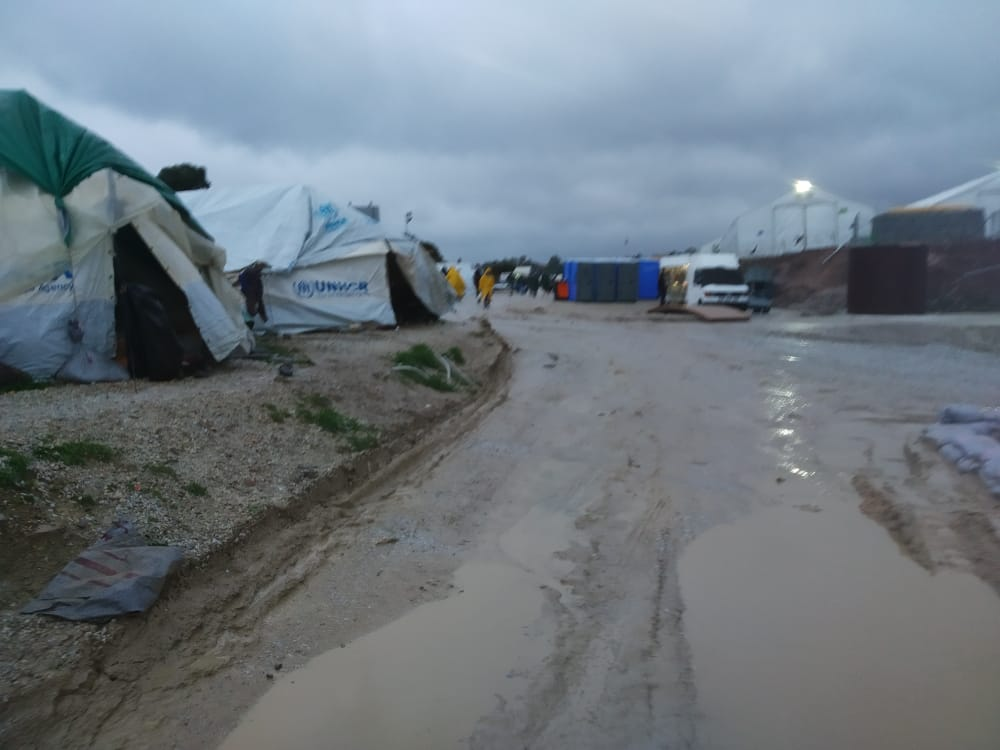
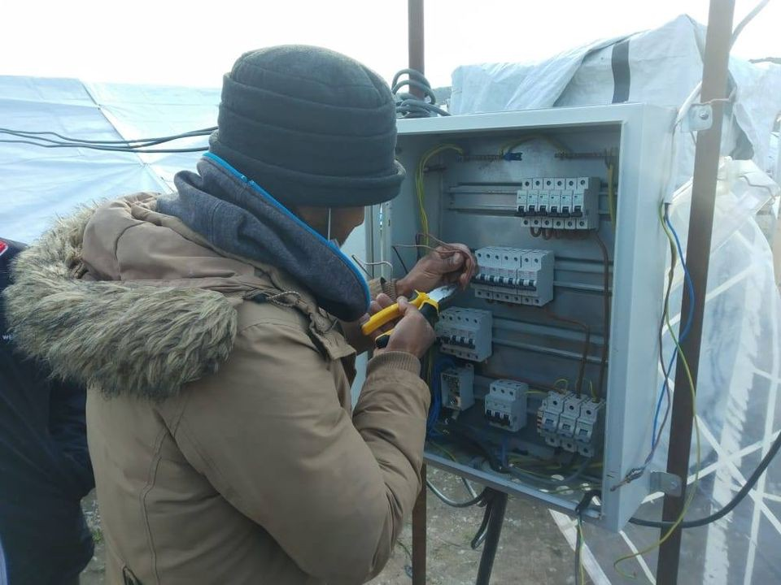
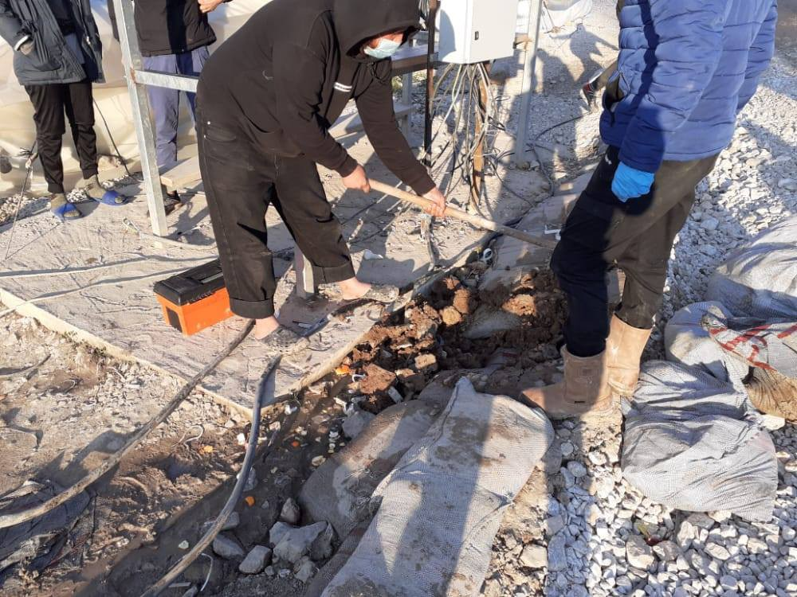
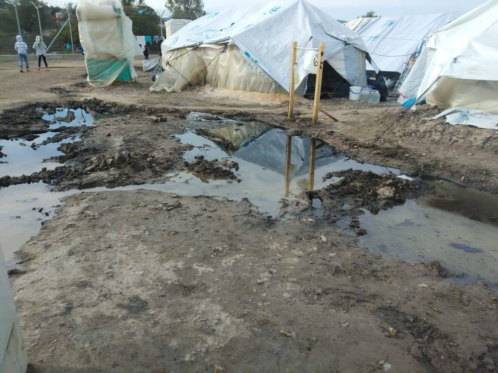
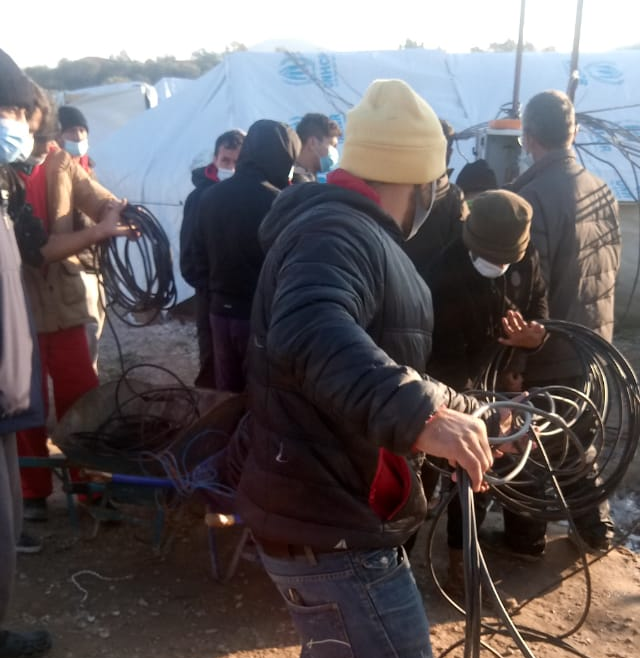
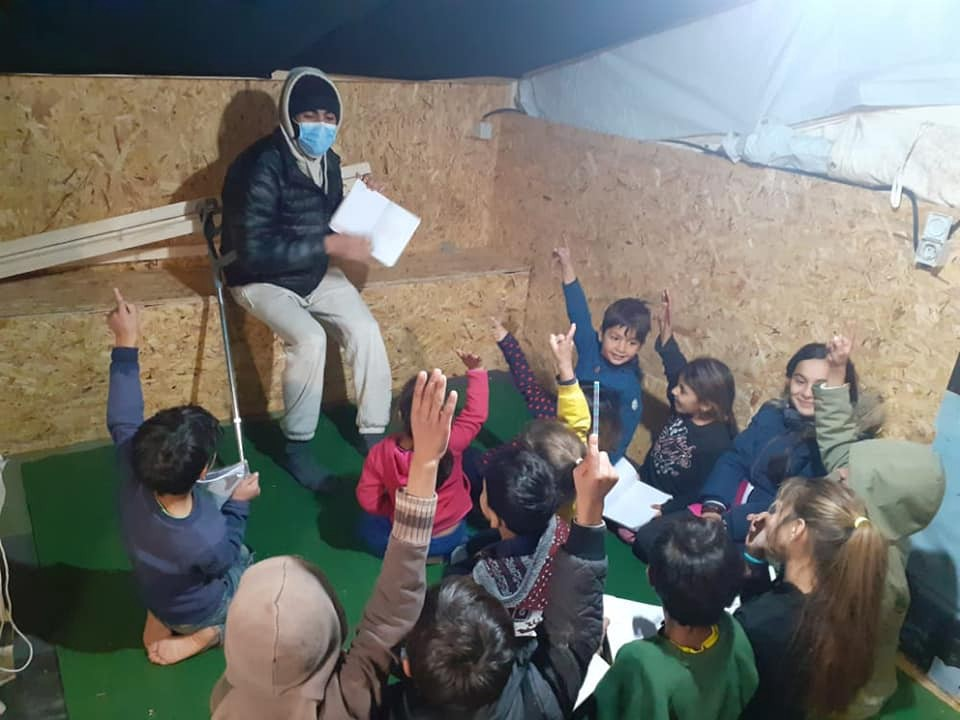
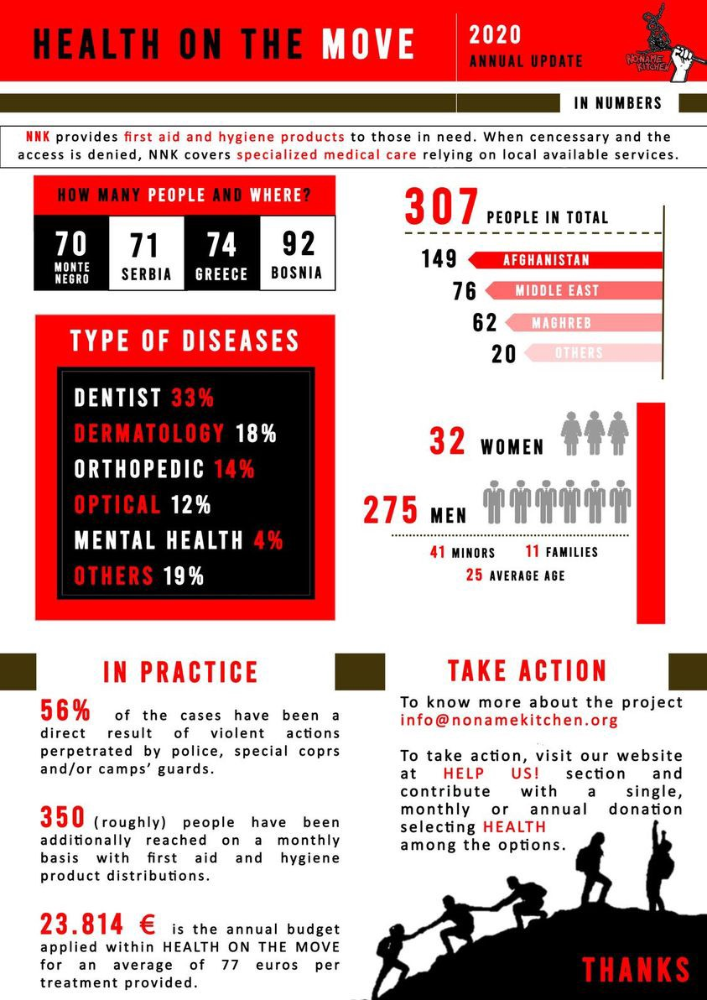
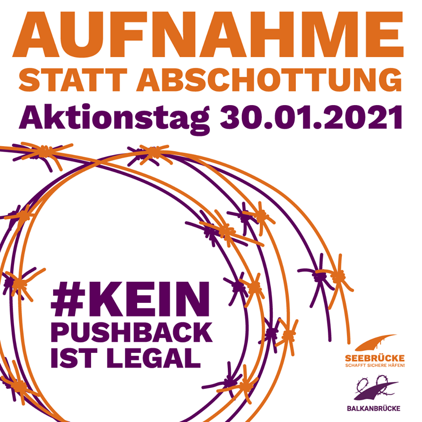
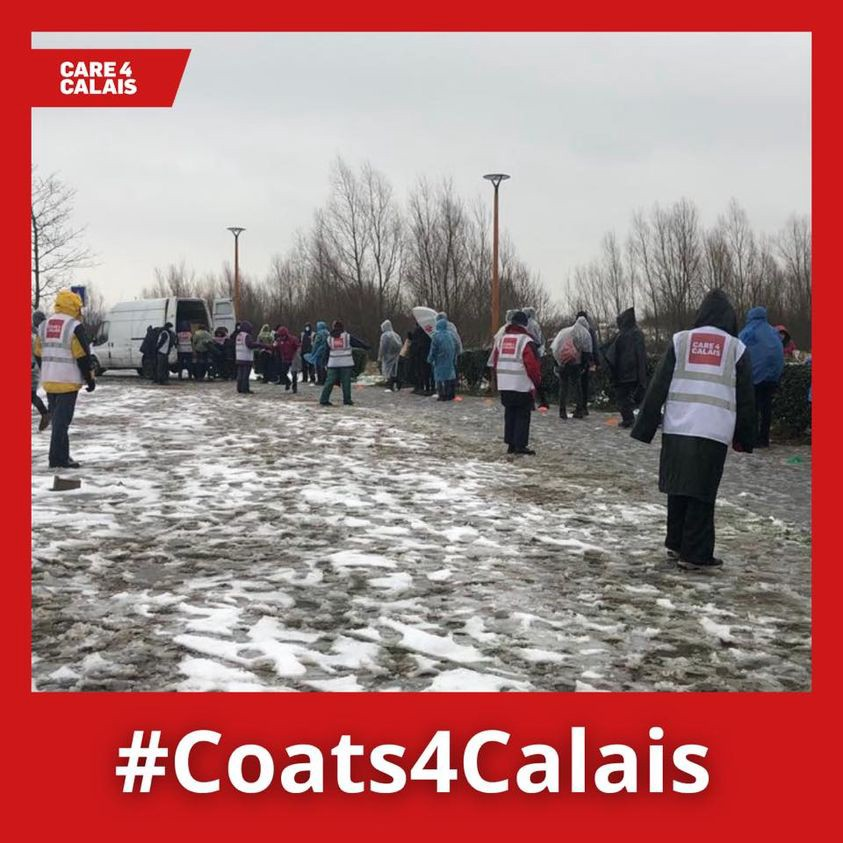

### AYS Daily Digest 20/01/2021: What is life actually like in the Greek hotspots?
#### ECtHR will decide if living conditions in hotspots amount to inhuman and degrading treatment while EU\-report claims this is not so bad after all // 43 people die in first shipwreck of 2021 // Moonbird witnesses pull\-back by Libyan Coast Guard // People freeze in Calais // Australia is criticised for its treatment of refugees

Moria 2\.0 these days\. Copyright: Moria White Helmets
### FEATURE: What is life actually like in the Greek hotspots?

At least some of the most vulnerable people on Samos were able to spend recent nights in the warmth\. The continuing effort of various NGOs managed to do what should be the governments business as usual in winter: Making sure people have a roof over their heads and stay warm\. With combined efforts, the NGOs were able to get permission to provide emergency shelter in community spaces for 16 people, including pregnant women and young families\. They hope to be able to also shelter the elderly and those with medical needs in the coming days\. Only 800 of some 3,500 asylum seekers on Samos are currently accommodated inside the official Reception and Identification Centre \(RIC\) facility, [according to Europe Must Act\.](https://de.europemustact.org/post/winter-in-aegean-samos?fbclid=IwAR0c0_Dg6AgGfM5ltyI8tmw_AOBOmhOJ3F9SpaviBYfgy-pOByIyPZ6t0dM) The rest are basically left on their own\.

> “Around 2,700 people currently live in tents and makeshift shelters on the slopes of the mountain above the town\.” 

Among the people living on the slope many belong to the most vulnerable groups\.

The **European Court of Human Rights will now examine the living conditions** in the Greek Hotspots\. The ECtHR send a communication to Greece, asking Greece to answer questions regarding the treatment of a total of eight people, all of whom were living in one of the so\-called EU hotspots and had pre\-existing medical conditions or were particularly vulnerable\. The NGOs, HIAS Greece and Equal Rights Beyond Borders, represent the eight complainants\. The issue on the table is whether or not the conditions in the camps amount to an instance of degrading and inhuman treatment, as forbidden under Article 3 of the European Convention on Human Rights\.

> “Article 3 
 

> Prohibition of torture 
 

> No one shall be subjected to torture or to inhuman or degrading treatment or punishment\.” 

In all of the eight cases, extremely vulnerable people were repeatedly denied access to medical care by the authorities\. [Elli Kriona Saranti form HIAS Greece states](https://c7db895f-7823-4bab-aca6-270af12c4d6b.usrfiles.com/ugd/c7db89_56cce24799b442a4a06aaf31e3a2453c.pdf https://www.equal-rights.org/post/press-release-european-court-of-human-rights-examines-living-conditions-in-4-eu-hotspots?fbclid=IwAR2I7q_l_2eZQetyqeOGdNvWsAgutNmRD9gL0QzUSzReD53iJ98UaenpNdg) :

> “It is now up to the Court to state unequivocally that the living conditions at the hotspots do not meet basic human needs and that the measure of geographical restrictions puts the lives of vulnerable people at serious risk” 

Meanwhile, an EU task force published a paper that seems to paint a pretty rosy picture of life in Moria 2\.0 — and a German newspaper does not seem to see the need to double\-check this information\. According to an [article published in _Die Welt_](https://www.welt.de/politik/deutschland/article224682411/Migration-EU-findet-keine-Erkenntnisse-ueber-Rattenbisse-auf-Lesbos.html?fbclid=IwAR1OntBzcNCN0621m7ehjQWBWFnEDHnwXZ2kwZ9R7JiOkZf8fmT3bn2T5V4) that refers to this EU paper, which was available to the editors, the tents in Moria 2\.0 are “all winterized and have a solid floor that is also protected against water\. Wooden pallets covered with plastic sheeting were placed under the tents and a rainwater management system was set up throughout the area — with collecting basins, pumps and canals to channel the water away from the tent sites\.”

That sounds like a pretty nice camp\! Unfortunately, people who follow groups like Moria Corona Awareness Team or Moria White Helmets, two dedicated groups of camp residents, on Facebook know that first of all this is far from being true, and second, most of what has actually been done in order to manage the masses of rainwater that flooded the camp in the recent days and weeks was installed by the residents themselves\.

In referring to the mentioned article in the Welt, Stand By Me Lesvos explained that while the EU report claims that heaters are available for each tent, these heaters are not distributed but stored in the warehouse\. The electricity infrastructure is still not sufficient for the heaters to be used\. Members of the Moria White Helmets spent recent days trying to get the electricity working\.

“Another day all our teams were very busy helping to expand and fix electricity\. Yesterday some worked until after midnight\.” Copyright: Moria White Helmets

The camp is still not prepared for winter\. No proper heating system is in place and temperatures are low\. Many people have to make fires in order to keep warm and cook\. Also, the tents are set up very close to each other which again increases the risk of another tragedy\.

Only yesterday one tent burned down:

■■■■■■■■■■■■■■ 
> **[MSF Sea](https://twitter.com/MSF_Sea) @ Twitter Says:** 

> > One tent burned down today in #KaraTepe camp #Lesbos after a fire erupted due to electrical misuse. No injuries reported. This is what happens when you leave people to face the cold with whatever means they have. These camps are not safe! Move people to safety now! #NoMoreMoria https://t.co/AfmXT9TeYX 

> **Tweeted at [2021-01-20 13:51:34](https://twitter.com/MSF_Sea/status/1351890113794633731?fbclid=IwAR1RnrgpjVhLyl1lyZ2eqykIGyScjHmhTiYS1sFZ1GKIBF0HVk-OMoSSq38).** 

■■■■■■■■■■■■■■ 

Moria Corona Awareness Team spoke on Facebook about the fear which people in the camp carry around with them each day: the fear of yet another big fire\.

Nevertheless the narrative of winterized and warm tents seems to have spread rapidly in Europe\. In the Netherlands, the State Secretary for Justice and Security Ankie Broekers\-Knol stated, according to No More Morias, that the tents in Moria 2\.0 are prepared for winter and that each tent has electricity\.

> We hope the European Court for Human Rights will make clear that these conditions amount to inhuman and degrading treatment as prohibited by the European Convention on Human Rights\. 

### GREECE
#### Residents\-organized school opened

Moria White Helmets finally managed to reopen a school in the camp\. Since the big fire, there has been no school for kids\.

> “Every day kids asked when education will start\. And from today we can manage again\.” 

Back to school in Moria 2\.0\. Copyright: Moria White Helmets
#### Death rate among people trying to cross from Turkey increased in 2020

■■■■■■■■■■■■■■ 
> **[Manos Moschopoulos](https://twitter.com/maledictus) @ Twitter Says:** 

> > In its annual briefing note, Greece's Migration Ministry writes that "within a year, all indexes relating to migration management are positive."

The note avoids one index: Refugees attempting to reach Greece were almost seven times more likely to lose their lives in 2020. https://t.co/UGaFFsqZYn 

> **Tweeted at [2021-01-20 19:36:40](https://twitter.com/maledictus/status/1351976958729584643?fbclid=IwAR3jzR1D_c1kH7SSrAkl5Y7nFR8cCGmeXriw5gA0H4zSsvzs8adMbjZGwE4).** 

■■■■■■■■■■■■■■ 

#### Racist rhetoric’s by Greek Parliamentarian

■■■■■■■■■■■■■■ 
> **[Vassilis Tsarnas](https://twitter.com/VassilisTsarnas) @ Twitter Says:** 

> > K. Velopoulos, the leader of #FarRight parliamentarian "Greek Solution" called for the deportation of all #Pakistani #Immigrants in #Greece, referring to a statement by a military leader of Pakistan that Turks &amp; Pakistanis are "one nation"... We filed a complaint for #HateSpeech 

> **Tweeted at [2021-01-20 09:24:57](https://twitter.com/VassilisTsarnas/status/1351823018083942407?fbclid=IwAR3ry4H2sWY5Pi6-1-o8-nEmwbef028gWCxZrnsuZQDTdeP5wGfTKk-qzZE).** 

■■■■■■■■■■■■■■ 

Vassilis Tsarnas is a Greek human\-rights activist and member of Greek Helsinki Monitor\.
#### Green Ecologists Party calls on government to release refugees from hotspot centres

The [Greek Green Ecologists Party published a statement](https://l.facebook.com/l.php?u=https%3A%2F%2Fstonisi.gr%2Fpost%2F14420%2Famesa-na-apegklwvistoyn-oi-prosfyges-apo-ta-nhsia%3Ffbclid%3DIwAR1uFiGIk93Ijh_06pbJawV4Q3_NurrYDJvx-_gzNL40ECy_Sp83TFzkV6w&h=AT0Yt6lxD-o0zQD2yNJDk5aHjfA-Zu4Wfixq9D-PG0eKJOw9XqYYakRFpB1xl71pWGIwUgngOKaVpr3GR_7TmxVAB420IAzDlEqJkI71Cve8NaCwIjv93BRt_Zo-0IPIvw&__tn__=R]-R&c[0]=AT2HUlk7KWsRCQNfY6cHIE6-EsenxTT237AnMTXZ1Bf8NCL25sVHkD1lJFkQ1rgxs9wImSd4MiBzhDz90Uh1b1xf7uieYPddrpIqcykkMk63vDVQbkT0Z2wvkoWnA7jMMaMYif3JIudSEGG8KzicS_0n3j5oFcb-HBkR6fFsC02jCQmzBN6D6Lot1iNxHqMuk1q7WbAWCMU) in which it calls on the Greek government to proceed with the immediate release of refugees and migrants from the islands\.

According to the statement,

> “the Mitsotaki government insists on the policy of impoverishing refugees and migrants held on the islands under miserable living conditions\.” 

#### SEA
43 people die in first official shipwreck in 2021, on 19 January

■■■■■■■■■■■■■■ 
> **[Alarm Phone](https://twitter.com/alarm_phone) @ Twitter Says:** 

> > ⚫️Shipwreck off #Libya ⚫️
Last night we were told that a boat with ~53 people capsized off Zuwara. Testimonies report that only 10 people survived &amp; more than 40 people are missing, possibly drowned. We are sad &amp; angry. #EU stop killing people with your borders. #BlackLivesMatter 

> **Tweeted at [2021-01-20 10:29:53](https://twitter.com/alarm_phone/status/1351839355707469826).** 

■■■■■■■■■■■■■■ 

According to UNHCR, the boat capsized due to bad sea conditions when its engine stopped\. It embarked in the early hours of Tuesday from the city of Zawya\. Ten people on board survived\.
In a [press release, UNHCR states](https://www.unhcr.org/news/press/2021/1/600837294/iom-unhcr-shipwreck-libya-claims-40-lives.html) :

> “This loss of life highlights once more the need for re\-activation of state\-led search and rescue operations, a gap NGO and commercial vessels are trying to fill despite their limited resources\.” 

Only one day later, on 20 January, Sea Watch’s airplane **Moonbird witnessed a pullback of a ship** with 48 people on board\.

The ship was intercepted by the so\-called Libyan coast guard which brought the people on board back to Libya\. Before, Alarm Phone, who was contacted by the people on board earlier, tried to activate the Maltese and Italian authorities as well as the NGO refugee rescue ship Ocean Viking\. The Ocean Viking headed for the boat in distress, but the Libyan coast guard was faster\. 
According to the crew of the Moonbird, an NGO airplane designated to monitor human rights violations in the Mediterranean, a Frontex aircraft was at the scene as well\. The Civil Fleet contacted Frontex in order to get information on whether or not the Frontex aircraft was in cooperating contact with the Libyan coast guard’s ship\.

■■■■■■■■■■■■■■ 
> **[The Civil Fleet](https://twitter.com/FleetCivil) @ Twitter Says:** 

> > 48 people sent back to Libya a day after a tragic refugee shipwreck: Sea Watch’s Moonbird witnessed the pullback and spotted a Frontex plane on the scene, though the agency’s role in the events is unknown 

Story here: [thecivilfleet.wordpress.com/2021/01/20/48-…](https://thecivilfleet.wordpress.com/2021/01/20/48-people-sent-back-to-libya-a-day-after-a-tragic-refugee-shipwreck/) 

📸@[seawatch_intl](https://twitter.com/seawatch_intl) / Felix Weiss https://t.co/ZdMrhSAgSB 

> **Tweeted at [2021-01-20 19:14:47](https://twitter.com/FleetCivil/status/1351971451574886400).** 

■■■■■■■■■■■■■■ 

Together with hundreds of human rights actors, even IOM and UNHCR reiterate that Libya is not a safe port and people are subject to extreme torture and human rights violations\. In their statement concerning the shipwreck the day before, UNHCR calls for an

> “…urgent and measurable shift in the approach to the situation in the Mediterranean\. This includes ending returns to unsafe ports, establishing a safe and predictable disembarkation mechanism followed by a tangible show of solidarity from European states with countries receiving high numbers of arrivals\. The situation for migrants and refugees in Libya remains extremely precarious\. Arbitrary arrests and arbitrary detention in the direst of conditions continue\. Many are victimized and exploited by traffickers and smugglers, held for ransom, tortured, and abused\.” 

### BALKAN
#### Health on the Move helped 307 people in 2020

In 2020, 307 people on the move in Greece, Montenegro, Serbia, and Bosnia and Herzegovina received medical support through NoNameKitchen’s Health on the Move project\. Of these people, 41 people were minors\. The most common necessary treatments were dentistry work, dermatological care to treat skin conditions, orthopedic work, eye care, and mental health care\. NoNameKitchen states that about 56% of the injuries that needed treatment stamped from violence perpetrated against these people on the part of police, special security forces, or security guards from the official refugee camps\. €23,814 were spend in order to provide medical care for these people\.

Copyright: NoNameKitchen
### GERMANY
#### NGOs demand relocation and admission of people from Lipa

One hundred forty NGOs signed a statement calling for an end to the violent and illegal pushbacks along the outer EU borders, an end to Germany’s support for the Croatian Border police and the evacuation of the people stuck in Lipa\.

■■■■■■■■■■■■■■ 
> **[Balkanbrücke](https://twitter.com/balkanbruecke) @ Twitter Says:** 

> > Gemeinsam mit @[_Seebruecke_](https://twitter.com/_Seebruecke_) , @PROASYL und 140 weiteren Initiativen fordern wir die sofortige #Evakuierung und Aufnahme der in #BiH Schutzsuchenden, sowie ein sofortiges Ende von #Pushbacks durch die #EU! 

[balkanbruecke.org/statement-lipa…](https://balkanbruecke.org/statement-lipa-grausame-folge-der-europaeischen-abschottungspolitik/)

 #EndPushbacksNow #AufnahmestattAbschottung https://t.co/Wt6ZRA0gRL 

> **Tweeted at [2021-01-20 09:01:00](https://twitter.com/balkanbruecke/status/1351816988897628161).** 

■■■■■■■■■■■■■■ 

For 30 January, a day of action is planned in order to raise awareness and put pressure on the federal government:

Copyright: Seebrücke, Balkanbrücke
#### Far fewer family reunions granted than possible

In the year 2020, only 5311 relatives of people with a statues of subsidiary protection were granted visas in order to re\-join their family members in Germany\. That is not even half of the number of the planned scheme\. According to a law introduced in 2018, 1000 should be allowed, each month, to join their family in Germany\.
Between 2015 and 2018, family reunification was suspended for people with subsidiary protection status, even though according to the German constitution, families should enjoy special protection\. 
Read more about this [here](https://www.tagesschau.de/investigativ/hsb/familiennachzug-gefluechtete-101.html?fbclid=IwAR0Bq4s9Ah3C4WjgNhZFjfjJT-_xyOwJW6_RdsFTScFcpXVQd8EG-96hJ30) \.
### FRANCE
#### Nothing but a coat to keep people warm in Calais

Care4Calais distributes coats to people living outside in freezing temperatures in Calais\. Under lockdown and with the constant evictions, there is hardly any place where people can go to indoors to warm up\. 
A man from Iran told the NGO that

> “…he always looked forward to seeing us, and that he couldn’t find words to describe the difference a dry, warm coat makes on such a difficult, cold day “ 

If you have coats to donate, please visit Care4Calais on Facebook for more information\!

Copyright: Care4Calais
### FRONTEX
#### Leggeri sees no need to resign

Without a lot of astonishment, we note that that head of Frontex Leggeri has no intention to resign over pushback charges\. This was stated by a spokesperson of the agency after a meeting of the management board\.

More here:

A longer read on the current allegations and investigations against Frontex can be found here:

### UK
#### European Court of Justice: family support cannot be considered as a safeguard in removing someone’s refugee status\.

In a ruling referred to the Court by the UK, the ECJ decided that there is not enough protection from persecution when family members are able to provide financial support to a deportee in the home country\. UK authorities wanted to deport a Somalian national, claiming that in Somalia he would have family members to support him\. The ECJ instead said that

> “Mere social and financial support is inherently incapable of either preventing acts of persecution or of detecting, prosecuting and punishing such acts\.” 

The case has been transferred to the highest European court before the end of the Brexit\-transition period\.

For more information, see [here](https://www.courthousenews.com/uk-cant-deport-refugee-relying-on-family-for-protection-eu-court-rules/?fbclid=IwAR3Bn3fPrjbgjJN2IBXVykYvilvlufSwCnWcF4_NkpDMLr33NGD9h4PCVB4) , for the judgement [here](http://curia.europa.eu/juris/document/document.jsf?text=&docid=236682&pageIndex=0&doclang=en&mode=lst&dir=&occ=first&part=1&cid=657894) \.
#### Woman loses unborn baby after being refused medical care

■■■■■■■■■■■■■■ 
> **[Nicola Kelly](https://twitter.com/NicolaKelly) @ Twitter Says:** 

> > Just heard from a woman in asylum housing. At 32 weeks pregnant, she began feeling unusual pains. She asked the housing manager to call an ambulance, not sure what was wrong. He refused. For three hours, she pleaded with him, bleeding and crying. She lost her baby in reception. 

> **Tweeted at [2021-01-20 13:24:16](https://twitter.com/NicolaKelly/status/1351883242299912193?fbclid=IwAR1KvoISpn6xuJ3EZ35wl1zzwfmhObudid_VP5oTnE0lJL5WlJr1wGPqOT0).** 

■■■■■■■■■■■■■■ 

#### Outsourcing of immigration management

UK’s government is pursuing a strategy of outsourcing multiple factions of the UK’s immigration service\. Not only has outsourcing raised concerns that the Government is prioritising profit over people, but many of the companies responsible for the takeovers have found themselves embroiled in scandals of human rights abuses\.

Read more about this [here](https://refugeehosts.org/2021/01/18/a-system-of-profiteering-outsourcing-the-asylum-interview-process/?fbclid=IwAR1KvoISpn6xuJ3EZ35wl1zzwfmhObudid_VP5oTnE0lJL5WlJr1wGPqOT0) \.
### AUSTRALIA
#### A growing list of countries is expressing its concerns over Australian’s treatment of refugees\.

On Wednesday, the Australian government had to appear in front of the UN Human Rights Council in Geneva for its Universal Periodic Review \(UPR\) \. This review is carried out every 4–5 years\. UN member countries questioned Australia about its human rights record and recommended improvements\. The government’s treatment of refugees and migrants was one of the key issues expressed by the other states\. Paul Power, [CEO of Australia’s Refugee Council stated](https://www.hrlc.org.au/news/2021/1/20/un-review-highlights-need-for-aust-to-raise-the-age-criminal-responsibility) :

> “The average length of immigration detention is at a record high, hundreds of people subject to offshore processing remain in limbo after eight years and, during one of the worst economic crises of our lives, people seeking asylum have been left behind by the Australian Government\.” 

At least one item of good news can be reported: More than 20 refugees were released from hotel detention on Wednesday\. These people have been held for up to 18 months after being brought to Australia from offshore detention under Medevac, a law that allowed independent doctors to recommend the transfer of people held in Nauru and Papua New Guinea to Australia for medical purposes\. The law was repealed in December 2019, and the people have been held in detention ever since\. For more information, see [here](https://www.canberratimes.com.au/story/7093255/medevac-refugees-freed-from-vic-hotel/) \.
### WORTH READING

This blogpost collects Calls for Papers on Migration in various Journals and gives a list with recently published work on the issue\.

A new book on the EU migration agencies, written by David Fernández\-Rojo has just been published\. The book explores the recent expansion of the legal mandates for FRONTEX, EASO and EUROPOL and the activities they undertake in practice\.

**David Fernández\-Rojo: EU Migration Agencies\. The Operation and Cooperation of FRONTEX, EASO and EUROPOL**

**Find daily updates and special reports on our [Medium page](https://medium.com/are-you-syrious) \.**

**If you wish to contribute, either by writing a report or a story, or by joining the info gathering team, please let us know\.**

**We strive to echo correct news from the ground through collaboration and fairness\. Every effort has been made to credit organisations and individuals with regard to the supply of information, video, and photo material \(in cases where the source wanted to be accredited\) \. Please notify us regarding corrections\.**

**If there’s anything you want to share or comment, contact us through Facebook, Twitter or write to: areyousyrious@gmail\.com**

_Converted [Medium Post](https://medium.com/are-you-syrious/ays-daily-digest-20-01-2021-what-is-life-actually-like-in-the-greek-hotspots-dc691aefb16) by [ZMediumToMarkdown](https://github.com/ZhgChgLi/ZMediumToMarkdown)._
