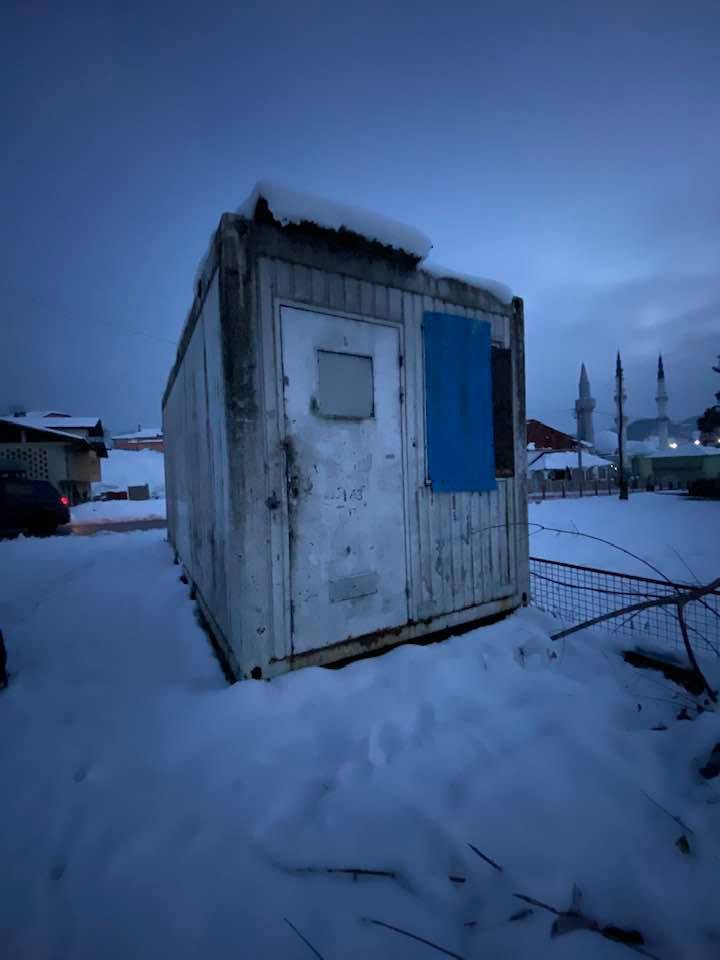

### AYS Daily Digest 1/2/2021: “Crimes against humanity” in the Mediterranean

Because We Carry NGO under fire again on Lesvos\. Call for action on the Balkan route\. EU\-Afghanistan deportation deal to be renewed\. Investigation launched in Spain against anti\-migrant violence\.

](assets/6eecdf43df9d/1*VvA5U-RNh_cGT7Fg-Av_Jw.jpeg)

Ocean Viking, artwork by [Hippolyte Art](https://www.facebook.com/hippolyteart/photos/a.536272619815252/3485201604922324/)
#### FEATURED — “ _Crimes against humanity”_ in the Mediterranean

Pushbacks, shipwrecks, interceptions and lives lost at sea have become the normality in the Mediterranean, everyday events that de\-sensitise us all\. This is maybe one of the most striking results of a decade of never\-ending emergency: forcing individuals, activists, volunteers, grassroots organisations and NGOs to focus so much energy on demanding the respect of human lives at sea \(or at land borders\), something that — really — should be a given in any ‘normal’ democratic society\. Evidently, Europe is not that\.
#### EAST — More pushbacks and more government propaganda

[Legal Centre Lesvos published](https://legalcentrelesvos.org/2021/02/01/crimesagainstumanityintheaegean/) a new report, based on recent additional evidence shared by survivors of collective expulsions, which underscores the widespread, systematic and violent nature of this attack against migrants\.

> Beyond being egregious violations of international, European and national human rights law, this report argues that the constituent elements of the _modus operandi_ of collective expulsions in the Aegean **amount to crimes against humanity within the definition of Article 7 of the Rome Statute of the International Criminal Court\.** 

Read the full report [HERE](http://legalcentrelesvos.org/wp-content/uploads/2021/02/Collective-Expulsions-in-the-Aegean-LCL-01.02.2021-1.pdf) \.

In January 2021 alone, [Aegean Boat Report have registered](https://www.facebook.com/AegeanBoatReport/posts/1021901301666307) 10 illegal pushbacks \(169 people\) in the Aegean Sea, performed by the Greek coast guard\.

Six of these pushbacks \(77 people\) were performed using rescue equipment/life rafts, left helplessly drifting at sea by the Hellenic Coast Guard\.

Many of these people were picked up on the Greek Aegean islands, after they had already arrived, transported by vessels by the Hellenic Coast Guard back to sea and forced onto these tent\-shaped rafts\.

> In a normal world, people are rescued from life rafts, and not forced onto one and left drifting at sea\. 

The Turkish coast guard picked up 583 people floating in the Aegean Sea, in 21 cases in January, and 47\.6% of these cases had been pushed back by the Greek coast guard\.

The Greek government, meanwhile, carries on with its propaganda\. [In an interview with Zeit journalists](https://www.zeit.de/politik/ausland/2021-02/migrationspolitik-griechenland-eu-moria-notis-mitarachi/komplettansicht) , Migration and Asylum Minister Notis Mitarakis stated that pushbacks are not happening in the Aegean Sea, using the results of the Frontex internal investigation as proof\. The minister forgot that the internal investigation is not over yet and that the very group carrying out the investigation also accused the agency’s executive director Leggeri of hindering their work with delay and obstacles to accessing relevant information and documents\.

Mitarakis carried on:

> Such videos can be faked very easily\. I don’t understand why you are so sure that they are real\. People smuggling is a huge, dirty business\. There are also non\-governmental organisations that have been investigated in Greece for possible involvement in people smuggling\. So we have to be careful how we deal with the claims made on Twitter, Facebook or anywhere else\. People who are ideologically biased keep making unsubstantiated accusations against us\. There are people who don’t want borders, they also want to abolish passports and visas\. You are welcome to try that on yourself\. But as a European country we are committed to the Schengen rules and thus also to the protection of the external border\. 

No further comments\.
#### CENTRE — Another forgotten shipwreck

 \)](assets/6eecdf43df9d/1*IPAhQTEotZlWEN7H2WS1fg.png)

“January 2021 ended with at least 68 people who had lost their lives in the waves of the central Mediterranean\. European states need to return to rescuing people in distress and to free NGO ships to avoid further predictable deaths\.” \( [Sea\-Watch](https://www.facebook.com/seawatchprojekt/posts/2752594791625251) \)

■■■■■■■■■■■■■■ 
> **[IOM Libya](https://twitter.com/IOM_Libya) @ Twitter Says:** 

> > In the period of 26 January to 1 February, the bodies of eight migrants washed up on shore and no survivors returned to Libya.

👇IOM Libya's Maritime Update👇 https://t.co/DG2jby90SK 

> **Tweeted at [2021-02-01 15:50:37](https://twitter.com/IOM_Libya/status/1356268726774099971).** 

■■■■■■■■■■■■■■ 

AlarmPhone [report](https://alarmphone.org/en/2021/01/31/another-forgotten-shipwreck-off-libya/) that 10 people from Libya have been missing at sea since November 9\. AlarmPhone was contacted by several family members who were asking about their relatives\. It seems that only one of the people on board survived, the only one who managed to swim back towards the Libyan shore and was rescued by a fisherman\.

> According to the survivor, about 4 hours after their departure from Tripoli port, water started entering the fiberglass boat, until it suddenly capsized and flipped upside down\. It was about 1 am and the people did not manage to call anyone for help\. They lifted the woman and the girl on top of the the flipped boat, while the others stayed close to the boat wearing life jackets\. 

> When, in the morning, they realised that no help would come, some of men who could swim decided to swim back to the shore and search for help\. The woman and the child had to wait, sitting on the flipped boat\. The survivor reported that after a while he realised that he was alone, and he could not see the others swimming behind him anymore\. While he was swimming, he saw an airplane or a drone as well as a vessel, but no one helped\. 

 \)](assets/6eecdf43df9d/1*Of3bhFEUCNW_lw6BW8SfmQ.jpeg)

\(via [Alarm Phone](https://alarmphone.org/en/2021/01/31/another-forgotten-shipwreck-off-libya/?fbclid=IwAR0ivfRIH_fsOhWrk_xWbma0Rvk_j0gCY-38H0pYPrCAmi8OsVEkqvC4Lhs) \)

Once back on the Libyan shore, the survivor was able to report about the shipwreck\. Hours later, a Libyan coast guard vessel found the fiberglass boat, but it was far too late\.

Once again, Europe and their proxies in Libya prefer to observe people die, instead of rescuing them\. Once again, 10 people fell victim to the brutality of EU migration policies\. These are their names: **Mansour Al\-Kilani, Ahmed Akkari, Ramy Fawzy Baki, Muhammad Al\-Mazugi, Mahmoud Al\-Kikli, Abdullah Al\-Huni, Hani Qashout, Fadia Al Jaroush, Farah Qashout \(7 years old\), Siraj Bin Arous\.**

Once again, AlarmPhone is the only source for understanding what is happening at Europe’s southern borders, while authorities treat distress calls, SAR events, and tragedies at sea as something to hide, as a state secret, refusing to answer, refusing to act, refusing to provide information\.
#### WEST — Shocking number of deaths, but also growing struggles on the ground

AlarmPhone also published their Western Mediterranean Regional Analysis, 1 October — 31 December 2020: read it [HERE](https://alarmphone.org/en/2021/01/29/shocking-number-of-deaths-but-also-growing-struggles-on-the-ground/) \.

Some brighter news: Astral heading to the Central Mediterranean\.

■■■■■■■■■■■■■■ 
> **[Open Arms ENG](https://twitter.com/openarms_found) @ Twitter Says:** 

> > We set sail!  #Astral leaves its base port in #Badalona and sets course #Mediterranean central on an observation and surveillance mission.  The #OpenArms will join forces shortly to monitor what happens in the most silenced graveyard of the planet. https://t.co/p8axfjBL2x 

> **Tweeted at [2021-02-01 21:06:05](https://twitter.com/openarms_found/status/1356348118770585605).** 

■■■■■■■■■■■■■■ 

AFGHANISTAN\-EU
#### New agreement on deportations to be approved

Deportations to Afghanistan from the EU have been a brutal reality for many years now\. They are regulated by a 2016 Joint Way Forward agreement signed by representatives of Afghanistan and the EU, and by bilateral agreements between Afghanistan and various European countries\. The 2016 Joint Way Forward expired in October 2020 and since then a new text has been under negotiation\.

Now, Statewatch has [published](https://www.statewatch.org/news/2021/february/eu-afghanistan-informal-deportation-agreement-full-text-of-the-new-joint-declaration/?fbclid=IwAR2Cv6vwA0_QxnQoFA1UwK-97qKb5Qz9D8RfI3v1Yx0ZhHv4mlTvQ--bV9A) the new draft agreement which needs to be formally approved by the European Council\.

The General Secretariat of the Council highlights “significant improvements” in the new declaration:

> _– a tighter definition of vulnerable groups, notably the family unit and seriously sick people;_ 
 

> _– clarification that all EU Member States may participate in joint return operations by non\-scheduled flights under the JDMC, even if they have concluded a bilateral agreement or arrangement with Afghanistan;_ 
 

> _– EU escort staff and other accompanying staff do not need to carry a valid Afghan visa unless they must enter the territory of Afghanistan;_ 
 

> _– all Afghan returnees to be readmitted upon arrival;_ 
 

> _– indefinite duration of the Declaration\._ 

GREECE
#### Arrivals

A 20\-year\-old youth was [rescued](https://www.alithia.gr/koinonia/o-nayagos-irthe-me-xylini-shedia-apo-tin-toyrkia) by a Greek ferry off the coast of Chios\. He was trying to reach the Greek island alone on a makeshift raft and is now in quarantine on the island\.
#### Because We Carry attracts more criticism

The Dutch NGO had already been criticised in December after the founder of the organisation released statements blaming the people living in Moria 2\.0 for the condition of the few toilets in the camp\. Again, the NGO has proved to be quite out of touch with the reality in which it operates\. As reported by [Dutch activists](https://indymedia.nl/node/48972) , Because We Carry distributed a questionnaire in the camp, asking residents to choose which improvements are most needed\. Initiatives like this only risk normalising the deprivation which people on the move are forced to deal with day after day\. ‘Empowering’ people to choose between “education for kids/adults” and “better quality food”, or between “more security” and “better tents” is a dangerous game, which only perpetuates the racist policies of the Greek authorities, and turns organisations like Because We Carry into \(unwilling?\) accomplices\.
#### Updates from Lesvos

Journalist Franziska Grillmeier [report](https://twitter.com/f_grillmeier/status/1356303356948582402) s that in the week between January 18th\-24th, a total of 71 people arrived on the island\. In comparison: last year 284 people arrived on the island during the same period\. A total of 7,198 people reside in the Moria 2\.0 camp\. The majority of the population are from Afghanistan \(71%\), the Democratic Republic of the Congo \(9%\) and Syria \(7%\) \. One third are children, mostly under the age of 10\. Approximately 4\.5% of these children are unaccompanied\.
#### Small improvements in Moria 2\.0

#### **We will not be gagged**

Athens\-based [ECHO Mobile Library](http://echo-greece.org/blog/january-2021) wrote a blogpost summarising the changes introduced by the law passed on November 30th, which effectively limits or criminalises whistleblowing about the abuses of the refugee camps\.

> [The law](https://www.e-nomothesia.gr/kat-allodapoi/upourgike-apophase-23-13532-phek-5272b-30-11-2020.html) ; 

> Applies to all camp structures, open and closed, and to temporary accommodation of asylum seekers 

> Applies to all workers, volunteers and solidarians present, regardless of whether they are also residents of the camp themselves 

> Outlaws the disclosure of any information relating to residents of the camp using personal or organisational media 

> Stipulates that we must not report crimes and abuses committed against camp residents to anyone other than the Ministry\-appointed Commander of the camp 

ECHO stresses their opposition to this new crackdown on people’s rights:

> At the ECHO library, we’ve already got our own confidentiality rules in place; we don’t take any photographs or distribute personal information without people’s informed consent\. What we have never done is limit the distribution of information about the dire conditions and abuses\. These camps are a \(very expensive\) human rights abomination that both the EU and the Greek government should be ashamed of\. 

> If they’re trying to stop the word getting out about what’s happening, then they’re in for a shock\. We will not be gagged\. 

#### Hunger strike in Paranesti detention centre

The anti\-racist organisation KEERFA [report](http://antiracismfascism.org/index.php/2823-apergia-peinas-sto-kentro-krathshs-paranestioy-gia-toys-basanismoys-apo-astynomikoys) s that a group of people detained in Paranesti, who had denounced beatings and torture at the hands of the police, went on a hunger strike on Saturday, January 30th\.
They are protesting because no serious response to their accusations was provided by the authorities and their detention has been extended despite having already been in Paranesti for 18 months\.
#### Assessment on judicial review of asylum cases

Refugee Support Aegean \(RSA\) [report](https://rsaegean.org/en/the-council-of-state-pilot-procedure-on-judicial-review-in-the-asylum-procedure/?fbclid=IwAR2pz2S4y4VoBmf4aLKcGFtGDn9chmRxAWC05eTu-rJ2rQ906P4_jYDxhtg) that the Council of State Plenary will be assessing the constitutionality of provisions transferring competence for judicial review of asylum decisions, taken by the Independent Appeals Committees, from administrative appeal courts to the first\-instance Administrative Courts of Athens and Piraeus\. Since the end of 2019, Appeals Committees are exclusively composed of judges\. The case forms part of a [pilot procedure](http://www.adjustice.gr/webcenter/portal/epitropeia/generaldd/anakoinwseis01?contentID=DECISION-TEMPLATE1603109118438&_afrLoop=4255809291581888#!%40%40%3F_afrLoop%3D4255809291581888%26centerWidth%3D65%2525%26contentID%3DDECISION-TEMPLATE1603109118438%26leftWidth%3D0%2525%26rightWidth%3D35%2525%26showFooter%3Dfalse%26showHeader%3Dtrue%26_adf.ctrl-state%3D8pyr3zr42_33) on the basis of three annulment applications supported by Refugee Support Aegean \(RSA\) \.
#### New police patrol car not suitable for dirt roads

On a semi\-serious note, media reports that the [new police cars](https://www.kathimerini.gr/life/auto/561194518/278-nissan-qashqai-gia-tin-astynomia/) recently brought on the Evros border to patrol the area are clogging the two main highways in the area\. The reason behind this is that the [new vehicles are not suitable for driving on dirt tracks](https://www.evros-news.gr/2021/01/29/%ce%b1%ce%ba%ce%b1%cf%84%ce%ac%ce%bb%ce%bb%ce%b7%ce%bb%ce%b1-%ce%b3%ce%b9%ce%b1-%cf%80%ce%b5%cf%81%ce%b9%cf%80%ce%bf%ce%bb%ce%af%ce%b5%cf%82-%cf%83%cf%84%ce%b9%cf%82-%cf%80%ce%b1%cf%81%ce%ad%ce%b2/?fbclid=IwAR2AzowzuAQFHtjdashx2a5oDT5jKs_bBpTcsECIIdH2YZDvkBMp0GIfxWI) and thus they cannot be used to patrol dirt roads along the border\. The Citizen Protection minister bought 278 of these vehicles…

ITALY
#### Mayors of towns bordering France against proposed transit centre

InfoMigrants [report](https://www.infomigrants.net/en/post/29987/italian-border-towns-summit-we-are-not-a-transit-center) that the mayors of Ventimiglia and the border towns of Vallecrosia and Camporosso met with other local and national authorities on January 28th, and expressed their refusal to open a new transit centre for people on the move in their areas, a proposal promoted by the Italian interior ministry\.

SPAIN
#### Investigation launched on anti\-migrant attacks

Media [report](https://www.publico.es/politica/racismo-fiscalia-investiga-grupos-organizaron-atacar-migrantes-gran-canaria.html?fbclid=IwAR2EVDJEj9YlY0oiFQOh4FxykNO_3Ev0n6RA2A9EjRPaXt5oG0DN5cSXuKc) that Las Palmas Prosecutor’s Office is investigating the groups that organised attacks on people on the move housed in hotels in Gran Canaria\. The investigation centres around several messages and forums on WhatsApp that circulated two weeks ago with express calls to travel to the south of the island to attack people staying in some tourist establishments and camps\. The timing of this investigation has been [criticised](https://twitter.com/javierbauluz/status/1356226787387310092) , as these online threats have already turned into physical aggressions\.

> The Cruz Blanca Foundation, dependent on the Franciscan Brothers, has denounced the fact that the camp it manages, a school in the El Lasso neighborhood, in Las Palmas de Gran Canaria, is repeatedly stoned and that its users suffer threats and attacks\. At least seven of its residents were attacked between Monday and Friday of last week\. \( [El Pais](https://elpais.com/espana/2021-02-01/la-fiscalia-investiga-a-grupos-que-se-organizaron-para-agredir-a-inmigrantes-en-gran-canaria.html) \) 

El Pais also published a photo essay on the escalating xenophobia on the islands\. Check it out [HERE](https://elpais.com/elpais/2021/01/29/album/1611930704_549800.html#foto_gal_1) \.

BOSNIA AND HERZEGOVINA
#### Call for action — Balkan route: what can be done?

■■■■■■■■■■■■■■ 
> **[Lesvos Calling](https://twitter.com/CallingLesvos) @ Twitter Says:** 

> > ⏰Balkan route: What can be done?article
Call for action! online meeting the 4th of February 8.00 pm
⏰Rotta balcanica: che fare?
Call for action! assemblea giovedì 4 febbraio ore 20
By @[CallingLesvos](https://twitter.com/CallingLesvos) , Linea d'Ombra ODV, Strada Si.Cura
info: lesvoscalling@gmail.com
#EUShame https://t.co/2CEUzJCPFd 

> **Tweeted at [2021-01-21 11:40:59](https://twitter.com/CallingLesvos/status/1352219638713774081).** 

■■■■■■■■■■■■■■ 

Lesvos Calling campaign, Linea d’ombra ODV, and Strada Si\.Cura have launched a proposal for a transnational discussion on what can be done at a grassroots level regarding the situation across the Balkan route\.

> … there is another urgent and necessary matter: that of destroying the way in which what happens on the borders is told\. At the moment, the situations keeps shifting from moments of emergency, to other periods of time during which everything seems to be just fine, and nothing and no one can get any news out\. 

> … For us, the only actual solution is to crack the border system\-regime, to highlight the EU’s criminal policies \(see the last pact on immigration and asylum, focused on detention and repatriation and a twisted interpretation of the term “solidarity”\), and to help in any way possible people’s movement\. 

> We do not want to do it by ourselves, because during these years of travels and encounters, we have built relationships with many different people and organizations that work at the borders, and we have become aware of the fact that that of migrations is a battlefield in which it is necessary to build intersectional processes\. 

> We therefore invite all social organizations, associations, collectives and individuals to discuss a plan for an initiative that could overturn the hypocrisy of borders, challenging those borders and, if possible, actually forcing them into a crisis\. 

> **Online meeting on the 4th of February, 8\.00 pm CET\.** 

 \)](assets/6eecdf43df9d/1*2ymPN9WJ_OqfItIINcILcA.jpeg)

\#BalkanRouteEurope — Velika Kladusa, February 1st, 2021 — “Walking past the container that one year ago was a shelter for three people, with Miral camp on the background” \(Photo and text by [Lorena Fornasir](https://www.facebook.com/lorena.fornasir/posts/3626431854140552) \)

SERBIA
#### Update from Belgrade

Collective Aid [report](https://www.instagram.com/p/CKwkdubD6fU/) on an increase in unaccompanied minors frequenting the WASH centre they opened in Belgrade\.

> These boys, and all minors we serve, deserve far more than shower and laundry facilities\. As young adolescents they deserve sanitary living conditions and safety\. 

> A member of our team recently found body lice among the minors’ clothing, highlighting the poor living conditions people endure\. This is sadly a common issue faced by people exercising their basic human right to seek safety\. The EU claims to be ‘’by Serbia’s side to manage migration efficiently and humanely\.’’ and, ‘’this support ensures access to health services, schooling, and social protection of the migrants, with special attention to unaccompanied minors, \(The Delegation of the EU to the Republic of Serbia, 2021\. \)’’ During the course of our work we’ve found this statement to be false, as shown by the circumstances\. While some of these protections exist inside the official camp system, it must be acknowledged and accepted that there are many legitimate reasons people do not want to enter this system\. 

Read more and support them HERE\.

HUNGARY
#### The Hungarian Helsinki Committee nominated for the Nobel Peace Prize

Some positive [news](https://www.reuters.com/article/idUSKBN2A007W) , for once\. The Hungarian Helsinki Committee have operated relentlessly over the last year defending the rights of those targeted by the Hungarian government’s policies and their work has been instrumental in forcing Frontex to suspend operations in the country\.

UK
#### Solidarity with people in Napier barracks

■■■■■■■■■■■■■■ 
> **[Care4Calais](https://twitter.com/Care4Calais) @ Twitter Says:** 

> > Over 250 people are trapped in Napier Barracks - cold, tired, and confused. Many are sick with Covid &amp; have no medical support.

Yesterday, we sent a message from our volunteers in Calais - it inspired hope, and other volunteers joined in to send their own messages of support. https://t.co/kxqf0Fihrt 

> **Tweeted at [2021-02-01 14:49:56](https://twitter.com/Care4Calais/status/1356253454356918273).** 

■■■■■■■■■■■■■■ 

#### Scotland: integration program to be launched by Highland Council

Media [report](https://www.pressandjournal.co.uk/fp/news/highlands/2856790/programme-to-help-refugees-become-new-scots-as-part-of-highland-communities-moves-forward/?fbclid=IwAR3xr_U6DwmfFMLCM13dm3rQkzHsypGVWVIz-5rp_DoLwGbfc_TiOM22MOU) that a new education and skills programme to help new and existing refugees to become ‘new Scots’ and be part of rural communities in northern Scotland is to be launched by the Highland Council\. It is a £240,000 contract, a collaboration between Highlife Highland and the local authority which has been funded by the UK Government, and it will involve the launch of an English language, employability and integration scheme as part of the Refugee Resettlement Programme\.
#### SolidariTee week of action

From Monday 1st to Sunday 7th, [SolidariTee](https://www.solidaritee.org.uk/) is organising a series of actions, talks, events and screenings\. See what’s happening [HERE](https://www.solidaritee.org.uk/week-of-action-2021) \.

WORTH LISTENING TO
- Introducing our brand new podcast, [**‘Beyond Borders’**](https://www.facebook.com/camrefugeecampaign/posts/3497958520326696) \! Every two weeks, our VP, Fred Holker, speaks to guests from around the world about the world of refugee education\. Committed to making the humane case for widening refugee access to universities, the podcast platforms refugees to speak about their own experiences\.
- [The ungrateful refugee: ‘We have no debt to repay’](https://www.theguardian.com/news/audio/2021/feb/01/ungrateful-refugee-dina-nayeri-podcast?fbclid=IwAR2XzhKJETPD2yDhqjtYJPlpxnXDKWGe-55O_1OZ5J-mvNgwjYYzhumfwGM) \. Dina Nayeri was just a child when she fled Iran as an asylum seeker\. But as she settled into life in the US and then Europe, she became suspicious of the idea that refugees should shed their old identities and be eternally thankful
- [**How local elections \(really\) influence migration policy**](https://www.stitcher.com/show/the-cities-of-refuge-podcast/episode/5-how-local-elections-really-influence-migration-policy-81266394?fbclid=IwAR0ECBwitIMNFVcd3JbNtiGls7JRw0k4yM_XbTonG3eWYu0OeOGM98A9KXY) **,** the latest episode of the City of Refuge podcast\. Local elections, unlike national ones, are rarely perceived as the gamechangers that they often are for the reception and integration of newcomers\. Moritz Baumgärtel, Elif Durmus, Tihomir Sabchev and Sara Miellet take a closer look at their highly varied impact and more generally at the dynamics of local politics\.

WORTH READING
- [**The violence of welfare bureaucracies for refugees in northern Europe**](https://theconversation.com/welcoming-european-welfare-states-are-forcing-refugees-through-mazes-of-harmful-rules-152704?fbclid=IwAR1B5kdOFEKrJUJ5xpQUlG7hc-4rLni-NVPiFyJInFB9A_LarivaVW2JoGA) is well described in this article \(and [book](https://www.manchesteropenhive.com/view/9781526146847/9781526146847.xml) by the same authors\), which argues that “day\-to\-day interactions with state representatives such as police and immigration officers, caseworkers and social workers remind refugees that they are seen as an imposition on the welfare state, while being denied the ability to become contributing members to it\.”
- [Liberal and Realist Explanations of Merkel’s “Open\-Door Policy”](http://www.inquiriesjournal.com/articles/1870/liberal-and-realist-explanations-of-merkels-open-door-policy-during-the-2015-refugee-crisis?fbclid=IwAR0O28PYE0eOLRQB1_PoEBrpcuTTP74TNQ9pHZE6IeknGyMGhmNKAie5zPU) , a deep and insightful analysis of Germany’s 2015 response to the migratory influx\.

A deep and insightful analysis of Merkel’s ‘open\-doors’ policy, seen through the lenses of liberalism and realism\.

**Find daily updates and special reports on our [Medium page](https://medium.com/are-you-syrious) \.**

**If you wish to contribute, either by writing a report or a story, or by joining the info gathering team, please let us know\.**

**We strive to echo correct news from the ground through collaboration and fairness\. Every effort has been made to credit organisations and individuals with regard to the supply of information, video, and photo material \(in cases where the source wanted to be accredited\) \. Please notify us regarding corrections\.**

**If there’s anything you want to share or comment, contact us through Facebook, Twitter or write to: areyousyrious@gmail\.com**
### Sign up for AYS Daily Newsletter
### By Are You Syrious?

Daily news digests from the field, for volunteers, people on the move, journalists, and the general public [Take a look](/are-you-syrious/newsletters/ays-daily-newsletter?source=newsletter_v3_promo--------------------------newsletter_v3_promo-----------)

_Converted [Medium Post](https://medium.com/are-you-syrious/ays-daily-digest-1-2-2021-crimes-against-humanity-in-the-mediterranean-6eecdf43df9d) by [ZMediumToMarkdown](https://github.com/ZhgChgLi/ZMediumToMarkdown)._
