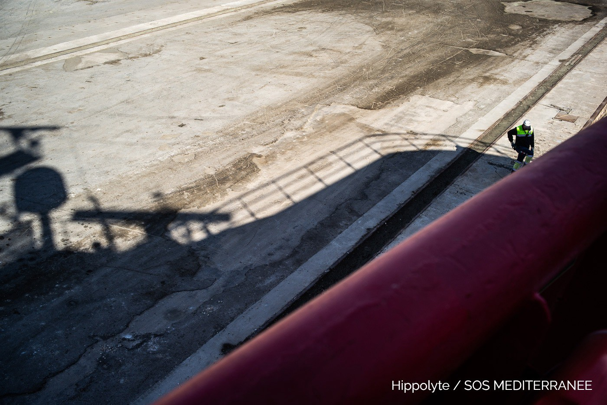
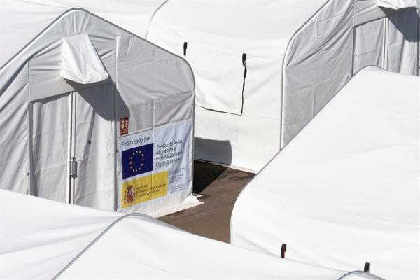
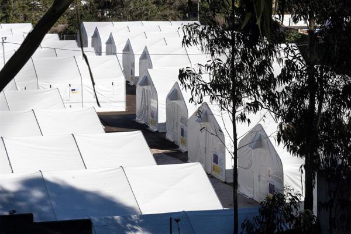
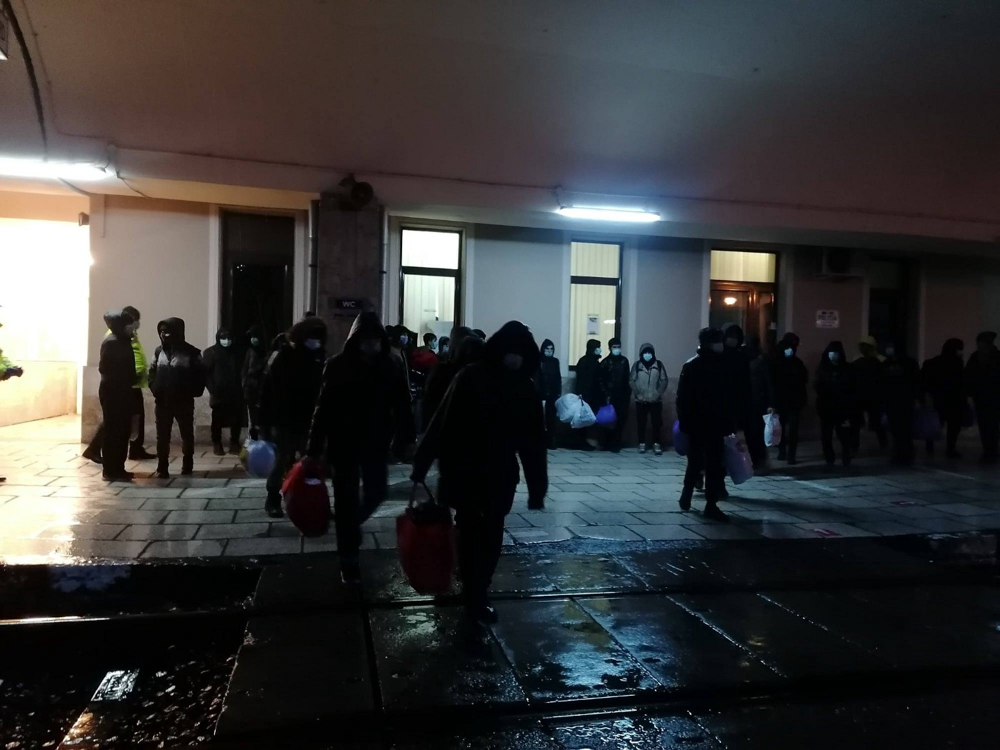
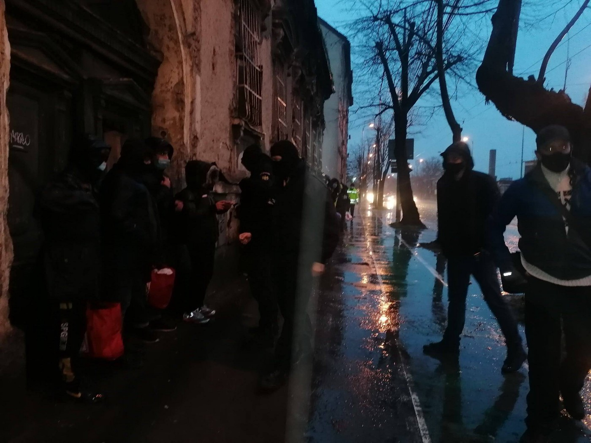
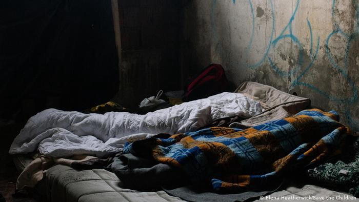

### Daily Digest 02/02/21 Four years since Italy\-Libya agreement & “nothing has changed”

_31 rescued in Spain // floods on Samos // court ordering asylum seeker to be relocated from Barracks // Open Arms and Ocean Viking are back // and more…_

](assets/79cc2b639202/1*58y6IZRDUFj56-rv8wyLXg.jpeg)

4 years…nothing has changed\. Photo by [picture alliance/Xinhua/H\. Turkia](https://www.dw.com/en/libya-takes-over-from-italy-on-rescuing-shipwrecked-migrants/a-44546754)
### FEATURE: Four years after the Italy\-Libya Memorandum of Understanding & “nothing has changed”

Reporter Angela Caponnetto remarked on some of the numbers since the Memorandum of Understanding agreement:

> “4 years ago the memorandum of understanding was signed between Italy and Libya for the control of migratory flows\. Over 785 million of Italian funds, 50 thousand people brought back to captivity in Libya \(12 thousand in 2020 alone\), about 6500 deaths at sea\. And nothing has changed\.” 

Amnesty International Italy just released a report called [**Italy\-Libya Memorandum of Understanding: “Four years of complicity in crimes under international law”\.**](https://www.amnesty.it/memorandum-intesa-italia-libia-quarto-anniversario/) The report recounts many more incidents of torture and death over the past four years:

> “ **More than 50,000 refugees and migrants intercepted at sea by the Libyan coast guard and brought back to Libya starting from the signing of the Memorandum of Understanding** , under the banner of which the Italian government has offered abundant support to Libya, in particular through patrol boats, training for coast guard and assistance in declaring a Libyan search and rescue \(SAR\) zone and coordinating operations at sea\. 

> As repeatedly pointed out by Amnesty International, Italy has provided its assistance without worrying in the least about the consequences for people — women, men and children — brought back to Libya and locked up in detention centers or disappeared into thin air\. In order to reduce the number of irregular arrivals in Italy, the Italian authorities became complicit in the abominable crimes under international law committed in detention centers, which could have been widely foreseen\. Even when at liberty, refugees and migrants trapped in Libya remain at constant risk of murder, kidnapping, robbery, violence and exploitation by armed militias or criminal gangs who enjoy complete impunity\. 

> **While fully aware of the suffering caused by the application of the Memorandum, a year ago the Italian government renewed it for a further period of three years\.** At the time of the renewal, to avoid criticism, the Minister of Foreign Affairs, Luigi Di Maio , had undertaken to modify the text of the Memorandum in order to insert guarantees to protect human rights\. A year later, Amnesty International points out that this commitment has been largely disregarded and that the minimal and completely insufficient improvements proposed by the Italian government have not even been accepted by the Libyan counterpart\. Nonetheless, the Italian authorities continued to provide their assistance, including through the extension of military missions in Libya and the donation of new patrol boats\.” 

MSF has also released a report entitled [**Italy\-Libya Agreement: 4 years of failure, abuse and torture under the sign of political cynicism**](https://www.medicisenzafrontiere.it/news-e-storie/news/accordo-italia-libia/) \. They conclude with these very important recommendations:

> “Taking into account the current political crisis, we therefore ask Parliament to set up a Commission of Inquiry, which investigates the real impact of the money spent in Libya and on shipwrecks in the Mediterranean and to present a text that commits the Government to: 

> →Terminate the Italy\-Libya agreement , subordinating any future bilateral agreement to the political transition of the Libyan crisis, as well as the necessary reforms of the legal system that eliminate arbitrary detention and provide for adequate assistance and protection measures for migrants and refugees; 

> →Give the address to not renew the military missions in Libya , asking with force the closure of detention centers in the north African country;
 

> promote, at the European level, the approval of a plan for the evacuation from Libya of the most vulnerable and at risk of suffering violence, ill\-treatment and serious abuse; 

> →Give mandate for the establishment of a European naval mission with the clear task of searching and rescuing people at sea; 

> →Promote, at the European level, the approval of an automatic mechanism for the immediate disembarkation and the subsequent redistribution of people arriving on the southern coasts of Europe, on the basis of the principle of sharing responsibilities between member states on asylum and immigration; 

> →Promote the revocation of the Libyan search and rescue area , as it is only aimed at the illegal interception and rejection of people in Libya;
 

> recognize the role of humanitarian organizations in safeguarding human life at sea, putting an end to their criminalization and freeing their humanitarian vessels still under arrest\.” 

#### SEA
### Both Open Arms and the Ocean Viking are off to rescue more lives

 and photos by Hippolyte/ SOS MEDITERRANEE](assets/79cc2b639202/1*IXP8bFK1nTZh7tBmOPL0ZA.jpeg)

“BREAKING The OceanViking has just left the port of Augusta, Sicily, and is on his way back to central Mediterranean where our teams will resume their lifesaving work\.” Info by [SOS MEDITERRANEE Switzerland](https://twitter.com/SOSMedSuisse/status/1356568881498894336) and photos by Hippolyte/ SOS MEDITERRANEE

■■■■■■■■■■■■■■ 
> **[Open Arms ENG](https://twitter.com/openarms_found) @ Twitter Says:** 

> > 🔴 #OpenArms leaves #BCN behind and heads for the #Central Mediterranean, where there are so many vulnerable lives in danger and the silence of so many accomplices that drowns them.
Mission 80 begins. 
Good bow, team! https://t.co/vSKSmNMDlp 

> **Tweeted at [2021-02-02 14:48:02](https://twitter.com/openarms_found/status/1356615366294798340).** 

■■■■■■■■■■■■■■ 

Mare Liberum e\.V\. just posted an update: _“We submitted a report to_ 
_[@UNHumanRights](http://twitter.com/UNHumanRights) on the dramatic increase of violence and ill\-treatment of refugees in the Aegean\. From 03/2020–12/2020 alone we counted 321 pushbacks, in which 9,798 refugees in Greece were pushed back\. The voices & the rage of migrants trapped at EUs borders have become so loud, that they cannot be overheard\! Many other networks have submitted their reports to_ 
_[@UNHumanRights](http://twitter.com/UNHumanRights) as well\. We hope these systematic rights violations & the war on refugees will finally be addressed\!”_ More [here](https://twitter.com/teammareliberum/status/1356610326104522752) \.

 \. Photo by AlarmPhone](assets/79cc2b639202/1*HhnqblLvZ68lydRzreGSAw.png)

AlarmPhone announced a new event of solidarity: “ **_On 9 February_** _, families of 91 people who went missing in an invisible shipwreck off Libya a year earlier will organize a demonstration in Darfur\. In solidarity with them, there will be CommemorActions in many cities\. \#SayTheirNames”_ Learn more [here](https://twitter.com/alarm_phone/status/1356574427350188033) \. Photo by AlarmPhone
#### GREECE
### CHIOS: Residents protest govt plans for closed camp

According to [Greek media](https://www.ekathimerini.com/261907/article/ekathimerini/news/chios-residents-mobilize-against-new-migrant-center?fbclid=IwAR3bpLH5PKKIn6Tln2YFDEWCFp-va64SnjixeSN6OMmtHughmCVj4rF2T98) : “ _Residents of the island of Chios plan to hold a protest rally on Wednesday against the creation of a closed controlled structure in the area of Akra to house asylum seekers\. The plans for the next structure were announced last week by Migration Minister Notis Mitarakis to the chagrin of locals from the villages of Sykiada, Langada and Vrontadou, whose councils have issued resolutions against its creation\. Mitarakis said the structure will replace the VIAL reception and identification center that has been operating since 2016 and currently houses 2,340 people while its capacity is 1,040 people\. He stressed there will be further decongestion until the new structure is operational\. Local residents plan to escalate mobilizations until Saturday, when they intend to travel en masse to Hora, the capital\. **They say migrants should only be registered on Chios and then transferred to the mainland** \._ ” Evacuate the islands now\!
### SAMOS: Severe storm

■■■■■■■■■■■■■■ 
> **[Samos Volunteers](https://twitter.com/samosvolunteers) @ Twitter Says:** 

> > ⚠️update on Samos rainstorm:

The ‘Jungle’ is very much flooded now.

🎥 by camp residents

#EvacuateNow #SamosRefugees #RefugeesGr https://t.co/09n28Tr6g9 

> **Tweeted at [2021-02-02 15:26:26](https://twitter.com/samosvolunteers/status/1356625030667522050).** 

■■■■■■■■■■■■■■ 

■■■■■■■■■■■■■■ 
> **[Katy Fallon](https://twitter.com/katymfallon) @ Twitter Says:** 

> > If anyone want's a glimpse into current conditions in Samos here is a thread. Just over 3,300 people live here in a space originally designed for 649. 

> **Tweeted at [2021-02-02 11:33:57](https://twitter.com/katymfallon/status/1356566524304187392).** 

■■■■■■■■■■■■■■ 

### LESVOS: 5\.2 magnitude earthquake

Journalist [Franziska Grillmeier](https://twitter.com/f_grillmeier/status/1356374464024424451) reported that _“Today a 5\.2 magnitude earthquake rocked Lesbos\. ‘We didn’t feel any of this in the tent,’ says the resident of KaraTepe , ‘it’s always as loud here as it is at sea\.’ Then she says: ‘There are a lot of things that I can’t really say anymore, things get like that for me \(I feel\) indifferent\.’”_
### PATRAS: Police brutality

In a [No Name Kitchen](https://twitter.com/NoNameKitchen1/status/1356633442352521217) update, they quote a person who has experienced police violence in Patras: _“I was hiding beneath a truck when a security guard noticed me\. He released the dog onto me\. The dog bit my right upper arm\. After the dog attacked me, I started to escape\. The guard ran after me but didn’t manage to catch me\.”_
#### MALTA
### “Claims of physical torture, suicide attempts by detained migrants in Malta”

Info Migrants is reporting that _“The European Asylum Support Office \(EASO\) based in Valletta, Malta, has received reports of physical torture from migrants detained in the country, a blogger and activist Manual Delia has claimed\. EASO says it has discussed the reports with Maltese authorities, but in an article published in the Times of Malta, Delia said the home affairs ministry denies having received reports of physical ill\-treatment of detainees\._

_Delia obtained information from an anonymous source who said several detainees had reported having been ‘beaten, having their teeth damaged by beatings to their face and being taken to a room to be beaten up and left alone for several hours\.’ A spokesperson for EASO, Annis Cassar, said the organization was aware of some of the allegations mentioned, Delia reports\. Cassar said EASO was in continuous contact with asylum applicants in the course of carrying out their duties supporting the Maltese authorities\.”_ More [here](https://www.infomigrants.net/en/post/30007/claims-of-physical-torture-suicide-attempts-by-detained-migrants-in-malta?fbclid=IwAR2ZZ1QRwLrofGx-EjFexrtmnj46C_9sDZyexPmfDdyI2z55ao_e8w4KPp4) \.
#### SPAIN
### 31 people rescued to the south of Gran Canaria on Monday

Spanish news is reporting that “ _After being rescued, the immigrants were transferred to the Arguineguín dock , in the municipality of Mogán, where they were assisted by personnel from the Canary Islands Emergency Service \(SUC\) and Red Cross personnel\. Thus, two of the migrants had to be transferred to a hospital for minor pathologies_ \.” More [here](https://www.canarias7.es/canarias/rescatan-patera-inmigrantes-20210202105603-nt.html?fbclid=IwAR1Ad0oEaeO7NQoNmposxFVPBbaNkZMB7ckX9l_QAzDtVSjFeVm8CIkMZJk) \.

 , Photos by EFE / Miguel Barreto](assets/79cc2b639202/1*PaD14YOWgPbyKR8d0-7fAQ.jpeg)

“The largest of the camps for immigrants planned by the Ministry of Social Inclusion in Canarias is about to enter service\. It is located in Las Raíces, in La Laguna \( Tenerife \), and it can accommodate up to 2,000 people\.” Info by [EFE Canary Islands](https://twitter.com/EFE_Canarias/status/1355939535625007109?fbclid=IwAR18DctjMTfieKnL_rQWf7tc72xxoG71SJLRJ2KLdSuoau0n48fP3i2HQEI) , Photos by EFE / Miguel Barreto
### The ombudsman says free movement of asylum seekers must be allowed

Spanish news is reporting: “ _The Ministry of the Interior and the General Directorate of the Police are running out of excuses to continue preventing numerous asylum seekers who arrive in the Canary Islands, Ceuta or Melilla, from being able to move freely through the national territory\. To the forceful ruling of the Supreme Court of half a year ago, a letter from the Ombudsman is now added , to which he has had access to the SER , in which he recalls that hindering the mobility of these people to any corner of the country is against the law and therefore must end in this practice_ \.” More [here](https://cadenaser.com/programa/2021/02/02/hoy_por_hoy/1612243284_213068.html?fbclid=IwAR2rmIP7KJthfnPzUQaq8gnqw5krASitogfQa9KHbrBU4le-YHKxLicWpuU) \.

■■■■■■■■■■■■■■ 
> **[InfoMigrants](https://twitter.com/InfoMigrants) @ Twitter Says:** 

> > Locals working in the tourism sector on Spain's #CanaryIslands have been hit hard by #coronavirus lockdowns. Though many of them welcome foreigners, #migrants arriving irregularly from Africa who have been housed in empty hotels have caused xenophobia to escalate. https://t.co/5WlWZmXB1S 

> **Tweeted at [2021-02-02 15:15:00](https://twitter.com/InfoMigrants/status/1356622151470710789?fbclid=IwAR18DctjMTfieKnL_rQWf7tc72xxoG71SJLRJ2KLdSuoau0n48fP3i2HQEI).** 

■■■■■■■■■■■■■■ 

#### ROMANIA

Pictures posted by Dreptul la Oras alongside their Facebook post\.

According to the Romanian community organisation Dreptul la Oraș:

> “Romania is currently facing a record of asylum applications\. To a large extent this is because the route through Croatia has become very difficult\. The vast majority of migrant persons crossing the border from Serbia to Romania, want to reach a western country where they have relatives or acquaintances — i\.e\. to illegally cross the border and seek asylum there\.
 

> If they end up in the hands of border police, they must either seek asylum here or they will be taken to a detention center \(Horia, county\. Arad\) People who seek asylum must first be quarantined \(TM city hall offered a home for this\), and then end up at the refugee center\. Because in TM there are no more places at the center, many are distributed in centers in other cities \(there are 6 in the country\) \.
 

> People who appear through various press articles are a mix of these groups\. For those assigned to other cities, the easiest solution by the authorities is to send them back \(by train\) there\. It’s normal for these people to want to go to the countries where they are and their families\.
 

> We ask Timisoara City Hall and Guvernul României to find an emergency solution for these people who are stuck in Timisoara\. Or worst case scenario, to close their eyes, as they do to many other social issues \(instead of sending people against their will in centers in cities they have never heard of before\) \.
 

> Watch the activity of colleagues from LOGS Grup de Inițiative Sociale who during this period have mastered part of the responsibilities that the state refuses to respect\. Financial donations \(search their fb\) or food, or volunteering, would help them a lot\.
 

> If you would like to donate to our solidarity fund, in order to help refugees, you can send us ‘refugee donation’ at the description\. Recipient Name: Lorand Szakacs IBAN RO23INGB000099999102524\.” 

More [here\.](https://www.facebook.com/dreptullaorasTM/posts/1348826372132856)
#### BOSNIA AND HERZEGOVINA

Photo by Elena Heatherwick/Save the Children\.

DW reports on the situation in Bosnia:

> “About 1,000 underage refugees currently live in Bosnia\-Herzegovina, and about half are here alone, unaccompanied by an adult\. The majority are from Afghanistan, Syria and Pakistan\. For the most part, they are housed in the refugee camps which don’t offer separate areas for the minors\. They are unprotected and exposed to health hazards, harassment and violence\. About 50 unaccompanied minors don’t even have a spot in the camps\. They are unregistered, have nowhere safe to sleep and don’t receive regular food rations\. Still, somehow they make do\. ‘I have been sleeping in abandoned houses, eating what I get from organizations or locals for the past two months,” said Fahad,\* 17, who is camping out in Bihac\. It’s cold in the buildings, he said, adding that those living there build fires “but then we can’t breathe because of the smoke\.’” 

Info by [DW](https://www.dw.com/en/bosnia-unaccompanied-child-refugees-face-cold-violence/a-56408691?fbclid=IwAR2RdzQMqdC-J3hMEL2NjkVoNGl63S-Z3qle6v2OkPpgvCpN7e-ThpXbuSU) \. More reporting on children in Bosnia during winter [here](https://www.theguardian.com/global-development/gallery/2021/feb/02/a-bosnian-winter-families-bid-to-reach-europes-heart-in-pictures?fbclid=IwAR1T85UyCpjoF9LcrDK-LGDZu2xzyrRy393kM_6wRiG3-Jbqci1UamQv_Nw) \.
#### CROATIA
### Croatia’s Interior Minister unhappy with Italian MEPs trying to visit Bosnian border

Four Italian MEPs, Pietro Bartolo, Alessandra Moretti, Pierfrancesco Majorino and Brando Benefei, were stopped in their attempt to reach the Croatia\-Bosnia border area to check allegations of violence\. Many human rights groups have said that refugees are facing abuse by the Croatian Police in the area\. The MEPs were stopped before they could reach the site by the Croatian Police\. Croatia’s Interior Minister, Davor Bozinovic, said that they came with “the obvious intention to damage Croatia’s reputation\.” The MEPs told the Italian outlet Avvenire, “the police probably have something to hide: if we have been treated like this, imagine how migrants and potential asylum seekers could be treated\.” More [here](https://balkaninsight.com/2021/02/01/croatia-slams-meps-visit-to-bosnia-border-as-provocation?fbclid=IwAR27dj0IJIeDGT-KyxY2wZ5YZaHQ8dhucEKR_ajmQA_ysMAukWDeK_EWWRs) \.
#### SLOVENIA

![“The respondent mentioned that he was slapped in the face by a Slovenian officer, who apparently did not believe this answer\. He repeated the question and again slapped the respondent who gave the same answer\. This process was repeated 3–4 times before the officer stopped\.” “Members of our team in Bihać collected this testimony last week from an unaccompanied minor who was recently subject to a chain pushback from Slovenian\. It is likely that he was held in the \#Kozina station during the above exchange\.” Info by [No Name Kitchen](https://twitter.com/NoNameKitchen1/status/1356681017701064704) \. Read full testimony on BVMN [here\.](https://www.borderviolence.eu/violence-reports/january-13-2021-0000-12-km-south-east-of-crossing-a1-road-and-e61-slovenia/)](assets/79cc2b639202/1*Qdl9eouyRLTdscQIJKwvQQ.jpeg)

“The respondent mentioned that he was slapped in the face by a Slovenian officer, who apparently did not believe this answer\. He repeated the question and again slapped the respondent who gave the same answer\. This process was repeated 3–4 times before the officer stopped\.” “Members of our team in Bihać collected this testimony last week from an unaccompanied minor who was recently subject to a chain pushback from Slovenian\. It is likely that he was held in the \#Kozina station during the above exchange\.” Info by [No Name Kitchen](https://twitter.com/NoNameKitchen1/status/1356681017701064704) \. Read full testimony on BVMN [here\.](https://www.borderviolence.eu/violence-reports/january-13-2021-0000-12-km-south-east-of-crossing-a1-road-and-e61-slovenia/)
#### HUNGARY
### 4,903 pushbacks since EU Court declared illegal

In December 2020 the EU Court of Justice decided that Hungary’s pushbacks of refugees and asylum seekers are illegal\. The Hungarian Helsinki Committee and other human rights groups have collected evidence which reveals that, since this decision, Hungary has continued to pushback 4,903 people to Serbia\.

With this news, Frontex has suspended operations in Hungary as of 27/01/21\. InfoMigrants reports that András Léderer, senior advocacy officer with the Hungarian Helsinki Committee \(HHC\), is pleased by Frontex’s decision\. Léderer and HHC posted a map onto Twitter outlining the pushbacks\. Léderer said:

> “You know, normally it is a difficult task to prove human rights violations of this magnitude, especially when it comes to collective expulsions\. Then enters illiberal Hungary, proudly publishes hundreds of them on the Police’s official website\. We just had to put them on a map\.” 

 Photo by Google maps / Hungarian Helsinki Committee](assets/79cc2b639202/1*UebvBQCI7c16hxTTGlk-Ig.png)

“A screenshot of the Hungarian Helsinki Committee’s map showing the documented pushbacks of migrants from Hungary to Serbia since they were declared illegal by EU court\.” Info by [InfoMigrants,](https://www.infomigrants.net/en/post/29944/hungary-4-903-pushbacks-after-eu-court-declared-them-illegal?fbclid=IwAR2rmIP7KJthfnPzUQaq8gnqw5krASitogfQa9KHbrBU4le-YHKxLicWpuU) Photo by Google maps / Hungarian Helsinki Committee
#### GERMANY
### Family reunification cut in half in 2020

According to German news:

> “Due to the corona pandemic, Germany granted family reunification to only half as many relatives of refugees in 2020 as in the previous year\. In total, 12,502 relatives of refugees — who had been recognized under international law or as war refugees — were given the right to come to Germany last year, as the Neue Osnabrücker Zeitung reported on Monday\. That was almost half as many as in 2019, when 24,835 family members were allowed to join\. The newspaper refers to the answer of the Foreign Office to an oral question of the Left MP Ulla Jelpke\. This includes figures on international and so\-called subsidiary protection beneficiaries with limited protection status — often civil war refugees\.” 

More [here](https://www.sueddeutsche.de/politik/asylpolitik-familiennachzug-halbiert-1.5192370?fbclid=IwAR3nmsG62-QnjvUMZHgDLk6M5yy632s8JkRItwd_cJ5q_Iv0fyl6TUmuIfE) \.

In a [press release](https://www.proasyl.de/pressemitteilung/heutiger-fluechtlingsgipfel-im-kanzleramt/?fbclid=IwAR2ZZ1QRwLrofGx-EjFexrtmnj46C_9sDZyexPmfDdyI2z55ao_e8w4KPp4) on Tuesday, Pro Asyl said:

> “On the occasion of today’s refugee summit with representatives of civil society, PRO ASYL demands the evacuation and admission from the slum camps in front of and at the EU borders\. 

> Germany must once again become the motor in the EU to defend the human rights of those seeking protection\. The systematic push\-backs at the EU border must be stopped\. There is space for Germany, there is no prospect of protection and asylum in front of Europe’s border in Bosnia or on the Greek islands\. The Federal Government must face up to its humanitarian and human rights responsibility\. We call for initiatives to end the illegal push\-backs through Croatia and Greece at the EU’s external border immediately,’says Günter Burkhardt, Managing Director of PRO ASYL\.” 

![“Asylum seekers in German reception centers hard hit\. According to the info migrants, A center for asylum seekers in Cologne is under total lockdown after more than a third of residents tested positive for coronavirus\. There are renewed concerns that asylum seekers in communal reception facilities in the country remain at high risk from the virus\. Police in Cologne sealed off the center in the inner Cologne suburb after 41 of the total of 108 residents tested positive for COVID\-19\. Of these cases, 31 were a variant of the virus from South Africa or Brazil\. 16 staff also tested positive\. At least 11 of them also had the South African mutation, city authorities said\.” Info and Photo by [Maqshosh English](https://www.facebook.com/permalink.php?story_fbid=245346433820070&id=104492957905419)](assets/79cc2b639202/1*QGPye8kh7B9AakFttQ_Jng.jpeg)

“Asylum seekers in German reception centers hard hit\. According to the info migrants, A center for asylum seekers in Cologne is under total lockdown after more than a third of residents tested positive for coronavirus\. There are renewed concerns that asylum seekers in communal reception facilities in the country remain at high risk from the virus\. Police in Cologne sealed off the center in the inner Cologne suburb after 41 of the total of 108 residents tested positive for COVID\-19\. Of these cases, 31 were a variant of the virus from South Africa or Brazil\. 16 staff also tested positive\. At least 11 of them also had the South African mutation, city authorities said\.” Info and Photo by [Maqshosh English](https://www.facebook.com/permalink.php?story_fbid=245346433820070&id=104492957905419)
### Candidate for the Greens and refugee from Syria, Tareq Alaows, running to enter the Bundestag

■■■■■■■■■■■■■■ 
> **[Seebrücke](https://twitter.com/_Seebruecke_) @ Twitter Says:** 

> > Ein mutiger Schritt von @[Tareq_Alaows](https://twitter.com/Tareq_Alaows), der lange für uns Pressesprecher war. Wir werden dir und den Grünen sehr kritisch auf die Finger schauen. Wir hoffen, dass du auch im #Bundestag eine laute Stimme für Menschenrechte bleiben wirst und @[Die_Gruenen](https://twitter.com/Die_Gruenen) ordentlich aufmischst. 

> **Tweeted at [2021-02-02 08:56:25](https://twitter.com/_Seebruecke_/status/1356526878677479424?fbclid=IwAR18DctjMTfieKnL_rQWf7tc72xxoG71SJLRJ2KLdSuoau0n48fP3i2HQEI).** 

■■■■■■■■■■■■■■ 

Read a full report on his candidacy and the led up to it [here](https://m.tagesspiegel.de/meinung/kandidatur-fuer-die-gruenen-tareq-alaows-will-als-erster-gefluechteter-aus-syrien-in-den-bundestag/26872816.html?fbclid=IwAR3yYEvNMuorZOX1O05QPkzI7FJM2X6q-_6Uf9qpfrWUXcPIlOgrk9spBdo) \.
#### FRANCE

 : “During the last weeks, we have seen an increase of police control on the Italian side\. The cooperation between French and Italian state forces has been talked about for a long time, now it seems to be practiced regularly\. In Ventimiglia in the train station, people are sometimes hindered the whole day to get in the train to France, which just means that police is standing on the platform and controlling everybody who doesn’t seem to be Italian or French\. In the whole train station, Italian state forces control people more regularly again, taking people to the police station and registering them with fingers prints if they haven’t been so far\. Thus, they are dublined, from now on Italy has to be the country to provide the legal process for them to stay, to start a living, in theory\. In the last days, we heard from a lot of individuals \(yesterday at least 8\) that they had been held in the French police station for more than 24 hours\. Its been several months since we heard about this in such an amount\. They are not provided with anything like water, food or blankets, and when people arrive at our place they are cold and starving\.”](assets/79cc2b639202/1*4oJgIg-rEwd3vl_8FFJ53Q.jpeg)

Update and photo by [Kesha Niya](https://www.facebook.com/KeshaNiyaProject/posts/1444050315939831) : “During the last weeks, we have seen an increase of police control on the Italian side\. The cooperation between French and Italian state forces has been talked about for a long time, now it seems to be practiced regularly\. In Ventimiglia in the train station, people are sometimes hindered the whole day to get in the train to France, which just means that police is standing on the platform and controlling everybody who doesn’t seem to be Italian or French\. In the whole train station, Italian state forces control people more regularly again, taking people to the police station and registering them with fingers prints if they haven’t been so far\. Thus, they are dublined, from now on Italy has to be the country to provide the legal process for them to stay, to start a living, in theory\. In the last days, we heard from a lot of individuals \(yesterday at least 8\) that they had been held in the French police station for more than 24 hours\. Its been several months since we heard about this in such an amount\. They are not provided with anything like water, food or blankets, and when people arrive at our place they are cold and starving\.”

](assets/79cc2b639202/1*u3FwSxRVJRIX9as99GXTDw.jpeg)

Photo by [Calais Food Collective](https://www.facebook.com/calaisfoodcollective/posts/254184436234078)

Update from [Human Rights Observers](https://twitter.com/HumanRightsObs/status/1356714952288063492) : “ _This morning in Calais people expelled from 6 living quarters 7 tents, 6 blankets, 3 coats and shoes were seized\. People were chased by the FDO\. 1 person arrested and taken away by the PAF\. Fundamental rights \+ dignity is not respected_ \.”
#### DENMARK
### “Denmark’s former immigration minister to face impeachment trial for anti\-migrant policies”

The Guardian has reported:

> “Denmark’s parliament has overwhelmingly voted to try a former immigration minister at the rarely used court of impeachment over a 2016 order aimed at separating asylum\-seeking couples where one partner is under 18\. The 179\-member Folketing voted 139–30 to try Inger Støjberg, who served in the previous government from June 2015 to 2019\. The court will convene for the first time in 26 years\. She has been charged with illegally initiating the separation of cohabiting couples where one partner was a minor while being in the care of the Danish asylum system\. She also misled parliamentary committees on four separate occasions when informing them of her decision\.” 

Learn more [here](https://www.theguardian.com/world/2021/feb/02/denmarks-former-immigration-minister-to-face-impeachment-trial?fbclid=IwAR1mNSgimpSWjZM1UZtMBbuJ4aPeVUhhrLeh3QX-nlG-tB-1Oo5nqh-0vjQ) \.
#### UK
### “Asylum Seeker at Napier Barracks obtains court injunction that he must be re\-housed”

DPG Law Firm has [released this statement](https://dpglaw.co.uk/asylum-seeker-at-napier-barracks-obtains-court-injunction-that-he-must-be-re-housed/) :

> “A deputy High Court judge today ordered that an asylum seeker and potential victim of trafficking who is housed at the Napier army barracks in Kent must be urgently re\-housed in alternative adequate accommodation within 24 hours\. 

> The Claimant is an asylum seeker and potential victim of trafficking who claimed asylum in the UK in August 2020\. He has been accommodated in Napier Barracks since September 2020 and, although the Home Office agreed to transfer him to alternative accommodation on 19 January 2021, they had still not done so two weeks’ later\. 

> The use of Napier Barracks to house hundreds of asylum seekers in recent months has been highly controversial due to unsafe and unsanitary conditions which have been made worse since a major COVID\-19 outbreak\. The Court heard how residents at the barracks — which houses approximately 400 asylum seekers and has been in use since September 2020 — have been told they are not permitted to leave the barracks under any circumstances, and required to self\-isolate, since a COVID\-19 outbreak over two weeks ago resulting in at least 100 positive COVID\-19 tests\. It also heard evidence about the unsafe and insanitary conditions at the barracks, with 14 men sharing a room, lack of heating, poor sanitary conditions, and risk of COVID\-19 infection, and about the impact of a recent serious fire, which has forced the Claimant to sleep on a mattress on the floor of another shared dormitory and left the barracks for a number of days with very limited electricity, no hot water or heating despite freezing temperatures and limited food and drinking water\.” 

[Napier Barracks](https://www.theguardian.com/uk-news/2021/feb/02/we-felt-like-we-were-animals-asylum-seekers-describe-life-in-uk-barracks?fbclid=IwAR1ljqyViu_iPfWVPyWmUN7UemEwWSPqhNnfQhWhL3v_QiMgkhYTYPfspho) has been in the news extensively as of late\. Another major complaint was that the UK Home Office left asylum seekers without heat or hot running water for two days after the fire on Friday\. The Home Office is denying these claims but has not been able to confirm if they are false\. Learn more [here](https://www.kentlive.news/news/kent-news/refugees-napier-barracks-left-without-4955665?fbclid=IwAR19eAGS4-KVImWFTN5rwWNDoRMC47Sc60G3WqGFSyZmLr9zabKKEFUt7qI) \.

■■■■■■■■■■■■■■ 
> **[Migrants' Rights Network](https://twitter.com/migrants_rights) @ Twitter Says:** 

> > 1/ Knowing that 60% of the UK's self-employment tax returns contain discrepancies (@[TheIFS](https://twitter.com/TheIFS)), we responded to the @[ukhomeoffice](https://twitter.com/ukhomeoffice) Statement justifying disproportionate policies towards @[HighlySkilledUK](https://twitter.com/HighlySkilledUK) &amp; distancing itself from the reality of the policies' impact... https://t.co/HvhUQeWeog 

> **Tweeted at [2021-02-02 16:57:36](https://twitter.com/migrants_rights/status/1356647972122071040).** 

■■■■■■■■■■■■■■ 

[Migrant Rights Network](https://twitter.com/migrants_rights/status/1356647976710647809) continued the thread saying: “2/ We highlighted: the stark connections between treatment of these Commonwealth migrants of colour & those of Windrush, & significant impact of policies that has forced many into destitution & homelessness which the [@ukhomeoffice](http://twitter.com/ukhomeoffice) statement denied\.” You can read their report **Highly Skilled Migrants: Indefinite Leave to Remain Refusals & Covid\-19 Realities** [here](https://twitter.com/migrants_rights/status/1356645181538320389) \.

On Monday, West London Welcome tweeted: “all this week we’re tweeting what asylum seekers and their kids get given to eat by the Home Office in hotel accommodation\. Since they’re banned from working, ineligible for benefits, and get only £8 a week, they have no choice but to eat what they’re given\. \#homeofficehotelfood”

This is their Tweet on Tuesday:

■■■■■■■■■■■■■■ 
> **[West London Welcome](https://twitter.com/wlondonwelcome) @ Twitter Says:** 

> > Day two. Breakfast this morning for a 7 yr old on the left, for adult on the right - but cinnamon swirl is from us. First piece of fruit in 24 hours.

You’ll notice the items look familiar. That’s because people are given the same thing over and over again. #homeofficehotelfood https://t.co/vBPkQ4G4AW 

> **Tweeted at [2021-02-02 10:15:48](https://twitter.com/wlondonwelcome/status/1356546854696210432).** 

■■■■■■■■■■■■■■ 

■■■■■■■■■■■■■■ 
> **[BID](https://twitter.com/BIDdetention) @ Twitter Says:** 

> > This year we have already been contacted by 100 people in need of legal advice concerning their detention. Alarming that demand for our services is so high during the worst period of the pandemic, nobody should be in detention. 

> **Tweeted at [2021-02-02 11:07:11](https://twitter.com/BIDdetention/status/1356559786305875969).** 

■■■■■■■■■■■■■■ 

**Find daily updates and special reports on our [Medium page](https://medium.com/are-you-syrious) \.**

**If you wish to contribute, either by writing a report or a story, or by joining the info gathering team, please let us know\.**

**We strive to echo correct news from the ground through collaboration and fairness\. Every effort has been made to credit organisations and individuals with regard to the supply of information, video, and photo material \(in cases where the source wanted to be accredited\) \. Please notify us regarding corrections\.**

**If there’s anything you want to share or comment, contact us through Facebook, Twitter or write to: areyousyrious@gmail\.com**

_Converted [Medium Post](https://medium.com/are-you-syrious/daily-digest-02-02-21-four-years-since-italy-libya-agreement-nothing-has-changed-79cc2b639202) by [ZMediumToMarkdown](https://github.com/ZhgChgLi/ZMediumToMarkdown)._
