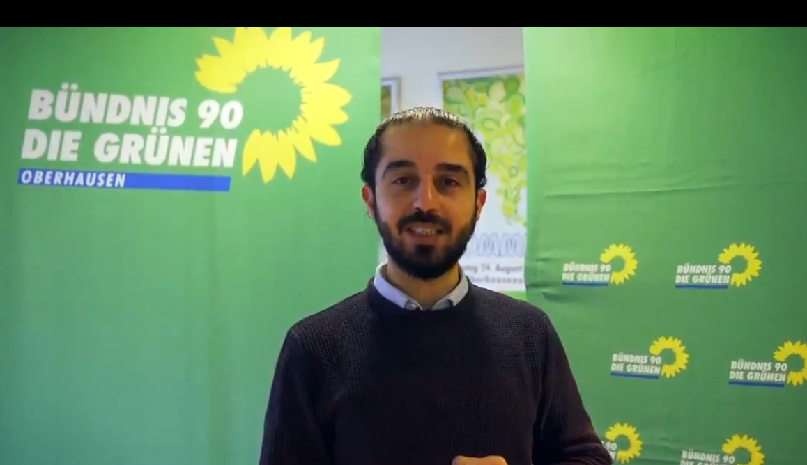
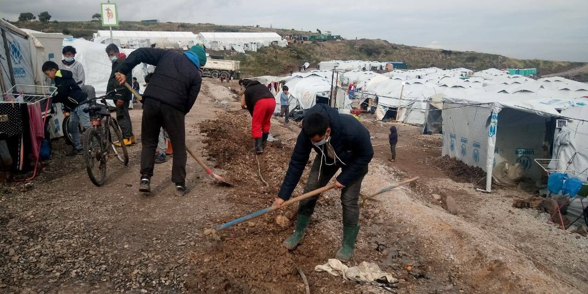
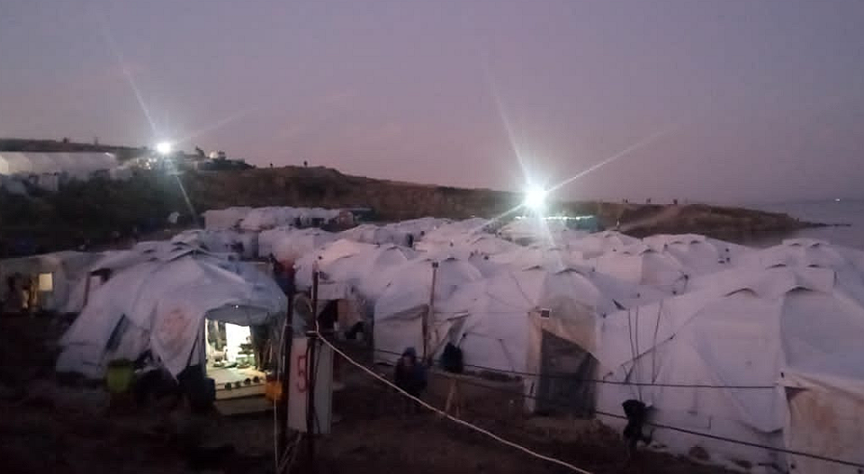
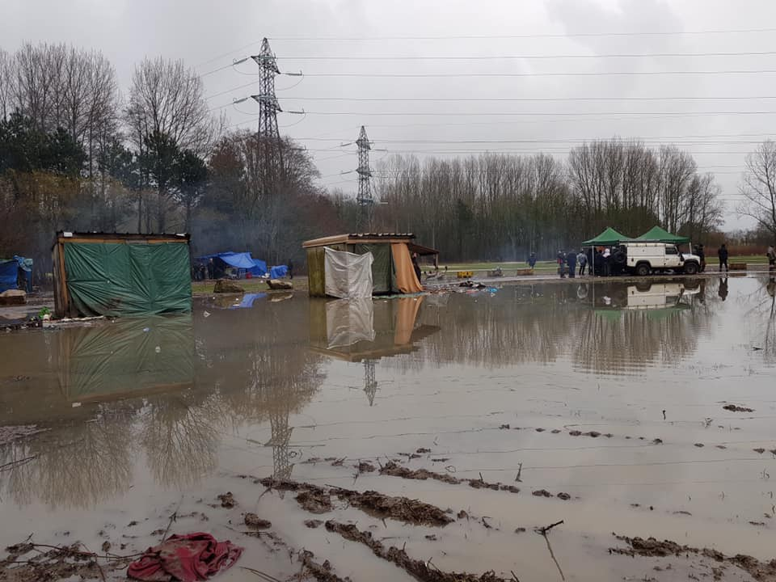
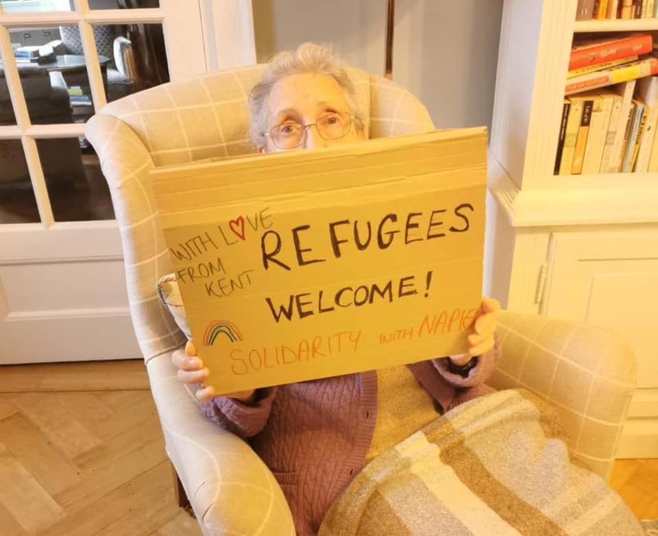
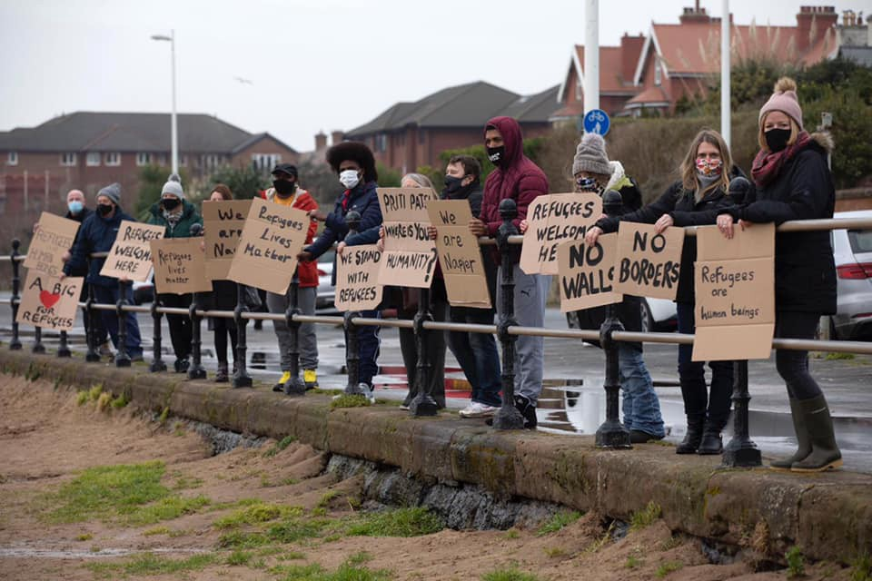

### AYS Daily Digest 03/02/2021: Good News: First Syrian national is running for German parliament

Tareq Alaows\. Screenshot from his campaign video\. Copyright: Tareq Alaows
### FEATURE: Tareq Alaows: First Syrian national is running for a seat in the German parliament\!

■■■■■■■■■■■■■■ 
> **[Tareq Alaows](https://twitter.com/Tareq_Alaows) @ Twitter Says:** 

> > Ich kandidiere als erste aus Syrien geflüchtete Person für den #Bundestag. #kandidat @[Die_Gruenen](https://twitter.com/Die_Gruenen) https://t.co/GNrXCbtlJX 

> **Tweeted at [2021-02-02 08:13:12](https://twitter.com/Tareq_Alaows/status/1356516003409260546).** 

■■■■■■■■■■■■■■ 

Tareq Alaows is a political person in the best sense of the word\. In Damascus he studied law\. With the beginning of the civil uprising in Syria, Tareq started to document human rights violations for the Red Crescent\. In 2015 he left Syria, afraid of having to serve in Assad’s army\. He went to Turkey, then crossed the Aegean, arrived in Lesvos and continued along the Balkan route\. On 4 September 2015 he arrived inthe German city Dortmund where he applied for asylum\. 
At first he lived at a gymnasium, together with many other mainly Syrian nationals who arrived in September 2015 and during the subsequent months\. But despite the conditions, he didn’t stay passive for long\. Together with fellow refugees he founded an initiative that aimed at improving the conditions for refugees, for example by calling for German classes\. He himself never went to a German class\. Within six months he learned the language by speaking to people\. In June 2018, when the civilian rescue ship Lifeline with 234 people on board wasn’t allowed to land for days, he protested together with many others and quickly became a member of the newly founded SEEBRÜCKE, an initiative that advocates for sea rescue\. Tareq was active in the initiative until last week\. On Tuesday, he announced his candidacy for the German Bundestag\. He is the candidate for the [Green Party in the election district of Dinslaken\-Oberhausen](https://www.gruene-dinslaken.de/) \.

> “I am running as the first refugee from Syria for the Bundestag in order to represent the rights of refugees and migrants in Germany with my vote and to stand up for a diverse and just society for all\. The climate crisis hits people in the global south particularly hard and intensifies the existing distribution conflicts\. It is more important than ever as a society to stand together in solidarity with all people\. From my position as a refugee, I want to work against the climate crisis and for social diversity and I look forward to a strong federal election campaign with the wonderful campaign team\.” 

Tareq is 31 years old\. He is not yet a German citizen, but he applied for the process and is optimistic that he will be naturalized within the next months\. The elections for the new Bundestag will be held on 26 September 2021\. To become a member of the Bundestag one needs to be a German citizen\. 
Many prominent politicians and activists, among them Carola Rackete, congratulated Tareq on twitter\.
### AFGHANISTAN
#### Many detainees are being tortured

A new UN report reveals continuing high rate of detainees being subjected to torture in Afghanistan\. Almost a third of the people detained for security or terrorism\-related offences say they were subjected to torture or other forms of ill\-treatment\. For more see [here](https://www.ohchr.org/EN/NewsEvents/Pages/DisplayNews.aspx?NewsID=26713&LangID=E) \.
### GREECE
#### New attack on Greek journalists

According to Greek journalists, photojournalist Marios Bikos was arrested by the police while he covered demonstrations in Athens\. He was arrested on the grounds of not having the necessary documents with him, although a video appeared later showing him while he was showing his press credentials to police officers\.

■■■■■■■■■■■■■■ 
> **[Tony Rigopoulos (Αντώνης Ρηγόπουλος - طوني)](https://twitter.com/tony_rgps) @ Twitter Says:** 

> > #Documento photographer @[bikosmariosraf](https://twitter.com/bikosmariosraf)  was arrested by Greek Police, while covering a demonstration in Athens. Although he showed all necessary paperwork, he was unlawfully detained and taken to Police headquarters for further procedures. 

> **Tweeted at [2021-02-03 15:55:09](https://twitter.com/tony_rgps/status/1356994644287102976?fbclid=IwAR3-GIQlBS0FDOw1SM0net_AEERIXLoMF0YqxzpTd8U2CxDIfEmN5mFuI9U).** 

■■■■■■■■■■■■■■ 

#### Moria 2\.0

Moria White Helmets continue supporting the camp electrician department with fixing and enlarging the electrical supply\.

> “In this time our teams helped to connect hundreds of tents, put more kilometres of cables over\- and underground, connected police checkpoints and did maintenance almost every day\. We know this all could be done much better by a professional company but it works and helps so many refugees in the difficult winter weather\.” 

Most tents now have electricity, thanks to the continuing efforts of the residents\.

working hard to bring electricity to the whole camp\. Copyright: White Helmets Moria
#### Locals Protest against planned closed controlled structure on Chios

As on the other Aegean Islands, on Chios as well a new closed control structure to house refugees is planned\. The plans for the new structure were announced last week by Migration Minister Notis Mitarakis\. The camp is supposed to replace VIAL reception centre that has been running since 2016 with an official capacity of 1,040 and an actual occupancy rate of 2,340 people\.
### SEA
#### Boat in distress

A boat with 90 people on board is adrift in the Mediterranean Sea, close to Lampedusa\. The people on board are in contact with Alarm Phone\. Alarm Phone alerted Malta’s and Italy’s authorities\.
### SPAIN
#### Investigations of possible hate crimes

The chief prosecutor of Las Palmas, Beatriz Sánchez, has ordered the opening of an investigation of possible hate crimes\. In several WhatsApp groups, people have been organizing in order to intimidate and attack migrants\. Apparently people planned to travel to the south of Grand Canary Island and attack people on the move who are currently being housed in tourist complexes\. [According to media,](https://elpais.com/espana/2021-02-01/la-fiscalia-investiga-a-grupos-que-se-organizaron-para-agredir-a-inmigrantes-en-gran-canaria.html?prm=ep-app&fbclid=IwAR3NJMVEprEHCx8p4i5C5czELcEYIn9fFf7d81vFE87bbPgHyu9RxRTAdNQ) Grand Canary Island is experiencing a rise in racism\.
### GERMANY
#### Court rules against deportations to Afghanistan

Even during the global pandemic, German authorities have been eager to conduct deportations of rejected asylum applicants to Afghanistan\. A regional court has now declared deportations inadmissible in many cases\. The court has argued that in the current situation, even a young and healthy man will most likely not find any legal means to support himself and fulfill his most elementary needs when being deported to Afghanistan\. The court’s decision however will only have limited consequences, as other regional courts may come to differing decisions\. 
Since resuming deportations after a halt since March, one deportations flight to Afghanistan left Germany on 16 December and another one on 12 January\. The next one is scheduled for 9 February\. Besides to Afghanistan, Germany is carrying out deportations to various other countries such as Pakistan, Gambia, Nigeria, Serbia, Kosovo, Armenia and Albania\. 
For more in German see [here](https://www.lto.de/recht/nachrichten/n/vgh-baden-wrttemberg-a-11-s-2042-20-abschiebungsverbot-afghanische-maenner-elementare-lebensbeduerfnisse/) \.
#### European Solidarity?

Since April 2020 1,561 people from Greece were officially admitted to Germany\. On Wednesday, 41 people landed in Hanover\.

### BELGIUM
#### Political protest by undocumented migrants in church in Brussels

A church in the centre of the Belgian capital became a temporary shelter for about 150 people, many of them women and children\. The undocumented migrants are protesting for better protection during the pandemic and to be granted legal status\. 
Many of the protesters have been living in Brussels for years but since they do not have legal status, they have no access to governmental infrastructure\. During the pandemic their situation worsened, as many lost their irregular and therefore unprotected jobs and were not able to pay for the rent as they cannot receive any government support\. 
According to [Infomigrants](https://www.infomigrants.net/en/post/30052/undocumented-migrants-protest-in-brussels-church?fbclid=IwAR3-GIQlBS0FDOw1SM0net_AEERIXLoMF0YqxzpTd8U2CxDIfEmN5mFuI9U) , the protest is spreading and more and more groups are considering the occupation of other churches\.
### FRANCE
#### Paris: “I’m afraid of dying in the street\. No one can win against the cold”

Hundreds of people are left on their own in Paris, with no place to go, no basic infrastructure, no elementary supply\. Infomigrants have now published the words of a youngster who arrived to Paris about three weeks ago and is literally without anything\.

> “It’s not going well\. Remember when it snowed last week \[Saturday, January 16\]? \[…\] I’m not used to all this cold: it hurts everywhere\.
 

> That night, when it snowed, I was given a hotel room\. But it was just for one night\. The next morning, I was sent back on the street\. I’m outside most of the time, around the Gare de l’Est train station, sleeping under a tent that an association gave me\.
 

> Most of the time, though, I can’t sleep, I’m too cold\. When that happens, I go for a walk, it helps me to defrost\. Otherwise, my feet are completely frozen\. Feet are complicated here\.” 

Read his full story here:

Solidarité Migrants Wilson is one of the groups that tries to support those living on the streets\. They started distributions of tea and soup with motorcycles\.

> “They are my little brother’s age\. They are my mates’ age\. They are lost in this huge and frozen city\. They are alone or in small groups\. They work and have no accommodation\. Every night in Paris they try to survive, always more isolated\. Hunted by law enforcement to keep Paris clean, they are scattered, isolated, hard to find\.” 

According to their Facebook page, they distribute about 700 meals\. That means that at least 700 people are living under these conditions\.
#### Judge rules that ‘alienation’ of journalists during expulsions is lawful

The complaint of two journalists who were not allowed to enter the security perimeters during an evacuation in the regions of Calais and Dunkirk was dismissed by a judge on Wednesday, 3 February\. The journalists tried to enter the security perimeters five times on 29 and 30 December but were stopped from doing so by the police who were carrying out the expulsions\. 
One of the journalists, Louise Winter, did manage, however, to take a photograph of a person in a protective suit slashing a migrant’s tent with a knife\. He posted the picture on Twitter where it went viral\.

■■■■■■■■■■■■■■ 
> **[Louis Witter](https://twitter.com/LouisWitter) @ Twitter Says:** 

> > Pour le Ministère de l’intérieur, lors des expulsions de migrants, les « mesures d’éloignement (des journalistes) visent à assurer le respect de la dignité des personnes évacuées ».

Mais le Ministère de l’@[Interieur_Gouv](https://twitter.com/Interieur_Gouv) fait découper leur tentes au couteau.

« DI-GNI-TÉ » https://t.co/6N9jB9pBdt 

> **Tweeted at [2021-02-03 20:04:37](https://twitter.com/LouisWitter/status/1357057424486772737).** 

■■■■■■■■■■■■■■ 

Various journalists and Press Freedom Organizations expressed their concern over the court’s decision\. During the expulsions, violations of human rights are a well\-known occurence\. The public therefore has the right to be informed about what is going on\. 
For more information, see [here](https://www.nouvelobs.com/migrants/20210203.OBS39744/le-conseil-d-etat-valide-l-eloignement-des-journalistes-lors-des-evacuations-de-camps-de-migrants.html?fbclid=IwAR0TE_L1fBdJ2USjcs2arkgmkmiwOGiUMbfQO2XBqJeiWdybTBXOP_pyX3I) \.
#### Expulsion in Dunkirk

The 8th expulsion of the year 2021 took place in Grand Synthe, Dunkirk, according to the Human Rights Observers NGO\. Eighty tents and tarpaulins were seized and probably destroyed\.

■■■■■■■■■■■■■■ 
> **[Human Rights Observers](https://twitter.com/HumanRightsObs) @ Twitter Says:** 

> > Ce matin à #GrandeSynthe : la 8ème expulsion de 2021
Elles durent en moyenne ~4h et tous les abris sont saisis et détruits
Ce matin ~80 tentes et bâches saisies

Ces expulsions participent à l’épuisement et l’harcèlement physique &amp; moral que les personnes subissent à la frontière https://t.co/Vi1Y7Ft1NI 

> **Tweeted at [2021-02-03 18:34:49](https://twitter.com/HumanRightsObs/status/1357034824981176322?fbclid=IwAR1-mUFgGxHJGHcQnead74PuKqxMo2hiPduu9CBFPrUE_m2YDhhewk4TLCU).** 

■■■■■■■■■■■■■■ 

#### Water tank installed in Calais

In Coquelles, Calais, close to the entrance of the Euro Tunnel, the Calais Food Collective was able to install a fresh water tank\. According to the NGO,

> “Water has been a massive issue in this area for over a month now, after the state pulled out of its obligation to provide food and water here following a series of brutal evictions that dismantled the community\.” 

The new tank is permanently in place and will be refilled each day — at least as long as the police won’t dismantle it\. 
While clean water is scarce, rain water and mud are abundant\. The north of France is muddy and cold these days\. The Mobile Refugee Support NGO that provides support in and around Calais posted pictures of camps, flooded with water\.

Copyright: Mobile Refugee Support

The team tries to provide people with essentials such as waterproof boots and viral items\. To continue their work, they are looking for support\. Please visit [their Facebook page](https://www.facebook.com/MobileRefugeeSupport/?ref=page_internal) \!
### UK
#### Napier Barracks

The Napier and Penally barracks have been criticised for crowded conditions, limited access to healthcare and legal advice and, more recently, a significant COVID\-19 outbreak during which more than one in four of the 400 residents at Napier was infected\.
[Media now reported](https://www.pressgazette.co.uk/journalist-photographer-arrested-napier-barracks-protest-kent-andy-aitchison/?fbclid=IwAR1NHGxh2CCgsCScD5cbANeD9aDrzfF3d4N4AYhNbgcjzGAfEe6tGULVtkY) that a photojournalist who tried to cover a demonstration held by support groups last Thursday was held in custody for seven hours, after the police came to his house and confiscated his camera’s memory card\. He was arrested on charges of suspicion of criminal damage\.

Meanwhile, [footage has appeared that shows an police officer](https://www.kentlive.news/news/kent-news/shocking-footage-shows-police-officer-4963885?fbclid=IwAR0DEg-38x8cT6h_XlL6da-awiWin2X-7UhbKFdnCZFXAyIWkZt3qccmtns) dragging a man back into the barracks\. According to the police, the man breached Corona regulations\. Napier is currently suffering a COVID outbreak, with up to 120 residents having tested positive\. Since the opening of the barracks in September, residents have protested against the living conditions, claiming they had no possibility for maintaining social distancing and no protective measures were in place\.

[The Guardian also reported](https://www.theguardian.com/uk-news/2021/feb/03/firm-running-asylum-seeker-barracks-in-kent-stands-to-make-1bn?fbclid=IwAR3NJMVEprEHCx8p4i5C5czELcEYIn9fFf7d81vFE87bbPgHyu9RxRTAdNQ) that Clearspings Ready Homes, the company that runs the barracks in Kent, stands to earn up to £1bn over 10 years for its government work, delivering multimillion\-pound benefits to its owner\.

Care4Calais started a campaign in solidarity with the people in the barracks\.

Solidarity with the people trapped in Napier Barracks\. Copyright: Care4Calais

[This article sheds light](https://www.historyworkshop.org.uk/refugee-resistance/?fbclid=IwAR0HL4oqNKZvKa5wIZEtrjsohqmEkuCkgANuofBSNIhwlqT1qBW5x8soz7Y) on the UK’s long tradition in housing refugees in barracks, in squalid and impersonal living conditions, as well as on the acts of resistance of the people subject to this treatment\.

> “Conditions at Napier barracks may be deplorable, but neither they, nor the acts of resistance, are without precedent\. For, wherever we find these squalid and impersonal living conditions, we find ‘troublemakers’: camp residents willing to take a stand against them\.” 

#### New rules on asylum applications

The UK government has introduced new regulations under which they can rule that an asylum claim is inadmissible\. This means that the Home Office does not have to consider the claim in the UK if they rule that another country — a “safe third country” — should in fact be responsible for your asylum claim\.
To date, how this new regulations will play out is still very unclear\. However, they contain some very worrying aspects\. We will follow the issue\!

For more see here:

### DENMARK

In Denmark options are being discussed to shift asylum processing to a third country outside the EU\. [The Danish Institute for Human Rights published a report on the Human Rights dimensions of such an approach](https://www.humanrights.dk/sites/humanrights.dk/files/media/document/Asyl_UK_01%20%28002%29.pdf) \.

An impeachment against former immigration minister Inger Stojberg is about to begin\. The Danish Parliament voted in favour of such an trial\. Stoybergs policy towards migration has been a hard\-line one\. 
[Infomigrants has written a feature on it](https://www.infomigrants.net/en/post/30041/impeachment-trial-for-former-danish-migration-minister?fbclid=IwAR3VZXcpYGfh3882_-J8kUuElTakQp8NzrIInFdM4ZvSjXGBn6JipIZe8mY) \.
### WORTH READING

About 12 million international migrants are subject to modern slavery in the form of forced labour exploitation and forced sexual exploitation\. This article sheds light on the situation:

### EVENTS

Students of Psychology at Jagiellonian Universtiy in Krakow are organising a Webinar on **‘How the new EU Pact Migration and Asylum affects refugees?’** It will take place on Friday, 5 February\. For more information, see their [Facebook](https://www.facebook.com/events/179032167290264/) \.

The Migration Policy Cenre is holding a Webinar on **‘International Mobility Restrictions & the Spread of Pandemics’** on 10 February\.

Register and more information:

**Find daily updates and special reports on our [Medium page](https://medium.com/are-you-syrious) \.**

**If you wish to contribute, either by writing a report or a story, or by joining the info gathering team, please let us know\.**

**We strive to echo correct news from the ground through collaboration and fairness\. Every effort has been made to credit organisations and individuals with regard to the supply of information, video, and photo material \(in cases where the source wanted to be accredited\) \. Please notify us regarding corrections\.**

**If there’s anything you want to share or comment, contact us through Facebook, Twitter or write to: areyousyrious@gmail\.com**

_Converted [Medium Post](https://medium.com/are-you-syrious/ays-daily-digest-03-02-2021-good-news-first-syrian-national-is-running-for-german-parliament-855655b58ca7) by [ZMediumToMarkdown](https://github.com/ZhgChgLi/ZMediumToMarkdown)._
