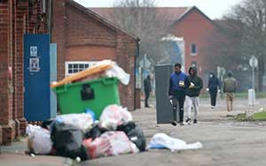
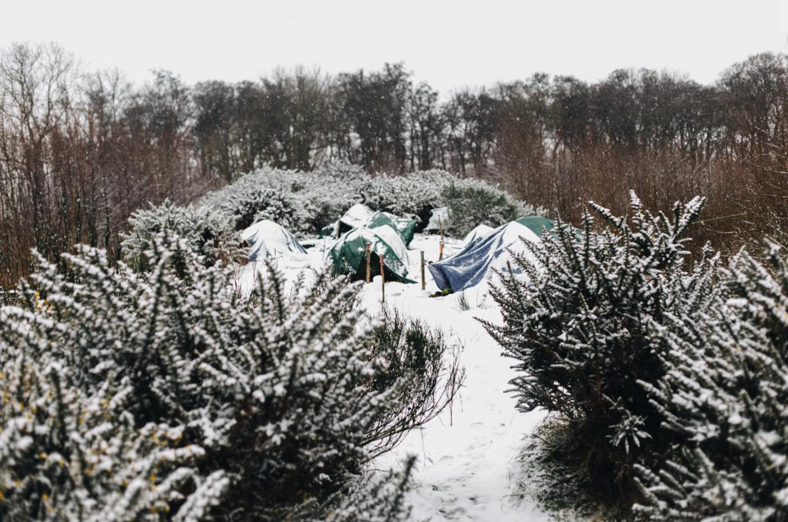
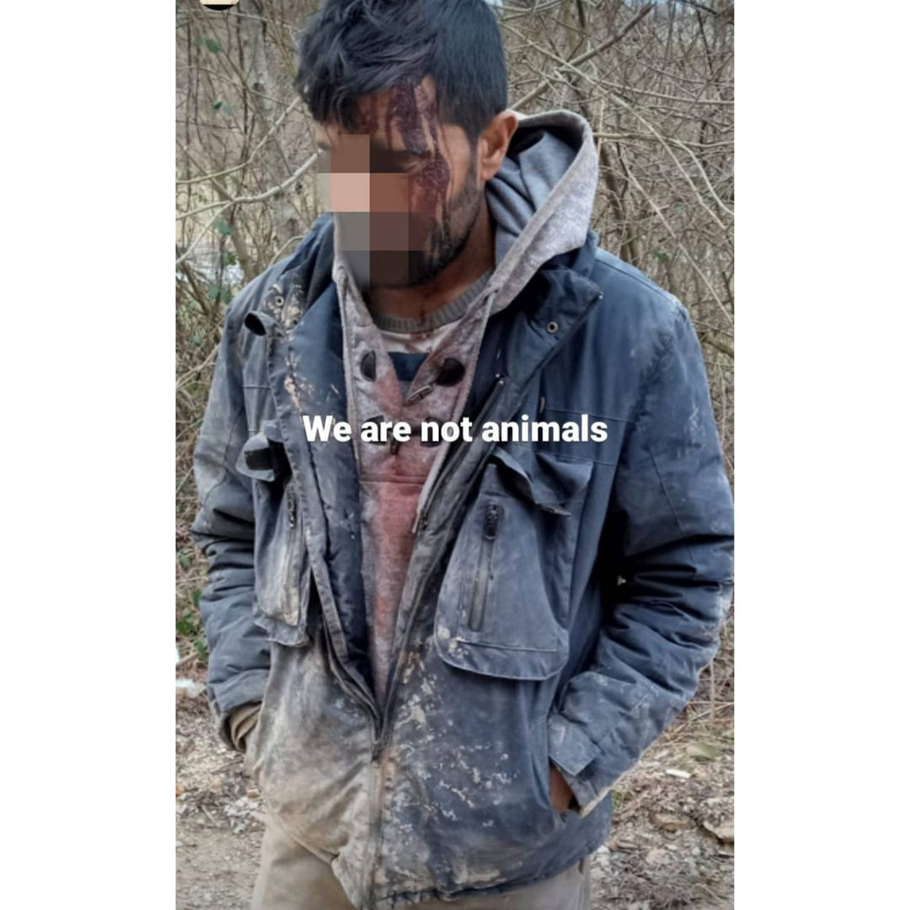
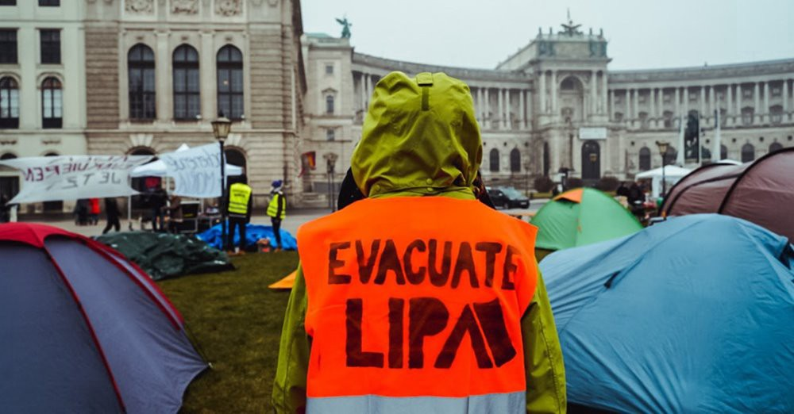

### AYS Weekend Digest 06–07/02/2021 Illegal detention of minors in UK
#### Calais municipality’s strategies for eviction of migrants camps // Growing concern over Cyprus’s backlog of asylum applications // Continuing storm over Frontex and its lack of accountability // Inhumane treatment of migrants in Malta and Eastern Europe // and much more…
### UK

Refugees in the Napier Barracks in Kent \(Pic: PA\)

We feel compelled to [share the testimony](https://socialistworker.co.uk/art/51272/Asylum+seeker+in+Kent+army+barracks+speaks+out+We+are+locked+up+in+hell?fbclid=IwAR0tGtZ5ub1d-L4cX91dPBZ77K8ciUb21RTR6_SwtZZ65UfltZ5s0wlgTXU) of an asylum seeker held in Napier \(Kent\) Army Barracks for more than three months\.

According to his testimony:

> _‘We are locked up in hell’, this place is ‘not suitable for a human being’_ 

> _“I really want to be moved out from here,” he said\. “It’s not a suitable place for a human being\. I don’t need a house or a palace\. I would just like a safe room that’s secure and reassurance that I have privacy and safety\.”_ 

According to a [local team of Care4Calais,](https://www.facebook.com/care4calais/posts/4053196738046586) some of those housed at Napier Barracks have been relocated\.

> _The guys have been in quarantine for ten days since leaving Napier, where most of them have been since September — so they were really glad to be out\. We hope that this will continue and that nobody will have to live in these inadequate conditions much longer\._ 

### Illegal detention of minors

UK newspaper _the Independent_ [has revealed](https://www.independent.co.uk/news/uk/home-news/children-refugees-channel-detained-home-office-b1798100.html?fbclid=IwAR1QWzt4e9IcQXOqtV5vg1BuH1wjgpSOowrPCxm1ty9jfMenoiPFFXEGFI0) that in between April and September 2020, 80 unaccompanied minors were locked up for more than 24 hours in a processing centre, with one child held for around 65 hours — during which time they had no proper sleeping facilities or access to fresh air\.

> _Detention of a child for more than 24 hours is banned under the Immigration Act 2014\. Longer detention is permitted only in “exceptional circumstances” and requires the authorisation of the home secretary\._ 

In a similar case, the Home Office is [winding down](https://www.edp24.co.uk/news/asylum-seekers-moved-out-of-raf-coltishall-7306804?fbclid=IwAR0uDFWPU9HhmZkEjMqDyRRsFMjqqGTiWstEfi8HdN-AnY9ddr_M8b52i0w) its use of an old air force base’s officers’ mess to house asylum seekers, [a month after it was branded “unsuitable” for the purpose](https://www.edp24.co.uk/news/jaguar-house-bladersfield-unsuitable-for-asylum-seekers-6880290) \.

The government had housed up to 90 people originally from countries including [war\-torn South Sudan at Jaguar House near the former RAF Coltishall in the village of Badersfield](https://www.edp24.co.uk/news/asylum-seekers-being-moved-from-raf-coltishall-6900650) \(Norfolk\), many of whom were there for more than eight months\. Some asylum seekers embarked on a hunger strike in protest of the conditions and at the length of time they had been placed at Jaguar House for\.
### Studies debunk negative myths about migrants

[A study has found](https://www.independent.co.uk/news/uk/politics/immigration-economic-effect-uk-towns-b1798198.html?fbclid=IwAR3RA4HklPtYmSwFzskxfFP7aBFxWE_HdlOxj36FoA85knZgwuhpox07hfg) that British towns with the most immigrants and highest levels of diversity tend to do far better economically than areas with few\.

> _The study shows a strong link “between rising prosperity and rising diversity” — with diverse areas doing better “almost regardless of which metric you use”\._ 

> _The study, commissioned by anti\-racism charity Hope Not Hate is a challenge to negative perceptions of immigration, and concludes that “growing diversity is an inevitable part of increasing prosperity — and, potentially, a contributor to it”\._ 

Another study has [countered the myth about migrants](https://www.liverpoolecho.co.uk/news/liverpool-news/tiny-amount-asylum-seekers-coming-19775697?fbclid=IwAR3qjuRz8lNF9ADMmHDnPWmqdUJGcf7IkkL1L3Al6EFbJv9A5RhRDXlxV5U) being costly for local taxpayers\.

> _In 2019/20 the Home Office spent £470 million on providing accommodation and cash support to people seeking asylum\. A further £486 million was spent on other asylum\-related operations\. This may sound like a staggering amount of money, but it works out at around £30 a year for the average taxpayer — or eight pence per day\. To put the amount into further context, HMRC estimates £4\.6 billion each year is lost through tax evasion\._ 

> _Compared to the rest of Europe, the UK is fairing much worse than other countries in its acceptance of asylum applications\. In the year to September 2020, Britain received 31,752 initial asylum applications while Germany received 155,295 applicants, France 129,480 and Spain 128,520\. Refugee Action says asylum seekers and refugees make up around one quarter of a percent \(0\.26%\) of the UK’s total population\._ 

### FRANCE

Credits: Care4Calais

We share a [post from Care4Calais](https://www.facebook.com/care4calais/posts/4052410878125172) , which reports on the desperate conditions of people on the move, with the current freezing conditions making their situation even more precarious\.

> _The weather forecast for Calais this week is scary\. Freezing temperatures and snow — with up to 1000 people living outside\._ 

> _Last night, the city opened the emergency night shelters, but there is not enough room for everyone\. Shockingly, people have been asking us for bedding today, saying the shelters themselves are too cold\._ 

> _Yesterday, we gave out fleeces together with packs of hats, scarves and gloves in Calais, and today we are going to Dunkirk\. It was bitterly cold, and the only saving grace was that thanks to our Christmas campaign, we had enough to give people two if they asked\._ 

> _But this is not right\. No one should be living this way\. Least of all those who are simply asking for our help\._ 

The municipality of Calais has put in place a variety of strategies to avoid the installation of camps in its area\. For example, it has launched [a series of deforestation](https://reporterre.net/A-Calais-la-mairie-rase-les-bois-ou-se-cachent-les-migrants) along the roads and in the walking areas, where the exiles are used to camping\. Another means of pressure: the regular eviction of occupied land, with seizure of personal effects left behind\. In 2020, Human Rights Observers \(HRO\) recorded 967 evictions\.

> _In Calais, the eviction every two days from the land occupied by the exiles is coupled with the confiscation of their personal effects\. Tents, duvets, documents … are, in theory, stored and can be retrieved\. In fact, eight to ten tons of material end up in the trash every month\._ 

Find out more on this [well\-documented reportage](https://reporterre.net/A-Calais-l-absurde-confiscation-des-tentes-des-migrants?fbclid=IwAR0eSVMQq19sX28eGnvAyTI5V5ecqclwk0zZpkm0vyF0YEN9j5q1rtngsZI) \.

We also report a worrying news of multiple shipwrecks on the north coast, as signalled by [Utopia 56](https://twitter.com/Utopia_56/status/1358136141262819335) : 85 people in distress including 12 minors\. Among them, 60 returned to the street\.
### SEA
### More landings in Italy…

We have received news that the [Ocean Viking rescued](https://twitter.com/SOSMedIntl/status/1358362679698731013) 422 people off the coast of Italy on the 7th of February\. Amongst them, 124 minors\. 8 of the rescued migrants tested positive for COVID\-19\.

> _“ We have procedures in place for this scenario, we can isolate positive cases\. But all survivors urgently need a Place of Safety\.”_ 

Later in the day, they were [allowed to disembark](https://www.agi.it/cronaca/news/2021-02-07/migranti-augusta-ocean-viking-11312614?fbclid=IwAR3RA4HklPtYmSwFzskxfFP7aBFxWE_HdlOxj36FoA85knZgwuhpox07hfg) at the Sicilian port of Augusta\.

67 migrants aboard a boat [landed in the waters of Lampedusa](https://marsalace.it/2021/02/06/ancora-sbarchi-a-lampedusa-approdano-altri-67-migranti/?fbclid=IwAR0ApUKNvMqak2_zISm5i28G4jBnH23m2XGHxW8j2iZ5TClFGwy1HutXexQ) \. After disembarking, the group, with migrants of various nationalities, was taken to the hotspot where all new arrivals were subjected to a rapid anti\-COVID swab\.

55 migrants who had arrived in Lampedusa in the previous hours had been transferred from the facility to the quarantine ship «Allegra»\.
### …and more losses at sea

AlarmPhone received a worrying SOS message, alerted about a boat that left Algeria toward Sardinia early on Thursday morning\. Relatives are desperate\! Authorities are informed\. AlarmPhone [demanded the immediate](https://twitter.com/alarm_phone/status/1358529073752981513?fbclid=IwAR1pqN0vbDxEqjbbxBsJn6Nug8cYS9qjTbEtowMAm6UTQ5Dz8hR70nrPxO0) launch of a rescue operation\.

Sadly, we have to share the news that, on the morning of 7th of February, [OpenArms found the remains](https://twitter.com/openarms_found/status/1358390087994720260?fbclid=IwAR37_zol4TOKg7ALiI3l_7nQ0iAPq46_t4QEXOybTd6W59XeMOWAhZD1MAM) of a burned boat on high seas\.

> _We can’t help thinking what will have become of the people on board\. What we do know is that none of them deserved to risk their lives like this to get to a place to live in peace\._ 

Documenting and remembering the huge and devastating numbers of lives claimed by the Mediterranean, and broken by the risky migration routes towards Europe, is essential in order to hold authorities accountable for this tragedy\.

Nicolas Lambert, Migreurop member cartographer, made an [animated map](https://www.facebook.com/Migreurop/posts/4027351980616359) of missing persons at sea from 1993 to 2020\.

Yesterday, [people in many European and African](https://twitter.com/alarm_phone/status/1358421468598726656?fbclid=IwAR3vy1Tsj-vYhjOOJIvPCuQNaoSXJpRGiKU3kmH8P9ba_ho4H0EhhqqCOVM) countries gathered to commemorate those who have died and disappeared at Europe’s borders and demand justice\.
### GREECE

We share [a series of shocking photos](https://twitter.com/Refugees_Gr/status/1358158036540542977) from NoBorders, taken and published with the approval of refugees from the new Moria camp, more accurately known as the Kara Tepe prison, Lesvos, Greece\. Government prohibits photos and information from inside this prison\.
### Closed camps causing tensions on Lesvos and Chios

[Residents of the eastern Aegean island of Chios](https://www.ekathimerini.com/262104/article/ekathimerini/news/chios-residents-oppose-new-migrant-camp?fbclid=IwAR2f5IjtK120XUMnURVhmhVljkGGA8xrna2tY3KFi2YG6ttCuz3SE2_8-VE) continued on Saturday to protest plans for the creation of a new closed migrant camp, with a motorcade stretching more than 2 kilometers\.

The new centre, according to Migration Minister Notis Mitarakis, will replace the existing overcrowded structure of VIAL in the village of Chalkios\. With some asylum\-seekers being transferred to the mainland, the new closed facility in the Tholos region will be smaller, with a capacity of 1,500 people, and will provide security to both residents and migrants\.

On Lesvos the Municipal Council narrowly voted in favour \(16 to 15\) of constructing a new camp\. The vote has been [decried as undemocratic, a ‘coup’ even, in local media](https://www.facebook.com/europemustact/photos/a.104489524497084/239533747659327?__cft__[0]=AZWGZ03wiplmme7qPxJEVWsVjbVoKmO7rqiqEKelGcTyZ2YZq7bOXjeXY-kIm5LHHwM9HX2mkLfsg9g1lyxChZgL8IUbJunuBa76EpDdwH4PIthB2KBe_I66y9C-VxSHQEKcfBEmhsVcYptIexvT_x-JutR2ATt2VBCCmsmVLFBD4sjxOxHJl57UPofUrJHvc7Y&__tn__=R]-R) because the representative of Nea Kydonia, where the new camp is likely to be built, was excluded from the vote\.

The political debate is getting particularly nasty and divisive, as the Greek MPO from the ruling Nea Dimokratia [voiced worries](https://twitter.com/BrunoTersago/status/1358444615960043524) about the “threat to social cohesion” allegedly posed by migrants\.

> _“I tabled a question about the number of immigrants, legal and illegal, but also of all the accommodation structures and NGOs in Athens \. \. so that the reversal of the situation can begin in a coordinated and measurable way by alleviating the city from populations that threaten social cohesion and peace\.”_ 

Migration Ministry announces that the RIC in Vathy, Samos [will close](https://twitter.com/samosvolunteers/status/1358124214981640192?fbclid=IwAR27b-DGieBzSzfqDp8wge2CDu3itSagZMrqYi290J7-IXS-piJ8OHVZ1NU) by the end of the second quarter of 2021\. The new camp, located in Zervou, approx\. 5 km away from the main island town, has reported capacity of 3,000\+ people\.

Meanwhile, solidarity continues\. Moria Corona Awareness Team, Hope Project and Stand by Me Lesvos started a new n [eed orientated distribution system](https://www.facebook.com/MoriaCoronaAwarenessTeam/posts/245880580374453) \.

> _It works like this: We collect the needs with questionnaires in a tablet and send to Hope project\. Next day they pack the bags for about twenty families\. Then at noon the truck who comes to pick up the empty bottles passes Hope project and the load the bags to bring to recycling point\. Same day we give these families tickets to come and pick their bags\._ 

> _This we plan to do six days every week\. And it works, We would like to cover more peoples every day but right now this is our limit\. Also like this Hope project knows what’s needed and if they don’t have they can ask for sending or how to buy it in market\._ 

Finally, we share the info from [AlarmPhone](https://twitter.com/alarm_phone/status/1358402340114595841?fbclid=IwAR1hznep0OInlb1JhrmwjtRpxYZQxG0sL0wAgNrmKQdnc1Tl42AJcuiozPM) , which received news about 16 people whose boat landed in the North of Lesvos yesterday\. The people fear that Greek authorities will illegally push them back to Turkey\. The people seek to apply for asylum\.
### CYPRUS

Cyprus’ Interior Minister [Nicos Nouris](https://apnews.com/article/europe-cyprus-nicosia-f89d916afe10fb16e4ef554a6816a4e3?fbclid=IwAR0OOwZulgY1blECzgTurSJjydCEoU8fpinZo0YTFKhjpO9Tb2CPHpSm3aQ) said this week that the east Mediterranean island nation whose closest point to Syria is around 150 kilometers \(93 miles\) remains first among all other European Union member states with the most asylum applications relative to its population\. Last year, the country of around 1\.1 million people racked up 7,000 asylum applications — most of them from Syrians\. Designed to accommodate 1,000 people at the most, the camp of Pournara now houses 1,500 people, some of whom have been there for months\.

> _Nouris said the government is doing its best to speed up the application process to let in those who qualify and to send back migrants whose application is turned down\._ 

One cannot help but wonder what this speeding up of application processing will entail, as it is often the case that such “speeding up” results in mishandling of cases and rushed decisions to repatriate\. Let’s hope we will be shown otherwise\.
### MALTA

The gravely inhumane treatment of migrants and asylum seekers in Malta calls for immediate intervention from the EU Commission, [Euro\-Med Human Rights Monitor said](https://euromedmonitor.org/en/article/4162/Malta%E2%80%99s-Brutality-Against-Asylum-Seekers-Necessitate-EU-Commission-Intervention?fbclid=IwAR0nEZoByTFEtcj-exSpix_UAOdsCtt-SvSlzgNtFc2QiGLN137qJNrwPT0) in a statement today\.

> _There’s mounting evidence that large numbers of asylum seekers and migrants continue to be detained in abusive and unlawful conditions, while the Maltese government keeps denying such deplorable situation\. Migrants stuck in a limbo in Malta are languishing in unsustainable and inhumane conditions at detention centres, where overcrowding, unsanitary conditions, abusive and brutal treatment have pushed some to the edge of despair\. Some have attempted suicide as a result\._ 

> _This issue is merely a part of a broader pattern of violations carried out by Malta towards asylum seekers and migrants throughout 2020\. Despite the drop in the number of arrivals, Malta has employed several illegal tactics to thwart sea migrants, including [hiring private ships](https://euromedmonitor.org/en/article/3563/Malta-Should-End-Illegal-Use-of-Private-Vessels-to-Push-Asylum-Seekers-to-Libya) to push them to Libya, [refusing the disembarkation](https://euromedmonitor.org/en/article/3829/Malta-and-Italy-must-immediately-disembark-400-asylum-seekers,-migrants-stranded-at-sea) of rescued migrants, closing its ports to humanitarian boats, and exploiting Covid\-19 as a pretext for such violations\._ 

Asylum seekers in detention centres have more than halved since April, but serious concerns remain about children held there for months, [according to the UNHCR representative in Malta](https://timesofmalta.com/articles/view/migrant-detention-numbers-shrink-fears-about-child-detainees-remain.849872?fbclid=IwAR02-84OhbpE22YswTfOFT3LWmtRev89nfwb-ha9B_kVuKIec5Z8FOncMW4) \.

The reduction from around 2,000 detainees to 740 is partially due to the “positive development” of stepped\-up efforts to move asylum seekers to open centres, but child detainees remain a longstanding issue, Samar Mazloum said\.
### SYRIA

[Human Rights Watch is calling](https://www.infomigrants.net/en/post/30086/coronavirus-in-syria-concern-regime-could-withhold-vaccine?fbclid=IwAR3-I1-8Gj-kui3tpoZfZlwAi-IxZo3m2v-phCtc6BaKQ6kkfKDK7DPKhwI) for the COVID\-19 vaccine to be distributed equitably in all of Syria\. The organization accused the Assad regime of withholding medicine from civilians in areas controlled by the opposition\. They are particularly worried about the situation in northeast Syria\.

> _Human Rights Watch released a statement on Tuesday voicing concern that vulnerable people in opposition\-held territories in Syria might not get access to the vaccine against the novel coronavirus\. They said that the Syrian government had repeatedly withheld vital food and medicine from areas controlled by political opponents, which had affected millions of civilians\._ 

An interesting development comes from the Syria Justice and Accountability Center \(SJAC\), which has called on the International Criminal Court \(ICC\) Prosecutor [to investigate Greek authorities and European Border and Coast Guard Agency \(Frontex\) agents](https://syriadirect.org/news/syrian-ngo-seeks-a-first-before-the-icc-individual-criminal-liability-for-greece%E2%80%99s-abuses-against-refugees/?fbclid=IwAR1yzPOoHDJl8fRhmrDb5ZnxrnbeVnj_jgugx6kRjs8OjLzPEIAVdMi7AJs) for abuses against asylum\-seekers that could amount to crimes against humanity\.

> _If the ICC’s Office of the Prosecutor decides to launch an investigation, \[…\] it will be the first time the “individual criminal responsibility” of Greek and European officials “for crimes against humanity committed against asylum\-seekers, refugees and migrants in a European country” is addressed, explained Alexandra Lily Kather, a legal consultant in the field of international justice\._ 

We cannot but hope that this investigation will be launched, and that it will bear its fruits, as the evidence of human rights violations against Greek authorities and Frontex is indeed staggering\.
### EU/FRONTEX
### Remove Leggeri\!

The [criticism of the EU border protection agency Frontex](https://www.sueddeutsche.de/politik/europaeische-union-grenzschutzagentur-frontex-kritik-1.5198099?fbclid=IwAR1s1pJ_M7lSJ5nIWCxCvF9k3I_yNfMhJ3Zm3YHBg2Yw7iyptiIZHJM1CnU) is getting louder\. Frontex is in focus, among other things, because of allegations of illegal rejection of those seeking protection \(pushbacks\) on migrant boats in the Greek Aegean Sea\. In addition, the EU anti\-fraud authority Olaf is investigating the agency\.

> _The managing director of Pro Asyl, Günter Burkhardt, called on Federal Interior Minister Horst Seehofer \(CSU\) on Saturday to withdraw all German officials from the EU border troops until the allegations were fully clarified and called Frontex “a parody of a rule of law police”\._ 

Fraud allegations, secret lobby meetings, systematic turning away from human rights violations, make it “ [the worst order protection agency in the world](https://www.zeit.de/politik/ausland/2021-02/frontex-files-erik-marquardt-europaeische-union-gruene?fbclid=IwAR1i4OekEmkahhg7h5AY7PLJa6ruxQgFb9UowgxrPwVWSeRTJp8lwbTz1qY) ”\.

Reactions to the new reports on FRONTEX are growing\. [Several German MPs and MEPs](https://www.spiegel.de/politik/ausland/frontex-skandal-leggeri-ist-nicht-mehr-haltbar-a-0e6dc967-2be5-416f-a803-2b9d7aa8c51f-amp?fbclid=IwAR3Y_fl7_mt99YSBw_rn7Q-K-MBGbALR8fuzCou87XSRPEM3kgAocoLqPxo) are demanding for the agency’s director Fabrice Leggeri to step down, and to clarify once and for all the extent of Frontex’s alleged involvement in illegal pushbacks\.
### EU\-Afghanistan repatriation deal

Meanwhile, a new [agreement](https://www.statewatch.org/media/1801/eu-council-joint-declaration-afghanistan-5223-21-add1.pdf) called between the EU and Afghanistan is set to be approved in the next few days\. The agreement aims [to increase deportations to Afghanistan](https://www.ecre.org/new-eu-agreement-with-afghanistan-amid-deteriorating-security-situation/?fbclid=IwAR3HLyylBPgR7h5n7XBAIPl4LN5-NvZy2RHv_lRu9HQVr6bqogoUg3FS_E8) , amid a deteriorating security situation for the civilian population and increased attacks by insurgent groups\.

> _The JDMC \(Joint Declaration on Migration Cooperation between Afghanistan and the EU\) provides the framework for cooperation for an indefinite period with the option for each party to suspend it only after prior consultation on an annual basis on the date of its signing\. There are some changes which reduce protection safeguards for individuals, particularly vulnerable groups, and introduces a set of measures that make it easier for Member States \(MS\) to deport Afghan nationals at a time of increasing instability and a deteriorating security situation in Afghanistan\._ 

### CROATIA

We share a shocking [post from NoName Kitchen](https://www.facebook.com/NoNameKitchenBelgrade/photos/a.312076942523930/1176734506058165?__cft__[0]=AZWm8LwM6cmL05U9tWvnHT5UWA661OLLjzGVnX2deIjNlhsZjU9vV4bnp_TGAjTZ-Fgj7NmmQ_yYMWUo5vGFG0RQDgmX3c3TUjq9kyAcC-mFFBUdu8e61D1EpWBiYWSz-MkhtEhp-7M9cEZPJzAQpJJbyHAKVGA9hj60coX7NRg_1umiokSjm_002ytfUnn6v6s3IqpES-sBPzLfwOLNbWzd&__tn__=-UK-R) , which once again documents the horrifying violence that a group of migrants was subjected to when trying to cross from Bosnia into Croatia\. This must stop\.

> _A group of young men came back to Bosnia yesterday like this\. They told how they went to Croatia with the aim to ask for asylum_ 

> _According to EU legislation when a person gets into its territory has the right to ask for protection and authorities must register and start the asylum procedure\._ 

> _Instead of this, authorities decided to push them back illegally to Bosnia, beat them and steal their cell phones\. Common practises from Croatian police, that many times come Also with the authorities taking the clothes and shoes from people, and leave people almost naked with this crazy winter, according to all the testimonies we gather as part of the project Border Violence Monitoring Network as we are\._ 

### HUNGARY

Unfortunately, we have to report a similar case of police brutality occurring at the Hungarian border, where, [as reported](https://www.facebook.com/call122/posts/2657028924519512)

Hungarian border guards have been sending fierce dogs towards a group of immigrants who tried to enter the Hankarian lands today, which resulted in some migrants getting scratched and bitten by these dogs\.

Hungary is known to be one of the most severe countries that oppose the entry of migrants into Europe and the Hungarian Prime Minister \(Urban\) always makes anti\-immigrant statements despite European countries objecting to the actions of Hankaria against migrants\.
### SLOVENIA

A few days ago, the eviction of AT Rog in Ljubljana left all activists shocked and in despair to find another space for solidarity and activism\. We share a concerned [post from Transbalkanska Solidarnost](https://www.facebook.com/transbalkanskasolidarnost/posts/242750237341965) :

> _The illegal eviction of AT Rog did not only open the doors to a new wave of gentrification and social cleaning, but the city greed carried out during major political movements that strengthen the far right both in Parliament and on the streets\. Moreover, the Municipality of Ljubljana \(MOL\), with its moves, encourages the extreme right scene to terror over residents and residents of this city, especially those who work in antifascist, anti\-sexist and anti\-capitalist circles\._ 

### AUSTRIA

Credit: DerStandard\.de

[Solidarity camps for refugees on Lesbos](https://apps.derstandard.de/privacywall/story/2000123944505/solidaritaetscamps-fuer-fluechtlinge-auf-lesbos-in-ganz-oesterreich?fbclid=IwAR1ceHkn5gemKcsr2h1APbPNPHFIooEonnc3TeXyLe0AF-0DzqUkot8R8zU) were set up all over Austria\. In all federal states people slept in tents to demonstrate for the “Austrian tradition of helpfulness”\.
### GERMANY

On 6th of February, several hundred people [protested against deportations](https://twitter.com/ae_interact/status/1358049691351605249?fbclid=IwAR3xls_ZzAFlm2buFgAe0uYjhbFCCcWbm3bTRUU2XJVclC-P9jfTSo7hzKc) in front of the Bundestag in Berlin\. More on the protest [here](https://twitter.com/parwana_amiri/status/1358156946071822342) \.

The municipality of [Schwanewede](https://www.facebook.com/hashtag/schwanewede?__eep__=6&__cft__[0]=AZU4Zafke27YHn9h-PcBMzxrhe530Vb3dKJgzKCeD-woWIc3n4scnZOCETyVEu5ZlTU2JEuu4NthdrSLSN-pE4ofCcKbKshfemS0IkoPxclIl46tlZJxa5gQHQl1jwmZonjd40enrU8CWqbTrvkh3khcuXiFHPTKxpyToJ2_PMl-TJBz_ozOQkWC_ZWU-eDy0J0&__tn__=R]-R) in Lower Saxony sends a clear signal of humanity and openness and [declares itself a safe harbour](https://twitter.com/Seebruecke_intl/status/1358498820447961093?fbclid=IwAR3g0ssivqRSAVidLWp-4Rp3f8NaIbbXrQsN5muNARSl9ZIrTh3FioEoo8U) \.
### ROMANIA

We are happy to share a beautiful [bottom\-up initiative of solidarity](https://www.facebook.com/LOGSGrupDeInitiativeSociale/posts/464893168248991) with migrants from Timisoara, Romania\.

Over the weekend, some activists and volunteers from [Asociația “Speranță și Lumină”\-” Hope and Light” Association](https://www.facebook.com/Asocia%C8%9Bia-Speran%C8%9B%C4%83-%C8%99i-Lumin%C4%83-Hope-and-Light-Association-2029631200601724/?__cft__[0]=AZU6K3G8y_b6FP9EVIE0eF492hYDxRfQZuOCd0-fKM61wnGw9wyNif1QPHMKrRuV5Q8tdBhS2kPurFLs9FDmyyF6gtOjmuE7vvfBEYUASeVEEM3mVMZMSQKZsazZMho0Imj3tDOZqpVC9OniJljoCi4pCW8NEa0lShzi54AOKhJuhYTa44gxp6kUptlWIFAEc9xFqgmlcX8EYkOwtUZ-c7gj&__tn__=kK-y-R) from Varia ș, Timi iș county, prepared 75 portions of food to share with migrants\.
### GENERAL — WORTH READING

We’d like to signal the documentary ‘The Island’ by Laura Jansen

Documenting the local impact of the refugee crisis on the island of Lesvos between 2015 and the present day\. To find out more about the film and how you can support it please visit [this link](http://islandofrefuge.org/?fbclid=IwAR2l_B4ks-PhxiM0-vpdD_mUFi111IIDd2F5VLc4IAkJ2Ze8YJanRRI747c) \.

We also recommend the 13th issue of Routed Magazine, available [here](https://www.facebook.com/RoutedMagazine/posts/850904128787117) \.

**Find daily updates and special reports on our [Medium page](https://medium.com/are-you-syrious) \.**

**If you wish to contribute, either by writing a report or a story, or by joining the info gathering team, please let us know\.**

**We strive to echo correct news from the ground through collaboration and fairness\. Every effort has been made to credit organisations and individuals with regard to the supply of information, video, and photo material \(in cases where the source wanted to be accredited\) \. Please notify us regarding corrections\.**

**If there’s anything you want to share or comment, contact us through Facebook, Twitter or write to: areyousyrious@gmail\.com**

Daily news digests from the field, for volunteers, people on the move, journalists, and the general public [Take a look](https://medium.com/are-you-syrious/newsletters/ays-daily-newsletter?source=newsletter_v3_promo--------------------------newsletter_v3_promo-----------)

_Converted [Medium Post](https://medium.com/are-you-syrious/ays-weekend-digest-06-07-02-2021-illegal-detention-of-minors-in-uk-c27488b9c3e4) by [ZMediumToMarkdown](https://github.com/ZhgChgLi/ZMediumToMarkdown)._
