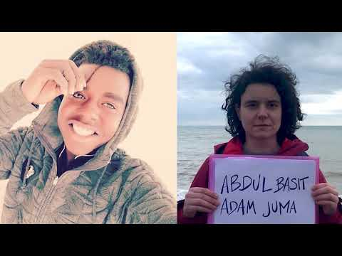
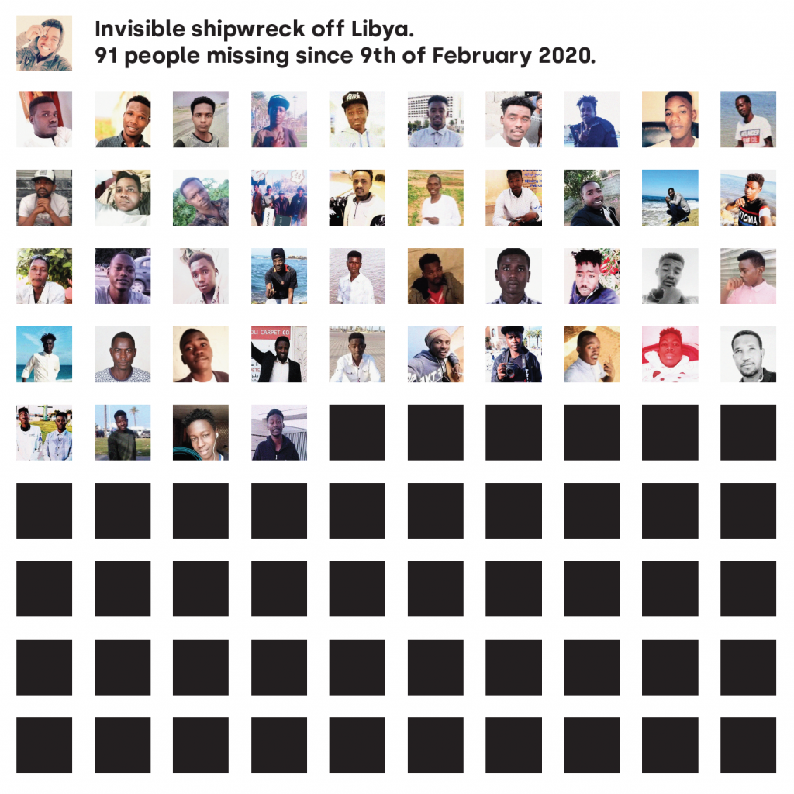
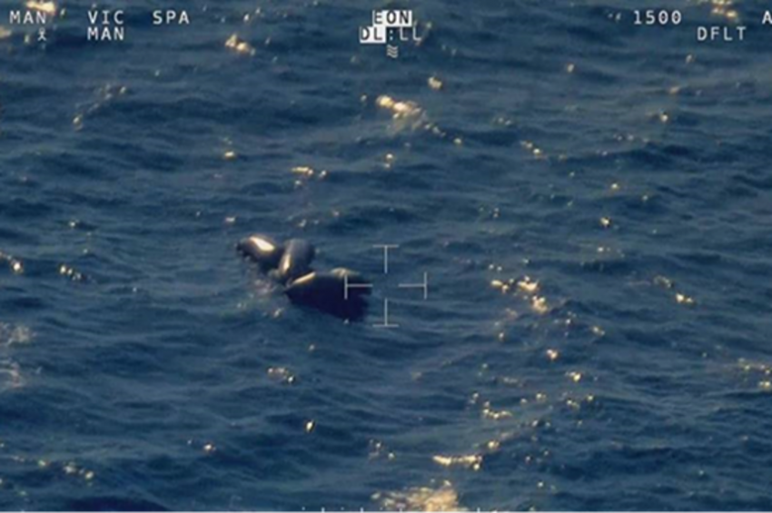
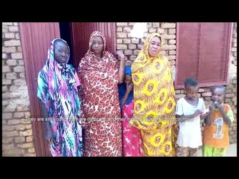
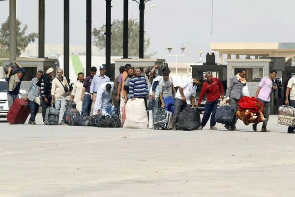
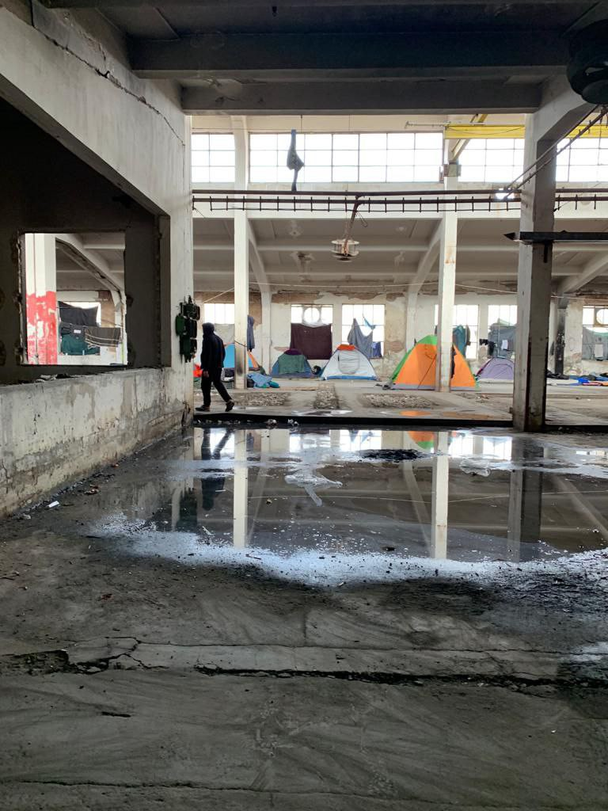
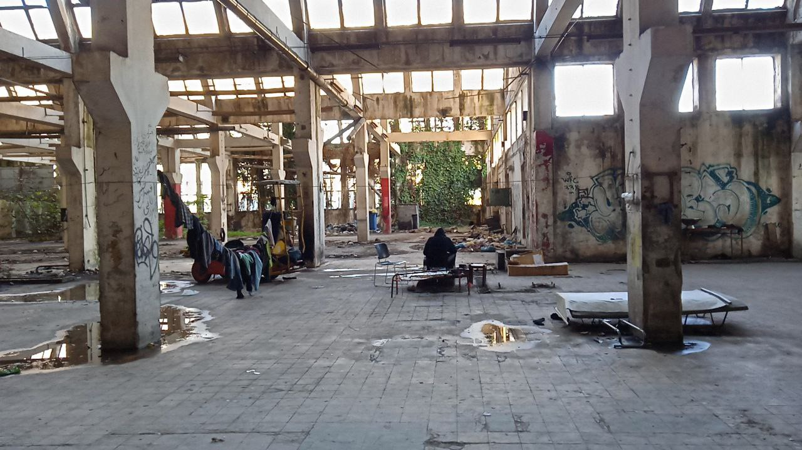

### AYS Daily Digest 09/02/20 ‘CommemorAction’ for 91 people lost in Central Med last year

_Plans for Yarl’s Wood have been withdrawn // volunteers needed in Greece // number of people in Tunisia on the move rising // and more…_

### FEATURE \#WhereAreThey: Remembering the lives of those who perished on February 9, 2020

At 04\.09 on February 9, 2020, the distress hotline Alarm Phone received a call, a call that was initially no different than the dozens of others the organization receives each year\. \(In 2019, 101 boats, carrying over 6,200 people, reached out to Alarm Phone for help, compared with just 27 boats in 2018\. \) A group of 91 people were trapped on a deflating black dinghy off Garabulli, Libya\. They gave their GPS coordinates to Alarm Phone, who duly relayed the information to Italian, Maltese and Libyan authorities\. The passengers called again at 05\.35 — and then, silence\. The people on board were never heard from again\.

On February 9 this year, protests and commemorative events were held across Europe and in the deceased’s hometowns in Africa to remember their lives\.

In a call to action, Alarm Phone wrote:

> In solidarity with \[the dead\], and in solidarity with the friends and families of all people who went missing or were killed by the violent European border regime, today we gather in several cities to demand answers\. 

> Together with them, we say their names out loud, to remind Europe that each Black Life matters, that we will not forget, and that we will keep fighting against this racist border regime\. 

> Together with them, we demand an immediate end to racist violence, to the killing of people on the move, and to their forced disappearance\. 

> Today and every day we fight to hold Europe accountable for its racist violence, and we fight for freedom of movement for all\. 

■■■■■■■■■■■■■■ 
> **[Alarm Phone](https://twitter.com/alarm_phone) @ Twitter Says:** 

> > #CommemorAction
February 9
Today, families of the disappeared protest in Al Fasher, #Darfur  

They ask: Where are our loved ones?
#BlackLivesMatter https://t.co/CLaQkywZ1p 

> **Tweeted at [2021-02-09 12:44:56](https://twitter.com/alarm_phone/status/1359121099649335297).** 

■■■■■■■■■■■■■■ 

■■■■■■■■■■■■■■ 
> **[Mediterranea Berlin e.V.](https://twitter.com/berlinersfor) @ Twitter Says:** 

> > #CommemorAction in Berlin with @[alarm_phone](https://twitter.com/alarm_phone) @[seawatchcrew](https://twitter.com/seawatchcrew) @[seawatch_intl](https://twitter.com/seawatch_intl) @[RescueMed](https://twitter.com/RescueMed) 
[facebook.com/mediterraneabe…](https://www.facebook.com/mediterraneaberlinev/posts/539247660801260) https://t.co/eL1HugsJWS 

> **Tweeted at [2021-02-09 17:24:53](https://twitter.com/berlinersfor/status/1359191552959078401).** 

■■■■■■■■■■■■■■ 

■■■■■■■■■■■■■■ 
> **[Mediterranea Saving Humans](https://twitter.com/RescueMed) @ Twitter Says:** 

> > Da #Palermo passando per #Barcellona, #Pescara, #Roma, #Berlino e dalla #MareJonio ci uniamo come @[RescueMed](https://twitter.com/RescueMed) all’iniziativa di @[alarm_phone](https://twitter.com/alarm_phone) per ricordare le persone disperse dal 9 febbraio 2020.
#CommemorAction #saytheirnames #borderskill #blacklivesmatter #stopdeathsatsea https://t.co/KXJ5c9ARr2 

> **Tweeted at [2021-02-09 19:06:31](https://twitter.com/RescueMed/status/1359217132077260801).** 

■■■■■■■■■■■■■■ 

The 91 people who perished that day make up just a small proportion of the estimated 983 human lives lost in the vast water\-desert of the Central Mediterranean in 2020, according to IOM’s [Missing Migrants](https://missingmigrants.iom.int/region/mediterranean) project\. 124 people have died in the entire Mediterranean thus far in 2021, only five weeks into the calendar year\.

The silence from authorities on this boat was defining\. At the time, the Libyan coastguard told Alarm Phone they would not conduct a search and rescue operation in the area because “the detention centers were full,” according to [Alarm Phone](https://alarmphone.org/en/2021/02/09/commemoraction-91-people/?fbclid=IwAR2n388REQSwKQYgOqFBcFTsDjcFLWpxwOSAmEmK-220Hlu_hcyylqtxrxc) \.

A month later, Alarm Phone wrote an [open letter](https://alarmphone.org/en/2020/02/19/an-invisible-shipwreck/) to authorities demanding answers and accountability\. They [received no response](https://alarmphone.org/en/2020/03/19/invisible-shipwreck-off-libya-authorities-remain-silent-but-relatives-speak-up/?post_type_release_type=post) \.

Finally, in December of last year, after sending another letter to authorities, Alarm Phone received a response from Frontex: a picture of the deflated dinghy\. No human remains are visible in the photograph\.

The deflated rubber boat thought to belong to the 91 people who disappeared in the Mediterranean on February 9, 2020\. \(Source: Frontex\)

While it is perhaps a positive development that Frontex felt enough pressure to release the picture, a mere photograph is grossly inadequate\. It does not provide answers, explanations or any relief\. All that it proves is that Frontex knew about this atrocity and was so cowardly and heartless that it did not release the information until compelled to do so due to a mix of internal and external pressures\. More than a picture of a boat, it is a portrait of Frontex’s complicity\.

Throughout the past year, families and friends of the 91 missing people reached out to Alarm Phone to enquire about their loved ones, and through collective efforts and self\-organization by the families, most of whom are from Darfur, a list of the deceased was created\. Sixty\-two names and dozens of faces smile out from the photo assemblage, a grim reminder of the deadly human toll of European border policies\. We are glad, though, that some family members were able to gain even a modicum of closure thanks to these efforts\.

In a moving tribute published yesterday, Alarm Phone wrote:

> We reject the logic of reducing Black/Migrant people, their lives and their deaths to numbers and statistics\. This racist dehumanisation does not account for the loss of Abdul, of Aboubacar, of Adnan, of Afdel\. It does not account for the pain inflicted to their mothers, their sisters, their friends\. It does not account for the White supremacist violence, by action and by inaction, historical and present, that keeps murdering Black/Migrant lives or lets them die at sea\. 

More commemorative videos can be viewed below\. You can also check out a blog post by [Civil Fleet](https://thecivilfleet.wordpress.com/2021/02/09/what-happened-to-91-people-who-went-missing-in-the-mediterranean-a-year-ago/?fbclid=IwAR112r5Zibyvjfx5gL2VVbdjDh2FQ7DfxmNXGOAM-W9bk2H-M4Z3J66BDo4) about the one year anniversary\.

#### TUNISIA

Source: ANSAmed
### Number of people\-on\-the\-move on the rise

The number of refugees and asylum\-seekers is increasing in Tunisia, a country which can offer little legal protection to these vulnerable groups, [ANSAmed](http://www.ansamed.info/ansamed/it/notizie/stati/tunisia/2021/02/04/tunisiaunhcr-rifugiati-e-richiedenti-asilo-in-aumento_32848387-b580-48a0-9b14-a05a891840df.html?fbclid=IwAR3qGSAHq2hq-cq8LoJs4N2osS0MVCtl06kZSaV4UcyVcrm6htZAkS6NPHU) reported last week\.

“The number of refugees and asylum seekers in Tunisia jumped to 6,500 people by January 2021, compared to 6,200 in 2019\. Another 1,900 people are awaiting registration for asylum in Tunisia,” said Nadija Hafsa, UNHCR’s head of the protection and legal department in Tunisia\.

In 2020 [UNHCR Tunisia](https://reliefweb.int/sites/reliefweb.int/files/resources/UNHCR%20Tunisia%20Operational%20Update_December2020.pdf) registered 3,237 new refugees and asylum\-seekers, doubling the overall registered population in the country\. In an operational report, UNHCR says the increase was primarily due to “enhanced registration capacities” that reduce the registration backlog, but also acknowledged that more individuals are requesting asylum, mainly from the Ivory Coast and Syria\. Currently some 1,800 people on the move are awaiting registration\.

“Tunisia respects international conventions and does not extradite refugees to their countries of origin,” Hafsa said, but she also admitted that a better legislative framework was needed to process and accommodate asylum\-seekers\.

Raoudha Laabidi, president of the National Authority for Combating Trafficking in Human Beings, the Tunisian government’s lead agency coordinating anti\-trafficking efforts, urged speeding up the adoption of asylum law, according to ANSAmed\.
#### GREECE

■■■■■■■■■■■■■■ 
> **[Samos Volunteers](https://twitter.com/samosvolunteers) @ Twitter Says:** 

> > Shout out to the great effort of @[drapenihavet](https://twitter.com/drapenihavet), @[R4Refugees](https://twitter.com/R4Refugees) &amp; @[chooselove](https://twitter.com/chooselove) for this much needed distribution.

3,000+ #SamosRefugees are facing winter in makeshift shelters outside the RIC facility, without running water or electricity.

Let’s keep up the good work!

#RefugeesGr 

> **Tweeted at [2021-02-09 14:49:56](https://twitter.com/samosvolunteers/status/1359152558351282178?fbclid=IwAR3w-NvCxgHeU8jLxX7kxkcQDi1nsVB44-aNEU8L9HyNs4M7iKH38ClEcVU).** 

■■■■■■■■■■■■■■ 

![Update from Patras: “They don’t speak with us”
“These were the last words of N\., a guy who lives in one of the abandoned factories behind the new port of Patras, during a conversation about the increasing repression that the POM are facing while playing the “game”\. N\. was forced to leave his city in Afghanistan, starting a journey that sees its longest moment here, at the gates of the Mediterranean, stuck in a cold and aseptic building, waiting the right chance to reach the other side of the sea and a better future far from any kind of suffering\. In his words there was surprisingly no anger, nor hate, only the bitter awareness of the violence, as well the silence and the indifference that do not involve only the public force \(although this is the most direct and obvious example\), but are instead carried out, on a large scale, in the same place which is supposed to welcome everyone, and in which N\. as well as many others here would like to start a new life\.” Photos and Info by [No Name Kitchen](https://www.facebook.com/NoNameKitchenBelgrade/posts/1178453019219647)](assets/7dda087f959d/1*y-a0QMUSNVA8mQQ8hVE6uQ.jpeg)

Update from Patras: “They don’t speak with us”
“These were the last words of N\., a guy who lives in one of the abandoned factories behind the new port of Patras, during a conversation about the increasing repression that the POM are facing while playing the “game”\. N\. was forced to leave his city in Afghanistan, starting a journey that sees its longest moment here, at the gates of the Mediterranean, stuck in a cold and aseptic building, waiting the right chance to reach the other side of the sea and a better future far from any kind of suffering\. In his words there was surprisingly no anger, nor hate, only the bitter awareness of the violence, as well the silence and the indifference that do not involve only the public force \(although this is the most direct and obvious example\), but are instead carried out, on a large scale, in the same place which is supposed to welcome everyone, and in which N\. as well as many others here would like to start a new life\.” Photos and Info by [No Name Kitchen](https://www.facebook.com/NoNameKitchenBelgrade/posts/1178453019219647)
### Two week hard lockdown for Attica

Ekathimerini reports that “ _Prime Minister Kyriakos Mitsotakis announced on Tuesday a near\-total lockdown in the most populous region of Greece until February 28 on Tuesday evening, citing a “worrying” rise in hospitalizations in Attica and in the spread of the Covid\-19 variants which are more transmissible\._ ” Learn more [here](https://www.ekathimerini.com/262195/article/ekathimerini/news/attica-to-enter-two-week-hard-lockdown-amid-rise-in-hospitalizations?fbclid=IwAR3RQDPv6yCTYceB60olC41mRGbIawEDBv8jt4eWi19MrpmCA-SdHy2ve9k) \.

 : “Today we made up 82 individual bags, each with sleeping bag, blankets, shoes, and fitted clothes\. We also sent 65 sleeping bags for the African community\. This in collaboration with Moria Corona Awareness Team and Stand by Me Lesvos\.” [The former said](https://www.facebook.com/MoriaCoronaAwarenessTeam/posts/247385213557323) “We are very happy this system works\. It is in the beginning so still some things don’t go 100% well, but mistakes are good to learn from them\. We get better every day and now we focus on blue zone in camp where most of our sisters and brothers from Africa are living and every day we distribute to them\. Each one knows the day to receive the staff and they come to pick at our recycling points\.” Photo by the Hope Project](assets/7dda087f959d/1*ySZGc1HUuKxe6ncHRGb5sA.jpeg)

[The Hope Project said](https://www.facebook.com/HopeProjectGreece/photos/a.1659118077702651/2900804350200678/) : “Today we made up 82 individual bags, each with sleeping bag, blankets, shoes, and fitted clothes\. We also sent 65 sleeping bags for the African community\. This in collaboration with Moria Corona Awareness Team and Stand by Me Lesvos\.” [The former said](https://www.facebook.com/MoriaCoronaAwarenessTeam/posts/247385213557323) “We are very happy this system works\. It is in the beginning so still some things don’t go 100% well, but mistakes are good to learn from them\. We get better every day and now we focus on blue zone in camp where most of our sisters and brothers from Africa are living and every day we distribute to them\. Each one knows the day to receive the staff and they come to pick at our recycling points\.” Photo by the Hope Project
### Volunteers needed\! The Lava Project and Refugee Biriyani & Bananas

The Lava Project laundry service is recruiting for a new long\-term volunteer to work on Lesvos\. [Apply here\!](https://www.facebook.com/groups/greecevolinfopoint/permalink/1408322136165514/) 
Application details:
• Start date in March
• Living costs reimbursed
• 4 month minimum commitment

](assets/7dda087f959d/1*VuChCN2yWt6ZNabE9eYNCQ.jpeg)

Photo by [Refugee Biriyani & Bananas](https://www.facebook.com/ruhi.akhtar.7/posts/4281422228541319)
#### ITALY
### Critical conditions on the Italian\-French border

The Italian medical organization [Doctors for Human Rights \(MEDU\)](https://mediciperidirittiumani.org/ancora-critica-la-situazione-dei-migranti-sulla-rotta-nord-ovest-delle-alpi/?fbclid=IwAR37HzFMClPcj_Stq-pRSpYZpSmSpykVAqC6NWLR_RO6CVPdyG0oXdaskKA) published a statement last week decrying the abysmal conditions facing people on the move along the Italian\-French border and urging increased collaboration\.

An estimated 4,700 people traveled through the Italian town of Oulx between September and December 2020, according to the organization, most of them from Afghanistan \(44%\), Iran \(23%\) and Algeria \(8%\) \. Among them were families with very young children — the youngest was only 14 days old\.

The weather conditions are at their worst now, in the cold winter months\. Most of the people on the move have traveled through the Balkans, not through the Mediterranean route, so have already endured very harsh weather in Bosnia and Croatia and display signs of severe psychological trauma following numerous encounters with border police in those areas\.

There are three reception shelters on the Italian and French sides of the border, but all are at risk of closure or eviction\. The Italian reception network has seen high numbers of arrivals and is “experiencing a situation of constant emergency,” according to MEDU\. _Maradeurs_ , volunteers who try to recover missing people in the mountains, now number more than 200 people\.

MEDU recommended the following steps to avoid catastrophe and death along this border area in the coming weeks and months:
1. Collaboration between volunteers, organizations and authorities to draft an emergency reception plan
2. Strengthening existing reception facilities, including increasing the hours of operation of one facility
3. Halt the eviction of the self\-managed shelter, which would put men, women and children out in the street
4. Set up a medical facility open to all people, regardless of legal status
5. Better information services for people crossing borders and help with requesting asylum

For those interested, MEDU’s full report \(in Italian\) can be accessed [here](https://mediciperidirittiumani.org/medu/wp-content/uploads/2021/02/Report-sulla-rotta-Nord-Ovest-delle-Alpi_-Alta-Valle-di-Susa-Ottobre-dicembre-2020_def.pdf) \.
### Ocean Viking disembarkation complete\!

■■■■■■■■■■■■■■ 
> **[SOS MEDITERRANEE](https://twitter.com/SOSMedIntl) @ Twitter Says:** 

> > The disembarkation of survivors from #OceanViking in Augusta, Sicily, is complete. We wish them all the best.

We cannot help but think of the ~1500 people who were intercepted &amp; returned to #Libya last week, back to arbitrary detention &amp; abuse.

Libya is not a place of safety. https://t.co/Ikrhl1Rom7 

> **Tweeted at [2021-02-09 13:50:25](https://twitter.com/SOSMedIntl/status/1359137580143570950).** 

■■■■■■■■■■■■■■ 

More information and photos of the disembarkation can be found [here](http://www.mediterraneocronaca.it/2021/02/08/augusta-chi-sono-le-422-persone-sbarcate-da-ocean-viking-foto/?fbclid=IwAR20XG6jVfZEEqaisohaH9wOjZ1PDBIGWLXFX7faX97pWS6OZDgOiPFoXHc) \.
#### SPAIN
### CEAR: Recommendations for Canary Islands

The non\-profit [Spanish Commission for Refugees \(CEAR\)](https://www.cear.es/doce-propuestas-migracion-canarias/?fbclid=IwAR2aMDWHu2Jd3PLZoEUlmxgDoAoEd2IMjPMedK2F4m-bIsBNdb0CNAZIJUc) has released a series of 12 recommendations to address migration on the Canary Islands\. CEAR’s general director, Estrella Galán, and its coordinator on the Canaries, Juan Carlos Lorenzo, sent the proposals to the Senate yesterday\.

The recommendations include transferring new arrivals from the Canaries to elsewhere in Spain \(essentially avoiding the creation of a hotspot island similar to the Greek islands\); launching information campaigns to combat hate speech against migrants; and respecting the maximum legal detention period of 72 hours\. The full list of recommendations can be found via the link above\.
### Human trafficking bust

Police arrested eight members of a suspected human trafficking ring from Melilla, Spain’s North African enclave, [Reuters](https://www.reuters.com/article/us-europe-migrants-spain-melilla-idUSKBN2A60DW?fbclid=IwAR3v3CgClmmg_cvQJmcDqW9qOx-reWc55mIH3fXksydQYHKDQYmhd50T9-8) reported\. The arrested were Spanish and Moroccan nationals, and are thought to have charged people on the move 2,000 EUR each to cross the Mediterranean in speedboats\.

They are also thought to have transported hashish from Morocco to Andalusia, in southern Spain\.

Police seized three speedboats, 335 kg of hashish, 17 vehicles, and seven mobile phones\.

Spanish law enforcement arrested [285 human trafficking suspects](https://www.state.gov/reports/2020-trafficking-in-persons-report/spain/) in 2019, compared with 311 suspects in 2018\. Human trafficking includes the forced movement of people, sex trafficking, labor trafficking, forced criminality, and forced begging\.
#### SERBIA

](assets/7dda087f959d/1*wRqJca4OuYF-gjr8Rvu6JA.jpeg)

“In Sombor there are still problems, difficult situation and current weather conditions, as well as sub\-zero temperatures during the night for at least 1000 people\. Without proper toilets, without hot water and access to hygiene, most stay in inhumane conditions, in temporary tents, without enough blankets\.” Photo and Info by [Asylum Protection in Serbia](https://twitter.com/APC_CZA/status/1359130470445940738)
#### FRANCE
### Current situation in Calais

■■■■■■■■■■■■■■ 
> **[Calais Food Collective](https://twitter.com/CalaisFoodCol) @ Twitter Says:** 

> > In other news, please see our monthly report for news on what we were up to in January, and our various distributions, and police interactions. https://t.co/NuvtUL3Pwz 

> **Tweeted at [2021-02-08 19:03:12](https://twitter.com/CalaisFood/status/1358853907645087745).** 

■■■■■■■■■■■■■■ 

The grassroots NGO Calais Food Collective has released its January 2021 report\. They report that they delivered 20,460 meals and over 3,500 litres of water to 900 people across seven sites in Calais and two sites in Grande\-Synthe\. The group also reported 12 negative interactions with police, in which their team were either controlled or told to leave the area\.

Check out this Twitter thread to see the dire situation in northern France up close:

■■■■■■■■■■■■■■ 
> **[Julia Druelle](https://twitter.com/juliadruelle) @ Twitter Says:** 

> > Grande-Synthe, February 8 2021. I follow the volunteers of @[MdM_France](https://twitter.com/MdM_France), who this day organise medical consultations near Dunkerque. It’s 4 degrees below zero, a blanket of snow covers the tents and tarps tied to the trees. Around 150 people somehow live here in dire conditions. https://t.co/Ew5vI8c0fu 

> **Tweeted at [2021-02-09 13:20:15](https://twitter.com/juliadruelle/status/1359129991301255173).** 

■■■■■■■■■■■■■■ 

#### EU \+ FRONTEX

There are reports that “ _Frontex wanted to arm more than 1,000 police officers inside its new StandingCorps , but according to 2 external reports this is \(still\) legally impossible\. The EU border agency had further reports prepared, but does not give them via FragDenStaat\.de out_ \.” Analyst Matthias Monroy further included the letter from Frontex saying why they are not releasing those reports\. Read in full [here\.](https://twitter.com/matthimon/status/1359082235622735872?fbclid=IwAR2IUeAEMH6bZu0SRYiuk0_c04BqUktUfeM7fU8rartrGrGmVfqTVfnoBtU)
#### UK

](assets/7dda087f959d/1*_ieuETosuVoLUk6qPoySzg.png)

Yarl’s Wood plans are no more\! Photo by [Bedford Independent](https://www.bedfordindependent.co.uk/breaking-news-controversial-yarls-wood-plans-withdrawn-by-home-office/?fbclid=IwAR2yQ0zK4mMTbYVY0aG_VcbtiO6xuJTi4pOh99YwLivv5sXWroVE-4nRPMg)
### Plans for Yarl’s Wood are withdrawn\!

The government is no longer moving forward with [Yarl’s Wood](https://www.bedfordindependent.co.uk/breaking-news-controversial-yarls-wood-plans-withdrawn-by-home-office/?fbclid=IwAR2yQ0zK4mMTbYVY0aG_VcbtiO6xuJTi4pOh99YwLivv5sXWroVE-4nRPMg) to house 200 asylum seekers\! This is a victory for everyone fighting for humane living conditions for asylum seekers\. On Tuesday, the Home Office said:

> “Having given the matter careful consideration, the Home Office has decided not to proceed with plans to use the site adjacent to the existing Immigration Removal Centre for temporary accommodation for asylum seekers\. As you are aware we worked at pace to stand up the site as part of our winter contingency planning to ensure we had sufficient capacity across the system to meet expected demand\. 

> It is now clear that we do not need to use the additional capacity at this location at this time\. We continue to use our other additional temporary accommodation to ensure we continue to meet our statutory obligations whilst we work to get the asylum system back in balance\.” 

### New report shows how migrants are deterred from healthcare during pandemic

The Joint Council for the Welfare of Immigrants has just released a report that shows how migrants feel about their safety in accessing healthcare\. This fear is as a result of UK government policies, part of the Hostile Environment, which has since been renamed the Compliant Environment\. This government effort means that the National Health Service can be off limits to irregular migrants, who may fear being reported to immigration or having to pay extortionate fees just for seeking medical treatment\.

> “ **Almost half of all the migrants surveyed \(43%\) said they would be scared to access healthcare if they got sick during this pandemic\.** We did not ask for ethnicity information but 60% of migrants from Africa and the Caribbean report being fearful of seeking healthcare\. 56% of Asian respondents said they would be scared\. This is compared to just 16% of respondents originating from North America, Australasia and Europe\. Given that there is evidence that BME populations are being vaccinated at far lower rates than the rest of the population, these findings are extremely concerning\. We have also seen that BME populations are dying of the disease at higher rates, and that this cannot be explained by underlying health conditions\.” 

They also have data to suggest that migrants are still deterred from free healthcare, which is important since the announcement that undocumented people are now eligible to receive the vaccine\. The Joint Council has come to the conclusion that the only measure to take is to suspend the Hostile Environment\. Read the full report [here](https://www.jcwi.org.uk/migrants-deterred-from-healthcare-in-the-covid19-pandemic?fbclid=IwAR387YzvCsXpOkPtNpNZ-uU87sysl1CoexL9RMOHTxvqwF4m5aknFwKP5to) \.
#### GENERAL
### Donate your used cell phone\!

The charity Choose Love has shared information on how you can donate your used cell phone to a person on the move who might it more than you\.

■■■■■■■■■■■■■■ 
> **[Choose Love](https://twitter.com/chooselove) @ Twitter Says:** 

> > A phone is not a luxury. It is a lifeline.

But across Europe, many people on the move lack this basic essential. 

You can help.

Follow our simple steps to donate your unwanted phone and we'll get them to where they're needed most - [helprefugees.org/news/donate-a-…](https://helprefugees.org/news/donate-a-phone/) https://t.co/PWMikvgJPa 

> **Tweeted at [2021-02-09 10:45:26](https://twitter.com/chooselove/status/1359091026808475650).** 

■■■■■■■■■■■■■■ 

#### WORTH READING
- [The Progressive Policy Think Tank](https://www.ippr.org/research/publications/beyond-the-hostile-environment?fbclid=IwAR1ElxFnEqJDz40xpflxkIVuuCxFBqgtJ3cOb1Bp3w3ORFTzg_gPkmPQ8zc) just published **Beyond the hostile environment\.** “ _In this final report, we assess six different policy options for addressing the adverse impacts of the hostile environment on individuals and communities and for reforming the current system of immigration enforcement\._ ”

**Find daily updates and special reports on our [Medium page](https://medium.com/are-you-syrious) \.**

**If you wish to contribute, either by writing a report or a story, or by joining the info gathering team, please let us know\.**

**We strive to echo correct news from the ground through collaboration and fairness\. Every effort has been made to credit organisations and individuals with regard to the supply of information, video, and photo material \(in cases where the source wanted to be accredited\) \. Please notify us regarding corrections\.**

**If there’s anything you want to share or comment, contact us through Facebook, Twitter or write to: areyousyrious@gmail\.com**

_Converted [Medium Post](https://medium.com/are-you-syrious/ays-daily-digest-09-02-20-commemoraction-for-91-people-lost-in-central-med-last-year-7dda087f959d) by [ZMediumToMarkdown](https://github.com/ZhgChgLi/ZMediumToMarkdown)._
