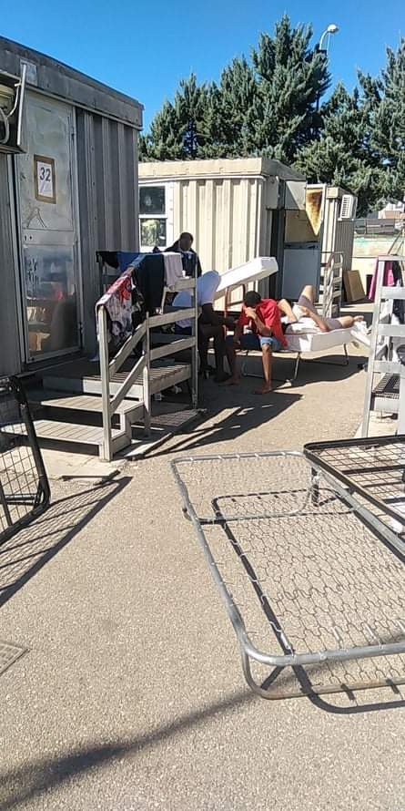
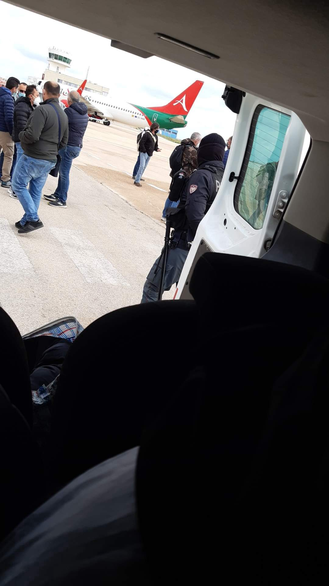
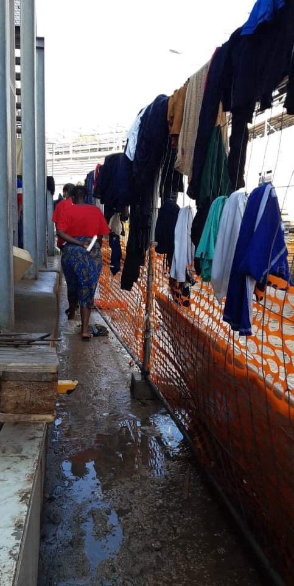
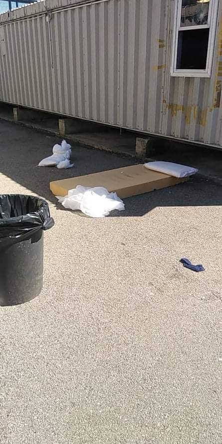

### AYS Special from Italy: 2020, not only Covid\-19\. Deportation, invisibility, detention and lack of reception\. PART I

_The [LasciateCIEntrare](https://www.lasciatecientrare.it/) campaign was born in 2011 as a response to the Interior Ministry’s provision prohibiting media access to CPRs \(Stay Centres for Repatriations, previously Identification and Expulsion Centres, CIE\) and CARA \(Reception centres\) \. Having obtained an annulment of the provision, the group now fight for the closure of all CPRs, for the abolition of administrative detention and for the revision of migration policies\. What follows is the first part of their report on the situation for people on the move in Italy in 2020\._

_Watch this space for PART II\._

CARA in Caltanissetta, Sicily, November 2020
#### 2020 will be remembered by all of us as ‘the year of Covid\-19’\.

On one hand this label acts as a magnifying glass for chronic system failures — in the health care sector, for example — which continuously show how much the private has devastated the public\. On the other, it conceals and justifies a series of practices that have characterised the whole year:

> _the mass deportations to countries of origin;_ 

> _the use of quarantine sites for migrants that are completely invisible to the outside world and totally unreachable, such as quarantine ships;_ 

> _the incalculable slowness of bureaucracy in terms of renewal of residence permits;_ 

> _the reception of asylum seekers and refugees in an ever\-deepening dilapidation\._ 

In 2020, the LasciateCIEntrare Campaign continuously monitored administrative detention centres \(CPR\), quarantine ships and the people left on the street after receiving expulsion papers — which Tunisians call “7 day permits”\. The campaign denounced repatriation practices, often carried out with impressive speed while completely detrimental to many legal rights: to information, to health, to legal counsel, to asylum\.

Transfer from Lampedusa, December 2020

This phenomenon affects ALL Tunisian citizens arriving in Italy, but in even greater numbers since the visit of the Italian Ministers of Interior and Foreign Affairs and two European Commissioners to Tunisia last July and their subsequent agreements, although no official documents have [emerged](https://www.ansa.it/sito/notizie/cronaca/2020/08/17/migranti-viminale-sblocca-11-mln-euro-aiuti-a-tunisia_ec6953f3-6e2b-48e0-b524-8ea83c05d4a5.html) in this regard\.
#### Hotspots

In several cases, dozens of Tunisians have landed on Italian shores and spent days without any rights in the hotspots of Lampedusa or in Pozzallo or even in the Bisconte barracks in Trapani\. Those who arrive on the island of Pantelleria are imprisoned to “observe” the period of quarantine as established by the various Covid\-19\-related DPCMs \(Decrees of the President of the Council of Ministers\) of which there were many in 2020\. Sometimes people are repatriated directly, or after a very short stay — 2 or 3 days — in a CPR, during which time they are not given access to their phones to notify their families or activists of their whereabouts\. In the hotspots people are prevented from receiving information and from asking for asylum: “you will do it later” is the phrase that everyone receives in response to their requests\.

Lampedusa Hotspot, November 2020

Hotspots are places of a totally uncertain legal nature\. On one hand, they are proposed as first reception facilities, designed to assist and provide migrants who have just landed with a path towards inclusion in Europe\. On the other hand — and this is the aspect that is most emphasised by the Italian government — they are a ‘jail’ from which one cannot leave and in which all police procedures are carried out\. This includes identification and of course country of origin checks\. It then acts as a space from which forced repatriations can take place without ever having had the opportunity to apply for international protection\. The hygienic and sanitary conditions of these places have always been denounced by the “guests” as terrible and unworthy of a human being\. \(Read more on Lampedusa hotspot [HERE](https://www.lasciatecientrare.it/lampedusa-della-mala-accoglienza/) , [HERE](https://www.lasciatecientrare.it/hotspot-di-lampedusa-condizioni-disumane-e-violazioni-dei-diritti-umani/) and [HERE](https://www.lasciatecientrare.it/a-lampedusa-l-hot-spot-non-ci-puo-essere/) \)

Over the years there have been many protests and revolts due to the poor conditions, but nothing has changed\. 2020 only represented a continuity in this shame, with the additional aggravation that they have also been used as places for quarantine, in accordance with the relevant DPCMs\. The word quarantine should mean observational isolation for the purpose of understanding whether or not a person has an infectious pathology and should come with special criteria for hygiene, isolation and medical care\. The photos sent to us by migrants clearly show that at most there are _cages_ in which “to hold people”, without any respect of their rights or their humanity\. No one knows the length of their stay, nor when they will be able to ask for asylum\.

The Tunisians who have contacted us have succeeded in doing so only thanks to activists — including several other groups — and to the appointment of trusted lawyers\. Many of them were returned home without ever understanding what had happened, their journey to Europe existing only as a nightmare that consisted of overcrowding, confused news, cages and anger\.

One of the most striking cases that was reported to us at the end of November by family members concerned a Tunisian citizen and his child [held in the Pozzallo hotspot](https://www.avvenire.it/attualita/pagine/sul-barcone-con-il-padre-per-curare-la-paralisi-bimbo-di-7-anni-rinchiuso-a-pozzallo-appello-al-viminale) \. They were kept in pitiful conditions despite the seven\-year\-old having severe disabilities and paralysis\. “My son pees his pants and we can’t even get a change of clothes”, the father repeated during the days of confinement in the hotspot\. Letters to the competent bodies did nothing, it was necessary to involve journalists and lawyers to gain the attention of the relevant institutions and obtain their transfer\. Men, women with children as well as unaccompanied children are all housed here\. In one case a 16\-year\-old in her sixth month of pregnancy passed completely unnoticed\. In this case the intervention of another lawyer, G\. M\. Pasqualino, was necessary in order for her to be transferred elsewhere\.

These places have become even more inaccessible than they used to be\. We have been denied access to CPRs for almost two years now because we are considered “hostile subjects”\. Since March 2020, the “excuse” of quarantine has meant that no one apart from doctors and representatives of the national authority for the rights of persons deprived of their liberty can enter these places\. Solicited parliamentarians prefer to _“tread carefully”_ on immigration matters, _“because the period is politically complex”_ \. The only possibilities are therefore the phone — we have an SOS phone which people in difficulty in hotspots and CPRs can call or use to contact family members and activists in their countries of origin — and the intervention of the national authority for the rights of persons deprived of their liberty, to which we continuously submit reports _\._

CARA in Caltanissetta, Sicily, November 2020

Such inaccessibility applies not only to hotspots but also to CPRs and quarantine ships\. It is a pity that in hotspots people are allowed to keep their personal phone but in CPRs \(except for Gradisca\) this is not allowed, which makes it complicated if not impossible to understand what is happening inside\.

An example of this disturbing and routine denial of legal rights occurred on December 1st 2020 when 11 people from Tunisia were stranded off the island of Pantelleria\. They didn’t know who to call, so they swam ashore\. All this in the freezing cold\. When they arrived on the mainland they asked for help, but in response they were locked up in Trapani’s barracks, and had their cell phones taken\. Among them was an unaccompanied minor, immediately transferred to a suitable centre\. After 13 days, without knowing anything about their destiny, they were transferred first to Trapani and then to Rome, where they were told they would be released, but instead they were locked up in the CPR of Ponte Galeria \(Rome\) to be repatriated after a few days without ever having had access to the asylum application procedure, except for one person who’s case we are still following with the lawyers Benzi and Ballerini\.
#### **CPR \(Stay Centres for Repatriation\)**

2020 started with two deaths in CPRs\. Aymen in the CPR in Caltanissetta and Vakhtang in the CPR in Gradisca, who both died in January\.

Aymen was ill but it seems he [never received adequate medical assistance](https://www.mediterraneocronaca.it/2020/01/13/nei-cpr-si-muore-e-scoppiano-proteste-ma-si-nega-ingresso-alla-societa-civile/) , and he died on January 12th inside the CPR in [Caltanissetta](https://www.borderlinesicilia.it/monitoraggio/caltanissetta/) — which is currently closed for the “renovation of premises”\. A CPR with overcrowded rooms, inadequate sanitary facilities, a non\-functioning sewage system and continuous problems due to cold and lack of blankets\. On January 18th, a protest was organised in front of the centre, together with local organisations \(Sportello immigrati di Caltanissetta, la rete antirazzista Catanese, Borderline Sicilia, Campagna LasciateCIEntrare, forum antirazzista di Palermo, Arci Palermo e Catania and others\) in order [not to silence Aymen’s death](https://www.lasciatecientrare.it/appello-per-una-nuova-politica-sullimmigrazione-casi-come-quelli-di-caltanissetta-e-trapani-sono-solo-il-segno-di-un-sistema-irriformabile/) \.

Returning from the protest, we received the news of another CPR death: Georgian citizen Vakhtang Enukidze\. He died as a [result](https://www.lasciatecientrare.it/dopo-la-morte-del-cittadino-georgiano-cosa-sta-succedendo-nel-cpr-di-gorizia/) of a violent police beating in the centre in Gradisca\. Together with the local network NOCPR FVG, Progetto MeltingPot and the lawyers G\. Vitale, C\. Bove, A\. Arena and A\. Guadagnini, we followed the disturbing events that surrounded Vakhtang’s death: the elements collected showed the highly repressive climate of the detention conditions in the CPR with “repeated police beatings” which took place over the week preceding Vakhtang’s death, but also the forced repatriation of potential witnesses, thus preventing a fair examination of the facts\. To date [nothing has been achieved](https://www.globalproject.info/it/in_movimento/vakhtang-enukidze-ennesima-morte-di-stato/22528) : no truth and no justice for Vakhtang\.

A few months later [another death occurred](https://www.lasciatecientrare.it/un-cittadino-albanese-morto-al-cpr-di-gradisca-di-isonzo/) in the CPR of Gradisca\. In July, a 28 year old Albanian boy died, apparently due to his taking an excess of sedatives and tranquilisers\. The young man, who had been stopped the day before for stealing a bicycle, ended up in the CPR and died there\!

 \)](assets/e6b199a72f36/0*xLFpf5DHSk8cAZjO.jpeg)

Gradisca d’Isonzo CPR \(photo by [Landscapes of Border Control](https://borderlandscapes.law.ox.ac.uk/location/cpr-gradisca-disonzo) \)

The pandemic worsened the situation in the CPRs: riots and protests against inhuman and degrading treatment have continued, but other CPRs have still been opened: in [Macomer](https://www.lasciatecientrare.it/sullapertura-del-cpr-in-sardegna-macomer/) , Sardinia, on January 20th, 2020, in Milan on September 28th, 2020, while at the end of the year the CPR in Trapani was re\-opened, although no information comes from there\. In Macomer, in the few weeks after its opening, [there were suicide attempts and acts of self\-harm, and in June a protest took place, with one detainee sewing his mouth shut](https://www.lasciatecientrare.it/continua-latteggiamento-omertoso-delle-autorita-sul-cpr-di-macomer/) \.

During the lockdown period, the number of new inmates in administrative detention was reduced, but those that did end up there mainly arrived as ‘transfers’ from the prison system, with the consequence for foreigners of having to serve a double sentence, often even though they have wives and children in Italy\.

There is an exponential increase in the number of unaccompanied minors found in the CPRs\. In the past this was an [occasional event](https://www.lasciatecientrare.it/lasciatecientrare-un-msna-trattenuto-al-cpr-di-trapani/) , but now it has become [the norm](https://www.lasciatecientrare.it/msna-nei-cpr-di-gradisca-di-isonzo-e-torino/) in most of the CPRs\. The reason is simple: Tunisians, following the recent agreements between Italy and Tunisia, are not actually considered as people, but “they are packed off for deferred refoulment or for the CPR or even for direct repatriation”, without EVER being allowed to explain their situation and without ever being “seen”\. [In this way](https://www.redattoresociale.it/article/notiziario/cpr_milano_rinchiusi_due_minori_e_per_altri_otto_eta_non_certa) , dozens of minors end up in detention or worse are repatriated\. In several cases, the minors initially detained in CPRs were transferred to appropriate facilities only following the intervention of a trusted lawyer or our reporting to the authority for the rights of the child \( _Garante per i diritti dell’infanzia e dell’adolescenza_ \) \.

We followed a particular case that shows the delirium of the infernal machine of repatriations to Tunisia concerning three Tunisian citizens who had expressed their will to seek asylum since their arrival in Lampedusa\. Unheard, they were first transferred to regular quarantine on special ships and after about two weeks, having tested negative for Covid\-19, they were forcibly transferred to the CPR of Gradisca\. Neither in Lampedusa nor on the ship were they able to apply for asylum\. Together with their families and thanks to the network of activists — involving our campaign and Terre pour Tous in Tunisia — we managed to provide a trusted lawyer from our network to guarantee their asylum request\. Nevertheless, after a few days, the three Tunisian citizens were transferred from the CPR to Palermo to be repatriated \(the city of Palermo is the place where the Tunisian consul identifies Tunisian citizens before repatriation\) \. Only with an immediate intervention, sending emergency letters to the competent bodies, were the three brought back to the CPR of Gradisca d’Isonzo\. Through this absurd situation, the repatriation has been avoided for now\.

This treatment is in total disregard of people’s rights, but exists under the framework of the agreement between Italy and Tunisia to which once again young Tunisians respond by saying in a [video](https://www.lasciatecientrare.it/andata-e-ritorno-gradisca-palermo-gradisca/) :

> _“President, we voted for you because we hoped for a better future\. Your agreements bring us in this cage \[ref\. Cpr of Gradisca d’Isonzo\] in which not even monkeys are put\. We made a revolution so that there would be more justice\. We are now ready to make another one in our country\. Our representations continue to disappoint entire generations\!”_ 

**Yasmine Accardo e Francesca Mazzuzi — [lasciatecientrare](https://www.lasciatecientrare.it/)**

**Find daily updates and special reports on our [Medium page](https://medium.com/are-you-syrious) \.**

**If you wish to contribute, either by writing a report or a story, or by joining the info gathering team, please let us know\.**

**We strive to echo correct news from the ground through collaboration and fairness\. Every effort has been made to credit organisations and individuals with regard to the supply of information, video, and photo material \(in cases where the source wanted to be accredited\) \. Please notify us regarding corrections\.**

**If there’s anything you want to share or comment, contact us through Facebook, Twitter or write to: areyousyrious@gmail\.com**

_Converted [Medium Post](https://medium.com/are-you-syrious/ays-special-from-italy-2020-not-only-covid-19-deportation-invisibility-detention-part-i-e6b199a72f36) by [ZMediumToMarkdown](https://github.com/ZhgChgLi/ZMediumToMarkdown)._
