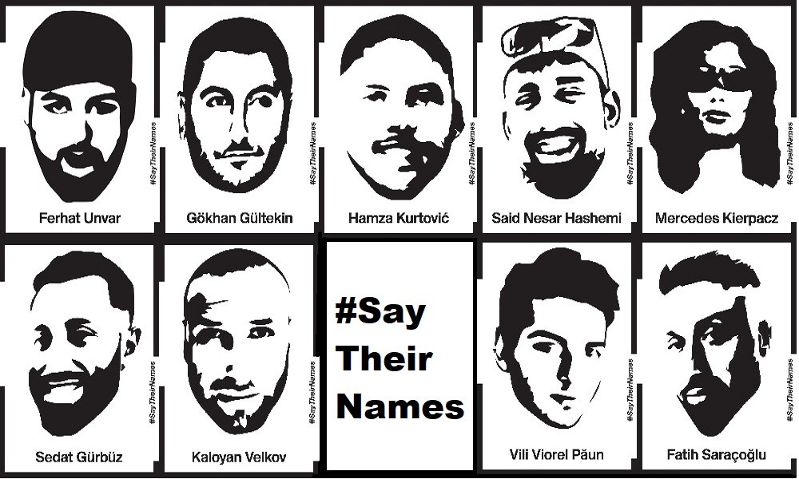
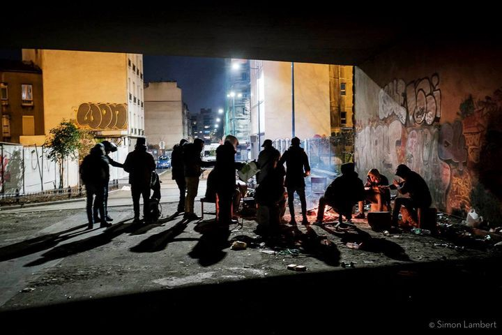

### AYS Daily Digest: 18/02/2021: One year after the racist terror attack in Germany
#### One year ago, a racist killed 9 people in Germany // Citizens of Lesvos stand in solidarity with camp residents // New details on the planned closed\-controlled camps on the Aegean Islands // Croatia: Shocking new evidence of sexual violence at border // Lampedusa: memorial planned for those who died on their way to Europe

### FEATURE: Say their names — one year after the racist terror attack in Hanau, Germany

> Ferhat Unvar, 

> Gökhan Gültekin, 

> Hamza Kurtović, 

> Said Nessar El Hashemi, 

> Mercedes Kierpacz, 

> Sedat Gürbüz, 

> Kaloyan Velkov, 

> Fatih Saraçoğlu, 

> Vili Viorel Păun\. 

These are the names of the nine people who were killed one year ago on February 19th in a racist terror attack in Hanau, Germany\.

The murderer, a white German man, was propelled by racist and extreme\-right belief systems\. He chose the people he shot according to his racialized world view\.

> We stand with the survivors, the families and friends of the victims\. 

> Our solidarity is with everybody who has to fear to become a victim of racism\. 

> We denounce the continuity of racism in Germany, Europe and the world\. 

### GREECE
#### Solidarity by Lesvos citizens

> “We are talking to you about our homes\. Our homes that will become warmer and more humane when those in this world who were unlucky enter for a while\. Some of us open our homes to fellow human beings who are cold\.” 

These are the words of Lesvos citizens, read out by Yanis Varoufakis in Greek parliament\. In the letter it is stated that it’s not even about the empty state buildings, the churches, the closed PIKPA and old Kara Tepe camp where people could be hosted in much better conditions than in Moria 2\.0\.
It is about Lesvos citizens’ homes\.

> “There are citizens who want to help their fellow human beings and open their own homes\. Answer them if they can do it and if not why\. Because they have to sleep even today knowing that a child could sleep in the heat, that they could put him to sleep in the heat but instead trembles from the cold in a terrible bag, in the mud\.” 

See a video of Varoufakis’s intervention [here](https://www.stonisi.gr/post/15101/lesvioi-theloyn-na-paroyn-spitia-toys-prosfyges-logw-toy-pagetoy-video?fbclid=IwAR3slzBXTJwysGwjWrVaW__dWr2Lcl6hAexPqmB3yxO-2VcJvaLx59CsbaY#.YC43DlWzOw4.facebook) \.

Lesvos and Moria 2\.0, as well as the other Aegean islands, are still caught in winter conditions\. In this video, a young man describes the situation at the moment in Moria 2\.0\.

■■■■■■■■■■■■■■ 
> **[Moria White Helmets](https://twitter.com/MWHGreece) @ Twitter Says:** 

> > Peoples inside the camp are facing too much problems because of the cold and no we dont have any heaters! #Refugeeshavenorights #refugeeshavenoheating #Moria2 https://t.co/jYkuYpBiKl 

> **Tweeted at [2021-02-18 12:32:53](https://twitter.com/MoriaMediaTeam/status/1362379561460195331?s=19&fbclid=IwAR002D_T8RYMg2MJQEtk9FBdrq2HtawIO-1Ii_KinnSx2K14id5UdgdKo-k).** 

■■■■■■■■■■■■■■ 

NGOs like Humanity Crew call for support on Samos:

■■■■■■■■■■■■■■ 
> **[Humanity Crew](https://twitter.com/HumanityCrew) @ Twitter Says:** 

> > In Samos, rain &amp; strong wind continue to bring hardship to the already vulnerable communities. Please support our partner on the ground @[Shaghaf_v_f](https://twitter.com/Shaghaf_v_f)  who is doing amazing work! To donate to them, please visit their website at [shaghaf.org](https://shaghaf.org/) 

Photo Credit: Ahmad Ebrahem https://t.co/3OaNCAd6bF 

> **Tweeted at [2021-02-18 19:13:46](https://twitter.com/HumanityCrew/status/1362480447020752897?s=20&fbclid=IwAR0TRDybTcw2BdYjIfGDTVAQKyFwWiGqMwXSoDbj_X30Utjy01QhL3KN13c).** 

■■■■■■■■■■■■■■ 

#### News on the planned closed\-controlled facilities

The construction of new facilities to host refugees on the Aegean islands has so far been surrounded by vagueness, while at the same time provoking opposition and protest by refugees, locals and NGOs\. ‘Europe Must Act’ now started a new monthly update on the planning and construction of the closed\-controlled centres that are intended to replace the current hotspot camps on the Aegean islands\.

The Multi\-Purpose Reception and Identification Centres \(MPRICs\) are planned to be built on Lesvos, Chios, Samos, Kos and Leros\. When they are completed it will be mandatory for refugees to live in these facilities\. Alternative facilities like the community\-run PIKPA camp have already been shut down\. According to the report, “the design and location of the MPRICS will limit asylum seekers’ mobility and agency, resulting in prison\-like conditions for its residents\. … The MPRICs will be surrounded by two military type NATO fences, with 6 meters between them to allow for effective guarding and patrolling of the centre’s perimeter\.”

The “ **closed\-controlled** ” notion of the new camps refers to two different elements: People who newly arrive to the MPRICSs will have to undergo a pre\-screening procedure of up to 25 days in which they are not allowed to leave the camp\. Also, people whose asylum applications have been rejected or who are subject to deportation plans will stay in the “ **closed** ” section\.

“Registered asylum seekers and vulnerable groups fall under the ‘ **controlled** ’ category meaning that authorities will have a high degree of control over residents‘ mobility\. There will be quotas limiting the number of people who can leave the centres at any given moment\. Electronic cards will be issued to track asylum seekers’ movements in and out\.”

According to the government, NGO activities will no longer be needed in the new facilities, as language classes, legal aid etc\. will be provided\. However, looking back at the government’s handling of refugee’s rights in the past, it is very unlikely that these services will be provided in a meaningful way\. Instead, it is only too easy to imagine how the camps might turn into human rights black boxes\. The government’s latest moves to prohibit staff, including volunteers, from publicly sharing any information related to the operations or residents of refugee camps, only increases those fears\. 
According to the report of ‘Europe Must Act’ the camps on Kos and Samos will already start operating in Spring 2021; the ones on Lesvos, Leros and Chios will begin operations in autumn 2021\.

Find the full and very informative report [here](https://05cd942b-77f4-4d21-b3ea-797e75ad39b3.filesusr.com/ugd/0d6197_61731d4c32f245648587332a279e5033.pdf) \.

Europe Must Act also drafted a letter to Members of the European Parliament\. The letter urges the MEP’s to read / share the report and take action to safeguard the democratic process and the rights of asylum seekers on the Aegean islands\.
You can find it [here](https://docs.google.com/document/d/11mbN0fHbuZ6dox1DfIKHmyLKEsOHuzThovucFpC67NY/edit) and send it to MEP’s\.
#### NGOs condemn pushbacks, Mitarakis denies once again

Six Greek NGOs published a letter in which they condemn Greek and EU authorities over the continuing practice of pushbacks\.

> “This illegal practice has become a central element of the Greek government’s migration policy, introducing a permanent anomaly in the legal system, violating the core of basic human rights and endangering the victims’ life and health” 

Find the full report [here](https://www.statewatch.org/news/2021/february/greece-ongoing-impunity-for-rights-violations-at-the-borders-is-inhuman/?fbclid=IwAR35ADSlfYGnAYk_LFNWvP9XkqBpwCCWl7E-TWpfFeT20llKXz0eHaYZ9TQ) \.

Meanwhile, the Greek Minister of migration and asylum Notis Mitarakis once again denied all allegations of pushbacks and declared them to be fake news and Turkish propaganda\. In an interview with the newspaper TO BHMA, he announced a new bill for the intensification of deportations to Turkey\. The bill which Mitarakis says will submitted in the coming weeks, will facilitate the process of returns and expand their implementation\. 
The [interview \(in Greek\)](https://www.tovima.gr/2021/02/18/society/erxetai-neos-nomos-gia-tis-apelaseis/) is very informative as it gives a good insight into Mitarakis’ policies and beliefs\.
#### Guardian on lead contamination in Moria 2\.0

The Guardian published an article on the lead contamination in Moria 2\.0\. According to it, one of the soil samples taken by authorities showed 2,233 milligrams of lead per kilogram\. The normal limit for residential areas in Greece is 500 milligrams per kilogram\. 
Human Rights Watch urges both Greek and EU authorities to take immediate action\. 
Find the full article [here](https://www.theguardian.com/global-development/2021/feb/17/athens-accused-of-downplaying-risks-of-lead-contamination-at-lesbos-camp?CMP=Share_iOSApp_Other) \.
#### Greece announces a National Operating Plan Against Smuggling, a partnership with Europol

■■■■■■■■■■■■■■ 
> **[Friends of Europe](https://twitter.com/FriendsofEurope) @ Twitter Says:** 

> > #Greece has launched a National Operating Plan Against Smuggling, in partnership with @[Europol](https://twitter.com/Europol), notes Notis Mitarachi (@[nmitarakis](https://twitter.com/nmitarakis)), Greek Minister of Migration and Asylum @[migrationgovgr](https://twitter.com/migrationgovgr). Protecting the borders of the #EU🇪🇺 is a great priority of the country. #FoEDebate https://t.co/29Y3cT0aiP 

> **Tweeted at [2021-02-18 16:09:37](https://twitter.com/FriendsofEurope/status/1362434102704693252?s=20&fbclid=IwAR0QHZ_oAl8YCqeFqtlbn73r2pYtOJf74qYu6xJw_7UPy9XXIWqQxlF7VAU).** 

■■■■■■■■■■■■■■ 

#### Police Operation in Thessaloniki

According to media, the Directorate of Foreigners of Thessaloniki carried out an operation yesterday against people residing in Greece irregularly\. 233 people were checked, 16 non\-Greek people were arrested, and 4 of them were arrested for staying in the country irregularly\. Apparently the actions will be extended to other areas\. 
It is hard to imagine this operation being carried out without racial profiling and racist assaults\.
#### Updates on racist protest in Evros region

The researcher Lena K\. published new information on the association Ainisio Delta, which has long been involved in protest against the expansion of the Fylakio reception centre in the Evros region\. 
According to Lena K\. the president of the association sent a racist letter to Greek Prime Minister to protest against the expansion of the centre\. The president was a defense witness in a trial of a farmer who attacked refugees in September last year\. The association also thanked local “independent” border guards for their vigilantism in March 2020\.

■■■■■■■■■■■■■■ 
> **[Lena K.](https://twitter.com/lk2015r) @ Twitter Says:** 

> > 6/'Fear' of something that might happen is not the same as something actually happening. But what happened a couple of times at least is that locals attack people on the move. 
[twitter.com/lk2015r/status…](https://twitter.com/lk2015r/status/1306997607730950144)
[twitter.com/lk2015r/status…](https://twitter.com/lk2015r/status/1327596198904139776) 

> **Tweeted at [2021-02-18 18:53:40](https://twitter.com/lk2015r/status/1362475387322777605).** 

■■■■■■■■■■■■■■ 

### BOSNIA AND HERZEGOVINA
#### EU Commissioner for Home Affairs Ylva Johansson visited Lipa Camp\.

■■■■■■■■■■■■■■ 
> **[Ylva Johansson](https://twitter.com/YlvaJohansson) @ Twitter Says:** 

> > 1/2 In #LipaCamp in Bosnia and Herzegovina today to see the actual situation and talk to migrants, humanitarian organizations and the politicians responsible.
I have been very concerned about the humanitarian crisis, people sleeping on the ground... https://t.co/Ikdwq7yDTO 

> **Tweeted at [2021-02-18 17:55:33](https://twitter.com/YlvaJohansson/status/1362460762577510412).** 

■■■■■■■■■■■■■■ 

### CROATIA
#### New evidences of sexual violence against people on the move

ARD Vienna/Southeastern Europe published a report \(in German\) on sexual violence and humiliating practices being used against people during pushbacks at the Croatian border\. The report contains many shocking testimonies\. People were forced to get naked, lie on top of each other, and pretend to have sex\.

### HUNGARY
#### EU Commission puts pressure on Hungary for its new Asylum System

In October 2020, the EU Commission launched infringement procedures against Hungary for violating European Law when putting in practice a new asylum system\. The Hungarian government now has two months to respond\. After this, the EU Commission may refer the case to the European Court for Justice\. 
The new Hungarian asylum system was announced after the closure of the transit zones following a judgment by the European Court for Justice in May 2020\. The new system requires asylum seekers to first submit a “statement of intent” at the Hungarian embassy in Belgrade or Kyiv\. Depending on the approval of the “statement of intent”, the would\-be asylum seeker is issued with a special travel permit allowing them to travel to Hungary and submit an asylum application there\. This new regulation violates EU law, the 1951 Refugee Convention, and the European Convention on Human Rights\. 
[This report](https://www.helsinki.hu/wp-content/uploads/new-Hungarian-asylum-system-HHC-Aug-2020.pdf) , published in August 2020 by the Hungarian Helsinki Committee, gives a good overview over the problematic new system\.
### ITALY
#### Eritrean migrants sue Italy for deporting them pack to Libya\.

Five Eritreans have filed a complaint against the Italian state at the Rome civil court\. They accuse the Italian maritime authorities of having intercepted them in international waters on July 2, 2018 and brought them back to Libya rather than taking them to Italy\. There, they were again imprisoned, beaten and tortured\.
See an article by InfoMigrants [here](https://www.infomigrants.net/fr/post/30326/mer-mediterranee-des-migrants-erythreens-poursuivent-l-italie-en-justice-pour-les-avoir-ramenes-en-libye?fbclid=IwAR1cl8Kt4j8WzqWtpftfsy6tYn6pRGGnu8znWn77qU3nAYiXlRIzrSmPZP8) \.
#### Memorial to be created in Lampedusa for those who died trying to cross the Mediterranean

According to InfoMigrants, the mayor of Lampedusa announced the creation of a memorial to commemorate the victims of the shipwreck off Lampedusa on October 3, 2013, which left more than 360 people dead\. It is supposed to become “a place to pause and reflect, meditate and pray, which is open to all religions and faiths”\.
For more information, see [here](https://www.infomigrants.net/en/post/30341/lampedusa-migrant-memorial-to-be-created-at-former-quarry?fbclid=IwAR3UH5SAN9o8kd0xLkt-x7wKzE9tTiXdpShQRcnJpXeE5FLD_ssM7D4WdJg) \. 

Meanwhile, arrivals to Lampedusa continue\. On 17 February, 108 people arrived, on 18 February 194 people arrived\.
### SPAIN
#### Transfers from Canary Islands

90 people have been transferred from the Canary Islands to the Spanish mainland\. They belonged to the most vulnerable groups\. For more, see [here](https://www.efe.com/efe/canarias/sociedad/un-nuevo-comienzo-para-fanta/50001312-4468112) \.

Members of the European Parliament Lopez Aguilar and Fabienne Keller meanwhile admitted that the Las Raices camp that is located in an old military barracks in La Laguna, Tenerife, is not sustainable and hopefully only provisional\.

### FRANCE
#### Updates from Grande\-Synthe, northern France

■■■■■■■■■■■■■■ 
> **[Refugee Info Bus](https://twitter.com/RefugeeInfoBus) @ Twitter Says:** 

> > Grande-Synthe, February, 2021. Hundreds of men, women and children sleeping outside in sub zero temperatures, in snow and frost with minimal shelter. The freezing winter temperatures across northern France put the communities at risk of hypothermia and other life threatening https://t.co/8kfBFAnJmh 

> **Tweeted at [2021-02-18 10:38:32](https://twitter.com/RefugeeInfoBus/status/1362350781962326018).** 

■■■■■■■■■■■■■■ 

#### Updates from Paris

In Paris, the Seine is flooding\. The NGO Solidarité migrants Wilson reports:

> “Where we found people, we only see tents that barely come out of the water\. Where we still find people, we start playing surveyors: given the altitude of the tent, how long before the flood? “ 

Copyright: Simon Lambert
### UK
#### Report on Policy response to small boat crossings in the channel published

Refugee Rights Europe just [published a report](https://refugee-rights.eu/wp-content/uploads/2021/02/RRE_BoatCrossingsInTheChannel-Timeline.pdf?fbclid=IwAR0RgqEcL8beeszM1I3WjHuTL-ADhkqGnaIzApaS-pcMcsHnSg_BeyloOJo) on UK’s policy response to small boat crossings in the channel\. 

This report presents a brief timeline of key aspects of the UK government’s policy response to small boat crossings, between December 2018 when the issue first started to become increasingly covered by media outlets, and December 2020, when Britain officially exited the European Union\. It summarises key developments in terms of this migratory route and the corresponding UK governmental response\. In doing so, the report aims to shed light on the problematic approach taken by the government and highlights the need for a better\-informed and more humane response
#### Windrush Compensation Scheme

This long thread sums up the failures of the British Home Office in paying compensation to victims of the Windrush scandal\.

■■■■■■■■■■■■■■ 
> **[Windrush Lives](https://twitter.com/WindrushLives) @ Twitter Says:** 

> > In January, we wrote to @[pritipatel](https://twitter.com/pritipatel) on behalf of 31 claimants, several standing in for their deceased parents, calling for the Windrush Compensation Scheme to be taken away from the Home Office on account of its comprehensive failure: [1/35] [scribd.com/document/48955…](https://www.scribd.com/document/489558370/Windrush-victims-Open-Letter-To-Home-Secretary) 

> **Tweeted at [2021-02-18 12:03:16](https://twitter.com/WindrushLives/status/1362372104981786624).** 

■■■■■■■■■■■■■■ 

#### Court ruled Home Office fee for child registration unlawful

Here is yet another very clear example of how racism and discrimination are deeply embedded in bureaucracy\. In the UK, to register a child as a British citizen costs a fee of £1,000\. The process itself, however, only costs the Home Office £372\. This costs have prevented many parents from registering their children, just because they could not afford the money\. This in turn left the children feeling “alienated, second\-best and not fully assimilated into the culture and social fabric of the UK”, as The Independent quotes a court decision, ruling the fee to be unlawful\. The Home Office appealed against the ruling, but the appeal was rejected by the High Court on Thursday\. 
For more, see [here](https://www.independent.co.uk/news/uk/home-news/children-british-citizenship-appeals-court-home-office-b1804010.html) \.
### SYRIA

The Independent Commission of Inquiry on Syria is shocked by documented attacks against civilians:

■■■■■■■■■■■■■■ 
> **[UN Human Rights Council](https://twitter.com/UN_HRC) @ Twitter Says:** 

> > 🔵JUST PUBLISHED

Independent Commission of Inquiry on Syria @[UNCoISyria](https://twitter.com/UNCoISyria) looks back on 10 years of heinous violations &amp; abuses.

The report calls for a comprehensive #ceasefire in #Syria.

ℹ️ #CIOSyria REPORT [ow.ly/7n7F50DCMNP](http://ow.ly/7n7F50DCMNP) https://t.co/q2JDdpiFeB 

> **Tweeted at [2021-02-18 08:00:45](https://twitter.com/UN_HRC/status/1362311074649952257?s=20&fbclid=IwAR3fJdmWXWY3XooJy_ErQT-u8vjTPJ73x5KpE4rt0fHd2hRgDnvixDcKzB0).** 

■■■■■■■■■■■■■■ 

### GENERAL

According to EASO, the European Asylum Support Office, the number of first instance decision were as high in 2020 as in 2019, despite the pandemic\.

■■■■■■■■■■■■■■ 
> **[EU Agency for Asylum - EUAA](https://twitter.com/EUAsylumAgency) @ Twitter Says:** 

> > Despite #COVID19, national asylum authorities roughly maintained the same level of first instance decisions as in 2019. About 521 000 decisions were issued at first instance in 2020, which exceeded the number of applications for the first time since 2017: [europa.eu/!Qf93JU](http://europa.eu/!Qf93JU) https://t.co/i9LFgQeNfY 

> **Tweeted at [2021-02-18 15:09:11](https://twitter.com/EASO/status/1362418895634718722?s=20&fbclid=IwAR0b7XKkV7e5SggZKvr1CNkwmPB601WlG2yCG-4EilTMP_gsX_ToTMo5sCg).** 

■■■■■■■■■■■■■■ 

### FRONTEX

This thread addresses Leggeri’s latest attempts to deny pushbacks in the Aegean Sea\. In an interview with the German newspaper FAZ, Leggeri claimed that asylum seekers, especially from Afghanistan, Iran and Pakistan, would turn around voluntarily as soon as they see a Greek Coast Guard boat because they know they are not entitled to international protection\. Obviously this is not true, for two reasons\. First of all, Afghans have an acceptance rate of their [asylum applications in Greece of over 70%](https://asylumineurope.org/reports/country/greece/statistics/) \. Further, there are tons of evidences for pushbacks by Greek Coast Guards and Frontex\.

■■■■■■■■■■■■■■ 
> **[Steffen Lüdke](https://twitter.com/stluedke) @ Twitter Says:** 

> > Leggeri says the migrants do so because many of them "come from Afghanistan, Pakistan and Iran. These people return because they know they are not entitled to international protection." 

> **Tweeted at [2021-02-17 15:00:08](https://twitter.com/stluedke/status/1362054227078610946).** 

■■■■■■■■■■■■■■ 

#### WORTH READING/LISTENING

Latitude Adjustment Podcast published a personal note by Atifa, a young girl from Afghanistan, currently living on Lesvos\. She speaks about her hopes and fears\. Listen to it on Latitude Adjustment Podcast Facebook\.

El Pais published the images of the photojournalist Ricardo García Vilanova, who covered the deadly sea route to Europe over 10 years\.

**Find daily updates and special reports on our [Medium page](https://medium.com/are-you-syrious) \.**

**If you wish to contribute, either by writing a report or a story, or by joining the info gathering team, please let us know\.**

**We strive to echo correct news from the ground through collaboration and fairness\. Every effort has been made to credit organisations and individuals with regard to the supply of information, video, and photo material \(in cases where the source wanted to be accredited\) \. Please notify us regarding corrections\.**

**If there’s anything you want to share or comment, contact us through Facebook, Twitter or write to: areyousyrious@gmail\.com**

_Converted [Medium Post](https://medium.com/are-you-syrious/ays-daily-digest-18-02-2021-one-year-after-the-racist-terror-attack-in-germany-3e468229c80) by [ZMediumToMarkdown](https://github.com/ZhgChgLi/ZMediumToMarkdown)._
