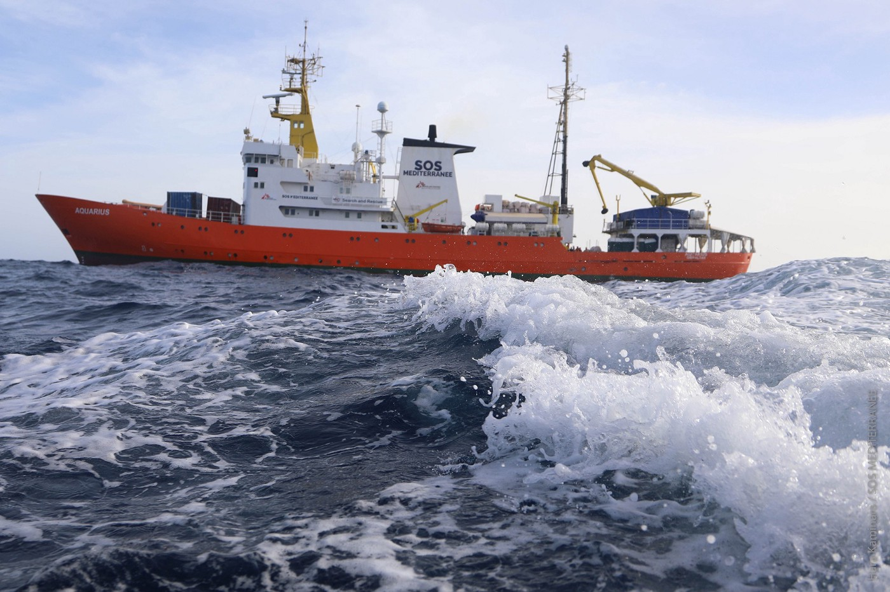
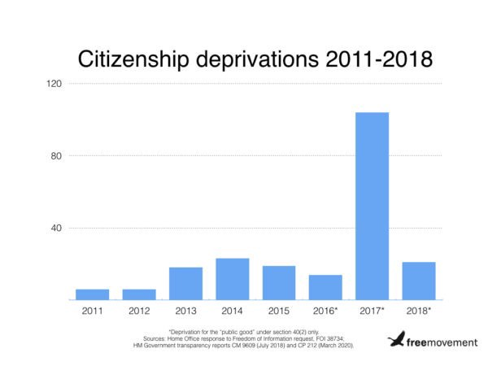

### AYS Daily Digest 26/02/2021 — Woman Charged With Arson For Setting Herself on Fire in Lesvos
### Shamima Begum’s appeal to return to UK denied//Children play “The Game” on the Balkan Route//More rescues, pullbacks to Libya//& more

[Are You Syrious?](?source=post_page-----792d4adaa039--------------------------------)

[Feb 27](ays-daily-digest-26-02-2021-woman-charged-with-arson-for-setting-herself-on-fire-in-lesvos-792d4adaa039?source=post_page-----792d4adaa039--------------------------------) · 8 min read

### FEATURE
### Woman charged with arson for attempting self\-immolation

Jan Palach\. Mohamed Bouazizi\. For a long time, self\-immolation has been the last resort of desperate people, a form of protest against unjust conditions\. On Sunday, a young Afghan mother attempted suicide by setting herself on fire\. Instead of getting the help that she needs after so much trauma, she is being [charged with arson](https://stonisi.gr/post/15238/gia-emprhsmo-apo-prothesh-afganh-enwpion-toy-eisaggelea?fbclid=IwAR2EtDSvuCMpFvUbnOAuDe1ZaRDmvO5mfwd1HO4CoY3OdNU-hL0wVNcCSsY) by the Greek government and could face up to ten years in prison\.

The heavily pregnant woman did this after finding out that her family’s relocation to Germany would be delayed, even after they had gone through the gruelling approval process\. She reportedly told the family’s lawyer that she [could not bear to bring another child](https://www.spiegel.de/politik/ausland/griechische-staatsanwaltschaft-will-gefluechtete-wegen-brandstiftung-belangen-a-c05f96d8-cebc-4d7b-8b61-1f7464cb843c) into the horrendous living conditions that her family was experiencing in Moria 2\.0\.

She now cannot leave the country until her trial and could potentially lose her refugee status\. However, her lawyers are hoping that the case will be dismissed because the government [cannot legally punish people](https://twitter.com/g_christides/status/1365393380591742979) for self\-harm or for accidentally damaging property\. The fire did not cause extensive damage and was put out quickly\. Although the woman is being charged with property damage, who has caused more damage — her or the Greek government which is housing people in conditions where their tents flood regularly or fires occur because of dangerous electrical wiring?

Instead of starting a new life in Germany or recovering from her attempt away from the hell that is Moria 2\.0, the woman is facing legal charges\. She had to testify to the prosecutor [from her hospital bed](https://www.theguardian.com/world/2021/feb/26/woman-who-set-herself-on-fire-in-lesbos-refugee-camp-may-face-arson-charges) , despite her pain\. Although she is [no longer under arrest](https://twitter.com/f_grillmeier/status/1365414586808156160) in the hospital, she has to face the uncertainty of legal proceedings in a country with a history of [unfairly prosecuting people on the move](https://twitter.com/maledictus/status/1365023315170099202) for harm that was done to them\.
### LIBYA
### Deadly journeys within Libya

InfoMigrants obtained an exclusive look into how people on the move journey through Libya, and how the smuggling networks that often exploit them operate\. They shared awful details of people being literally auctioned off, their belongings stolen, and kept in awful living conditions\.

You can read part one of the report [here](https://www.infomigrants.net/en/post/30438/exclusive-smuggling-network-source-reveals-harrowing-details-of-migrants-death-journey-inside-libya-1-2?fbclid=IwAR3PyrGOyEWT4QVKLLflLIKka7ludmst1zX-yjniaTLrBqcQqR51ulQNO58) and part two [here](https://www.infomigrants.net/en/post/30445/exclusive-smuggling-network-source-reveals-harrowing-details-of-migrants-death-journey-inside-libya-2-2?fbclid=IwAR2sHo0H6jmzxi8SMaDV5t-tzuXpWnqEo0NliLYfiaLxk5xCXHAlrlArMhg) \.
### SEA
### More rescues, pullbacks to Libya

Shortly after its return to duties, the SeaWatch3 was able to [rescue 45 people in distress](https://twitter.com/Seebruecke_intl/status/1365337971612868608?fbclid=IwAR3qZfbtOPmVsgkYCBaHKQGimHRzG2xaBf33HSSqFTVfr0BJxN87QLYw8_0) in the central Mediterranean, thanks in part to the [coordination efforts of AlarmPhone](https://twitter.com/seawatchcrew/status/1365257515886338050?fbclid=IwAR0gz8Qi2fisjB8IpZE0odM0Nn1SuyO6Q4mPZ-8aNdWp_Z-G5llvI8QjTBw) \.

AlarmPhone also made contact with [a boat carrying 150 people](https://twitter.com/alarm_phone/status/1365225900015509504) in distress off the Libyan coast\. Unfortunately, they lost contact with the people on board\.

A group of [151 people](https://twitter.com/msehlisafa/status/1365399253787545604?fbclid=IwAR2SdgW3xdLUREHDIncTc7yuAZ5atx5nlGy_IYlELRgsfcY5N6-zfDKeC1M) were pulled back to Libya \(it is unclear if this is the same group that contacted AlarmPhone\) \. Fewer people are able to reach Europe because they are intercepted by the so\-called Libyan Coast Guard\. InfoMigrants [published a summary](https://www.infomigrants.net/en/post/30504/eluding-libya-s-coast-guard-fewer-migrants-make-it-to-europe-on-central-mediterranean?fbclid=IwAR0_eZziv2tHkd4klFwbmOglkQwsws8B2QAUpNAws8xeUYyqqPFaDJVJ7Hc) of the danger and torture that people on the move are subjected to by the Libyan Coast Guard and other authorities\.
### GREECE
### Updates from Greece

_Lesvos:_

No Border Kitchen Lesvos has published a summary of the past week on Lesvos, which included two fires and plans to build a closed structure on the island, including an insight into who will be compensated for that structure\. You can read their full statement [here](https://www.facebook.com/NBKLesvos/posts/1988493197957126) \.

The latest population numbers from Lesvos say that [9,387 people on the move](https://twitter.com/f_grillmeier/status/1365321871617589250?fbclid=IwAR0gz8Qi2fisjB8IpZE0odM0Nn1SuyO6Q4mPZ-8aNdWp_Z-G5llvI8QjTBw) live on the island, 6,972 of them in the temporary camp commonly called Moria 2\.0\.

_Evros:_

The securitization of the Evros border continues\. [Eleven cameras](https://twitter.com/f_grillmeier/status/1365220960643780608?fbclid=IwAR1ctQaVcnkGp_mwNtla4F5u6wzG6uWncClSZ70-c318sNdIj87-BBGnRos) and long\-range radars have been installed\.

_General:_

Solomon magazine interviewed Chrysovalantis Papathanassiou, the former president of the National Center for Social Solidarity who resigned eight months ago\. In the interview, he discussed the institutional failures, especially when it comes to looking after unaccompanied minors\. He criticized the use of unaccompanied minors as “a means of political development,” the failures to protect children from abuse, and other governmental neglect\. The article can be accessed [here](https://wearesolomon.com/mag/synenteyxeis/cr-papathanasiou-oi-asynodeytoi-anhlikoi-den-einai-eksagogimo-proion/?lang=el&fbclid=IwAR08imdvfitvlKRBSr53uQoKFVJh9l5EizlFWP2j5PDiKbOycOXbuCjf_sU) \.

Sometimes, double standards are hypervisible:
### BOSNIA & HERZEGOVINA
### Children caught in “The Game”

Countless children have fallen victim to the violence at the EU border, watching their parents brutalized by Croatian police or experiencing their violence on their own fragile bodies\. The Danish Refugee Council recorded [800 incidents](https://www.spiegel.de/international/world/illegal-pushbacks-children-caught-in-the-game-on-the-croatian-border-a-9f55bb77-2402-42ca-808d-c258a3bdb809?fbclid=IwAR2068YmwXkVpuToC2NxZaqAtjm-3AvQDeYVGe9d1MSYI89WMldxd0eOF3I#ref=rss) of pushbacks involving children in 2020\.

Instead of playing cops and robbers, children now play at fleeing from border guards\.
### SPAIN
### One in five children on the move is undocumented

[About 147,000 minors](https://www.infomigrants.net/en/post/30522/in-spain-one-minor-migrant-in-five-is-undocumented?fbclid=IwAR2EtDSvuCMpFvUbnOAuDe1ZaRDmvO5mfwd1HO4CoY3OdNU-hL0wVNcCSsY) in Spain, or one fifth of all children on the move, are undocumented, according to a report by Save the Children and Por Causa Foundation\. This rate has grown steadily over the past few years, meaning that thousands of children are trapped in legal limbo\. The report calls for their situation to be regularized immediately\.

El Pais [published an op\-ed](https://elpais.com/opinion/2021-02-24/trasladar-a-los-migrantes-de-canarias-a-la-peninsula.html?ssm=TW_CC&fbclid=IwAR3C7G3rR_PO3v68TGW_df8mRincH1GsRyhw-rAcBrlj4oxUTeFIQ9pZJb4) calling for the government to transfer people on the move from the Canary Islands to the mainland\. “The Canary Islands are not a jail for people on the move,” the paper said\. The op\-ed pointed out the Spanish government’s hypocrisy in criticizing the EU’s unequal distribution of responsibility for hosting people on the move among member states, while it is doing the same to one of its regions\.
### FRANCE
### More rights violations in Calais, Grand\-Synthe

The French national police [expelled 126 people](https://twitter.com/HumanRightsObs/status/1365220668162383875?fbclid=IwAR2068YmwXkVpuToC2NxZaqAtjm-3AvQDeYVGe9d1MSYI89WMldxd0eOF3I) from Calais, which they very proudly published on their Twitter account\. The people were forced onto a bus and not told where they were going\. Most have already returned to Calais\.

In Grand\-Synthe, there was an eviction this morning as well\. The police brought in construction machinery to destroy people’s belongings\.
### AUSTRIA
### Asylum applications increase

Even though overall asylum applications in the EU have decreased, in Austria [they have gone up by 10%\.](https://www.infomigrants.net/en/post/30525/number-of-asylum-applications-in-austria-on-the-rise?fbclid=IwAR3Xm4XM4v70q7MAoEOZLCfUCy6coHE29gNrKUHAWI1PJI-EwPvkz9kkYr0) The interior minister said that in response, the Austrian government will increase the speed of asylum processing, even though speed doesn’t usually correlate with correct decisions\.

> _In an earlier test phase of the scheme launch last year, some 400 applications were rejected within just 72 hours\._ 

### UK
### Shamima Begum denied right to return to UK for court

The UK Supreme Court ruled that Shamima Begum [cannot return to the UK](https://www.freemovement.org.uk/shamima-begum-loses-case-in-supreme-court/?fbclid=IwAR0o-cHCH1XaU1doqBZ_dWrW87bzCzgGO_KkCrlG7xPpZvogaUcCXqFvbQw) in order to appeal the deprivation of her citizenship\. The Court argued that her return would endanger national security, even though [hundreds of others](https://twitter.com/libertyhq/status/1365246523534172161) have returned from Syria without any fallout\. Although her citizenship appeal case is upcoming, this is a bad sign for the success of her appeal, as her inability to physically attend her own citizenship trial prevents her from arguing her case\.

To be clear, what Begum did was a crime\. However, she was only 15 years old when she was groomed and manipulated into marrying a man much older than her and joining ISIS\. Her case also sets a troubling precedent for British people who have dual citizenship\. The Home Office argued that they could strip the UK\-born Begum of her citizenship because she has Bangladeshi citizenship\. However, they would never strip citizenship from a \(white\) British person with only a UK passport\. This means that her punishment is far more severe than a punishment that a person with only UK citizenship would receive for committing the same crime\.

An investigation by Free Movement found that the UK has drastically increased citizenship removal procedures since 2010\.

Many homeless people on the move have been voluntarily repatriated from Northern Ireland since the beginning of the pandemic; however, advocates are questioning [exactly how voluntary](https://www.thedetail.tv/articles/concerns-over-voluntary-repatriation-of-homeless-migrants-during-covid-19?fbclid=IwAR1CIoh30e0zO_lr88a53VUpfxoe6O-8UBQORl6erYjauqIppBN2SlwkcFE) those repatriations were\. Most people who return are either misled by officials about the support they have available to them or threatened with deportation if they do not comply\. Many EU nationals who are particularly vulnerable are not aware that they are eligible for the government’s Settlement Schemes\.
### IRELAND
### Department of Justice makes it easier to regularize status

As part of a series of legal reforms, the Irish Department of Justice is implementing [proposals to regularize status](https://www.irishtimes.com/news/crime-and-law/major-justice-reforms-to-cut-legal-costs-and-regularise-status-of-undocumented-migrants-1.4491742?fbclid=IwAR2mjanKFK3IYct-eNift5iiB8UVZ07bGFaSCIa9-aDjQS2aldisCsrSCbM) for people on the move who have been undocumented long\-term by the end of 2021\. They also plan to cut the waiting time for people before they can access the labour market and to clear a backlog of citizenship cases\.
### EU/FRONTEX
### Frontex looks to expand its powers

Even though the agency is under fire for its corruption and violation of human rights, it is looking to expand its scope of operations\. EU member states are looking to increase Frontex’s [assistance in deporting unaccompanied children](https://www.statewatch.org/news/2021/february/eu-states-keen-for-frontex-assistance-in-deporting-unaccompanied-children/?fbclid=IwAR2QvQM1JccJshatTioDj91sdbBfqG_1IDnzLmneIShrLDDvleCpAfQtFcQ) , even though current rules prevent the EU’s border agency from physically participating in deportations\.

Frontex’s increased involvement in deportations of minors would also involve increasing the agency’s presence in non\-EU member states\. Frontex already has a significant presence in much of the Balkans, where its guards often patrol borders alongside national policemen\. [This article](https://kosovotwopointzero.com/en/the-fortified-gates-of-the-balkans/?fbclid=IwAR1XIdATTfZZyVVAM7a3f58Bg0opnzuyRqTEj0aSC3aacYpTwDo4JXjz0Tw) summarizes the complicated relationship between Frontex and non\-EU member states in the Balkans\.

Frontex is also looking to increase its arms supplies, even though its rules explicitly prevent the agency from buying firearms\. To get around this, Leggeri announced that he will simply reclassify weapons as “ [technical equipment](https://www.spiegel.de/politik/ausland/frontex-fabrice-leggeri-will-mit-trick-waffen-fuer-die-grenzschutzbehoerde-beschaffen-a-7437577c-0002-0001-0000-000175912886?utm_source=dlvr.it&utm_medium=[facebook]&utm_campaign=[spontop]&fbclid=IwAR3PyrGOyEWT4QVKLLflLIKka7ludmst1zX-yjniaTLrBqcQqR51ulQNO58#ref=rss) ,” which Frontex is allowed to purchase\. He is also circumventing Polish law about the purchase of weapons, citing that the agency, as an EU agency, is above Polish law\. The EU Commission has agreed with Leggeri’s interpretation despite protests from MEPs\.

If Frontex can so easily and publicly get around regulations about their weapons purchases, what else are they doing that is not under as much scrutiny?
### Worth Reading:

Le Monde [published a feature](https://www.lemonde.fr/international/article/2021/02/26/a-samos-la-galere-sans-fin-des-refugies-bloques-aux-portes-de-l-europe_6071242_3210.html?fbclid=IwAR2068YmwXkVpuToC2NxZaqAtjm-3AvQDeYVGe9d1MSYI89WMldxd0eOF3I) on the situation on Samos \(article is behind a paywall\) \.

[This article](https://guitinews.fr/cest-leur-histoire/2021/02/24/24-heures-avec-amadou-le-quotidien-dun-enfant-a-la-rue/?fbclid=IwAR2V0zpmo2HAVLiEtSZELp-IpzhXTcYBGoGhuUq2D16BBkh7v8Fsn1rTMDo) follows an unaccompanied minor, Amadou, for 24 hours of his life sleeping rough on the streets of Paris\.

The ELENA Weekly Legal Update is available [here](https://mailchi.mp/ecre/elena-weekly-legal-update-26-february-2021?fbclid=IwAR3C7G3rR_PO3v68TGW_df8mRincH1GsRyhw-rAcBrlj4oxUTeFIQ9pZJb4) \.
### Worth Listening to:

[This podcast](https://www.freemovement.org.uk/podcast-the-new-look-general-grounds-for-refusal/?fbclid=IwAR2NkzBL47ylJT17-nwB-8iLbn7lT_RGRdbBQ8PLmATLhB5ckbARiJEQDQU) from Free Movement talks about the “general grounds for refusal” of entry or stay in the UK\.

[This podcast](https://open.spotify.com/episode/4nDK4BllUC4b5Kxiif9eMr?si=LFoaTLVJQbuXNE4TE2z0kg&fbclid=IwAR1XIdATTfZZyVVAM7a3f58Bg0opnzuyRqTEj0aSC3aacYpTwDo4JXjz0Tw&nd=1') interviews Joise Naughton, the co\-founder of Choose Love\.
### Worth Attending

This Monday, the British School in Athens is hosting a research webinar on the securitization of migration in Greece\. More details [here](https://www.bsa.ac.uk/events/foteini-kalatzi-a-bare-life-in-the-borderlines-of-the-mediterranean/?fbclid=IwAR1Q2RHs_3KSgki-ueACqrvL95JiWYaVEl9dEPUY7C-4j5cyuHuRzRYDDGc) \.

**Find daily updates and special reports on our [Medium page](https://medium.com/are-you-syrious) \.**

**If you wish to contribute, either by writing a report or a story, or by joining the info gathering team, please let us know\.**

**We strive to echo correct news from the ground through collaboration and fairness\. Every effort has been made to credit organisations and individuals with regard to the supply of information, video, and photo material \(in cases where the source wanted to be accredited\) \. Please notify us regarding corrections\.**

**If there’s anything you want to share or comment, contact us through Facebook, Twitter or write to: areyousyrious@gmail\.com**

_Converted [Medium Post](https://medium.com/are-you-syrious/ays-daily-digest-26-02-2021-woman-charged-with-arson-for-setting-herself-on-fire-in-lesvos-7a5b71a769ca) by [ZMediumToMarkdown](https://github.com/ZhgChgLi/ZMediumToMarkdown)._
