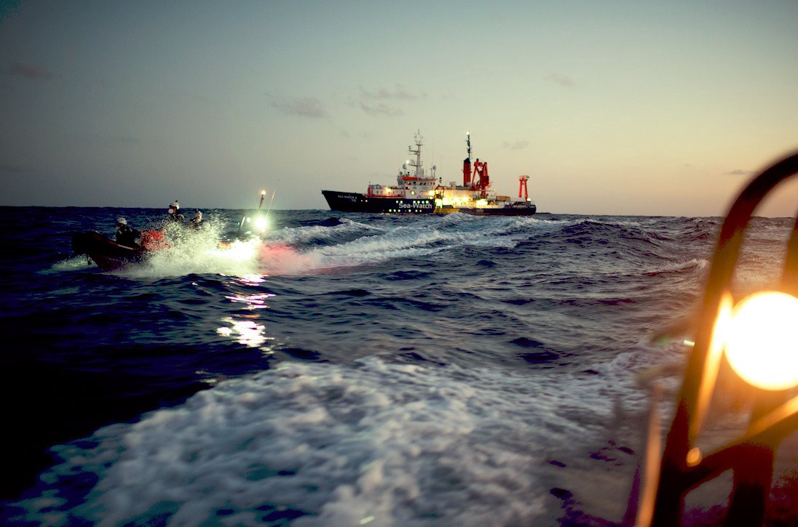
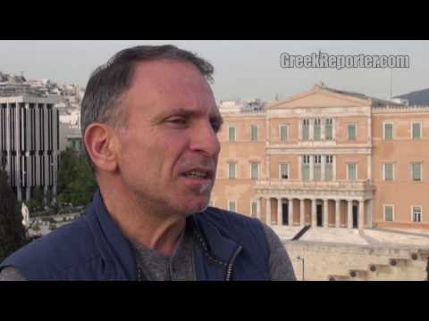

### AYS Daily Digest 02/03/2021: Sea Watch 4 released from blockade and safe port found for Sea Watch 3
#### Safe port for 363 survivors on Sea Watch 3 // Sea Watch 4 will finally be back in the Mediterranean // New research shows Afghanistan is not safe for returnees // Libya: main suspects of killing of 30 people arrested // Hungary: ECtHR says Transit zones were unlawful detention // Italy: Updates from Mediterranea — Mare Jonio // & much more …

Copyright: MSF Sea
### Good News\! Safe port found for Sea Watch 3 and end of blockade for Sea Watch 4

Sea\-Watch 4 is freed again after six months and Sea\-Watch 3 found a safe port for 363 rescued people onboard\. There hasn’t been much good news recently, so let’s celebrate the ones we have: the Sea\-Watch 4 ship is finally free, after being arbitrary blocked from leaving port for six months\.

■■■■■■■■■■■■■■ 
> **[Sea-Watch International](https://twitter.com/seawatch_intl) @ Twitter Says:** 

> > 🔴 The #SeaWatch4 free!
Today, the administrative court of Palermo preliminary suspended the detention of the Sea-Watch 4. After an arbitrary blockade of 6 months, the ship is finally free and can soon return to the Central Mediterranean - to rescue those the #EU would let drown. https://t.co/pFkN1ni4Oy 

> **Tweeted at [2021-03-02 15:34:49](https://twitter.com/seawatch_intl/status/1366773998806323203).** 

■■■■■■■■■■■■■■ 

On Tuesday 2nd March, the Administrative Court of Palermo preliminary suspended the detention of the Sea\-Watch 4\. The ship had been blocked from leaving port since 29th September 2020\. Italian authorities blocked the ship on flimsy grounds, for example by claiming the ship had too many life jackets on board\. However the ship’s flag state Germany repeatedly confirmed to Sea\-Watch that the Sea\-Watch 4 met all safety requirements\. The case behind the blockade is more complicated\. Italy repeatedly puts ships under administrative detention, by applying the European Directive on Port State Control \(2009/16/EC \) to humanitarian vessels\. Sea Watch challenged the application of the directive as not being in line with European and international law\. On 23rd December 2020, the Administrative Court of Palermo referred the case to the Court of Justice of the European Union, asking for clarification on the legal interpretation\. With today’s ruling, the Administrative Court granted the NGO’s request to suspend the blockade pending the CJEU’s decision\.

The Sea\-Watch 4 only started operating in August 2020, one month before being detained\. The ship was financed by a broad alliance of civilian actors, among them the German protestant church\. Médecins Sans Frontières \(MSF\) ran the medical emergency clinic on board\. This joint operation between MSF and Sea\-Watch 4 officially ended yesterday\.

■■■■■■■■■■■■■■ 
> **[MSF Sea](https://twitter.com/MSF_Sea) @ Twitter Says:** 

> > Today marks the official end of a meaningful #[MSF](https://twitter.com/MSF) project on board the #SeaWatch4. @[MSF](https://twitter.com/MSF) joined forces with @[seawatch_intl](https://twitter.com/seawatch_intl) last year, against the backdrop of the #COVID19 pandemic, to urgently fill the gap left by European states in the central #Mediterranean. https://t.co/A1Skks6gCZ 

> **Tweeted at [2021-02-28 14:18:32](https://twitter.com/msf_sea/status/1366030026077065220).** 

■■■■■■■■■■■■■■ 

Meanwhile the Sea\-Watch 3 was assigned a safe port for the 363 people on board\!

On Wednesday morning, 3rd March, it was announced that the ship is sailing towards Augusta in order to let the passengers go ashore\. They had been rescued over the weekend in five different operations\.

■■■■■■■■■■■■■■ 
> **[Sea-Watch International](https://twitter.com/seawatch_intl) @ Twitter Says:** 

> > 🔴 #SeaWatch3 is heading towards Augusta, Sicily, where we will arrive in the afternoon.

After all they have been through, the 363 rescued people onboard our ship will finally be able to disembark in a port of safety, assigned by Italian authorities. 

> **Tweeted at [2021-03-03 08:29:43](https://twitter.com/seawatch_intl/status/1367029406267498496).** 

■■■■■■■■■■■■■■ 

### AFGHANISTAN
#### New research on situation of returnees and deportees to Afghanistan

Ali Ahmad, PhD candidate at Department for Migration and Globalisation at the Danube University Krems, [conducted a research project about the situation of those deported from Austria to Afghanistan and has interviewed 16 Afghans recently deported from Austria\.](https://amasosite.wordpress.com/)

According to his findings, **Afghanistan is not a safe country for returnees\.**

_“The Afghan government has failed to protect its citizen throughout the years, and it continues to be unable to provide protection to returnees from Europe\. The Taliban control more territory in Afghanistan than any time since they were ousted from power in 2001\. Consequently, no place in Afghanistan is safe for returnees, and Austria should immediately halt the deportation of_ 
_Afghans to Afghanistan, irrespective of the JWF agreement\.”_

He further states that asylum seekers should be granted access to the Austrian labour market in order to improve their skills and therefore their chances of finding employment upon being deported to Afghanistan\.

_“Granting asylum seekers access to the labor market, educational system and socio\-political life in Austria would allow Afghan returnees to utilize their skills and experience in Afghanistan\. It would also minimize the economic and psycho\-social pressure on returnees\._ “

His third recommendation focuses on a support package provided by the Austrian State for deportees\. Austria is one of the few European countries that has no support package for those who are deported forcefully to Afghanistan\.

_“A reintegration support system needs to be developed to assist all types of returnees to reintegrate into the Afghan labor market, thereby minimizing the chances of re\-migration\. This is the job for, not only the Afghan government, but also the deporting country — such as Austria, — with the assistance of international institutions and local organizations, together with the Afghan diaspora organizations in Austria\._ “
### LIYBA
#### Main suspect of massacre arrested

[In Libya, one of the main suspects of the killing of 30 people on the move in May 2020 has been arrested on Monday\.](https://www.infomigrants.net/en/post/30578/libya-man-arrested-over-murder-of-bangladeshi-migrants?fbclid=IwAR0y132qIbX9qUUIaMId_HSrz9enFd4NOEJYYRjUf86VpFWxsI4-1LAgqCw) The Libyan Minister for the Interior of the Government of National Accord \(GNA\), Fathi Bashagha, stated on Twitter that the accused would be referred to the Public Prosecution Office\.

■■■■■■■■■■■■■■ 
> **[فتحي باشاغا Fathi Bashagha](https://twitter.com/fathi_bashagha) @ Twitter Says:** 

> > A major victory was achieved by Garyan  Security Directorate. Where they arrested main suspect in the killing of a number of migrants in mizda cty 1/3 

> **Tweeted at [2021-03-02 11:25:25](https://twitter.com/fathi_bashagha/status/1366711236252078080).** 

■■■■■■■■■■■■■■ 

[In the massacre in May 2020](https://www.infomigrants.net/en/post/25073/trafficker-family-kills-30-migrants-in-alleged-revenge-attack-in-libya) , 26 Bangladeshi nationals and 4 people from African countries where executed in the city of Mezdah, allegedly in an act of revenge by the family of a human trafficker who has been killed before\.

InfoMigrants states that according to IOM in 2020, there were 21,000 people of Bangladeshi origin in Libya\.
#### Continuing EU Support for Libyan so\-called coast guards?

Meanwhile [, as Statewatch reports,](https://www.statewatch.org/news/2021/march/libya-interceptions-of-people-fleeing-by-sea-increase-as-eu-border-mission-seeks-two-year-extension/?fbclid=IwAR1HafpwhmXIZb9CUU7Y0w8-lqMROajo_GM1ZJqJJvwyj-lqdPVOFBdYyoo) the EU Border Assistance Mission in Libya \(EUBAM Libya\) wants to continue its support for the Libyan coast guard agencies\.

“ _One aspect of the mission’s work has been to increase the capabilities of Libya’s two coast guard bodies, the Libyan Coastguard & Navy \(under the defence ministry\) and the General Administration for Coastal Security \(GACS, under the interior ministry\) \._ ”

If approved by the Council of Europe, the support could be extended for a two\-year period, which would have an estimated price tag of 67–70 million euros\.
### GREECE
#### Woman that set herself on fire one week ago has given birth to her child

According to the journalist Franziska Grillmeier, the woman who set herself on fire in Moria 2\.0 on 21st February and was later been charged with arson by Greek authorities, gave birth to her child on Tuesday 2nd March in Mytilini hospital\. This is the fourth child for the 26\-year\-old woman\. 
The woman set herself and her tent on fire after learning that she was not allowed to travel to Germany due to her late stage of pregnancy\. She had received asylum status and was scheduled for transfer\. [According to The Guardian,](https://www.theguardian.com/world/2021/feb/26/woman-who-set-herself-on-fire-in-lesbos-refugee-camp-may-face-arson-charges) the woman is now charged with arson and destruction of public property\. She will have to face trial and won’t be able to leave Greece\. This system is made to break people\.

■■■■■■■■■■■■■■ 
> **[Franziska Grillmeier](https://twitter.com/f_grillmeier) @ Twitter Says:** 

> > Heute hat die 26-jährige Frau im Krankenhaus von Mytilini ihr Kind zur Welt gebracht. Sie bleibt vorerst noch im Krankenhaus, bevor sie wieder nach #Moria2 transferiert wird. 

> **Tweeted at [2021-03-02 12:43:36](https://twitter.com/f_grillmeier/status/1366730910977114112).** 

■■■■■■■■■■■■■■ 

#### Transition of ESTIA Program

UNHCR Greece announced the extension of the technical assistance programme with the Greek Ministry of Migration & Asylum for the transition of ESTIA accommodation and cash aid\. Meanwhile, many hotels and accommodation sites that have been part of ESTIA program have been shut down and former residents have nowhere to go\. In Sparta, 45 people, among them children and babies, are left on the street\. [The video in this article](https://www.notospress.gr/peloponnisos/story/61457/sto-dromo-oikogeneies-prosfygon-klaine-kai-parakaloyn-gia-ligi-akoma-anthropia?fbclid=IwAR17V9VHKKjvXTt3Bc-NKDkFip2nfZ6AuMBHiwM90hZC_aBfGmS-fmMtaLk) of people crying and not knowing where to go was included in yesterday’s digest, we decided to include it again due to the urgent and shocking nature of the story\.
#### Protests in Ritsona camp: “Would you stay silent?”

In Ritsona refugee camp, residents have been protesting for an end to the uncertainty they live in, for better living conditions and papers\. 
A leading voice of the protest is Parwana Amiri, a young woman from Afghanistan who has touched many people [with her clear and moving poetry and literature on live in Moria and the mainland camps](http://birdsofimmigrants.jogspace.net/) \.

■■■■■■■■■■■■■■ 
> **[Parwana Amiri پروانه اميري](https://twitter.com/parwana_amiri) @ Twitter Says:** 

> > Second day of protest in #ritsonacamp but no attention from state and authorities,we are totally invisible in this restricted area. 
But we will continue our #campstrike unless we get an answer and today we are again here.
I faced violence of speech from police!
#LeaveNoOneBehind https://t.co/7Bg5s5C81c 

> **Tweeted at [2021-03-03 06:25:30](https://twitter.com/parwana_amiri/status/1366998146925146112).** 

■■■■■■■■■■■■■■ 

#### Remembering the photographer Yannis Behrakis

Two years ago today, the Reuter’s photojournalist Yannis Behrakis died after a long battle with cancer\. He took many of the most touching and humane pictures of people arriving by boat on the Aegean Islands or struggling to make their way to central Europe\. In 2016 he won the Pulitzer Prize for Breaking News Photography\. In this video below he speaks in moving words about his profession, about the ethical aspects of it and about what years of documenting pain and fear means to him\.

### HUNGARY
#### European Court of Human Rights finally ruled that placement in the Hungarian transit zones qualifies as unlawful detention

The ECtHR court’s ruling was issued in the case of an Iranian\-Afghan family, who were placed in detention in the transit zones in 2017 for the whole duration of their asylum process\. The couple had three children and the mother was pregnant at the time\. The father was denied food for months, until interim measures were instructed by the court, following the request by the family and the Hungarian Helsinki Committee\.

From [HHC’s press release](https://www.helsinki.hu/en/the-european-court-of-human-rights-rules-that-placement-in-the-transit-zones-following-the-legal-changes-of-2017-qualify-as-unlawful-detention/) :

> “The transit zones were closed in May 2020, following the judgment of the Court of Justice of the European Union \(CJEU\) that qualified placement in the transit zone as detention\. That judgment fit into the broad professional consensus among key human right bodies, all finding that placement in the two land border transit zones in Hungary constituted deprivation of liberty\. The ECtHR today finally joined this international consensus\.“ 

[In November 2019, the ECtHR came to a contradicting and highly controversial conclusion in a similar case](https://www.helsinki.hu/en/ilias-ahmed-ecthr-grand-chamber-ruling/) , in which it ruled that detention does not constitute a deprivation of liberty within the meaning of the Convention\.

With Tuesday’s judgement, the court ruled that the family had been held in unlawful detention \(Art\. 5\), their treatment amounted to inhuman and degrading treatment \(Art\. 3\) and they had no access to an effective remedy \(Art\. 13\) \.
### ITALY
#### Accusations against Mediterranea

While we celebrated the end of the blockade of Sea\-Watch 4 in the feature of today’s DD, another NGO is once again facing attacks by Italian authorities \(also see yesterday’s DD\) \.

The NGO Mediterranea Saving Humans \(Mare Jonio ship\) is under investigation by the Ragusa public prosecutor’s office\. [According to Statewatch,](https://www.statewatch.org/news/2021/march/italy-police-operation-against-life-saving-civil-society-organisation/?fbclid=IwAR0aciruqadOhyId0TtTx_A8VxPIh064Bg-V2fA8EQrbJunQ_Xvpd7DpGbo) the operation concerns the offences of aiding and abetting illegal immigration and violating the maritime navigation code\. Search warrants involving dozens of agents throughout Italy have been carried out in homes, in social centers, and on the ship, Mare Jonio\.

The charges are connected to the events of August 2020, when the Mare Jonio took on 27 people who had been rescued by Maersk ship Etienne, sailing under the Danish flag\. Although the rescue operation took place within the Maltese SAR\-zone, Malta denied the disembarkation of the people\. The ship waited in international waters off the coast for five weeks, before Mare Jonio took the rescued people over and brought them to Pozzallo, Sicily\. The captain of the Etienne warned several times that his ship and crew were not equipped to ensure the physical and mental wellbeing of the rescued, some of whom were mistreated in Libya’s migrant detention camps\. He then sent an urgent request for assistance to Mare Jonio, after one of the rescued people attempted to take his life by jumping overboard\.

The Ragusa prosecutor’s office now claims that “an agreement of a commercial nature between the companies that owned the two ships” was made, and that Medierranea took money from Maersk for taking over the rescued people\.

Mediterranea [explains that these charges are “founded on speculation that will melt like snow in the sun”\.](https://mediterranearescue.org/en/news-en/press-release-monday-march-1-2021/)

They further state:

> “Idra social shipping \(partner of Mediterranea\) has never been involved in anything illegal and will prove this in the appropriate venue\. And, Mediterranea will not stop because of this sad and predictable attack\. Mediterranea will continue to be at sea\- there where crimes of slaughter, torture, rape and persecution are carried out\.” 

Italian authorities try hard to discredit civil rescue operations and solidarity\.

For more, also see here:

#### Italian court: children increase vulnerability

[InfoMigrants reported](https://www.infomigrants.net/en/post/30577/italian-court-rules-migrant-with-children-must-be-given-protection?fbclid=IwAR2FRw-KlHi8TUgtjPf3cUbVA-y8lHQFEuldHV2mH4kGjNY4K_sOYEW23ZI) about the judgement of Italy’s highest appeals court that was issued on Friday 26th February\.

> “The Court of Cassation ruled in favor of a Libyan mother of twins, who were born in the northern Italian city of Brescia in January 2017 after the mother's arrival in Italy\. Children are a factor that heightens the "vulnerability" of refugees which the interior ministry and judges cannot ignore, the court said\. The interior ministry had denied protection to the mother, and a court in Brescia had also ruled that the woman "did not have specific personal and family problems\."The Court of Cassation ruled that the two children were "one of the personal and family issues that the judge should have considered\." 

### SPAIN
#### Spain violated the right of a minor, UN Committee on the Rights of the Child says

[According to InfoMigrants,](https://www.infomigrants.net/en/post/30582/un-spain-forced-migrant-to-undress-violating-her-rights?fbclid=IwAR07s3AkcbnY3XZ9ZLS__rlrplrTrUGxx3Jw_MvwuGPmzC115kkeqIUAtTg) “the UN Committee on the Rights of the Child considers Spain responsible for violating the rights of a migrant minor who was forced to undress and undergo invasive medical examinations to determine her age\.”
#### Man found dead in Gran Canaria

One man has been found dead in Gran Canaria\. He had been sleeping on the streets\. [According to local media](https://www.canarias7.es/sucesos/hallan-cadaver-calle-20210302122724-nt.html) , “He is an undocumented man, of foreign origin, who could have some signs of violence, although it has not been confirmed that they are related to his death\.”

The cause of death is being investigated\.
### FRANCE
#### Evictions in Calais continue throughout the winter

According to the NGO Human Rights Observers, six informal camps have been evicted by the police\. 12 unaccompanied minors were escorted out of their meagre shelter, without any decent solution\. 26 tents, 11 tarpaulins and 8 blankets were seized\.

■■■■■■■■■■■■■■ 
> **[Human Rights Observers](https://twitter.com/HumanRightsObs) @ Twitter Says:** 

> > Ce matin à #Calais 6 lieux de vie informels ont été expulsés par les forces de l'ordre. 
• 12 #mineurs isolés ont été escortés en dehors de leur maigre lieu de vie, sans aucune solution digne.
• 26 tentes, 11 bâches et 8 couvertures ont été saisies. https://t.co/T6FWRSRogy 

> **Tweeted at [2021-03-02 22:00:01](https://twitter.com/humanrightsobs/status/1366870937182822408).** 

■■■■■■■■■■■■■■ 

#### Young man fighting against paperless procedure for residence permit

[InfoMigrants features the story of Haroune Khelifati,](https://www.infomigrants.net/en/post/30512/french-administration-makes-me-feel-like-a-criminal?fbclid=IwAR0NduAOiz8h_Y0l2ijmiB_K7sswXpaOcfVjawY2yv0E1l_vNy2QvrjUdxc) a young man who has been living in France for three years and who is now fighting to get his papers renewed\.

> “Since the beginning of my process, I’ve been​ going in person to get things moving\. Now that everything has to be done on the internet, I no longer get any answers\. The procedure​ has become ​even more inhuman, you can’t plead your case or explain your situation\. It’s as if our files get lost on the web and we don’t stand a chance,” he says\.” 

### GERMANY
#### Almost five racist attacks on refugees each day in Germany in 2020

According to an [informational request of the German Left party,](https://www.ulla-jelpke.de/wp-content/uploads/2021/03/KA-19_26641-%C3%9Cbergriffe-Fl%C3%BCchtlingsheime-Q4-2020.pdf) in 2020 1,606 attacks on refugees took place in Germany\. These are only the attacks that have been listed as motivated by extreme right views and that were conducted against refugees\. The numbers of racist and extreme\-right attacks against other people are not included\.
### GENERAL
#### Report on migrant children arriving in Europe

UNHCR, UNICEF and IOM have published a joint overview of the trends of arriving children from January to June 2020\.

Between January and June 2020, **6,177** children arrived in Greece, Italy, Spain, Bulgaria, Cyprus and Malta\. Of these, **2,302** \(37%\) were unaccompanied or separated children \(UASC\) \. Child arrivals in Greece, Italy, Bulgaria and Spain in the first half of 2020 decreased by **32%** compared to the first half in 2019 \( **8,236** \) \.

### WORTH READING
#### UNHCR’s stories from the field: Malta

UNHCR published an interview with a the Head of UNHCR’s Liaison Office to the EASO in Malta, in which she speaks about her work and the situation in Malta:

> “Malta’s reception capacity is overstretched\. It is a very challenging situation and UNHCR keeps calling for greater support from other European States\. There is a need for greater solidarity with frontline States, which receive the majority of arrivals, and at the same for frontline States to improve their reception capacity and conditions, with support made available for this purpose by the European Commission\.” 

#### Will repatriation of foreign children of \(former\) ISIS fighters be conducted in 2021?

There are an estimated 11,000 foreign nationals affiliated with the Islamic State in Iraq and Syria \(ISIS\), still held in displacement camps in northeastern Syria\.

This article provides a good overview of the situation, of the options for foreign ISIS supporters to be tried in Syria, and why foreign states are reluctant to repatriate their nationals\.

#### This article provides background info on the situation in Bosnia and Herzegovina:

### EVENTS

Today, Wednesday 3rd March, Heinrich Böll foundation is hosting an **online discussion on Frontex and Human Rights at the EU Borders**

3 pm CET

On 25 March, the **UK Sisters Not Strangers Coalition is hosting an event to inform about their work, the women behind the coalition and how to join the campaign** \. The Coalition is the first nationwide coalition led by refugee women for refugee women\. They are campaigning against destitution and other hostile asylum and immigration policies\.

**Find daily updates and special reports on our [Medium page](https://medium.com/are-you-syrious) \.**

**If you wish to contribute, either by writing a report or a story, or by joining the info gathering team, please let us know\.**

**We strive to echo correct news from the ground through collaboration and fairness\. Every effort has been made to credit organisations and individuals with regard to the supply of information, video, and photo material \(in cases where the source wanted to be accredited\) \. Please notify us regarding corrections\.**

**If there’s anything you want to share or comment, contact us through Facebook, Twitter or write to: areyousyrious@gmail\.com**

_Converted [Medium Post](https://medium.com/are-you-syrious/ays-daily-digest-02-03-2021-sea-watch-4-released-from-blockade-and-safe-port-found-for-sea-watch-3-454110b89669) by [ZMediumToMarkdown](https://github.com/ZhgChgLi/ZMediumToMarkdown)._
