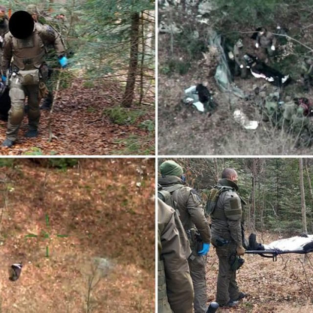
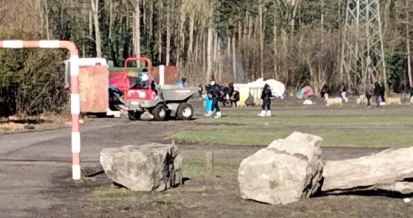

### AYS Daily Digest 5/3/21: Tragic mine explosion kills young man, leaving others severely injured
#### A group of young people on the move walked into a minefield in Croatia, ending tragically / In\-depth investigation into how Italy tried to stop migration from Africa, using EU funds / More families across Greece left unsupported / Recommended reads, calls for action and more

Photos: MUP RH
#### FEATURED
#### Croatia — leftover mines take a toll on the lives of people on the move

A group of young people on the move witnessed a tragedy while passing through the forest area near Saborsko, where they stepped on leftover mines, a permanent danger in the geographical area that used to be the demarcation line during the war in Croatia\. Special police forces \(ATJ Lučko\) reportedly engaged pyrotechnicians to secure a pathway in order to reach the affected people and lead them out of the minefield, as their video documents\. One person died, while another four people sustained injuries, two of whom were admitted to the hospital in Ogulin\. The hospital director confirmed the two men being treated for wounds sustained during the explosion are of Pakistani origin\. Both of them had to undergo surgeries but are reportedly recovering and are no longer in mortal danger, one source says, while another media report states that one person’s life is still in danger\. It is not yet clear how many people were injured in total, although the media reported that 10 people in total were treated for injuries\. It was reported that six people from the group expressed the intention to seek international protection in Croatia, while the others are in medical care facilities\.

The municipal mayor of Saborsko, Marko Bičanić, whose rhetoric seems to differ from the prevailing political speech in Croatia, stated that in spite of the efforts put in to remove the mines in known locations, there are always some remaining in the forest area\. This is the most dangerous area when it comes to mines left there from the war\. Signs warning of the potentially mined areas are placed along the roads, but since most people on the move avoid official roads and footpaths, it is likely they either decided to ignore them, or they never passed by any of the info boards\. He said:

> I am deeply sorry for these people and I hope their problems get solved soon because, as much as people in the area might be complaining they are having it rough with the consequences of the “route” passing by their houses, those people are going through much worse things, and the whole situation is much more difficult for them\. 

On the other hand, the head of the border police Zoran Ničeno said they expect more people to try and cross the green border with warmer weather, mentioning that the first two months of this year saw 28% less “pressure on the borders”\. Whether this means they have been documenting each entry, examining each potential asylum seeker’s situation, or whether it is simply an estimate by the border guards after they perform \(illegal\) collective expulsions, is not clear\. However, as a guest of the main news broadcast on one of the Croatian TV channels, he expressed satisfaction with the interpretation that this means that Hungary and Romania are “facing much more pressure due to crossings from Bosnia and Herzegovina and Serbia by those leaving for the EU”\.

While the Croatian authorities take pride in having traumatized people to the point where they rather choose to try entering Hungary, a country whose border management has already pinned it to the ECHR’s blackboard, they miss pointing out that the same EU took such great care of their own territory that the forests and the surrounding area of a whole region is full of land mines all these years after the war ended\. This in a country that prioritizes border violence over security \(from land mines\), from being blown up, shot at, or beaten up while trying the last option of reaching for international protection\. Instead of opting for safe lands for everyone, the focus seems to remain on stemming the number of people looking for safety in order to please the EU strategists who did not bother to clean up the mess of the past war before the victims of new ones started arriving\.
#### Italy: The Big Wall

ActionAid presents an in\-depth investigation into how Italy tried to stop migration from Africa, using EU funds, detailing where, when and how much money it spent along the way\.

> We talked to some of the protagonists of this story — those who built the wall, who tried to jump it, and who would like to demolish it — and we looked through thousands of pages of reports, minutes, resolutions, decrees, calls for tenders, contracts, newspaper articles, research, to understand how much money Italy has spent, where, and what impacts it has had\. Months of work to discover not only that this wall has dramatic consequences, but that the European — and Italian — approach to international migration stems from erroneous premises, from an emergency stance that has disastrous results for everyone, including European citizens\. 

Their starting point is presenting the situation as a strategy game where, from more than 25 African countries “not one person should make it to Italy\. There is only one exception allowed: leaving with a visa\. Embassy officials, however, have precise instructions: anyone who doesn’t have something to return to should not be accepted\. Relationships, family, and friends don’t count, but only incomes, properties, businesses, and titles do\.”

> For the first time since decolonization, human mobility in Africa has become the keystone of Italian policies on the continent 

This poignant approach to what is unraveling in front of our eyes in the past few years is drawing attention in a different way, and could perhaps come as an eye\-opener\. It is a story explaining how the reinvention of the Libyan Coast Guard was conceived by Italian actors, how the EU was determined to continue their efforts with Lybia and also with other African countries further south, “raising borders and convincing, or forcing, potential travelers to stop in their countries of origin or in others along the way, before they arrived on the shores of the Mediterranean\.”

> “we lost sight of the big picture, sacrificing peace on the altar of the fight against migration, when Libya was in pieces, in the hands of militias who were holding us hostage” — former Deputy Minister of Italy 

The UN agencies have had much to do with the whole policy of the Big Wall\. Part of the Italian funding for IOM was injected into a complex system of repatriation by air, from Tripoli to more than 20 countries\. This alone has contributed to the **r** epatriation of 87,000 people over three years, they report\. Ultimately, it is the European and African security forces who benefit most from the \(by now infamous\) EU funds\.

[")](https://www.youtube.com/watch?v=HmR96ySikkY)

#### THE SEA
### Criminal charges — a blow against civil rescue organizations in the central Mediterranean

“Suspicion of aiding and abetting illegal migration”\. This is an accusation heard far too often by many dedicated to doing their best within the law to help save human lives, something that should be worth more than any political decision or animosity against certain organisations\. However, this is also the phrase that started the long and bumpy process of investigating the crew of Iuventa, who have now been taken to court in Italy on charges of smuggling, one of the most popular “weapons” against the solidarity movement across the continent and a desperate attempt by the EU governments to cover up for their poor attempts at trying to curb migration\. Along with part of the Iuventa crew, a total of 21 other crew members from the organizations Doctors Without Borders and Save the Children have also been charged\.

“We have never worked with smugglers\. They can’t find anything that seriously burdens us\.” — [Here](https://l.facebook.com/l.php?u=https%3A%2F%2Fwww.jetzt.de%2Fpolitik%2Fiuventa-kapitaen-darisuh-beigui-ueber-anklage-der-seenotretter-innen%3Ffbclid%3DIwAR2WLrkcwzHlVmQQJZIsgV4bmEhLzIM725saKrOwOOm5Af6AZB99BtkIuAg&h=AT1Py_u-H75Yk1cRsK6mmW1zQAQaqy1qNbEW8IMX7obeX9fuoZzqMS5gXyCPRnP0-IldaOZ2aEVYY5qg63qnNUIq07xMfld63bHcO8kKnzoJpMZQucJorTjm942t_gTcOH8XJutpgV5mRg&__tn__=R]-R&c[0]=AT1qWJ5E-Jj4ZNXZGLVPsd9aP4JaGKPefqOhl1lE818GASZiuGfQ9S9xpzYC0KBeA7YOAxLSeDlz8cyti3dzuR1d8SUqBO72g44okikucLOvGrDs3qRKJB--SSCt0sLE9FNarcgP9_nY1mlXriedQa50oYPkKBfqhA_YguiERW4kvHdbod3793zRF6IZ4Sv5pAoqwaaO8Ws6dyqaabTSXXcO_hvCsG0iPOmY_Z6FLA) is what Captain Dariush Beigui said about the upcoming trial\.

Forensic Architecture \(FA\) and Forensic Oceanography \(FO\) worked together to examine the accounts of those events presented by Italian authorities\.

> Our analysis suggests that the Iuventa crew did not return empty boats to smugglers, as they were accused of having done\. Nor do they appear to communicate with anyone potentially connected with smuggling networks, as the Italian authorities suggested they had\. 

Here is them laying out the case in detail:

#### GREECE

Most of the 26 people who were on board the vessel that arrived on Chios this Thursday morning are reportedly afraid of being sent back and were reportedly in the area between Katarraktis and Pagida after the landing\. 
According to multiple sources, three more boats arrived on Lesvos the same day\.

In the meantime, many people sink into desperation as their asylum claims get rejected, the waiting time period gets prolonged and fewer legal mechanisms are at their disposal, while the reality of what they fled from gets blurry in the eyes of the European governments who are more and more prone to calling the Syrian war over, Damascus safe and traumatised people in need of protection liars\.

■■■■■■■■■■■■■■ 
> **[Mare Liberum e.V.](https://twitter.com/teammareliberum) @ Twitter Says:** 

> > ❗️Hunger strike in old #Karatepe camp. 8 Syrian families, all of them especially vulnerable, apparently went on hunger strike 9 days ago! All their asylum claims have been rejected + they fear deportation to war-torn Syria. 
We support their demand: Europe must grant them safety! https://t.co/iUd75iJXVU 

> **Tweeted at [2021-03-05 20:43:12](https://twitter.com/teammareliberum/status/1367938769165422606).** 

■■■■■■■■■■■■■■ 

### Local mayor kicks families out of accommodation, leaving them to likely join the homeless in Athens

The abrupt termination of the EU\-funded programme providing cash assistance and temporary shelter to people granted asylum in Greece is proving catastrophic\. After the “Filoxenia” program closed, many refugee families were found homeless in the squares of downtown Athens\. Now, they have been joined by more people sent away from Sparta in the middle of the night, according to reports, by the local mayor who assured the public that “they will not be back here”\. 
Roughly 80 people \(mostly children\) were left homeless on Monday, as their accommodation contract at a city hotel expired\. The municipality of Sparta then announced they would cover the expenses for another two or three days at the hotel\. At noon on Wednesday, however, they were suddenly asked to leave the area, only to be brought to the local gym the same evening, allegedly “temporarily transferred until the process of issuing their documents is completed”\. But, the next evening, the mayor of Sparta visited the gym and informed them that at dawn everyone would leave by bus for Athens\. The first bus left at 4\.30 in the morning and the next at 6\.35\.
### Thessaloniki

The scheduled appointments for delivery of travel documents at Thessaloniki RAO will not take place from Monday 8/3/2021 until Monday 15/3 / 2021\.
There will be a new announcement about rescheduling, following the lifting of the protective measures\.

![Sexual exploitation and abuse by humanitarian workers are not acceptable and should be reported to the responsible organization\. Sexual relations with children are criminal acts and should be reported immediately\. If you are aware of a member of the UN pr a partner workforce who has forced a refugee to have sex or exchanged money or service for sex, you may report directly to a Protection staff whom you trust, or via the confidential complaints forms on the below websites: 
UNHCR: [https://www\.unhcr\.org/php/complaints\.php](https://www.unhcr.org/php/complaints.php?fbclid=IwAR1COWhNdGfCXbmx6GR8JsYRexzCEm-MCvF9IYj-Y6gKmP27DO_DZKvc-ZA) 
IOM: [https://weareallin\.iom\.int](https://weareallin.iom.int/?fbclid=IwAR2IHPhyNmtcGd5LKJcoy_zaqvzcDbmShrAqcc2kg-1GQ5qQP2R8LGdDObw) 
UNICEF: [https://unicefcms\.i\-sight\.com/external/case/new](https://unicefcms.i-sight.com/external/case/new?fbclid=IwAR2qm5m-n5eYmV3wO-cInqpQ3Ein0ta-i2NLsRRUN8wpj82V8bIuRqoEKQU)](assets/9945bd2b9513/0*sJmDhvJ4dmJlG13v)

Sexual exploitation and abuse by humanitarian workers are not acceptable and should be reported to the responsible organization\. Sexual relations with children are criminal acts and should be reported immediately\. If you are aware of a member of the UN pr a partner workforce who has forced a refugee to have sex or exchanged money or service for sex, you may report directly to a Protection staff whom you trust, or via the confidential complaints forms on the below websites: 
UNHCR: [https://www\.unhcr\.org/php/complaints\.php](https://www.unhcr.org/php/complaints.php?fbclid=IwAR1COWhNdGfCXbmx6GR8JsYRexzCEm-MCvF9IYj-Y6gKmP27DO_DZKvc-ZA) 
IOM: [https://weareallin\.iom\.int](https://weareallin.iom.int/?fbclid=IwAR2IHPhyNmtcGd5LKJcoy_zaqvzcDbmShrAqcc2kg-1GQ5qQP2R8LGdDObw) 
UNICEF: [https://unicefcms\.i\-sight\.com/external/case/new](https://unicefcms.i-sight.com/external/case/new?fbclid=IwAR2qm5m-n5eYmV3wO-cInqpQ3Ein0ta-i2NLsRRUN8wpj82V8bIuRqoEKQU)

The Greek minister Mitarakis, who recently met with the head of Frontex, co\-responsible for the border actions taken in the area, that we reported extensively about, was now addressing his parliament on “successfully reducing the refugee population” in the Aegean islands from 42,000 in 2020 to 15,000 in 2021, while reportedly decreasing RICs population from 94,000 to 60,000\. However, many things remain unanswered:

■■■■■■■■■■■■■■ 
> **[Eleni Konstantopoulo](https://twitter.com/EleniKonstanto) @ Twitter Says:** 

> > Given that we have low numbers on returns &amp; relocations
Have the recognized #Refugees in #Greece become internally displaced people through forced evictions or have they moved to other #EU states, or are they stranded at closed borders unable to travel❓ 

> **Tweeted at [2021-03-05 15:33:29](https://twitter.com/elenikonstanto/status/1367860828641386496).** 

■■■■■■■■■■■■■■ 

#### ITALY
### Solidarity initiative

One Bridge to Idomeni and Nigrizia invite everyone to join their initiative “Un ponte di corpi” launched by Lorena Fornasir \(recently unjustly apprehended by the police\), an activist along the route between Trieste and Bosnia and Herzegovina\. The focus of their initiative is the appeal to stop the barbarism on the borders of Europe\. You can reach them via: [unpontedicorpi@gmail\.com](https://webmail.arubabusiness.it/cgi-bin/mobilemail?Act_V_Compo=1&mailto=unpontedicorpi@gmail.com&ID=IeBAJGjBg2ZtiZI2Y@BAJFIpUD1yxXvmHKRWtWqnamYcr1idWqX7AN2pWq&R_Folder=SU5CT1guRHJhZnRz&msgID=123&Body=(null))
#### FRANCE
### The North

[Human Rights Observers](https://twitter.com/HumanRightsObs) have reported the second expulsion in a single week of the people staying in a provisional settlement in the Grande Synthe area\. They say a security parameter was placed by the police, so activists could only observe the expulsions and destruction of tents\.

![Several dozens of migrants — among them at least one infant — were reportedly intercepted in the English Channel on Thursday and returned to France\. These pictures were taken during their disembarkation in the port of Calais\. Many migrants hoping to reach England from France attempt to make the trip across the English Channel on small dinghies\. This can be extremely dangerous\. The English Channel measures over 20 miles \(33 kilometers\) at its narrowest point and is one of the busiest shipping lanes in the world\. At least six people died during attempted crossings in 2020\. — [InfoMigrants](https://www.facebook.com/InfoMigrants/?__cft__[0]=AZVjj9egJg4Bu0E0iPmSg-anh2YD9KrZkqZnIvyAds1FEf9Q6-mE43JyjxcYOfimyAqLOjQC2MRjF4vyW-tEkvZrbTsZrTFIuA0xETM0afRaelrreInW1kxFPnsk7DPBvdRd-L7VXI0u_p0Tsp3Ulox4PHp82hm74FL_OBmFLPpiO3HFWriZF7xE6UcYtcXOvghYEtUyM8sn2IIzIfX4d-PX&__tn__=-UC%2CP-y-R)](assets/9945bd2b9513/0*zaitZ068evugGytR)

Several dozens of migrants — among them at least one infant — were reportedly intercepted in the English Channel on Thursday and returned to France\. These pictures were taken during their disembarkation in the port of Calais\. Many migrants hoping to reach England from France attempt to make the trip across the English Channel on small dinghies\. This can be extremely dangerous\. The English Channel measures over 20 miles \(33 kilometers\) at its narrowest point and is one of the busiest shipping lanes in the world\. At least six people died during attempted crossings in 2020\. — [InfoMigrants](https://www.facebook.com/InfoMigrants/?__cft__[0]=AZVjj9egJg4Bu0E0iPmSg-anh2YD9KrZkqZnIvyAds1FEf9Q6-mE43JyjxcYOfimyAqLOjQC2MRjF4vyW-tEkvZrbTsZrTFIuA0xETM0afRaelrreInW1kxFPnsk7DPBvdRd-L7VXI0u_p0Tsp3Ulox4PHp82hm74FL_OBmFLPpiO3HFWriZF7xE6UcYtcXOvghYEtUyM8sn2IIzIfX4d-PX&__tn__=-UC%2CP-y-R)
#### EU
### Frontex — more powerful than the EU?

In the most recent discussion on holding Frontex accountable, a sudden turn points to the conclusion that the European Commission cannot instruct the EU’s border agency Frontex and its executive director, Fabrice Leggeri\.
The point was driven home repeatedly by EU home affairs commissioner Ylva Johansson on Thursday\. “It is an independent body,” she said, claiming she has only political oversight\.

> “I am not in a position to give instructions or guidance to the agency or to the executive director,” _she said\._ 
 

> “The management for the responsibility of Frontex is fully on the executive director and the management board”\. 

OK\. Whose is the management for the responsibility of the Frontex executive director and the management board?

Final Report of the Frontex Management Board Working Group:

[](https://l.facebook.com/l.php?u=https%3A%2F%2Ffragdenstaat.de%2Fen%2Fdocuments%2F8940-management-working-group%2F%3Ffbclid%3DIwAR2nWZ7YOiDlzQXFegW0wA0WvtlBLRTAKTZ1t_lMvj3StHTOCYEZ9pvdVog&h=AT3VxjWfBRsBQN9lB-B5k8DkhCMDLlLk4tsFtgXD3fRMtiJIAhEHYXWxVjG4Z6zEH6sBFsJzKUMtYZNs50084xIJo58tRXaJNlWiAUJHB4LUo9gZv7PgiRoO8j42r0nre181Tpabw5amzw&__tn__=R]-R&c[0]=AT06S7GGVDiCJWebGdj5ggt1IQY8Gt61_ihxSiyjjN_-7Dk7VHJ5QFuIp-DbKAuZHI-kHIsxxRq_G6zAqBHUx4jACM277X7yz3dS1hEKUwziuQs2ehxBNY6FM1K9sTVlsjCG6m1vnnBnkGszB5bexd3-G2mg_EXK1N4MwIe0t5NBDqHi6k1shkamNQh5Lb4CfrwxRV05S8eDlHkpQw)

#### FOR FURTHER READING
- CIVICUS speaks about the situation of migrants and refugees in Greece with Maya Thomas\-Davis, an Advocacy and Communications Officer at the Legal Centre Lesvos AMKE, a Greek civil society organisation that provides free legal information and assistance to migrants who arrive by sea to Lesvos, where the Centre is based\. The Legal Centre also documents violations of migrants’ rights, advocates for safe and legal migration routes and engages in advocacy and strategic litigation to hold the Greek government, member states of the European Union \(EU\) and European institutions accountable for their treatment of migrants\.

[](https://l.facebook.com/l.php?u=https%3A%2F%2Fwww.civicus.org%2Findex.php%2Fmedia-resources%2Fnews%2Finterviews%2F4941-migrants-rights-europe-instrumentalises-human-suffering-to-deter-migration%3Ffbclid%3DIwAR07MdQ40epcTzFPXOtDE1e8ogGIZeXX3-DrJHC_D_iRn27Gp1YiP4-yLKY&h=AT3D4Owid3Y88kVXT8Zut1I0VXOU3V6ApJ6PT437rCJVmQEgDRhOpzFg6WHLqNIRB84a_vgNnY4aXEcSFr2mYjD68ezDQQzIbIIKTaU696awSi15_-_FOJCVQrok42a0OKm0Ko-MjTkySg&__tn__=R]-R&c[0]=AT1uk3gELMvMPClCsR6rN9f1qz8JHwH00REHcN9gprVCVVsYYozQIngMoiS2ARagvF6uS7A6zR18Vrt2HisYNNQCq94KefFBXvEuIkzLduQgjfmqMcYw5mS1YuQu7FnnXyGyoG57x-Ce3QEkfqYqIUG_9ctA6fxjUYaf8OFSQ8mgC2Eb7_2dv02Euv4NpOxTLpPtb2vWm-IPEAE8Pw)

[](https://l.facebook.com/l.php?u=https%3A%2F%2Freliefweb.int%2Freport%2Flebanon%2Feu-adopts-130-million-support-package-syrian-refugees-and-local-communities-jordan%3Ffbclid%3DIwAR2Nz5j2QM6wITdZjqL41BXNXhMXHFtkr3ISQulgOJVu7PUN-dqrJRfAucE&h=AT1URwA0OBWwUNC2YECluZqcJxq4QPEQ0L2Hi0KRCkJp6CmCrTqvcakaJD85XORY9jaRFjKhefXCBdRvzQ7l9xuEGr-YYE-2Nv3MruqmfffsI-iuPtByV8_4pfsbb-KdIw&__tn__=%2CmH-R&c[0]=AT06S7GGVDiCJWebGdj5ggt1IQY8Gt61_ihxSiyjjN_-7Dk7VHJ5QFuIp-DbKAuZHI-kHIsxxRq_G6zAqBHUx4jACM277X7yz3dS1hEKUwziuQs2ehxBNY6FM1K9sTVlsjCG6m1vnnBnkGszB5bexd3-G2mg_EXK1N4MwIe0t5NBDqHi6k1shkamNQh5Lb4CfrwxRV05S8eDlHkpQw)

- on the UK’s Privatised Migration Surveillance Regime:

- On the detention centres in France

**If you wish to contribute, either by writing a report or a story, or by joining the info gathering team, please let us know\.**

**We strive to echo correct news from the ground through collaboration and fairness\. Every effort has been made to credit organisations and individuals with regard to the supply of information, video, and photo material \(in cases where the source wanted to be accredited\) \. Please notify us regarding corrections\.**

**If there’s anything you want to share or comment, contact us through Facebook, Twitter or write to: areyousyrious@gmail\.com**

_Converted [Medium Post](https://medium.com/are-you-syrious/ays-daily-digest-5-3-21-tragic-mine-explosion-killing-young-man-leaving-others-severely-injured-9945bd2b9513) by [ZMediumToMarkdown](https://github.com/ZhgChgLi/ZMediumToMarkdown)._
