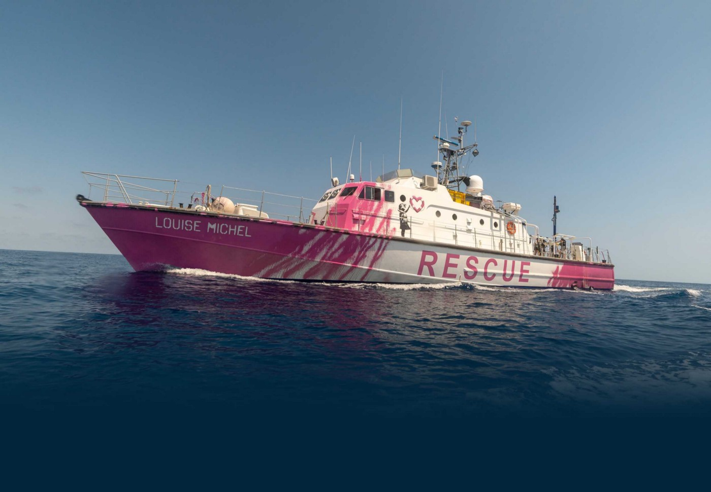
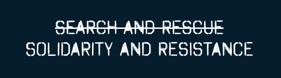

### AYS International Women’s Day Special — Who is Louise Michel?

_In 2020, artist Banksy funded a ‘homemade’ rescue vessel in the Mediterranean\. Naming the vessel, the crew decided to pay tribute to one of the most famous and fearsome revolutionary women in modern history, a free woman who dedicated her whole life to fight for the oppressed and for social revolution, and as a result was subjected to prison, deportation, exile and an attempt on her life, Louise Michel\._

Called by her peers ‘the Red Virgin’ or the new Joan d’Arc, Louise also became a symbol of the Paris Commune, the great social experiment of people’s self\-government, of which this year marks the 150th anniversary\. In France, her figure is quite well known and her memory is also alive among the Kanaks, the first nation people of the French overseas territory New Caledonia\.
#### **But who is Louise Michel?**

To understand it, we need to sketch out her biography as she never separated private life, action, thought and writing\.

](assets/c156eb428c75/1*S_1yrLvz_fnz0svF5EKhJw.jpeg)

[Louise Michel](https://en.wikipedia.org/wiki/Louise_Michel#/media/File:Louise_Michel2.jpg)

Louise is born as an illegitimate child in a castle in a tiny village in north\-eastern France in 1830\. Despite this, those she calls grandparents give her proper instruction, which is quite rare for a woman at the time\. When they die, in 1850, Louise moves with her mother — with whom she will always have a close relationship — to Chaumont, where she obtains her teaching qualification, the only diploma available to women\. Nonetheless, Louise will never be able to teach in public schools, because of her refusal to pledge allegiance to Napoleon III\.

She works in a number of small private schools and moves to Paris in 1856, where she opens her own school\. Louise’s school is deeply secular, with innovative teaching methods\. She argues for the importance of an active pedagogy and of a holistic approach, combining intellectual and manual education\. She believes that people’s emancipation needs to go through an educative process and that emancipation is not only economic and political but also cultural and intellectual\. For these reasons, she strongly argues for a gender\-mixed education, anticipating the public system which would come in a century later\.

In March 1871, one of the most important and radical experiences of social, political and cultural subversion takes off: the Paris Commune, and Louise is actively involved in it\. Together with many other Parisian women, Louise refuses to be relegated to a stereotyped role of care and support, claiming the right to active political engagement for women\. For this reason Louise, who had learnt to shoot at the bulls\-eye games at travelling fairs, fights on the front lines on the barricades, an active part of the defence of the Parisian insurrection\.

In May, the Commune is defeated thanks to brutal repression, leaving at least 30,000 dead\. Louise managed to survive the massacre, but hands herself into the authorities in order to save her mother, who had been arrested in her place\. In court, she refuses to defend herself, stating her total belonging to the Social Revolution, claiming responsibility for her actions and demanding to be executed like her male comrades\.

Louise is instead sentenced to deportation and, after 20 months in prison, in 1873 is sent to the French penal colony in the New Caledonia, in the southern Pacific Ocean, with 4,500 other communards\.
#### **“Power is cursed, and that’s why I’m an anarchist”\.**

During the 4\-month\-long travel to reach the island, Louise reflects on the reasons behind the failure of the Commune and concludes that power always corrupts those who have it\. From now on, for the rest of her life, Louise considers herself an anarchist: a tireless advocate for the need of a social revolution aimed not at seizing power but destroying it; not through revolutionary vanguards, but through the common action of all oppressed people, without distinction of gender or race\.

In the penal colony, Louise refuses any privileged treatment for being a woman, refuses to be pardoned unless all communards are pardoned with her and opens a school for adult Kanaks, employing radical teaching methods\.

Five years after her arrival, in 1878, the Kanaks rebel against French colonial authority\. Almost all the communards take the side of France: dozens of them take up arms to defend the French rule, others stay silent\. Instead, Louise Michel supports the struggle for the independence of the Kanaks, turning her internationalist and anti\-colonial vision into actual deeds\. In a society and a socialist movement in which racial prejudice were widespread, her position stands out as an anomaly\.

After 7 years in exile, in 1880, thanks to a general amnesty, Louise returns to France, where she is welcomed by 20,000 people\. A few months later, she starts an endless tour of rallies and conferences to propagate anarchist ideals, and commits the following 25 years to advocating for the revolution, becoming one of the fiercest critics of the French Third Republic\.

In March 1883, she takes part ,with revolutionary anarcho\-syndicalist Émile Pouget, in a large demonstration of the unemployed in Paris\. Demonstrators loot the city’s bakeries and Louise is arrested again and sentenced to 6 years of prison\.

In prison, she writes her memoirs \( [_Mémoires de Louise Michel écrits par elle\-même_](https://fr.m.wikisource.org/wiki/M%C3%A9moires_de_Louise_Michel/Texte_entier) \), published in 1886\. It is an exceptional work, first of all because it is one of the very few women’s public autobiographies of the XIX century, and the only autobiography of a revolutionary of that period\.

In her memoirs, Louise’s critique of the subaltern role of women in both society and revolutionary movements is explicit\. For her, women’s oppression among socialists and anarchists is more hidden and ambiguous, but it is still oppression\. Louise argues for the political role of women, for their right to be fighters and militants\.

In this total rejection of women’s traditional role, Louise develops her reflection on chastity and her condemnation of marriage and prostitution, as two sides of the same exploitation\. For these reasons, Louise is active in the fight for birth control, in the struggles against sexual exploitation, and for women’s education and workers rights\.

Louise is also a pioneer of antispeciesism and animal rights struggles\. She writes: “As far back as I can remember, the origin of my revolt against the powerful was my horror at the tortures inflicted on animals\.”

Louise believes that society is like a organic body, within which every life — vegetable, animal and human — has a right to existence and it is necessary to fight for all these rights\. Every non\-human animal is an individual who aspires to freedom, just like every human\. And like every human, they suffer the same oppression and hierarchy\.

](assets/c156eb428c75/1*RY_lW9biTu3XpyPYf6b78Q.gif)

Illustration via [CrimethInc\.](https://crimethinc.com/2017/03/18/march-18-1871-the-birth-of-the-paris-commune-a-narrative)

Released from prison due to an unrequested pardon, Louise resumes her frenzied political activity, forging ties with many of the most famous anarchists of the end of XIX century, like Errico Malatesta, Emma Goldman, Pietr Korpotin, Pietro Gori and Sabastien Faure\. With Faure, she establishes the journal _Le Libertaire_ \.

In 1888, Louise is victim of an attempted murder at the hand of a young Catholic man, who fires at her twice\. Injured, but not seriously, she doesn’t press charges and instead works for his release\. Shortly afterwards, along with many other revolutionaries, she is forced to move to London, where she carries on with her political activity and educational experiments, until her return to France in 1893\. Louise continues touring France for rallies and conferences, also going to Algeria, where her passage left a lasting mark\. Upon her death, on the 9th of January 1905, 50,000 people take part in her funeral, obviously with no religious ceremony\.

Nowadays, Louise’s figure is being rediscovered\. The crew of the Banksy\-funded ‘homemade’ rescue boat took her name to signal the continuity of emancipatory struggles\.

Image by M\.V\. Louise Michel

The vessel — sadly blocked from leaving port due to EU restrictions since October 2020 — “is as agile as she is pink … She is captained and crewed by a team of rescue professionals drawn from across Europe\. She runs on a flat hierarchy and a vegan diet\.”

Too often, though, Louise Michel is still being reduced to an iconic and empty symbol of the Parisian Commune or to a ‘brave woman for her time’\. More attention should be given to the depth and the modernity of her reflections, which invite us to refuse every type of domination, avoiding classifications and breaking free from discriminations — be those of race, gender, age or species\.

**By Selva Varengo**

**Find daily updates and special reports on our [Medium page](https://medium.com/are-you-syrious) \.**

**If you wish to contribute, either by writing a report or a story, or by joining the info gathering team, please let us know\.**

**We strive to echo correct news from the ground through collaboration and fairness\. Every effort has been made to credit organisations and individuals with regard to the supply of information, video, and photo material \(in cases where the source wanted to be accredited\) \. Please notify us regarding corrections\.**

**If there’s anything you want to share or comment, contact us through Facebook, Twitter or write to: areyousyrious@gmail\.com**

_Converted [Medium Post](https://medium.com/are-you-syrious/ays-international-womens-day-special-who-is-louise-michel-c156eb428c75) by [ZMediumToMarkdown](https://github.com/ZhgChgLi/ZMediumToMarkdown)._
