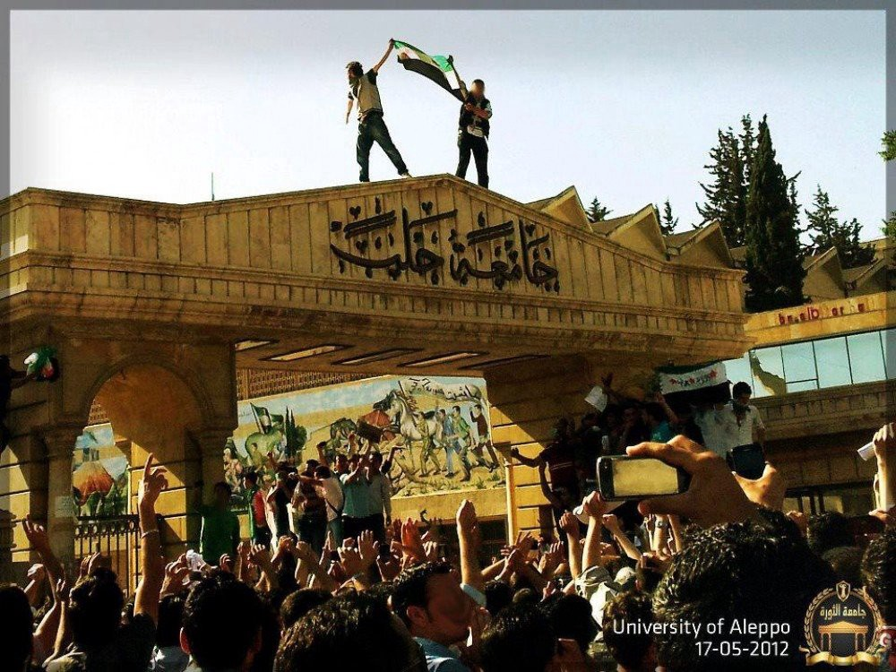
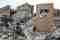
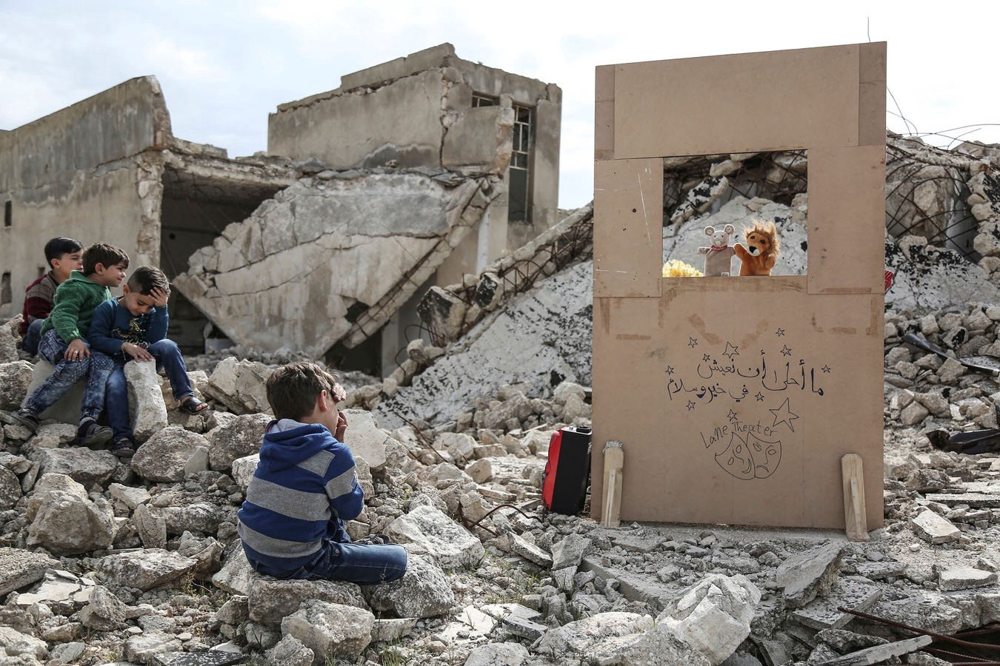
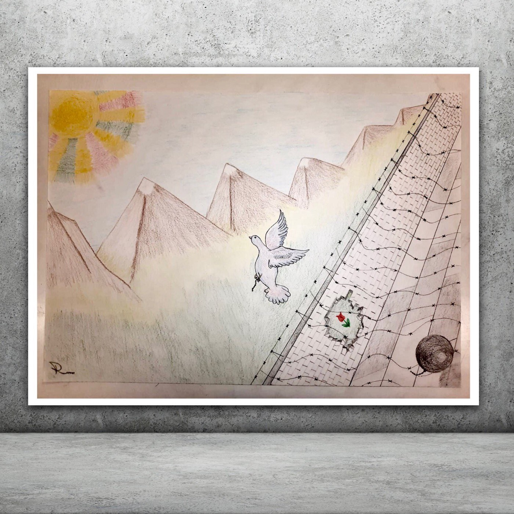
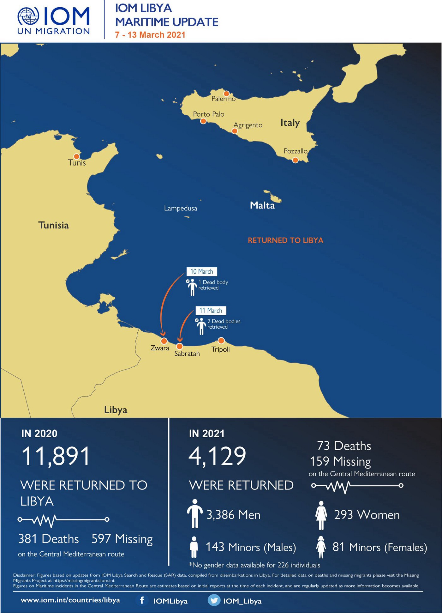

### AYS Daily Digest 15/03/2021 — A decade later, the war on Syria’s civilians is far from over
### International day against police brutality // New reports of illegal pushbacks in the Mediterranean // Protests amongst people on quarantine ships in Italy // UK to curb access to domestic abuse support for migrant women…and more

[Are You Syrious?](?source=post_page-----c47acfeec5ba--------------------------------)

[Mar 16](ays-daily-digest-15-03-2021-a-decade-later-the-war-on-syrias-civilians-is-far-from-over-c47acfeec5ba?source=post_page-----c47acfeec5ba--------------------------------) · 9 min read
### SYRIA

It’s been ten years since the first peaceful demonstrations in Syria erupted to topple the Assad regime, which responded with brutal violence and repression and, later, armed conflict\.

We want to express our solidarity with all the people who have been displaced, traumatised, and who lost their lives in this terrible conflict, at the hands of a murderous regime and a complicit international community\. As many as [6\.7 MILLION Syrians](https://twitter.com/Refugees/status/1370661409449779200?fbclid=IwAR2z_yBC9SKChipYQHb4njRC26PFtGZBgQnlDYCyZ39clJUgSMcYRU3-YuQ) are still displaced within their country, while many more are living as refugees in neighbouring countries\.

The extent and depth of the ongoing humanitarian catastrophe is shocking: nearly 12 million people — half the country’s pre\-war population — have been forced to flee their homes\. The health system has been destroyed\.

MSF/Doctors without borders, active and responding to the crisis since the beginning of the conflict, has this [timeline and infographic](https://www.doctorswithoutborders.org/what-we-do/news-stories/story/syria-10-years-war) documenting the developments in these ten years of crisis\.

There have been several demonstrations across the country, in [Idlib](https://twitter.com/LeilaShami/status/1371478956969504775?fbclid=IwAR0zKtlA8PtxHZ16fWgk_oBV54oFaFF2okjv23IFVDqGzsLtzESej18fCKA) , [AlAbab](https://twitter.com/LeilaShami/status/1371464284501344263?fbclid=IwAR0mPDD3zdjeHGbt6Rk8Jv05tA9WQTu09cXz9-GzntHzOAFjrpramTviTI4) \(Aleppo\), [Raqqa](https://twitter.com/HussamHamoud/status/1371431709607133184?fbclid=IwAR2kE4LzzYCIuwhkqmoXZSnC7UTFQA670AKnMnQKxyMc8rxdZG4pYOSq0G4) , to commemorate the uprising\.

[10 years after the Syrian uprising](https://twitter.com/ejbeals/status/1371401177653448704) and subsequent war,

it’s not fair to ask Syrians if they would again ask for dignity if they had a do\-over, instead ask if it was fair for one man to burn the country and everyone in it in response to their request\.

“I have no other choice but hope” Journalist and human rights activist Wafa Mustafa looks back over 10 years of the Syria crisis in pictures\. Read more [here](http://amn.st/6013Hq6et) \.

In order to understand what keeps this murderous regime in power, we turn to the words of opposition figure and former longtime political prisoner of the regime [Mustafa Khalifa](https://newlinesmag.com/first-person/after-13-years-in-syrian-prisons-i-knew-assad-would-win/) , who explains the cruelty, corruption, and sectarianism keeping it in power\.

We started to see a scene that has since been repeated frequently in al\-Assad’s media: entire houses and cities completely destroyed\. We see al\-Assad’s forces carrying a new flag and placing it either on a destroyed wall or on a pile of rubble\. In the scenes there is a stark contrast between the shiny new flag, bright under the sun, and the whole scene of destruction, devastation, and dust\. Al\-Assad’s victory is like this scene, triumphantly standing on a country of dust and rubble\.

For the past 50 years, this scorched\-earth policy has been the foundation of both Assad regimes; Bashar was never going to accept anything short of a total restoration of the “wall of terror” built by his father in the 1970s and 1980s, of which I was one of the direct victims\. No peace negotiations or reconciliation processes will ever change this reality, which has been built on fear and enforced with sectarian weapons\. So, without the triumph of the original and nationalist goals of the revolutionary forces, the silent civil war, enacted through imprisonment and torture I know so well, is here to stay\.

This week’s “The Final Straw” features a conversation with Joey Ayoub and Leila Al\-Shami\.

In this conversation, Joey tells us of some of the history of Lebanon, since the civil war that ended in 1990 and up to the current demonstrations against the clientelist warlords in power in that country\. Intertwined with this, Leila speaks about the sparking of the resistance to Bashar Al\-Assad in Syria, the tumult of the civil war, and the state of anti\-authoritarian and social justice organizing and media work in that country\. Then the two talk about the experience of countering disinformation, conspiracy thinking and poor solidarity in the so\-called Left in the West and ways to combat ignorance\.

The voices of many protesters, journalists, activists, and survivors are collected in this [thread\.](https://twitter.com/ejbeals/status/1371430186118475776?fbclid=IwAR0zKtlA8PtxHZ16fWgk_oBV54oFaFF2okjv23IFVDqGzsLtzESej18fCKA)

AlJazeera has this compelling [photo essay](https://interactive.aljazeera.com/aje/2021/syria-10-years-by-syrian-photographers/index.html?fbclid=IwAR07UMynEfAghlyBTvCPk0eDLI5QzzUumkycarypuQWcwiEZrguos-5CYIg) about the conflict, seen through the eyes of 16 photographers and their testimony\. The collection highlights the cost of the crisis while shining a light on the strength of Syria’s people and their hopes for a future without conflict\.

Despite the tragic situation, [some European politicians](https://fragdenstaat.de/.../lagebericht-fur-syrien.../) are deeming Syria safe for deportation\. In the new situation report for Syria, the German Federal Foreign Office describes an unchanged catastrophic humanitarian situation\. Nevertheless, interior ministers are calling for people to be deported there\. This is dangerous populism\.

GREECE

[AlarmPhone](https://twitter.com/alarm_phone/status/1371427162113314820?fbclid=IwAR3iQaT9b-OJcgsF6mIqLg1BoiJGRLuAsWSI_kSTO7e1_1DvtLRwldJU9Jc) has reported an illegal mass pushback to Turkey yesterday\. The organisation writes: “Yesterday, we received a distress call from 22 people, left adrift in life rafts near Samos\. The Turkish Coast Guard was alerted\. They reported a total of 7–8 life rafts with ~100 people in this area, all of whom were pushed back\.”

Our solidarity goes out to the people who were affected by the illegal pushback\. Greece needs to be held accountable for its crimes against humanity and Europe needs to stop being complicit by remaining silent\.

[Call for action from No Border Kitchen Lesvos](https://twitter.com/noborderkitchen/status/1371507589322772481?fbclid=IwAR2V6R9UjqxCNft9R4SD86lm2suUm2hP-Vov2VBBzHnP1w3qseH_-O0C99E) , on the occasion of the EU\-Turkey Deal’s 5th anniversary on 18th March 2021:

Due to coronavirus restrictions and the heavily enforced lockdown in Lesvos our options to express our collective rage and resistance to this system seem limited\.

Greek Immigration and Asylum Minister Notis Mitarakishas [declared that](https://www.amna.gr/home/article/536752/N-Mitarakis-I-Tourkia-einai-asfalis-triti-chora-gia-prosfuges?fbclid=IwAR1g3AOqLjf5s1-Jh2Y2XWUzzNNOrMGZwxauYLef7lGPqjf5sM24bc6-1YA) “Turkey is a safe country, not only for Syrians but for all refugees”\. In [another outrageous statement](https://greekreporter.com/2021/03/15/greek-immigration-minister-says-left-waging-war-against-frontex/?fbclid=IwAR0KKvBrmEAodKLX4vzwWJrtuDlMQ89jqstvPhXg0i49khJz8Sr--n3_dH4) , Mitarakis, addressing several accusations regarding actions taken by officers of the European Border and Coast Guard Agency \(FRONTEX\), said it was part of a “war” waged by the Left\.

Months ago, t [he European Commission promised there would be “No more Morias”](https://www.theparliamentmagazine.eu/news/article/why-we-cannot-wait-for-a-european-solution-to-the-moria-refugee-camp?fbclid=IwAR1T5IyKl6u6e8ZpWsC9DwPxJJqdSCJpBe2Ij8p1KF5KlrCFXxgI4--Q_nA) after the fire, but the Greek government has built a new, even worse, Moria, with EU funding\.

The new Moria is built on an old military shooting range, where the soil is contaminated with lead — a resident recently found a hand grenade\. Every heavy rainfall leads to flooding, leaving the residents of the light summer tents defenceless\. Everything that destroyed so many souls and ended in disaster in the old Moria camp was rebuilt a few metres away\. Europe’s common asylum policy is a policy that is shaped by empty promises\. Despite the Commission’s promise, the temporary, undignified, ill\-equipped camp on Lesbos will most likely still be there next winter\.

INTERNATIONAL DAY AGAINST POLICE BRUTALITY

### BALKANS

[Border Violence Monitoring Network](https://twitter.com/Border_Violence/status/1371476301186486273?fbclid=IwAR3d8eURpc7DrxmXqqA5MfI_xat6SnqxelNuD8IeWtT3fZ1e4ASO_X3EdBM) has shared its February monthly report on pushbacks and border violence\. The report highlights the latest trends related to migration policing, gathering 44 testimonies of pushbacks, impacting a total of 1,133 people\-on\-the\-move, all the way from Turkey to Italy\.

BELGIUM

Repression at all costs at the [closed centre of Merksplas](https://www.gettingthevoiceout.org/mars-2021-repression-a-tout-va-au-centre-ferme-de-merksplas/?fbclid=IwAR0zKtlA8PtxHZ16fWgk_oBV54oFaFF2okjv23IFVDqGzsLtzESej18fCKA) \. Two blocks of the centre are currently occupied, and the detainees are no longer two, but three per room, still without a mask\. Food is bad and insufficient, and medical care is almost absent\. In addition, promiscuity creates internal tensions\.

UNITED KINGDOM

[Refugee Council reports](https://twitter.com/refugeecouncil/status/1371392700742832129?fbclid=IwAR1g3AOqLjf5s1-Jh2Y2XWUzzNNOrMGZwxauYLef7lGPqjf5sM24bc6-1YA) on the Domestic Abuse Bill, debated today in Parliament, which excludes migrant women, who still cannot access life\-saving services\.

It is outrageous that migrant women have to choose between homelessness and returning to live with a perpetrator when they can’t access services\. Amendments to the bill are being debated this afternoon, and must be supported if Government is serious about the safety of all women\.

The UK government is also set to discuss the [Police, Crime, Sentencing and Courts Bill](https://www.gov.uk/government/publications/police-crime-sentencing-and-courts-bill-2021-factsheets/police-crime-sentencing-and-courts-bill-2021-protest-powers-factsheet) , sponsored by Priti Patel’s Home Office\. It threatens a permanent end to many of our freedoms of dissent as we know them\. Find out more about the bill [here](https://gal-dem.com/priti-patel-protest-ban-bill/?fbclid=IwAR02hpHFCzvvJ-VYgHDU4NwRAisa5Xz13Ulkn8P_A_JlbYpnWnHkEwcpbHQ) , and how it connects to the recent violent repression of vigils and demonstrations in commemoration of Sarah Everard, and to demand safe streets for women\.

EU

Ahead of the five year anniversary of the EU\-Turkey deal on migration on 18 March, [Amnesty International is calling on EU leaders](https://www.amnesty.org/en/latest/news/2021/03/eu-anniversary-of-turkey-deal-offers-warning-against-further-dangerous-migration-deals/?fbclid=IwAR0WEj2M24-Dx1tAVuK6NUvcRFiFJmYl00pGg4D0uQkU7lZ3w6HxtGkJiBs) to turn away from the five years of failed policies which have resulted in tens of thousands of people being forced to stay in inhumane conditions on the Greek islands, and put refugees at risk by forcing them to stay in Turkey\.

“Five years after the deal was signed, 15 000 women, men and children remain trapped in overcrowded camps on the Greek islands and tens of thousands more have endured stays there\. Many are forced to sleep in tents, braving cold weather in conditions so unsafe that some people have died as a result\.”

The IOM has the [following report](https://migration.iom.int/reports/europe-%E2%80%94-refugee-and-migrant-children-europe-overview-trends-january-%E2%80%94-june-2020?close=true&fbclid=IwAR2UL7-fUWqp7Ck152-HmjnYAQ1B8Ygcx9iNqQvb4cafj4I16_hqwXmKd9o) on the impact which COVID\-19 has had on refugee and migrant children\.

Suspension of procedures such as registration, age assessment and asylum impacted access to services for children, including guardianship, and in some contexts access to appropriate shelter\. Between January and June 2020, 6,177 children arrived in Greece, Italy, Spain, Bulgaria, Cyprus and Malta\. Of these, 2,302 \(37%\) were unaccompanied or separated children \(UASC\) \. Child arrivals in Greece, Italy, Bulgaria and Spain in the first half of 2020 decreased by 32% compared to the first half in 2019 \(8,236\) \.

As countries are starting to roll out their COVID\-19 vaccination strategies, [PICUM has been monitoring European national policies](https://picum.org/civicrm?page=CiviCRM&q=civicrm%2Fmailing%2Fview&reset=1&id=967&fbclid=IwAR34F15QQgIqYpuV_G9ma-U49JeFJIGHJxDYvaSiFSE0jErsrYzgTO38REk) concerning undocumented migrants\. Based on media reports, official sources and information we received from our members and social media followers, we have started to compile a [map](https://twitter.com/PICUM_post/status/1367740451818790915) displaying the countries that explicitly include undocumented people in their COVID\-19 vaccination strategy and those who explicitly exclude them\.

GERMANY

After twelve years, [a Pakistani Christian is being threatened with deportation](https://taz.de/Abschiebung-aus-Sachsen-nach-12-Jahren/!5757847/) from Saxony\. There is great outrage, but the authorities remain stubborn\.

Jahangir had to flee Pakistan in 2008 as a Catholic Christian\. The Federal Office for Migration BAMF and the Saxon immigration authorities [did not want to know about the persecution of Christians in Pakistan](https://twitter.com/DunyaCollective/status/1371499106724679681?fbclid=IwAR2Ht3rdb5sPffsQbiyqiMqhm98d8SRzM-flaTqsHZs-UWPUTT-aoBPwM5M) \. Amnesty International and Christian organizations, on the other hand, have been reporting attacks on Christians in Pakistan for years\.
The immigration authorities do not deny that the Pakistani is entitled to a residence permit by marrying a German, according to his lawyer\. However, Jahangir should apply for the necessary visa procedure in his country of origin, Pakistan\. Experience shows that this takes at least one and a half years\. Whether the Christian survives this time in Pakistan at all is of no interest to anyone\. The Meissen Administrative Court considers this procedure to be reasonable\.

[Solidarity demonstrations](https://twitter.com/DunyaCollective/status/1371418397276180481?fbclid=IwAR1aEszir5LxPvjqM2_3CONvOYQJkfRLARYKf2R_vNcMAcm1H8-cTlFeQdk) will be taking place\.

ITALY

Deportations and illegal detentions in Italy\.

Hundreds of people are being forcefully [detained on the quarantine ship “Splendid”](https://www.trapanisi.it/la-nave-quarantena-splendid-sbarca-migranti-al-porto-di-trapani/) at Trapani’s harbour, in appalling conditions\. They have been waiting for days for permission to disembark and see their asylum requests processed\. Most of them face direct deportation back to Tunisia\. Some people threw themselves into the water to protest against these deportations\. Some direct testimonies of the conditions aboard [here\.](https://m.facebook.com/story.php?story_fbid=275695294120561&id=107635584259867)

The number of [migrant arrivals](https://t.co/M1dmADsERa?amp=1) on Italian shores from Tunisia rose to 638 in February, from 26 in same month in 2020, up more than 23 times\. This month saw the return of family\-based migration as about 15 families arrived in Lampedusa\.

LIBYA

[IOM’s infographic](https://twitter.com/IOM_Libya/status/1371467757599006721?fbclid=IwAR0ReZ5AqjcVg6pjcYF4CmNZhrVwD34yxlqLe8VVqYopY8lfvwWJGyOCYP8) on returns to Libya\. Interceptions of people fleeing by sea are increasing as [EUBAM Libya](https://statewatch.org/news/2021/march/libya-interceptions-of-people-fleeing-by-sea-increase-as-eu-border-mission-seeks-two-year-extension/) , the EU border mission, seeks a two\-year extension to continue support for the Libyan coast guard

WORTH READING

[Dignity](https://twitter.com/DignityDK/status/1371405137969823745?fbclid=IwAR3ZKEEMKT6DOrsetWA7vnh-ptvHUlQm4XXF2TRpB1Pc8RLn31GAkDr-_kE) has an explainer video in English on the Danish government’s plan to ‘externalise’ asylum procedures and refugee protection\. The Danish approach seems to be unique in Europe and may interest an international audience\.

There will be an [online event](https://twitter.com/rspaegean/status/1370024490877423626?fbclid=IwAR0cX1fHXXrDlkAe1T7u4EBHnscQYJGy7Gw024WrPHaiPC1ZkHnTPgLwJoA) at 17:00 CET today: Refugees & residents on the islands speak about the impact of the [\#EUTurkey](https://twitter.com/hashtag/EUTurkey?src=hashtag_click) Deal on local societies & their lives

**Find daily updates and special reports on our [Medium page](https://medium.com/are-you-syrious) \.**

**If you wish to contribute, either by writing a report or a story, or by joining the info gathering team, please let us know\.**

**We strive to echo correct news from the ground through collaboration and fairness\. Every effort has been made to credit organisations and individuals with regard to the supply of information, video, and photo material \(in cases where the source wanted to be accredited\) \. Please notify us regarding corrections\.**

**If there’s anything you want to share or comment, contact us through Facebook, Twitter or write to: areyousyrious@gmail\.com**

_Converted [Medium Post](https://medium.com/are-you-syrious/ays-daily-digest-15-03-2021-a-decade-later-the-war-on-syrias-civilians-is-far-from-over-9ee02b5803d3) by [ZMediumToMarkdown](https://github.com/ZhgChgLi/ZMediumToMarkdown)._
