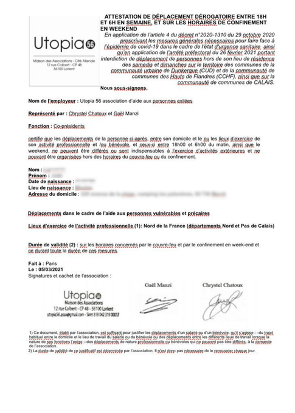
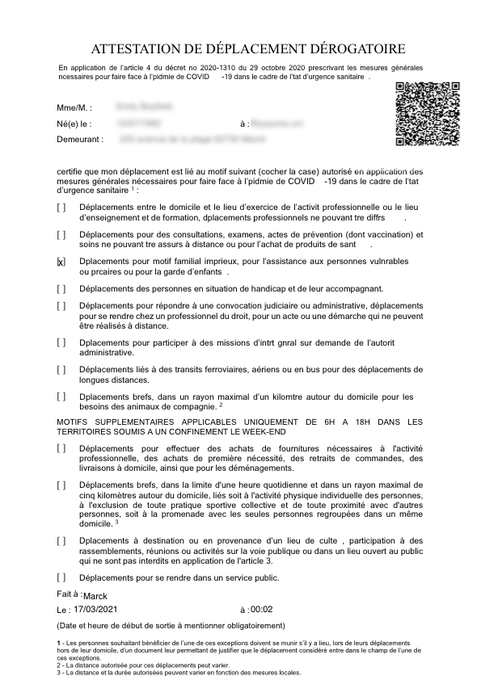
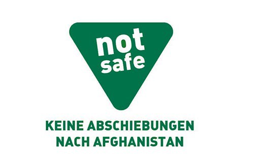
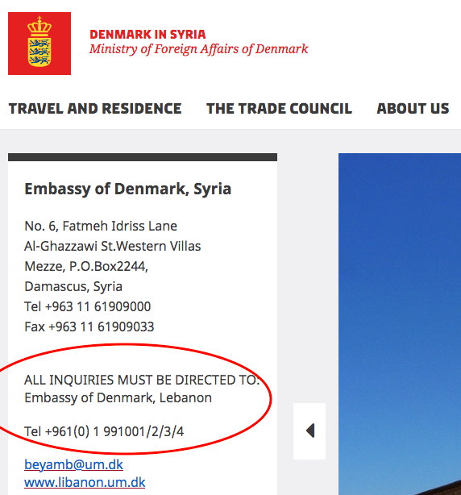
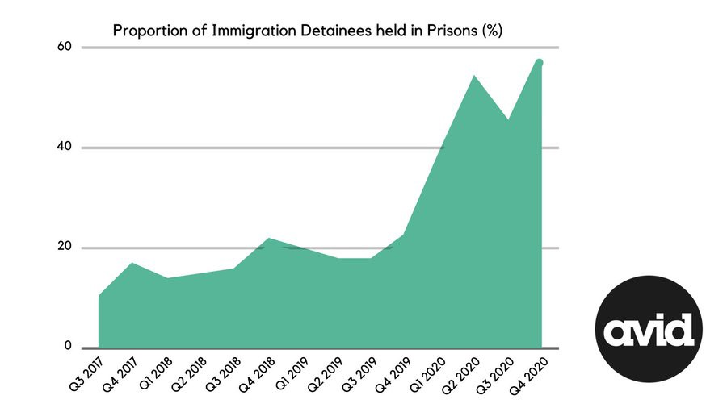

### AYS Daily Digest 17/3/21: Serbia — The number of total decisions on asylum lowest in the past four years
#### 2020 report on Serbia / Greece: an indictment of reception conditions on Lesvos / Official Croatia ignoring its ombudswoman / Sea — international fundraising campaign in support of Mediterranea / Recommended reads on the anniversary of the EU\-Turkey deal & more

APC teams reported from Sombor, Serbia, some days ago, where the conditions remain poor, safety questionable and access to hygiene scarce\.
#### FEATURED

**Serbia** has accepted 27 per cent of the 223 applications for asylum last year, fewer than in 2019, as the most recent report states\. The report takes into account information collected by the end of past year\. The report documents serious arbitrary decisions pertaining to particular groups, while it quotes the UNHCR saying that at least 361 people were pushed back and expelled to North Macedonia in the period from January to December 2020\. However, the year marked the first case of a family reunification procedure that was carried out in Serbia for an Afghan man who was reunited with his family\.

#### SEA

> There is a need to stand up politically and affirm the key role of migrant sea rescue and solidarity practices in the struggle for a more open and democratic Europe\. 

The Mediterranea team has taken action to support those accused for having saved lives when the EU failed to prevent the Mediterranean Sea from becoming the most lethal border in the world\. You too can support their action\.

> We want to show unconditional solidarity with _Mediterranea_ as well as with the other NGOs under attack\. We support the coalition of civil actors engaged as a “civil fleet” in solidarity with migrants and refugees at sea and on land\. We are convinced that this coalition, which continues to grow and to create unexpected alliances, already foreshadows a new Europe and new relations with the lands beyond it to the South as well as to the East\. We are particularly concerned for _Mediterranea_ , which is currently blocked from undertaking rescue operations at sea\. And we know how expensive the lawyers’ fees and other legal expenses are which are necessary to defend against legal attacks such as the one launched by the Public Prosecutor of Ragusa\. For all these reasons we are launching an international fundraising campaign in support of _Mediterranea_ \. And we strongly invite all citizens and organisations that are convinced that rescue should be prioritized over all else to contribute to the campaign\. 

Read the group’s update on the past two weeks at sea [here](https://sosmediterranee.de/blick-auf-das-zentrale-mittelmeer-15/?fbclid=IwAR3QtlQOmZnnavI9tP_mcR6-7eUuszBUnjJHKSH3zOu_9bCvRRIE9bMsgjQ) \.

Support them: [https://donate\.mediterranearescue\.it/solidarity/](https://donate.mediterranearescue.it/solidarity/)

More on the situation:

[https://thecivilfleet\.wordpress\.com/2021/03/17/naomi\-klein\-and\-cornel\-west\-join\-activists\-call\-for\-donations\-to\-refugee\-rescue\-charity\-under\-legal\-attack/?fbclid=IwAR2JXg7Cb6paWtd2\_RvthvsZhJMcQkPFtZ1iiCw9xclodrydKYhG0bks20w](https://thecivilfleet.wordpress.com/2021/03/17/naomi-klein-and-cornel-west-join-activists-call-for-donations-to-refugee-rescue-charity-under-legal-attack/?fbclid=IwAR2JXg7Cb6paWtd2_RvthvsZhJMcQkPFtZ1iiCw9xclodrydKYhG0bks20w)
#### GREECE

3 people with medical needs have been transferred from Lesvos to Athens after an appeal to ECHR on the grounds they need better conditions and access to healthcare\. There are tens of thousands of people who have been kept in unimaginable conditions with a definitely obvious “imminent risk of irreparable harm” and were subjected to inhuman and degrading treatment\.

■■■■■■■■■■■■■■ 
> **[Mortaza](https://twitter.com/mortazabehboudi) @ Twitter Says:** 

> > “We are walking an hour from the camp to the hospital every week. There is no assistance...” Ayoub carried his brother with disabilities to #Lesvos a year and half. They lived in Moria camp and are still waiting in #KaraTape camp without any assistance. https://t.co/9TyFAwq3z0 

> **Tweeted at [2021-03-17 11:43:57](https://twitter.com/mortazabehboudi/status/1372151716725002240).** 

■■■■■■■■■■■■■■ 

It took a lot of litigation and work to get the cases to the European Court of Human Rights in order to make possible something that should have been done a long time ago, not only in these cases, and by the UN agencies, if not the state officials in charge of the reception\.

> The Legal Centre Lesvos \(LCL\) submitted five applications for urgent interim measures to the European Court of Human Rights \(ECtHR\) \. Three of these interim measures were granted by the Court within 48 hours of submission — [A\.J\. v Greece on 4 March](https://legalcentrelesvos.org/2021/02/17/greek-authorities-must-urgently-transfer-vulnerable-migrants-to-the-mainland-in-accordance-with-their-own-laws/) , A\.M\. v Greece on 5 March, and H\.A\. v Greece on 9 March\.Shameful that Greek govt or UNCHR didn’t make this happen and needed to be told to do it by the ECHR 

Find out [more about](http://legalcentrelesvos.org/2021/03/17/greek-government-instructed-by-european-court-of-human-rights-to-guarantee-rights-of-3-lcl-clients-an-indictment-of-reception-conditions-in-lesvos/?fbclid=IwAR2lNS35xF4_pP-RBUW0mCX9e1v7Up8eIiw3rE0-KSzL0ziI-GCdlVuwACA) the cases\.

Many people are crowded on Samos and Chios, too\. The conditions they are currently living in, given the development of the pandemic, have put them in imminent danger in that aspect as well, as reported from the ground:

■■■■■■■■■■■■■■ 
> **[Dr. Apostolos Veizis](https://twitter.com/AVeizis) @ Twitter Says:** 

> > 8 positive cases of COVID 19 today, Samos camp. 3315 humans are '' hosted '' in a place with capacity 648 https://t.co/Jp1FgXnRQ7 

> **Tweeted at [2021-03-17 18:25:20](https://twitter.com/aveizis/status/1372252730559975427).** 

■■■■■■■■■■■■■■ 

### Frontex is pressing to have its guards armed by the summer

The agency has reportedly reached a “bridging agreement” with Athens so its guards can also carry guns on missions in Greece, [reported](https://euobserver.com/migration/151253?fbclid=IwAR0oFLNQZd3ebo61o-cSebN3NuIq86pTBThsGDGU7B1F_2nlEnXeVTHgw1U) the head of Frontex\. As we wrote earlier, tracking the moves and movements of the Greek minister who, conveniently, met with his Polish colleague and the head of Frontex during the same mini\-tour he went on recently, it seems that all this has resulted in this “agreement”, arming hundreds of its 10,000 standing corps of the already violent border regime\. The decision is supposedly a reaction to the reports of Turkish soldiers firing shots into the air at the Greek land border by the Evros River\.
#### CROATIA
### Official Croatia \(continues\) ignoring its ombudswoman

More than 60 percent of the recommendations the ombudswoman stated in her yearly report were not commented on by the government, whose responsibility is to do so\.

142recommendations in the field of the protection of human rights were in her most recent yearly report, mostly directed at the ministries in charge\.

„It is obvious that the fact that there are no discussions in the Parliament on this has a set of long\-term consequences that do not contribute to a better protection of the human rights”, the ex\-Ombudswoman said\. Previously she complained a number of times about the Ministry of the Interior which denies access to the documents of the treatment of the people they define as “irregular migrants”, that they have in their information system\.

Croatia’s crisis in the judiciary is lately taking a more serious turn with some high profile cases, but the lack of an independent judiciary was already felt by many who rely on it for reaching safety, as well as those who have had to undergo processes, approaches and treatments the likes of those from the film “The Lives of Others”\. 
The treatment of the ombudswoman’s recommendations, her role and consideration, or lack thereof, by the government goes to the point that we will not receive an answer to the banking discrimination policies in Croatia towards certain nationals any time soon\.
#### FRANCE
### Volunteers on the ground fined — again

The volunteer teams active in the north of France have been under pressure from the same officials who keep evicting people from the area\. [Utopia 56](https://twitter.com/Utopia_56) reports that they have received two additional fines to bringing the number fa total of 72 fines as of now — for non\-compliance with the curfew in Calais, while in front of the police station\. However, the teams have still been working as they have every night, the team accompanies a minor in order to request a shelter for him\. All their certificates are in order, states the team\.

#### SPAIN
### Children in critical condition upon arrival in Spain

A baby in critical condition and five other minors were hospitalized upon their arrival by dinghy in the Canary Islands\. The cold and the delay in rescues are having serious consequences\. And there ninety\-five lives were left in the sea, as [reported](https://www.publico.es/sociedad/migrantes-gran-canaria-diez-hospitalizados-patera-rescatada-gran-canaria-menor-critico.html?fbclid=IwAR0YUb5EAwI-v3q7I3X1u-w0_s9cIsbYfIVwZJ7bN8_8W2ZyXEMlydpO4GU) \.
They left Dakhla, in the south of the Sahara, and they had been between four or five days at sea, say first responders\.
#### GERMANY
### Warning of new deportations

According to current information, the [Flüchtlingsrat Bay](https://twitter.com/BFR_089) team warns that the next collective deportation to Afghanistan will probably take place on Wednesday, 7 April 2021, from Berlin\-Schönefeld Airport\. You can find warnings and also which people are NOT affected on their main profile\.
#### DENMARK

As we have been reporting, Denmark is embarking on a mission to send people back to war\-torn Syria, as they have concluded that Damascus is a safe place to return to\. Denmark was the first country to sign the 1951 U\.N\. Convention — the legal foundation for the protection of refugees worldwide, and now it is the first European state sending Syrians back to a war\-torn country\.

Here is another interesting thing pointed out on [Twitter](https://twitter.com/joeyayoub/status/1372134701524205569/photo/1) : the Danish embassy in Syria is referring Syrians to the Danish embassy in Lebanon because it is not safe for them to work in Syria:

#### UK

Most immigration detainees across the UK are now being held in prisons, where, despite operating under extraordinarily severe and harmful lockdown conditions, people are still at greater risk from COVID\-19, reported [AVID](https://twitter.com/AVIDdetention) \.

118 deaths related to COVID\-19 among people in prisons in England and Wales between March 2020 and February 2021, representing a risk of dying that is more than three times higher than that of people of the same age and sex outside secure environments, [found](https://www.theguardian.com/society/2021/mar/16/covid-death-rate-in-prisons-three-times-higher-than-outside) the research team at University College London \(UCL\) \.

Read our Special on the current state of things in the UK:

#### WORTH READING

Turkey — EU deal in focus:
- Why Turkey is not a safe place for people on the move and why this matters:

- Touching on the root of the deal — the designation of Turkey as a ‘safe third country’ — each day this week, the Legal Centre Lesvos will publish a statement on one aspect of the legal consequences of the EU\-Turkey Deal:

- More on the effects of the Deal:

[](https://l.facebook.com/l.php?u=https%3A%2F%2Fwww.euractiv.com%2Fsection%2Fjustice-home-affairs%2Fopinion%2Finnovative-ways-of-evading-responsibilities-for-refugees%2F%3Ffbclid%3DIwAR0zs3ni9Enci2TuNQetQ16qntjI3ibh0Uq1l4ozxqIr7gGUwVjEh5IXQxU&h=AT1fwBAKCOlpYGHHR1lAm-EmL5mzkTZIfbRCoo6N27P86Y3JeAbsyAkAAAEY-j-lfOLIGiGJ2XyJ19y1WOEYHA5gfRlbWnsnzc9cjn-4-k8d0A9PlxfngQtL84936mnriaH1PX4sQbQlIQ&__tn__=R]-R&c[0]=AT03PsTQj1yYegJuMGSCyfwRlW2dkV2b-SJWGps4_UgWLUCgHhOCmlOfygyekCjGARS3wzcIvQgTp3YMQHYMwKF1fRE0paChfTRJ0Vd5grg-NhIlp1a0XbUp2GNd80mJB6FuPnK8hVYPSww5VbVAsj5N20E6_FpttHyD9OT-ShXr9vteD0ZwesJxPEmZQRQcpK84s11_GCd43xrJjw)

**Find daily updates and special reports on our [Medium page](https://medium.com/are-you-syrious) \.**

**If you wish to contribute, either by writing a report or a story, or by joining the info gathering team, please let us know\.**

**We strive to echo correct news from the ground through collaboration and fairness\. Every effort has been made to credit organisations and individuals with regard to the supply of information, video, and photo material \(in cases where the source wanted to be accredited\) \. Please notify us regarding corrections\.**

**If there’s anything you want to share or comment, contact us through Facebook, Twitter or write to: areyousyrious@gmail\.com**

_Converted [Medium Post](https://medium.com/are-you-syrious/ays-daily-digest-17-3-21-serbia-the-number-of-total-decisions-on-asylum-lowest-in-the-past-four-3cc0cf399016) by [ZMediumToMarkdown](https://github.com/ZhgChgLi/ZMediumToMarkdown)._
