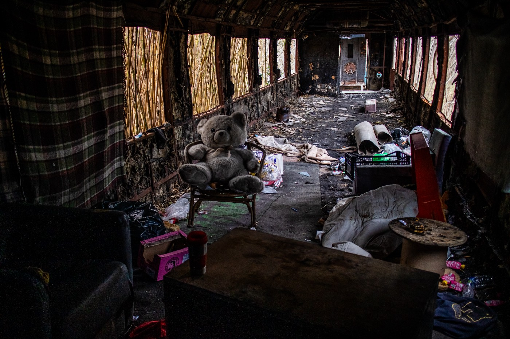
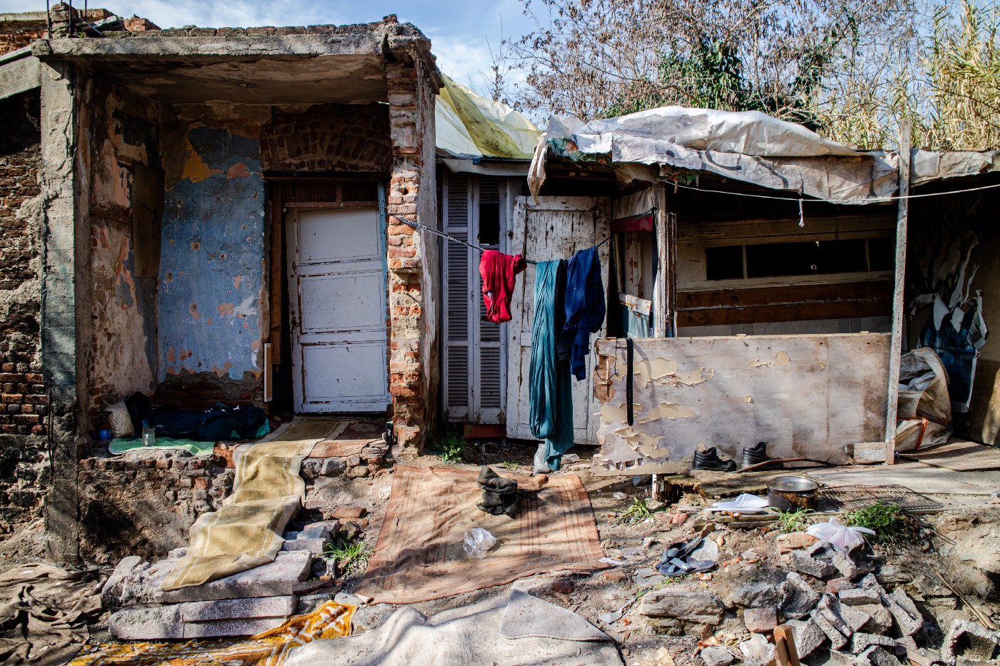

### AYS Special from Greece: The ongoing failure of accommodation programs

_Further to our Special last week focusing on the close of the [Filoxenia Programme](ays-special-from-greece-recognised-refugees-sleeping-on-the-street-as-eu-scheme-scrapped-cfd8c54e5c6f) , [Mobile Info Team](https://www.mobileinfoteam.org/accommodation-report?fbclid=IwAR2KYlWw8IGpOuVqSkeHTlSJn1S9SbxaRvjYtS17d8DtRKE41q9B2psbnOE) bring us an overview of the ESTIA programme and it’s attendant difficulties, which leave many vulnerable people in a dangerous state of limbo\._

 \)](assets/3d6677ed415c/1*metLqzT-YuGEuLX0Mcv_8g.jpeg)

\(The view from Thessaloniki\. Photo Credit: @ [erzaehlt\.unterwegs](https://www.instagram.com/erzaehlt.unterwegs/) \)

The ESTIA \(Emergency Support to Integration and Accommodation\) accommodation program was created in 2015 by UNHCR and its implementation partners\. It started as an accommodation scheme for those who were selected for the former relocation program from Greece to other European Union \(EU\) countries and it expanded into an accommodation program for vulnerable refugees or asylum seekers\. Today it hosts over 20,000 people in accommodation structures located on seven islands and in 14 cities throughout mainland Greece\.

On Lesvos, the referral pathway for vulnerable individuals to accommodation schemes existent between 2017 and 2020 consisted of meetings between referring organizations and hosting organizations under the UNHCR umbrella\. Some of the organizations present were providing accommodation as implementing partners under ESTIA, others were independent accommodation structures as well as one run by the local governmental, Kara Tepe\. The organizations referring vulnerable individuals to alternate accommodation were invited to the meetings on a discretionary case\-by\-case assessment of their reputation, and varied from medical and psycho\-social support organizations, to legal aid organizations and LGBTQI\+ support collectives\.

 \)](assets/3d6677ed415c/1*qYm5sY5G0OmHn66g-eugQg.jpeg)

\(Lesvos and Samos Photo credit: [Mobile Info Team](https://www.mobileinfoteam.org/accommodation-report) \)

Both the referring organizations and the accommodation structures would have to submit information before the meeting about the referred asylum seekers and refugees and the spaces currently available in the housing structures\. The referring organizations were requested to upload information about their beneficiaries onto an internal UNHCR Excel sheet form, which UNHCR personnel would edit to remove names in order to protect the identity of applicants and check overlapping referrals\.

During the meetings, the UNHCR staff would project the Excel sheet onto the wall and the negotiations would begin: referring organizations would provide additional information about the vulnerable asylum seekers they had referred, accommodation structures would present the available spaces, destined for families, single men or women, or unaccompanied minors\. The accommodation structures would accept asylum seekers according to the services they could provide\. For example, the presence of a psychologist could mean the acceptance of victims of gender\-based or sexual violence\. Accommodation structures would also host people based on language groups and available interpretation\.

> This sort of criteria led to delays of over 6 months in the transfer of a Somali woman with serious mobility issues and her small child with a hydrocephalus \(water on the brain\) from being moved from Moria camp to appropriate accommodation\. 

The woman only spoke Somali and the organizations providing accommodation did not have a Somali interpreter, since, at the time, asylum seekers originating from Somalia were not particularly represented on the island\.

Acceptance to accommodation schemes would vary from year to year and from season to season\. In winter time, the government would adopt measures to decongest the islands\. The assumption being that the policy of transferring vulnerable people off the island was the result of the winter of 2016 when [at least 3 people died](https://www.reuters.com/article/us-europe-migrants-greece-idUSKBN15E1GW) in Moria as a result of the freezing conditions\. In summer time, on the other hand, transfers were not proportional to the numbers of new arrivals, leading to utter congestion\. In 2020, the capacity of the camp extended to [over 20,000 residents](https://helprefugees.org/volunteer-blog/moria-february-2020/) \. The rapidly shifting circumstances would be reflected in the available accommodation spaces: referrals would be more readily approved in winter time as there were more spaces available, while in summer time they were severely choked by overcrowding\. But overcrowding is a term that implies there is a degree of choice, that people chose to stay in the same place and refused to move\. Of course this was not the case, asylum seekers in Moria, as well as in other camps, were forced to be in that same space for a long period of time\. Forced to queue for food, forced to queue to renew their asylum applicant cards that expired every 30 days, forced to queue to register for cash assistance\.

> Consequently, vulnerable persons would be forced to live and queue in these conditions for months without support and without alternatives\. 

 \)](assets/3d6677ed415c/1*sn7sHUQfNiV_XVLe2LBnxg.jpeg)

Urban Homelessness, Thessaloniki\. Photo Credit:Mobile Info Team and @ [erzaehlt\.unterwegs](https://www.instagram.com/erzaehlt.unterwegs/) \)

Transfers to the mainland were referred to as “going to Athens” by the asylum seeking population\. In practice, people would be transferred to places throughout the Greek territory without being previously informed as to where they were going and without the possibility of choosing the location\. Furthermore, refusing a transfer would exclude them from being considered for another transfer in the future\.

> Only vulnerable individuals were selected for transfers from the islands, however they could be transferred to yet another camp on the mainland if ESTIA accommodation was not available\. 

At times, beneficiaries would reach out after being transferred from Lesvos and request a return to Moria\. A young Syrian woman, who had arrived with her mother and minor brother, approached a legal aid organization for support\. Her and her family were eventually transferred from Lesvos, as they were vulnerable individuals\.

> Upon their arrival in a camp outside Athens, she sent a message and attached photographs of the new camp: containers on a destitute land, clearly isolated from urban structures and no other building in sight\. 

As of June 2020, the ESTIA accommodation program was [transferred from UNHCR](https://www.unhcr.org/news/briefing/2020/6/5ed603924/greece-must-ensure-safety-net-integration-opportunities-refugees-unhcr.html) management into the hands of the Ministry of Migration and Asylum and \(re\)named ESTIA II\. Some of the implementing organizations of the ESTIA I accommodation program distanced themselves and did not apply to be part of the program\. They stated that the government reserved [insufficient funding](https://www.infomigrants.net/en/post/25509/greece-reduces-funding-for-migrant-housing-program) to ensure dignified living conditions for their residents, and refused to participate in the evictions of their beneficiaries 30 days after the receipt of a decision granting them protection\. The stringent 30\-day time period was regulated in Greek legislation adopted in March 2020 and does not provide sufficient time to transition to independent living\.

In addition, here have been [irregularities reported](https://wearesolomon.com/mag/community/millions-in-funding-at-stake-for-refugee-housing/) with regards to the organizations joining ESTIA II\. NGOs such as [Hopeland](https://wearesolomon.com/mag/community/millions-in-funding-at-stake-for-refugee-housing/) , that previously did not exist for public tender and with no revenue have been afforded funding under ESTIA II, adding more doubt as to [the Ministry’s competence](https://www.mobileinfoteam.org/accommodation-report) to take over the accommodation scheme\.

The government has subsequently announced the closure of camps\. The end of March will see the closure of Skaramagas and Volvi camps on the mainland, and the camp in Vathy, Samos as well as the former Kara Tepe camp on Lesvos with people once again facing evictions\. Asylum seekers residing in Vathy will probably be moved to [a new camp](https://www.infomigrants.net/en/post/27510/after-moria-eu-to-try-closed-asylum-camps-on-greek-islands) , more isolated from urban areas and further inland\. Beneficiaries of international protection will be evicted if 30 days or more have passed from the decision recognizing them as beneficiaries of international protection\. [The Filoxenia program](https://www.ekathimerini.com/news/260987/filoxenia-program-for-refugees-comes-to-an-end/) of government\-leased hotels has ended, with asylum seekers transferred to camps and recognized refugees left to fend for themselves\.

 \. Softex Camp, Thessaloniki\. Photo Credit: Mobile Info Team\)](assets/3d6677ed415c/1*t2HUMf17LKgpYVJZhemPFQ.jpeg)

\(Urban Shelter, Thessaloniki\. Photo Credit: @ [erzaehlt\.unterwegs](https://www.instagram.com/erzaehlt.unterwegs/) \. Softex Camp, Thessaloniki\. Photo Credit: Mobile Info Team\)

Overall, as of last year and to date, [evictions have become the norm](ays-special-from-greece-recognised-refugees-sleeping-on-the-street-as-eu-scheme-scrapped-cfd8c54e5c6f) \. Whether through ‘soft implementation’, such as slowly being cut from services, or more direct methods including brutal police interventions, beneficiaries of international protection have been left with limited options\. The government [promised solutions](https://www.ekathimerini.com/news/253752/ministry-issuing-travel-papers-for-refugees/) are to issue resident permits and travel documents as swiftly as possible in order to encourage recognized refugees and beneficiaries of subsidiary protection to leave for other European countries\. As beneficiaries of international protection in Greece, they cannot be absent for longer than 3 months from Greece\.

Then there is HELIOS, the housing program for beneficiaries of international protection, whose expiration date continues to be postponed\. [Planned to be operative only until November 2020](https://static1.squarespace.com/static/597473fe9de4bb2cc35c376a/t/603394e1f73a2518e0a5f48d/1613993239090/Accommodation+Report_MIT.pdf) , it was extended to February 2021 and [the latest proclaimed end date is June 30, 2021](https://greece.iom.int/sites/default/files/Project%20Regulations%20Handbook_ENGLISH_February%202021_0.pdf) , it is unknown if it will be once again extended\. HELIOS presents its own set of issues as it does not address the realities that beneficiaries of international protection find themselves in: from difficulties experienced in opening a bank account, to finding spaces to rent with landlords who will agree to become a part of the accommodation scheme\. In addition, the International Organization for Migration \(IOM\) added new eligibility criteria for the HELIOS housing program: beneficiaries of international protection who refused to leave their previous accommodation in due time will not be allowed to access the HELIOS program, despite the fact that many would have faced immediate homelessness had they done so\. The new criterion is not mentioned in their handbook, but informally communicated to beneficiaries\.

All the while, a number of recognized refugees and beneficiaries of international protection have decided to leave Greece for other European countries, despite the 3\-month restriction, in the hope of finding adequate living conditions, a chance for their children to receive an education and a chance to integrate into a more tolerant society\.

Upon arrival in another European state, they re\-apply for asylum, a practice that EU politics likes to refer to as “asylum shopping”\. While there have been some cases of recognized refugees being granted asylum, in reality it is unlikely they will be granted any form of residency or regularization\. The German Federal Office for Migration and Refugees recently [announced that applications](https://www.infomigrants.net/en/post/30749/germany-puts-freeze-on-refugees-with-protection-in-greece) from recognized refugees will be placed at the back of the queue, stating that Greece needs to take adequate measures to integrate their beneficiaries of international protection\. However, the German administration — once again using vulnerable populations as pawns in EU politics — fail to acknowledge that their policies equally work to sabotage integration\.

**Article by Alexandra Bogos, Mobile Info Team\.**

Read their full report: [THE LIVING CONDITIONS OF APPLICANTS AND BENEFICIARIES OF INTERNATIONAL PROTECTION](https://www.mobileinfoteam.org/accommodation-report?fbclid=IwAR2KYlWw8IGpOuVqSkeHTlSJn1S9SbxaRvjYtS17d8DtRKE41q9B2psbnOE) \.

**Find daily updates and special reports on our [Medium page](https://medium.com/are-you-syrious) \.**

**If you wish to contribute, either by writing a report or a story, or by joining the info gathering team, please let us know\.**

**We strive to echo correct news from the ground through collaboration and fairness\. Every effort has been made to credit organisations and individuals with regard to the supply of information, video, and photo material \(in cases where the source wanted to be accredited\) \. Please notify us regarding corrections\.**

**If there’s anything you want to share or comment, contact us through Facebook, Twitter or write to: areyousyrious@gmail\.com**

_Converted [Medium Post](https://medium.com/are-you-syrious/ays-special-from-greece-the-ongoing-failure-of-accommodation-programs-3d6677ed415c) by [ZMediumToMarkdown](https://github.com/ZhgChgLi/ZMediumToMarkdown)._
