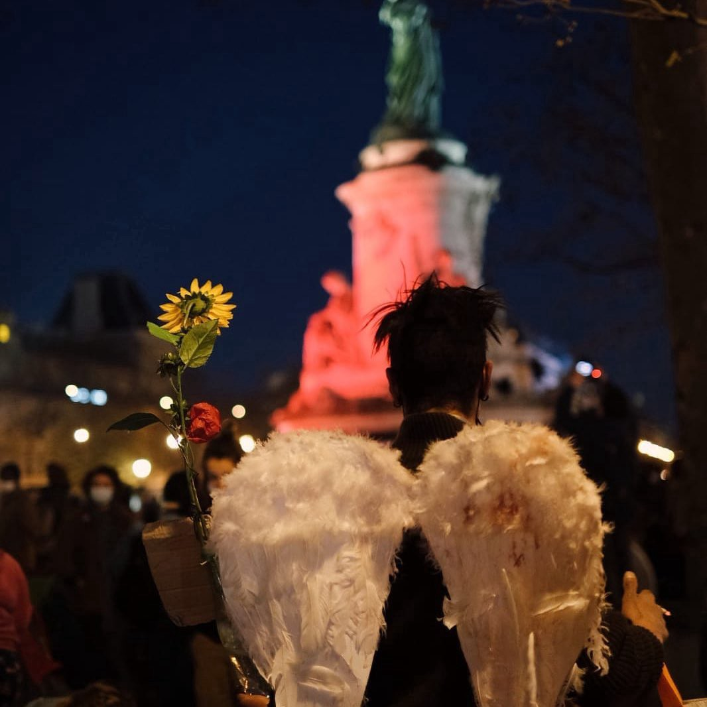
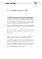
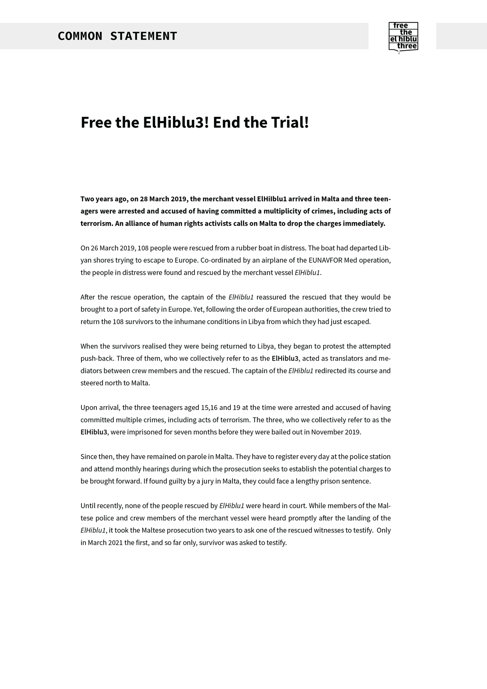
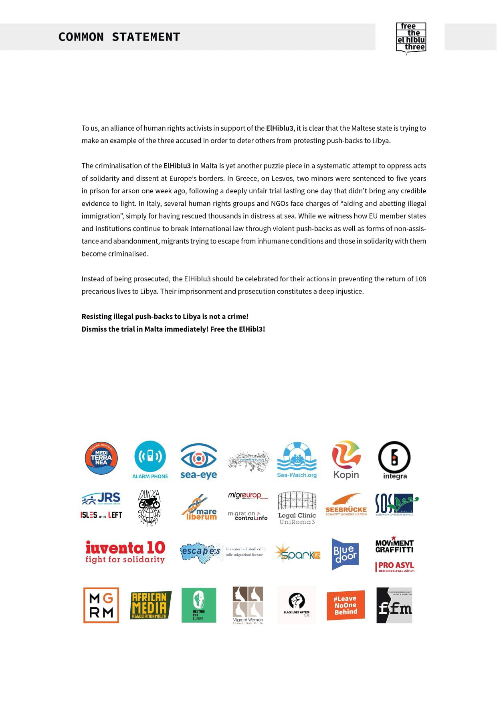
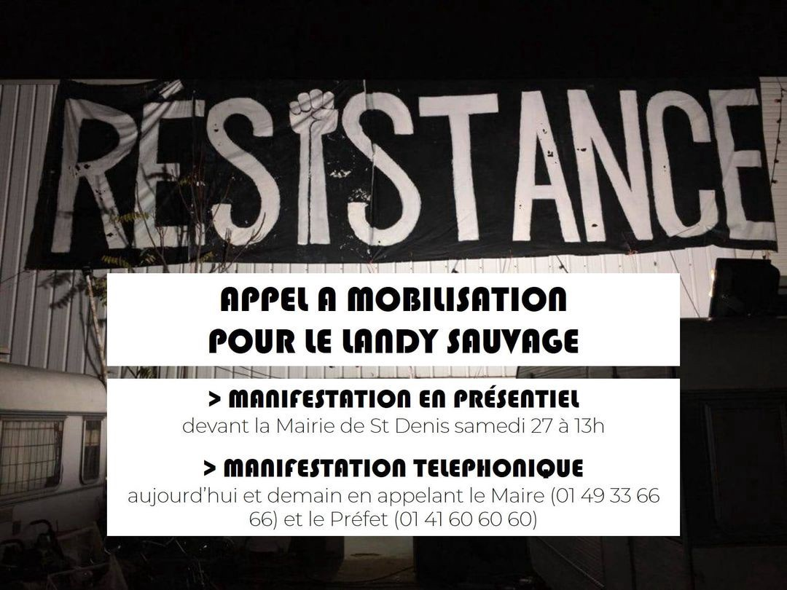
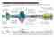
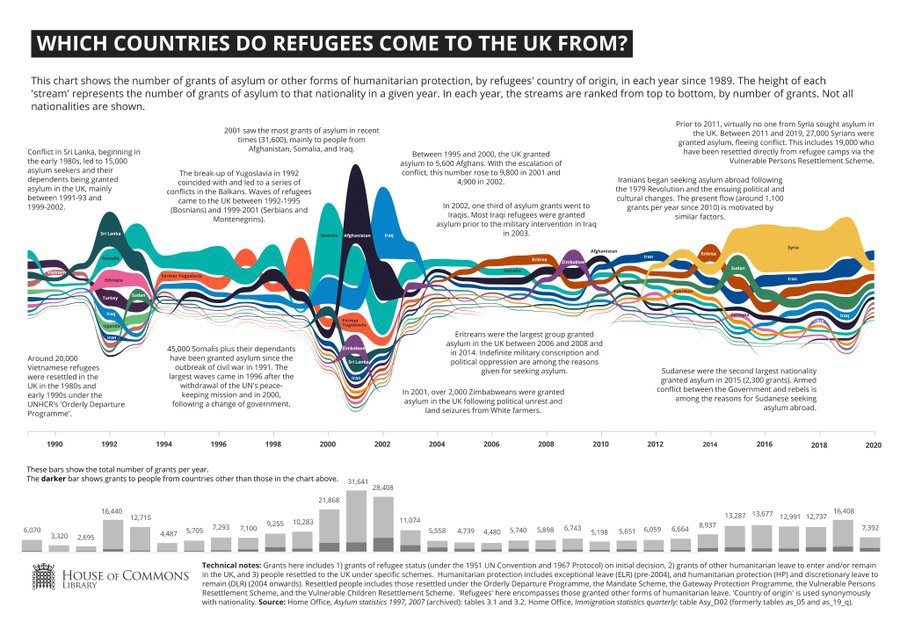

### AYS Daily Digest 26/3/21: Deported from Denmark to Somalia, where he has been sentenced to death
### French protest results in finding temporary shelter / Families struggling to reach their loved ones after tragic accident in Croatia / Austria still in denial and closed to those suffering on Lesvos / Legal: at which a person’s ‘minor’ status is assessed in order to determine whether that minor and another person are ‘family members’ / recommended reads & more

[Are You Syrious?](?source=post_page-----10aeae72092b--------------------------------)

[Mar 27](ays-daily-diges-26-3-21-deported-from-denmark-to-somalia-where-he-has-been-sentenced-to-death-10aeae72092b?source=post_page-----10aeae72092b--------------------------------) · 13 min read

### FEATURED

[Close Ellebæk](https://www.facebook.com/closeellebaekprison/?__cft__[0]=AZUib0YfFNQBLaTFB7TzmNzG3UkhxeD4PS6CtJKOB84rS2dzwmoVt3X8rlRPMpVl16ixhZdS7zSAJAM-3c4QSFY67qc_q1yOgqFVHa4cAqk2hn6e3x2fbdmJyNhtYt9VAn7Zszmnfo5LxnBy41Y1gnp2s41r88bdoXfmYstvAckoSQaX3AoiisYBiHi8pQxME3ChTv1TGQNM4Ir-WAP1S1af&__tn__=-UC%2CP-y-R) reports about a case of deportation from Denmark that pictures the current state of mind not only of the official Danish policies towards people in need of international protection, but also the general state of things in Europe when it comes to solidarity, compassion, commonly defined human rights and laws that are supposed to enable people to have a safe and dignified life and not work against them\. 
Zechariah fled Somalia due to several life\-threatening assaults committed against him\.

> _When he eventually had to leave Somalia, it was due to a death sentence issued against him\. Zechariah had done nothing wrong, but his brother had shot two people\. He was detained in center Ellebæk, where he was forcibly tested for COVID\-19\. Compulsory testing is a violation of human rights\. It violates the right to privacy and physical integrity, and is a method that the Danish government has made possible with the recent amendment of the Aliens Act \(L125\) \. After being forcibly tested, the date of his deportation was changed to the next day\. He was taken into custody by Somali Immigration Services, but since then nothing has been heard from him\._ 

Reportedly, he called after the flight saying he was entering Immigration, and that he would call back afterward\. However, he has not called back and one can only assume that he is imprisoned or dead\.

The infamous “ **Security for all Danes” Act** has been a part of the public debate in Denmark for a while now\.

36organisations coordinated by the European Civic Forum have now undersigned an Open Letter warning the government that such an Act would potentially limit civic freedoms in Denmark and undermine the country’s commitments to international human rights standards and European Union Law\.

> _Submitted to parliament in January 2021, the draft law follows previous measures by the government intended to address insecurity in vulnerable areas but which, in reality, sow division and inflame discrimination against excluded groups\._ 

### [Denmark: Reject discriminatory “Security for all Danes” Act and respect freedom of assembly](https://www.statewatch.org/news/2021/march/denmark-reject-discriminatory-security-for-all-danes-act-and-respect-freedom-of-assembly/?fbclid=IwAR2KIxUeB0LPmlDCxdYo26SJNTdc3Ba5YDaspTtsoAnk5aJMWv2cn0mcS5k)
### [Open letter signed by 36 organisations including Statewatch, coordinated by the European Civic Forum\. The letter is…](https://www.statewatch.org/news/2021/march/denmark-reject-discriminatory-security-for-all-danes-act-and-respect-freedom-of-assembly/?fbclid=IwAR2KIxUeB0LPmlDCxdYo26SJNTdc3Ba5YDaspTtsoAnk5aJMWv2cn0mcS5k)

[www\.statewatch\.org](https://www.statewatch.org/news/2021/march/denmark-reject-discriminatory-security-for-all-danes-act-and-respect-freedom-of-assembly/?fbclid=IwAR2KIxUeB0LPmlDCxdYo26SJNTdc3Ba5YDaspTtsoAnk5aJMWv2cn0mcS5k)
### MALTA
### Support for ElHiblu3

With official Europe criminalizing refugees and disregarding human rights, [the case of three young men](https://www.spiegel.de/international/europe/three-teenage-refugees-on-trial-in-malta-how-are-we-supposed-to-be-terrorists-a-9356645f-42bd-4342-9647-89f8dc8bbfb2?fbclid=IwAR1Ylz52m7Fu1VUdzSSM0VjdtY5GwQt5uXdGG9LX62Sale1iQk8yl6-3U6Q) who are [accused as criminals](https://l.facebook.com/l.php?u=https%3A%2F%2Fwww.aljazeera.com%2Fopinions%2F2021%2F3%2F25%2Fheroes-not-terrorists-the-trial-of-the-elhiblu3-in-malta%3Ffbclid%3DIwAR0xM5VcxyWjndSLdklxoUnBBPin-jL2TMIRGpxw2xKF6sgNwDiwx21-pgM&h=AT3KycK9ypXmXAkTCBIzXlvle2DbuGakyTviHM09xI0vvpFhTJ-OTwqCQotyd3AkTVLfq1ULbNqx5EXXGp4Ys7DbzaGN2ydlmI4Jaz8tWCoOpVXdu-JfmmKCMCcLgzrWlkOAHYY-pXrQQw&__tn__=R]-R&c[0]=AT01G01hQ93T95HwHVUMfeDx-YSXLN-fO81ru5PWLOufnOPIBgB4LDhDABFVNSkhBrYe2dVfVJAxs8KHqZS3-dPXpr3k3cZDwF5lgGaDtXfwxaNsdbgLxc2VVnMbqsjGZc9fzGGtcV17T-JqrXnicthPWuTFFyIcBUS4tC9LpD-TCPmt3YTjNe4U50XF6RmZZPjA70wQdLaPjvsqbg) for allegedly forcing the captain of a ship they were on to take them to Malta instead of back to Libya is getting more visibility and opening up a much wider story than one of the three youngsters\. Unlike the harsh accusations \(in spite of no proven case\), more and more people are seeing them as heroes for having diverged from the usual tragic path for at least these people and the lives of those around them\. The boys say they **saved more than 100 people, including children, from being returned to a country where they might have faced torture, rape, slavery and death\.**

A number of organisations have signed a common statement in support of the three:

Support is also getting stronger in other places across Europe:

…and some MEPs are now voicing concerns and support for Lamin \(17\), Kader \(18\) and Abdalla \(21\):

GREECE

Alarming appeals to the Commissioner ahead of her Greek visit

**Commissioner Johansson is called to _act to end the atrocious situation, whether by helping Greece utilise the 500,000 buildings which currently sit empty within its borders, or by making sure other EU member states offer decent places for these men, women and children to live in\. We implore you to act to end the suffering of these people\._ At the same time, the EC is praising the treatment of people on Chios\.**

After the Deputy Director\-General in charge of the “Task Force Migration Management,” Beate Gminder, together with a joint delegation from DG HOME and the Greek migration and asylum ministry, visited Chios, the usual speech thanking everyone took place as Gminder said she is “very glad to see that this money had been put to such good use and the many things that had been done\.”

In the midst of some of the most worrying reports on the state of things in the reception facilities across the Aegean, the heads of the EU keep stating incredible things, such as the most recent statement by Ms Ginder that “the people arriving in Europe that need protection were being taken care of\.” This will definitely not help anyone who needs help, nor will it change the corrupt and fallible institutions and organisations who have been entrusted with the task and, more importantly, with the funds, or the ever\-growing perception of Europe as incapable of “walking the talk”\.
As ECRE points out in their latest weekly bulletin,

A [Border Criminologies blog post](https://www.law.ox.ac.uk/research-subject-groups/centre-criminology/centreborder-criminologies/blog/2021/03/weaponising?fbclid=IwAR13QJSuOl-09ctVttGwuF2Dz_jSMOXsxNDj1OYj5g1DSlZ5mWvpzKdAJP4) reiterates the violent pushbacks from Greece to Turkey as well as abuse of migrants on both sides of the Greek Turkish border\. While the Reception and Identification Centre **VIAL on Chios** under gradual closure is **in [a deplorable state](https://www.efsyn.gr/ellada/koinonia/286381_anthropoi-kai-pontikia-sti-bial) ,** Minister of Immigration and Asylum, Notis Mitarakis [claims that a new controlled structure](https://samostoday.gr/%CE%BC%CE%B7%CF%84%CE%B1%CF%81%CE%AC%CE%BA%CE%B7%CF%82-%CF%83%CF%84%CE%BF%CE%BD-%CF%83%CE%BA%CE%AC%CE%B9-%CE%B7-%CE%BD%CE%AD%CE%B1-%CE%B4%CE%BF%CE%BC%CE%AE-%CE%B8%CE%B1-%CE%BB%CE%B5%CE%B9%CF%84%CE%BF/?fbclid=IwAR0-vf6MvaF0EJfNYMZacKMry-vxPn2nGAOBm2Ot0RAyEbfJ1P8XqAGwlKc) is well underway to replace the overcrowded Vathi camp on Samos\.

The lack of support and the barriers to access basic socio\-economic rights for beneficiaries of international protection in Greece creates homelessness and extreme deprivation\.

Ahead of the EU’s Commissioner for Home Affairs Ylva Johansson’s visit to Greece \(March 28–30\), some of the organisations wanted to update her with some information on what has been going on here since she last made an official visit, a little over a year since she was last in Greece\. Here is only a part of [what they wrot](https://www.koraki.org/post/one-year-on-we-need-your-help-commissioner) e:

“From 1 March 2020 \(which we know was a couple of weeks _before_ your visit\) to 21 March 2021, [4,554 men, women and children were registered as new arrivals at refugee camps](https://infocrisis.gov.gr/category/latest-info/national-situational-picture-regarding-the-islands-at-eastern-aegean-sea/?lang=en) on the Greek islands\. But in the same period, the Greek government has [expelled 10,898 people from its waters and from its land territory, in total disregard for international law](https://datastudio.google.com/u/0/reporting/1CiKR1_R7-1UbMHKhzZe_Ji_cvqF7xlfH/page/A5Q0) \. In one particularly terrible case, two teenage boys reached a refugee camp on Samos, in the Aegean Sea, where they intended to apply for asylum as is their legal right\.
Uniformed Greek officers took them out of the camp, claiming they \(the boys\) were being taken for COVID\-19 tests\. Instead, they were [forced onto a Greek coastguard vessel and taken out to sea, where they were dumped in an engineless life\-raft — effectively an inflatable tent — and set adrift](https://www.independent.co.uk/news/world/europe/greek-pushbacks-brought-to-european-court-after-child-refugees-placed-back-in-boat-and-abandoned-at-sea-b1812161.html?fbclid=IwAR0W7jE4CnxJxvHm79cPG16Lbqv0q5u_xEdcL6Dgxz00KJUA04r6bFHvngs) \.
That case has been registered with the European Court of Human Rights\.”

Read the entire letter here:
### [One Year On: We Need Your Help, Commissioner](https://www.koraki.org/post/one-year-on-we-need-your-help-commissioner)
### [Dear Madam Commissioner, Ms Johansson, Welcome back to Greece\. We hope you will enjoy your time here, but we are afraid…](https://www.koraki.org/post/one-year-on-we-need-your-help-commissioner)

[www\.koraki\.org](https://www.koraki.org/post/one-year-on-we-need-your-help-commissioner)

Lesvos

3boats arrived in less than 24 hours, with about 120 children, men and women on board the three vessels\. [Reportedly](https://stonisi.gr/post/15903/treis-varkes-se-24-wres?fbclid=IwAR3aWWeZeRB7GeDcsVxCD9SIdGiuCjT7bHRUPGWpk93QM-liC9R7u9LLIe8) , the first had 53 passengers of whom 47 were transferred to the quarantine structure in Megala Therma\. Allegedly, two people who were on board have yet to be found\. The 40 people who arrived in the second boat, in the area near Eftalou, were also transferred to the same quarantine\. In the third boat, 25 passengers arrived in the area of ​​Charamida\.

CROATIA

Days after the tragic accident, people still struggling to get in touch with their loved ones

The police have reported they are in touch with the family members of the four people who lost their lives in [the tragic lorry accident](/are-you-syrious/ays-daily-digest-22-03-21-4-people-die-19-injured-after-a-lorry-tragedy-on-a-highway-in-croatia-22ff9070a477?source=collection_home---7------2-----------------------) that took place on the A3 highway in Croatia, close to Okučani \(Slavonia\) \. The families have claimed the bodies of the deceased young people \(aged 17, 20, 21 and 26\) of Syrian origin whose path to a safer life ended tragically at the entrance to the EU\. Cousins and friends of some of the other people who were inside the lorry reached out to AYS for assistance in getting in touch with their loved ones, and also to receive information and help regarding further steps, as those affected did not receive any information as to what the options and plans are, and they still have not been able to get in direct touch with the people\. Together with a few other organisations in Croatia, we are doing our best to provide practical, legal and other information and to support the families of those who survived the accident\. 
However, once again we must point out that this is yet another in the long line of fatal endings to the endless attempts to flee insecurity and persecution by using the few options people still have at hand, as safe routes and possibilities of asking for international protection at the entrance to the EU are not available to them\.

AUSTRIA

Austria is still refusing to take in people from Lesvos

Insisting that helping people _in situ_ is better, Austrian officials are being confronted with the fact that there is nothing happening on that front, so they are now saying the country is supporting an orphanage and the school is currently closed due to Covid\-19 measures\. At the same time, Austrian activists and organisations are providing direct help to those already active on the ground running a school programme on Lesvos\.

FRANCE

A 10\-year old girl admitted to hospital after border trauma

A 10\-year old girl, victim of a mine explosion in Afghanistan, was deterred from entering France in a way that allegedly included weapons and [reportedly](https://www.pressenza.com/it/2021/03/respingimenti-al-confine-francese-bambina-di-origine-afgana-di-10-anni-in-ospedale-e-torino/?fbclid=IwAR2qBD-vdj5K2wOEhN9QiPhGTipKki0IY-vViCzCcYtJmOYdGEvzfBBHw0U) left the child in such a state that she was immediately hospitalised at the pediatric hospital in Turin\. What remains unclear is where the child and her parents were kept during the night, before they were handed over to the Italian police\. The same question remains for others who are stopped and detained at the border\. We will keep reporting about this in the coming weeks\.

Call for mobilisation in support

Hosted after Nuit de la solidarité

The recent Solidarity night gathering resulted in people being sheltered, at least temporarily… “After several hours of negotiations with the authorities, the associations obtained shelter for all of the migrants present in Place de la République\. Around midnight, the migrants were put on buses and directed to hotels or gymnasiums\. At 2am, the operation ended peacefully\.” [Read more](https://www.infomigrants.net/en/post/31139/paris-almost-500-migrants-given-refuge-after-new-occupation-in-place-de-la-republique?fbclid=IwAR0_9ksF1s6wmApFG6CWOC8fR1jSnTcWJHE_ilCa08P0lka0Q3O5vgBXm3Y)

Parisian volunteers of Utopia56 reported:

The success of this, after a protest that took place calmly and during just a few hours, demonstrates the counter\-productivity and dangerousness of the police presence when it intervenes in actions for safe haven\. In the evening, the police prefecture and the Minister of the Interior announced that **they condemned our action** , citing the current health conditions\. However, everything was in place to reduce the risk of the virus spreading\. And their reaction is particularly hypocritical, since the **prefecture is responsible for this precarious situation** , since it has the responsibility and the duty to house these people on the street\.

The success of this contrasts sadly with the scenes of violence and humiliations that are familiar sights on this same square of the Republic, having happened at the end of November, where the police prefecture intervened\.

“Dear prefect, you have a monopoly on violence\.”

The fight doesn’t stop\.

Tonight, thousands of people are still on the streets and every day hundreds of people are sinking into precariousness in France\. 
3 million vacant places were identified without counting the offices and empty premises, but the government refuses to enforce the law of requisition\. 
**We will continue to mobilize to find** 
**dignified and sustainable solutions for all\.**

In the immediate future, we will ensure that the window of hope opened last night for these 480 people supported is sustainable with long\-term accommodation and support solutions\.

We would like to thank all those who made this safe house a success and especially the volunteers and citizens involved in our actions\.

On behalf of the Requisitions collective,

Thank you and see you soon\.

Afghan journalist who fears for his life if sent back to Afghanistan awaits the French decision

A 27\-year\-old Afghan journalist, who worked in his country for a television station, belongs to the Hazara community, and currently seeks international protection from the French state is currently under house arrest in a hostel in Rennes\. After fleeing Afghanistan in 2015 due to claimed pressure from the Taliban, the man arrived in Sweden, where his request for asylum was denied\. In 2020 he applied for political asylum in France\.

The International Federation of Journalists and its French members of the SNJ and SNJ\-CGT appealed to the French authorities “to find a humanitarian solution to our Afghan colleague” who “must obtain without further delay a right of asylum in the homeland of the Declaration of Human Rights ”\.

A petition in support of the young journalist is available:
### [Signez la pétition](https://www.change.org/p/le-journaliste-afghan-elyaas-ehsas-ne-doit-pas-%C3%AAtre-expuls%C3%A9-non-%C3%A0-l-expulsion-dur?utm_content=cl_sharecopy_28018726_fr-FR%3A6&recruiter=712450475&recruited_by_id=b98327a0-29b1-11e7-b323-417f3cba9193&utm_source=share_petition&utm_medium=copylink&utm_campaign=psf_combo_share_initial&utm_term=psf_combo_share_abi)
### [Elyaas Ehsas, reporter de guerre afghan, a fui son pays en 2015 pour échapper aux talibans\. Menacé d’expulsion en Suède…](https://www.change.org/p/le-journaliste-afghan-elyaas-ehsas-ne-doit-pas-%C3%AAtre-expuls%C3%A9-non-%C3%A0-l-expulsion-dur?utm_content=cl_sharecopy_28018726_fr-FR%3A6&recruiter=712450475&recruited_by_id=b98327a0-29b1-11e7-b323-417f3cba9193&utm_source=share_petition&utm_medium=copylink&utm_campaign=psf_combo_share_initial&utm_term=psf_combo_share_abi)

[www\.change\.org](https://www.change.org/p/le-journaliste-afghan-elyaas-ehsas-ne-doit-pas-%C3%AAtre-expuls%C3%A9-non-%C3%A0-l-expulsion-dur?utm_content=cl_sharecopy_28018726_fr-FR%3A6&recruiter=712450475&recruited_by_id=b98327a0-29b1-11e7-b323-417f3cba9193&utm_source=share_petition&utm_medium=copylink&utm_campaign=psf_combo_share_initial&utm_term=psf_combo_share_abi)

SPAIN

Three deceased after a boat with more than 50 people on board overturned in the Tenerife area

A dinghy with more than 50 migrants on board has overturned\. A rescue was carried out in waters south of Porís de Abona, in Tenerife, and after the shipwreck, there are at least three dead\. A search for missing people is under way, report sources from Maritime Rescue and 112\. A search for more missing persons is being carried out with several helicopters and two Maritime Rescue boats\. The [media](https://www.abc.es/espana/abci-tres-fallecidos-volcar-patera-mas-50-inmigrantes-poris-abona-tenerife-202103261345_noticia.html?fbclid=IwAR3z6oPlMr4l0299eDjG828tFO64CuCfzkfhyy99WMVbn7gMSQmJb1Oiw2k&ref=https:%2F%2Fl.facebook.com%2F) have reported on the details of the tragedy\.

UK

The UK government’s new immigration plans ignore several crucial bits of information, Choose Love team says\. Check out their thread on the topic\.

GENERAL

Frontex pushbacks scandal & tech alert

A new [press release](https://l.facebook.com/l.php?u=https%3A%2F%2Ffrontex.europa.eu%2Fmedia-centre%2Fnews%2Fnews-release%2Fartificial-intelligence-based-capabilities-for-european-border-and-coast-guard-1Dczge%3Ffbclid%3DIwAR1iLA7vikjcFW46rH89l2df2sQTpIJfkzqafCFXYYct64zWjJIsqm2pE1g&h=AT1o9tMYBlLaK-jSPgcB8uPjKcB4uMoPaw4j9LeAY1dfdAllopVSK13b8l1_sCyYHhe5CaHPtrXpoIoWnpfA2wYiKP3aL9522LoKbafZpZfu73uDH6ER__XfHDfF38KhC7-v6EaFSymq3g&__tn__=R]-R&c[0]=AT21dvVSgwNwA3rid62HdMxAVVeQ-3SgEx8rwnYkZGlhXPUqAcb9bCYzcy5DxG_nVsGhVcHe8avJFH0qHlCfR1jw-3LYCYHIgVMD1xDxNPHSPt4jeYFqOKNhWy1CE3YOGtn2S-kDk4xyJW9diyMW_GbTCYGG9vbYXZNDAhTe73VbdLyqVLbQI9ECchoYx0Db2B3Yd4rLFEkaDmnBQA) states that the EU’s border and coastguard agency has commissioned a study on the use of AI for automated border control, geospatial data, and other purposes, wishing to contribute to the EU’s AI landscape\.

At the same time, the freshly published internal letters shed new light on the dispute between the Commission and Frontex over the agency’s controversial attempts to recruit new staff for its Fundamental Rights Office\. The correspondence outlines that the Commission’s services “have provided advice and support to the Agency to ensure that these recruitment in a timely manner\. It is regrettable that this process has not yet been finalised\.”

Regarding the vacancy notice for the Fundamental Rights Officer post, Johansson expresses concern that, “the initial provisions proposed by the Agency would have undermined the independence of the Fundamental Rights Officer and were in contradiction with the guidance provided by the Commission on implementing measures,” Statewatch [reports\.](https://www.statewatch.org/news/2021/march/eu-pushbacks-scandal-internal-letters-shed-light-on-frontex-s-fundamental-rights-recruitment-failures/?fbclid=IwAR0_9ksF1s6wmApFG6CWOC8fR1jSnTcWJHE_ilCa08P0lka0Q3O5vgBXm3Y)

‘Member States shall ensure that family unity can be maintained’

What point in time is to be taken into account for the purpose of **assessing whether the person eligible for protection is a ‘minor’** within the meaning of the third indent of Article 2 of the Qualification Directive?
On 25 March 2021, AG Hogan [published](https://curia.europa.eu/juris/document/document.jsf?text=&docid=239281&pageIndex=0&doclang=EN&mode=req&dir=&occ=first&part=1&cid=538497) an opinion in Bundesrepublik Deutschland v SE \(C‑768/19\), ECRE features in their ELENA report\.

As the Qualification Directive respects the fundamental rights and the principles recognised by the [Charter](https://eur-lex.europa.eu/legal-content/EN/TXT/?uri=CELEX:12012P/TXT) including _inter alia_ [Article 7 and Article 24 of the Charter](https://eur-lex.europa.eu/legal-content/EN/TXT/?uri=CELEX:12012P/TXT) \. In that regard, AG Hogan suggested that **Article 2 must be interpreted in the interests of the child concerned** and with a view to promoting family life\.
- They consider that the relevant point in time for assessing the ‘minor status’ is the date on which they applied for international protection, provided that the minor in question had applied for international protection as a minor and provided that both family members were present in the state prior to the child reaching age of majority\.
- The right of family members to claim the benefits referred to in Articles 24 to 35 of the Qualification Directive **persist after the beneficiary of subsidiary protection reaches the age of majority, for the duration of the period of validity of the residence permit granted to them** \.

EU — Turkey deal anniversary aftermath

The 2016 statement set out a roadmap to improve living conditions for Syrian refugees in Turkey and open up organized, safe and legal channels to Europe for them\. — But did it, really?
While thousands of those whose lives have been affected by the deal, as well as the entire humanitarian sector heavily criticise the “Deal”, with IRC calling it a [“stain on the European Union’s human rights record and people in search of protection](https://www.infomigrants.net/en/post/30934/turkey-migration-deal-a-stain-on-eu-rights-record) \(…\) continue to pay the price,” the heads of the two parties seem to find their interests satisfied to the point of having the nerve and call the Agreement satisfying\. The German Chancellor even [said](https://www.infomigrants.net/en/post/31135/merkel-supports-eu-turkey-deal-on-migration?fbclid=IwAR219eN7mq0VMG-2zwjBJJ-mc5dkUriIu1x3AS8oixvhpM6dj9O9U7_OpEw) it “has helped many, many refugees\.”

In a recent [interview](https://l.facebook.com/l.php?u=https%3A%2F%2Fwww.aa.com.tr%2Fen%2Feurope%2Finterview-humane-borders-control-through-cooperation-possible-turkey-eu-can-show-the-way%2F2188978%3Ffbclid%3DIwAR3Z1MdR-O71RtkoUgyj7HCqL04oF8mUoF4LzO_4oMb8X8ql-71F4YOoTw4&h=AT3UlPrRYS40NNZhF1esuxqIqn9FYTOfPkOHY1vxc0SBA6pQfMyXjz25QjSz8kh3ZXziupFRmAL1T6VoibshMrJOxgY30zg9LP0n9Ao0W0tFOo4LeijqmpIlMHUyUm4KOYpZg0VJBF7ztw&__tn__=R]-R&c[0]=AT21dvVSgwNwA3rid62HdMxAVVeQ-3SgEx8rwnYkZGlhXPUqAcb9bCYzcy5DxG_nVsGhVcHe8avJFH0qHlCfR1jw-3LYCYHIgVMD1xDxNPHSPt4jeYFqOKNhWy1CE3YOGtn2S-kDk4xyJW9diyMW_GbTCYGG9vbYXZNDAhTe73VbdLyqVLbQI9ECchoYx0Db2B3Yd4rLFEkaDmnBQA) , the architect of the EU\-Turkey Statement answered questions on what has happened since the statement, whether any real progress has been made, and what lies ahead for Turkey and the EU\.

**WORTH READING & WATCHING**
- What did you do when you were eighteen, all the time was yours and you had your life ahead of you? You were lucky to have that space to dream, to project yourself into a future in which you were the protagonist and actor\. Bilal, however, has spent a year and six months waiting\. Yes, waiting and nothing more\.

### [BATTLES WON](https://en.solidarywheels.org/post/battles-won?fbclid=IwAR1iLA7vikjcFW46rH89l2df2sQTpIJfkzqafCFXYYct64zWjJIsqm2pE1g)
### [What did you do when you were eighteen, all the time was yours and you had your life ahead of you? Bilal has spent a…](https://en.solidarywheels.org/post/battles-won?fbclid=IwAR1iLA7vikjcFW46rH89l2df2sQTpIJfkzqafCFXYYct64zWjJIsqm2pE1g)

[en\.solidarywheels\.org](https://en.solidarywheels.org/post/battles-won?fbclid=IwAR1iLA7vikjcFW46rH89l2df2sQTpIJfkzqafCFXYYct64zWjJIsqm2pE1g)
- An interview supporting the reports from other sources on this case:
Greeks protesting against the hard\-right government have been confronted with violent police repression on the streets\. An activist ho was arrested after a protest against police violence and was beaten up, tortured and even encouraged to suicide:
- Nearly three in four bodies of those who have perished in the Central Mediterranean remain lost at sea, meaning tens of thousands of families are searching endlessly for those lost:

### [Maritime Migration to Europe: Focus on the Overseas Route to the Canary Islands](https://publications.iom.int/books/maritime-migration-europe-focus-overseas-route-canary-islands?fbclid=IwAR2gqGOwc-2ME7knAemTphCJdGWAaKfztPu9cglBxSf-i2jSJXclvn4KRY4)
### [Irregular maritime migration to Europe, contrary to popular conceptions, is less an issue of migrant arrivals and is…](https://publications.iom.int/books/maritime-migration-europe-focus-overseas-route-canary-islands?fbclid=IwAR2gqGOwc-2ME7knAemTphCJdGWAaKfztPu9cglBxSf-i2jSJXclvn4KRY4)

[publications\.iom\.int](https://publications.iom.int/books/maritime-migration-europe-focus-overseas-route-canary-islands?fbclid=IwAR2gqGOwc-2ME7knAemTphCJdGWAaKfztPu9cglBxSf-i2jSJXclvn4KRY4)

**Find daily updates and special reports on our [Medium page](https://medium.com/are-you-syrious) \.**

**If you wish to contribute, either by writing a report or a story, or by joining the info gathering team, please let us know\.**

**We strive to echo correct news from the ground through collaboration and fairness\. Every effort has been made to credit organisations and individuals with regard to the supply of information, video, and photo material \(in cases where the source wanted to be accredited\) \. Please notify us regarding corrections\.**

**If there’s anything you want to share or comment, contact us through Facebook, Twitter or write to: areyousyrious@gmail\.com**

_Converted [Medium Post](https://medium.com/are-you-syrious/ays-daily-digest-26-3-21-deported-from-denmark-to-somalia-where-he-has-been-sentenced-to-death-2e63f9bbf9b4) by [ZMediumToMarkdown](https://github.com/ZhgChgLi/ZMediumToMarkdown)._
