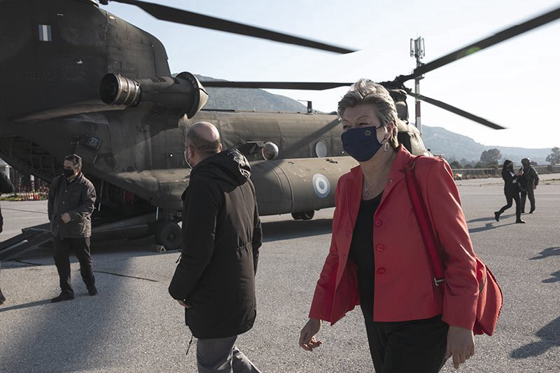
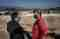
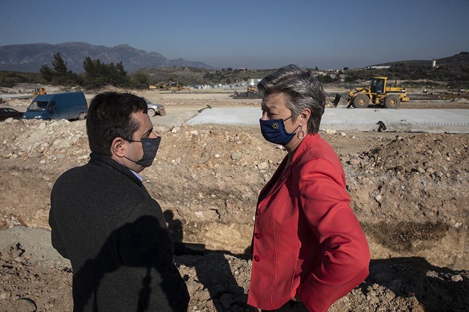
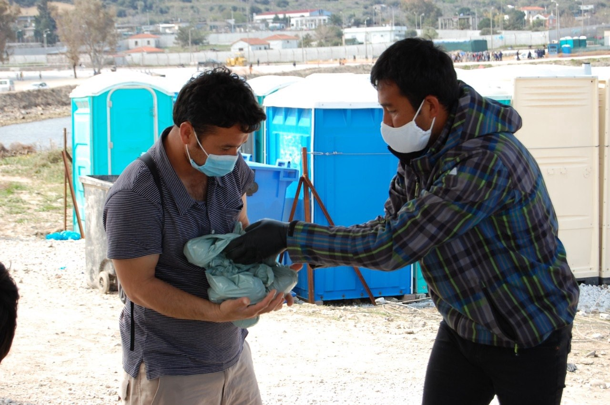
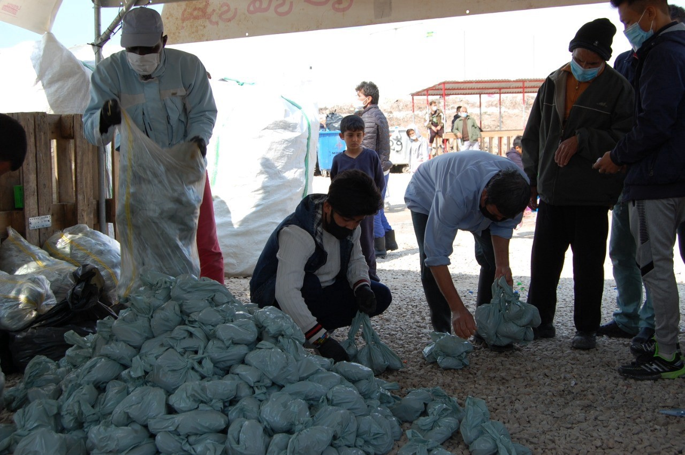
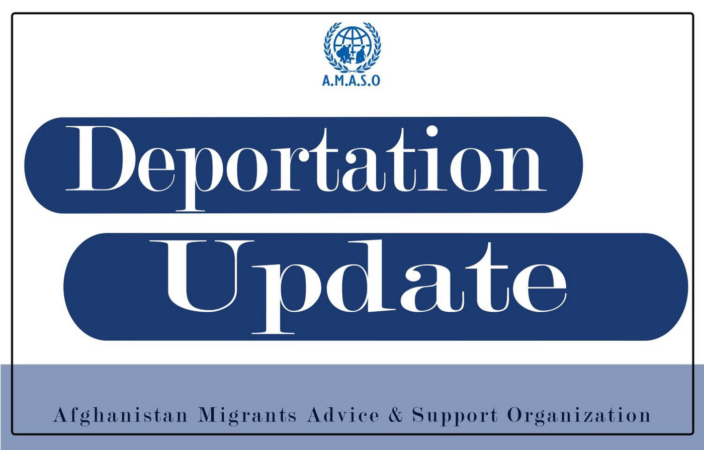

### AYS Daily Digest 29/03/21 Johansson visited Greek refugee camps like a prison warden

[Are You Syrious?](?source=post_page-----8bf86d4eec64--------------------------------)

[Mar 30](ays-daily-digest-29-03-21-johansson-visited-greek-refugee-camps-like-a-prison-warden-8bf86d4eec64?source=post_page-----8bf86d4eec64--------------------------------) · 9 min read

_Also pushback reports in Greece // new rescues at sea // deportations from Sweden // low asylum approvals in Germany // and more…_

### FEATURE: EU home affairs commissioner Ylva Johansson visited Greek refugee camps like a prison warden

On Monday 29th March, EU home affairs commissioner Ylva Johansson finally visited the new reception centre on Samos and then Moria 2\.0 on Lesvos\. Her stated mission was to learn how to prepare the camps for the next winter\.

As we detailed in [AYS’s Weekend digest](ays-weekend-digest-27-28-3-2021-italian-french-border-eviction-of-the-casa-cantoniera-c80f108b413c) , there were some “improvements” made before her visit to improve the “look” of the camps\. [This included](https://twitter.com/MortazaBehboudi/status/1376104319620165632) people building a basketball field in Moria 2\.0 and people cleaning around the front of the camp where the visit would take place\.

**SAMOS VISIT:** Johansson went to Samos first, met with Greek Migration Minister Mitarakis and looked around “the new reception and identification centre under construction at [Zervou\.](https://twitter.com/YlvaJohansson/status/1376440492351709186) ” She also met with [some locals](https://twitter.com/daphnetoli/status/1376497886138150913?fbclid=IwAR2v8fyQwhEHNm52eSQC3eJ7KDn8ko5bnjXHi3NGzZtADzboFLf7zfqnlWA) , of which some were quite angry, saying that “she was unwelcome” on Samos\. After Johansson was helicoptered onto Samos, [Alarm Phone](https://thecivilfleet.wordpress.com/2021/03/29/top-eu-official-condemned-for-window-dressing-the-containment-of-refugees/?fbclid=IwAR2AQ3TZsXcyMx9clAAMTjtb6tt7aa7RuZQHfQFR9VX25m9cqr6VBqhbaD8) made this comparison:

> _“Ylva Johansson’s visit to the camp on Samos is equivalent to a warden’s visit at the prison they manage\.”_ 

**LESVOS VISIT:** Then Johansson went to Lesvos where [reports say](https://twitter.com/f_grillmeier/status/1376485874943340546) all the residents in the camp were screaming “Freedom\! Freedom\!” after she arrived at Mavrovouni’s “temporary” camp\. Yousif Al Shewaili, a photographer from Iraq, witnessed her arrival and reported on [his IG](https://www.instagram.com/p/CNAAlH6pOh7/) :

> _“Johansson arrived at the camp by … military helicopter\. A crowd of residents gathered to greet her and make their voices heard, as main stakeholders\. But she quickly got into a car surrounded by a lot of riot police by walk and cars\. And they crossed the camp to go directly to a new large tent that they are building, all clean and brand new, not yet inhabited, before exiting through the emergency gate after five minutes \(without even going out of the car\) \._ 
 

> _I don’t see how in less than ten minutes, in a car, she was able to assess the quality and viability of the camp\. Europe forces thousands of humans to live in these camps for years to come, but the leaders do not bother to stay there for a few hours and listen to the residents\. ‘No more Moria’ they said, but for them we already don’t exist in their eyes, they don’t look, why stop what ‘doesn’t exist?’”_ 

**LESVOS PRESS TOUR:** There was also a police\-escorted “press tour” through the camp that many journalists described as shameful because so much was hidden from them\.

[Moria White Helmets](https://www.facebook.com/MoriaWhiteHelmets/posts/292325719077161) said that, even though refugees weren’t officially allowed [to talk to the press](https://twitter.com/MortazaBehboudi/status/1376549715437883395?fbclid=IwAR3jfzMNMxQ8Tsc6cVjGJCe-9xx0ChipgFJhWhXIqEg3mWLc5UzDoIWx3jY) , they were able find a way to talk to some journalists, something they have not been able to do in a while\.

[Stand by me Lesvos](https://www.facebook.com/SBMLesvos/posts/842271589699198) agreed, saying _“It’s good, journalists can at least once again enter the camp for the first time in months and report from inside\. They were not allowed since the beginning of 2021\.”_

Journalist [Petra Molnar](https://twitter.com/_PMolnar/status/1376556109113212938) said, however, that in the end _“We were not to easily able talk to anyone about their experiences\. We were escorted out as people voiced their hurt and frustration, shouting for liberation and safety for their babies as the metal doors slammed shut on the crowd\.”_

**JOHANSSON PRESS CONFERENCE WITH MITARAKIS:** After “touring” the camp, Johansson and Migration Minister Mitarakis held a press conference\.

Mitarakis [continued to deny](https://twitter.com/connellyandrew/status/1376515455758778368?fbclid=IwAR10OJ4AJgQnItv5ue5Db475038dHsNZKfOBw0_Jobu_XfvhRvlUWormawM) that the Greek coast Guard is involved in pushbacks, something which has continuously been documented\. [Johansson](https://twitter.com/xoriskanape/status/1376515523278692354) did say, however, that _“the Greek authorities can do more when it comes to investigating these pushbacks and clarifying them\.”_

But in perhaps the biggest news, [Johansson confirmed](https://twitter.com/f_grillmeier/status/1376505409675071488) :

> _“We have over 155 million euros dedicated to building reception centres on Lesvos and Chios\. In addition, a further 121m for smaller centres on the islands of Samos, Kos and Leros\. In total over a quarter of a billion euros\.”_ 

There does seem to be a difference of opinion between EU leaders and the Greek government as to whether or not these camps will be closed structures\. Journalist [Franziska Grillmeier](https://twitter.com/f_grillmeier/status/1376509768009928707) articulated _“While Mitarakis just explained, that the new planned camp will have a controlled exit & entry, while being fenced outside and around different sections inside, there is still a gap btw\. EU saying camps will not be closed & Greek authorities emphasize semi\-closure\.”_

Johansson also “explained” that the problems of the last five years in refugee camps can be attributed to “a lack of Europeanised migration policy\.” But of course the EU\-Turkey deal and the conditions on the Greek islands were all apart of a “Europeanised” strategy:

Overall, journalist [Petra Molnar](https://twitter.com/_PMolnar/status/1376492846707056648) provided an excellent thread detailing the conference and ended with this summary:

**LOCALS’ PROTEST:** Outside the press conference, there were also protests by locals, many of whom have a huge problem with their home towns and island being turned into sites for detention centres\.

Journalist [Giorgos Christides](https://twitter.com/g_christides/status/1376470748081045505) also reported that _“\(The\) regional governor of North Aegean is cancelling meeting with commissioner Johansson\. \(He\) received \(a\) standing ovation from Lesvos protestors, says ‘I will not appear at all\.’ He is against new Camp, though member of ruling Nea Dimokratia party\.”_

**REFUGEES REACTIONS:** Of course refugees themselves had many reactions of disappointment to Johansson’s refusal to meet with them\. Moria Corona Awareness Team said of her visit:

> _“Peoples got potatoes for empty bottles from us today and they like it a lot\. Is always a lot of work, because 1500 packs of potatoes need to be packed in the warehouse before\. And again 15\.000 bottles left camp to recycling\. Really we would have like to meet the lady from EU also to show her these activities, how refugees manage themselves and could be also partners\. But they are not interested in what refugees think and do\. This is what we understood long time ago and this is very sad and depressing\.”_ 

**OVERALL:** In an open letter to Johansson, [MSF](https://www.msf.org/letter-ylva-johansson-she-visits-lesbos-greece?fbclid=IwAR3Np-bBcn0mhsTeCeeyAP1BurLOa5D3FJbA6ZpRaI8lS_0B_F0YPDc7NTg) summed up a prevailing human rights perspective on her visit:

> _“Ms\. Johansson, playing with words to brush over the same harmful policy is not convincing any more\. You cannot repackage the same destructive ideas and tell us they will be more humane\.”_ 

> _“If you insist, for the sake of political compromise, on promoting and replicating the same model that has created so much harm and suffering, your “No more Morias” will be only empty words and slogans\. And new Morias will continue to be built again and again\.”_ 

Funding for five new camps on the islands will never be the humane answer\. Johansson’s visit provides proof that the EU is not ultimately concerned with protecting human rights\. AYS will of course continue reporting on these issues as they unfold, including Johansson’s meetings in Athens for Tuesday’s digest\.
### SEA
### GREECE
### Reports of another pushback on Sunday

According to [Aegean Boat Report](https://www.facebook.com/AegeanBoatReport/posts/1054809958375441) :

> _“In the early hours of Sunday, March 18, 35 people, 10 of them children, climbed into a fragile rubber boat on the Turkish shore of Ayvacik, their destination was Lesvos\._ 
 

> _After a few hours the boat crossed into Greek waters heading towards Tsonia, Lesvos north east\. At 02\.50 am the boat was stopped by the Hellenic coast guard, inside Greek territorial waters, /and its/ position, together with several videos, was sent to Aegean Boat Report\. It’s dark, we can’t see much in the videos, but what we can hear leaves no doubt as to what is going on, yet another pushback is taking place\._ 
 

> _The engine on the boat was destroyed, a common practice used by the Greek coast guard to prevent people seeking safety in Europe from reaching the Greek Aegean islands\. The boat was towed into Turkish waters by the Hellenic coast guard and set adrift, 35 people helplessly drifting, left in a life\-threatening situation by the hand of the a coast guard that above all should preserve life, rescue people in distress, by all means possible\.”_ 

### Nine people were arrested for attempting to leave Greece as a volleyball team

According to Keep Talking Greece _“Authorities at the Athens international airport arrested nine Syrian nationals with forged travel documents\. The group, dressed in sports outfits, was posing as a volleyball team\. According to police, the nine young men had fake identity cards of a foreign country\. They wore matching sports uniforms, to look like a volleyball team\.”_ Apparently they were trying to go to Vienna and this is not their first time dressing up as a sports team in order to try to leave\. More [here](https://www.keeptalkinggreece.com/2021/03/29/greece-migrants-syrians-volleyball-team/) \.
### GERMANY

German media MiGAZIN reports:

> _“Only 18 percent of the refugees rescued from distress at sea and transferred to Germany were granted international protection status or a ban on deportation was established\. 78 percent of the asylum applications were rejected, in 4 percent of the cases the proceedings were discontinued\. The federal government announced this in an answer \(available to the MiGAZIN\) to a parliamentary request from the left\-wing parliamentary group\._ 

> _The asylum seekers were admitted as part of the relocation procedure \. The aim is to relieve EU member states with heavily used asylum systems by transferring asylum seekers to other EU states\. The asylum seekers should then go through their asylum procedures there\.”_ 

Read in full [here](https://www.migazin.de/2021/03/29/abschiebepate-deutschland-mehr-prozent-seenot/?fbclid=IwAR1DzRZdbTdtd0FGH3n2x7etuGFumlBZk9CUCnj-5zVnTFVo8fXw2a6ZFhs) \.

**New petition:** _“What is the aim of the petition? The Thuringian state government should consistently campaign for the humanitarian admission of refugees from the Greek camps\! The present petition calls on the Thuringian cabinet to agree to take legal action against the blockade of the Federal Ministry of the Interior and its minister in order to enable the Thuringian state reception order for refugees from the Greek misery camps to be implemented\. In order to go this way, the petitioners further demand that the state of Thuringia join the action brought by the Berlin Senate against the Federal Ministry of the Interior in order to enforce the unlawfully refused agreement to the Thuringian state admission order by legal means\.”_ Find it [here\!](https://petitionen.thueringer-landtag.de/petitions/2088?fbclid=IwAR3Oh2qFt71dAYUQVBb9q_bsJNPAiEghAMVqVbxyn_693zMXNpVED_hGvMs)
### SWEDEN

### EU/FRONTEX

[Respond Migration](https://respondmigration.com/policy-briefs/safe-guarding-accountability-and-fundamental-rights-compliance-of-the-frontex-policy-brief?fbclid=IwAR1CpMj9k8Mx8ujqj9Jd1gRLBLOy9THzCEeKF2K5YwxeUboYNRAt0Grj2xU) also noted in a policy brief:

> _“We concluded that these mechanisms \(to safeguard accountability within Frontex\), introduced since 2011 and gradually strengthened over time, still fail to guarantee fundamental rights compliance and accountability in cases of violations\. We therefore recommend that these structural shortcomings should be urgently addressed through a reform of the Agency’s mandate and their subsequent implementation be monitored externally\.”_ 

### WORTH READING/WATCHING
- Watch [**Young Gifted & Blocked**](https://www.webelong.org.uk/young-gifted-and-blocked?fbclid=IwAR1UwS7rUMLeUwFoOOgkXmzTntD7x9QlQ-l6sTqpX5qkOvICNYMZvjn05lQ) on YouTube about the UK _“From September 2012, young migrants with Limited Leave to Remain \(LLR\) had to wait 10 years after receiving their status before they could access student finance\. With the help of Just for Kids Law, we intervened in a Supreme Court case regarding this matter and overturned the rules\.”_
- Read this [Guardian](https://www.theguardian.com/commentisfree/2021/mar/28/priti-patel-your-asylum-plans-will-help-women-let-me-introduce-you-to-gloria?CMP=Share_iOSApp_Other&fbclid=IwAR2mFx2Zn-75GACa6VMLcAcPlDUi2UoidAkvvD9TBL-VLCIPdJBAXZ3bi2Y) opinion piece **“So, Priti Patel, your asylum plans will help women? Let me introduce you to Gloria\.”**

**Find daily updates and special reports on our [Medium page](https://medium.com/are-you-syrious) \.**

**If you wish to contribute, either by writing a report or a story, or by joining the info gathering team, please let us know\.**

**We strive to echo correct news from the ground through collaboration and fairness\. Every effort has been made to credit organisations and individuals with regard to the supply of information, video, and photo material \(in cases where the source wanted to be accredited\) \. Please notify us regarding corrections\.**

**If there’s anything you want to share or comment, contact us through Facebook, Twitter or write to: areyousyrious@gmail\.com**

_Converted [Medium Post](https://medium.com/are-you-syrious/ays-daily-digest-29-03-21-johansson-visited-greek-refugee-camps-like-a-prison-warden-28e45e064603) by [ZMediumToMarkdown](https://github.com/ZhgChgLi/ZMediumToMarkdown)._
