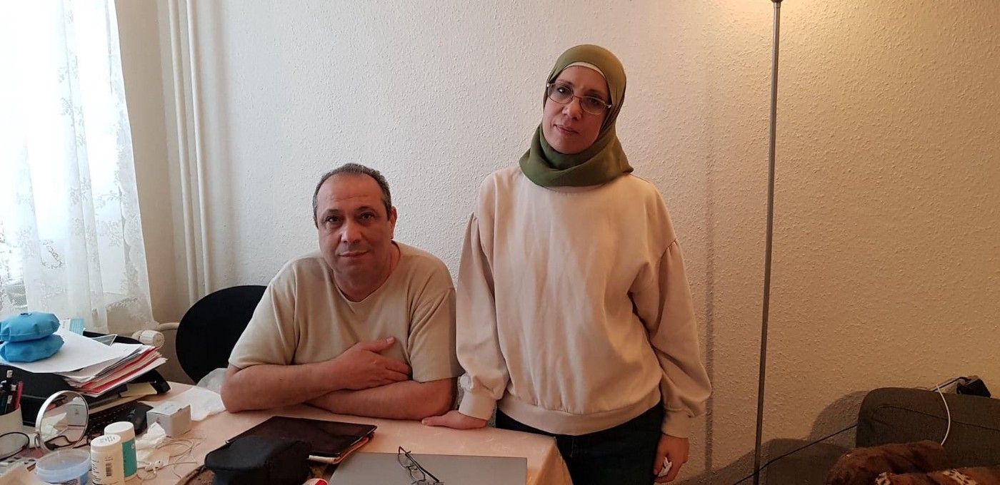
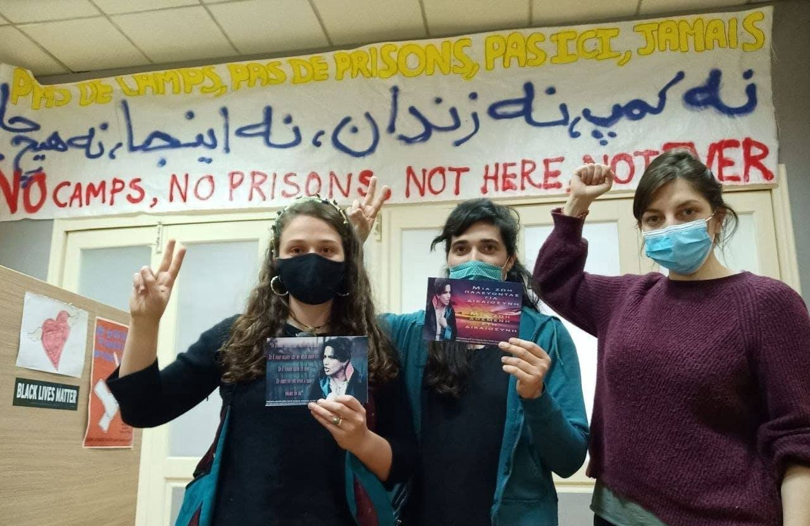
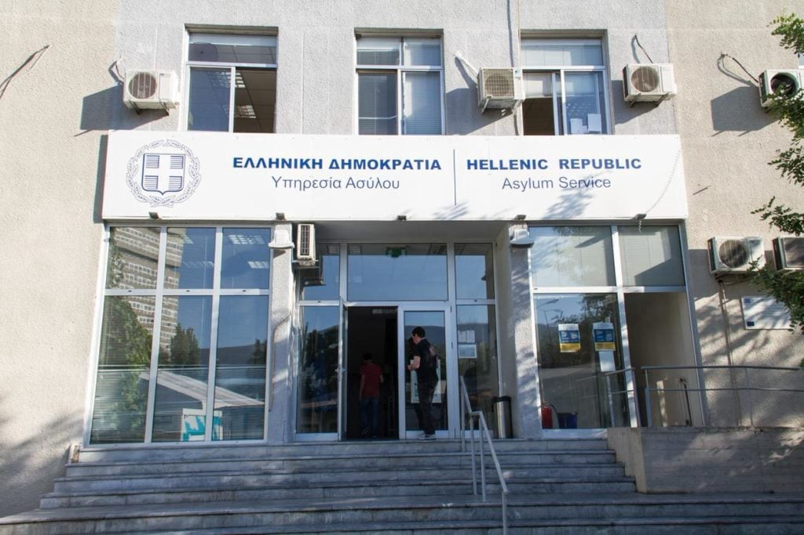
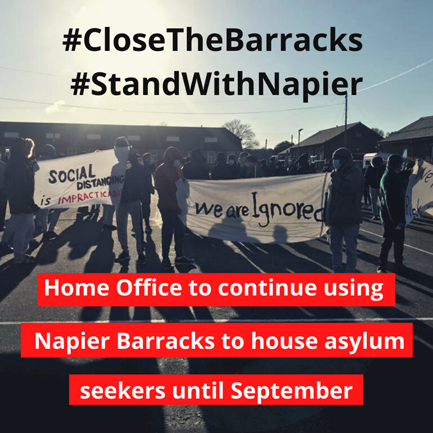

### AYS Daily Digest 05/04/21 “What have I done wrong?” Denmark revokes 94 Syrian’s asylum statuses and residency permits

[Are You Syrious?](?source=post_page-----4cd5a637588f--------------------------------)

[Apr 6](ays-daily-digest-05-04-21-what-have-i-done-wrong-4cd5a637588f?source=post_page-----4cd5a637588f--------------------------------) · 12 min read

_Maltese Prime Minister to go to Libya // pushbacks in Greece // 270 people finally arrive in Lampedusa // deportations scheduled from Germany to Afghanistan // and more…_

### FEATURE: The people behind Denmark’s revocation of asylum statuses and residency permits for 94 Syrians

It has been a tough time for Syrians in Denmark with 94 losing their residency permits and asylum statuses, having to come to terms with their seemingly inevitable, forced deportations\.

These are some of their stories\.

One that has already gone viral on social media is 19\-year\-old high school student Aya Abo Daher\. According to Danish news [TV2\.DK](https://nyheder.tv2.dk/samfund/2021-04-02-udvisning-af-gymnasieelev-vaekker-forargelse-hvad-har-jeg-gjort-forkert?fbclid=IwAR25WOdJEeM7A1wLHlOwGKnHJ5w5Rg2ZC7KnJkERWbFr7pUb6WPUEg6zq2Q) :

“In 2015, she and her family fled the Syrian civil war and the regime of President Bashar al\-Assad, and until now they have had a temporary residence permit in Denmark\. Aya Abo Daher has attended language school, the local primary school in 7th to 9th grade, 10th grade at Nyborg Gymnasium, and now she is three months from becoming an HF student from the school\.

But on Wednesday, during a summer house trip with her friends, she was informed that her residence permit has not been extended\. ‘What did I do wrong? It is not safe for me to come back and I have done my best in Denmark\. I felt so alone,’ she tells TV 2 Fyn\.”

In a later post they [reported](https://nyheder.tv2.dk/samfund/2021-04-02-tesfaye-afviser-hjaelp-til-udvist-gymnasieelev-det-kommer-ikke-til-at-ske?fbclid=IwAR0jg35ohm8gWw58pKCG5h7vN61zTJmKJxEZVGN5B3buRdQJZ2EZihCqN60) :

“\(Daher\) has to come to terms with the fact that she has to leave the country\.

It strikes Minister of Foreign Affairs and Integration Mattias Tesfaye \(S\) on Friday night in front of TV 2\. ‘We need to have some principles\. The law is equal for everyone, and even if you have started a business or done well or poorly in high school, we have the same rules and they apply to everyone,’ he says\.

It happens after both SF, Enhedslisten and Radikale Venstre told TV 2 on Friday that they will try to help Aya Abo Daher and her family to stay in the country\. But according to Mattias Tesfaye, the government will not ‘pick a single case out of the pile’ and treat it separately\.”

In another case, [AnneLise Marstrand\-Jørgensen](https://www.facebook.com/permalink.php?story_fbid=10159364061207299&id=536777298) provided an excellent but tragic overview:

“It is not only young people from Syria who are deprived of their residence permit these days\.

**Asmaa and Omar Al Natour originate from Daraa in Syria, where the first protests against Assad regime broke out ten years ago\.** She was a school teacher, he was an employee of the Ministry of Agriculture and from the beginning they distanced themselves from the violence and oppression\.
At their two sons’ school, students critical of the regime were forced to spend their days in the so\-called ‘black space’ where torture was on the table\.
When the family home was bombed, they fled to the Yarmouk camp south of Damascus\. The area was soon cut off from the outside world, /the/ Assad regime closed water and electricity to hit the rebellious residents of the district\. Many of you probably remember the violent images from the city’s siege — starvation, complete destruction and great distress\.

**They were both wanted by the regime for their dissent\. Their eldest son was called to Assad’s army and had to escape before the others\. It was only a matter of time when the youngest was also summoned\.** 
The escape was exactly as horrific as we can imagine: Three days on foot through the Algiersian desert, assaulted and robbed of almost everything in Libya, on with a crowded boat to Europe\.Great was the relief when they were finally united with their eldest son\. They all got asylum, life could just start again\. In a country they quickly cared about, a country that set democratic values and human rights high and let them believe that they could finally leave the horrors behind\.

**Asmaa and Omar and their sons did everything we want refugees to do:** they learned Danish\. Asmaa started educating, Omar took a truck driver’s license and opened a green dealer, the sons found their way through the school system and today read both IT educations\. They are happy that everyone in their little family came out with their lives\. They are causing the loss of the many family members and friends in Syria that were killed\.

At the end of February they received a letter from the Immigration Board\. The Danish government is considering that Syria is a safe country again and they are therefore deprived of their residence permit\. Their sons can stay in Denmark\.”

“Asmaa describes it as if the earth disappeared under their feet that day\. Omar was admitted with a stroke shortly after receiving the letter\. They are both sure it was the shock that triggered it\.”

“There are many reasons why they can’t travel home:

1\) **They are both wanted by the Syrian regime and will be arrested as soon as they set foot on Syrian soil\.** When Denmark thinks Syria is a safe country, it is all about bombs and acts of war, while the regime has not been taken into account: atrocities, arrests, torture, disappearances\. Or because people like Asmaa and Omar have nothing to return home to\. Other than ruins, the poverty of Damascus and the light\-living, horrific memories\.

2\) **They have to say goodbye to their sons\. Maybe forever\. For the sons cannot travel to Syria without being killed\.** And Syrians do not get a visitor visa to Denmark\. Imagine that for a moment: having to never see your children again\. Not being there when they finish their education, when they get married, have children\. Not being able to eat with them, not being able to embrace them\.”

“Asmaa and Omar are doing well here\. They’re on their feet\. Now it’s all over again\. With double force because they thought they were safe\. This is how we treat people in Denmark\. I know, there are many of us who don’t back up\.”

More stories reported by Danish\-American activist Alysia Alexandra:

And we would be remiss if we didn’t include Akram Bathiesh’s story again:

If any Syrians are deported back to the danger from which they rightfully fled, Denmark will be responsible for the resulting tragedies\. **Denmark: Syria is not safe\. All of these people are contributing to Danish society and will face horror if returned to Syria\.** AYS will continue to report on these stories as more information becomes available\.

TURKEY

MALTA\-SEA\-LIBYA

270 people stranded in Maltese waters finally disembark in Lampedusa

According to [Lovin Malta](https://lovinmalta.com/news/three-boats-carrying-270-migrants-stranded-close-to-maltese-waters-disembark-in-lampedusa/) :

“Three boats carrying 270 migrants in the vicinity of Malta’s Search and Rescue \(SAR\) zone have disembarked in Lampedusa, government sources have told Lovin Malta\.

Malta’s government was facing serious questions over allegedly leaving the migrants stranded out at sea\. One dinghy was carrying 60 people, another 100 people, and the third 110 people\.

NGOs Alarm Phone and Sea Watch claimed that Armed Forces of Malta and JRCC were ‘actively hindering the rescue of the people, instead of coordinating it\.’”

Malta’s Prime Minister headed to Libya for “high level” migration talks

According to the [Times of Malta](https://timesofmalta.com/articles/view/robert-abela-headed-to-libya-for-high-level-talks.862602?fbclid=IwAR0jbhqOwOjB9fdVKFjb77QgtcSt55WmpQSbx7R4IarVJT7BTqonL4D9mmo) :

“Prime Minister Robert Abela and a team of political advisors are en route to Tripoli where they will meet with newly installed Prime Minister Abdul Hamid Dbeibah\. This will be the first meeting between the two since Dbeibah was elected to head a transitional government in February\.

Topics on the agenda for discussion include Malta\-Libya relations, migration, air travel between the two countries, frozen assets, trade, and security in the southern Mediterranean region\. Abela will also be meeting with Libyan President Mohamed al\-Menfi\.

The Maltese government’s visit comes just 24 hours after European Council President Charles Michel flew to Tripoli for similar talks\. Emphasising that the EU stands by the Libyan people, Michel announced on Sunday that the bloc’s ambassador will return on a permanent basis to Tripoli by the end of April\. Democratic elections are scheduled to be held in Libya in December\.”

UPDATE: “Fortunately, the travelers were rescued and brought to \#Motril\. We are happy to know that they are all okay\! We hope they will find safety in Europe\.” [More from Alarm Phone here\.](https://twitter.com/alarm_phone/status/1379381411820531712)

GREECE

15 tents destroyed in Chios camp fire

On Monday, a fire broke out in what was at the time a calm area, in the Vial camp in Chios\. A total of 15 tents were completely destroyed and four were damaged\. There is still no understanding of how the fire broke out\. Thankfully, no serious injuries were reported\. More [here](https://astraparis.gr/kaikan-apo-fotia-exi-skines-stin-vial/?fbclid=IwAR0jEFFOAqH-7yRnPeUaHbQ8dqvDMgwyVq2tmeCkoYhilE83qYkG9URcp4o) \.

200 people pushed back from Lesvos on April 2nd

According to a report by ABR, over 200 people were pushed back from Lesvos in five incidents in the early hours of April 2nd\. ABR was contacted by several people about these pushbacks\. They also report:

“Later the same morning, the Greek Minister of Migration and Asylum, Notis Mitarachis, made a public statement, were he accused the Turkish coast guard and Turkish Navy of “accompanying flimsy migrant boats to the border of Europe in an effort to provoke an escalation with Greece”, an accusation made without what we can call substantial proof\. He based his accusations on two videos released together with a [statement from the Hellenic coast guard](http://www.hcg.gr/node/24358) \. The only problem is that the videos do not in any way show or prove what the minister is claiming\.”

Read in full and see the video evidence [here](https://aegeanboatreport.com/2021/04/05/over-200-people-pushed-back-outside-lesvos-on-april-2/?fbclid=IwAR1g_L0zNkgsQ5Uur4K4wDuo8RxLY8sRtKegOLZb-FkpDFbIlSIOEG8EpwU) \. Mare Liberum e\.V\. also reported:

Equal Rights Beyond Borders have just provided an update on [**Detention on Kos is a Common Practice — A court orders the Release of a Woman now**](https://equal-rights.org/en/news/detention-on-kos-objections/?fbclid=IwAR0NmqSCxw6mwe-qTjzKBZk3H549TvnNB-nKfhTXlEBnzGlV2uj3PwJIFW0)

“After Moria burned down in last September, the last Pre\-Removal Detention Centre on the Eastern Aegean islands is on Kos\. It is huge — a prison that does not end\. It is a common practice on Kos to detain persons for several reasons\.
Among the most common reason is the detention of persons whose asylum application has been rejected\. Such a pre\-removal detention is an imprisonment of persons to prepare their deportation\.
However, there are no deportations\. Greece did not deport a single person to Turkey for more than a year now\. This means an incredible number of persons is in limbo\. Trapped in between, trapped in detention\.
So was the single woman we represented in a court procedure lately\.

On March 24, 2021 the administrative court in Rhodes, that is responsible for detention on Kos, ordered the release of our client, J\., from the Kos Pre\-Removal Detention Centre where she had been detained since January 29th\. The order came just one day after we filed objections against her detention\. J\., who is a survivor of gender\-based violence, was detained after she received a rejection to her appeal\. When she went to pick up her decision on her appeal, the police forced Josephine to sign a paper in Greek, which she can neither speak nor read, handcuffed her, and then immediately transferred her to the detention centre\. When she was first arrested, her lawyer tried to call her, but she couldn’t answer because she was still handcuffed\.”

More than 500 refugees leaving Lesvos on Tuesday

According to Greek media “ _More than 500 recognized refugees are leaving Lesvos on April 6\. The first 406 left by ship last Thursday until yesterday Sunday\. Another 117 are scheduled to leave Tuesday\. All of them have been granted asylum and are free to move wherever they wish outside Lesvos\._ ” More [here](https://www.stonisi.gr/post/16119/se-mia-evdomada-efygan-panw-apo-500-prosfyges?fbclid=IwAR06SYX7bLXlrx-pnr03RZ2dw8wTN_gdQ4vb3kkY037CQHJw4WjC_ztNxLg#.YGtqXNHybVc.twitter) \.

“Do Turkish refugees in Greece have access to asylum?” Journalist [Manos Moschopoulos](https://twitter.com/maledictus/status/1379065564828680192) provided an excellent thread on the topic with updated numbers:

“There is a discussion happening online these days after a writer accused our previous government of conspiring to return dissidents to Erdogan\. Here are some interesting facts on the matter\. According to Eurostat, the number of applications and the recognition rate for Turkish refugees in Greece increased after the 2016 coup attempt\. In 2017, 60 out of 110 applicants \(55%\) received protection\. In 2018, 260 out of 310 \(84%\) \. In 2019, 170 out of 220 \(77%\) \.

During those years, a substantial number of asylum applications by Turkish nationals were withdrawn\. This typically suggests that the applicants left Greece for other EU member states\. The withdrawn applications were 225 in 2017, 1235 in 2018 and 2980 in 2019\. The numbers for 2020 look strange, but aren’t\. According to Eurostat, 215 Turkish nationals got protection but 1695 were rejected, which suggests a recognition rate of 11%\. How did we go from 77% to 11%? The answer hides within a 2019 law\.

According to a law passed by the new government, those leaving Greece before their application was rejected were now listed as ‘rejected\.’ 485 people ‘withdrew’ in 2020, far fewer than 2019\. It is reasonable to assume that most of those ‘rejected’ actually left the country\.

The numbers suggest that Greece did offer protection to the majority of Turkish asylum seekers who applied after the coup\. The 2020 numbers likely underrepresent the actual recognition rate for Turkish nationals\.”

SPAIN

Spanish media reports that “ _Salvamento Marítimo has rescued six immigrants who were traveling through the waters of the Strait of Gibraltar aboard a dinghy at dawn on Monday and were heading towards the coast of Cádiz\. According to police sources, the boat was spotted by a merchant and to its rescue came the Salvamar Atria, based in Ceuta\._ ” The people are now quarantining\. More [here](https://www.diarioarea.com/2021/04/05/rescatan-a-seis-magrebies-a-bordo-de-una-patera-en-aguas-del-estrecho/#) \.

Reuters is reporting that “ _Dozens of migrants have set up a makeshift camp in Spain’s Canary Islands, leaving an official, much larger camp where they said they had received poor food, scant medical attention and did not have enough showers…’The situation is quite desperate\. The food is scarce, the medical service is scarce, they have few translators, few doctors,’ said Roberto Mesa, of the Tenerife Migrants Support Assembly, a volunteer group that brings food and clothes to the migrants\._ ” More [here](https://www.reuters.com/article/us-europe-migrants-spain/seeking-better-conditions-migrants-set-up-makeshift-camp-on-spains-canary-islands-idUSKBN2BS12B?rpc=401&fbclid=IwAR0haB5coyh0Wp0C47-QtD2Q-QKthcbAURVF3fGSUMIELjcoBT_XPrH_ZSE) \.

GERMANY

Next deportation to Afghanistan scheduled for April 7th

[Pro Asyl](https://www.proasyl.de/pressemitteilung/erneut-drohende-sammelabschiebung-nach-afghanistan-am-07-04-2021/?fbclid=IwAR1F78kXUpTb1W0sC16c4un_KK9V2GKIS04mqmf-VGJX3mDzg87x7TSZZLY) said in a press release:

“PRO ASYL demands that the regular collective deportations to Afghanistan in view of the devastating security situation, the health risks caused by the Covid\-19 pandemic and the catastrophic economic conditions that have been exacerbated by this once again come to an end\.

Since the collective deportations to Afghanistan began in December 2016, a total of 1,015 people have been affected\. Of these, 107 people were deported from Germany to Afghanistan this year alone\. Month after month — undeterred by the Covid\-19 pandemic and its serious effects — a charter plane with desperate young men is sent to the country that has been affected by armed conflict for decades\. **On April [7th](https://www.fluechtlingsrat-bayern.de/warnung-sammelabschiebung-nach-afghanistan-am-7-4-21/) , 2021, the fourth collective deportation to Afghanistan is threatened in 2021,** this time from Berlin\-Schönefeld Airport\.”

FRANCE

“Eight activists and collective officials are summoned by police for alleged ‘violence and degradation during the H Hôteltel\-Dieu occupation protest’”

Solidarité migrants Wilson have issued a press release on these arrests\. They have also announced a support gathering for Thursday April 8th at 9am\. Find out more [here](https://www.facebook.com/permalink.php?story_fbid=1694870737380358&id=598228360377940) \.

“The actions of the Collective Requisitions have all been peaceful, with the aim of allowing homeless people to get accommodation, enforce their rights under the law and demand enforcement of the requisition law as 3 million There are vacant housing, including 400 in Ile\-de\-France\.
On February 13, in the middle of a cold wave, the peaceful occupation and for a few hours of a public part of the H Hôteltel\-Dieu hospital, under the eye of many cameras, allowed the accommodation of nearly 70 without shelter, including families with children and isolated minors\. In all, the series of actions carried out by the Collectif has allowed 720 homeless people to be housed in Paris, significantly reducing their numbers even if the situation remains critical\.
This collective convocation reflects a willingness to intimidate and discourage the Collective, or even start repressing it\. That’s why we are calling for a support rally, this Thursday, April 8, starting at 9 pm in front of the police station\.
NB: Since March 31th, some people housed following actions, including families, have been put back on the street, in contempt of the law\. Militants Es have been mobilizing since the beginning of the week to get reaccommodations and prevent hotel expulsion\.”

UK

UK WORTH READING: Info Migrants have just published a feature on the new group **“‘Channel Rescue,’ the citizen patrol on the lookout for migrants arriving along the English coast\.”** You can check it out [here](https://www.infomigrants.net/en/post/31225/channel-rescue-the-citizen-patrol-on-the-lookout-for-migrants-arriving-along-the-english-coast?fbclid=IwAR0sZHXLKRCDJFuQCt_4bk9d4eal8LHdPcANNJbAT99dAZDvyHzXboPNe14) \.

**Find daily updates and special reports on our [Medium page](https://medium.com/are-you-syrious) \.**

**If you wish to contribute, either by writing a report or a story, or by joining the info gathering team, please let us know\.**

**We strive to echo correct news from the ground through collaboration and fairness\. Every effort has been made to credit organisations and individuals with regard to the supply of information, video, and photo material \(in cases where the source wanted to be accredited\) \. Please notify us regarding corrections\.**

**If there’s anything you want to share or comment, contact us through Facebook, Twitter or write to: areyousyrious@gmail\.com**

_Converted [Medium Post](https://medium.com/are-you-syrious/ays-daily-digest-05-04-21-what-have-i-done-wrong-2b9d1f0ebfca) by [ZMediumToMarkdown](https://github.com/ZhgChgLi/ZMediumToMarkdown)._
