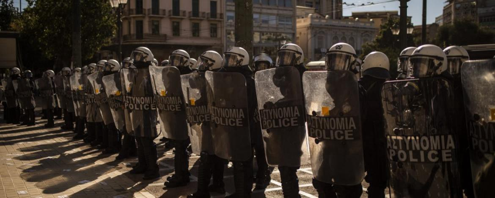

### AYS Daily Digest 19/04/21 Freedom of the press suffered in Greece during 2020

[Are You Syrious?](?source=post_page-----778f0f25ea2b--------------------------------)

[Apr 20](ays-daily-digest-19-04-21-freedom-of-the-press-suffered-in-greece-during-2020-778f0f25ea2b?source=post_page-----778f0f25ea2b--------------------------------) · 6 min read

_Bodies returned to Libya // human trafficking by municipalities in Turkey // insight into the revoked resident permits of Syrians in Denmark // and more…_

### FEATURE: Freedom of the press suffered in Greece during 2020

[Reporters Without Borders](https://rsf.org/en/greece) has just published an update on press freedom during 2020 within Greece\. The situation is not good to say the least\. The conservative government led by Kyriakos Mitsotakis really sought to control the flow of information whether it be on COVID\-19 or refugee issues\. Here is their summary:

> _“Press freedom suffered in Greece in 2020\. The conservative government led by **Prime Minister Kyriakos Mitsotakis granted generous tax rebates on advertising in the media but sought, directly or indirectly, to control the flow of information** closely as part of its efforts to deal with both the coronavirus pandemic and the refugee crisis\._ 

> _Investigative media and media critical of the government were either omitted or were given a disproportionately small share of the advertising resulting from a controversial 20\-million\-euro public information campaign about the virus\._ 

> _Journalists had to get the government’s permission before reporting in hospitals while the health ministry banned medical staff from talking to the media\._ 

> _In February 2021, public TV channels were ordered not to broadcast video circulating on social media that showed the prime minister disregarding lockdown rules\._ 

> **_The police resorted to violence and arbitrary bans to hamper coverage of the refugee crisis on the islands\._** 

> **_In Lesbos_** _, journalists were prevented from covering the consequences of the fire at the refugee camp in the town of Moria, while a group of German freelancers were briefly arrested while trying to cover the arrival of new migrants\._ 

> **_In Samos_** _, a German documentary film crew was detained without charge and mistreated by police\._ 

> _The Greek public TV channel, which is directly controlled by the prime minister although the supreme court ruled this to be unconstitutional, **censored reports on the new migrant camps\.**_ 

> **_In Athens_** _, police obstructed photo\-journalists covering a commemorative event at the end of 2020 and roughed up a reporter for supposedly violating Covid\-19 rules, briefly detaining him\. There is concern about the new rules for policing demonstrations, because it designates areas for the press\._ 

> _In April 2021, the community of Greek journalists was shaken by the **assassination of** the reporter specializing in crime issues **Giorgos Karaivaz\.** ”_ 

### LIBYA
### TURKEY
### Reports of municipalities organizing human trafficking

Journalist [Frederike Geerdink](https://twitter.com/fgeerdink/status/1384108491573399552) wrote an important thread on Monday explaining the recent findings:

> _“Human trafficking organized by municipalities: they set up projects \(culture, youth, etc\. \) which include trip to Europe, you pay 1000s of euros to participate, get a grey \(state duty\) passport, go to Europe and don’t return to Turkey\._ 

> _It started with the news that AKP lead town of Yeşilyurt \(Malatya prov\., central Anatolya\) organized a project with 45 participants going to Hannover: 43 didn’t return to Turkey but applied for asylum\._ 

> _Now an investigation started into the human trafficking by six more municipalities, besides Yeşilyurt one more AKP municipality, three CHP towns and one Iyiparti\. The other AKP town is \(border town\) Suruç, which had an elected HDP mayor but was taken over by an appointed AKP man\.”_ 

### SEA

This relieving tweet comes after reports that 32 people were in distress on Monday in the Alboran\. Salvamento Maritimo was alerted and able to rescue them\.

In memoriam:
### GREECE
### DENMARK
### More on the concern for Syrians and revoked resident permits

Syria Untold has published an opinion piece: **Denmark is revoking residence permits from Syrian asylum seekers\. This didn’t come out of nowhere\.** It is an ecxcellent piece that descibes how a 2015 law’s language was basically set up for the purpose of being able to revoke resident permits one day\.

> _“As it turns out, the decision to revoke residence permits has less to do with the question of whether Damascus is safe and more to do with the question of how ‘safety’ is defined in the first place\. And there we have it: The bar of the Danish authorities is simply much lower than everyone else’s when it comes to refugee returns\.”_ 

Basically, Damascus doesn’t need to be “safe,” the situation just had to “improve\.” Read more about this troubling law [here](https://syriauntold.com/2021/04/19/denmark-is-revoking-residence-permits-from-syrian-asylum-seekers-this-didnt-come-out-of-nowhere/?fbclid=IwAR11OOP34HdohgKPCra5ueLcTFLnCA8d8FfQ3pK20unnfY1VpjlAx5l9lsE) \.

“ **SOLIDARITY EVENT, 15\.00–16\.00 hrs at Christiansborg Slotsplads** 
On 21st April, a group of young Syrians threatened by deportation will travel to Copenhagen to impart their stories and situations to the politicians at Christiansborg\. They will talk about the anxiety that has been created in their lives since the Danish government has worked to revoke their asylum status\. Come to Christiansborg Slotsplads and show them your support\. The deportations will not happen in our name\!
**Messages of the event:** 
\- Stop all deportations to Syria\. Syria is a war\-torn country\.
\- Do not send Syrian refugees back to a government known for murdering civilians and committing war crimes\.
\- Denmark should enact humane and solidaric asylum and refugee legislation\.
\- End the focus on temporary protection in Danish asylum legislation\.
Read more about the situation [here](https://www.facebook.com/events/173254677981312/?acontext=%7B%22ref%22%3A%2252%22%2C%22action_history%22%3A%22[%7B%5C%22surface%5C%22%3A%5C%22share_link%5C%22%2C%5C%22mechanism%5C%22%3A%5C%22share_link%5C%22%2C%5C%22extra_data%5C%22%3A%7B%5C%22invite_link_id%5C%22%3A931125617741190%7D%7D]%22%7D) ”
### FRANCE
### Paris ‘has never closed the doors of the country so well’

French media ANSMed reports on the newspaper Le Figaro’s recent article:

> _“‘Clandestines: borders with Italy and Spain closed’: this is the title of an article published today in the newspaper Le Figaro, according to which Paris ‘has never closed the doors of the country so well’ to streams of exiles often fleeing hunger, wars and famines\. In any case, this is what emerges from a report by the Police aux Frontières \(Paf\), revealed by the Paris daily\._ 

> _The two\-page document shows that, between November and March, a total of 12,288 people ‘in an irregular situation’ were checked and pushed back at the border with Spain, 203% more than in the same period of the previous year\._ 

> _The police then stopped 3,469 migrants in the French departments adjacent to the Franco\-Spanish border \( \+25 percent\) \. In the same period, 23,537 people were rejected in the Alps, on the border with Italy, 143% more than the previous year\. 2,502 exiles stopped by policemen and gendarmes, 39% more than the previous year\.”_ 

Read more [here](http://www.ansamed.info/ansamed/it/notizie/rubriche/cronaca/2021/04/19/migranti-francia-frontiere-sbarrate-con-italia-e-spagna_4dc41211-1a4a-43ec-91cc-c508794ace3d.html?fbclid=IwAR1ZkZgJ-X8VP9cp_vcgJghjxED2dNprF0kI4unqn_qA0mMnuzt_iPoefRY) \.
### EU/FRONTEX
### “EU court sets Frontex’s limits, rules for €10,000 legal fees”

[FragDenStaat](https://fragdenstaat.de/en/blog/2021/04/19/frontex-costs-eu-court/?fbclid=IwAR2-W9DTJ0UW3j1DUT0HpUBDqvWtEjhLJsKW9redYUNO3qFbs67ZO7rlN7I) reports:

> _“In December 2020, the EU’s border police Frontex filed a lawsuit against us in order to force us to pay them a large amount of money\. Frontex, an agency with a billionaire budget, originally demanded € 23,700 from us in legal fees after we had lost our lawsuit for information on the ships Frontex deploys in the Mediterranean\._ 

> _The intention behind the legal bill was clear: to prevent us — and anyone else — from taking them to court again\. Now, the EU General Court has confirmed that Frontex was in no need of recovering such a large amount of money\. Instead, the court has established that the justified amount is € 10,520 — less than half of Frontex’s initial bill\._ 

> _The court’s final decision signals that Frontex’s lawsuit, rather than a financial necessity \(the agency has been known to spend up to € 94,000 on a dinner\), was an intimidatory gesture towards civil society, intended to produce a chilling effect\.”_ 

### WORTH READING/LISTENING TO
- RSA’s new publication [**Excluded and segregated: The vanishing education of refugee children in Greece**](https://rsaegean.org/en/excluded-and-segregated-the-vanishing-education-of-refugee-children-in-greece/?fbclid=IwAR2N3EfgXK8IatSSgqqNhud4ZQ1-7N-RgdcwNRC4EwtHqNujdmq54EdwYTE) **\. “** The exclusion of refugee children\[1\] from the Greek education system reached record levels during the COVID\-19 pandemic, prompting reactions from across the education sector, Μembers of Parliament and civil society\. \[2\] Many children have been unable to attend school for over a year, while others have never managed to enrol\. At the same time, worrying emerging discourse promotes education of refugee children solely through non\-formal education inside Reception and Identification Centres \(RIC\) and camps\.”
- AYS’s own editor Giulio D’Errico was interviewed on [**This is Hell\!’s podcast episode 1320: The authoritarian grip on Greece**](https://soundcloud.com/this-is-hell/tih20210412?fbclid=IwAR1gp9ArILl28lSmKv_aRPVCDWMPT9_N_jP8ePUQ5KiuxnwAwKzXcbXAiG8) \. Giulio talked about “police violence, the state and expanding rifts in Greek society, and his article “Resisting Greece’s rapid descent into authoritarianism” co\-authored with Giovanni Marenda\.” Check it out\! \!
- RLI’s Blog on Refugee Law and Forced Migration just published a new piece entitled [**Denmark’s Extraterritorial Asylum Vision** \.](https://rli.blogs.sas.ac.uk/2021/04/19/denmarks-extraterritorial-asylum-vision/?fbclid=IwAR0k2dyoeWhekqyMIImlQg7HJvozMG5Wu4_tL4y0l3FeCmZlVZ8MJYVzvF4) “Five years on from the EU\-Turkey Statement, this contribution provides an overview of the legal and practical risks associated with extraterritorial asylum, with specific reference to the Danish proposal and drawing on lessons from US and Australian\-led practice\.”
- EU Immigration and Asylum Law and Policy has published a blog [**The Frontex Push\-Back Controversy: Lessons on Oversight \(Part I\)**](https://eumigrationlawblog.eu/the-frontex-push-back-controversy-lessons-on-oversight-part-i/?fbclid=IwAR145AabiTcHTToNxszBvb7lLJ9iNKbLTdzRNOt_Q1JxQCS0Q1leOgs3kzk) \. It does a good job at explaining the legality of “oversight\.”
- Listen to Latitude Adjustment Podcast’s new episode [**Revisited: No Name Kitchen \(with update interview\)**](https://www.latitudeadjustmentpod.com/podcast/2021/4/18/revisited-no-name-kitchen-with-update-interviewrevisited-no-name-kitchen-update?fbclid=IwAR0uXX4UZMnbapV-LfoIUjVaUUK3LgbjtwH3nqjUFQdc44XyWYoRYLmEYQM) with updates on the Balkans\.

**Find daily updates and special reports on our [Medium page](https://medium.com/are-you-syrious) \.**

**If you wish to contribute, either by writing a report or a story, or by joining the info gathering team, please let us know\.**

**We strive to echo correct news from the ground through collaboration and fairness\. Every effort has been made to credit organisations and individuals with regard to the supply of information, video, and photo material \(in cases where the source wanted to be accredited\) \. Please notify us regarding corrections\.**

**If there’s anything you want to share or comment, contact us through Facebook, Twitter or write to: areyousyrious@gmail\.com**

_Converted [Medium Post](https://medium.com/are-you-syrious/ays-daily-digest-19-04-21-freedom-of-the-press-suffered-in-greece-during-2020-69895518c62) by [ZMediumToMarkdown](https://github.com/ZhgChgLi/ZMediumToMarkdown)._
