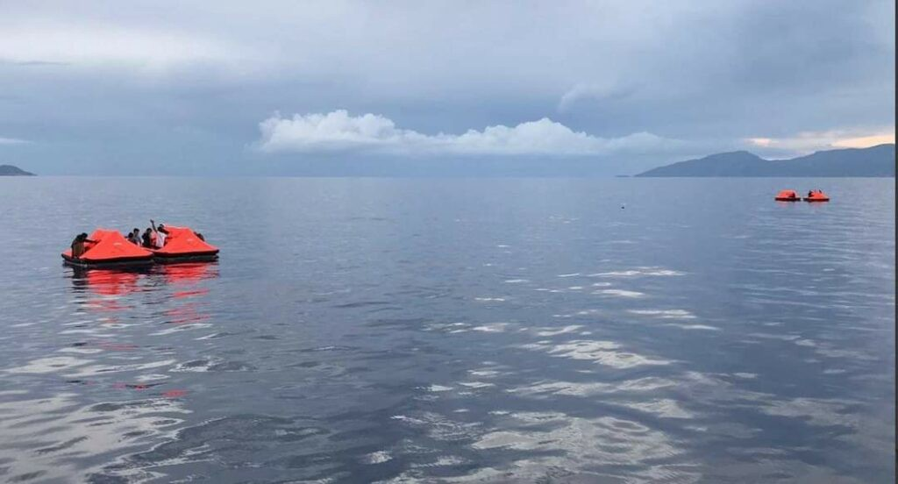

### AYS Daily Digest 26/04/21 Legal Centre Lesvos files case against Greece for massive pushback
#### Assault against union migrant workers in Italy // Deportations from Denmark // Open letter to Italian Prime Minister // more…
### FEATURE: Legal Centre Lesvos files a new case against Greece in European Court for massive pushback

Read [Legal Centre Lesvos’s](https://legalcentrelesvos.org/2021/04/26/new-case-filed-against-greece-in-european-court-for-massive-pushback-operation-of-over-180-migrants-caught-in-storm-near-crete/?fbclid=IwAR0M3Vvkq6DezSzx52RuC1ZhOkKssP-EV19SvmA3_akw2lpoSFB6D9ZSffo) full 26/04/21 Press Release:

Photo by Legal Centre Lesvos
#### NEW CASE FILED AGAINST GREECE IN EUROPEAN COURT, FOR MASSIVE PUSHBACK OPERATION OF OVER 180 MIGRANTS CAUGHT IN STORM NEAR CRETE

_“On 12 April 2021, the Legal Centre Lesvos \(LCL\) filed a new complaint before the European Court of Human Rights \(ECtHR\) regarding ‘pushback’ operations in the Aegean Region by the Hellenic Coast Guard\. In the present case, **LCL’s lawyer represents 11 Syrian nationals who were part of a group of 180–200 people violently expelled from Greece to Turkey on 20–21 October 2020\.**_

_The case was reported on in social media at the time and includes [extensive evidence](https://twitter.com/alarm_phone/status/1333325582826950656) corroborating survivors’ testimonies, such as GPS locations, media reports, photographs and video footage\. The 11 who are bringing this litigation to the ECtHR were part of a group of between 180 to 200 migrants, including at least 40 children and one pregnant woman, who **Greek authorities collectively expelled to Turkey in a violent and massive coordinated operation carried out over more than 24 hours** in the Mediterranean Sea, and involving multiple vessels of the Hellenic Coast Guard, including one Search and Rescue vessel\._

_The group was navigating on board a fishing boat, with the intention of seeking asylum in Italy, when they fell into distress at sea on the morning of 20 October 2020, near the island of Crete, prompting them to request assistance from the Greek authorities and the UNHCR\. On the instructions of the Hellenic Coast Guard, they entered Greek territorial waters, and with the promise of being rescued they waited there for over five hours\. **As shown in [video footage](https://twitter.com/alarm_phone/status/1319252282551291906) , far from being rescued or provided with food, water or safety equipment, the group was instead violently attacked, by surprise, at night, by masked ‘Commandos’ in black uniforms without insignia, operating from Hellenic Coast Guard vessels, who assaulted them, stole their belongings, and threatened them with further violence if they attempted to return to Greece\.** The group was then forcibly transferred to two different Hellenic Coast Guard vessels on which they were forced to spend the night outdoors, without food, water or any assistance, before being abandoned on 21 October on various motorless, unseaworthy, life rafts near the Turkish Coast\._

_LCL argued in the present case that the Greek authorities who perpetrated the collective expulsion violated the 11 individuals’ right to life under Article 2 of the European Convention on Human Rights \(ECHR\), their right to be free from torture or inhuman or degrading treatment or punishment under Article 3 ECHR, their right to liberty and security under Article 5 ECHR, and their right to effective remedy and non refoulement under Articles 3 and 13 ECHR\._

**_This complaint is the fifth legal action filed by the LCL against Greece before the ECtHR concerning extensively evidenced incidents of collective expulsions in the Aegean region\._** _In each case, migrants who had arrived in Greece with the intention of seeking asylum were instead met with violence, humiliation, and torture at the hands of Greek authorities, eventually being abandoned at sea without any means to stay safe or to call for rescue\._

_Particularly striking in this case is the insidious and apparently premeditated nature of the collective expulsion\. **The Greek authorities repeatedly lied to the passengers of the fishing boat** — who were in a vulnerable state of distress after surviving a storm and losing their supplies overboard — intentionally and repeatedly misleading them into believing they would be rescued, and instead attacked and collectively expelled them to Turkey\._

_The number of staff, vessels, equipment and coordination mobilised during this incident is also extraordinary in that at least five official vessels of the Hellenic Coast Guard, four to five speedboats and RHIBs and seven life rafts were deployed near Crete and carried out the pushback operation, in which approximately 200 people were transported over 200 km from the coast of Crete back to Turkish territorial waters in two separate operations\._

_As already [highlighted by LCL](https://reliefweb.int/report/greece/crimes-against-humanity-aegean) and several other monitoring and [human rights groups](https://legalcentrelesvos.org/2021/03/31/joint-action-for-the-creation-of-an-initiative-of-organisations-in-relation-to-push-backs/) , the illegal acts committed by Greek authorities in this case are not isolated and instead form part of an ongoing systemic and widespread practice implemented by the Greek authorities over the last year \(in particular [since March 2020](http://legalcentrelesvos.org/2020/03/10/protect-our-laws-and-humanityopen-letter-by-120-organizations/) \), which amount to crimes against humanity\. Despite extensive evidence, reports, investigations and denunciations at both national and international levels, the Greek authorities continue to deny that pushbacks are taking place\._

_Greece is one of the few European countries that has not explicitly prohibited collective expulsions, and Greece’s legal system does not provide adequate criminal remedy to redress the gravity of the international and human rights law violations entailed in collective expulsions, much less the political interest to seriously investigate these crimes\. The ECtHR has thus become a court of last resort for a growing number of survivors\. The ECtHR timelines mean that it could take years for such applications to even be considered, while the individualised character of human rights violations as adjudicated at the ECtHR normally fails to capture the systematic nature of collective expulsions\. However, **in the current context of absolute impunity for these criminal atrocities it is worth pursuing all remedies available for pushback survivors\.** This does not change the fact that meaningful justice for survivors of collective expulsions must include safe and legal routes to Europe, and a decisive end to fortress Europe’s border regime of deterrence at any human cost, which has as its logical endpoint the spectacular violence of pushbacks such as this one\.”_

**Press contacts —** For interviews or questions please contact:
- Natasha Ntailiani \+30 694 425 1704 \(Greek, English, German\)
- Marion Bouchetel \+30 697 761 9003 \(French, English, Spanish\) \.

#### LIBYA

■■■■■■■■■■■■■■ 
> **[Yambio David](https://twitter.com/Yambiodavid) @ Twitter Says:** 

> > Happening now at the UNHCR's new office in Serai, gathered are children men and women on a peaceful demonstration asking the commission for protection, education basic needs like assistance which includes medical assistance, cash assistance and food assistance among others. 

> **Tweeted at [2021-04-26 10:02:05](https://twitter.com/yasanada/status/1386621594819248130).** 

■■■■■■■■■■■■■■ 

The thread on the demonstration continues:

> “They are also calling for the end of racism within the commission, that have seen the [@UNHCRLibya](http://twitter.com/UNHCRLibya) evacuating selected nationalities and most of the basic needs being channeled to particular nationalities, brutalities of the guards and the lack of good communication\. 

> To the refugees and asylum seekers, they are also calling upon the commission to look into their files and have them updated about their status as they are kept pending of offside for number of years without knowing the status of their refugee claims\. 

> They are also calling upon the international communities to open their doors of kindness and offer more space for resettlements, safe corridors that gives hope to the stranded\. 

> Tragedies are happening on the sea, most of those drowned are registered with the [@UNHCRLibya](http://twitter.com/UNHCRLibya) but they are not comforted or given any hope, thus leaving them sea suicide as the only option\. We once again asks the international communities to offer more legal procedures for us\.” 

#### GREECE
### Forcing a migrant to disappear from Greece

> “Zakaria, from Morocco, had applied for a residence permit in Greece\. His flatmates last heard from him on Monday 19 April\. According to his testimony, he was arrested near Thessaloniki’s main square, tore his papers up and refused his request to get his documents from home\. He was kept in a police station for hours without food, then taken to another one in East Thessaloniki where he spent the night\. The next day, after a COVID\-19 test, they detained him in another police station and took his fingerprints and photos\. 

> The next day, he was taken to another police station, detained in a tiny space\. Then yet another police station, where on Wednesday they finally offered him food\. Soon after, police started insulting and abusing him and other migrants detained with him\. Zakaria then describes being forced in a vehicle with other migrants, including two women from Syria\. He was beaten after one officer wrongfully accused him of breaking something\. On their way to Evros, the vehicle stopped and picked more migrants from other towns\. 

> At the end, there were 50 people in the vehicle\. When they reached the river, officers forced them onto boats in groups of 11 and two soldiers, together with two Syrians, forced them across the border to Turkey\. His shoes, phone and jacket were stolen during his ordeal\.” 

> “When he reached Turkey, he was penniless, walking 3 kms in the cold to a gas station where thankfully a fellow Moroccan offered to pay his way to Istanbul\. Zakaria is now in Istanbul, while his partner and belongings are in Thessaloniki\.” 

> “This is not the first story of a forced disappearance of a migrant that we hear from Greece\. In the past two years, these seem to be happening at an industrial scale\. These are people who are properly registered in Greece, many of whom have lived there for months or years\. 

> There are many questions that Greece’s law enforcement and police need to provide urgent answers to\. They can’t get away with it again by saying this is ‘propaganda\.’ There is evidence that this is a systematic, routine practice, far from our borders\.” 

### On Friday a Syrian refugee was sentenced to 52 years in prison

Borderline Europe said in a press release:

> “On Friday 23 April 2021, the trial of K\. S\., a young man who fled Syria, took place in Mytilini on the Greek island of Lesvos\. He was sentenced to 52 years imprisonment for “illegal entry” and “facilitating illegal entry”\. Trial observers from the initiatives “You Can’t Evict Solidarity”, Christian Peacemaker Teams — Aegean Migrant Solidarity and borderline\-europe consider the verdict a scandal\. We criticise the unfair trial and once again demand the immediate release of the accused\.” 

Read in full [here\.](https://www.borderline-europe.de/unsere-arbeit/syrischer-gefl%C3%BCchteter-auf-lesbos-zu-52-jahren-haft-verurteilt?l=en&fbclid=IwAR0i9niYqaAkMbkWyPbv6vjBNg8thSlZCOIlgyHOiXySDsXiU3DmQP0JlBs) Researcher [Lena K\.](https://twitter.com/lk2015r/status/1386709915188830208) also observed:

> “That’s a lot more than you get for rape or murder in Greece\. And a reminder that one of the functions of the justice system is to prop up the state, and in this case, very blatantly, government policy\.” 

**Update from Khora Asylum Support Team:** “Help us overcome language barriers\. We’re raising vital funds for Interpreters at Khora’s Asylum Support Team \(KAST\) \. Every week, we support 15–20 individuals and families in accessing vital support, from hospital care to legal advice\. The Interpreters are an essential part of this support, bridging the language and cultural barriers that otherwise exclude people\.” Learn more [here](https://khorafundraising.org/khorafundraising/index.php) \.

■■■■■■■■■■■■■■ 
> **[Tineke Strik](https://twitter.com/Tineke_Strik) @ Twitter Says:** 

> > Concerns raised over the risk of lead poisoning in the Mavravouni camp in Lesbos need to be taken very seriously.

Almost 50 members of the Parliament joined my call on the @EUCommission to act in order to protect the health of refugees and ensure comprehensive lead testing. https://t.co/0jJLNXAiGB 

> **Tweeted at [2021-04-26 15:12:25](https://twitter.com/tineke_strik/status/1386699693602885633).** 

■■■■■■■■■■■■■■ 

■■■■■■■■■■■■■■ 
> **[RSA](https://twitter.com/rspaegean) @ Twitter Says:** 

> > 1.1. On 21.4 Slovak Minister of Foreign and European Affairs Ivan Korcok visited Eleonas refugee camp in Athens, together with Greek Migration Minister @[nmitarakis](https://twitter.com/nmitarakis).  He promised Slovakian "solidarity" to support the burdened health care system and thanked Greece for its efforts https://t.co/cr9rWCQVQe 

> **Tweeted at [2021-04-26 11:39:01](https://twitter.com/rspaegean/status/1386645989902233601).** 

■■■■■■■■■■■■■■ 

> “Last September, Slovakia — with the Visegrad Four — rejected the idea of taking part in a European solidarity mechanism which would see all MS obliged to accept asylum\-seekers arriving at the EU external borders\. 

> In Eleonas, refugees reportedly felt upset with the visit as their questions on their actual problems remained unanswered\. In March, 863 people lived as unregistered residents on the site, 129 slept in tents and 361 in makeshift shelters\. Occupancy had reached 105%\.” 

#### ITALY
### Open Letter to Italian Prime Minister following last week’s disaster shipwreck off the coast of Libya

Alarm Phone, Emergency, Doctors Without Borders, Mediterranea, Open Arms, Sea\-Watch, SOS MEDITERRANEE wrote:

_“ [Dear Prime Minister Mario Draghi](https://sea-watch.org/en/sea-rescue-ngos-ask-for-an-urgent-meeting-with-italian-prime-minister-draghi/?fbclid=IwAR3pp6s0b6rPDEbsBjhAmlAqu96pDT7Qkuov7aXHJ_bOFMGA9_bOE8XZdwc) ,_

_After yet another tragedy occurred in the Mediterranean last Thursday, we believe it is essential to ask you for an urgent meeting\. Every time a shipwreck occurs, we hope it will be the last\. Also the tragedy of these days could have very likely been avoided\. There are people who could have been saved\. Instead, we could only watch helplessly the umpteenth disaster, the Ocean Viking arrived on site and found itself ‘sailing in a sea of corpses\.’_

_In the more than 24 hours elapsed between the first Alarm Phone report and the tragedy, the Ocean Viking waited for an intervention of the maritime authorities to coordinate the operations, but despite the fact that the Italian, Libyan and Maltese authorities were kept constantly informed, this coordination did not take place, or at least did not involve the only rescue ship present at that moment\. The fact that this failure was fatal is clear to everyone: over a hundred people lost their lives\._

_This, Prime Minister, is the reality of the Mediterranean\. Since 2014, more than 20,000 men, women and children have died or disappeared in the central Mediterranean, which confirms its sad record as the world’s deadliest migration route\. None of the agreements and measures adopted by states since the end of Operation Mare Nostrum has ever succeeded in decreasing the mortality rate\. Since then, NGOs have tried to fill the void left by the states, but in the absence of a centralised, timely and coherent coordination of search and rescue, tragedies such as that of last Thursday are the consequences to be carried collectively on the conscience\._

_For a number of years, the intervention of civilian rescue ships was gratefully received by Italian and European authorities, with whom we collaborated continuously and effectively to reduce mortality in the Mediterranean\. Then things changed: governments withdrew their ships and stopped coordinating rescues\. Instead of being rescued and taken to a safe port, as international maritime law would have it, people began to be taken by Libyan authorities back to Libya, where they are subjected to arbitrary detention, violence and abuses of all kinds that have been widely documented\. At the same time, NGOs have become the object of a fierce campaign of delegitimisation and criminalisation\._

_As reiterated by European Commissioner Von der Leyen herself, “saving lives at sea is not optional”, but a precise obligation of states, a legal obligation, therefore, as well as a moral one\. As NGOs, we are at sea to fill a gap, but we would be ready to step aside if Europe was to set up an effective institutional and coordinated search and rescue mechanism whose primary purpose is to rescue people at sea\._

_Mr\. Prime Minister, we ask you for a meeting to discuss what concrete initiatives can be taken by your government, involving Europe, to ensure coordinated and timely rescue operations, so that saving lives becomes a priority again and unacceptable tragedies such as the shipwrecks of these days are never repeated\.”_

— Alarm Phone, Emergency, Doctors Without Borders, Mediterranea, Open Arms, Sea\-Watch, SOS MEDITERRANEE\.

**Landings/rescues:**
- [22 people](http://www.mediterraneocronaca.it/2021/04/26/sbarco-autonomo-a-lampedusa-22-migranti-vicino-lisola-dei-conigli/?fbclid=IwAR1oWZaKVhzisFkFHj8S-svVHZSEodwimFinzmemZNTIXMphr8640CAiZK8) landed in Lampedusa on Sunday evening
- [119 people](http://www.mediterraneocronaca.it/2021/04/26/migrazioni-119-persone-su-un-barcone-a-roccella-jonica/?fbclid=IwAR0_FnGin89eH4FHlS7w--s33iNyAovHtXKjCymD4bvsFBNNjfm3HrOCjz0) rescued and arrived in the port of Roccella Jonica on Sunday

### Rifle assault against migrant union workers

Italian media reports: _“Rifle shots against migrants \. It happened last night in Foggia, in Borgo La Rocca\. A thirty\-year\-old was wounded in the face \(see photo\) while he was in a car with two other laborers, taken to hospital in red code but does not risk his life\. The three were in the car while they were returning after work in the countryside to the Ghetto di Rignano when — according to an initial reconstruction — they were joined by an off\-road vehicle in which some people fired a rifle, breaking the rear window of the vehicle\._

_The Labor League, founded by the trade unionist and activist Aboubakar Soumahoro, denounces what happened during the night \. ‘It is the second raid in 48 hours — Aboubakar Soumahoro writes on his social profile \- \. We ask the relevant authorities to shed full light on these shameful cowardly attacks\. Today, as Lega Braccianti we have convened an assembly of male and female workers because these attacks on the lives of men and women will not bend and we will not stop our struggle for the rights and social and working dignity of each and every one\. There is no consolation for the pain and anger felt, but we will continue to fight for this companion of ours and for all those who were injured this night in the ambush\.’”_ More [here](https://www.radiondadurto.org/2021/04/26/foggia-spedizione-punitiva-a-colpi-di-fucile-contro-i-braccianti/?fbclid=IwAR1oWZaKVhzisFkFHj8S-svVHZSEodwimFinzmemZNTIXMphr8640CAiZK8) \.
#### SPAIN

](assets/377fe09aece6/0*_Cc6lD0ne9Z9Th81)

Photo by [Redmi Note 8 Al Quad Camera](https://twitter.com/AsambleaMigraTF/status/1386660293049262090)

[Asamblea de Apoyo a Migrantes de Tenerife](https://twitter.com/AsambleaMigraTF/status/1386660293049262090) reported on Monday:

> “Yesterday afternoon numerous police devices went to the resort of the old prison in St\. Cruz where migrant families, women, children and vulnerable people reside\. 

> A family wanted to enter the center, run by the Red Cross, with a package of gofio, chocolate and bread for their children\. Security personnel and Red Cross workers prevented them from entering, alleging that the rules of the center prevent people from bringing food or clothing\. This family, who have been in the center for 6 months waiting for their referral, is desperate because of the institutional racism that keeps them in the old jail for so long\. The response of the Red Cross was to call the police, in a situation that could have been solved in another way\. They decided to put these families at risk, with the presence of more than 12 policemen and 5 cars, all this with children, women and vulnerable people present\. We denounce these absurd norms of the Red Cross, who provide low\-quality food and scant clothing while criminalizing users of finding it in other ways\. 

> These practices are yet another example of the institutional racism that institutions exercise over migrants\. We also denounce that these people are held for so long without any information or legal advice in a center that should be a passing through, keeping them in constant uncertainty and despair\.” 

■■■■■■■■■■■■■■ 
> **[Alarm Phone](https://twitter.com/alarm_phone) @ Twitter Says:** 

> > Last weekend, around 150 people, including minors of only 12-13 years, swam to #Ceuta. Some arrived by themselves, while others were rescued by a patrol boat of the #GuardiaCivil. At least 3 person died during the attempt. 

> **Tweeted at [2021-04-26 11:10:47](https://twitter.com/alarm_phone/status/1386638884537344001).** 

■■■■■■■■■■■■■■ 

#### BULGARIA

■■■■■■■■■■■■■■ 
> **[Josoor](https://twitter.com/JosoorNet) @ Twitter Says:** 

> > #PushbackUpdate

We are highlighting a case on 04-14 where 5 Syrian men were apphrended by alleged #BG authorities in BG &amp; subsequently pushed back to #TR through an "unofficial door in the fence" at the border. These officers beat the group through kicking &amp; punching. 1/4 https://t.co/uEWhc5aO1M 

> **Tweeted at [2021-04-26 13:01:25](https://twitter.com/josoornet/status/1386666727497404416).** 

■■■■■■■■■■■■■■ 

Josoor continues:

> “The group also had multiple dog bite injuries due to dogs that were deliberately released by BG authorities, a worrying tactic in most testimonies we take from pushbacks from Bulgaria\. 

> We were able to provide all five members of this group with food, accommodation, clothing, as well as medical help for those with severe injuries\. 

> Pushbacks are happening at EU’s external borders every day\. Our Pushback Updates show individual incidents demonstrating the regularity of these Human Rights violations\. Check out [http://josoor\.net](http://josoor.net) & social media for updates & to find out how you can support us\.” 

#### DENMARK

■■■■■■■■■■■■■■ 
> **[mhmd](https://twitter.com/mohamedhemish) @ Twitter Says:** 

> > This is Mohamed El Shawa. Denmark is deporting him to Gaza, bc he faces "no concrete conflicts in Gaza"

He was born in Gaza but never lived there &amp; grew up in Egypt as a stateless refugee. He's been in Denmark for 9 years, 3 of which in a deportation camp [bit.ly/3nkDT7C](https://bit.ly/3nkDT7C) https://t.co/bIR6e5iDlM 

> **Tweeted at [2021-04-26 12:12:19](https://twitter.com/mohamedhemish/status/1386654371199561733).** 

■■■■■■■■■■■■■■ 

Sound familiar?

■■■■■■■■■■■■■■ 
> **[Joseph Willits](https://twitter.com/josephwillits) @ Twitter Says:** 

> > Important letter from members of the European Parliament to PM Mette Frederiksen, condemning Denmark’s unconscionable &amp; dangerous decision to expel &amp; send back Syrian refugees to Syria.

“We bear responsibility for those who have fled to us from the turmoil of the Syrian war”. https://t.co/KSqRrmCmSn 

> **Tweeted at [2021-04-25 21:51:41](https://twitter.com/josephwillits/status/1386437786127982596).** 

■■■■■■■■■■■■■■ 

#### UK
### “Asylum seeker dies by suicide after forced move left him isolated in shoddy accommodation”

Pink News reports:

> “Romeo Nguase, 22, fled family abuse in Namibia three years ago to claim asylum in the UK where he would be free to ‘be a bisexual man\.’ 

> Humberside Police found him dead at his home on Pendrill Street, Hull on the morning of 16 April\. It is understood that he took his own life but an inquest has not yet taken place\. Police launched a public appeal to find Nguase’s next of kin and his cousin Java Kahiha was eventually tracked down thanks to ‘extensive work’ from the charity Hull Sisters\. 

> Kahiha described the conditions his cousin was housed in after he was allegedly forced to relocate to Hull against his will\. 

> ‘He lived in Manchester with friends but became homeless so then he came over to Glasgow and we lived together and he claimed asylum,’ Kahiha told Hull Live\. ‘The Home Office transferred him by force, and against his will, from Glasgow to Newcastle and then accommodated him in Hull\. He said he didn’t didn’t want to move out of Glasgow to live in England\.’ The Home Office said asylum seekers stay in ‘safe and secure accommodation’ and have access to a 24/7 helpline should they have ‘any concerns\.’ But Kahiha believes this support wasn’t made available to his cousin\.” 

More [here](https://www.pinknews.co.uk/2021/04/25/asylum-seeker-suidice-romeo-nguase-namibia-hull/?fbclid=IwAR1tugW8P1FIqX5MWDNnYO724YAQWdnxnE5F2LiVDmaV1wwh2LY1yme1vnI) \.

■■■■■■■■■■■■■■ 
> **[Pinar.Aksu](https://twitter.com/pinar_aksu5) @ Twitter Says:** 

> > What happened on Friday?
Why is this wrong?
What can you do?

Practices of dawn raid, detention and deportation is never the answer!

#NoDawnRaids #RefugeesWelcome https://t.co/STTlNq9SWp 

> **Tweeted at [2021-04-26 12:16:30](https://twitter.com/pinar_aksu5/status/1386655421985869828).** 

■■■■■■■■■■■■■■ 

#### WORTH READING
- Pensare Migrante’s new piece [**Without Memory there is no liberation\. CPR, lawless prisons**](https://pensaremigrante.org/senza-memoria-non-ce-nessuna-liberazione-cpr-carceri-senza-legge/?fbclid=IwAR3W51jytHa9Levw4Sf8blT9qb6UA_Fax-QAzZZxjUIgKcRziDBGh8SFto8)
- Free Movement’s new article [**Rounding up the rough sleepers… yet again**](https://www.freemovement.org.uk/rounding-up-the-rough-sleepers-yet-again/?utm_medium=rss&fbclid=IwAR0SAI5mUwLwrAk5nMHsckPG1y5BtRi9ILQHmyIzl-sJ4fgIQWZsGnRC5q0) \. “ _The latest episode of the Home Office’s dispute with rough sleeping migrants is here with the publication of the policy guidance for applying the “the rough sleeping rule”\. This article discusses some key points from both a housing and immigration perspective for those involved in either field\._ ”

**Find daily updates and special reports on our Medium page\.** 
**If you wish to contribute, either by writing a report or a story, or by joining the info gathering team, please let us know\.** 
**We strive to echo correct news from the ground through collaboration and fairness\. Every effort has been made to credit organisations and individuals with regard to the supply of information, video, and photo material \(in cases where the source wanted to be accredited\) \. Please notify us regarding corrections\.** 
**If there’s anything you want to share or comment, contact us through Facebook, Twitter or write to: [areyousyrious@gmail\.com](mailto:areyousyrious@gmail.com)**

_Converted [Medium Post](https://medium.com/are-you-syrious/ays-daily-digest-26-04-21-legal-centre-lesvos-files-case-against-greece-for-massive-pushback-377fe09aece6) by [ZMediumToMarkdown](https://github.com/ZhgChgLi/ZMediumToMarkdown)._
