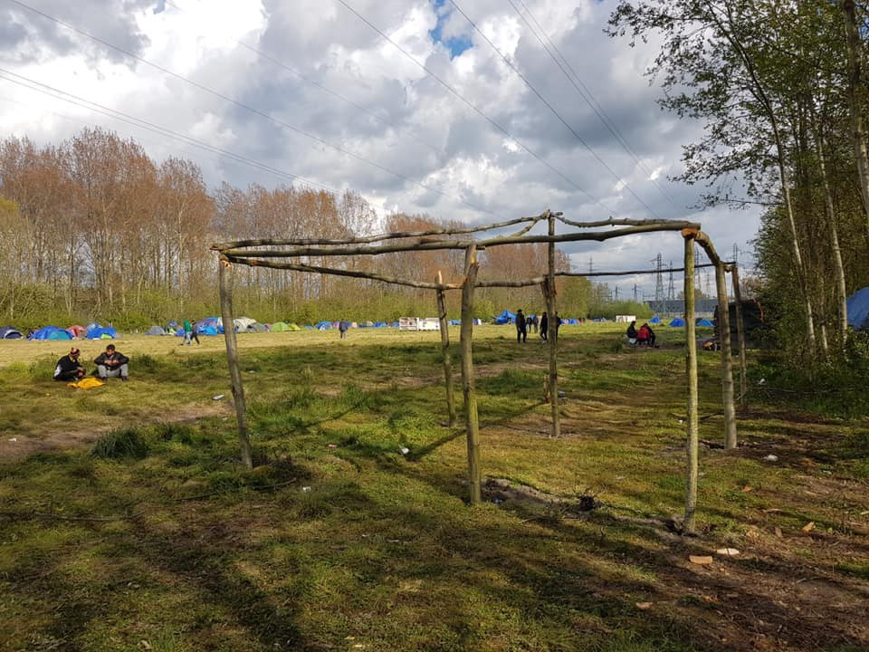
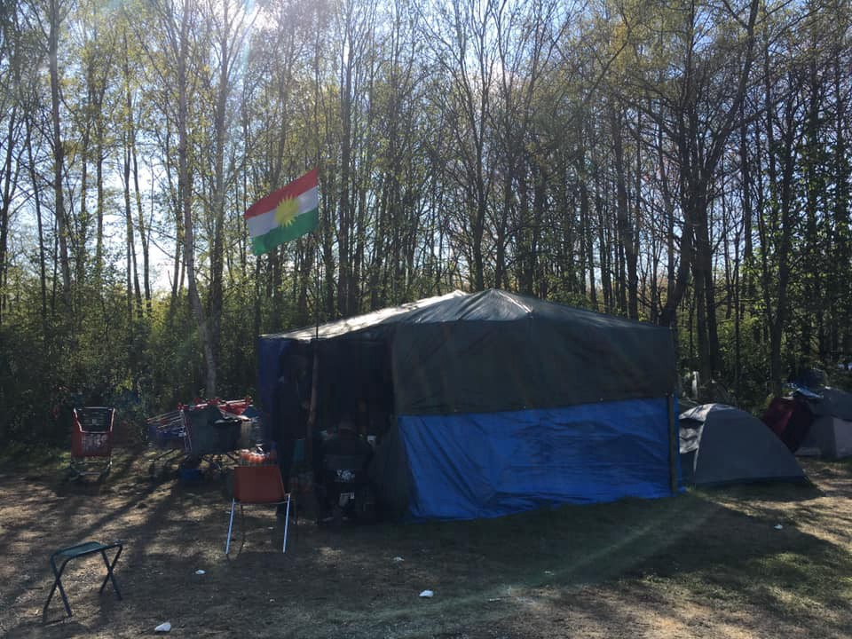
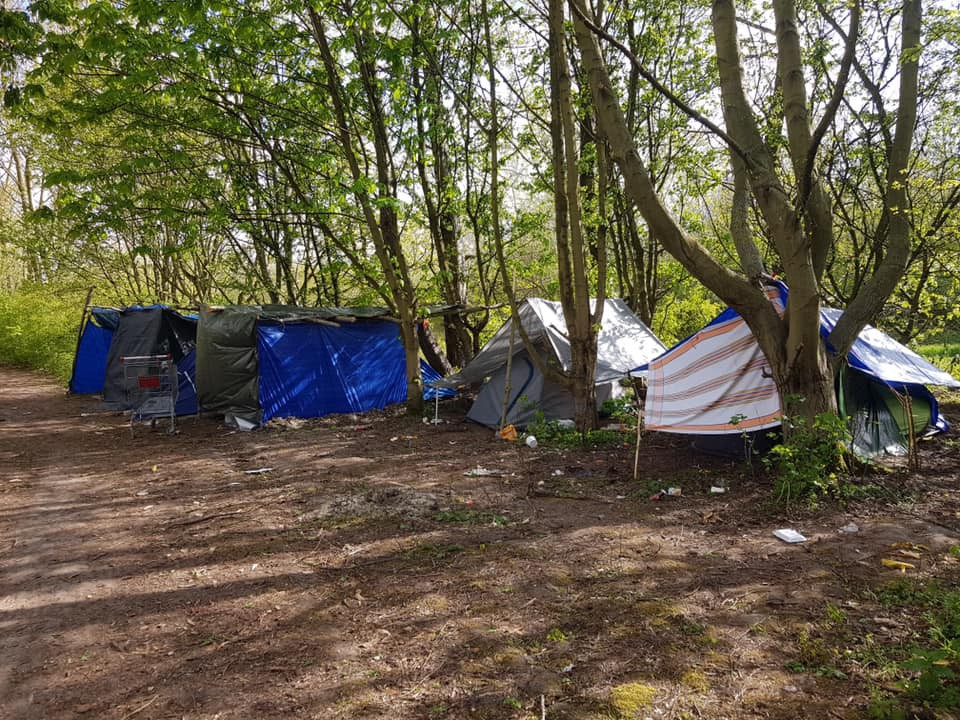

### AYS Daily Digest 7/5/21: The Dublin Regulation cannot be circumvented unilaterally or through an agreement between two member states, court says
### German court says recently popular bilateral deals can’t work for ad hoc deportations / New arrival points in Italy / From poor to worse — Greek reception management / Joint statement by Syrian NGOs rejecting Denmark’s decision to revoke residency permits of Syrian refugees / recommended reads and more

[Are You Syrious?](?source=post_page-----3a21a24dd819--------------------------------)

[May 8](ays-daily-digest-7-5-21-the-dublin-regulation-cannot-be-circumvented-unilaterally-or-through-an-3a21a24dd819?source=post_page-----3a21a24dd819--------------------------------) · 8 min read

### FEATURED

**Germany — “Procedural requirements and the obligation to check compliance with human rights cannot be replaced by fast\-track proceedings at the border, especially by the federal police,”** the Court in Munich ruled in the recent case of a Syrian who got deported from Germany back to Greece in August 2020 via the so called “Seehofer deal”\.

> _The Seehofer deal between Germany and Greece \(a similar agreement also exists with Spain\) was signed in 2018\. It stipulates that those seeking protection who have been registered in Greece and then enter Germany via the border with Austria will be refused entry\. They are said to be detained and deported to Greece within 48 hours\. As of June 2020, 39 people were affected by the deal between Greece and Germany, as ProAsyl [explained\.](https://www.proasyl.de/pressemitteilung/klatsche-fuer-seehofer-deal-zwischen-griechenland-und-deutschland-eindeutig-rechtswidrig/)_ 

The Federal Republic will be obliged to bring about the immediate return of the applicant from Greece, according to the decision of the Munich Administrative Court of May 4th\. An important conclusion drawn from this decision is that in spite of the practice copied also in other EU Member States, the Dublin Regulation cannot be circumvented unilaterally or through an agreement between two member states\.
### GREECE
### Lesvos

The horrendous conditions at the Kara Tepe camp are no longer top news across Europe, but even though one would not expect it to be possible for things to further escalate, it seems that is exactly what is happening, as reported from the ground:

The camp was handed back to local authorities\. Some 500 residents were reportedly moved to the nearby temporary camp\. International outrage at reports such as the most recent one from Chios of a “ [dead man found surrounded by rats at Greek camp](https://www.theguardian.com/global-development/2021/may/07/a-scene-out-of-the-middle-ages-dead-refugee-found-surrounded-by-rats-at-greek-camp?fbclid=IwAR2qgA5LLPqp3HcwA5IgXTSami-Q3W71wjIL-uGxz5Lr4HItnq5OU8icbd8) ” seems to be the only way to raise attention and concern over the dreadful conditions we have put each other in\. However, as some of the structures along the Aegean close, people get transferred or kicked out of their former living areas in apartments and other living structures, they are sent off to even worse conditions in places such as the Eleonas camp, close to Athens, whose current state is documented [here](https://www.efsyn.gr/ellada/koinonia/292904_kara-tepe-kleinei-o-elaionas-exathlionetai) \.

Organisations present in the area report that double standards when it comes to the application of coronavirus measures are once again in place\. Since this Monday, reportedly, bars and restaurants are gradually opening, people are free to move and life is coming back to the local areas, however, not for everyone\. The Covid\-19 vaccination campaign across refugee camps on the mainland and the islands has reportedly started, and the camp residents are being asked to register for vaccination\. The campaign’s success is essential, especially for people living in such overcrowded facilities\. But „vaccine hesitancy“ is apparently high among asylum seekers, according to the residents interviewed, who are generally distrustful of authorities, [reports](https://l.facebook.com/l.php?u=https%3A%2F%2Ftwitter.com%2Fg_christides%2Fstatus%2F1390530147867054082%3Ffbclid%3DIwAR1KHUu67Z0-M1ofXEJ9iaJdskYXjTSYZ6FxfCeyV5MnevTE9F_xPswt3Zg&h=AT3yMmnL8G2dmv9sWm1a6Bq4jHpveDrj9vme8hv0ZFqQaf4cameBVF21WVFzpiQOfaUsbsOJRBMLuTYJ0fDGLHbA_JpfaE01UMaPKyBAwOH11zvruZAWKjMdWjkn01-nShhDY7JPfOgFXw&__tn__=R]-R&c[0]=AT3BIorjrfHuGM5EfpokfrUi-22gUNN-u1ITzpUreEGBMMf7kiS7UWwXWN_h7UeAfuvm5q7_fVO_v0cgDct6LvqEsXk1OtVRTmxjO854Y6ByRlg5AaUKcAZgq5hAgvrJEczECGxSkFRdu6KRr-Ia6mVIstGl5mTQ3TGpvY-xr7ZqXXQS6GeUwQUUpZHoQTCbG5hGVRjtFS0B37mKmA) Giorgos Christides\.
However, tens of millions of asylum seekers, migrants, refugees and internally displaced people around the world have been excluded from national Covid\-19 vaccination programmes, according to World Health Organization research\. Read more in the article under “Worth reading”\.
### ITALY
### New arrivals

Along with arrivals on Lampedusa, a new landing point is in place\.
A group of people landed on the coast of Menfi, but reportedly there was no trace of the boat used in the arrival\. All 11 people were of Tunisian nationality, they were identified and detained by the Carabinieri of Sciacca and by the police\. Allegedly, among them there were a pregnant woman and a man who was arrested\.
### FRANCE
### Northern France

The population at the new site has continued to grow over the last two weeks, with new arrivals every day, [Mobile Refugee Support](https://www.facebook.com/MobileRefugeeSupport/?__cft__[0]=AZVIImO0E5sULOA3XIm7xQhGUiVFteobXPlu_DcJr_-yps-Za3Z4ZtxofNwZW7unAwD-1lD3xZzroBFjLL4_p3XJ1gtHoHMJL_DMbtKlJ3cmnf2qAp-xdumhJx_hZDJd1jwbdVQI7exh3-1LQZJU5xpy&__tn__=-UC%2CP-R) reports\.

With so many people in need, we have restructured and increased our regular distributions of NFI \(non\-food items\) \. Each day our volunteers take orders of the specific items people require\. These items are then packed at the warehouse and delivered the following day\.
Although time\-consuming, this method is easy to understand and fair, while still ensuring people get what they need\. 
With summer now around the corner and the chance of receiving festival salvage still uncertain, we are once again trying to stockpile tents in preparation for the yearly surge in numbers\.

Intentional complicity in destruction, degradation and deterioration of property

**The head of the Paris Police Prefecture, as well as his counterparts of the Seine\-Saint\-Denis and of Île\-de\-France, are the target of a collective complaint, with accusations of complicity in wilful violence, complicity in the destruction, degradation and deterioration of property owned by others, and organized gang theft\.**

As in other parts of Europe, the active and ongoing policies and police treatment of people on the move, asylum seekers, asylees and undocumented people in France is following a dangerous and alarming path\. With the aim of denying their welcome and official reception through deterrence and harassment, the ongoing \(officially run\) practice violates fundamental human rights and international agreements, including those on Human Rights, Child Rights and the right to asylum, fundamental international obligations and documents of which France is a signatory\.

Raising concerns are the many additional actions put in practice by the police that deprive people of their dignity, such as confiscation and destroying of personal belongings, repeated thefts, evictions and physical intimidation that surely cannot be a part of any official procedure concerning people in search of international protection\. Due to this, on top of their many fears, these people now also fear the presence of the police, even in situations of protection\.

Utopia 56 and Enfants d’Afghanistan et d’ailleurs joined forces with 34 people on the move who are the main actors in the collective complaint with the Public Prosecutor of the Republic of Paris following the events of 17 November 2020 in Saint\-Laurent and from 23 November 2020 place de la République in Paris\.
It is based on dozens of testimonies \(elected officials, asylum seekers and volunteers\) collected by the lawyers with the aim of denouncing the state strategy towards people on the move and their supporters, as well as the premeditated and systemic nature of the violence perpetrated, as [reported](http://www.utopia56.com/en/actualite/depot-plainte-contre-prefets-didier-lallement-georges-francois-leclerc-marc-guillaume) by the organisations\.

These are not isolated events of some police forces, but rather the result of a chain of command that operates everywhere in France and at European borders\.

At the same time, France has warned that foreigners who are radicalised or disturb the public order will lose their refugee status, as the debate on immigration control intensifies following last month’s murder of a police worker near Paris, media [report](https://www.rfi.fr/en/france/20210507-refugees-violating-french-values-will-be-deported-interior-minister-warns-terrorism-police?fbclid=IwAR3zZC5zs7tO2i5LVA24zmIf1cHPLrYqiAvwTSQZvCzfNoQbNXOvKJU5eKg) \. The Interior Minister Gérald Darmanin said: “Our policy is clear: judge foreigners for what they do and not for what they are\.”

DENMARK

NGOs rejecting Danish decision to revoke residency for Syrians in Denmark

The Bridges of Truth is [a project by nine NGOs](https://tda-sy.org/2021/05/06/joint-statement-by-syrian-civil-society-organizations-rejecting-denmarks-decision-to-revoke-residency-permits-of-syrian-refugees/?fbclid=IwAR0P4zit8k_mkRx-Gt7oHhOzLBNGgQqS-GkkUUDldRqFV6pU9iq-MsiTVrI) aimed at raising awareness about the plight of Syrian victims and inspiring action to promote their rights and holistic justice for the crimes they have experienced\. These organizations now urge the Danish government, the international community, and all countries hosting refugees to “consider their humanitarian duty towards a people that has already suffered immensely over the past ten years and who are desperately seeking safety and security for their families\.”

Signatories of the Bridges of Truth project:
- The International Center for Transitional Justice
- Center for Civil Society and Democracy
- The Day After Association
- Badael Foundation
- The Day After
- Women Now
- Dawlaty
- The Syrian Institute for Justice
- The Syrian Center for Media and Freedom of Expression
- Lawyers and Doctors for Human Rights

SEARCH AND RESCUE

Alarm Phone was working on eight distress cases in the Alboran area in a single day, documenting the recent surge in arrivals along Europe’s most active and most lethal migration route\.
### [Alan Kurdi sets sail for Spain after 7 months in Italian port](https://l.facebook.com/l.php?u=https%3A%2F%2Fwww.infomigrants.net%2Fen%2Fpost%2F32059%2Falan-kurdi-sets-sail-for-spain-after-7-months-in-italian-port%3Ffbclid%3DIwAR3C2FfkcDJEC7mxyc9aCI2AVexs5n9ZnE2d4Az4xYS6x68b31eaOZuHcH0&h=AT31M5AbKasJwVsYMYY9YYERO9H6Y29CcP8O6o7dKLZa7nwRD_RjHGJyHM9-uMgVcN4g7QZNhsyV9BAzL4IDPsiU8W7LDzPvQUoxZhjyfIE2taQNEVxkw7FiHBLGZqgbxA&__tn__=H-R&c[0]=AT31mnWAXcplfeM2Nnf-_Ju3JQdacd9IYlUhBVB7oRJjvQ_Ze2_U-SFrpeLEc3UwnSeMWapivjyZ8_tVNPEo45QSxVjSX0pWdhzzbnAffXg3org_RX8_JLcu557zuMbh1nFZFhtxbG713Uh84pEanwmZiic4zm1dS8KBW7OFzDcVVhPObRa2B2dDvqbthySD0hfSvT_9QZGpnhj45w)
### [The migrant rescue ship Alan Kurdi left the Italian island of Sardinia for Spain on Wednesday, after being seized by…](https://l.facebook.com/l.php?u=https%3A%2F%2Fwww.infomigrants.net%2Fen%2Fpost%2F32059%2Falan-kurdi-sets-sail-for-spain-after-7-months-in-italian-port%3Ffbclid%3DIwAR3C2FfkcDJEC7mxyc9aCI2AVexs5n9ZnE2d4Az4xYS6x68b31eaOZuHcH0&h=AT31M5AbKasJwVsYMYY9YYERO9H6Y29CcP8O6o7dKLZa7nwRD_RjHGJyHM9-uMgVcN4g7QZNhsyV9BAzL4IDPsiU8W7LDzPvQUoxZhjyfIE2taQNEVxkw7FiHBLGZqgbxA&__tn__=H-R&c[0]=AT31mnWAXcplfeM2Nnf-_Ju3JQdacd9IYlUhBVB7oRJjvQ_Ze2_U-SFrpeLEc3UwnSeMWapivjyZ8_tVNPEo45QSxVjSX0pWdhzzbnAffXg3org_RX8_JLcu557zuMbh1nFZFhtxbG713Uh84pEanwmZiic4zm1dS8KBW7OFzDcVVhPObRa2B2dDvqbthySD0hfSvT_9QZGpnhj45w)

[l\.facebook\.com](https://l.facebook.com/l.php?u=https%3A%2F%2Fwww.infomigrants.net%2Fen%2Fpost%2F32059%2Falan-kurdi-sets-sail-for-spain-after-7-months-in-italian-port%3Ffbclid%3DIwAR3C2FfkcDJEC7mxyc9aCI2AVexs5n9ZnE2d4Az4xYS6x68b31eaOZuHcH0&h=AT31M5AbKasJwVsYMYY9YYERO9H6Y29CcP8O6o7dKLZa7nwRD_RjHGJyHM9-uMgVcN4g7QZNhsyV9BAzL4IDPsiU8W7LDzPvQUoxZhjyfIE2taQNEVxkw7FiHBLGZqgbxA&__tn__=H-R&c[0]=AT31mnWAXcplfeM2Nnf-_Ju3JQdacd9IYlUhBVB7oRJjvQ_Ze2_U-SFrpeLEc3UwnSeMWapivjyZ8_tVNPEo45QSxVjSX0pWdhzzbnAffXg3org_RX8_JLcu557zuMbh1nFZFhtxbG713Uh84pEanwmZiic4zm1dS8KBW7OFzDcVVhPObRa2B2dDvqbthySD0hfSvT_9QZGpnhj45w)

Reportedly, as their teams reported at the time of writing this Daily Digest, three boats arrived safely in Spain and five might still be at sea\. Also, SalvamentoMaritimo has carried out many rescue operations in the area, also of boats they had not been alerted to\.

EU — FRONTEX

NGOs have coordinated a ‘takeover’ of Frontex’ photo competition on social media, in response to increased allegations of Frontex’ involvement in the illegal act of pushbacks\.

To mark Europe Day, 9th May, Frontex will announce the winners of its photo competition\. For the competition, staff at Frontex were invited to submit a photo under one of the following categories; ‘cooperation with local authorities’, ‘frontier landscapes’ and ‘helping hand at the border’ to show ‘how EU solidarity works in practice’\.
Read more on the recent developments on Frontex in the weekend News Digest and be sure to read through our series of AYS Specials on Frontex, available in the “Special” section of AYS Medium Publication\.
### WORTH READING & LISTENING
- Positive story — restoring life to a town:

### [When Italians Abandoned This Village, Refugees Brought It Back to Life](https://reasonstobecheerful.world/when-italians-abandoned-this-village-refugees-brought-it-back-to-life/?fbclid=IwAR04VRr3lZ0VIyT1ipGHkEhwW0_MQ0pvjCy5qIuaE5Aze3DgQt9N9R7feSw)
### [When Giuseppe Alfarano left Camini, his hometown in southern Italy, he became part of an exodus that had been in…](https://reasonstobecheerful.world/when-italians-abandoned-this-village-refugees-brought-it-back-to-life/?fbclid=IwAR04VRr3lZ0VIyT1ipGHkEhwW0_MQ0pvjCy5qIuaE5Aze3DgQt9N9R7feSw)

[reasonstobecheerful\.world](https://reasonstobecheerful.world/when-italians-abandoned-this-village-refugees-brought-it-back-to-life/?fbclid=IwAR04VRr3lZ0VIyT1ipGHkEhwW0_MQ0pvjCy5qIuaE5Aze3DgQt9N9R7feSw)
- The clashing realities of the Canary Islands:

### [Audio report: Migrants on Canary Islands](https://www.infomigrants.net/en/post/32052/audio-report-migrants-on-canary-islands?fbclid=IwAR1w6CaWim1TNsHyesGc_bNmCFCfTJ6m1MjqzovCiw4RPrkfMsUTmkUzGSc)
### [The Canary Islands — a tourist paradise if it weren’t for the pandemic\. But the islands have also been making headlines…](https://www.infomigrants.net/en/post/32052/audio-report-migrants-on-canary-islands?fbclid=IwAR1w6CaWim1TNsHyesGc_bNmCFCfTJ6m1MjqzovCiw4RPrkfMsUTmkUzGSc)

[www\.infomigrants\.net](https://www.infomigrants.net/en/post/32052/audio-report-migrants-on-canary-islands?fbclid=IwAR1w6CaWim1TNsHyesGc_bNmCFCfTJ6m1MjqzovCiw4RPrkfMsUTmkUzGSc)
- Tens of millions are excluded from national Covid\-19 vaccination programmes, according to World Health Organization research:

### [Revealed: 46m displaced people excluded from Covid jab programmes](https://www.theguardian.com/world/2021/may/07/at-least-46m-displaced-people-excluded-from-covid-jabs-who-study-shows?fbclid=IwAR2fZinzKWc1B_R2uEpPPdeea5k3LDa4Dl_XiikBRCjYXDVMS-Gt1fi4wdc)
### [Tens of millions of asylum seekers, migrants, refugees and internally displaced people around the world have been…](https://www.theguardian.com/world/2021/may/07/at-least-46m-displaced-people-excluded-from-covid-jabs-who-study-shows?fbclid=IwAR2fZinzKWc1B_R2uEpPPdeea5k3LDa4Dl_XiikBRCjYXDVMS-Gt1fi4wdc)

[www\.theguardian\.com](https://www.theguardian.com/world/2021/may/07/at-least-46m-displaced-people-excluded-from-covid-jabs-who-study-shows?fbclid=IwAR2fZinzKWc1B_R2uEpPPdeea5k3LDa4Dl_XiikBRCjYXDVMS-Gt1fi4wdc)
- an insightful story on how migrant smuggling became one of Lebanon’s latest businesses:

### [Migrant smuggling is one of Lebanon’s last businesses \| The Spectator Australia](https://www.spectator.com.au/2021/05/migrant-smuggling-is-one-of-lebanons-last-businesses/?fbclid=IwAR3RWuSDkkP5c03Q0HcQ94yLN6zk15CEewJkpujuMmJxCnGyLaAE4PYuLeU)
### [Ibrahim Lachine sold his mother’s furniture to pay for a place on a smuggler’s boat from Lebanon to Cyprus and left…](https://www.spectator.com.au/2021/05/migrant-smuggling-is-one-of-lebanons-last-businesses/?fbclid=IwAR3RWuSDkkP5c03Q0HcQ94yLN6zk15CEewJkpujuMmJxCnGyLaAE4PYuLeU)

[www\.spectator\.com\.au](https://www.spectator.com.au/2021/05/migrant-smuggling-is-one-of-lebanons-last-businesses/?fbclid=IwAR3RWuSDkkP5c03Q0HcQ94yLN6zk15CEewJkpujuMmJxCnGyLaAE4PYuLeU)

**Find daily updates and special reports on our [Medium page](https://medium.com/are-you-syrious) \.**

**If you wish to contribute, either by writing a report or a story, or by joining the info gathering team, please let us know\.**

**We strive to echo correct news from the ground through collaboration and fairness\. Every effort has been made to credit organisations and individuals with regard to the supply of information, video, and photo material \(in cases where the source wanted to be accredited\) \. Please notify us regarding corrections\.**

**If there’s anything you want to share or comment, contact us through Facebook, Twitter or write to: areyousyrious@gmail\.com**

_Converted [Medium Post](https://medium.com/are-you-syrious/ays-daily-digest-7-5-21-the-dublin-regulation-cannot-be-circumvented-unilaterally-or-through-an-f2a6e292c2a8) by [ZMediumToMarkdown](https://github.com/ZhgChgLi/ZMediumToMarkdown)._
