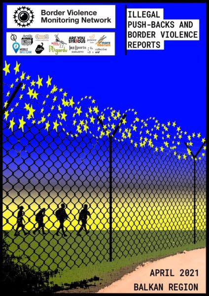

### AYS Daily Digest 14/5/21: Discrimination during the pandemic, both in policy and in practice
#### In Greece, double COVID\-19 standards towards people on the move on the one side, and everyone else on the other side & How does Europe care for asylum seekers when it comes to protection against COVID\-19? / Frontex still complicit in returns to inhumane conditions in Libya / Activists in France need support to be able to provide food to people on the move / Indignation in Germany / online talks and conferences, recommended reads & more

 **\)**](assets/5ebfea1a0e90/0*3XSggFbb9JIHLEIO)

Holding a candlelight virgil for the victims of the Kabul school attack, raising a voice in the worst of the worst EU refugee camp, “Moria2”— Let us live\! Afghanistan is not safe\! \(Photo report by: [**Franziska Grillmeier**](https://twitter.com/f_grillmeier) **\)**
#### FEATURED

In both policy and practice, across Europe, the refugee population in different stages of their request for protection are facing different standards and obstacles that must be acknowledged and overcome\. Double standards continue when it comes to COVID\-19 protection, both in terms of the measures imposed on people and the vaccination practice\. 
This is no novelty and public health experts around the world have warned that confined sites like detention centres provide dangerous conditions for infections to spread rapidly\. During 2020, different countries responded differently to the current conditions regarding the pandemic\. Some states have changed procedures, but kept people in the same spaces, while others have had to move people from potentially risky environments\. In March last year, the UK released 350 people from detention centres due to the COVID\-19 pandemic, in response to a legal challenge\. Some European countries released detainees because of the suspension of asylum procedures or lack of prospects of return \(Italy, France, Germany, \. \. \)

In Greece, although some restrictions were lifted for the population, this does not apply to people on the move living within the reception facilities\. According to the official reports, two cases of coronavirus infected people were identified in the Kara Tepe population of people on the move this Friday, 17 cases on Thursday and 18 on Wednesday\.
It is also reported that currently 66 people positive for coronavirus are placed in the quarantine area, along with their close contacts, making a total of 137 people there, in a space with capacity for up to 190 people\.

“Through loudspeakers, live broadcasts, messaging applications and printed announcements, asylum seekers are thoroughly informed to avoid overcrowding and the risks involved in the spread of COVID\-19", the Ministry of Immigration and Asylum included in their announcement, to add to the irony of their treatment of the people concerned\.

> It is essential to eradicate the highly politicized and nationalist discourse that has characterized the pandemic response across the continent thus far\. 

People on the move — refugees, internally displaced persons and stateless persons — face even more issues of access, freedom of movement, protection mechanisms, but also the universally defined conditions proposed to stop the spread of COVID\-19 and protect people from it \(vaccination\) \. In Croatia, the people staying at the reception centre Porin in Zagreb are not being vaccinated, even though they represent part of the population at a higher risk of infection, given the number of people living in the centre, the inevitable communal lifestyle and the fact they have a limited possibility of protecting themselves additionally against the spread of the virus\. Even those people who have been staying at the centre for a long time, waiting for the answer to their asylum request, and some of the people who work and also have a life outside the centre, have not been offered a chance to be vaccinated\. We draw attention to this given the fact that the Croatian government, ahead of the usual tourist season, has frantically been calling on people to come and get their vaccines in large numbers at the local Expo \(ironically, not far from the Reception Centre\) and many young people have already also been vaccinated\. However, given the number of those whom the vaccine has not reached, whether due to the chaotic organisation of distributions, which largely depends on family doctors, or due to the scepticism of some, there is still quite a large number of older people who have not yet received both doses of the vaccine\. This, coupled with the government’s policies and stance on asylees and asylum seekers, as well as the overall opinion among the general population, probably would not result in a good perception if they had vaccinated the \(small number of the\) people at the Reception Centre, especially ahead of the local elections\. So, they can only hope some of the doctors in charge of them decide to find a way to let them in on the vaccination waiting list\. Until then, our integration centre in Zagreb is open to everyone in need of hygiene products that can help these people protect themselves against the virus, as we continue to advocate for a responsible and fair approach to health protection\. Needless to say, none of the people from the detention centre in Ježevo have been vaccinated either\.

> Science and need, not wealth, nationality or legal status, should guide vaccine allocation and prioritization\. 

[Read more](https://www.nature.com/articles/s41591-021-01328-3) on the topic of ensuring access to COVID\-19 vaccines for refugee and displaced populations\. 
Do you know what is the situation like for people in your country?
#### REPORTING

A total of 42 pushbacks, impacting 1,125 people at borders across the Balkans, are documented in the latest report of the Border Violence Monitoring Network\.
The April report analyses, among other things:
- Court ruling for Madina Hussiny’s family
- Translation and linguistic violence in pushbacks
- Border sites used in Albanian & Romanian removals
- Cycle of pushback violence in the Evros region
- Right wing delegations and harrasment of squats

> Read the full report to find out more on these topics and other developments in April, including the expansion of surveillance in Greek camps, the closure of Kara Tepe, large pushbacks from Samos, and the COVID\-19 conditions in camps in Bosnia\-Herzegovina\. Together, these updates offer a grim insight into the way transit, reception and removals are being structured violently against people\-on\-the\-move in the Balkans\. 

#### SEARCH AND RESCUE

Two boats were spotted by the [Pilotes Volontaires](https://www.facebook.com/pilotesvolontaires/?__cft__[0]=AZUpHky1MrWt2pSm_B9o4qrqH5xgqbe3DEjQQGEv-di5RZuOAiSbxFAUKZ9vQ4dWINgraElVowmP_GHqbLnYkdd-Uf-XNHuewug3FMYEYTxo4FMeM1gFYpsTRqUOnRgQpDIdo2GBJNKRSIdqr94EiuQ72FETzPVrlUAHhKXMc6EBEVamaAJXscZgHvwqZGg7g_G0VJYFmM3IcEs5r-EKZeu6&__tn__=-UC*F) team who is back in the SAR area\. Two people from one of the boats were rescued by the Sea Eye 4 crew\. However, the second boat is the same one Alarm Phone reported about, allegedly with 50 people on board who were in distress at sea\. “Their engine stopped working and the boat is adrift\. We informed authorities, but up to now no rescue arrived\. The group spent a horrible night out at sea”, they wrote\. The people were reportedly spotted by Frontex and shortly afterwards intercepted by the Libyan Coastguard\.

> We condemn this aerial surveillance that allows the Libyan authorities to intercept thousands of people on Europe’s behalf\. 

Also, be sure to read the report [**Med: Investigations Reveal Frontex’ Complicity in Interceptions and Returns to Horrors in Libya**](https://www.ecre.org/med-investigations-reveal-frontex-complicity-in-interceptions-and-returns-to-horrors-in-libya/) **\.** 
An important thing to keep in mind when it comes to the activities in the Mediterranean that end up with people being returned to Libya:

■■■■■■■■■■■■■■ 
> **[Jeff Crisp](https://twitter.com/JFCrisp) @ Twitter Says:** 

> > Here we go again.
1. These people are now locked up in an abusive detention centre.
2. The process of interception &amp; return is sponsored by the EU.
3. UNHCR &amp; IRC are unable to prevent seriously injured, traumatized and vulnerable people from being incarcerated.
4. Bloody logos. 

> **Tweeted at [2021-05-14 16:04:37](https://twitter.com/jfcrisp/status/1393235812712603653).** 

■■■■■■■■■■■■■■ 

#### ITALY

The European Commission [urges relocation](https://audiovisual.ec.europa.eu/en/video/I-205316) to other member states from Italy, where the number of arrivals has [surpassed 11,000](https://www.independent.co.uk/news/world/europe/migrants-mediterranean-crossings-italy-lampedusa-b1844761.html?r=34082) in 2021, ECRE reminds\. [According to the Missing Migrants](https://missingmigrants.iom.int/region/mediterranean?) project, more than 600 people have lost their lives on the Mediterranean since January attempting to reach Europe\.
### One trial less for Salvini

As we have been reporting, after the [Italian Senate voted](https://www.euronews.com/2020/02/12/salvini-faces-key-senate-vote-over-migrant-kidnapping-allegations?fbclid=IwAR2qlwEzrrIMysnobYzUf-SgO-eYncm_r5AJubYHaXytyeMLcvrTFxvHAUY) , Matteo Salvini, former interior minister and leader of the right\-wing party La Liga, faced charges over the ‘migrant kidnapping’ he was accused of facilitating last July\. It concerns the event when 131 people were prevented from disembarking at an Italian port for almost a week\. During that time, there was an outbreak of scabies and a suspected case of tuberculosis on board\. This was not the only indictment that he faced, as his charges included those for ‘detaining’ 107 people on an NGO rescue boat in Sicily for six days in August, a case that could cost him could up to 15 years in prison if he is found guilty at the court in Palermo\.
However, the Catanian judge for preliminary investigations Nunzio Sarpietro decided Salvini should not stand trial on charges of kidnapping a group of migrants at sea\. This gives a wind in the back of Salvini, who is expecting the second court decision very soon\. Of course, he told the [Italian media](https://www.repubblica.it/politica/2021/05/14/news/processo_gregoretti_salvini_verdetti_non_luogo_a_procedere-300945358/) he would be doing the same once he is “back in the government”\.
#### FRANCE

The practice that caused concern, even outrage with some, of the government asking OFPRA to take away the protection from those people the government considers contradict the values of the Republic, has resulted in 147 people being stripped of their protection in the past three months alone\. This compares to the previous year when it was done in 100 cases, and in 2019 in only 77, as InfoMigrants [reported](https://www.infomigrants.net/en/post/32201/deportation-is-not-automatic-for-migrants-when-asylum-protection-status-is-withdrawn?fbclid=IwAR04kuXY_ky1nse3DFtsmTMkZv2iJjscndh_NPZTrmrqN9yKldae9Y2C500) \.

> According to a source within the organization, by the end of the first term of 2021, OFPRA had even set up a department dedicated to “processing all procedures for ending asylum protection status”\. 

In these cases, OFPRA acts “at the request of an administrative authority, which is either the minister in charge of asylum or the prefect, according to articles R\. 511–2 and R\. 512–2 of the code of entry and residence of foreigners and right of asylum \(CESEDA\)”, but, given that deportations are defined and governed by a series of elements, the relationship between the withdrawal of status and deportation is not automatic\.
### Paris leaving people hungry

“Supplies are running out\. Non\-profit organizations report a constant increase in the number of people receiving free meals and sometimes struggle to serve everyone,” it is [reported](https://www.infomigrants.net/en/post/32151/migrants-in-paris-sometimes-we-leave-without-having-eaten-for-the-day?fbclid=IwAR3Btpd-2Z7PYr-TwAqrPYMvGnj4iED333ySwtiikQ70YV1cCf88sjJBUg0) by a number of sources across the French capital\.

The number of hot meals Solidarity Migrants Wilson has been serving every Tuesday evening at the Porte d’Aubervilliers has more than doubled\. Nowadays, most of the mobile teams report they have either distributed everything and barely had enough food or that they ran out in the end\. 
**If you want to support this collective, you can do so in the [following ways](https://www.helloasso.com/associations/soutien-a-wilson/formulaires/1?fbclid=IwAR08U605K3WEmnLyEu89dAF9OOtXGeCzGtut7JRnbk4JiSrlLvg_HMD_Srs) \.**
#### GERMANY
### Citizens opposing the policies

AE Act, a transnational network of grassroots initiatives in Africa and Europe fighting for freedom of movement, equal rights and self\-determined development, is organising a protest ‘tour’ in Berlin, in front of several embassies, demanding an end to the support of deportations\.

At the same time, while the federal government continues to pursue a restrictive course, more and more municipalities are becoming safe harbours and are prepared to welcome people in need of international protection\.

[Seebrücke International](https://twitter.com/Seebruecke_intl) reports that Duisburg has also declared itself a Safe Harbour and is willing to take in people seeking protection\.

**You can make your city a Safe Harbour, too\. You can find all the information on their website: [http://Seebruecke\.org/en/](https://t.co/Iy0n9t0ch9?amp=1)**
#### SWEDEN
### Against deportations

Groups in Sweden are warning about an announced deportation that is to take place on 18th May, calling on everyone to be aware of the current situation in Afghanistan, highly dangerous for everyone who gets sent back there, and they call for support through drawing attention to the issue\. 
There will be small protests across the country this Saturday, May 15, at 11am, and also protests outside the detention facility in Märsta, where the buses will leave for Arlanda airport\.
#### DENMARK

As we have extensively been reporting, many Syrians who have obtained protection in Denmark now risk being returned to war\-torn Syria\. The decisions issued by officials have redefined the conditions under which they could be returned, so that just a “reduction in the intensity of war in the country can classify the area as safe enough for return,” as [Mellemfolkeligt Samvirke](https://www.facebook.com/msactionaid/) and [Amnesty International Danmark](https://www.facebook.com/amnesty.dk/) , some of the organizations opposing it and leading the call for protest \( **Demonstration: Beskyt syrerne i Danmark — Syrien er ikke sikkert\)** , remind us\. Most refugees who have obtained the protection that is now being put into question by the government \(temporary residence permit under section 7\.3 of the Aliens Act\) are Syrian women and the elderly\. Most of those who have obtained status and protection under section 7\.1 are men who have in particular fled Assad’s military service or are personally politically persecuted\.
“One will now de facto split up families, where one will be able to repatriate the women to Damascus, where their husbands, fathers or brothers are wanted by the regime,” the activists warn\. “For the Syrian refugees who are put in a ‘deportation position’, forced deportation is most likely in place if Denmark re\-establishes diplomatic relations with the Syrian regime\.”

The same day, next Wednesday, there will be an online discussion about the issue, open for everyone to follow:

#### GENERAL

For people on the move who have been using WhatsApp to exchange sensitive information and their personal information, it might be useful to know that the new usage and data protection provisions of WhatsApp are entering into force, which will remove even more control over their data from users than before\. On Tuesday, the Hamburg Commissioner for Data Protection and Freedom of Information \(HmbBfDI\) issued an order that Facebook Ireland Ltd\. is forbidden to process personal data from WhatsApp\. This was an unusual step, as the Irish Data Protection Authority is actually the lead supervisory authority over Facebook\. But he was right if European data protection law is to be enforced uniformly and effectively in Europe\. Find out [more](https://l.facebook.com/l.php?u=https%3A%2F%2Ftechxplore.com%2Fnews%2F2021-05-whatsapp-privacy-terms.html%3Ffbclid%3DIwAR3-KmU03VCC5d8MuSPwlED92EM7iUvtycLSKObsRKiznI0NfVmwDblqvmU&h=AT3CXYtEIBHw5AzaYLnOBYKcvH_myttsoqY2hq0n8ycAy6mYuI4LiJsTBw8pFTBhN4U5zWXggaHn8QRbobk4AXzY9CKzGTSP3yVo6gbcp5s189KLL3nuT6ACnxv7ryCf-r9em-bwiYpVLA&__tn__=R]-R&c[0]=AT3FNoVHkfiQQ5RsmvbKRMv6FXDo8csRTyEKaw7i-djSznCRKc1CQrOfKh3eIFcd10JzilwEACL2kCg5fEBX-s7szgPqy6Av5vKGitvLHCkIm7O_ZqgP7GI_aNcjdwvWLVpLKV-kvGrCkOmP95ZYO8V6s6qj6603xBaH4j08P-miyuYU7ntduuD1xE6Rosya_DCsS1Bgk7A) \.
### Events
- Webinar “Our Ships\! Vessel visit of Sea\-Watch 4 & encounter rescued live from board” by News From The Med, May 15:

- [Border Criminologies](https://twitter.com/BorderCrim) is organising a three\-day online conference seeking to contribute to the limited body of evidence about immigration detention in Europe, from 24th to 26th May\. Find out more:

[Landscapes of Border Control and Immigration Detention in Europe’](https://www.eventbrite.co.uk/e/landscapes-of-border-control-and-immigration-detention-in-europe-tickets-151045237371)
#### FOR FURTHER READING
- Absurdity of pushback practices — “Odai, recognized refugee in Germany, got illegally deported from Greece to Turkey, while visiting his brother in Greece”:

[](https://l.facebook.com/l.php?u=https%3A%2F%2Fwww.josoor.net%2Fpost%2Fabsurdity-of-pushback-practices%3Ffbclid%3DIwAR3nrgQoz6PZI-OzKlYR_sGb-4ZctA8I8T9PgkkcDXF1t9WPzxXwEW-alI8&h=AT3jO4XGolUcMOXzyoQETaqsg2h0P3GQkBdtTNVsAHpH8i1tzPPaVTVMdMwPFekuTHt64wLmkg6wR6g0Gaauwl0rLuq7AJA8kLEcAnSNWrXGGPdA3-0CzfoTvSA5nZ2MtNd8VeAWfVmMSA&__tn__=R]-R&c[0]=AT2T9dcZU6t3bqCxdiB3IjPb9SE9dfCxYp5XcDouM1DvvDiCak67hzwE-TLJurjUREcL_T85y78B0oyx02eEg3ug53m2_ipYJj92ztWg1k7KelSw92gcOcr_LRRxMiA6Hmtdt23-YlSuoGda5anixSEh2lRRrpGwv96dWO9sDPa8hDeBsApf9XAgLJUqaWC7VfB0GlMu4X-nyLQGZQ)

- Canary islands show we have learned nothing from Lesvos:

- Podcast: Journalist Giorgos Christides joins The Greek Current to discuss the latest letter from the Council of Europe to Greece which expressed “deep concern” about allegations of pushbacks and Greece’s official response, and analyze the latest developments on the migration issue:

**Find daily updates and special reports on our [Medium page](https://medium.com/are-you-syrious) \.**

**If you wish to contribute, either by writing a report or a story, or by joining the info gathering team, please let us know\.**

**We strive to echo correct news from the ground through collaboration and fairness\. Every effort has been made to credit organisations and individuals with regard to the supply of information, video, and photo material \(in cases where the source wanted to be accredited\) \. Please notify us regarding corrections\.**

**If there’s anything you want to share or comment, contact us through Facebook, Twitter or write to: areyousyrious@gmail\.com**

_Converted [Medium Post](https://medium.com/are-you-syrious/ays-daily-digest-14-5-21-discrimination-during-the-pandemic-both-in-policy-and-in-practice-5ebfea1a0e90) by [ZMediumToMarkdown](https://github.com/ZhgChgLi/ZMediumToMarkdown)._
