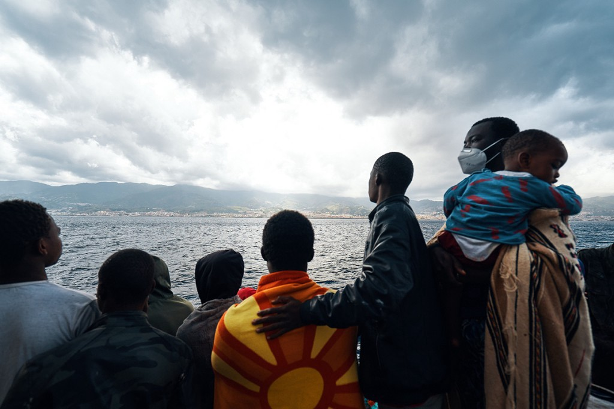
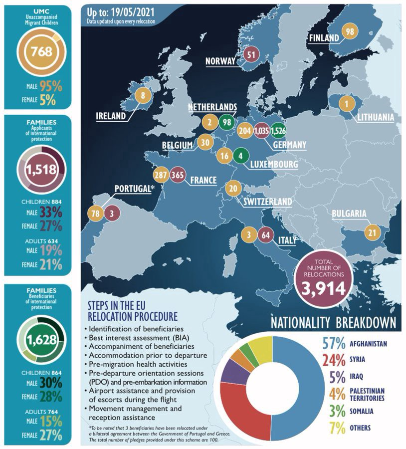
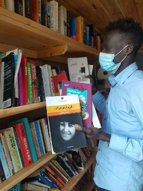
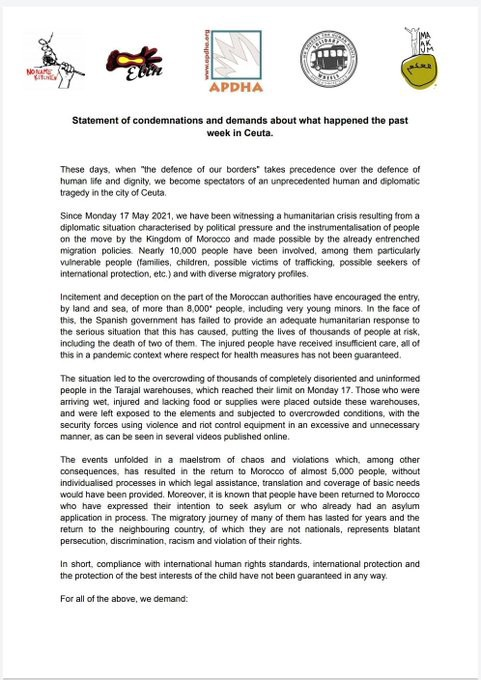
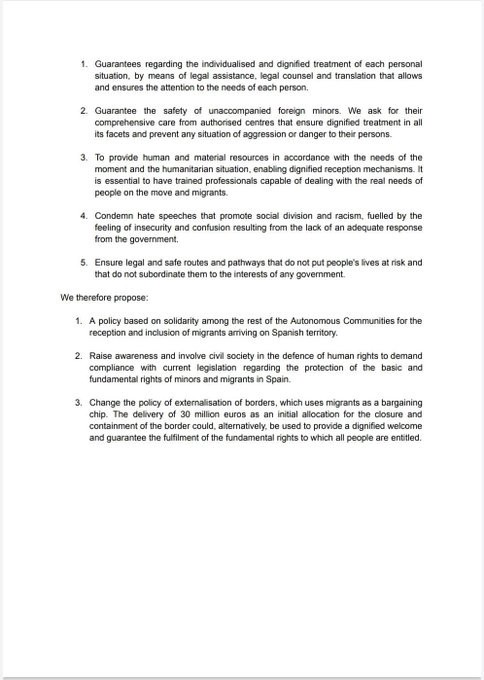
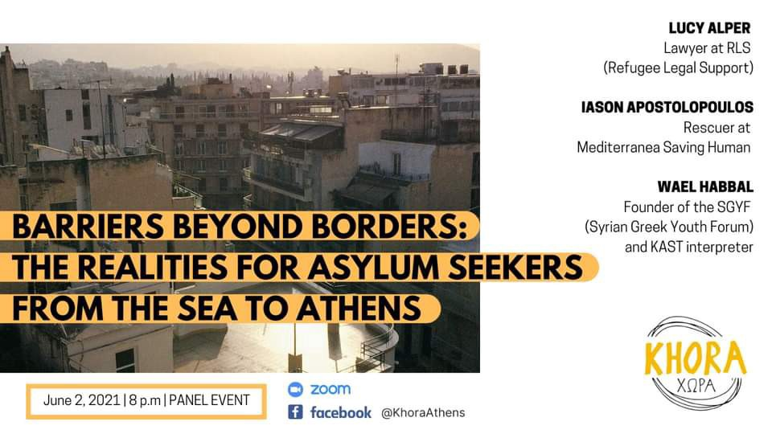
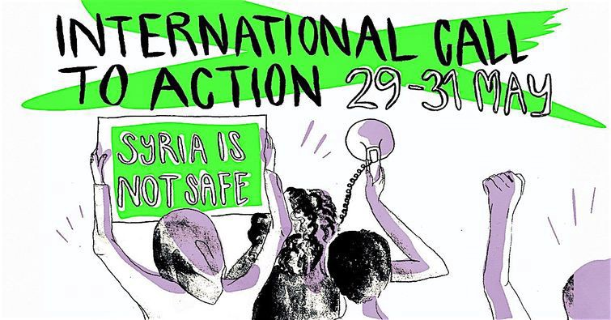

### AYS Daily Digest 21/5/21: “If the EU continues to tilt in this direction, then we can write off the 1951 Refugee Convention for good\.”
### Greek Migration Minister Mitarakis says pushbacks are necessary / Acquisitions are overturning the very first acquittal verdict in the Easter Monday pushback case of the Maltese officials / The uncertain situation for unaccompanied minors in Ceuta / Calls for participation, support and indignation — take part\! / Recommended reads and more

[Are You Syrious?](?source=post_page-----aacf503e4e7d--------------------------------)

[May 22](ays-daily-digest-21-5-21-if-the-eu-continues-to-tilt-in-this-direction-then-we-can-write-off-the-aacf503e4e7d?source=post_page-----aacf503e4e7d--------------------------------) · 11 min read

The title is a quote from Sea\-Eye chairman Gorden Isler\. Featured photo — On board the Sea\-Eye 4 look at Italy’s shores \(All copyrights reserved — [Photo: Guillaume Duez/Sea\-Eye](https://thecivilfleet.wordpress.com/2021/05/21/rescued-refugees-reach-dry-land-after-authorities-send-them-on-a-two-day-detour/?fbclid=IwAR0KBMki-RvcqishG1sGcOcx5x0HJNtLvpBzQsQHirC0e06SRbeqRISoy40) \)
### FEATURED

GREECE — The approach to people on the move along the Balkan route has been far from fair, legal, or even humane\. Greece, as the country where most people enter when coming from Turkey, has long lost the principle of individual assessment of the need for protection for each person expressing the intention to seek asylum\. On top of that, with the weak justification that Turkey has failed to do its part in the infamous EU\-Turkey deal, authorities in Greece have been practicing pushbacks, both in the Aegean and on the mainland, along the Evros area\. 
Although Greek officials have so far been denying any pushback taking place — a practice that is illegal under the law, — that has changed\. Now, with the support of Frontex, the Migration Minister, Notis Mitarakis, says that “interception of the boats is legal and necessary for the protection of the borders”\. Frontex currently deploys the largest number of officers from its standing corps in Greece, with 660 working shoulder\-to\-shoulder with their Greek counterparts at the sea, land and air borders\. Frontex also has 16 vessels in the Eastern Aegean and other heavy equipment on the Greek islands and land borders\. The Frontex chief, Leggeri, has reportedly thanked Mitarakis personally for the “excellent cooperation” of the two sides in protecting the borders, a “sovereign right and obligation fully compatible with international law”, given that Greece has taken significant steps to expand its capacity to host the growing number of Frontex officers\.

Among many reports that document Greek pushbacks, among the most vivid ones are surely the media reports that document how “the Greek coast guard was stopping refugee boats in the Aegean Sea, destroying their engines and then pulling the boats back into Turkish waters”, at the same time failing to adhere to the principle of “non\-refoulement” by practicing these group expulsions back to Turkey\.
At the time of reporting this, the Alarm Phone team [reported](https://l.facebook.com/l.php?u=https%3A%2F%2Ftwitter.com%2Falarm_phone%2Fstatus%2F1395653572029788163%3Ffbclid%3DIwAR3pEabamG-REfYfP-nlE8iNmielA4ti0V-z5qqpkueXPnvuEhmSX_qkjXI&h=AT3CUsmUdFPsuaG9J_hgna0aOJnL9QUair143_CDMQ7wYymcfqxcqBmqnLIksKmroP0m4KzGMbUNTD52LtFmBABEIdIa6fmtwfjNaajALASqq75hIw2cOh9FdZaRAazSv3iFSfEqUUj3PL5c2HuzFPLUV0X_mA&__tn__=R]-R&c[0]=AT3F3EJRjx61Rp_iUYgKOFGcpm79aI3yp6VBS1W-dFcxOKtoApnQcNYLIxzQmnXTBHEe-XaTPINAahukAQUlEeCdJWgujgm-oeorcGuOFElION7rAN064QjpOPKEnS3PMr9jHsyrhhMJsR8_jGzfTtcSoAZX) another pushback\. The people who contacted them were forced back into Turkish waters by the Hellenic Coast Guard, who reportedly left them adrift at sea\. Finally, the boat was found by the Turkish Coastguard\.
### GREECE
### Granted international protection — where are the people now?

3,914 people, including 768 unaccompanied children, who have been granted refugee or subsidiary protection status have been relocated from Greece to other European countries since April 2020\.

ECHO Refugee Library is back in the field\. This week at Korinthos Camp, a number of people were happy to see them back and to make young and older readers more alive and hopeful in the midst of a tough situation\. _“I am glad you are here\. You have been missed\. We have not had anything to read for months\!”_

### MALTA

The turn of the tide in the ‘Easter Monday massacre’ case

The acquisitions are overturning the very first acquittal verdict in the Easter Monday pushback case of the Maltese officials that we have extensively been reporting about in the past year\.
### [AYS Daily Digest 01/05/2020: Malta’s government has been involved in the push\-backs on Easter…](ays-daily-digest-01-05-2020-maltas-government-has-been-involved-in-the-push-backs-on-easter-cbb267099401)
### [57 rescued persons will stay on a ship off the coast of Malta until EU can rehouse them // Refugees intercepted at sea…](ays-daily-digest-01-05-2020-maltas-government-has-been-involved-in-the-push-backs-on-easter-cbb267099401)

[medium\.com](ays-daily-digest-01-05-2020-maltas-government-has-been-involved-in-the-push-backs-on-easter-cbb267099401)

As a reminder — 12 people were left to die in the Maltese search and rescue area and 53 survivors were handed over to Libyan torturers\. Now the lawyers of these people have provided a reconstruction that the judge deemed worthy of further investigation\. The shipowner Carmelo Grech, a fishing boats owner, admitted before the Court of Malta that he had been hired and paid at least four times by the Maltese government to illegally bring people back to Libya without leaving any traces\. The deal was this: Libya would take back the migrants as long as Valletta would pay the costs for their imprisonment\. However, there is no reference to respect for human rights\. Read more in reports of the Italian [media](https://www.avvenire.it/attualita/pagine/cosi-malta-mi-pagava-per-respingere-illegalmente-i-migranti-verso-la-libia?fbclid=IwAR0YX-Vfil3p9rHt50ZxQ69KStj9nknrIjZzX8g1yqnQ25GZ7x9kVLZeazA) \.

BOSNIA AND HERZEGOVINA

Bihać

No Name Kitchen volunteers have collected [testimonie](https://www.facebook.com/plugins/post.php?href=https%3A%2F%2Fwww.facebook.com%2FNoNameKitchenBelgrade%2Fposts%2F1241768769554738&show_text=true&width=500&__cft__[0]=AZUpcexL-gMxEucRfa_Js6z0vexdu_Y9rdswljJ14BnCr-p9kce4OlQzmWXZh7WD6sTVPc-JUnJgabY773jPjvPytvuG47jWmKjSahCQcm7a5Gge-8P2keUvSCnCnIVv4P7qJYcmY-P6sgsNE1agM-mD6zHZJNaF0yb3MZ42GbGc7lWfjtQY4fhR8NjmRE4Mf1M&__tn__=H-R) s from people involved in a large\-scale eviction from a nursing home in Bihać that took place last Friday — “evicted individuals report being taken 40 kilometers from the location and having to walk back only to find their belongings taken\.”

ITALY

Disembarkation followed by racist ‘welcome’

On Friday, May 21st, the rescue ship SEA\-EYE 4 entered the port of Pozzallo\. Shortly afterwards, the first of the 400 rescued people, including 150 children, were allowed to leave the ship\. 
According to the testimonies of Sea Eye, the disembarkation was accompanied by racist comments from the local authorities\.

SPAIN

What will happen to unaccompanied minors?

One of the unaccompanied minors who swam their way to Ceuta, the first to be accompanied to the border by two social workers from the autonomous city with the intention of handing her over to her parents, was forced to return to Spain when, at the last moment, the Moroccan _Mehanis_ did not allow her passage\. Many others who were staying at Trajal warehouse escaped this Friday afternoon, [reportedly](https://cadenaser.com/ser/2021/05/21/sociedad/1621609723_888517.html?fbclid=IwAR3WaSUIC8ie1cvZbhKA2VJHIiVp9DC49jd5dVS7GOKCGj9auQO5Z0XYgUM) , for fear of being expelled\.

Given that approximately a fourth of the people who arrived on the coast of Ceuta a couple of days ago are children and minors, the Spanish Ombudsman has [called on the Ministry of Social Affairs](https://www.eldiario.es/canariasahora/migraciones/canarias-concedio-134-autorizaciones-residencia-menores-migrantes-tutelados_1_7921090.html) to reach an agreement with [local authorities](https://www.efe.com/efe/canarias/sociedad/defensor-pide-al-gobierno-que-acuerde-con-las-ccaa-un-plan-mejore-la-acogida-de-menores-extranjeros-no-acompanados/50001312-4533624) to improve the protection of unaccompanied children in the Canary Islands\.

Data from the Government of the Canary Islands reveals that as of March 2021, 2,577 unaccompanied children were on the islands, 2,110 of whom were hosted in emergency accommodation and with only 134 obtaining residency permits in 2020\. Accordingly, the Ombudsman has proposed to the Spanish Ministry of Social Affairs to develop a multiannual Strategic Plan for the integration of unaccompanied children covering identification of protection needs, identification of potential victims of trafficking, age determination procedures, documentation of legal residence and socio\-labour integration upon the age of 18\.

Also, Judith Sunderland of Human Rights Watch reminded everybody that the subsequent move by the Spanish officials of sending people back was contrary to international and Spanish law — “It seems very unlikely for Spain to have returned 5,600 people in the space of a matter of hours in a way that allows for any kind of individual assessment or careful examination of individual circumstances\.”
After almost 45 years of ‘stand by’ tension, the renewed [diplomatic tensions](https://www.infomigrants.net/fr/post/32350/a-ceuta-les-migrants-refoules-des-leur-entree-dans-l-enclave-bruxelles-denonce-un-manque-de-respect-envers-l-ue) between the official Spain and Morocco are one of the reasons for these massive arrivals\.

Many people see swimming to the Spanish enclave as their quickest and most likely path towards a chance for a better life\. The same thing is happening in Melilla\. This route, however, is the most dangerous one\. Two people have died since Monday trying to reach Ceuta\.

No Name Kitchen is putting together masks and food items for individuals in Ceuta without basic access\. Along with Elin Association, Maakum Ceuta, APDHA, and Solidarity Wheels, they have released a statement condemning developments in Ceuta:

[Follow and support](http://Bit.ly/SOSCEUTA) the ground teams there\.

FRANCE

On Thursday, the French authorities rescued 106 people who were trying to cross the Channel to reach the English coast on three boats\. One of them had fallen into the water\. All are safe and sound, as reported by InfoMigrants [here](https://l.facebook.com/l.php?u=https%3A%2F%2Fwww.infomigrants.net%2Ffr%2Fpost%2F32427%2Fune-centaine-de-migrants-dont-l-un-tombe-a-l-eau-secourus-dans-la-manche%3Ffbclid%3DIwAR25TDdxjsR9341HdLfTQKlMfJrAU75fQzxQx6RDv6foJCf16xPigUQf2wI&h=AT0k3sxESNUZW3YgnYFyj_Dwr4qK-MAg8l_KV1yA2IzmnbPma3IQWXwRMW7ZPrheAc7OGylC7w_i1OuGdFee0uqlR8wt2XR5LDqIDl2RRlJWVP15a2djyFleGgqyg2kBYlDvhwm4UI_5syYfIUXBLpedk9_4JA&__tn__=R]-R&c[0]=AT3wA0r1Pw1mQ5rVmEBZ7zHeTpaGat8KLB4qsbDzEDThjBBVto5J9UA7WflO-hVAe9N7HNrz9-DsonXs4liaP-cmVO7V7bh_lwSTSRTpTeH-2cDmFWC8IH4ycy1f-zU5cLumecL-4F-R3Ym77lPRnYBj7cNXPEb1-z6X-nr4TqJaqwbthaEvR-aZ2R5qvZc8G1ANSxfm_RI3XjYucQ) \.

GERMANY

Leverkusen is a safe harbour\!

The city already declared itself a safe harbour in 2018\. In 2020, the city council extended the resolution and is prepared to take in groups of people in particular need of protection at the EU’s external borders, but especially minors from the camps in Greece beyond the regular reception quota\. The city of Leverkusen joins the alliance “Cities of Safe Harbours” in order to demand from the state of North Rhine\-Westphalia a reception programme for unaccompanied minors as well as minors and their families who are currently being detained in Greece, Seebrücke reported\.

Make your city a safe harbour, too\.

You can find out how to do this on their homepage\.

UPCOMING EVENTS

**Barriers beyond borders: the realities for asylum seekers from the sea to Athens** — a discussion on the realities that asylum seekers face when they arrive via the sea through to their journey in Athens
An expert panel combining lawyers, those on the forefront of the refugee crisis involved in humanitarian rescue operations, and people who have lived through the experience of coming to Athens as an asylum seeker

The event is taking place **this Wednesday, online** — [link here](https://www.facebook.com/events/2876899215883416/)

Khora are running this event in tandem with their crowdfunding appeal to raise EURO 10,000 to fund interpreters that are vital to their asylum support services\. The Khora Asylum Support Team are on the front\-line and provide vital information and support to anyone that needs their help\. Their interpreters are incredibly vital — they have professional and personal lived experiences of displacement and without them, Khora’s Asylum Support Team would not be able to communicate with the people seeking their help\.

You can support Khora Asylum Support Team at [https://khorafundraising\.org/](https://khorafundraising.org/?fbclid=IwAR3ItAnS3Z5VSi8typGtpxpR9mC8MshZbh3GW8_g6t_ecFSzm5kzvT9HWGE)

### May 29 at 12 pmUTC\+02 — May 31 at11 pm UTC\+02

[**International call to action: protest in solidarity with Syrians in Denmark**](https://www.facebook.com/events/780432705825674/?__cft__[0]=AZWKJqHmXsF_t0bYKyIOL3fjVy_yTKKZ7x8B4tbf6ibSHOU9xsQvPKav3rfVnDjUjrlqb9lBqDfc10SyWOzuQ8WzncFI2TKIBb_QX9WOuYlDg8PhVNk54pnwq5AnErW4lxwqwu5EDWRzm311mLnyzXO2rl7GcG1_7kGgdGPeane7IiJI2MJaljVdscJfgab1b28&__tn__=-UK-R)

In Copenhagen, Denmark, over 50 members of the Syrian Association in Denmark \(SFD\) have begun a sit\-in protest in front of the Danish Parliament\. They intend to continue their protest until the following demands are met:
1\. Recognize that Damascus and Syria are not safe\!
2\. Roll back the ‘paradigm shift’ and instead embrace an asylum policy that protects refugees, not ruins our lives\.
3\. Put an end to uncertainty, for the sake of our lives and our children’s lives\.

We call upon you to act in solidarity with the Syrians in Denmark\. You can do this by joining or organizing protests in front of Danish embassies or in public spaces, and/or writing to Danish ambassadors and media wherever you are\!

Asylum is a human right\!
Syria is not safe\!
No deportations without resistance\!

\*We encourage everyone to respect the local corona regulations\*

Follow the Syrian sit\-in protest here: [https://www\.facebook\.com/events/3583984351707907](https://www.facebook.com/events/3583984351707907/?__cft__[0]=AZUwzpH53Y9JC4kSqsX4fRwxi_tExpiwdWrzQh4lN7xA0uh-CvRyIyzH0TnhCex1Mf8_BemZTTHzeK_qmF3PoyPU-Bz7GgOeC_NP3eMVUwaBx_q3vip8TL_9VSCzuLF81vE&__tn__=q)

If you set up an event for a protest in your country, please share it with us and we will help to spread the word\!

### GENERAL

In this [**Policy Paper**](https://www.ecre.org/wp-content/uploads/2021/05/Policy-Papers-07.pdf) ECRE offers an assessment of existing accountability mechanisms in regard to the European Border and Coast Guard Agency \(Frontex\) and recommendations to systematically use and strengthen these scrutiny tools, as well as to add new accountability mechanisms\.

EU law precludes automatic recognition of refugee status of minors in order to ensure family reunification

Advocate General Richard de la Tour has delivered an opinion on domestic legislation granting international protection to family members of a recognised beneficiary of international protection, where that family member does not individually qualify for protection\.

After the German Federal Office for Migration and Refugees found that a child of Tunisian nationality did not fulfil the substantive conditions for the grant of that status and that she could claim the national protection of her country of origin, the applicant brought an appeal before the Federal Administrative Court, which referred [three questions](https://curia.europa.eu/juris/document/document.jsf?text=&docid=227651&pageIndex=0&doclang=en&mode=lst&dir=&occ=first&part=1&cid=5026977) for interpretation by the CJEU, as ECRE explained in their weekly [report](https://us1.campaign-archive.com/?u=8e3ebd297b1510becc6d6d690&id=6ccf9f8797&fbclid=IwAR01qZ5dmGnsiWNhp55qC7AfbcxrikhsueClbmgLdcNJ1lPCrh6xYZMlkLM) \. 
He “proposed that the CJEU rules that Article 3 of the Qualification Directive be interpreted as precluding national legislation, under which the competent national authority is to seek to ensure the maintenance of the family unity of the refugee or beneficiary of subsidiary protection by granting his or her minor child international protection without that authority carrying out an individual assessment of the application, irrespective of whether the child’s situation demonstrates a need for international protection within the meaning of Qualification Directive or is consistent with the rationale of international protection\.”

Also, the CJEU [published](https://curia.europa.eu/jcms/upload/docs/application/pdf/2021-04/ra_pan_2020_en.pdf) its annual report for the year 2020\.

In their efforts to strengthen the relationship \(read: influence\) of EU and the African countries, Commissioner Johansson visited Tunisia “hopeful the EU could reach a deal with Tunisia to provide economic support in exchange for a commitment for Tunis to manage its borders”\.

We will be reporting more on the EU policies regarding this and the role of Frontex in the area\.

In Lebanon — “A judicial complaint will be filed against the Lebanese protesters who attacked Syrian refugees heading to the Embassy to cast their votes for the Syrian presidential election”, said the Syrian ambassador to Lebanon, as the Assad supporters were arriving in buses to vote at the embassy in Beirut\.
### WORTH READING
- Realities of undocumented people — “I give you money and we don’t talk about it anymore”: an employer tries to buy the silence of an injured undocumented worker:

### [“Je te donne de l’argent et on n’en parle plus” : un employeur tente d’acheter le silence d’un…](https://l.facebook.com/l.php?u=https%3A%2F%2Fwww.infomigrants.net%2Ffr%2Fpost%2F32364%2Fje-te-donne-de-l-argent-et-on-n-en-parle-plus-un-employeur-tente-d-acheter-le-silence-d-un-travailleur-sans-papiers-accidente%3Ffbclid%3DIwAR0s52nsNUaNcnZ-t1yO5Sz_X5CzjSH0RCBH70H147r___WozYnhWTL6fNo&h=AT0wGWf0eq-GLve6WvPGPK3m0e4Qw8W01e-7Uv3nJT-nxPHxHVGC-i13hvNU1rUppFHQgxpOGmePncX54vsyX9gMyZAZzdpXJRDuE8_xoAzircT7m7hKl2ZInZCsdSKFKHeYUdg56Ygsnit0rg&__tn__=H-R&c[0]=AT3wA0r1Pw1mQ5rVmEBZ7zHeTpaGat8KLB4qsbDzEDThjBBVto5J9UA7WflO-hVAe9N7HNrz9-DsonXs4liaP-cmVO7V7bh_lwSTSRTpTeH-2cDmFWC8IH4ycy1f-zU5cLumecL-4F-R3Ym77lPRnYBj7cNXPEb1-z6X-nr4TqJaqwbthaEvR-aZ2R5qvZc8G1ANSxfm_RI3XjYucQ)
### [Birima Konaté a été gravement blessé au dos après une chute sur un chantier\. Ce Malien sans\-papiers a dû être opéré et…](https://l.facebook.com/l.php?u=https%3A%2F%2Fwww.infomigrants.net%2Ffr%2Fpost%2F32364%2Fje-te-donne-de-l-argent-et-on-n-en-parle-plus-un-employeur-tente-d-acheter-le-silence-d-un-travailleur-sans-papiers-accidente%3Ffbclid%3DIwAR0s52nsNUaNcnZ-t1yO5Sz_X5CzjSH0RCBH70H147r___WozYnhWTL6fNo&h=AT0wGWf0eq-GLve6WvPGPK3m0e4Qw8W01e-7Uv3nJT-nxPHxHVGC-i13hvNU1rUppFHQgxpOGmePncX54vsyX9gMyZAZzdpXJRDuE8_xoAzircT7m7hKl2ZInZCsdSKFKHeYUdg56Ygsnit0rg&__tn__=H-R&c[0]=AT3wA0r1Pw1mQ5rVmEBZ7zHeTpaGat8KLB4qsbDzEDThjBBVto5J9UA7WflO-hVAe9N7HNrz9-DsonXs4liaP-cmVO7V7bh_lwSTSRTpTeH-2cDmFWC8IH4ycy1f-zU5cLumecL-4F-R3Ym77lPRnYBj7cNXPEb1-z6X-nr4TqJaqwbthaEvR-aZ2R5qvZc8G1ANSxfm_RI3XjYucQ)

[l\.facebook\.com](https://l.facebook.com/l.php?u=https%3A%2F%2Fwww.infomigrants.net%2Ffr%2Fpost%2F32364%2Fje-te-donne-de-l-argent-et-on-n-en-parle-plus-un-employeur-tente-d-acheter-le-silence-d-un-travailleur-sans-papiers-accidente%3Ffbclid%3DIwAR0s52nsNUaNcnZ-t1yO5Sz_X5CzjSH0RCBH70H147r___WozYnhWTL6fNo&h=AT0wGWf0eq-GLve6WvPGPK3m0e4Qw8W01e-7Uv3nJT-nxPHxHVGC-i13hvNU1rUppFHQgxpOGmePncX54vsyX9gMyZAZzdpXJRDuE8_xoAzircT7m7hKl2ZInZCsdSKFKHeYUdg56Ygsnit0rg&__tn__=H-R&c[0]=AT3wA0r1Pw1mQ5rVmEBZ7zHeTpaGat8KLB4qsbDzEDThjBBVto5J9UA7WflO-hVAe9N7HNrz9-DsonXs4liaP-cmVO7V7bh_lwSTSRTpTeH-2cDmFWC8IH4ycy1f-zU5cLumecL-4F-R3Ym77lPRnYBj7cNXPEb1-z6X-nr4TqJaqwbthaEvR-aZ2R5qvZc8G1ANSxfm_RI3XjYucQ)
- How British community groups are helping refugees integrate — and the government is making it harder:

### [How British community groups are helping refugees integrate — and the government is making it…](https://theconversation.com/how-british-community-groups-are-helping-refugees-integrate-and-the-government-is-making-it-harder-151968?fbclid=IwAR3TJRc_sZGM4KABEN2LnHDj5wmADCD4LNyjOWviChnAJwKxygMhlKoawNo)
### [For the last 12 years, a farm in Yorkshire has had refugees from Iran and Sudan volunteer during lambing season\. These…](https://theconversation.com/how-british-community-groups-are-helping-refugees-integrate-and-the-government-is-making-it-harder-151968?fbclid=IwAR3TJRc_sZGM4KABEN2LnHDj5wmADCD4LNyjOWviChnAJwKxygMhlKoawNo)

[theconversation\.com](https://theconversation.com/how-british-community-groups-are-helping-refugees-integrate-and-the-government-is-making-it-harder-151968?fbclid=IwAR3TJRc_sZGM4KABEN2LnHDj5wmADCD4LNyjOWviChnAJwKxygMhlKoawNo)
- Syria: TikTok videos show the daily challenges of living in Idlib refugee camp:

### [The Observers — Syria: TikTok videos show the daily challenges of living in Idlib refugee camp](https://observers.france24.com/en/tv-shows/the-observers/20210521-syria-tiktok-daily-challenges-idlib-refugee-camps?fbclid=IwAR0cF8zcBmqM_yi7xmWTzbt_sMn7CYmFJwdQZQw93aAxCniQWFNUAt-32Bs)
### [The decade\-long conflict in Syria has forced millions of people to flee to northern strongholds held by rebel groups…](https://observers.france24.com/en/tv-shows/the-observers/20210521-syria-tiktok-daily-challenges-idlib-refugee-camps?fbclid=IwAR0cF8zcBmqM_yi7xmWTzbt_sMn7CYmFJwdQZQw93aAxCniQWFNUAt-32Bs)

[observers\.france24\.com](https://observers.france24.com/en/tv-shows/the-observers/20210521-syria-tiktok-daily-challenges-idlib-refugee-camps?fbclid=IwAR0cF8zcBmqM_yi7xmWTzbt_sMn7CYmFJwdQZQw93aAxCniQWFNUAt-32Bs)

**Find daily updates and special reports on our [Medium page](https://medium.com/are-you-syrious) \.**

**If you wish to contribute, either by writing a report or a story, or by joining the info gathering team, please let us know\.**

**We strive to echo correct news from the ground through collaboration and fairness\. Every effort has been made to credit organisations and individuals with regard to the supply of information, video, and photo material \(in cases where the source wanted to be accredited\) \. Please notify us regarding corrections\.**

**If there’s anything you want to share or comment, contact us through Facebook, Twitter or write to: areyousyrious@gmail\.com**

_Converted [Medium Post](https://medium.com/are-you-syrious/ays-daily-digest-21-5-21-if-the-eu-continues-to-tilt-in-this-direction-then-we-can-write-off-the-79d41d64b87a) by [ZMediumToMarkdown](https://github.com/ZhgChgLi/ZMediumToMarkdown)._
